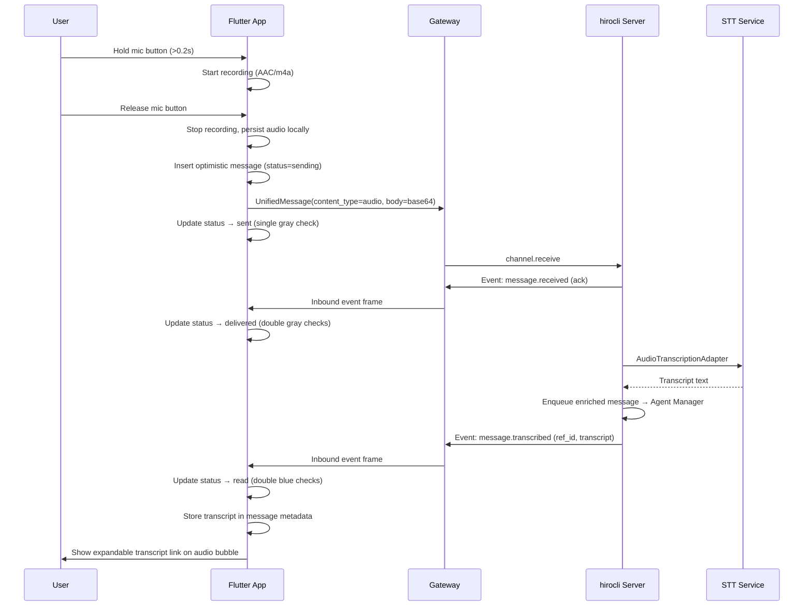
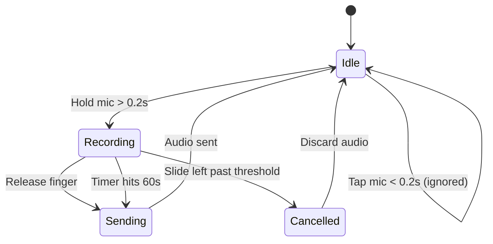

# Audio Messages Feature

## End-to-end flow




## 1. Flutter: new dependencies

Add to `[device_apps/pubspec.yaml](device_apps/pubspec.yaml)` via `flutter pub add` (gets latest stable):

- `**record**` — cross-platform audio recording (Web/iOS/Android), outputs AAC/m4a
- `**just_audio**` — playback with `setSpeed()` for 1x/1.5x/2x
- `**path_provider**` — local file paths on mobile for persisted audio

### Cross-platform recording notes

The `record` package uses the native MediaRecorder API on web and platform-native recorders on iOS/Android. AAC (m4a) is the target format — universally supported, small file size (~128kbps), and accepted by both OpenAI and Gemini STT APIs.

- **Mobile (iOS/Android)**: Records to a temp file, then copied to app documents dir via `path_provider`. Persists across app restarts.
- **Web**: Records to a blob via MediaRecorder. Playback via blob URL in memory. Audio does **not** survive page refresh — acceptable for dev. (Future: persist to IndexedDB if needed.)

## 2. Flutter: DB schema change (dev mode — no migration)

Add a nullable `metadata` TEXT column to `[messages_table.dart](device_apps/lib/data/local/database/tables/messages_table.dart)`:

```dart
TextColumn get metadata => text().nullable()();
```

In `[app_database.dart](device_apps/lib/data/local/database/app_database.dart)` — keep dev-mode approach. Bump `schemaVersion` to `2` with a **destructive fallback** (drop and recreate all tables on version mismatch):

```dart
@override
int get schemaVersion => 2;

@override
MigrationStrategy get migration => MigrationStrategy(
  onCreate: (m) => m.createAll(),
  onUpgrade: (m, from, to) async {
    // Dev mode: nuke and recreate
    for (final table in allTables) {
      await m.deleteTable(table.actualTableName);
    }
    await m.createAll();
  },
);
```

Update `[messages_dao.dart](device_apps/lib/data/local/database/daos/messages_dao.dart)` — add `updateMetadata()`:

```dart
Future<void> updateMetadata(String messageId, String metadata) async {
  await (update(messages)..where((m) => m.id.equals(messageId)))
      .write(MessagesCompanion(metadata: Value(metadata)));
}
```

## 3. Flutter: domain model changes

In `[message_content.dart](device_apps/lib/domain/models/message/message_content.dart)`, add `AudioContent`:

```dart
final class AudioContent extends MessageContent {
  const AudioContent({
    required this.durationMs,
    this.localPath,
    this.transcript,
    this.mimeType = 'audio/m4a',
  });

  final int durationMs;
  final String? localPath;   // file path (mobile) or blob URL (web)
  final String? transcript;
  final String mimeType;

  AudioContent copyWithTranscript(String transcript) => AudioContent(
    durationMs: durationMs,
    localPath: localPath,
    transcript: transcript,
    mimeType: mimeType,
  );

  @override
  MessageType get type => MessageType.voice;
}
```

Update `_rowToMessage` in `[message_repository_impl.dart](device_apps/lib/data/repositories/message_repository_impl.dart)` to parse `contentType == 'audio'` using the metadata JSON column:

```dart
'audio' => _parseAudioContent(row),
```

## 4. Flutter: audio recording service

Create `device_apps/lib/domain/services/audio_recording_service.dart`:

- Wraps the `record` package's `AudioRecorder`
- `startRecording()` — records to a temp file in AAC/m4a format (`AudioEncoder.aacLc`)
- `stopRecording()` — returns `({String path, int durationMs, Uint8List bytes})`
- `cancelRecording()` — stops and deletes temp file
- `isRecording` ValueNotifier for UI state
- Timer enforces **60-second max** — auto-stops and returns result
- `dispose()` cleans up recorder

## 5. Flutter: audio storage service

Create `device_apps/lib/platform/storage/audio_storage_service.dart`:

- **Mobile**: copies temp recording to `getApplicationDocumentsDirectory()/audio/{messageId}.m4a`. Returns file path.
- **Web**: creates blob URL from bytes via `dart:html` / `web` package. Returns blob URL string.
- `loadAudioBytes(messageId)` — reads bytes from stored file (mobile) for base64 encoding
- Platform detection via `kIsWeb`

## 6. Flutter: message input bar redesign

Modify `[message_input_bar.dart](device_apps/lib/features/chat/widgets/input_bar/message_input_bar.dart)`:

**State machine:**




**UI layout during recording** (replaces TextField):

```
[ < Slide to cancel     00:05  (( mic )) ]
```

- Left: chevron + "Slide to cancel" text (fades in)
- Center/right: elapsed timer (mm:ss format)
- Right edge: mic icon with pulsing circular highlight
- Use `GestureDetector` with `onLongPressStart` / `onLongPressMoveUpdate` / `onLongPressEnd`
- `longPressMinDelay: Duration(milliseconds: 200)` to distinguish tap from hold
- `AnimatedContainer` for the recording overlay transition

**Idle state** — when no text is typed, show mic icon instead of send button. When text is typed, show send button (current behavior). Use `AnimatedSwitcher` for smooth transition.

## 7. Flutter: audio bubble widget

Create `device_apps/lib/features/chat/widgets/message_bubble/audio_bubble.dart`:

- **Play/pause** toggle icon button (uses `just_audio` `AudioPlayer`)
- **Seek bar** — `Slider` bound to player position/duration
- **Duration label** — shows remaining time while playing, total duration when paused
- **Speed button** — cycles through 1x / 1.5x / 2x, displayed as small text chip
- **Expandable transcript** — "Transcript" link text below the player bar. Tapping toggles `AnimatedCrossFade` to show/hide the transcript text. Only visible when `content.transcript != null`.
- Same bubble styling (colors, alignment, border radius) as `TextBubble`
- Disposes player when widget unmounts

Wire into `[message_bubble.dart](device_apps/lib/features/chat/widgets/message_bubble/message_bubble.dart)`:

```dart
final AudioContent c => AudioBubble(message: message, content: c),
```

## 8. Flutter: delivery check marks

Add check mark indicators to outbound message bubbles in `[text_bubble.dart](device_apps/lib/features/chat/widgets/message_bubble/text_bubble.dart)` and the new `audio_bubble.dart`:


| Status      | Icon         | Color          |
| ----------- | ------------ | -------------- |
| `sending`   | Clock icon   | Gray           |
| `sent`      | Single check | Gray           |
| `delivered` | Double check | Gray           |
| `read`      | Double check | Blue (primary) |
| `failed`    | Error icon   | Red            |


Extract a shared `DeliveryIndicator` widget used by both bubble types, placed next to the timestamp. Only shown on outbound (`isOutbound == true`) messages.

## 9. Flutter: send flow

Add `sendAudio()` to `[message_send_notifier.dart](device_apps/lib/application/messages/message_send_notifier.dart)`:

1. Save recording via `AudioStorageService` (persist to file on mobile, blob URL on web)
2. Read bytes from recording, base64-encode
3. Build metadata JSON: `{"duration_ms": ..., "mime_type": "audio/m4a", "local_path": "..."}`
4. Insert optimistic row into DB: `contentType: 'audio'`, `body: ''`, `metadata: metadataJson`, `status: sending`
5. Build `UnifiedMessage` with `ContentItem(contentType: 'audio', body: base64Data, metadata: {duration_ms, mime_type})`
6. Send via `gateway.send()`
7. Update status to `sent`

## 10. Flutter: receive flow

Modify `[message_repository_impl.dart](device_apps/lib/data/repositories/message_repository_impl.dart)` `_onInboundFrame`:

### Handle event frames (NEW)

Currently the method returns early for `msg.messageType != 'message'`. Change to also handle `'event'`:

```dart
if (msg.messageType == 'event' && msg.event != null) {
  await _handleEvent(msg);
  return;
}
```

`**_handleEvent()**`:

- `message.received` — call `_messagesDao.updateStatus(event.refId, 'delivered')` (gray double check)
- `message.transcribed` — call `_messagesDao.updateStatus(event.refId, 'read')` (blue double check) AND call `_messagesDao.updateMetadata(event.refId, jsonEncode({...existing, 'transcript': event.data['transcript']}))`

### Handle inbound audio messages

When processing `content_type == 'audio'` items:

1. Decode base64 body from `ContentItem`
2. Save to local storage via `AudioStorageService`
3. Insert DB row with `contentType: 'audio'`, `body: ''`, `metadata: {duration_ms, mime_type, local_path}`

## 11. Server: emit `message.transcribed` event

Modify `[communication_manager.py](hiroserver/hirocli/src/hirocli/runtime/communication_manager.py)` `_adapt_and_queue`:

After the adapter pipeline completes successfully, check for audio content items with transcripts. Emit a `message.transcribed` event for each:

```python
from hiro_channel_sdk.constants import EVENT_TYPE_MESSAGE_TRANSCRIBED

# After pipeline and before inbound_queue.put_nowait:
for item in msg.content:
    if item.content_type == "audio" and "description" in item.metadata:
        await self.enqueue_outbound(UnifiedMessage(
            message_type=MESSAGE_TYPE_EVENT,
            routing=MessageRouting(
                channel=msg.routing.channel,
                direction="outbound",
                sender_id="server",
                recipient_id=msg.routing.sender_id,
                metadata=msg.routing.metadata,
            ),
            event=EventPayload(
                type=EVENT_TYPE_MESSAGE_TRANSCRIBED,
                ref_id=msg.routing.id,
                data={"transcript": item.metadata["description"]},
            ),
        ))
```

The `EVENT_TYPE_MESSAGE_TRANSCRIBED` constant (`"message.transcribed"`) already exists in `[constants.py](hiroserver/hiro-channel-sdk/src/hiro_channel_sdk/constants.py)`. The AgentManager already correctly uses `metadata["description"]` for LLM input — no server-side agent changes needed.

## 12. Documentation updates

### Add sequence diagram to mintdocs

Add the end-to-end audio message flow sequence diagram to `[message-adapter-pipeline.mdx](mintdocs/architecture/message-adapter-pipeline.mdx)` as a new section **"End-to-end audio message flow"** before "See also". This shows the full round-trip including the device, gateway, server, and STT service with delivery status updates.

Also update `[communication-manager.mdx](mintdocs/architecture/communication-manager.mdx)`:

- In the "Channel events vs message events" section, note that `message.transcribed` events are now actively emitted after audio adapter processing, carrying the transcript back to the sending device for display.

### Update AGENTS.md diagram rules

In `[mintdocs/AGENTS.md](mintdocs/AGENTS.md)`, update the diagram rules section to add `sequenceDiagram` as a recommended diagram type:

```
- Use `graph LR` (left-right) for topology diagrams and diagrams with few steps
- Use `graph TD` (top-down) for sequential step-by-step flows with many serial steps
- Use `sequenceDiagram` for multi-party interaction flows showing request/response patterns, event exchanges, or protocol handshakes between distinct participants (e.g. device, gateway, server)
```

After authoring diagrams, remind to run `uv run python diagram-gen/generate.py`.

## File change summary


| File                                                                           | Change                                                      |
| ------------------------------------------------------------------------------ | ----------------------------------------------------------- |
| `device_apps/pubspec.yaml`                                                     | Add `record`, `just_audio`, `path_provider` (latest stable) |
| `device_apps/lib/data/local/database/tables/messages_table.dart`               | Add nullable `metadata` column                              |
| `device_apps/lib/data/local/database/app_database.dart`                        | Bump schema v2, destructive migration (dev mode)            |
| `device_apps/lib/data/local/database/daos/messages_dao.dart`                   | Add `updateMetadata()`                                      |
| `device_apps/lib/domain/models/message/message_content.dart`                   | Add `AudioContent` class                                    |
| `device_apps/lib/domain/services/audio_recording_service.dart`                 | **New** — recording wrapper                                 |
| `device_apps/lib/platform/storage/audio_storage_service.dart`                  | **New** — platform-aware audio persistence                  |
| `device_apps/lib/features/chat/widgets/input_bar/message_input_bar.dart`       | Mic button + recording overlay UI                           |
| `device_apps/lib/features/chat/widgets/message_bubble/audio_bubble.dart`       | **New** — playback + transcript widget                      |
| `device_apps/lib/features/chat/widgets/message_bubble/message_bubble.dart`     | Route `AudioContent` to `AudioBubble`                       |
| `device_apps/lib/features/chat/widgets/message_bubble/text_bubble.dart`        | Add `DeliveryIndicator` for check marks                     |
| `device_apps/lib/features/chat/widgets/message_bubble/delivery_indicator.dart` | **New** — shared check mark widget                          |
| `device_apps/lib/application/messages/message_send_notifier.dart`              | Add `sendAudio()`                                           |
| `device_apps/lib/data/repositories/message_repository_impl.dart`               | Handle audio inbound + events (ack, transcribed)            |
| `hiroserver/hirocli/src/hirocli/runtime/communication_manager.py`              | Emit `message.transcribed` event after adaptation           |
| `hiro-docs/mintdocs/architecture/message-adapter-pipeline.mdx`                 | Add end-to-end audio sequence diagram                       |
| `hiro-docs/mintdocs/architecture/communication-manager.mdx`                    | Update message events section                               |
| `hiro-docs/mintdocs/AGENTS.md`                                                 | Add `sequenceDiagram` to diagram rules                      |


