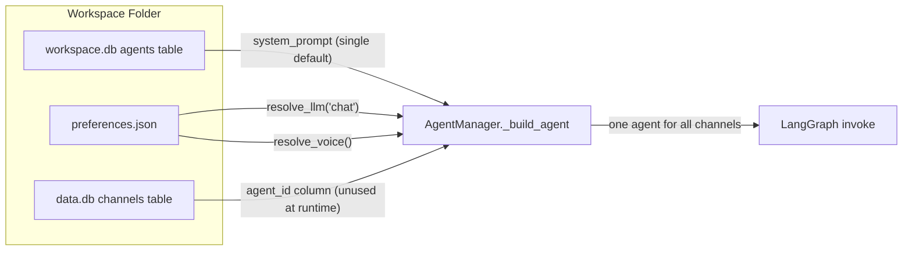
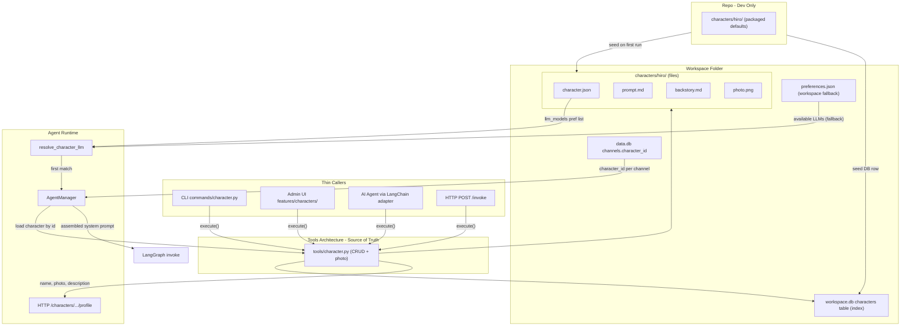
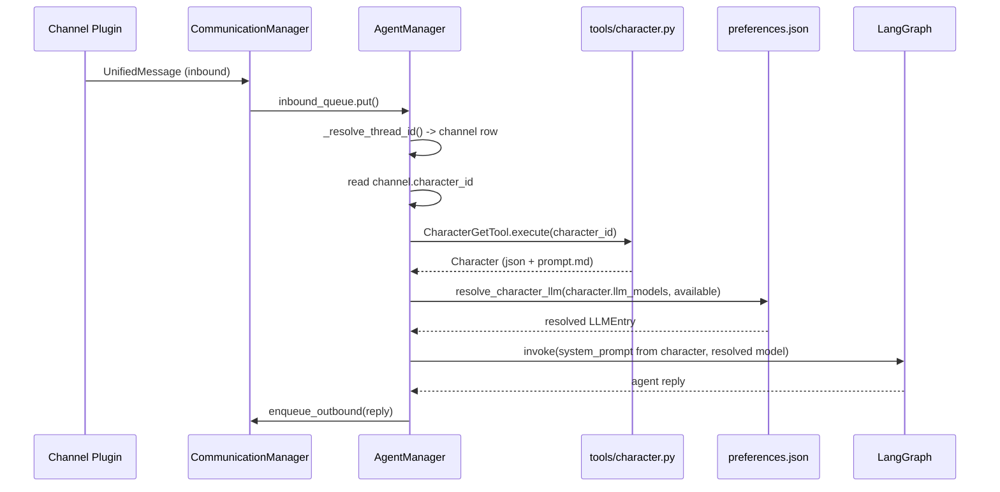

# Character Entity v2 Implementation

Design doc: [character_entity_design_v2.md](d:\projects\hiroleague-website\docs\character_entity_design_v2.md)

## Design principles

**Characters configure, agents execute.** A character owns personality (prompt, backstory, photo) and model/voice preferences. The agent runtime (LangGraph graph, tool wiring, checkpointer, invoke loop) owns the execution flow. A character changes *who* the agent runs as and *with what* models -- never *how* it runs.

**Tools Architecture is the foundation.** All character operations are defined as Tool classes in `tools/character.py` following the [Tools Architecture](d:\projects\hiro-docs\mintdocs\architecture\tools-architecture.mdx). Each tool has a single `execute()` method with all logic. CLI commands, admin UI, AI agent, and HTTP `/invoke` are thin callers -- they own rendering and transport, not logic. No character logic lives outside tools.

**Dual storage: DB index + file content.** The `characters` table in `workspace.db` is the index and FK target (for `channels.character_id`). The `characters/<id>/` folder holds content blobs (prompt.md, backstory.md, photo, character.json). Tools keep both in sync -- files are the content authority; DB is the relational authority.

## Architecture (current vs target)

### Current state




**Key gaps:** Single system prompt for all channels. `agent_id` on channels is stored but never read at invoke time. No character concept, no per-channel persona, no profile API.

### Target state




## Data flow: message through character-aware agent




## Files that change (key touchpoints)

- **New: [domain/character.py](hiroserver/hirocli/src/hirocli/domain/character.py)** -- `Character` pydantic model, file I/O helpers (load/save JSON + md), seed from packaged defaults
- **New: [tools/character.py](hiroserver/hirocli/src/hirocli/tools/character.py)** -- All CRUD tools (list, get, create, update, upload photo, delete). Single source of truth for all character operations
- **New: [commands/character.py](hiroserver/hirocli/src/hirocli/commands/character.py)** -- Thin CLI wrappers calling tools
- **New: [admin/features/characters/](hiroserver/hirocli/src/hirocli/admin/features/characters/)** -- Admin UI page (service, controller, page, components)
- **New: Repo `characters/hiro/`** -- Default character files packaged with app
- [domain/db.py](d:\projects\hiroleague\hiroserver\hirocli\src\hirocli\domain\db.py) -- Replace `agents` table with `characters` table (id, name, is_default, folder_path, created_at, updated_at)
- [domain/data_store.py](d:\projects\hiroleague\hiroserver\hirocli\src\hirocli\domain\data_store.py) -- `channels.agent_id` becomes `channels.character_id`; seed default channel with `"hiro"`
- [domain/preferences.py](d:\projects\hiroleague\hiroserver\hirocli\src\hirocli\domain\preferences.py) -- Add `resolve_character_llm(ordered_ids, pool)` and `resolve_character_voice(ordered_ids, pool)`
- [runtime/agent_manager.py](d:\projects\hiroleague\hiroserver\hirocli\src\hirocli\runtime\agent_manager.py) -- `_build_agent` per-character; `_process` loads character from channel, assembles prompt, selects model
- [runtime/server_process.py](d:\projects\hiroleague\hiroserver\hirocli\src\hirocli\runtime\server_process.py) -- Seed characters on startup
- [runtime/http_server.py](d:\projects\hiroleague\hiroserver\hirocli\src\hirocli\runtime\http_server.py) -- Profile endpoints
- [hiro-commons constants](d:\projects\hiroleague\hiroserver\hiro-commons\src\hiro_commons\constants\storage.py) -- Add `CHARACTERS_DIR = "characters"`, `DEFAULT_CHARACTER_ID = "hiro"`
- **Delete: [domain/agent_config.py](d:\projects\hiroleague\hiroserver\hirocli\src\hirocli\domain\agent_config.py)** -- Replaced entirely by character domain + tools

## `characters` table in workspace.db

Replaces the `agents` table. This is the **relational index**, not the content store.

```sql
CREATE TABLE IF NOT EXISTS characters (
    id          TEXT PRIMARY KEY,   -- slug, matches folder name
    name        TEXT NOT NULL,      -- display name
    is_default  INTEGER NOT NULL DEFAULT 0,
    folder_path TEXT NOT NULL,      -- relative to workspace, e.g. "characters/hiro"
    created_at  TEXT NOT NULL DEFAULT '',
    updated_at  TEXT NOT NULL DEFAULT ''
)
```

`channels.character_id` in `data.db` references `characters.id` conceptually (cross-DB, same as today's `agent_id` pattern).

## Phases

**Order note:** Phases 1–3 deliver a usable character system (foundation, then tools/CLI, then admin). Until Phase 4 lands, `data_store` still references `get_default_agent_id` if you replace `agents` in Phase 1 — either implement Phases 1–4 in one branch without long-lived broken trunk, or temporarily keep both `agents` and `characters` tables until Phase 4 (plan assumes sequential delivery; prefer not leaving main broken).

### Phase 1 -- Foundation (domain, DB, packaged defaults, seed)

**Goal:** Character data model, workspace layout, and DB index exist; default `hiro` is seeded on disk and in `workspace.db`. No tools or UI yet.

- [hiro-commons/constants/storage.py](d:\projects\hiroleague\hiroserver\hiro-commons\src\hiro_commons\constants\storage.py): add `CHARACTERS_DIR = "characters"`, `DEFAULT_CHARACTER_ID = "hiro"`
- New `domain/character.py`:
  - `Character` pydantic model: id, name, description, llm_models, voice_models, emotions_enabled, extras
  - `prompt` / `backstory` loaded from `.md` files; `has_photo`, optional `photo_filename`
  - File I/O: `load_character_from_disk`, `save_character_to_disk`, `list_character_dirs`
  - `seed_default_characters(workspace_path)`: copy packaged `characters/hiro/` if missing; insert `hiro` row in `characters` table
- [domain/db.py](d:\projects\hiroleague\hiroserver\hirocli\src\hirocli\domain\db.py): replace `agents` DDL with `characters` DDL; update `_EXPECTED_COLUMNS`
- Repo packaged defaults: `characters/hiro/` with `character.json`, `prompt.md` (from current `_DEFAULT_SYSTEM_PROMPT`), `backstory.md`, `photo.png`
- Wire `seed_default_characters` from [server_process.py](d:\projects\hiroleague\hiroserver\hirocli\src\hirocli\runtime\server_process.py) early in startup (same timing as eventual full integration)
- Default fallback avatar asset path (for later serving when `has_photo` is false) can live in package data; document location for Phase 2–3

**Exit criteria:** Unit tests for load/save/seed; `hiro` appears after seed; DB has `characters` row.

### Phase 2 -- Character tools + CLI

**Goal:** All character mutations go through Tools Architecture; CLI can exercise the stack without admin.

- New [tools/character.py](hiroserver/hirocli/src/hirocli/tools/character.py) (pattern: [tools/device.py](d:\projects\hiroleague\hiroserver\hirocli\src\hirocli\tools\device.py)):
  - `CharacterListTool`, `CharacterGetTool`, `CharacterCreateTool`, `CharacterUpdateTool`, `CharacterUploadPhotoTool`, `CharacterDeleteTool` (guard: cannot delete default)
  - Typed result dataclasses per tool
- Register in [tools/**init**.py](d:\projects\hiroleague\hiroserver\hirocli\src\hirocli\tools__init__.py) `all_tools()` for agent + `POST /invoke`
- New [commands/character.py](hiroserver/hirocli/src/hirocli/commands/character.py): thin Typer wrappers (`list`, `get`, `create`, `update`, `delete`, `upload-photo` or equivalent)

**Exit criteria:** `hirocli character list` works; `GET /tools` lists character tools; create/update round-trip via CLI.

### Phase 3 -- Admin UI

**Goal:** Visual management and early UX feedback; every action calls tools (no duplicate logic).

- New `admin/features/characters/`: `service.py` (io_bound + tools), `controller.py`, `page.py`, `components.py` per [hiroadmin_guidelines.md](d:\projects\hiroleague-website\docs\hiroadmin_guidelines.md)
- List: cards (name, photo or fallback hint, description, default badge)
- Detail: name, description, prompt.md, backstory.md, model/voice lists, photo upload via `CharacterUploadPhotoTool`
- Register route in admin router/navigation

**Exit criteria:** Create/edit/list characters from admin; photo upload persists under workspace.

### Phase 4 -- Channel binding

**Goal:** Channels reference `character_id` instead of `agent_id`. Default channel points to `"hiro"`.

- [data_store.py](d:\projects\hiroleague\hiroserver\hirocli\src\hirocli\domain\data_store.py): rename `agent_id` to `character_id` in channels DDL and `_EXPECTED_COLUMNS`
- `_seed_defaults`: seed default channel with `character_id = "hiro"` (simple string, no cross-DB lookup needed since we know the default id)
- Drop `get_default_agent_id()` entirely
- [conversation_channel.py](d:\projects\hiroleague\hiroserver\hirocli\src\hirocli\domain\conversation_channel.py): update `ConversationChannel` model and `create_channel` to use `character_id`
- [tools/conversation.py](d:\projects\hiroleague\hiroserver\hirocli\src\hirocli\tools\conversation.py): `ConversationChannelCreateTool` takes `character_id` param
- **Delete** [domain/agent_config.py](d:\projects\hiroleague\hiroserver\hirocli\src\hirocli\domain\agent_config.py) -- fully replaced by character domain + tools
- Update any remaining references to `agent_id` in conversation tools and data layer

### Phase 5 -- Character-aware agent invocation

**Goal:** AgentManager loads the character for each channel and uses its prompt and model preferences. Characters drive personality; the agent drives the flow.

- [preferences.py](d:\projects\hiroleague\hiroserver\hirocli\src\hirocli\domain\preferences.py): add `resolve_character_llm(preferred_ids: list[str], prefs: WorkspacePreferences) -> LLMEntry | None`:
  - Walk the character's ordered `llm_models` list
  - Return the first id that matches an entry in `prefs.llm.registered`
  - If none match, fall back to `resolve_llm(prefs, "chat")` (workspace default)
- Same pattern: `resolve_character_voice(preferred_ids, prefs) -> VoiceOption | None`
- [agent_manager.py](d:\projects\hiroleague\hiroserver\hirocli\src\hirocli\runtime\agent_manager.py):
  - `_build_agent` accepts a `Character` and uses `character.prompt` as system prompt, resolved LLM from character prefs
  - `_process` reads `character_id` from the conversation channel row, loads character via `CharacterGetTool`, builds/caches agent per character
  - Agent cache keyed by `(character_id, resolved_llm_id)` -- model preference changes rebuild the agent
  - System prompt assembly: `prompt.md` content injected as system message
- TTS voice selection: use `resolve_character_voice` when synthesizing replies for a channel's character
- Startup ordering: `seed_default_characters` must run before `ensure_data_db` (wired in Phase 1; verify after Phase 4 channel seed uses `character_id`)

### Phase 6 -- Profile API for Flutter

**Goal:** Flutter app can fetch and display character profile.

- [http_server.py](d:\projects\hiroleague\hiroserver\hirocli\src\hirocli\runtime\http_server.py):
  - `GET /characters` -- list of `{id, name, description, has_photo}`
  - `GET /characters/{id}/profile` -- `{id, name, description, has_photo, updated_at}`
  - `GET /characters/{id}/photo` -- serves the photo file from disk (or default fallback)
- All endpoints public within workspace (no additional auth)
- `updated_at` from DB row for client-side cache invalidation

### Phase 7 -- Resolved preferences UX in admin

**Goal:** Admin shows which model/voice will actually apply for each character.

- Character detail page in admin: "Resolved configuration" section
- For each entry in `llm_models`: show availability status against `preferences.json` registered models
- Highlight which model is selected (first available match)
- Same visualization for `voice_models`
- If all preferences miss, show workspace fallback with explanation
- Reuses `resolve_character_llm` / `resolve_character_voice` from Phase 5

## Default character: hiro

Repo layout (packaged into app):

```
characters/
  hiro/
    character.json
    prompt.md
    backstory.md
    photo.png        <-- Hiro avatar
```

`character.json`:

```json
{
  "id": "hiro",
  "name": "Hiro",
  "description": "Your personal AI assistant running on Hiro League.",
  "llm_models": [],
  "voice_models": [],
  "emotions_enabled": false,
  "extras": {}
}
```

Empty preference lists = use workspace defaults (same behavior as today). `prompt.md` inherits the current `_DEFAULT_SYSTEM_PROMPT` text.

**Photo fallback:** A generic default avatar is shipped with the app. Any character without an uploaded photo uses this fallback. Admin UI shows a visual hint (e.g. badge, muted style) encouraging photo upload. The fallback is **not** copied into each character folder -- it is served from a shared location when `has_photo` is false.

## What does NOT change

- `preferences.json` structure (workspace-level LLM/voice registry stays as-is)
- `CommunicationManager` routing (still plugin-channel based)
- LangGraph checkpointer (still keyed by conversation channel id)
- `workspace.db` for devices and channel_plugins (unchanged tables)
- TTS/STT service interfaces (consume resolved voice/llm as before, just from character prefs now)

## Breaking changes (recreate workspace required)

- `agents` table replaced by `characters` table in `workspace.db`
- `channels.agent_id` renamed to `channels.character_id` in `data.db`
- New `characters/` folder in workspace
- Default channel seeded with `character_id = "hiro"` instead of a UUID
- `domain/agent_config.py` deleted

