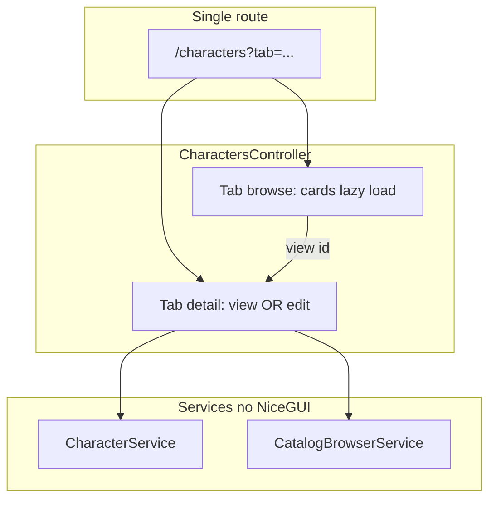

# Characters admin: tabbed Browse + Detail (view/edit), markdown, client crop

## Scope (confirmed)

- **Shell**: **Option A** — single route `**/characters`** using the **tabbed page pattern** ([hiroadmin guidelines §1.6](d:/projects/hiro-docs/docs/hiroadmin_guidelines.md), reference `[tabbed_demo/controller.py](d:/projects/hiroleague/hiroserver/hirocli/src/hirocli/admin/features/tabbed_demo/controller.py)`).
- **Tab 1 — Browse**: same **card grid** as today; primary action is **view** (icon or button) that switches to Tab 2 in **view** mode. **New character** opens Tab 2 in **edit** mode with no `character_id` (create flow).
- **Tab 2 — Detail**: opens in **view mode** (read-only: structured labels, `ui.markdown` for prompt/backstory, avatar). **Edit** switches to **edit mode** in the **same tab** (no modal). **Cancel** returns to view mode (reload from service if needed).
- **Markdown**: **split view only** in **edit** mode (textarea + live `ui.markdown` preview) — no WYSIWYG, no Write/Preview tabs.
- **Photo**: **true client-side crop** (Cropper.js) before upload.
- **Remove** the current `[ui.dialog](d:/projects/hiroleague/hiroserver/hirocli/src/hirocli/admin/features/characters/controller.py)` editor entirely.

## Architecture

- **[characters/service.py](d:/projects/hiroleague/hiroserver/hirocli/src/hirocli/admin/features/characters/service.py)**: unchanged role — facade over character tools; optional thin catalog helpers or call `**CatalogBrowserService`** from controller only.
- **[catalog/service.py](d:/projects/hiroleague/hiroserver/hirocli/src/hirocli/admin/features/catalog/service.py)**: `list_models` with `model_kind="chat"` / `"tts"` per [character tool validation](d:/projects/hiroleague/hiroserver/hirocli/src/hirocli/tools/character.py).

## 1. Page, query params, and §1.6 mechanics

- **One** `@admin_router.page("/characters")` in **[characters/page.py](d:/projects/hiroleague/hiroserver/hirocli/src/hirocli/admin/features/characters/page.py)** with FastAPI-style query parameters, e.g.:
  - `tab`: `browse` | `detail` (default `browse`).
  - `character_id`: optional string; absent = create flow when combined with edit mode.
  - `mode`: `view` | `edit` (default `view` when `character_id` set; default `edit` when opening **New** with no id).
- Build `**TabNavRequest`** from those params ([shared/tab_nav.py](d:/projects/hiroleague/hiroserver/hirocli/src/hirocli/admin/shared/tab_nav.py)); use `filters` for `character_id` and `mode` (or extend the dataclass usage consistently with how LLM page does it).
- `**CharactersPageController`** (rename/split from current controller as needed):
  - Constants: `TABS`, `DEFAULT_TAB`, `STORAGE_KEY = "characters.active_tab"`, `PAGE_PATH = "/characters"`.
  - `**__init__`**: store `nav`; **do not** touch `app.storage.tab`.
  - `**mount`**: `await ui.context.client.connected()` then `**_init_tab_state()`** — same rules as §1.6.2 (URL tab → storage → default; seed per-tab filter dict with `character_id` / `mode` from `nav`).
  - `**ui.tabs` + `ui.tab_panels**`: both `**bind_value(app.storage.tab, STORAGE_KEY)**` and `**value=initial_tab**` on first paint.
  - `**tabs.on_value_change**`: lazy-mark tab loaded, refresh refreshables, `**_sync_url**` via `history.replaceState` (copy pattern from `[TabbedDemoController](d:/projects/hiroleague/hiroserver/hirocli/src/hirocli/admin/features/tabbed_demo/controller.py)`).
- `**@ui.refreshable` per tab**: `_render_browse`, `_render_detail`. Guard heavy fetches with `_loaded` so inactive tab does not list/load character until visited.

## 2. Browse tab

- Card grid behavior aligned with current **[controller.py](d:/projects/hiroleague/hiroserver/hirocli/src/hirocli/admin/features/characters/controller.py)** list section (uses `**CharacterService.list_characters_with_preview_images`**).
- Each card: **View** control (icon) → `switch_to_tab("detail", character_id=..., mode="view")` (or equivalent storage + filter update + refresh + URL sync).
- Toolbar: **New character** → `switch_to_tab("detail", character_id=None, mode="edit")` (clear id in filters).

## 3. Detail tab — view vs edit (same tab)

- **State**: `_detail_character_id: str | None`, `_detail_mode: "view" | "edit"`, optional `_dirty` for form edits.
- **View mode**: load character via `**get_character`** + photo via `**character_detail_photo_data_url`**; render read-only layout (sections, `ui.markdown` for prompt/backstory). Show `**error_banner` / notify** when photo result is not ok (fix silent failure today).
- **Edit mode**: same fields as current dialog but relaxed layout; **split markdown** widgets for prompt/backstory; model multi-selects; avatar + Cropper (edit only).
- **Edit** button (view only): set `mode=edit`, refresh detail panel, sync URL.
- **Cancel** (edit): if dirty, confirm discard; else switch to `view` and reload.
- **Save**: `create_character` when no id / new flow; else `update_character`; on successful **create**, set `_detail_character_id`, stay on **detail** tab in **view** or **edit** (recommend **view** after save, or **edit** if you want immediate photo upload — pick **edit** briefly or show upload in view for new saves — simplest: after create, `mode=edit` with id so user can upload avatar without extra click).
- **Delete** (edit, when not default): `**confirm_dialog`**; on success, `switch_to_tab("browse")` and refresh browse.

## 4. Markdown (edit only)

- **[components.py](d:/projects/hiroleague/hiroserver/hirocli/src/hirocli/admin/features/characters/components.py)**: `markdown_split_field` — two columns (stack on narrow): `ui.textarea` + debounced `ui.markdown` preview; storage unchanged strings.

## 5. Models (edit only, lazy)

- Multi-select from `**CatalogBrowserService.list_models`**; **lazy-load** catalog when user first enters **edit** mode on detail tab (or first time Models section is shown) to avoid cost on browse-only visits.
- Serialize to existing JSON array strings for `**CharacterService`** validation/save.
- Optional collapsed **Advanced** JSON textareas for power users.

## 6. Photo (edit only)

- **[styles.py](d:/projects/hiroleague/hiroserver/hirocli/src/hirocli/admin/features/characters/styles.py)**: Cropper.js + CSS via `ui.add_head_html` (guidelines §3.3).
- Single **Avatar** block: square frame, crop workflow, bridge to temp file + `**upload_photo`**. Character must exist — satisfied after first save on create flow.
- Cap exported canvas size in JS if needed to keep base64 payload reasonable.

## 7. Tests and docs

- Extend **[characters/tests/test_service.py](d:/projects/hiroleague/hiroserver/hirocli/src/hirocli/admin/features/characters/tests/test_service.py)** only if new service surface.
- Optional: short **Characters** bullet under §1.6 or a new subsection in [hiroadmin_guidelines.md](d:/projects/hiro-docs/docs/hiroadmin_guidelines.md) describing browse/detail + view/edit as a tabbed variant.

## 8. Risks / notes

- **Unsaved edits**: when switching from detail to browse or changing `character_id`, prompt if `_dirty`.
- `**app.storage.tab`** only after `client.connected()` — strict §1.6.6 compliance.
- **Initial development mode**: no backward compatibility; no schema migration; bookmark URLs change to query form (`/characters?tab=detail&...`).

## Reflecting updates (for you after implementation)

- No separate workspace reset; users with old bookmarks to plain `/characters` still land on Browse.
- If anything is documented as `/characters/create`, update to query-based URLs in internal docs.

