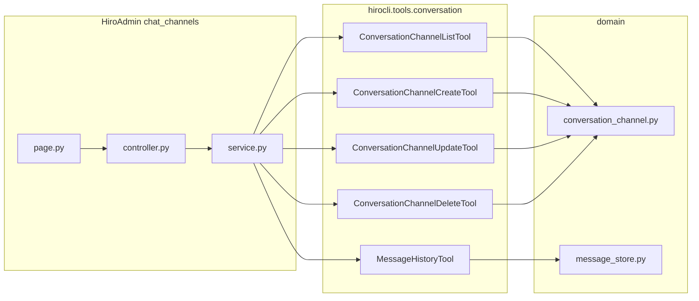

# Chat channels: tools, history, and admin UI

## Scope and constraints

- **Routes:** Keep `**/chats`** and existing Server `**/channels`** paths and nav targets unchanged (no URL renames).
- **Docs:** No updates to [hiro-docs/docs/hiroadmin_guidelines.md](d:/projects/hiro-docs/docs/hiroadmin_guidelines.md) or Mintlify in this work.
- **Backward compatibility:** Not required; safe to extend tool params (e.g. optional `limit`) as long as defaults preserve current agent/CLI behavior where sensible.

## 1. Domain: update and delete conversation channels

**File:** [hiroserver/hirocli/src/hirocli/domain/conversation_channel.py](d:/projects/hiroleague/hiroserver/hirocli/src/hirocli/domain/conversation_channel.py)

Add synchronous helpers alongside `create_channel`:

- `**update_channel(workspace_path, channel_id, *, name=..., type=..., agent_id=..., user_id=...)`** — only update fields that are passed; reload row after write. Enforce the same **unique `(user_id, name)`** rule as `create_channel` (if name or user_id changes, check for conflicts excluding the current row).
- `**delete_channel(workspace_path, channel_id)**` — `messages.channel_id` references `channels(id)` in [data_store.py](d:/projects/hiroleague/hiroserver/hirocli/src/hirocli/domain/data_store.py). **Delete dependent `messages` rows first**, then delete the channel row, so behavior is correct even if SQLite foreign keys are not pragma-enabled everywhere.

Use existing patterns: `ensure_data_db`, `sqlite3.connect`, `row_factory`, commit, clear error messages (`ValueError` for not found / duplicate name).

## 2. Tools: `conversation_channel_update` and `conversation_channel_delete`

**File:** [hiroserver/hirocli/src/hirocli/tools/conversation.py](d:/projects/hiroleague/hiroserver/hirocli/src/hirocli/tools/conversation.py)

Mirror style of [character.py](d:/projects/hiroleague/hiroserver/hirocli/src/hirocli/tools/character.py) update/delete tools:

- `**ConversationChannelUpdateTool`** — params: `channel_id` (required), optional `channel_name`, `channel_type`, `agent_id`, `user_id`, `workspace`; call `update_channel`; return dataclass with updated `channel` dict (or failure via raised `ValueError` caught by admin service).
- `**ConversationChannelDeleteTool`** — params: `channel_id`, `workspace`; call `delete_channel`; return simple success payload (e.g. `deleted_id`).

**Registry:** [hiroserver/hirocli/src/hirocli/tools/**init**.py](d:/projects/hiroleague/hiroserver/hirocli/src/hirocli/tools/__init__.py) — export both classes and append instances to `all_tools()` next to the existing conversation tools.

## 3. Message history: optional “all messages”

**Problem:** [message_store._sync_list](d:/projects/hiroleague/hiroserver/hirocli/src/hirocli/domain/message_store.py) always applies `LIMIT ?`; [MessageHistoryTool](d:/projects/hiroleague/hiroserver/hirocli/src/hirocli/tools/conversation.py) defaults `limit=50`.

**Suggested change:**

- In `**_sync_list`**, change signature to `limit: int | None = 50`. When `**limit is None`**, run the same `ORDER BY created_at ASC` query **without** a `LIMIT` clause (both the `after` and non-`after` branches).
- In `**list_messages`** (async wrapper), pass `limit` through the same way.
- In `**MessageHistoryTool`**, document `limit` as optional; use `**None` to mean no cap** (all messages for the channel). Keep **default `50`** for existing callers so agent/CLI behavior stays bounded unless they opt in.

Admin service will call with `limit=None` for the transcript tab.

## 4. HiroAdmin: tabbed feature at `/chats`

**Remove stub:** Delete the `("/chats", ...)` entry from [hiroserver/hirocli/src/hirocli/admin/stubs.py](d:/projects/hiroleague/hiroserver/hirocli/src/hirocli/admin/stubs.py) once the real page exists.

**New package:** `hirocli/admin/features/chat_channels/` (name avoids clashing with Server `features/channels/`):

| File            | Responsibility                                                                                                                                                                                                                                                                                                                                                                                               |
| --------------- | ------------------------------------------------------------------------------------------------------------------------------------------------------------------------------------------------------------------------------------------------------------------------------------------------------------------------------------------------------------------------------------------------------------ |
| `page.py`       | `@admin_router.page("/chats")`, `create_page_layout(active_path="/chats")`, query params: `tab`, `channel_id`; build `TabNavRequest`; `await ChatChannelsController(nav).mount()`.                                                                                                                                                                                                                           |
| `service.py`    | No NiceGUI; `Result[T]`; wraps list/get/create/update/delete tools + `MessageHistoryTool` with `workspace` = selected workspace name from [context.py](d:/projects/hiroleague/hiroserver/hirocli/src/hirocli/admin/context.py) helper; `asyncio.to_thread` for sync tool calls from async page/controller as needed.                                                                                         |
| `controller.py` | Same pattern as [tabbed_demo/controller.py](d:/projects/hiroleague/hiroserver/hirocli/src/hirocli/admin/features/tabbed_demo/controller.py): `STORAGE_KEY`, `bind_value`, `value=initial_tab`, lazy `_loaded`, `switch_to_tab`, `_sync_url` to `/chats?tab=...&channel_id=...`.                                                                                                                              |
| `components.py` | Tab 1: table + add/edit/delete (use shared [form_dialog](d:/projects/hiroleague/hiroserver/hirocli/src/hirocli/admin/shared/ui/form_dialog.py) / [confirm_dialog](d:/projects/hiroleague/hiroserver/hirocli/src/hirocli/admin/shared/ui/confirm_dialog.py) if consistent with other features). Tab 2: read-only **bubble** layout from `sender_type` / `body` / `created_at` (e.g. user vs agent alignment). |

**Behavior (from prior decisions):**

- **Tab 1:** Full CRUD on production data (via new tools).
- **Tab 2:** Read-only history; **click row** switches to messages tab with `channel_id`; if `**channel_id` absent**, use **first channel** from list order (same as `_list_channels`: most recently active first—document in code comment if that is the default).
- **Later:** composer/send can be a follow-up; out of scope here.

**Registration:** Import `chat_channels.page` in [run.py](d:/projects/hiroleague/hiroserver/hirocli/src/hirocli/admin/run.py) alongside other features.

**Nav:** Optional copy tweak only if desired (“Chat channels” label) — **path stays `/chats`** per your constraint; if label changes, only [navigation.py](d:/projects/hiroleague/hiroserver/hirocli/src/hirocli/admin/shell/navigation.py) string changes, not the route.

## 5. Tests

- **Service tests** (pytest, no NiceGUI): mock tools or use a temp workspace with `data.db` if you already have fixtures—follow [channels/service](d:/projects/hiroleague/hiroserver/hirocli/src/hirocli/admin/features/channels/) or character patterns.
- **Domain tests** (optional but valuable): update conflict, delete removes messages then channel.

## 6. What you need to do locally after merge

- None beyond usual: run admin and open `/chats`. Old bookmarks to `/chats` remain valid.

