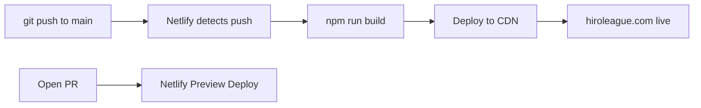

# HiroLeague Astro Website

## Theme & Stack

**Base theme:** [ctrimm/astro-genai-startup-theme](https://github.com/ctrimm/astro-genai-startup-theme) (MIT license)

Tech stack that comes with the theme:

- Astro 4.16 + React 18 + TypeScript
- Tailwind CSS v3 + shadcn/ui
- Framer Motion for animations
- @astrojs/mdx for blog content
- Dark/light mode already built in

We will upgrade to latest stable Astro (verify via web search at implementation time) and add ReactBits.

**Note:** Abiding by the no-backward-compatibility rule -- fresh scaffold, no migrations needed.

## ReactBits Integration

[ReactBits](https://github.com/DavidHDev/react-bits) (36k+ GitHub stars) is fully compatible. The theme already uses React + Tailwind + shadcn, and ReactBits installs via the same shadcn CLI pattern:

```bash
npx jsrepo add github/DavidHDev/react-bits/TextAnimations/BlurText
```

Components come as copy-pasted source files (TS+Tailwind variant), so zero runtime dependency. Plan to use:

- **BlurText** or **SplitText** -- hero headline animation
- **AnimatedContent** -- scroll-reveal for sections
- Background effects (e.g. **Hyperspeed**, **Threads**, or **Particles**) -- optional hero/page background flair

These are React components used as Astro islands with `client:load` or `client:visible` directives.

## Site Structure

```
hiroleague-website/
  src/
    components/
      ui/              # shadcn/ui primitives (from theme)
      reactbits/       # ReactBits components (copied via CLI)
      Header.tsx       # Logo, GitHub/Docs links, ThemeToggle
      Hero.tsx         # Project name, mysterious tagline, CTA
      Features.tsx     # What HiroLeague does (kept from theme)
      Waitlist.tsx     # Email input + "Notify me" (UI only for now)
      Footer.tsx       # Copyright, social links
      ThemeToggle.tsx  # Dark/light switch (from theme)
    layouts/
      main.astro       # Base layout
      blog-post.astro  # Blog post layout (new)
    pages/
      index.astro      # Landing page
      blog/
        index.astro    # Blog listing page (new)
    content/
      blog/
        welcome.mdx    # Sample blog article (new)
    styles/
      global.css       # Theme variables, brand colors
```

## Section-by-Section Plan

### Header

- Customize from theme's `Header.tsx`
- Logo: HiroLeague text/logo (left)
- Nav links: GitHub repo link, Docs link
- ThemeToggle button (already exists in theme)
- Mobile-responsive hamburger menu (already in theme)

### Hero / Main Area

- Mysterious, intriguing copy -- project name "HiroLeague" with a short enigmatic tagline
- Animated text using ReactBits (e.g. BlurText reveal)
- Gradient background animation (already in theme, can enhance with ReactBits background)
- CTA button scrolling down to waitlist

### Features Section

- Keep from theme, customize with HiroLeague feature cards
- 3-4 cards hinting at what the platform does

### Waitlist Section

- Replace the theme's newsletter section
- Email input + "Notify Me" button
- UI only for now (no backend wiring) -- form markup ready for future Netlify Forms / API integration

### Blog

- **New addition** -- theme has MDX support but no blog pages
- Blog listing page at `/blog/` using Astro content collections
- Blog post layout with title, date, reading time, content
- One sample article (`welcome.mdx`) as placeholder

### Footer

- Copyright line: "(c) 2026 HiroLeague. All rights reserved."
- Social links with icons: YouTube, Instagram, X (Twitter), LinkedIn, TikTok
- Use Lucide icons (already in theme dependencies)

## Deployment: Netlify (Recommended)

**Why Netlify over Vercel:**

- Your Vercel free tier already has a project running; Vercel hobby tier is limited to non-commercial use
- Netlify free tier: unlimited sites, custom domains with SSL, 300 credits/month, auto-deploy from Git
- Astro 6 "just works" on Netlify (zero-config)
- Built-in form handling (useful later for the waitlist)
- Deploy previews on every PR

**Automated commit-to-deploy flow:**




**Setup steps:**

1. Push `hiroleague-website` repo to GitHub (it already has its own `.git`)
2. Sign up at netlify.com (free, use GitHub OAuth)
3. "Import existing project" -- select the GitHub repo
4. Netlify auto-detects Astro: build command `npm run build`, publish dir `dist/`
5. Add custom domain `hiroleague.com` in Netlify dashboard
6. Update DNS: point hiroleague.com nameservers (or CNAME/A records) to Netlify
7. Netlify provisions SSL automatically
8. Every push to `main` triggers a new deploy (~30s build time for Astro)

**No GitHub Actions needed** -- Netlify's native Git integration handles it all.

## .gitignore Updates

Add to `hiroleague-website/.gitignore`:

```
node_modules/
dist/
.astro/
```

The parent repo already has `hiroleague-website/` in its `.gitignore`, so no changes needed there.

## What We Strip from the Theme

Remove these sections/pages that weren't requested:

- Pricing section (`Pricing.tsx`)
- Testimonials section (`Testimonials.tsx`)
- FAQ section (`FAQ.tsx`)
- The example markdown page (`markdown-page.md`)

