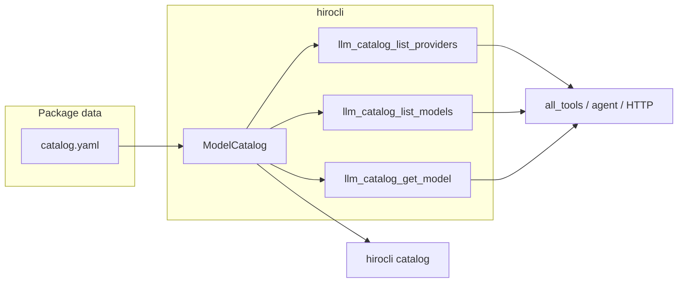

# LLM Catalog — Phase 1 plan

**Spec:** [hiroleague-website/docs/llm_catalog_design.md](d:/projects/hiroleague-website/docs/llm_catalog_design.md) (Phase 1 section only).

**Out of scope for this phase:** `SetupTool` env-key checks, character validation, admin UI, mintdocs, sync/overlay, local runtime probe.

## 1. Dependency and packaging

- Add **PyYAML** to [hiroserver/hirocli/pyproject.toml](d:/projects/hiroleague/hiroserver/hirocli/pyproject.toml) `dependencies`. Per project rules, use **WebSearch** at implementation time to pin a current stable version.
- Place `catalog.yaml` under a **Python package subtree** so the wheel includes it reliably, e.g. `hiroserver/hirocli/src/hirocli/catalog_data/catalog.yaml` plus `catalog_data/__init__.py` (minimal). Load via `importlib.resources.files("hirocli.catalog_data") / "catalog.yaml"` (or equivalent) so paths work when installed as a tool.
- If Hatch omits non-Python files, add an explicit include in `pyproject.toml` for that path (verify with `uv build` / wheel contents once).

## 2. Pydantic models and catalog service

- New module: `**hiroserver/hirocli/src/hirocli/domain/model_catalog.py`** (or `hirocli/catalog/service.py` if you prefer a small package; keep aligned with existing [character.py](d:/projects/hiroleague/hiroserver/hirocli/src/hirocli/domain/character.py) Pydantic style).
- Define models matching the design doc:
  - `**PricingBlock`** — optional per-field pricing + `pricing_updated_at`, `pricing_source`.
  - `**Provider`** — `id`, `display_name`, `hosting` (`Literal["cloud","local"]`), `credential_env_keys`, optional `docs_url`, `default_base_url`, `metadata_updated_at`, `notes`.
  - `**ModelSpec`** — `id`, `provider_id`, `display_name`, `model_kind`, optional `model_class`, `context_window`, `modalities` / `features` as lists or sets (YAML-friendly: lists; normalize to sets inside service if useful), optional `pricing`, optional `deprecated_since`, `replacement_id`.
  - Root `**CatalogDocument`** (or similar) with `catalog_version: int`, `providers: list[Provider]`, `models: list[ModelSpec]`.
- `**ModelCatalog` class:**
  - `from_yaml_path` / `load()` that parses YAML into `CatalogDocument`, validates cross-references (`model.provider_id` exists), and fails fast with a clear error on bad data.
  - `**get_provider`**, `**list_providers(hosting=None)`**
  - `**get_model**`, `**list_models(provider_id=None, model_kind=None, model_class=None, hosting=None)**` — for `hosting`, filter models whose provider matches that hosting.
  - `**list_credential_env_keys(provider_id=None)**` — sorted unique env names (even though Phase 1 does not wire setup yet, the design includes this API).
  - `**validate_model_ids(model_ids: list[str])**` — return a small `**ValidationResult**` (dataclass or Pydantic): `known`, `unknown`, `deprecated` (deprecated entries can carry `replacement_id` when present in catalog).
- **Caching:** module-level singleton or `functools.lru_cache` on a `get_model_catalog()` factory so repeated tool calls do not re-read/parse YAML every time.

## 3. Initial `catalog.yaml`

- Seed **few providers**: at minimum `openai`, `google` (or `gemini` per your naming), `anthropic` if you use it, plus **local** `ollama` (and optionally `lm_studio` / `jan` as stubs with `default_base_url` and empty keys).
- Seed **representative models** across kinds (not exhaustive): e.g. 1–2 **chat**, 1 **tts**, 1 **stt**, 1 **embedding** for cloud; 1–2 **chat** for local with `pricing: null` or omitted pricing block.
- Use **placeholder pricing** with realistic structure and `pricing_updated_at` / `pricing_source` so cost logic can be tested later; add a short comment in YAML that numbers are editorial.

## 4. Tools

- New file: `**hiroserver/hirocli/src/hirocli/tools/llm_catalog.py`**
- Follow [tools/base.py](d:/projects/hiroleague/hiroserver/hirocli/src/hirocli/tools/base.py) and patterns from [tools/media.py](d:/projects/hiroleague/hiroserver/hirocli/src/hirocli/tools/media.py):
  - `**LlmCatalogListProvidersTool`** — `name = "llm_catalog_list_providers"`, optional `hosting` param; result dataclass with serializable fields (e.g. list of provider dicts or nested dataclasses).
  - `**LlmCatalogListModelsTool`** — optional `provider_id`, `model_kind`, `model_class`, `hosting`.
  - `**LlmCatalogGetModelTool`** — required `model_id`; return full model + resolved provider summary (or nested structures); 404-style behavior: raise `**ValueError`** with a clear message if unknown (consistent with other tools).
- `**execute()`** must stay free of console/HTTP; only call `ModelCatalog` and return dataclasses.
- Register the three tool classes in [tools/**init**.py](d:/projects/hiroleague/hiroserver/hirocli/src/hirocli/tools/__init__.py) `**all_tools()`** list.

## 5. CLI

- New `**hiroserver/hirocli/src/hirocli/commands/catalog.py`** with `register(catalog_app, console)` mirroring [commands/character.py](d:/projects/hiroleague/hiroserver/hirocli/src/hirocli/commands/character.py):
  - `hirocli catalog providers [--hosting cloud|local]`
  - `hirocli catalog models` with optional `--provider`, `--kind`, `--class`, `--hosting`
  - `hirocli catalog model <model_id>`
  - `hirocli catalog env-keys` — prints `ModelCatalog.list_credential_env_keys()` (service-only helper; useful for operators even before SetupTool integration).
- Wire in [commands/app.py](d:/projects/hiroleague/hiroserver/hirocli/src/hirocli/commands/app.py): new `catalog_app` typer, `app.add_typer(catalog_app, name="catalog")`, `register_catalog_commands(...)`.

## 6. Tests

- `**hiroserver/hirocli/src/hirocli/domain/tests/test_model_catalog.py`** (or `tests/test_model_catalog.py` next to service if you prefer colocated tests like admin features):
  - Load a **minimal fixture YAML** (temp file or string) to test filters, `list_credential_env_keys`, and `validate_model_ids` (known / unknown / deprecated).
  - Test invalid YAML / broken `provider_id` reference raises appropriately.
- Optionally one smoke test that the **bundled** `catalog.yaml` loads in CI (catches packaging regressions).

## 7. Docs / dev environment

- Update [mintdocs/build/first-time-setup.mdx](d:/projects/hiro-docs/mintdocs/build/first-time-setup.mdx) only if the new dependency changes documented install or sync steps (project rule).

## 8. Code comments

- Where behavior is non-obvious (e.g. hosting filter join, validation buckets), add brief comments per workspace rule.

---

**Success criteria:** `uv run pytest` passes for new tests; `hirocli catalog providers` and `hirocli catalog model openai:gpt-4o` (or whatever id you seed) work; `GET /tools` lists the three new tool names when the server runs; agent receives the same tools via existing `all_tools()` wiring.