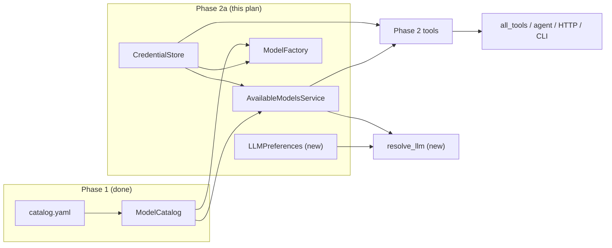

# LLM Catalog -- Phase 2a Plan

**Spec:** [hiroleague-website/docs/llm_catalog_design.md](d:/projects/hiroleague-website/docs/llm_catalog_design.md) (Phase 2a section, lines 847-858).
**Depends on:** Phase 1 (done) -- `ModelCatalog`, catalog tools, CLI, `catalog.yaml`.
**Out of scope:** Agent/TTS/STT wiring (Phase 2b), admin UI (Phase 3), OAuth / local discovery (Phase 4), sync (Phase 5), cost tracking (Phase 6).
**Project mode:** initial development -- no backward compatibility (per workspace rule).




---

## 1. Add `keyring` dependency

- Add `keyring>=25.7` to [hiroserver/hirocli/pyproject.toml](hiroserver/hirocli/pyproject.toml) `dependencies`. Use WebSearch at implementation time to verify latest stable.
- Add `PROVIDERS_FILENAME = "providers.json"` to [hiro-commons/src/hiro_commons/constants/storage.py](hiroserver/hiro-commons/src/hiro_commons/constants/storage.py) and export from `constants/__init__.py`.

---

## 2. Credential Store (`domain/credential_store.py`)

**New file:** `hiroserver/hirocli/src/hirocli/domain/credential_store.py`

Data models (Pydantic):

- `AuthMethod = Literal["api_key", "local_endpoint", "oauth"]`
- `ProviderEntry` -- non-secret metadata per configured provider: `provider_id`, `auth_method`, `created_at`, `updated_at`, `base_url`, `verified_at`, `token_expires_at`, `oauth_scopes`
- `ProvidersDocument` -- `version: int = 1`, `providers: list[ProviderEntry]`

`CredentialStore` class:

- `__init__(self, workspace_path: Path, workspace_id: str)` -- loads `providers.json` from workspace; resolves keyring backend (log which backend).
- **Keyring convention:** service name = `hiroleague:{workspace_id}:{provider_id}`, username = `api_key`.
- `set_api_key(provider_id, api_key)` -- validate `provider_id` against catalog; store secret in keyring; upsert metadata in `providers.json` with `auth_method="api_key"`.
- `get(provider_id) -> ProviderCredential | None` -- join metadata entry + keyring secret.
- `get_api_key(provider_id) -> str | None` -- raw keyring read (for model factory).
- `list_configured() -> list[ProviderEntry]` -- metadata only.
- `is_configured(provider_id) -> bool`
- `remove(provider_id) -> bool` -- delete keyring secret + remove metadata entry.
- `set_local_endpoint(provider_id, base_url)` -- metadata-only (no keyring secret). Phase 2 defines schema; no guided wizard yet.

**Headless fallback:** If `keyring.get_password` raises `NoKeyringError` or backend is `null`, fall back to environment variable lookup using `Provider.credential_env_keys` from the catalog. Log a warning at startup. A full encrypted-file fallback can be added later if needed.

**I/O:** `_load_providers_doc()` / `_save_providers_doc()` read/write `<workspace>/providers.json`. Same pattern as `preferences.py`.

---

## 3. Available Models Service (`domain/available_models.py`)

**New file:** `hiroserver/hirocli/src/hirocli/domain/available_models.py`

Dataclasses:

- `ConfiguredProviderSummary` -- `provider_id`, `display_name`, `hosting`, `auth_method`, `available_model_count`, `has_chat`, `has_tts`, `has_stt`
- `CharacterModelValidation` -- `unknown_llm`, `unknown_voice`, `deprecated_llm`, `deprecated_voice`, `wrong_kind_llm`, `wrong_kind_voice`, `unavailable_llm`, `unavailable_voice`

`AvailableModelsService` class:

- `__init__(catalog: ModelCatalog, credential_store: CredentialStore)`
- `list_configured_providers() -> list[ConfiguredProviderSummary]`
- `list_available_models(model_kind=None, model_class=None) -> list[ModelSpec]`
- `is_model_available(model_id) -> bool`
- `validate_character_models(llm_models, voice_models) -> CharacterModelValidation`

Pure join logic -- no I/O of its own. Reads from `ModelCatalog` (singleton) and `CredentialStore` (per workspace).

---

## 4. Model Factory (`domain/model_factory.py`)

**New file:** `hiroserver/hirocli/src/hirocli/domain/model_factory.py`

```python
def create_chat_model(
    model_id: str,
    *,
    workspace_path: Path,
    temperature: float = 0.7,
    max_tokens: int = 1024,
) -> BaseChatModel:
```

Internal provider mapping (start with four):

- `openai` -> `ChatOpenAI(model=..., api_key=..., temperature=..., max_tokens=...)`
- `anthropic` -> `ChatAnthropic(model=..., api_key=..., temperature=..., max_tokens=...)`
- `google` -> `ChatGoogleGenerativeAI(model=..., google_api_key=..., temperature=..., max_tokens=...)`
- `ollama` -> `ChatOllama(model=..., base_url=..., temperature=..., max_tokens=...)`

Flow: look up `ModelSpec` in catalog -> retrieve credential from `CredentialStore` -> map `provider_id` to LangChain class + credential kwarg -> instantiate. Raises `ValueError` if model unknown or provider not configured.

Needs `workspace_id` for keyring lookup -- resolve from workspace registry or pass through. The simplest approach: accept `workspace_path`, derive `workspace_id` by loading the registry entry (or accept it as an optional kwarg with resolution fallback).

---

## 5. Preferences Rewrite (`domain/preferences.py`)

**No backward compatibility** -- replace in place.

Remove: `LLMEntry`, old `LLMPreferences` with `registered` list.

New models:

```python
class ModelTuning(BaseModel):
    temperature: float = 0.7
    max_tokens: int = 1024

class LLMPreferences(BaseModel):
    default_chat: str | None = None        # canonical ID e.g. "openai:gpt-5.4"
    default_tts: str | None = None
    default_stt: str | None = None
    default_summarization: str | None = None
    tuning: dict[str, ModelTuning] = {}    # key = canonical model ID
```

Rewrite `resolve_llm()`:

1. Look up `default_{purpose}` on `LLMPreferences`.
2. Verify the model is **available** via `AvailableModelsService` (optional -- can be a soft check or deferred to the factory).
3. Merge tuning overrides from `preferences.tuning[model_id]` if present.
4. Return a resolution result (new dataclass `ResolvedModel` with `model_id`, `temperature`, `max_tokens`) or `None`.

Rewrite `resolve_summarization_llm()` to use `default_summarization` field, fall back to `default_chat`.

Keep `AudioPreferences`, `VoiceOption`, `MemoryPreferences` shapes unchanged. Update `MemoryPreferences.summarization_llm_id` to reference canonical model IDs (was UUID of `LLMEntry`).

`WorkspacePreferences.version` bumps to `2`.

---

## 6. Phase 2 Tools (`tools/provider.py`)

**New file:** `hiroserver/hirocli/src/hirocli/tools/provider.py`

Four tool classes following [tools/base.py](hiroserver/hirocli/src/hirocli/tools/base.py) patterns:

- `ProviderAddApiKeyTool` (`provider_add_api_key`) -- params: `provider_id` (required), `api_key` (required), `workspace` (optional). Validates provider_id against catalog. Stores via `CredentialStore.set_api_key()`.
- `ProviderRemoveTool` (`provider_remove`) -- params: `provider_id`, `workspace`. Calls `CredentialStore.remove()`.
- `ProviderListConfiguredTool` (`provider_list_configured`) -- params: `workspace`. Returns list of `ConfiguredProviderSummary` via `AvailableModelsService.list_configured_providers()`.
- `AvailableModelsListTool` (`available_models_list`) -- params: `model_kind`, `model_class`, `workspace`. Returns available models via `AvailableModelsService.list_available_models()`.

Register all four in [tools/**init**.py](hiroserver/hirocli/src/hirocli/tools/__init__.py) `all_tools()`.

---

## 7. CLI Commands (`commands/provider.py` + `commands/models.py`)

**New file:** `hiroserver/hirocli/src/hirocli/commands/provider.py`

`register(provider_app, console)` adds:

- `hirocli provider add <provider_id>` -- interactive: prompt for API key (Rich `Prompt.ask` with `password=True`), validate against catalog, store. Uses `ProviderAddApiKeyTool` internally.
- `hirocli provider remove <provider_id>` -- remove credentials. Confirm dialog.
- `hirocli provider list` -- Rich table: provider, status, auth method, model count. Uses `ProviderListConfiguredTool`.
- `hirocli provider scan-env` -- iterate catalog providers, check `os.environ` for each `credential_env_keys`, print found/missing summary, offer to import found keys into credential store.

**New top-level command or alias:**

- `hirocli models` -- shortcut for available models in the current workspace. Add as a command on the root `app` in [commands/app.py](hiroserver/hirocli/src/hirocli/commands/app.py) (not under a sub-typer). Delegates to `AvailableModelsListTool`.

Wire `provider_app` typer in `commands/app.py` same pattern as `catalog_app`.

---

## 8. Wire `hirocli setup` (optional env scan)

After `ensure_default_preferences` in [tools/server_control.py](hiroserver/hirocli/src/hirocli/tools/server_control.py), optionally call `CredentialStore` scan logic to auto-import env keys found in `os.environ`. This is a light integration -- not a full interactive flow, just silent import of detected keys with a log message.

In `SetupResult`, add a `providers_imported: int` field so the CLI can display a summary.

---

## 9. Tests

**New file:** `hiroserver/hirocli/src/hirocli/domain/tests/test_credential_store.py`

- Test `set_api_key` / `get_api_key` / `remove` with a mock keyring backend.
- Test `list_configured` returns correct entries.
- Test `is_configured` truth table.
- Test invalid `provider_id` (not in catalog) raises.
- Test `providers.json` persistence round-trip.

**New file:** `hiroserver/hirocli/src/hirocli/domain/tests/test_available_models.py`

- Test `list_available_models` returns only models whose provider is configured.
- Test `list_configured_providers` with mixed configured/unconfigured.
- Test `is_model_available` truth table.
- Test `validate_character_models` all buckets: unknown, deprecated, wrong-kind, unavailable.

**New file:** `hiroserver/hirocli/src/hirocli/domain/tests/test_model_factory.py`

- Test `create_chat_model` with mocked credential store + catalog for each supported provider.
- Test `ValueError` on unknown model / unconfigured provider.

**Modify:** `hiroserver/hirocli/src/hirocli/domain/tests/test_preferences.py` (or create if missing)

- Test new `LLMPreferences` / `ModelTuning` serialization.
- Test `resolve_llm` with new canonical ID model.
- Test `resolve_summarization_llm` fallback chain.

---

## 10. Documentation

Update [mintdocs/build/first-time-setup.mdx](hiro-docs/mintdocs/build/first-time-setup.mdx) if install steps change (new `keyring` dependency).

Create or update an architecture page in mintdocs covering catalog + credential store + available models + model factory data flow (per workspace rule: Document-Executed-Plans).

---

## Key files summary


| Action             | File                                                                                                                                                                                                                                                                                                                      |
| ------------------ | ------------------------------------------------------------------------------------------------------------------------------------------------------------------------------------------------------------------------------------------------------------------------------------------------------------------------- |
| **Create**         | `domain/credential_store.py`, `domain/available_models.py`, `domain/model_factory.py`, `tools/provider.py`, `commands/provider.py`                                                                                                                                                                                        |
| **Create (tests)** | `domain/tests/test_credential_store.py`, `domain/tests/test_available_models.py`, `domain/tests/test_model_factory.py`                                                                                                                                                                                                    |
| **Modify**         | `domain/preferences.py` (rewrite LLM models), `tools/__init__.py` (register 4 tools), `commands/app.py` (provider typer + models command), `pyproject.toml` (keyring dep), `hiro-commons/constants/storage.py` + `__init__.py` (PROVIDERS_FILENAME), `tools/server.py` / `server_control.py` (optional env scan in setup) |


All paths are under `hiroserver/hirocli/src/hirocli/` unless otherwise noted.