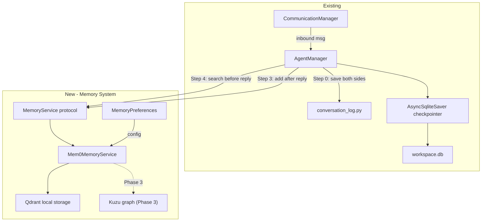
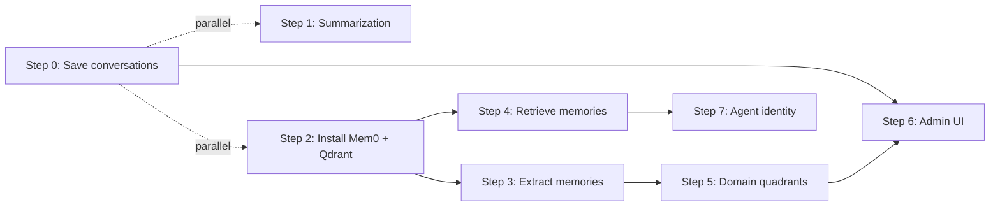

# Memory system implementation

## Current state

- `conversation_log.py` has `append_message()` / `read_messages()` but **neither is called anywhere** -- messages flow through `AgentManager._process()` and vanish after the LLM responds
- LangGraph `AsyncSqliteSaver` stores opaque checkpoint state in `workspace.db` -- not a queryable conversation log
- `conversation_channels` table tracks channel metadata (id, name, timestamps) but no message content
- `preferences.py` has `WorkspacePreferences` with `llm` and `audio` sections -- memory config will follow the same pattern
- `server_process.py` creates managers in order: CommunicationManager -> ChannelManager -> AgentManager, all run via `asyncio.gather`
- Admin UI has 8 NiceGUI pages under `ui/pages/` -- no memory or conversation history page
- Services pattern: `services/tts/`, `services/stt/`, `services/metrics/` -- memory service follows same structure

## Architecture overview




---

## Step 0 -- Save conversations

**Goal**: Wire the existing `conversation_log.append_message()` into the message flow so every inbound/outbound message is persisted as JSONL.

**Hook point**: [agent_manager.py](hiroserver/hirocli/src/hirocli/runtime/agent_manager.py) `_process()` method, lines 212-339. This is where both the inbound message and the outbound reply are available with the resolved `thread_id`.

**What to save** (structured dict per line):

```python
{
    "ts": "2026-03-22T..Z",
    "direction": "inbound" | "outbound",
    "role": "user" | "assistant",
    "thread_id": "uuid",
    "message_id": "uuid",
    "sender_id": "device-name | server",
    "channel": "devices:sender_id",
    "content_type": "text" | "audio" | ...,
    "body": "the actual text",
    "metadata": { ... }
}
```

**Changes**:

1. In `AgentManager._process()`, after building `text_body` (line 251) -- call `append_message` for the inbound message
2. After getting `reply_body` (line 303) -- call `append_message` for the outbound reply
3. Also call `update_last_message_at()` from [conversation_channel.py](hiroserver/hirocli/src/hirocli/domain/conversation_channel.py) (it exists, unused)
4. Both calls should use `asyncio.create_task` or direct `await` (fast since it's `asyncio.to_thread` internally)

**Files touched**:

- [agent_manager.py](hiroserver/hirocli/src/hirocli/runtime/agent_manager.py) -- add import and two `append_message` calls
- Possibly [conversation_log.py](hiroserver/hirocli/src/hirocli/domain/conversation_log.py) -- ensure the dict schema is documented

**No new dependencies.** Uses existing code that was written but never wired.

---

## Step 1 -- Short-term memory window with summarization

**Goal**: Bound the conversation context sent to the LLM and summarize older turns, preventing unbounded token growth.

**Current behavior**: LangGraph checkpointer stores all messages in the thread. The full history is loaded and sent to the LLM every turn (visible at line 279: `state.values.get("messages", [])`). No trimming or summarization.

**Approach**: Add a message trimming + summarization layer before the agent invocation. Two options:

- **Option A (LangGraph-native)**: Use a custom state schema with a `summary` field and a reducer that trims messages beyond N turns, generating a summary of dropped messages. This is the LangGraph-recommended pattern.
- **Option B (simpler)**: Before `ainvoke`, trim the checkpoint messages to last N, prepend a summary of older messages to the system prompt. Less elegant but doesn't change the agent graph definition.

**Recommend Option A** since it's the LangGraph-native approach and we're already using `create_agent` with a checkpointer.

**Changes**:

- [agent_manager.py](hiroserver/hirocli/src/hirocli/runtime/agent_manager.py) -- modify `_build_agent` to configure message window and summarization
- May need a `MemoryPreferences` section (see Step 2) for configurable `max_messages` (default: 20) and `summarize_after` threshold

**Dependencies**: Can run in parallel with Steps 2-4 since it's about the short-term LangGraph layer, not Mem0.

---

## Step 2 -- Install Mem0 + Qdrant, define MemoryService

**Goal**: Add Mem0 and Qdrant as dependencies, create a `MemoryService` protocol for swappability, implement `Mem0MemoryService`, add memory configuration to preferences, and initialize at server startup.

### 2a. Dependencies

Add to [pyproject.toml](hiroserver/hirocli/pyproject.toml):

```toml
"mem0ai>=0.1",
"qdrant-client>=1.17",
```

Version numbers must be verified via WebSearch before adding (per workspace rule).

### 2b. Memory preferences

Extend [preferences.py](hiroserver/hirocli/src/hirocli/domain/preferences.py) `WorkspacePreferences`:

```python
class MemoryPreferences(BaseModel):
    enabled: bool = True
    max_short_term_messages: int = 20
    provider: str = "mem0"          # swappable later
    vector_store: str = "qdrant"    # swappable via mem0 config
    auto_extract: bool = True       # inline extraction after each reply
    # graph memory (Phase 3)
    graph_enabled: bool = False
    graph_store: str = "kuzu"

class WorkspacePreferences(BaseModel):
    version: int = 1
    llm: LLMPreferences = ...
    audio: AudioPreferences = ...
    memory: MemoryPreferences = Field(default_factory=MemoryPreferences)  # NEW
```

### 2c. MemoryService protocol

Create `domain/memory.py` -- a thin protocol that the AgentManager talks to:

```python
from typing import Protocol, runtime_checkable

@runtime_checkable
class MemoryService(Protocol):
    async def add(self, content: str, *, user_id: str, agent_id: str | None = None,
                  metadata: dict | None = None) -> None: ...

    async def search(self, query: str, *, user_id: str, agent_id: str | None = None,
                     limit: int = 10) -> list[dict]: ...

    async def get_all(self, *, user_id: str) -> list[dict]: ...

    async def delete(self, memory_id: str) -> None: ...

    async def update(self, memory_id: str, content: str) -> None: ...

    async def history(self, *, user_id: str) -> list[dict]: ...
```

This protocol is what makes swapping Mem0 for Hindsight (or anything else) possible later -- AgentManager only imports the protocol, never the concrete implementation.

### 2d. Mem0MemoryService implementation

Create `services/memory/` following the existing service pattern:

```
services/memory/
    __init__.py
    service.py       # Mem0MemoryService implementing MemoryService protocol
    provider.py      # Future: abstract provider if we swap engines
```

`service.py`:

- Initializes Mem0 with Qdrant local config
- Qdrant data dir: `workspace_path / "memory" / "qdrant"` (follows existing pattern of workspace-scoped storage)
- Passes the LLM config from preferences (reuse the same `resolve_llm` for the extraction LLM, or allow a separate `default_memory` purpose)

Key config for Mem0 initialization:

```python
from mem0 import Memory

config = {
    "vector_store": {
        "provider": "qdrant",
        "config": {
            "path": str(workspace_path / "memory" / "qdrant"),  # local, no server
        },
    },
    # Use the same chat LLM for extraction
    "llm": {
        "provider": llm_entry.provider,
        "config": {
            "model": llm_entry.model,
            "temperature": 0.1,
        },
    },
}
m = Memory.from_config(config)
```

### 2e. Server startup wiring

In [server_process.py](hiroserver/hirocli/src/hirocli/runtime/server_process.py), after creating TTS service (~line 298):

```python
memory_service = _create_memory_service(workspace_path)
agent_manager = AgentManager(comm_manager, workspace_path, tts_service=tts_service,
                             memory_service=memory_service)
```

`AgentManager.__init__` gains an optional `memory_service: MemoryService | None = None` parameter, following the same pattern as `tts_service`.

### 2f. Storage constants

Add to [storage.py](hiroserver/hiro-commons/src/hiro_commons/constants/storage.py):

```python
MEMORY_DIR: str = "memory"
```

**Install story**: Both `mem0ai` and `qdrant-client` are pure pip. Qdrant local creates its files on first use in the workspace directory. Zero user action needed -- same install experience as today.

---

## Step 3 -- Memory extraction after conversations

**Goal**: After each agent reply, extract and store long-term memories from the conversation turn.

**Hook point**: [agent_manager.py](hiroserver/hirocli/src/hirocli/runtime/agent_manager.py) `_process()`, after the agent reply is obtained (line 303) and before/after TTS.

**Pattern**: Fire-and-forget `asyncio.create_task`, identical to how TTS works (lines 331-339). Memory extraction should never block the reply.

```python
# After reply is enqueued (line 329)
if self._memory_service and self._memory_enabled:
    asyncio.create_task(
        self._extract_memories(thread_id, text_body, reply_body),
        name=f"mem-{reply.routing.id}",
    )
```

`**_extract_memories` method**:

```python
async def _extract_memories(self, thread_id: str, user_msg: str, agent_reply: str) -> None:
    try:
        conversation = f"User: {user_msg}\nAssistant: {agent_reply}"
        await self._memory_service.add(
            content=conversation,
            user_id=self._resolve_user_id(thread_id),
            agent_id=self._resolve_agent_id(),
            metadata={"thread_id": thread_id, "source": "conversation"},
        )
    except Exception as exc:
        log.error("Memory extraction failed", thread=thread_id, error=str(exc))
```

**User/agent ID resolution**: `user_id` maps to the sender (from `conversation_channels`). `agent_id` maps to the agent row in `workspace.db`. Both already exist as concepts in the codebase.

**Files touched**:

- [agent_manager.py](hiroserver/hirocli/src/hirocli/runtime/agent_manager.py) -- add `_extract_memories` method and fire-and-forget task

---

## Step 4 -- Memory retrieval before responding

**Goal**: Before the agent generates a reply, retrieve relevant memories and inject them as context.

**Hook point**: [agent_manager.py](hiroserver/hirocli/src/hirocli/runtime/agent_manager.py) `_process()`, after building `text_body` (line 251) and before `agent.ainvoke` (line 298).

**Flow**:

```python
# After text_body is built, before agent invocation
memory_context = ""
if self._memory_service:
    memories = await self._memory_service.search(
        query=text_body,
        user_id=self._resolve_user_id(thread_id),
        limit=10,
    )
    if memories:
        memory_context = self._format_memories(memories)
```

**How to inject**: Prepend to the user message or add as a system-level context. Two approaches:

- **Option A**: Modify the `agent_input` to include memory context in the user message: `"[Memory context: ...]\n\nUser message: ..."`. Simple but mixes concerns.
- **Option B**: Modify the system prompt dynamically per invocation to include `"You know the following about this user:\n{memory_context}"`. Cleaner separation.

**Recommend Option B** -- dynamic system prompt injection. The `load_system_prompt` already returns a string; wrap it with memory context at invocation time rather than at agent build time. This requires the agent to accept per-invocation system context, which LangGraph supports.

**Files touched**:

- [agent_manager.py](hiroserver/hirocli/src/hirocli/runtime/agent_manager.py) -- add retrieval call and prompt assembly

---

## Step 5 -- Memory domain model (quadrants)

**Goal**: Structure stored memories into four categories with metadata, so retrieval and display can be filtered by type.

### Memory quadrants


| Quadrant           | Description                                   | Source                         | Mem0 implementation                                             |
| ------------------ | --------------------------------------------- | ------------------------------ | --------------------------------------------------------------- |
| **World facts**    | Objective info: family, work, places, dates   | Extracted from conversations   | `metadata={"category": "world_fact"}`                           |
| **Experiences**    | Conversation episodes, what happened          | Saved JSONL logs (Step 0)      | `metadata={"category": "experience"}`                           |
| **Observations**   | Synthesized patterns derived over time        | Batch processing or reflection | `metadata={"category": "observation"}`                          |
| **Agent identity** | Bot backstory, personality, interaction style | Config + evolved               | `metadata={"category": "agent_identity"}`, scoped by `agent_id` |


### Implementation approach

Mem0 stores arbitrary metadata with each memory. Categories are metadata tags, not separate stores. Retrieval can filter by category.

**Agent identity** starts from the system prompt in [agent_config.py](hiroserver/hirocli/src/hirocli/domain/agent_config.py) (`_DEFAULT_SYSTEM_PROMPT`) and evolves:

- The agent's "backstory" is seeded at creation time (extending the `agents` table or as Mem0 memories with `category=agent_identity`)
- As the agent interacts, observations about its own behavior can be stored ("I tend to give detailed answers to this user", "User prefers when I'm brief")

### Extraction guidance

The extraction prompt sent to Mem0 can be customized to classify memories into categories. Mem0 supports custom extraction prompts. This is where you guide: "Extract facts as world_facts, user preferences as observations, and notable events as experiences."

**Files touched**:

- `services/memory/service.py` -- add category metadata to `add()` calls, custom extraction prompt
- `domain/memory.py` -- add category constants/enum
- `domain/agent_config.py` -- extend agent model with backstory/identity fields (or use Mem0 directly)

---

## Step 6 -- Admin UI: memory viewer and conversation history

**Goal**: Add an admin page to browse conversation history, view stored memories, and manage them (edit/delete).

### New page: `ui/pages/memory.py`

Following the pattern of existing pages (`agents.py`, `logs.py`), create `/memory` route with:

**Section 1: Conversation history browser**

- Dropdown to select a conversation channel (from `list_channels()`)
- Display messages from JSONL file (from `read_messages()`)
- Paginated, newest first

**Section 2: Memory store viewer**

- List all memories for a user (from `memory_service.get_all()`)
- Grouped by quadrant/category
- Each memory shows: content, category, created_at, source thread, agent_id
- Edit and delete buttons per memory

**Section 3: Audit trail**

- Each memory's provenance: which conversation, which message triggered it, when
- This comes from the `metadata` stored with each Mem0 memory (thread_id, message_id, timestamp)

### Navigation

Add the page to the admin UI navigation (in [run.py](hiroserver/hirocli/src/hirocli/ui/run.py) where pages are registered).

### Memory service access

The admin page needs access to the `MemoryService` instance. Following the existing pattern where `http_app.state` carries shared objects (tool_registry, metrics_collector), store `memory_service` on app state in server_process.py.

**Files touched**:

- New file: `ui/pages/memory.py`
- [run.py](hiroserver/hirocli/src/hirocli/ui/run.py) -- register new page
- [server_process.py](hiroserver/hirocli/src/hirocli/runtime/server_process.py) -- stash memory_service on app state

---

## Step 7 -- Agent/bot memory and identity

**Goal**: Give each agent its own memory: backstory, personality traits, accumulated interaction style, and self-observations.

### Current agent model

The `agents` table in [db.py](hiroserver/hirocli/src/hirocli/domain/db.py) has: `id`, `name`, `is_default`, `system_prompt`, `created_at`. The system prompt is the only "personality" mechanism.

### Proposed extension

**Option A (DB extension)**: Add columns to `agents` table:

```python
("agents", "backstory",    "TEXT NOT NULL DEFAULT ''"),
("agents", "personality",  "TEXT NOT NULL DEFAULT ''"),
("agents", "disposition",  "TEXT NOT NULL DEFAULT '{}'"),  # JSON: mood traits, style prefs
```

These are static/configured identity. The system prompt incorporates them at build time.

**Option B (Mem0-stored)**: Store agent identity as Mem0 memories with `agent_id` scope and `category=agent_identity`. Dynamic and evolves with interactions. Retrieve alongside user memories in Step 4.

**Recommend both**: Static identity in DB (backstory, core personality -- set once, rarely changes), dynamic observations in Mem0 (interaction style learned over time -- evolves).

### Agent memory in the prompt

Step 4's memory retrieval already queries by `agent_id`. Agent identity memories are retrieved the same way and injected into the prompt:

```
You are [agent name]. [backstory from DB]
[personality traits from DB]

You have observed: [agent_identity memories from Mem0]

You know about this user: [user memories from Mem0]

Conversation: [recent messages]
```

**Files touched**:

- [db.py](hiroserver/hirocli/src/hirocli/domain/db.py) -- add agent identity columns to DDL and `_EXPECTED_COLUMNS`
- [agent_config.py](hiroserver/hirocli/src/hirocli/domain/agent_config.py) -- load/save backstory and personality
- [agent_manager.py](hiroserver/hirocli/src/hirocli/runtime/agent_manager.py) -- incorporate agent identity into prompt assembly
- `ui/pages/agents.py` -- add backstory/personality editing

---

## Dependency graph between steps




Steps 0, 1, and 2 can start in parallel. Steps 3-4 depend on Step 2. Steps 5-7 build on top. Step 6 (admin UI) benefits from all prior steps being done but can be built incrementally.

## Recommended execution order

1. **Step 0** -- tiny, unblocks conversation history and gives data for everything else
2. **Step 2** -- install deps, protocol, service, wiring -- the foundation
3. **Step 3** -- extraction -- the first "it remembers" moment
4. **Step 4** -- retrieval -- the agent actually uses memories
5. **Step 1** -- summarization -- prevents context explosion (can also run after Step 0)
6. **Step 5** -- quadrants -- structure what's already being stored
7. **Step 7** -- agent identity -- personality layer
8. **Step 6** -- admin UI -- visibility into everything above

## Files summary


| File                                | Steps affected | Change type                 |
| ----------------------------------- | -------------- | --------------------------- |
| `domain/conversation_log.py`        | 0              | Wire existing code          |
| `runtime/agent_manager.py`          | 0, 1, 3, 4, 7  | Core integration point      |
| `domain/memory.py`                  | 2, 5           | New -- protocol + constants |
| `services/memory/__init__.py`       | 2              | New -- service package      |
| `services/memory/service.py`        | 2, 3, 5        | New -- Mem0MemoryService    |
| `domain/preferences.py`             | 2              | Add MemoryPreferences       |
| `runtime/server_process.py`         | 2, 6           | Wire memory service         |
| `pyproject.toml`                    | 2              | Add mem0ai, qdrant-client   |
| `hiro-commons/constants/storage.py` | 2              | Add MEMORY_DIR              |
| `domain/db.py`                      | 7              | Agent identity columns      |
| `domain/agent_config.py`            | 7              | Backstory/personality I/O   |
| `ui/pages/memory.py`                | 6              | New -- admin page           |
| `ui/run.py`                         | 6              | Register memory page        |
| `ui/pages/agents.py`                | 7              | Agent identity editing      |


