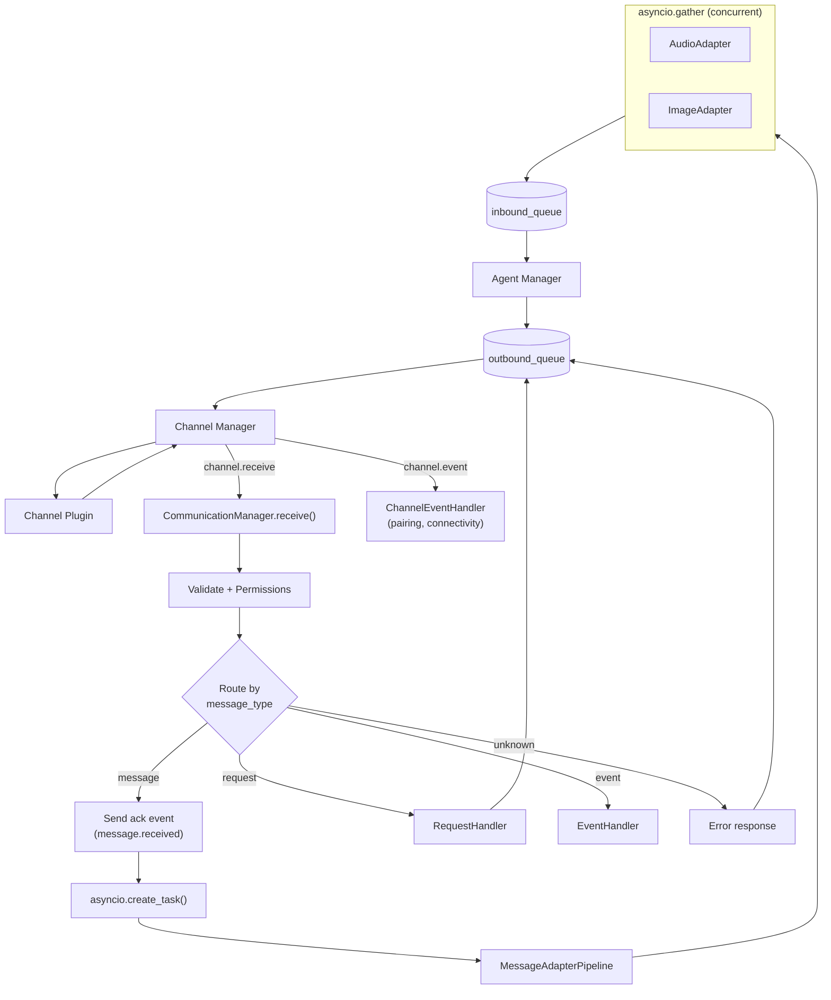

# Message Router and Adapter Pipeline

Abiding by the no-backward-compatibility rule.

## Current State

Today, `CommunicationManager.receive()` validates every inbound `UnifiedMessage` and blindly puts it on `inbound_queue`. `AgentManager` reads from that queue, processes only text items, and silently ignores everything else (audio, image, etc.). Pairing flows through a completely separate pathway (`channel.event` RPC -> `_on_channel_event` in `server_process.py`).

## Architecture Overview




## 1. CommunicationManager Routing

The core change to [communication_manager.py](hiroserver/hirocli/src/hirocli/runtime/communication_manager.py): after validation and permission checks, `receive()` routes by `message_type` using a simple match/case. The handlers (RequestHandler, EventHandler, adapter pipeline) are separate classes injected at construction. CommunicationManager is a thin coordinator -- it does not know how to transcribe audio or handle a `channels.list` request.

- `**"message"**` -- send immediate `message.received` ack event, then spawn `asyncio.create_task(self._adapt_and_queue(msg))`. The task runs the adapter pipeline and queues the enriched message. `receive()` returns immediately so it never blocks other incoming messages.
- `**"request"**` -- dispatch to `RequestHandler.handle(msg)` (from existing plan, builds response and enqueues outbound).
- `**"event"**` -- dispatch to `EventHandler.handle(msg)` (initially logging; future handlers for delivery receipts, etc.).
- **unknown** -- log warning, enqueue error response to sender.

Key point: `_adapt_and_queue` runs in its own task. Ten devices can send audio simultaneously and each gets its own concurrent task. No message blocks another.

```python
async def _adapt_and_queue(self, msg: UnifiedMessage) -> None:
    try:
        enriched = await self._adapter_pipeline.process(msg)
        self.inbound_queue.put_nowait(enriched)
    except Exception as exc:
        log.error("Adapter pipeline failed", msg_id=msg.routing.id, error=str(exc))
        await self._send_error_event(msg, str(exc))
```

## 2. MessageAdapterPipeline and ContentTypeAdapter Base

New file: `hiroserver/hirocli/src/hirocli/runtime/message_adapter.py`

### Adapter hierarchy

Three levels:

1. `**MessageAdapter**` (ABC) -- minimal interface: `can_handle(msg)` and `adapt(msg)`.
2. `**ContentTypeAdapter**` (extends MessageAdapter) -- Template Method base for the common case: targets a specific `content_type`, loops over matching items, calls `process_item()`, writes result into `item.metadata["description"]`. Subclasses only implement `target_content_type` and `process_item()`.
3. **Concrete adapters** (extend ContentTypeAdapter) -- `AudioTranscriptionAdapter`, `ImageUnderstandingAdapter`. Each is ~10 lines: one property, one method.

```python
class MessageAdapter(ABC):
    @abstractmethod
    def can_handle(self, msg: UnifiedMessage) -> bool: ...

    @abstractmethod
    async def adapt(self, msg: UnifiedMessage) -> UnifiedMessage: ...


class ContentTypeAdapter(MessageAdapter):
    """Base for adapters that process a specific content_type.

    Handles matching, iteration, and writing results back into
    item.metadata["description"]. Subclasses only implement the
    actual processing call.
    """

    @property
    @abstractmethod
    def target_content_type(self) -> str: ...

    @abstractmethod
    async def process_item(self, item: ContentItem) -> str: ...

    def can_handle(self, msg: UnifiedMessage) -> bool:
        return any(
            i.content_type == self.target_content_type for i in msg.content
        )

    async def adapt(self, msg: UnifiedMessage) -> UnifiedMessage:
        for item in msg.content:
            if item.content_type == self.target_content_type:
                try:
                    item.metadata["description"] = await self.process_item(item)
                except Exception as exc:
                    item.metadata["adapter_error"] = str(exc)
        return msg
```

### Pipeline with concurrent adapters

Inspired by OpenClaw's concurrent capability processing: independent adapters (audio and image) run **concurrently** within a single message via `asyncio.gather`. They don't depend on each other -- an image description doesn't need the audio transcript.

```python
class MessageAdapterPipeline:
    def __init__(self, adapters: list[MessageAdapter] | None = None):
        self._adapters = adapters or []

    async def process(self, msg: UnifiedMessage) -> UnifiedMessage:
        applicable = [a for a in self._adapters if a.can_handle(msg)]
        if not applicable:
            return msg
        await asyncio.gather(*(a.adapt(msg) for a in applicable))
        return msg
```

All adapters mutate the same `msg` object's content items in-place (each adapter touches different items by content_type, so no conflicts). The enriched message is then queued.

### Design principle: enrich in-place, never add or remove items

Adapters write their output into `item.metadata["description"]` on the **same** ContentItem. The original `body` (audio data, image URL, etc.) is preserved. No new ContentItems are added, no originals are removed. The agent sees the original items with enriched metadata.

Example: a voice message arrives as:

```python
ContentItem(content_type="audio", body="<base64-or-url>", metadata={})
```

After the audio adapter:

```python
ContentItem(
    content_type="audio",
    body="<base64-or-url>",
    metadata={"description": "Hey, can you check the server logs?"},
)
```

On error:

```python
ContentItem(
    content_type="audio",
    body="<base64-or-url>",
    metadata={"adapter_error": "Transcription service unavailable"},
)
```

## 3. Media Services (Reusable Capability Layer)

New directory: `hiroserver/hirocli/src/hirocli/services/`

The actual LangChain calls live in standalone service classes -- not inside the adapters. This makes the capabilities reusable by the adapter pipeline, agent tools, HTTP endpoints, or any future consumer.

### TranscriptionService

New file: `hiroserver/hirocli/src/hirocli/services/transcription_service.py`

Pure capability class with no knowledge of adapters, pipelines, or content items:

- `is_available() -> bool` -- returns `True` when `OPENAI_API_KEY` is set
- `async transcribe(source: str) -> str` -- used by the adapter pipeline; runs the synchronous Whisper parser in a thread pool to avoid blocking the event loop
- `transcribe_sync(source: str) -> str` -- used by tools and any sync caller; runs `asyncio.run()` in a dedicated thread so it is safe to call from within or outside an existing event loop

Provider: LangChain `OpenAIWhisperParser` (from `langchain-community`).

### VisionService

New file: `hiroserver/hirocli/src/hirocli/services/vision_service.py`

- `is_available() -> bool` -- returns `True` when `OPENAI_API_KEY` is set
- `async describe(source: str, prompt: str | None = None) -> str` -- used by the adapter pipeline
- `describe_sync(source: str, prompt: str | None = None) -> str` -- used by tools and any sync caller

Default model: `openai:gpt-4o-mini` (override with `IMAGE_VISION_MODEL` env var).
Default prompt: generic description (override with `IMAGE_ANALYSIS_PROMPT` env var or pass at call time).

---

## 4. Concrete Adapters

Adapters are now thin glue between the service layer and the pipeline contract. Each is ~15 lines.

### AudioTranscriptionAdapter

New file: `hiroserver/hirocli/src/hirocli/runtime/adapters/audio_adapter.py`

- **Extends**: `ContentTypeAdapter`
- `**target_content_type`**: `"audio"`
- **Accepts**: injected `TranscriptionService` (defaults to a new instance if not provided)
- `**can_handle()`**: delegates to `service.is_available()` then `super()`
- `**process_item()`**: calls `await self._service.transcribe(item.body)`

### ImageUnderstandingAdapter

New file: `hiroserver/hirocli/src/hirocli/runtime/adapters/image_adapter.py`

- **Extends**: `ContentTypeAdapter`
- `**target_content_type`**: `"image"`
- **Accepts**: injected `VisionService` (defaults to a new instance if not provided)
- `**can_handle()`**: delegates to `service.is_available()` then `super()`
- `**process_item()`**: calls `await self._service.describe(item.body)`

### Future adapters (not in this iteration)

- `VideoAdapter`, `FileAdapter` (PDF extraction, etc.), `LocationAdapter` (geocoding) -- each extends `ContentTypeAdapter` and delegates to its own service class.

## 8. AgentManager Update

[agent_manager.py](hiroserver/hirocli/src/hirocli/runtime/agent_manager.py) currently builds agent input by concatenating `item.body` from text ContentItems only. With enriched metadata, it must also read `item.metadata["description"]` from non-text items.

The `_process()` method changes to build a richer input:

```python
parts = []
for item in msg.content:
    if item.content_type == "text":
        parts.append(item.body)
    elif "description" in item.metadata:
        parts.append(f"[{item.content_type}]: {item.metadata['description']}")
text_body = "\n".join(parts)
```

This means an audio message now produces input like: `[audio]: Hey, can you check the server logs?` -- and the agent can respond to it.

## 5. Media Tools

New file: `hiroserver/hirocli/src/hirocli/tools/media.py`

The same capabilities exposed as agent/CLI/HTTP tools via the existing `Tool` interface:


| Tool                | Name               | What it does                                                                                                                              |
| ------------------- | ------------------ | ----------------------------------------------------------------------------------------------------------------------------------------- |
| `TranscribeTool`    | `transcribe_audio` | Transcribes audio from a URL, data URI, or base64 string. Calls `TranscriptionService.transcribe_sync()`.                                 |
| `DescribeImageTool` | `describe_image`   | Describes an image from a URL, data URI, or base64 string. Accepts an optional `prompt` parameter. Calls `VisionService.describe_sync()`. |


Both tools are registered in `all_tools()` and available to the agent, CLI, and HTTP server. Each tool creates its own lightweight service instance (LangChain models are lazy-initialized on first call, so construction is free).

## 6. Pipeline Configuration

Services are instantiated once in [server_process.py](hiroserver/hirocli/src/hirocli/runtime/server_process.py) and shared with the adapters:

```python
transcription_service = TranscriptionService()
vision_service = VisionService()

adapter_pipeline = MessageAdapterPipeline([
    AudioTranscriptionAdapter(service=transcription_service),
    ImageUnderstandingAdapter(service=vision_service),
])
comm_manager = CommunicationManager(adapter_pipeline=adapter_pipeline)
```

Adapters that require API keys or are not configured simply return `can_handle() -> False`.

## 9. Pairing: Keep Separate, Clean Up

**Do NOT unify pairing under message routing.** Pairing is a connection-level handshake that happens before the device can send UnifiedMessages. It uses `channel.event` RPC (raw dicts, not UnifiedMessage), and the WebSocket closes after the handshake.

Refactor the monolithic `_on_channel_event()` in `server_process.py` (~90 lines of inline pairing logic) into a proper `ChannelEventHandler` class with registered handlers per event type:

```python
class ChannelEventHandler:
    def __init__(self):
        self._handlers: dict[str, Callable] = {}

    def register(self, event: str, handler: Callable): ...

    async def handle(self, event: str, data: dict) -> None:
        handler = self._handlers.get(event)
        if handler:
            await handler(data)
```

Two distinct event concepts remain separate:

- **Channel events** (`channel.event` RPC): infrastructure signals -- pairing, connectivity
- **Message events** (`message_type == "event"` in UnifiedMessage): application signals -- message.received, message.transcribed

## 7. Files Changed


| File                                                                                        | Change                                                                                                                             |
| ------------------------------------------------------------------------------------------- | ---------------------------------------------------------------------------------------------------------------------------------- |
| [communication_manager.py](hiroserver/hirocli/src/hirocli/runtime/communication_manager.py) | Add `message_type` routing in `receive()`, add `_adapt_and_queue()`, accept injected adapter pipeline and handlers                 |
| New: `message_adapter.py`                                                                   | `MessageAdapter` ABC, `ContentTypeAdapter` base class (Template Method), `MessageAdapterPipeline` with concurrent `asyncio.gather` |
| New: `services/transcription_service.py`                                                    | `TranscriptionService` -- async `transcribe()` for adapters, sync `transcribe_sync()` for tools                                    |
| New: `services/vision_service.py`                                                           | `VisionService` -- async `describe()` for adapters, sync `describe_sync()` for tools                                               |
| New: `adapters/audio_adapter.py`                                                            | `AudioTranscriptionAdapter` -- thin glue: delegates `process_item()` to injected `TranscriptionService`                            |
| New: `adapters/image_adapter.py`                                                            | `ImageUnderstandingAdapter` -- thin glue: delegates `process_item()` to injected `VisionService`                                   |
| [agent_manager.py](hiroserver/hirocli/src/hirocli/runtime/agent_manager.py)                 | Update `_process()` to build agent input from text items AND `metadata["description"]` from non-text items                         |
| New: `tools/media.py`                                                                       | `TranscribeTool` and `DescribeImageTool` -- expose transcription and vision as agent/CLI/HTTP tools                                |
| [tools/**init**.py](hiroserver/hirocli/src/hirocli/tools/__init__.py)                       | Register `TranscribeTool` and `DescribeImageTool` in `all_tools()`                                                                 |
| New: `request_handler.py`                                                                   | `RequestHandler` with method registry (from existing plan)                                                                         |
| New: `event_handler.py`                                                                     | `EventHandler` for application-level message events                                                                                |
| New: `channel_event_handler.py`                                                             | `ChannelEventHandler` for infrastructure events (extracted from server_process)                                                    |
| [server_process.py](hiroserver/hirocli/src/hirocli/runtime/server_process.py)               | Instantiate shared `TranscriptionService` and `VisionService`; wire adapter pipeline and all handlers                              |
| [models.py](hiroserver/hiro-channel-sdk/src/hiro_channel_sdk/models.py)                     | Add `request_id` field to UnifiedMessage                                                                                           |
| [pyproject.toml](hiroserver/hirocli/pyproject.toml)                                         | Add `langchain-community>=0.3` dependency                                                                                          |


