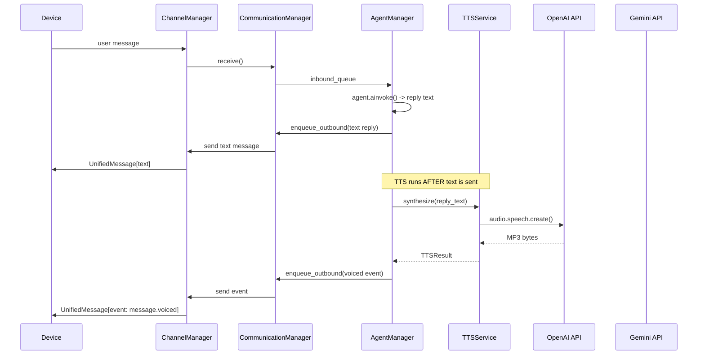

# TTS Service and Voice Reply Delivery

No backward compatibility required (initial development mode).

## Audio Format Decision: MP3

MP3 is the only format that works on **all** target platforms:

- **Opus/OGG**: NOT viable -- `just_audio` on iOS does not support OGG/Opus (AVPlayer limitation, confirmed open issue ryanheise/just_audio#607).
- **AAC/M4A**: NOT universal -- Firefox has only **partial** AAC support (per caniuse.com). Chrome and Safari are fine, but Firefox is not reliable for web playback.
- **MP3**: Full support on iOS, Android, Chrome, Firefox, Safari, Edge.

Note: the Flutter app records in M4A/AAC on mobile and WebM/Opus on web (platform-native encoders). The TTS output format is different because the constraint is reversed -- recording depends on what the *device can encode*, while TTS depends on what *all platforms can play back*.

Production parameters:

- **OpenAI**: request `response_format="mp3"` (the API default) -- zero conversion needed
- **Gemini**: `generate_content` returns raw PCM (24kHz, 16-bit, mono) -- needs server-side PCM-to-MP3 conversion via `pydub` (wraps ffmpeg)
- Size: ~160 KB for 10s at 128kbps -- acceptable for base64 over WebSocket

Alternative: `lameenc` (Python LAME bindings, no ffmpeg binary needed) if ffmpeg is undesirable on the desktop. Both should be version-checked at implementation time per workspace rule.

## Architecture Overview




Key: text reply is sent immediately. TTS is fire-and-forget post-processing. If TTS fails, the user already has the text.

## 1. TTS Provider Abstraction

Mirror the STT pattern exactly. New package: `services/tts/`.

### `services/tts/provider.py` -- contract

```python
@dataclass(frozen=True)
class TTSModelInfo:
    model_id: str       # "gpt-4o-mini-tts"
    provider: str       # "openai"
    display_name: str   # "GPT-4o Mini TTS"

@dataclass(frozen=True)
class TTSResult:
    audio_bytes: bytes
    mime_type: str      # "audio/mp3"
    duration_ms: int
    model: str
    voice: str

class TTSProvider(ABC):
    @property
    @abstractmethod
    def name(self) -> str: ...

    @abstractmethod
    def is_available(self) -> bool: ...

    @abstractmethod
    def supported_models(self) -> list[TTSModelInfo]: ...

    @abstractmethod
    async def synthesize(
        self, text: str, *, model: str, voice: str,
        instructions: str = "", **kwargs
    ) -> TTSResult: ...
```

`TTSResult` carries everything needed for the event payload -- bytes, MIME type, duration.

### `services/tts/openai_provider.py`

- Uses `AsyncOpenAI().audio.speech.create()` with `response_format="mp3"`
- Models: `gpt-4o-mini-tts` (default). Voices: all 13 (ballad, sage, marin, cedar, etc.)
- `instructions` parameter passed directly (only works with `gpt-4o-mini-tts`)
- Retry with tenacity: exponential backoff, 4 attempts, on `RateLimitError`/`APIError`
- Duration: parse from MP3 bytes (use `mutagen` or estimate from byte count: `len(bytes) * 8 / 128000 * 1000` ms at 128kbps)
- Lazy SDK import (same pattern as [openai_provider.py](hiroserver/hirocli/src/hirocli/services/stt/openai_provider.py))
- Enabled when `OPENAI_API_KEY` is set

### `services/tts/gemini_provider.py`

- Uses `genai.Client().models.generate_content()` with `response_modalities=["AUDIO"]` and `SpeechConfig`
- Models: `gemini-2.5-flash-preview-tts` (default -- preview only via AI Studio / API key path). Note: production Gemini TTS requires Google Cloud TTS API with GCP project + billing + IAM, which is not in scope.
- Instructions prepended to text content (Gemini has no separate instructions param)
- Returns raw PCM (24kHz, 16-bit, mono) -- convert to MP3 via `pydub`:

```python
from pydub import AudioSegment
pcm_segment = AudioSegment(data=pcm_bytes, sample_width=2, frame_rate=24000, channels=1)
mp3_buf = io.BytesIO()
pcm_segment.export(mp3_buf, format="mp3", bitrate="128k")
```

- Duration: `len(pcm_bytes) / (24000 * 2) * 1000` ms (exact, from PCM sample count)
- Enabled when `GOOGLE_API_KEY` or `GEMINI_API_KEY` is set

### `services/tts/service.py` -- orchestrator

Mirrors [STTService](hiroserver/hirocli/src/hirocli/services/stt/service.py) exactly:

```python
class TTSService:
    def __init__(self, providers: list[TTSProvider], default_model: str | None = None):
        # Register available providers, build model->provider map
        # Default model from caller (resolved via preferences)

    async def synthesize(self, text: str, *, model: str | None = None,
                         voice: str = "", instructions: str = "") -> TTSResult:
        # Route to correct provider by model ID

    def synthesize_sync(self, text: str, **kwargs) -> TTSResult:
        # Sync wrapper for non-async contexts (tools, CLI)
```

### `services/tts/__init__.py`

Public API barrel: `TTSProvider`, `TTSModelInfo`, `TTSResult`, `TTSService`, `OpenAITTSProvider`, `GeminiTTSProvider`.

## 2. Preferences Integration

The model structure already supports TTS. Minimal changes needed:

**Already exists in [preferences.py](hiroserver/hirocli/src/hirocli/domain/preferences.py):**

- `VoiceOption` with `provider`, `model`, `voice`, `instructions`
- `AudioPreferences` with `agent_replies_in_voice`, `selected_voice`, `voice_options`
- `resolve_voice(prefs)` returns the active `VoiceOption`
- `LLMPreferences.default_tts` for model-level default

**No model changes needed** -- the existing `VoiceOption` carries all fields the TTS providers need (`provider`, `model`, `voice`, `instructions`).

**Setup tool**: seed default voice options during `hirocli setup` so TTS has something to resolve on first boot. Example seed:

```python
VoiceOption(provider="openai", model="gpt-4o-mini-tts", voice="sage",
            instructions="Calm, clear, and helpful. Moderate pacing.")
```

## 3. Protocol Extension — Event Taxonomy

Two new event types. Add to [hiro-channel-sdk/constants.py](hiroserver/hiro-channel-sdk/src/hiro_channel_sdk/constants.py):

```python
EVENT_TYPE_MESSAGE_VOICED: str = "message.voiced"
EVENT_TYPE_MESSAGE_CONTENT_ADDED: str = "message.content_added"
```

### Event taxonomy

These events serve different purposes. Modality mirrors transform existing content to a different form (no new information). Supplementary content adds genuinely new content to a message.


| Event                   | Category        | Purpose                                                      | Data format                                      |
| ----------------------- | --------------- | ------------------------------------------------------------ | ------------------------------------------------ |
| `message.received`      | Ack             | Delivery acknowledgement                                     | empty                                            |
| `message.transcribed`   | Modality mirror | audio -> text (transcript of voice message)                  | `{transcript: str}`                              |
| `message.voiced`        | Modality mirror | text -> audio (spoken version of text reply)                 | `{audio: str, mime_type: str, duration_ms: int}` |
| `message.content_added` | Supplementary   | New content items attached to a message (photos, docs, etc.) | `{content: [ContentItem, ...]}`                  |


`message.voiced` is the symmetric counterpart of `message.transcribed`. Both are modality transforms: transcribed adds a text representation to an audio message; voiced adds an audio representation to a text message.

`message.content_added` is reserved for genuinely new supplementary content (e.g., agent generates a photo alongside its text reply). It uses the generic `ContentItem` structure from the existing protocol so any content type works without new event types. Not implemented in this plan -- listed here for completeness.

### `message.voiced` payload

```python
EventPayload(
    type="message.voiced",
    ref_id="<routing.id of the text message this audio belongs to>",
    data={
        "audio": "<base64-encoded MP3 bytes>",
        "mime_type": "audio/mp3",
        "duration_ms": 2400,
    },
)
```

The `ref_id` links audio to the text message it voices -- same pattern as `message.transcribed` links a transcript to an audio message. The Flutter app (future plan) will use `ref_id` to attach playback controls to the correct text message.

### Full outbound event

Constructed exactly like the existing transcript event in [communication_manager.py lines 312-327](hiroserver/hirocli/src/hirocli/runtime/communication_manager.py):

```python
voiced_event = UnifiedMessage(
    message_type=MESSAGE_TYPE_EVENT,
    routing=MessageRouting(
        channel=inbound_msg.routing.channel,
        direction="outbound",
        sender_id="server",
        recipient_id=inbound_msg.routing.sender_id,
        metadata=inbound_msg.routing.metadata,
    ),
    event=EventPayload(
        type=EVENT_TYPE_MESSAGE_VOICED,
        ref_id=text_reply.routing.id,
        data={"audio": audio_b64, "mime_type": "audio/mp3", "duration_ms": duration},
    ),
)
await self._comm.enqueue_outbound(voiced_event)
```

## 4. AgentManager Integration

Modify [agent_manager.py](hiroserver/hirocli/src/hirocli/runtime/agent_manager.py) `_process()`:

```python
async def _process(self, msg: UnifiedMessage) -> None:
    # ... existing agent invocation (unchanged) ...
    reply = _make_reply(msg, reply_body)
    await self._comm.enqueue_outbound(reply)  # text sent FIRST

    # --- NEW: TTS post-processing ---
    if self._tts_enabled and self._tts_service:
        asyncio.create_task(
            self._synthesize_and_send(msg, reply, reply_body),
            name=f"tts-{reply.routing.id}",
        )
```

The TTS step runs as a fire-and-forget task so it never blocks the next inbound message. `_synthesize_and_send`:

```python
async def _synthesize_and_send(self, inbound: UnifiedMessage,
                                text_reply: UnifiedMessage, text: str) -> None:
    try:
        voice = resolve_voice(load_preferences(self._workspace_path))
        if not voice:
            return
        result = await self._tts_service.synthesize(
            text, model=voice.model, voice=voice.voice,
            instructions=voice.instructions,
        )
        audio_b64 = base64.b64encode(result.audio_bytes).decode()
        voiced_event = UnifiedMessage(...)  # as shown in section 3
        await self._comm.enqueue_outbound(voiced_event)
    except Exception as exc:
        log.error("TTS failed, text reply already sent", error=str(exc))
        # Graceful degradation: text was already delivered, just log
```

**TTSService construction**: TTSService is constructed in `server_process.py` and passed to AgentManager. See section 4a below.

`**_tts_enabled` flag**: read from `prefs.audio.agent_replies_in_voice`. When False, skip TTS entirely.

## 4a. Dynamic Provider Loading in server_process.py

Mirrors the existing STT provider loading pattern in [server_process.py lines 53-91](hiroserver/hirocli/src/hirocli/runtime/server_process.py). TTS providers are loaded dynamically based on the voice option configured in preferences:

```python
from hirocli.services.tts import OpenAITTSProvider, GeminiTTSProvider, TTSService

_TTS_PROVIDER_MAP: dict[str, type] = {
    "openai": OpenAITTSProvider,
    "google": GeminiTTSProvider,
    "google_genai": GeminiTTSProvider,
    "gemini": GeminiTTSProvider,
}

def _tts_providers_for(provider_name: str | None) -> list:
    """Return TTS provider instances for the given preference provider name.

    If provider_name is None (no TTS voice configured), returns an empty list
    so TTSService starts with synthesis disabled.
    """
    if provider_name is None:
        return []
    cls = _TTS_PROVIDER_MAP.get(provider_name)
    if cls is None:
        log.warning("Unknown TTS provider in preferences, loading none", provider=provider_name)
        return []
    return [cls()]
```

TTSService is constructed alongside the adapter pipeline and passed to AgentManager:

```python
def _create_tts_service(workspace_path: Path) -> TTSService | None:
    prefs = load_preferences(workspace_path)
    if not prefs.audio.agent_replies_in_voice:
        return None
    voice = resolve_voice(prefs)
    if not voice:
        log.warning("TTS enabled but no voice configured -- TTS disabled")
        return None
    providers = _tts_providers_for(voice.provider)
    return TTSService(providers=providers, default_model=voice.model)
```

AgentManager receives the TTSService instance via constructor (or None if TTS is disabled).

## 5. Per-Request Toggle (designed now, Flutter sends it later)

The server should already check for a per-request override in the inbound message metadata, so when Flutter adds the toggle later, no server changes are needed:

```python
# In _process(), before the TTS block:
per_request = msg.routing.metadata.get("request_voice_reply")
tts_for_this_msg = per_request if per_request is not None else self._tts_enabled
```

## 6. Dependencies


| Package        | Purpose                                       | Ecosystem                     |
| -------------- | --------------------------------------------- | ----------------------------- |
| `pydub`        | Gemini PCM-to-MP3 conversion                  | PyPI (requires ffmpeg binary) |
| `tenacity`     | Retry with backoff (likely already installed) | PyPI                          |
| `openai`       | OpenAI TTS API (already installed for STT)    | PyPI                          |
| `google-genai` | Gemini TTS API (already installed for STT)    | PyPI                          |


Version-check `pydub` via PyPI before adding. If ffmpeg is unacceptable, use `lameenc` instead (pure Python LAME bindings, no binary). Update [mintdocs/build/setup.mdx](mintdocs/build/setup.mdx) with any new dependencies.

## 7. Files to Create/Modify


| File                              | Action                                                                                                     |
| --------------------------------- | ---------------------------------------------------------------------------------------------------------- |
| `services/tts/__init__.py`        | **Create** -- barrel exports                                                                               |
| `services/tts/provider.py`        | **Create** -- ABC + TTSResult + TTSModelInfo                                                               |
| `services/tts/service.py`         | **Create** -- TTSService orchestrator                                                                      |
| `services/tts/openai_provider.py` | **Create** -- OpenAI TTS provider                                                                          |
| `services/tts/gemini_provider.py` | **Create** -- Gemini TTS provider (preview models)                                                         |
| `hiro-channel-sdk/constants.py`   | **Edit** -- add `EVENT_TYPE_MESSAGE_VOICED` and `EVENT_TYPE_MESSAGE_CONTENT_ADDED`                         |
| `runtime/agent_manager.py`        | **Edit** -- add TTS post-processing step, accept TTSService in constructor                                 |
| `runtime/server_process.py`       | **Edit** -- add `_TTS_PROVIDER_MAP`, `_tts_providers_for()`, `_create_tts_service()`, pass to AgentManager |
| `tools/setup.py`                  | **Edit** -- seed default VoiceOption in preferences.json                                                   |
| `mintdocs/build/setup.mdx`        | **Edit** -- document pydub/ffmpeg dependency                                                               |


## 8. TTS Provider Landscape (Reference)

For future evaluation beyond OpenAI and Gemini:

**Paid APIs:**

- **ElevenLabs** -- best quality (ELO 1548), voice cloning, 32 languages. Tiny free tier (10k chars/month). $5/mo starter.
- **Fish Audio** -- no feature gates, cloning+streaming+multilingual all included. $15/1M UTF-8 bytes.
- **Inworld AI** -- sub-200ms latency, free voice cloning from 5-15s audio. $10/1M chars.
- **Google Cloud TTS** -- 4M chars/month free (most generous), but requires GCP project+IAM setup. Supports OGG_OPUS output (unlike the `generate_content` path).

**Open-source (self-hosted, zero API cost):**

- **Kokoro** (82M params, Apache 2.0) -- 96x realtime speed, 2-3 GB VRAM, 54 voices, 8 languages. Has OpenAI-compatible API wrappers so it could be used via `OpenAITTSProvider` with a custom base URL.
- **Chatterbox** (MIT) -- best open-source voice cloning (63.75% preference vs ElevenLabs). Needs only 5-10s reference audio.
- **Qwen3-TTS** (Apache 2.0) -- from Alibaba, strong multilingual.
- **CosyVoice 2.0** (Apache 2.0) -- good multilingual, 150ms+ streaming latency.

The `TTSProvider` ABC means any of these can be added later without touching the service layer, AgentManager, or protocol.

## 9. Future Phases (not in this plan)

- **Flutter UI**: handle `message.voiced` event, attach audio to text message, show playback controls -- separate plan.
- **Supplementary content**: implement `message.content_added` handler for agent-generated photos, documents, etc. alongside text replies.
- **Per-request toggle**: Flutter UI switch to send `request_voice_reply` metadata.
- **Autoplay**: configurable per-device preference.
- **Streaming TTS**: OpenAI supports `stream=True` + `stream_format="audio"`. Could use the reserved `MESSAGE_TYPE_STREAM` for chunked audio delivery. Playback starts after first chunk (~200ms vs 2-5s wait). Streaming is a separate mechanism from enrichment events -- different performance profile and UI requirements.
- **TTS caching**: cache keyed on `(text_hash, model, voice)` to avoid duplicate API calls for repeated phrases.
- **Cost tracking**: port the emoapi `calculate_tts_usage_metadata` pattern for LangSmith traces.

