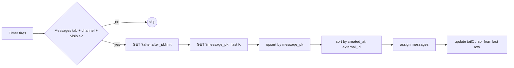

## Admin chat live updates — design (v1)

### 1. Requirements

**Functional**

| ID | Requirement |
|----|-------------|
| **R1** | New messages appear in the **Messages** view without browser reload while the channel is selected. |
| **R2** | In-place changes to the **last K** rows (transcript, TTS, attachments) refresh in place. **K = 2** (constant, configurable). Older rows out of scope. |
| **R3** | **Manual Refresh** and initial load behave as today — full history fetch. |
| **R4** | Sidebar / channel list freshness is **out of scope** for v1 (separate ticket if needed). |

**Non-functional**

| ID | Requirement |
|----|-------------|
| **N1** | Single message-listing route: extend **`GET /api/chat-channels/{channel_id}/messages`** only. |
| **N2** | Reuse **`_sync_history` / `_sync_list`** for tail; one new thin hydrator for by-pk resync, sharing **`_history_row`**. |
| **N3** | No dependency on `messages.updated_at` (column does not exist). |
| **N4** | Polling **pauses** when the Messages view is not active or the document is hidden. |

---

### 2. API — single route, three modes (mutually exclusive params)

| Mode | Query | Server path |
|------|-------|-------------|
| **Full** *(default, no params)* | — | `_sync_history(wp, channel_id, limit=None)` (today). |
| **Tail (new messages)** | **`after` + `after_id` + `limit`** *(both cursor parts always sent together)* | `_sync_history(..., after, after_id, limit)` → `_sync_list`. |
| **By-pk resync (recent edits)** | **`message_pk`** (repeatable, e.g. `?message_pk=12&message_pk=13`) | New thin hydrator: `SELECT * FROM messages WHERE id IN (...) AND channel_id=?` → reuses `_history_row` + same attachment join as `_sync_history`. |

**Constraints**

- **Tail cursor is always the pair** `(after, after_id)`. Server may technically accept `after` alone, but the **client never sends one without the other** — eliminates ambiguity at page boundaries.
- **`message_pk` resync** validates `channel_id` ownership and caps the input list (e.g. `≤ 16`) to bound query cost.
- **Response envelope unchanged**: `data: ChatHistoryMessage[]`. Empty `data` = no changes in window.

---

### 3. Server changes

- `ChatChannelsService.list_messages_all` accepts optional **`after`**, **`after_id`**, **`limit`**, **`message_pks`**.
  - With `message_pks` → calls a small new helper that mirrors `_sync_history` row construction but selects by id list.
  - Otherwise → existing `_sync_history` call (full or tail).
- Route handler parses query params; rejects mixing `after*` and `message_pk` in one call.

---

### 4. Client — controller state

| State | Role |
|-------|------|
| **`messages`** | `ChatHistoryMessage[]` — `$state`, sole UI source. |
| **`tailCursor`** | `{ created_at, external_id } \| null` — taken from the **last** element of sorted `messages` after every successful merge. `null` until first load completes. |
| **`pollTimer`** | Single `setInterval` handle. |
| **`syncing`** | Boolean flag for *silent* polling indicator — distinct from `messagesLoading` (which stays bound to initial/manual loads). |
| **`pollErrorStreak`** | Counter to drive backoff. Cleared on success. |

**Constants** (one module, e.g. `chat-channels-poll-config.ts`)

| Constant | Default | Purpose |
|----------|---------|---------|
| `POLL_INTERVAL_MS` | **2000** | Tick cadence (matches `STATUS_STREAM_INTERVAL_SECONDS`). |
| `RECENT_RESYNC_K` | **2** | How many trailing rows to refresh by pk per tick. |
| `TAIL_LIMIT` | **50** | Tail page size. |
| `BACKOFF_STEPS_MS` | `[2000, 5000, 15000, 30000]` | Error backoff schedule. |

---

### 5. Polling tick (sequence)

**Per tick:**

1. **Eligibility gate** (see §6). Skip if not eligible.
2. **Tail call** with `tailCursor` + `TAIL_LIMIT`.
3. **By-pk resync** for the **last K** `message_pk`s currently in `messages` (after step 2 merge — so brand-new rows from this tick can be among the K).
4. **Merge:** map keyed by `message_pk`, **upsert** every returned row, then `messages = sortByCreatedAtThenExternalId(values)`.
5. **Update `tailCursor`** from the **last** array element.
6. On any HTTP error → §7.

**Tail seeding:** if `tailCursor` is `null` (e.g. empty channel after initial load), use the last row’s cursor; if channel truly has no rows, skip the tail call (resync also no-op).

---

### 6. Pause / visibility (N4)

Polling runs **only** when **all** are true:

- Active tab **= Messages**.
- A **channel is selected**.
- `document.visibilityState === 'visible'`.
- Messages section is **mounted**.

Implementation: single `derived` of those flags; on transition `true → false`, `clearInterval`; on `false → true`, run an immediate tick then `setInterval`. `visibilitychange` and tab-change listeners feed the same gate. Hidden-tab catch-up = one tick on resume; nothing more.

---

### 7. Failure handling

- **Silent poll errors do not clobber `messagesError`** (which belongs to initial/manual loads).
- Maintain `pollErrorStreak`; cadence = `BACKOFF_STEPS_MS[min(streak, last)]`.
- Reset streak on first success; restore base interval.
- After **N consecutive failures** (e.g. 5), surface a **subtle banner** ("Live updates paused — retrying") and keep retrying at the max backoff. **Never** auto-replace `messages`.
- Manual **Refresh** clears the streak and forces a full reload.

---

### 8. Merge contract (pinned)

- **Key:** `message_pk` (integer).
- **Sort:** ascending by `(created_at, external_id)` — **identical** to `_sync_list` server order. Encapsulate in one helper used by all merges to prevent drift.
- **De-dupe:** map upsert is sufficient; tail’s strict `>` cursor means duplicates are rare but not catastrophic.
- **Empty payloads:** treated as success, no state change beyond clearing the error streak.

---

### 9. Out of scope (deferred)

- **Out-of-order inserts** (a row with `created_at` earlier than current cursor): not handled in v1. **Mitigation:** manual **Refresh** is always available; this is acknowledged as a **known limitation**, not a feature.
- **`updated_at`-based incremental edits beyond last K**: requires schema + writer changes — v2.
- **Channel list / sidebar live updates** — v2.
- **Reverse pagination / windowed initial load** — v2 if large channels become a concern.

---

### TL;DR

- **One route, three modes:** full (default), **tail** (`after`+`after_id`+`limit`, paired), **by-pk resync** (`message_pk` repeatable, capped, channel-scoped).
- **Client tick (2 s):** tail → resync last **K = 2** → upsert by `message_pk` → sort by `(created_at, external_id)` → update `$state` + `tailCursor`. Eligibility gates on tab, selection, `visibilityState`, mount.
- **Failures:** silent backoff (`2 / 5 / 15 / 30 s`), separate from `messagesError`, banner after sustained failure.
- **Known limitation:** out-of-order inserts not auto-healed in v1 — manual Refresh covers it.