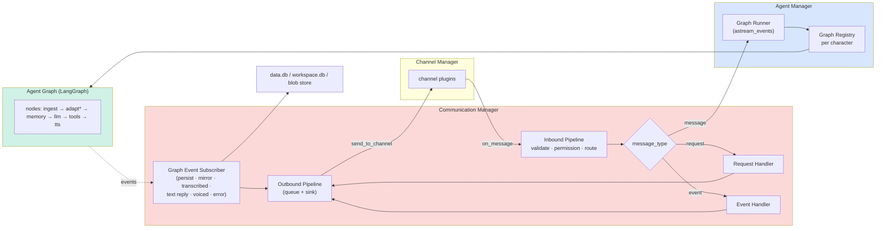
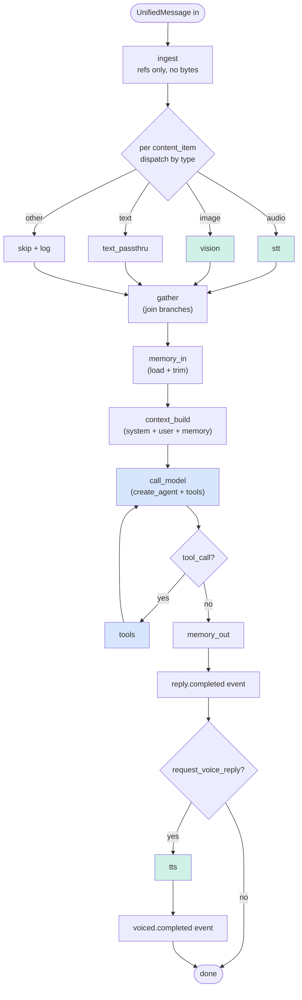
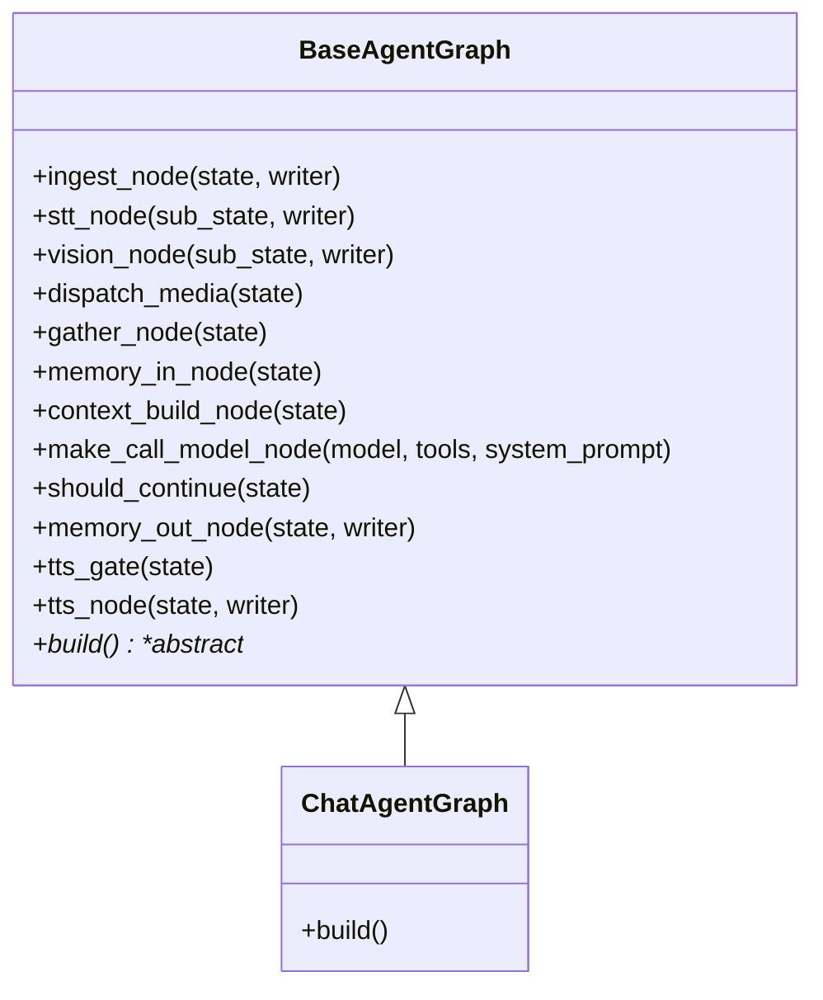
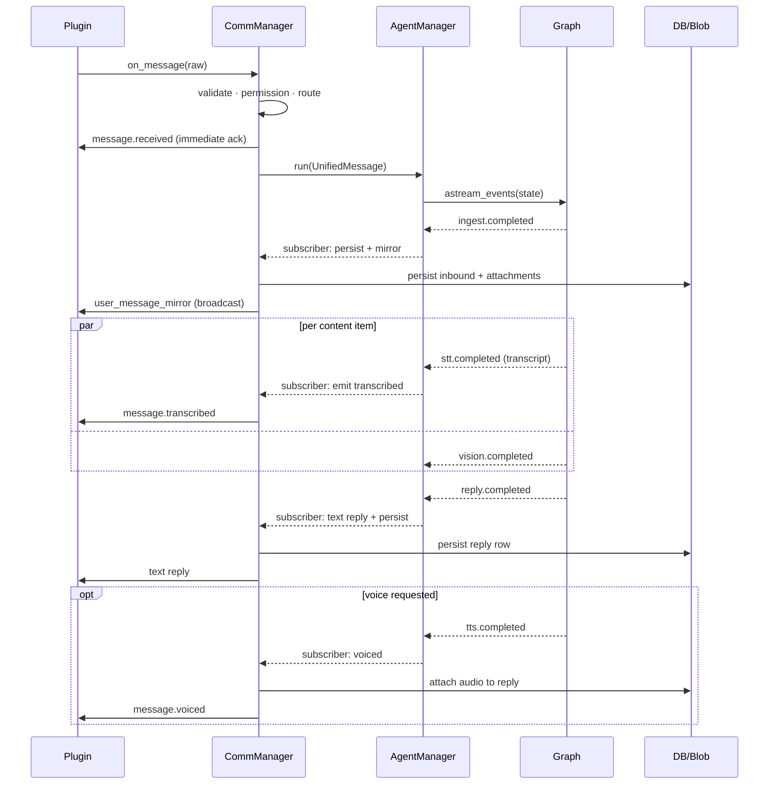

# Agent Graph Redesign — STT/TTS as Graph Nodes

> Move all model-touching steps (STT, vision, LLM, tools, TTS) into a single
> LangGraph agent graph. Communication Manager becomes a thin wire +
> outbound subscriber. Agent Manager becomes a graph runner + event bridge.
>
> Initial-development mode: no backward compatibility, no migration, no wrappers.

## Why

- STT and TTS are model invocations, not media I/O. They share providers,
  credentials, cost/latency profile, and failure modes with the chat model.
- LangGraph gives us per-node telemetry, retry, parallel branches, streaming
  via `astream_events`, and unified state — all currently hand-rolled or absent
  for STT/TTS.
- Planned next nodes (`memory_in`, `context_build`, `memory_out`) make the
  graph the gravity center anyway. Keeping STT/TTS outside becomes the odd
  duck and grows `agent_manager.py` (already 857 lines).
- Reusable nodes + base/child graph classes set up future flows cheaply.

## Boundary after the move

- **CommManager** — wire + routing + outbound subscriber. No more adapter
  pipeline, no `MessageFlow`, no post-adapt hooks, no `inbound_queue`.
- **AgentManager** — graph runner + event bridge. Resolves graph per
  character, invokes via `astream_events`, forwards events to CommManager
  outbound queue.
- **Graph** — all model-touching steps as nodes. One base graph + one child
  for the current chat flow. No speculative voice-only/transcribe-only graphs.

### CommManager loses

- `MessageFlow`
- `MessageAdapterPipeline` + audio/image adapters
- All post-adapt hooks (`AdapterErrorLogHook`, `AudioTranscriptHook`,
  `PersistenceHook`, `UserMessageMirrorHook`, `InboundEnqueueHook`)
- `inbound_queue` (replaced by direct `AgentManager.run(msg)` invocation)

### CommManager keeps

- `InboundPipeline` — validate · permission · route by `message_type`
- Immediate `message.received` ack at routing, before the graph runs
- `RequestHandler`, `EventHandler`
- `OutboundPipeline` + queue + sink
- **New:** graph event subscribers producing: persist inbound,
  user-message mirror, `message.transcribed`, text reply, `message.voiced`,
  error fallback

## High-level component diagram



## Graph design



- Green = reusable model-invocation nodes.
- Blue = reasoning nodes.
- Memory placeholder = trimming today (summarization removed); swappable later.
- Persistence and broadcast (`reply_persist`, `voiced_persist`,
  `mirror_user_message`) live in CommManager subscribers, not graph nodes.

### Reusable-node hierarchy

Nodes are bound methods on `BaseAgentGraph`. Concrete graphs subclass and
override `build()` to wire chosen nodes into a `StateGraph`.



Only `ChatAgentGraph` ships now. New flows add child classes later, reusing
the same node methods.

## Graph state

Keep state small and ref-only. Bytes never enter the graph state.

| Field | Type | Notes |
|---|---|---|
| `message` | `UnifiedMessage` | inbound envelope, refs only |
| `attachments` | `list[BlobRef]` | `blob_id` + `media_type` + `size` |
| `transcripts` | `list[str]` | filled by `stt` per audio item |
| `visions` | `list[str]` | filled by `vision` per image item |
| `text_inputs` | `list[str]` | filled by `text_passthru` |
| `memory` | provider-shaped | filled by `memory_in`, written by `memory_out` |
| `context` | provider-shaped | built by `context_build` |
| `reply_text` | `str \| None` | produced by `call_model` |
| `reply_audio` | `BlobRef \| None` | produced by `tts` |
| `errors` | `list[NodeError]` | per-node failures, surfaced via events |

## Event contract (graph → CommManager)

| Graph event | Subscriber action |
|---|---|
| `node:ingest.completed` | persist inbound + emit `user_message_mirror` broadcast |
| `node:stt.completed` (per item) | emit `message.transcribed` |
| `node:vision.completed` | (none on the wire today; logged) |
| `node:reply.completed` | emit text reply, persist outbound reply row |
| `node:tts.completed` | persist audio attachment row, emit `message.voiced` |
| `node:graph.error` | emit canned error reply (single fallback for v1) |

- Subscribers are ordered per event type (e.g. persist before mirror) and own
  the same ordering guarantees the post-adapt hooks gave us today.
- Streaming text replies are deferred. Today we emit on `reply.completed`.
- Per-node fine-grained error events are deferred. Single `graph.error` first.

## Inbound message sequence (new)



## Code layout (final, as built)

Stays inside `hiroserver/hirocli/`. No per-node files — nodes are bound
methods on `BaseAgentGraph`.

```text
hirocli/runtime/
  communication_manager.py       # slim: routing + outbound + subscriber facade
  inbound_pipeline.py            # validate → permission → dispatch by message_type
  outbound_pipeline.py           # unchanged
  graph_event_subscriber.py      # NEW: bridges graph events to outbound + storage
  agent_manager.py               # slim: graph runner + event bridge
  agent_graph/
    __init__.py                  # public exports
    state.py                     # GraphState (TypedDict) + reducers
    events.py                    # event names + payload TypedDicts
    base.py                      # BaseAgentGraph: services + all node methods
    chat.py                      # ChatAgentGraph(BaseAgentGraph): build() override
```

Provider implementations are unchanged and stay where they are:

```text
services/
  stt/                           # OpenAI + Gemini providers
  tts/                           # OpenAI + Gemini providers
  vision_service.py
```

The graph nodes are thin (5–30 lines each) and call into these services.

Deleted:
  - `runtime/message_flow.py`
  - `runtime/message_adapter.py`
  - `runtime/post_adapt_hooks.py`
  - `runtime/trimming_agent_graph.py`
  - `runtime/adapters/` (whole package)

## Implementation notes

- **No `create_agent`**: graph wired by hand using `StateGraph` + `ToolNode`
  so every node is individually visible in `astream` events. The compiled
  graph is what we cache per character.
- **Retry**: per-node `RetryPolicy(max_attempts=2)` on `stt`, `vision`,
  `tts`. The LLM step keeps its current canned-fallback path via the
  `graph.error` subscriber.
- **Parallel branches**: dispatch fan-out via LangGraph `Send` API for
  per-content-item parallelism on `stt` / `vision`. Join in `gather`. When
  there is nothing to fan out to, the conditional edge returns the string
  `"gather"` (regular routing) so the parent state isn't replaced by an
  empty Send sub-state.
- **Bytes never enter parent state**: audio/image bodies ride only on the
  Send sub-state dicts; results merge back into parent state as small
  ref-only structures (transcripts, descriptions). `gather` clears the
  per-turn `audio_items`/`image_items` so the long-lived checkpoint stays
  small.
- **Long-term checkpointed state ≈ `messages`**: trimmed to the latest
  six messages by the `memory_in` node (matches the prior trimming graph).
- **Compiled-graph cache**: keyed on character identity (system prompt
  hash + model settings + tools). STT/TTS provider config flows via service
  injection at `BaseAgentGraph` construction; per-call values that ever
  need to vary live in `RunnableConfig`, never in the cache key.
- **Per-run subscriber state**: keyed by `inbound_id`. Holds `reply_pk`
  (set when persistence runs, read when TTS attaches audio), and an
  optional `asyncio.Event` set as soon as inbound persistence is done so
  synchronous injectors (`message_send`) can release.
- **Telemetry**: LangSmith is free wiring — leave it on. OTEL switch is a
  later decision; not a code-design constraint now.
- **Removal of `inbound_queue`**: routing calls
  `CommunicationManager._dispatch_to_agent(msg, await_persisted=…)` which
  spawns `AgentManager.handle(msg)` as a task. CommManager no longer holds
  an agent worker.

## Logging changes

Follow the human-first logging rule. Each node logs **once** at completion
with structured extras.

| Where | Level | Shape |
|---|---|---|
| Per-node start (DEBUG) | `DEBUG` | `node={name} thread={tid}` |
| Per-node completion | `INFO` | `✅ {node} — {character} · {kind}` + `elapsed_ms`, content hint, opaque ids last |
| Per-node failure | `WARNING` / `ERROR` | `❌ {node} — {character} · {kind}` + `error`, `exc_info=True` |
| Graph dispatched | `INFO` | `⬇️ graph in — {sender} · {kind}` (replaces today's queue-pop log) |
| Graph completed | `INFO` | `⬆️ graph out — {character} · text/voice` + total `elapsed_ms` |
| Subscriber outcomes | `INFO` | `⬆️ {envelope} — {target}` for each emitted envelope |

Drop:

- The hook-by-hook log lines from the post-adapt chain (subsumed by node
  completion logs).
- Adapter-specific log lines (now under `node:stt` / `node:vision`).
- TTS detached-task logs (now under `node:tts`).

Add a graph correlation id (graph run id) into the logging scope so all
node logs for one inbound message share scope and stay grep-able.

## Documentation changes (mintdocs)

Brief — full updates after implementation.

| Doc | Change |
|---|---|
| `architecture/concepts/agent-manager.mdx` | Replace "Message preparation" + "Reply pipeline" + "Voice reply pipeline" sections with the graph diagram, node list, and event contract. Note `AgentManager` is now a graph runner. |
| `architecture/concepts/communication-manager.mdx` | Remove `MessageFlow`, adapter pipeline, post-adapt hooks, `inbound_queue`. Add "Graph Event Subscriber" section + new boundary diagram. Keep request/event handler sections as-is. |
| `architecture/concepts/architecture-overview.mdx` | Update arrows: CommManager → AgentManager direct call (no queue); Graph as first-class component; subscribers feed the outbound pipeline. |
| `architecture/concepts/message-persistence.mdx` | Reword "post-adapt persistence" to "graph-event persistence subscriber". Persistence semantics unchanged. |
| `architecture/concepts/message-persistence/file-transfer-and-resolver.mdx` | TTS attachment write moves under the `voiced.completed` subscriber. Wire shape unchanged. |
| `architecture/protocol/unified-message.mdx` | No protocol change. `message.transcribed` / `message.voiced` envelopes identical. |
| `architecture/misc/tools-architecture.mdx` | No change (tools still loop inside `call_model`). |

## Out of scope (for this pass)

- Token-level text streaming on the wire.
- Sentence-level streaming TTS.
- Per-flow graph variants (voice-only, transcribe-only).
- Per-tool graph nodes.
- Fine-grained per-node error envelopes.
- Checkpoint replay machinery.
- OTEL migration.
- Extracting the graph into its own package.

## Implementation status (built)

- [x] `MessageFlow`, `MessageAdapterPipeline`, all post-adapt hooks,
      `inbound_queue`, `trimming_agent_graph`, `runtime/adapters/` removed.
- [x] `runtime/agent_graph/` package with 5 files
      (`__init__`, `state`, `events`, `base`, `chat`) — nodes are methods on
      `BaseAgentGraph`, providers stay in `services/`.
- [x] `AgentManager.serve()` opens checkpointer + builds `ChatAgentGraph`;
      `AgentManager.handle(msg)` runs the graph per inbound and forwards
      custom-stream events to the subscriber.
- [x] `graph_event_subscriber.py` covers persist + mirror + transcribed +
      text reply + voiced + canned error fallback.
- [x] Wire shapes for `message.received`, `message.transcribed`, text
      reply, `user_message_mirror`, `message.voiced` are unchanged.
- [x] Per-node `RetryPolicy(max_attempts=2)` on `stt`, `vision`, `tts`.
- [x] `agent_manager.py` reduced from 857 → ~360 lines.
- [x] All existing runtime + tools tests pass; one stale TTS test was
      removed (it tested a private method that no longer exists; the
      behaviour now belongs to `GraphEventSubscriber`).
- [x] mintdocs pages listed above updated (`agent-manager.mdx`,
      `communication-manager.mdx`, `hiro-server-components.mdx`,
      `message-persistence.mdx`,
      `message-persistence/device-history-sync.mdx`,
      `channel-manager.mdx`, `http-server.mdx`,
      `protocol/protocol-contract.mdx`).

## Reflecting build updates

Per `reflecting-build-updates` rule:

- No new dev tools. No `mintdocs/build/first-time-setup.mdx` change expected.
- No config file format changes. No workspace wipe required.
- After merging, restart `hiroserver` to pick up the new graph runner. The
  workspace `workspace.db` checkpoint table is reused as-is; existing
  threads continue to work because the LangGraph thread id contract
  (`channel_id` as string) is unchanged.
- If summarization is reintroduced later, it returns as additional graph
  nodes, not a separate graph object — no further breaking change expected.
