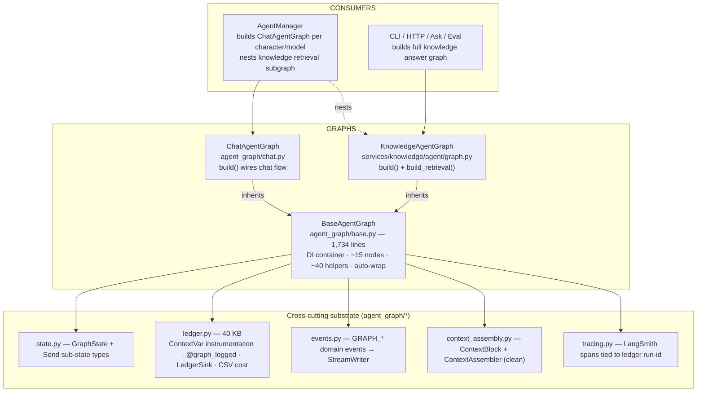
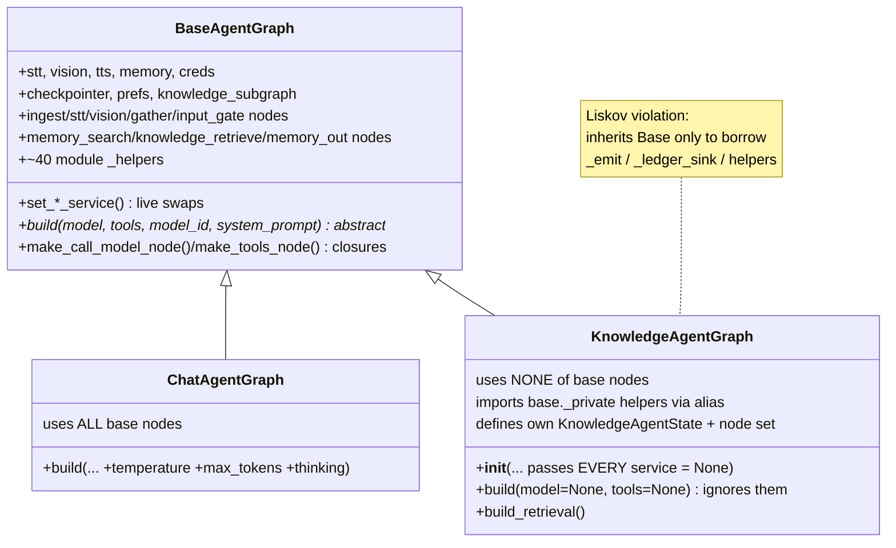
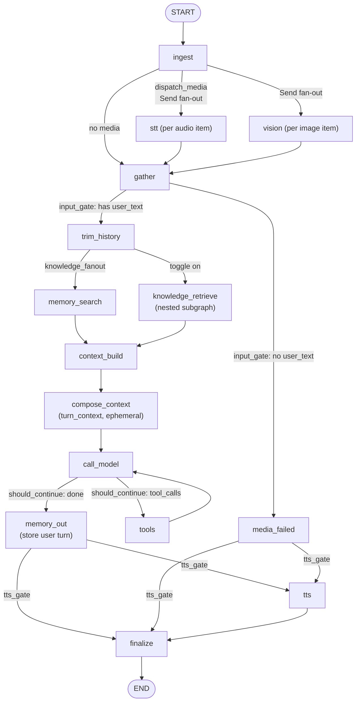
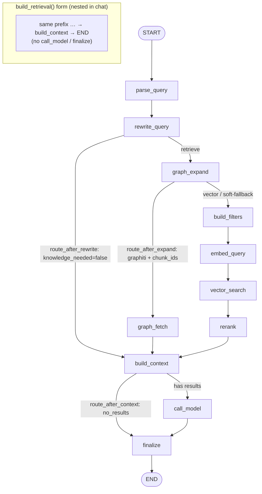
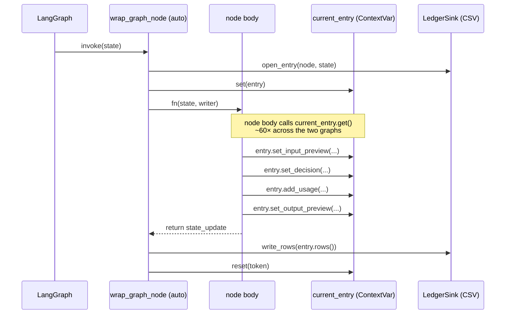
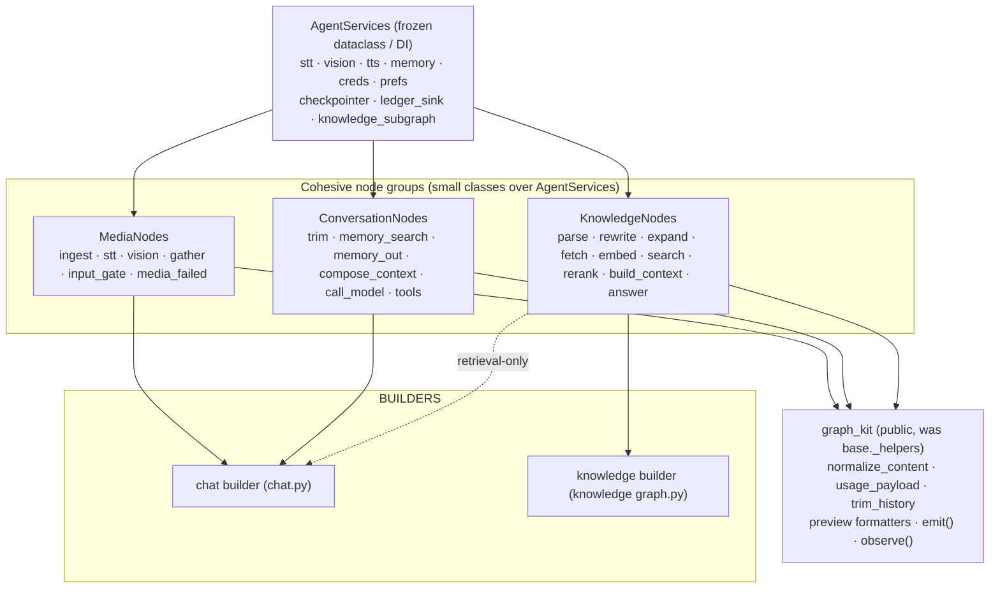
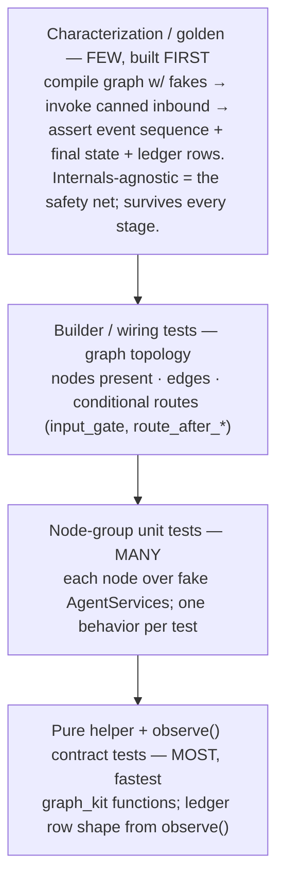

# Agent Graph Refactor — Composition, Cohesion, and a Test Spine

> **Tracker doc (single source).** Design + staged plan to refactor the two LangGraph
> graph classes — the live chat agent (`ChatAgentGraph`) and the knowledge RAG graph
> (`KnowledgeAgentGraph`) — off a 1,734-line god base class and onto a **composition**
> model, while **growing a test spine that keeps each stage provably solid**. The central
> rule of this plan: *no structural change lands without a test that pins the behavior it
> touches* — characterization tests first, finer-grained tests added at each new seam.
>
> **Companions:** [`context-assembly.md`](context-assembly.md) (the already-clean block
> assembler this refactor uses as its template), [`langgraph_tips.md`](langgraph_tips.md).
>
> **Mode:** initial development — **no backward compatibility / no migration / no wrappers**
> (repo rule, explicitly abided). We delete the old base inheritance outright rather than
> shimming it.
>
> **Status:** _Proposed._ No code yet. Stages P1–P3 are the first slice (highest leverage,
> contained blast radius); P4–P8 follow.

---

## 1. The one-paragraph version

Two graphs share one base. `ChatAgentGraph` legitimately uses every node on
`BaseAgentGraph`; `KnowledgeAgentGraph` **inherits the same base but `is-a` nothing** of it
— it nulls every injected service, uses none of the inherited nodes, and reaches into the
base's `_private` helpers via aliased imports. The base is therefore a **god object** (DI
container + ~15 nodes + ~40 helpers + two node styles), the `build()` contract is fictional
(each subclass diverges from its signature), and **ledger bookkeeping is hand-poked inside
every node** (~60 `if entry := current_entry.get(): …` sites, ~40% of each node body). The
fix is to **replace inheritance-as-code-sharing with composition**: an injected
`AgentServices` container, cohesive node groups, a shared public `graph_kit` for helpers, and
a **declarative ledger** so nodes stop poking ContextVars. Because the graph's *observable*
contract (events emitted, final state, ledger rows) is well-defined, we can wrap it in
**characterization tests first** and refactor underneath them with confidence.

---

## 2. Current design — top down

### 2.1 Layering



### 2.2 Class design — and the inheritance problem



`ChatAgentGraph` is an honest subclass. `KnowledgeAgentGraph` is the smell: it extends the
base purely as a *utility namespace*, then has to (a) pass `None` for stt/vision/tts/memory/
creds/checkpointer, (b) import `_estimate_text_tokens as estimate_text_tokens` and friends,
and (c) accept a `build()` signature whose `model`/`tools` it discards.

### 2.3 ChatAgentGraph — per-message flow



**Invariants worth preserving (the genuinely good parts):**

- **Bytes never enter the checkpoint** — audio/image bodies ride `langgraph.types.Send`
  sub-states; only transcripts/descriptions merge back via reducers. `gather` clears the
  byte fields.
- **`turn_context` is ephemeral** — memory + knowledge + citation are rendered once into
  `turn_context` and injected into the *current user turn* at `call_model`; they never enter
  durable `messages`, so persona stays a stable, cache-friendly system message.
- **Trim once, then fan out** — memory and knowledge read the identical trimmed window.
- **Degrade, never crash** — every external call (STT/vision/memory/LLM/TTS/knowledge) has a
  logged fallback path.

### 2.4 KnowledgeAgentGraph — retrieval legs



Two compiled forms from one node set: `build()` (full Ask/CLI/HTTP answer) and
`build_retrieval()` (retrieval-only subgraph, nested per chat turn so its `knowledge/*` rows
fold into the chat run's ledger). The `graph_mode` legs (`off` flat vs `graphiti`) are
encoded across five nodes via the `route_after_*` static methods.

### 2.5 The ledger — a dual instrumentation mechanism

The reason nodes are large. Each node is wrapped *declaratively* by the framework **and**
pokes the ledger *imperatively* from inside its own body.



The wrapper already owns row open/close/write. The in-body `if entry := current_entry.get():`
blocks are pure boilerplate that bloats every node — the single biggest readability tax and
the thing P3 removes.

---

## 3. Problems (the refactor targets)

| # | Problem | Evidence | Impact |
|---|---------|----------|--------|
| 1 | `BaseAgentGraph` god object | 1,734 LOC: DI + ~15 nodes + ~40 helpers | navigate/test/extend cost |
| 2 | `KnowledgeAgentGraph` inherits a base it isn't | nulls all services; aliased `_private` imports | Liskov violation, fragile |
| 3 | Fictional `build()` contract | Chat *adds* tuning args; Knowledge *ignores* model/tools | leaky abstraction |
| 4 | Imperative ledger inside nodes | ~60 `if entry := …get()` sites | ~40% boilerplate per node |
| 5 | Two node styles | bound-method nodes vs `make_*_node` closures | inconsistent, two wrap paths |
| 6 | Mega-nodes | `tts_node` ~160 LOC, `call_model` ~90, `graph_expand` ~120 | low cohesion, hard to test |
| 7 | Monolithic state | `GraphState` 30 fields, `KnowledgeAgentState` 35; invariants in comments | silent-drop bugs |
| 8 | Scattered access | inline imports + per-method `try/except` prefs accessors | duplication |

---

## 4. Target architecture — composition



Key shifts vs today: **no shared base class**; services are *injected data*, not inherited
attributes; helpers are *public and shared*, not `_private` and aliased; nodes are *grouped
by domain* and *uniform in style*; the ledger is a `graph_kit.observe(...)` call that no-ops
without an entry, not a hand-rolled guard block.

---

## 5. The test spine (the heart of this plan)

The refactor is only as safe as the net under it. We build that net **before** moving code,
then thicken it at each new seam.

### 5.1 Test pyramid



### 5.2 Characterization first — lock behavior before touching it

Before P1, add `test_chat_graph_characterization.py` and
`test_knowledge_graph_characterization.py` that treat each graph as a black box:

- **Fakes, not mocks of internals.** Build a `conftest` with `FakeSTT`, `FakeVision`,
  `FakeTTS`, `FakeMemory`, `FakeKnowledgeSubgraph`, and a `FakeChatModel`
  (`langchain_core.language_models.fake_chat_models.FakeMessagesListChatModel` returning a
  canned `AIMessage`, including a tool-call turn for the loop). These already align with the
  existing pattern of constructing graphs with `None`/stub services
  (`test_agent_graph_input_gate.py`, `test_graph_ledger.py`).
- **Assert the observable contract**, not the call sequence:
  1. **Events** — the ordered `GRAPH_*` list captured via the `_collect_events()` writer
     stub (already an established pattern).
  2. **Final state** — `reply_text`, `reply_id`, `messages` cleanliness (no `turn_context`
     leaked into history), `audio_items`/`image_items` cleared.
  3. **Ledger rows** — snapshot the CSV rows the run writes (node names, `decision_kind`,
     usage columns) via a temp `LedgerSink`. This is the contract P3 must preserve exactly.
- **Cover the branches that matter:** text-only turn; audio+STT-success; audio-only+STT-fail
  (→ `media_failed`); tool loop (one round); knowledge toggle on/off; knowledge flat leg vs
  graphiti leg; `no_results` → `finalize`.

These tests **do not change** as we refactor internals — a diff that turns them red is a
regression, full stop.

### 5.3 Per-stage test evolution

Each stage ships its own tests *and* must leave §5.2 green.

| Stage | What changes | Tests added this stage | Exit criteria |
|-------|--------------|------------------------|---------------|
| **P1** Extract `graph_kit`, kill knowledge→base inheritance | move ~40 helpers public; `KnowledgeAgentGraph` stops extending `BaseAgentGraph` | pure-fn unit tests for every moved helper; an **import-boundary test** asserting `services/knowledge/**` no longer imports `runtime.agent_graph.base` private names | characterization green; no `_private` cross-imports remain |
| **P2** Per-graph config objects | `ChatGraphConfig` / `KnowledgeGraphConfig` replace fictional `build()` | builder tests: config in → compiled graph with expected nodes; type tests for the configs | both graphs compile from configs; old `build()` signature gone |
| **P3** Declarative ledger (`observe()` / `NodeResult`) | remove in-body `current_entry` pokes | **ledger-row snapshot** tests assert rows identical before/after for each characterization scenario; `observe()` no-op test (no entry → silent) | row snapshots byte-stable; nodes contain zero `current_entry.get()` |
| **P4** Split god class into node groups | `MediaNodes`/`ConversationNodes`/`KnowledgeNodes`; one node style | node-group unit tests per node (the big coverage jump); wiring tests assert builders compose groups | each node unit-tested in isolation over fakes |
| **P5** Slim mega-nodes | extract `resolve_voice→synthesize→meter`; `graphiti_session()` CM | unit tests for extracted helpers incl. the CM's open/close + ContextVar reset on error | `tts_node`/`graph_expand` are orchestration-only |
| **P6** Structure state | sectioned/nested `GraphState`; explicit `Send` sub-state type | typed-state tests; a **checkpoint-surface test** asserting only `messages` survives a thread round-trip | invariants in code/types, not comments |
| **P7** Centralized prefs accessor | one typed accessor + single fallback policy | accessor unit tests (present / absent / malformed prefs → documented fallback) | per-method `try/except` removed |
| **P8** First-class knowledge legs | flat vs graphiti as named sub-pipelines / stage spec | leg-routing tests; per-leg retrieval tests | `graph_mode` branching localized |

### 5.4 What the refactor *buys* testing

Today, unit-testing a node means constructing the whole graph object and threading the
`current_entry` ContextVar; the eager-import fragility in the agent package
(`reference_agent-package-test-placement.md`) is a symptom. After P3–P4, a node is a small
callable over a `FakeAgentServices` with a `NodeResult` return — **pure-ish, ContextVar-free,
trivially unit-testable**. Coverage is expected to climb most at P4 precisely because the
seams finally exist.

### 5.5 Running + gating

- **Local:** `pytest hiroserver/hirocli/src/hirocli/runtime/tests -k "agent_graph or ledger"`
  and `pytest hiroserver/hirocli/src/hirocli/services/knowledge -k "agent or retriev or rerank or rewrite"`.
- **Placement rule (must-honor):** knowledge graph tests go in the **parent**
  `services/knowledge/` dir, **never** inside `services/knowledge/agent/` — a collected test
  there corrupts `agent.graph` for later monkeypatch tests (full-suite-only failure). See
  `reference_agent-package-test-placement.md`.
- **Gate:** characterization + ledger-snapshot suites are the merge gate for every stage.

---

## 6. Sequencing & risk

```mermaid
flowchart LR
    C["§5.2 Characterization net"] --> P1 --> P2 --> P3
    P3 --> P4 --> P5
    P4 --> P6
    P3 --> P7
    P4 --> P8
    P1 -.lowest risk.-> P1
    P3 -.highest obs. risk → snapshot gate.-> P3
```

- **First slice = P1 → P2 → P3.** Most of the readability/testability win, contained blast
  radius, and it stands on the characterization net.
- **Highest-risk stage = P3** (it touches the cost/observability ledger every node feeds).
  Mitigation: the byte-stable ledger-row snapshot gate in §5.3.
- **No-backward-compat:** P1 *deletes* the knowledge→base inheritance and the old `build()`
  rather than shimming. Expected breakage is compile-time and caught immediately by the
  builder/characterization suites.
- **Rollback:** each stage is an independent PR behind the same green gate; revert is one PR.

---

## 7. Open decisions

- **P3 shape:** thin `observe(decision=…, input=…, output=…, usage=…)` helper (smaller diff,
  nodes still call it) **vs** a `NodeResult` return that the wrapper unwraps (purer nodes,
  larger diff). _Leaning `NodeResult`_ for the testability win, but `observe()` is a valid
  cheaper first step. **Needs a call before P3.**
- **Node style (P4):** parametrized node **classes** with `__call__` vs keeping factory
  closures. _Leaning classes_ for a single uniform wrap path.
- **State (P6):** nested `TypedDict` slices vs a documented flat layout with one
  checkpoint-surface docstring. _Leaning nested slices._

---

## 8. TL;DR

- **Goal:** move both graphs off the 1,734-line `BaseAgentGraph` god class onto
  **composition** — injected `AgentServices`, cohesive node groups, a shared public
  `graph_kit`, and a **declarative ledger** — without regressing the observable contract.
- **Why now:** `KnowledgeAgentGraph` inherits a base it `is-a` nothing of (nulls every
  service, imports `_private` helpers), `build()` is fictional, and ~60 in-body ledger pokes
  bloat every node.
- **Test spine (the ask):** **characterization/golden tests first** (events + final state +
  ledger-row snapshots, internals-agnostic), then **per-stage tests at each new seam** —
  pure-fn tests at P1, builder tests at P2, **byte-stable ledger snapshots at P3**, the big
  node-group unit-test jump at P4, and so on. Every stage must leave the characterization net
  green; that net is the merge gate.
- **Sequencing:** **P1 → P2 → P3** first (best leverage, lowest risk); P3 is the
  highest observability risk and is gated by ledger snapshots. P4–P8 follow.
- **Honor:** the knowledge **test-placement rule** (tests in `services/knowledge/`, not
  `…/agent/`) and **no-backward-compat** (delete, don't shim).
- **Open calls before P3/P4:** `observe()` vs `NodeResult`; node classes vs closures; nested
  vs flat state.
- **Status:** _Proposed_ — written, no code yet. Say the word and I'll start P1 with its
  characterization net in the same PR.
