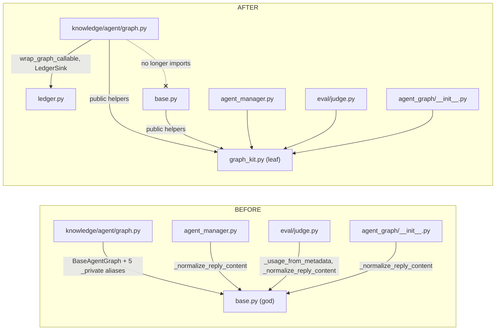
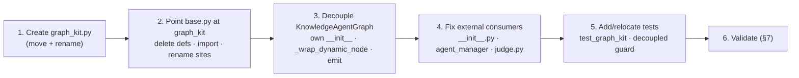

# P1 — Extract `graph_kit` & Decouple Knowledge from `BaseAgentGraph`

> **Execution plan (single source) for Stage P1** of
> [`agent-graph-refactor-design.md`](agent-graph-refactor-design.md). Written so a junior
> agent can build it end-to-end and **validate its own work** without further guidance.
>
> **Preconditions:** the §5.2 *characterization net* from the design doc is **done and green**
> (`test_chat_graph_characterization.py`, `test_knowledge_graph_characterization.py`,
> ledger-row snapshots). P1 must keep it green at every step — that net is your regression
> alarm. If it is **not** present, stop and build it first; do not start P1 without it.
>
> **Mode:** initial development — **no backward compatibility / no migration / no wrappers**
> (repo rule, abided). We **delete** old definitions and **update every call site**; we do
> **not** leave re-export shims behind.
>
> **Status:** _Ready to build._

---

## 1. Goal & scope

**Goal.** Two outcomes, one PR:

1. **Extract** the small set of *shared* graph helpers out of the 1,734-line `base.py` into a
   new **public** module `runtime/agent_graph/graph_kit.py`.
2. **Decouple** `KnowledgeAgentGraph` so it **no longer inherits** `BaseAgentGraph` — it gets
   the two things it actually needs (a `LedgerSink` and a node-wrap helper) on its own, and
   imports shared helpers from `graph_kit` by their **public** names (no more
   `_private as alias` reach-ins).

**In scope:** moving ~8 helpers + 1 constant, adding one `emit()` free function, breaking the
inheritance, and updating all 6 external call sites + tests.

**Out of scope (do NOT do here — later stages):** splitting node groups (P4), the
declarative ledger / `observe()` (P3), config objects (P2), touching node *bodies* beyond the
mechanical rename of moved helpers, moving chat-only helpers. **Leave chat-only helpers in
`base.py`** — they migrate with their nodes in P4.

> **Why only the shared subset, not "all ~40 helpers"?** P1's real job is breaking the
> coupling. Moving exactly the helpers both graphs share (plus their private dependencies)
> achieves that with the smallest blast radius. Chat-only previews/formatters
> (`_audio_item_preview`, `_tool_args_one_line`, `_trim_chat_history`, …) stay put.

---

## 2. The `graph_kit` public surface

Create `hiroserver/hirocli/src/hirocli/runtime/agent_graph/graph_kit.py`. Move these
**verbatim** from `base.py` and rename (drop the leading underscore), except `_int_token`
which stays private *inside* `graph_kit`.

| Move from `base.py` (old name) | New name in `graph_kit` | Notes |
|---|---|---|
| `_normalize_reply_content` | `normalize_reply_content` | no deps |
| `_estimate_text_tokens` | `estimate_text_tokens` | uses `math` |
| `_relevance_of` | `relevance_of` | duck-typed getattr |
| `_KNOWLEDGE_PREVIEW_MAX = 600` | `KNOWLEDGE_PREVIEW_MAX = 600` | module constant |
| `_knowledge_results_rows` | `knowledge_results_rows` | calls `relevance_of` |
| `_usage_from_metadata` | `usage_from_metadata` | calls `_int_token` |
| `_int_token` | `_int_token` (**stays private**) | helper of `usage_from_metadata` |
| `_llm_usage_payload` | `llm_usage_payload` | calls `usage_from_metadata` |
| `BaseAgentGraph._emit` (static) | `emit(writer, name, payload)` (free fn) | new home; body = `writer(make_event(name, payload))` |

**`graph_kit.py` imports** (only what the moved code needs — keep it a leaf module):

```python
from __future__ import annotations
import math
from typing import Any
from langchain_core.messages import AIMessage
from .events import make_event   # events.py imports nothing from us → no cycle
```

Add a top-of-file docstring stating *why* the module exists (extracted from `base.py` to give
both graphs a shared, dependency-free helper surface and break the `KnowledgeAgentGraph` →
`BaseAgentGraph` coupling). This satisfies the repo `code-comments` rule.

> **`hiro-commons` consideration (per the common-utility rule):** these helpers are
> LangChain/graph-specific (message-content normalization, LLM-usage payloads) and used only
> by hirocli's two graphs — they belong in the `agent_graph` package, **not** `hiro-commons`.
> Decision recorded; do not relocate to commons.

---

## 3. Import topology — before / after



The single defining assertion of P1: **`knowledge/agent/graph.py` imports nothing from
`agent_graph.base`.**

---

## 4. File-by-file change checklist

### 4.1 NEW `runtime/agent_graph/graph_kit.py`
- [ ] Create the module with the imports in §2 and the 8 helpers + 1 constant + `emit`, all
      moved verbatim and renamed per the table. Keep `_int_token` private.

### 4.2 `runtime/agent_graph/base.py`
- [ ] **Delete** the 8 helper defs + the constant now living in `graph_kit` (old lines around
      `_normalize_reply_content` 1452, `_relevance_of` 1499, `_KNOWLEDGE_PREVIEW_MAX` 1512,
      `_knowledge_results_rows` 1515, `_llm_usage_payload` 1648, `_usage_from_metadata` 1670,
      `_int_token` 1692, `_estimate_text_tokens` 1707).
- [ ] **Add** an import block: `from .graph_kit import (KNOWLEDGE_PREVIEW_MAX, emit,
      estimate_text_tokens, knowledge_results_rows, llm_usage_payload, normalize_reply_content,
      relevance_of, usage_from_metadata)`.
- [ ] **Replace whole-word** call sites (do this *after* deleting the defs): `_normalize_reply_content`→`normalize_reply_content`,
      `_llm_usage_payload`→`llm_usage_payload`, `_estimate_text_tokens`→`estimate_text_tokens`,
      `_knowledge_results_rows`→`knowledge_results_rows`, `_KNOWLEDGE_PREVIEW_MAX`→`KNOWLEDGE_PREVIEW_MAX`,
      `_relevance_of`→`relevance_of`, `_usage_from_metadata`→`usage_from_metadata`.
      **Do NOT** rename `_int_token` (it's gone from base) or `_emit`.
- [ ] Keep `BaseAgentGraph._emit` but make its body delegate: `emit(writer, name, payload)`.
      (Chat nodes still call `self._emit(...)`; they get reworked in P4. This is an internal
      convenience, not a back-compat shim.)

### 4.3 `services/knowledge/agent/graph.py` — the decoupling
- [ ] Change the class to **not** inherit: `class KnowledgeAgentGraph:` (was
      `(BaseAgentGraph)`).
- [ ] Replace the 6 `from hirocli.runtime.agent_graph.base import …` lines with:
      ```python
      from hirocli.runtime.agent_graph.graph_kit import (
          KNOWLEDGE_PREVIEW_MAX,
          emit,
          estimate_text_tokens,
          knowledge_results_rows,
          llm_usage_payload,
          normalize_reply_content,
      )
      from hirocli.runtime.agent_graph.ledger import LedgerSink, wrap_graph_callable
      ```
      Then drop the local aliases — call them by their public names directly. (Existing body
      already uses `KNOWLEDGE_PREVIEW_MAX`, `estimate_text_tokens`, `knowledge_results_rows`,
      `llm_usage_payload`; the only rename is `_normalize_reply_content`→`normalize_reply_content`
      at the `call_model` answer line.)
- [ ] Rewrite `__init__` to set its own attributes (no `super().__init__`):
      ```python
      def __init__(self, *, workspace_path, service, prefs, workspace_id=None):
          self._workspace_path = workspace_path
          self._service = service
          self._prefs = prefs
          self._workspace_id = workspace_id
          self._ledger_sink = LedgerSink(workspace_path)  # was provided by super()
      ```
- [ ] Add the wrap helper it used to inherit (keeps all ~12 `self._wrap_dynamic_node(...)`
      call sites in `_add_retrieval_nodes`/`build` unchanged):
      ```python
      def _wrap_dynamic_node(self, node_name, fn):
          return wrap_graph_callable(self, node_name, fn)
      ```
- [ ] Replace the 2 `self._emit(writer, …)` calls (in `rewrite_query`, `call_model`) with
      `emit(writer, …)`.

> **Why this is a clean break (sanity cue):** `BaseAgentGraph.__init_subclass__` only
> auto-wraps methods named `*_node` / `node_*`. Knowledge's nodes (`parse_query`,
> `rewrite_query`, `graph_expand`, `call_model`, `finalize`, …) match **neither**, so they
> were **never** auto-wrapped — they're wrapped explicitly via `_wrap_dynamic_node`. Dropping
> the base loses no behavior here.

### 4.4 `runtime/agent_graph/__init__.py`
- [ ] Import `normalize_reply_content` from `.graph_kit` instead of `_normalize_reply_content`
      from `.base`; update `__all__` to the public name (drop the underscore entry).

### 4.5 `runtime/agent_manager.py`
- [ ] Line ~37: split the import — keep `from .agent_graph.base import BaseAgentGraph`, and the
      body does **not** use `normalize_reply_content` (verified: only imported + re-exported).
      **Remove** `_normalize_reply_content` from the import and from the module `__all__`
      (line ~64). No body edits needed.

### 4.6 `services/eval/judge.py`
- [ ] Line ~232: `from hirocli.runtime.agent_graph.base import _usage_from_metadata` →
      `from hirocli.runtime.agent_graph.graph_kit import usage_from_metadata`; rename the call
      at ~244.
- [ ] Line ~294: `from hirocli.runtime.agent_graph.base import _normalize_reply_content` →
      `from hirocli.runtime.agent_graph.graph_kit import normalize_reply_content`; rename the
      call at ~314.

### 4.7 Tests to update / relocate
- [ ] `runtime/tests/test_agent_manager.py`: **move** the three `_normalize_reply_content`
      tests (lines ~29–52) into the new `test_graph_kit.py`, importing
      `normalize_reply_content` from `graph_kit`. Remove the now-dangling import at line ~24.
- [ ] `runtime/tests/test_agent_graph_preferences.py`: line ~7 import `llm_usage_payload` from
      `.graph_kit` instead of `_llm_usage_payload` from `.base`; rename the call at ~119.
      (Keeping it here is fine, or fold it into `test_graph_kit.py`.)

---

## 5. New tests this stage adds

### 5.1 `runtime/tests/test_graph_kit.py` (pure-function unit tests)
Port the existing normalize/usage assertions, then add coverage so every moved helper has at
least one test:
- `normalize_reply_content`: plain str; provider text-block list; multi-block join; `None`.
- `llm_usage_payload` + `usage_from_metadata`: usage-present path and estimate-fallback path
  (reuse the existing `test_agent_graph_preferences.py` case).
- `estimate_text_tokens`: empty → 0; non-empty → `ceil(len/4)`, min 1.
- `relevance_of`: prefers `relevance` → `rerank_score` → `score`; `None` when absent.
- `knowledge_results_rows`: builds `[ref] rel Title :: snippet` rows; respects `limit`.
- `emit`: calls the writer once with `{"event": name, "payload": payload}` (use the
  `_collect_events()` writer-stub pattern from `test_agent_graph_input_gate.py`).

### 5.2 `services/knowledge/test_knowledge_graph_decoupled.py` (the boundary guard)
> **Placement rule (must-honor):** this file goes in `services/knowledge/`, **NOT**
> `services/knowledge/agent/` — a test collected inside the `agent` package corrupts
> `agent.graph` for later monkeypatch tests (full-suite-only failure). See
> `reference_agent-package-test-placement.md`.

```python
import inspect
from hirocli.runtime.agent_graph.base import BaseAgentGraph
from hirocli.services.knowledge.agent.graph import KnowledgeAgentGraph
import hirocli.services.knowledge.agent.graph as kgraph

def test_knowledge_graph_does_not_inherit_base():
    assert not issubclass(KnowledgeAgentGraph, BaseAgentGraph)

def test_knowledge_graph_imports_no_base_privates():
    src = inspect.getsource(kgraph)
    assert "agent_graph.base" not in src  # no import from the god module
```

Add one **smoke** test that `KnowledgeAgentGraph(...).build_retrieval()` still compiles with a
fake `service` and the test workspace — proves the decoupled `__init__` + `_wrap_dynamic_node`
+ `_ledger_sink` wiring is intact end-to-end.

---

## 6. Build order



Work top-down; after step 2 the chat side should already import-clean, after step 3 the
knowledge side should.

---

## 7. Self-validation — run these gates in order

**Gate A — no stale references remain.** Every old underscore name must resolve only to its
new home (zero hits outside `graph_kit.py`'s own definitions and `_int_token`):

```bash
# from repo root, expect: only graph_kit.py (defs) and zero base.py hits
grep -rnE "_normalize_reply_content|_llm_usage_payload|_usage_from_metadata|_estimate_text_tokens|_knowledge_results_rows|_KNOWLEDGE_PREVIEW_MAX|_relevance_of" \
  hiroserver/hirocli/src/hirocli --include="*.py"
# expect: no import of the god module from the knowledge graph
grep -rn "agent_graph.base" hiroserver/hirocli/src/hirocli/services/knowledge --include="*.py"
```

**Gate B — import health / no cycles.** Each module imports cleanly (a cycle would raise here):
```bash
python -c "import hirocli.runtime.agent_graph.graph_kit, hirocli.runtime.agent_graph.base, hirocli.services.knowledge.agent.graph, hirocli.runtime.agent_manager, hirocli.services.eval.judge"
```

**Gate C — targeted test suites green:**
```bash
pytest hiroserver/hirocli/src/hirocli/runtime/tests -k "graph_kit or agent_graph or agent_manager or ledger or characterization"
pytest hiroserver/hirocli/src/hirocli/services/knowledge -k "decoupl or agent or characterization or rewrite or rerank or retriev"
```

**Gate D — the characterization net (the regression alarm) is still green** — it must pass
**unchanged**. If any characterization or ledger-snapshot test turns red, you changed
behavior: revert and find the rename you got wrong (most likely a missed `self._emit` site or
a helper signature drift).

**Gate E — full suite green** (no regressions elsewhere): `pytest hiroserver/hirocli`.

---

## 8. Definition of done

- [ ] `graph_kit.py` exists; `base.py` and `knowledge/agent/graph.py` both import shared
      helpers from it by **public** name.
- [ ] `KnowledgeAgentGraph` does **not** subclass `BaseAgentGraph` and imports **nothing**
      from `agent_graph.base` (Gate A + the decoupled guard test prove it).
- [ ] All 6 external consumers updated; Gate A returns no stale hits.
- [ ] `test_graph_kit.py` covers every moved helper; the decoupled guard + `build_retrieval()`
      smoke test pass.
- [ ] Characterization net + ledger snapshots pass **unchanged** (Gate D).
- [ ] No new `# type: ignore`, no re-export shims, no `_private as alias` imports left.

---

## 9. Gotchas & cues

- **Don't over-reach.** No node-body refactors, no `observe()`, no node-group split. If you
  feel tempted, it belongs to P3/P4 — stop.
- **`_int_token` stays private** inside `graph_kit`; do not export or rename it.
- **`_emit` in `base.py` stays** (as a one-line delegate to `emit`) — renaming all chat
  `self._emit` call sites is P4's job, not P1's.
- **Ledger behavior must be byte-identical.** P1 moves *pure* helpers and rewiring only; if a
  ledger-snapshot test shifts, you accidentally changed a helper's output — diff the moved
  function against the original char-for-char.
- **Knowledge `_ledger_sink` must be set in `__init__`** — `wrap_graph_callable(self, …)`
  reads `self._ledger_sink`; forgetting it makes every knowledge node silently un-ledgered
  (the `build_retrieval()` smoke test + characterization ledger rows catch this).
- **Reflecting-build-updates:** P1 is internal refactor only — **no** server restart,
  workspace reset, or config change is required to pick it up. State this in your PR summary.

---

## 10. TL;DR

- **Do two things:** (1) move ~8 shared helpers + `KNOWLEDGE_PREVIEW_MAX` + a new `emit()`
  into a public **`graph_kit.py`**; (2) make **`KnowledgeAgentGraph` stop inheriting
  `BaseAgentGraph`** (own `__init__` with `LedgerSink` + a local `_wrap_dynamic_node`, import
  helpers from `graph_kit`).
- **Touch 6 consumers** (knowledge graph, `base.py`, `__init__.py`, `agent_manager.py`,
  `eval/judge.py`, two tests) — exact lines in §4.
- **Prove it:** Gate A (no stale underscore refs / no `agent_graph.base` import in knowledge),
  Gate B (no import cycle), Gate C/D (targeted suites + **characterization net unchanged**).
- **Add tests:** `test_graph_kit.py` (every moved helper) + `test_knowledge_graph_decoupled.py`
  (subclass guard + `build_retrieval()` smoke) — the latter in `services/knowledge/`, **never**
  `…/agent/`.
- **Stay in lane:** no node-body/`observe()`/node-group work — that's P2–P4.
