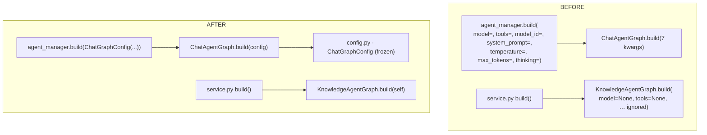
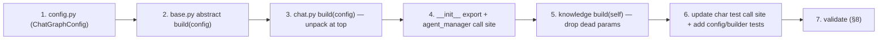

# P2 — Replace the Fictional `build()` With a Typed `ChatGraphConfig`

> **Execution plan (single source) for Stage P2** of
> [`agent-graph-refactor-design.md`](agent-graph-refactor-design.md), following
> [`agent-graph-refactor-p1-plan.md`](agent-graph-refactor-p1-plan.md). Written so a junior
> agent can build and **self-validate** it end-to-end.
>
> **Preconditions:** **P1 is landed and green** (`graph_kit.py` exists; `KnowledgeAgentGraph`
> no longer inherits `BaseAgentGraph`). The §5.2 *characterization net* is green
> (`test_chat_graph_characterization.py`, `test_knowledge_graph_characterization.py`,
> ledger-row snapshots). P2 must keep it green at every step. If P1 is not landed, stop.
>
> **Mode:** initial development — **no backward compatibility / no migration / no wrappers**.
> We change the `build()` contract outright and update every caller; no shims.
>
> **Status:** _Ready to build._
>
> **Post-P1 reconciliation (read first — P1 has landed, and it shifted some specifics):**
> - **Line numbers below were re-verified against the post-P1 tree** (P1 added an import block
>   to `base.py` and rewrote `KnowledgeAgentGraph.__init__`, nudging a few defs down). They are
>   still only anchors — **re-grep `def build(` before editing**, don't trust an exact line.
> - **The characterization fakes are named** `ScriptedChatModel` (the fake chat model) and
>   `RecordingLedgerSink` (captures flushed rows), defined in `runtime/tests/graph_fakes.py` and
>   used by `test_chat_graph_characterization.py`. §6.2 reuses these by name — not a generic
>   `FakeChatModel`.
> - **"Ledger-row snapshots" = assertions, not a golden file.** The net captures rows via an
>   in-test `RecordingLedgerSink` and asserts on node decisions/rows; there is no `.snap` file to
>   regenerate. "Pass unchanged" means *don't edit those assertions*.
> - **Do NOT fix the `retry=`→`retry_policy=` deprecation here.** P1's characterization run
>   surfaced `LangGraphDeprecatedSinceV05` from `chat.py`'s `add_node(..., retry=_RETRY_TWICE)`.
>   It is real (violates the LangGraph ≥1.0 rule) but lives in the `add_node` wiring P2 must keep
>   **byte-identical** — changing it risks the wiring/ledger lock. Track it separately (natural
>   fit: P4, which already rewrites `add_node` calls). Out of scope for P2.

---

## 1. Goal & scope

**Goal.** Kill the fictional `build()` contract — the kwargs-soup signature that fit neither
graph — and replace it with a typed, frozen config object on the chat side, while removing the
**vestigial ignored params** on the knowledge side.

Two concrete outcomes:

1. **Chat:** introduce `ChatGraphConfig` (frozen dataclass) and change
   `BaseAgentGraph.build` / `ChatAgentGraph.build` to take a single `config: ChatGraphConfig`
   instead of 7 keyword arguments.
2. **Knowledge:** delete the 4 dead params from `KnowledgeAgentGraph.build` →
   `build(self)`. (`build_retrieval(self)` is already param-free.)

**In scope:** the new `config.py` module, the two `build` signatures, the 2 chat call sites,
and the knowledge signature cleanup (0 knowledge call-site changes — all callers are already
no-arg). Plus config + builder-wiring tests.

**Out of scope (do NOT do here):** node-body changes, the declarative ledger / `observe()`
(P3), node-group split (P4), `AgentServices` DI container (P4), state restructuring (P6).
Touch only the `build()` boundary.

### 1.1 Decision: there is **no** `KnowledgeGraphConfig`

The design doc's P2 row names both a `ChatGraphConfig` *and* a `KnowledgeGraphConfig`. On
inspection, **the knowledge graph takes no build-time parameters**: its `build()` body uses
none of `model/tools/model_id/system_prompt`, and it is parameterized entirely at
**construction** (`service`, `prefs`, `workspace_id`) and **per-invoke state** (`query`,
`top_k`, `filters`, `graph_mode`, …). An empty config object would be pure ceremony (YAGNI).

**Refined P2 exit criteria:** *chat* builds from `ChatGraphConfig`; *knowledge*'s vestigial
`build()` params are removed. This deviation from the design doc is intentional and recorded
here.

---

## 2. The `ChatGraphConfig` surface

Create `hiroserver/hirocli/src/hirocli/runtime/agent_graph/config.py` — a **leaf** module
(no internal imports beyond the langchain type), so `base.py` can import it without a cycle.

```python
"""Build-time configuration objects for the agent graphs.

Replaces the old kwargs-soup ``build()`` signature with a typed, immutable config.
Future stages extend this module (e.g. the P4 ``AgentServices`` DI container).
"""
from __future__ import annotations

from dataclasses import dataclass
from typing import Any

from langchain_core.language_models import BaseChatModel


@dataclass(frozen=True)
class ChatGraphConfig:
    """Everything ``ChatAgentGraph.build`` needs to wire + bind one chat flow.

    Fields mirror the prior ``build()`` kwargs 1:1 (no behavior change). ``model`` is the
    already-constructed chat model; ``tools`` may be empty (the tools node is then omitted).
    """
    model: BaseChatModel
    tools: list
    model_id: str
    system_prompt: str | None
    temperature: float | None = None
    max_tokens: int | None = None
    thinking: Any = None
```

The field set is **exactly** today's `ChatAgentGraph.build` kwargs — P2 is a *signature*
refactor, not a behavior change.

---

## 3. Caller inventory (verified)

| Symbol | Location | Today | After P2 |
|---|---|---|---|
| `ChatAgentGraph.build(...)` | `runtime/agent_manager.py:598` | 7 kwargs | `build(ChatGraphConfig(...))` |
| `ChatAgentGraph.build(...)` | `runtime/tests/test_chat_graph_characterization.py:71` (one call, inside the `_build_graph` helper; callers thread `tools=` through it) | 7 kwargs | `build(ChatGraphConfig(...))` |
| `BaseAgentGraph.build` (abstract) | `runtime/agent_graph/base.py:186` | `(*, model, tools, model_id, system_prompt)` | `(config: ChatGraphConfig)` |
| `ChatAgentGraph.build` (def) | `runtime/agent_graph/chat.py:44` | 7 kwargs | `(config: ChatGraphConfig)` |
| `KnowledgeAgentGraph.build` (def) | `services/knowledge/agent/graph.py:241` | `(*, model=None, tools=None, model_id="", system_prompt=None)` | `(self)` |
| `KnowledgeAgentGraph.build()` (call) | `services/knowledge/service.py:618` | **no-arg already** | unchanged |
| `KnowledgeAgentGraph.build()` (call) | `test_knowledge_graph_characterization.py:54`, `test_service.py:600`, `test_knowledge_ledger.py:109,179` | **no-arg already** | unchanged |
| `LedgerProbeGraph.build(self, **_)` | `runtime/tests/test_graph_ledger.py:23` | `**_` (signature-agnostic) | unchanged — compatible |

> **Two facts that make this low-risk:** every *knowledge* caller already calls `.build()`
> with no arguments (the params were never passed), and the ledger-probe override swallows
> `**_`, so neither needs touching for the knowledge signature change.

---

## 4. Before / after



---

## 5. File-by-file change checklist

### 5.1 NEW `runtime/agent_graph/config.py`
- [ ] Create the module exactly as in §2.

### 5.2 `runtime/agent_graph/base.py`
- [ ] Add `from .config import ChatGraphConfig`.
- [ ] Change the abstract `build` (≈line 186) to:
      ```python
      def build(self, config: "ChatGraphConfig") -> CompiledStateGraph:
          raise NotImplementedError
      ```
      Update its docstring to say it takes a `ChatGraphConfig`.

### 5.3 `runtime/agent_graph/chat.py`
- [ ] Add `from .config import ChatGraphConfig`.
- [ ] Change the signature (≈line 44) to `def build(self, config: ChatGraphConfig) -> CompiledStateGraph:`.
- [ ] **Unpack at the top of the body, then leave the rest byte-identical** (lowest risk — the
      characterization test already locks the wiring):
      ```python
      def build(self, config: ChatGraphConfig) -> CompiledStateGraph:
          model = config.model
          tools = config.tools
          model_id = config.model_id
          system_prompt = config.system_prompt
          temperature = config.temperature
          max_tokens = config.max_tokens
          thinking = config.thinking
          b = self._new_state_graph()
          # ... everything below UNCHANGED ...
      ```
      Do **not** rewrite the `make_call_model_node(...)` call or the `if tools:` /
      `knowledge_on` branches — they keep referencing the unpacked locals.

### 5.4 `runtime/agent_graph/__init__.py`
- [ ] Export the new type: `from .config import ChatGraphConfig`; add `"ChatGraphConfig"` to
      `__all__`.

### 5.5 `runtime/agent_manager.py`
- [ ] Import it: `from .agent_graph import ChatGraphConfig` (or `from .agent_graph.config import ChatGraphConfig`).
- [ ] Rewrite the call at ≈line 598:
      ```python
      compiled = self._graph.build(
          ChatGraphConfig(
              model=model,
              tools=self._lc_agent_tools,
              model_id=llm_entry.model_id,
              system_prompt=system_prompt,
              temperature=llm_entry.temperature,
              max_tokens=llm_entry.max_tokens,
              thinking=getattr(llm_entry, "thinking", None),
          )
      )
      ```

### 5.6 `services/knowledge/agent/graph.py`
- [ ] Change `build` (≈line 241) from
      `def build(self, *, model=None, tools=None, model_id="", system_prompt=None)` to
      `def build(self) -> CompiledStateGraph:`. Body is unchanged (it never used those params).
- [ ] Leave `build_retrieval(self)` (≈line 269) as-is.

### 5.7 Test call sites
- [ ] `runtime/tests/test_chat_graph_characterization.py:71` — wrap the existing kwargs in
      `ChatGraphConfig(...)` and import it. The *assertions* (events / state / ledger rows)
      stay identical — this is the regression alarm and must still pass unchanged.
- [ ] Knowledge tests (`test_knowledge_graph_characterization.py`, `test_service.py`,
      `test_knowledge_ledger.py`) already call `.build()` no-arg — **no change**. Confirm by
      re-running, don't edit.

---

## 6. New tests this stage adds

### 6.1 `runtime/tests/test_chat_graph_config.py` — the config dataclass
- [ ] Construction with all fields; defaults (`temperature/max_tokens/thinking` default `None`).
- [ ] Frozen: assigning a field raises `dataclasses.FrozenInstanceError`.
- [ ] Equality by value (two configs with same fields compare equal) — cheap guard that it's a
      plain dataclass.

### 6.2 `runtime/tests/test_chat_graph_builder.py` — config → wiring
Build a `ChatAgentGraph` over fakes (reuse `ScriptedChatModel` + `RecordingLedgerSink` from
`runtime/tests/graph_fakes.py`, and the `_collect_events` writer-stub) and assert the
**conditional node wiring** responds to config + construction:

- [ ] `tools=[...]` → compiled graph **has** a `"tools"` node; `tools=[]` → it does **not**.
- [ ] Construct with a fake `knowledge_subgraph` → graph **has** `"knowledge_retrieve"`;
      construct with `knowledge_subgraph=None` → it does **not**.
- [ ] `build(config)` returns a `CompiledStateGraph` (smoke).

> **Introspection cue:** read node names from `compiled.get_graph().nodes` (LangGraph's
> drawable-graph node map). If that attribute differs on the installed LangGraph ≥ 1.0, fall
> back to `compiled.nodes`. **Verify which one exists** in a quick REPL before asserting —
> don't guess. This test exists precisely to lock the `if tools:` / `knowledge_on` branches
> in `chat.build`.

---

## 7. Build order



---

## 8. Self-validation gates (run in order)

**Gate A — no stale `build(` kwargs remain.** No caller passes the old chat kwargs or the dead
knowledge kwargs:
```bash
grep -rnE "\.build\(\s*$|\.build\(model=|\.build\(\s*model" hiroserver/hirocli/src/hirocli --include="*.py"
# expect: chat build() calls now wrap ChatGraphConfig; no bare model=/tools= on a .build( call
grep -rn "model=None, tools=None" hiroserver/hirocli/src/hirocli --include="*.py"
# expect: zero (the knowledge vestigial signature is gone)
```

**Gate B — import health / no cycle:**
```bash
python -c "import hirocli.runtime.agent_graph.config, hirocli.runtime.agent_graph.base, hirocli.runtime.agent_graph.chat, hirocli.runtime.agent_manager, hirocli.services.knowledge.agent.graph"
```

**Gate C — targeted suites green:**
```bash
pytest hiroserver/hirocli/src/hirocli/runtime/tests -k "config or builder or chat_graph or agent_manager or characterization or ledger"
pytest hiroserver/hirocli/src/hirocli/services/knowledge -k "characterization or service or knowledge_ledger"
```

**Gate D — characterization net green, UNCHANGED.** Chat + knowledge characterization and
ledger-row snapshots must pass with no assertion edits. A red here means the `build` rewrite
changed wiring — most likely a missed unpacked local in `chat.build`. Revert and diff.

**Gate E — full suite green** (no regressions elsewhere): `pytest hiroserver/hirocli`.

---

## 9. Definition of done

- [ ] `config.py` exists with a frozen `ChatGraphConfig`; exported from the package `__all__`.
- [ ] `BaseAgentGraph.build` and `ChatAgentGraph.build` take a single `ChatGraphConfig`.
- [ ] `agent_manager.py:599` and the chat characterization test construct a `ChatGraphConfig`.
- [ ] `KnowledgeAgentGraph.build(self)` — the 4 dead params are gone; all knowledge callers
      (already no-arg) still pass.
- [ ] `test_chat_graph_config.py` + `test_chat_graph_builder.py` added and green.
- [ ] Characterization net + ledger snapshots pass **unchanged** (Gate D).
- [ ] No `KnowledgeGraphConfig` was created (per §1.1).

---

## 10. Gotchas & cues

- **Pure signature refactor.** The chat graph's *behavior* and node wiring must not change —
  unpack the config into the same local names the body already uses and leave the rest alone.
- **Knowledge needs no config.** Resist adding an empty `KnowledgeGraphConfig` to "match" the
  chat side; §1.1 is the recorded decision.
- **Knowledge callers are already no-arg** — dropping the params is safe; the only file that
  changes on the knowledge side is `graph.py` itself.
- **`LedgerProbeGraph.build(self, **_)`** in `test_graph_ledger.py` is signature-agnostic by
  design — do not "fix" it to take a config.
- **Verify the LangGraph node-introspection attribute** (`get_graph().nodes` vs `nodes`)
  against the installed version before writing the builder test's assertions.
- **Reflecting-build-updates:** internal refactor only — no server restart, workspace reset,
  or config change needed. Note this in the PR summary.

---

## 11. TL;DR

- **Do:** add a frozen **`ChatGraphConfig`** in a new `config.py`; change
  `BaseAgentGraph.build` / `ChatAgentGraph.build` to take `config: ChatGraphConfig`; update the
  **2** chat call sites (`agent_manager:599`, chat characterization test); **drop the 4 dead
  params** from `KnowledgeAgentGraph.build` → `build(self)`.
- **Don't:** create a `KnowledgeGraphConfig` (knowledge has no build-time params — §1.1); touch
  node bodies or wiring.
- **Prove it:** Gate A (no stale `build(` kwargs), Gate B (no import cycle), Gate C/D
  (targeted suites + **characterization net unchanged**), plus new `test_chat_graph_config.py`
  and `test_chat_graph_builder.py` (config-driven `tools`/`knowledge_retrieve` node presence).
- **Stay in lane:** no `observe()` / node-group / DI work — that's P3–P4.
