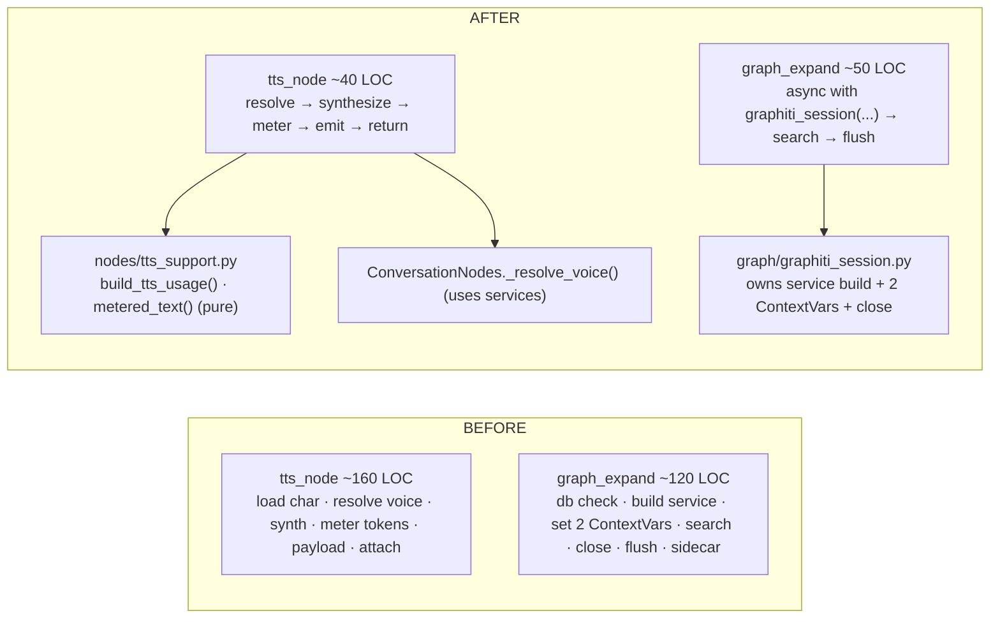

# P7 + P5 — Node-Internal Cleanup: Prefs Accessor & Slim Mega-Nodes

> **Execution plan (single source)** for two small, independent cleanup stages of
> [`agent-graph-refactor-design.md`](agent-graph-refactor-design.md), planned together because
> each is too small for its own doc and neither conflicts with the other. Built **after P4**
> (see the dependency note below), in order **P7 → P5**.
>
> **Preconditions:** **P1–P4 landed and green.** This plan is written against the **post-P4
> structure**: `AgentServices` (DI container), `NodeGroup` (base with the moved prefs
> accessors), `MediaNodes`, `ConversationNodes`, and the standalone `ChatAgentGraph` builder.
> The §5.2 characterization net (events + final state + `RecordingLedgerSink` row assertions,
> fakes in `runtime/tests/graph_fakes.py`) is the safety rail for every step.
>
> **Why after P4 (dependency):** neither stage *hard-depends* on P4, but **P7 would otherwise
> be re-done** — P4 moves the four prefs accessors onto `NodeGroup`, so centralizing them
> *before* P4 means moving them twice. P5 slims nodes that P3 already de-boilerplated and that
> P4 already relocated into groups, so the extracted helpers land in their final home. Order
> **P7 → P5** so P5's TTS helper can call the new prefs accessor.
>
> **Mode:** initial development — **no backward compatibility / no wrappers**. Both stages are
> pure internal cleanup: **no behavior change, no row change.**
>
> **Status:** _Ready to build (two parts, each independently green)._

Because these are line-shifting refactors landing after three prior stages, **reference symbols
and node names, not line numbers — re-grep before editing.**

---

## Part A — P7: one typed preferences accessor

### A.1 Goal & scope

Replace the four per-method `try/except` prefs accessors on `NodeGroup`
(`_current_preferences`, `_history_window`, `_chat_instructions`, `_knowledge_cite_in_chat`) —
plus the scattered `getattr(self._current_preferences(), "memory", None)` reads in the memory
nodes — with **one typed `PreferencesView`** that resolves the live prefs once and applies a
**single fallback policy**.

**Scope decision (recorded):** **chat side only.** `KnowledgeAgentGraph` reads a validated
`WorkspacePreferences` pydantic object directly (`self._prefs.knowledge.retrieval.top_k`, …) —
no `try/except` smell, no defaulting — so it is **out of scope** for P7. Don't refactor it.

> **Post-P4.6 note (verified):** P4.6 landed — `KnowledgeAgentGraph(NodeGroup)` now calls
> `super().__init__(services)` with `services.preferences=None`. So once P7 builds
> `self.prefs = PreferencesView(...)` in `NodeGroup.__init__`, the knowledge graph **also**
> receives a `self.prefs` — **harmless and unused** (its nodes keep reading `self._prefs`; the
> view just lazy-loads from disk if ever touched, mirroring the old `_current_preferences`
> fallback). Do **not** wire knowledge's real prefs into it. Confirmed safe: `graph.py` calls
> **none** of the four NodeGroup accessors P7 deletes (`_current_preferences` / `_history_window`
> / `_chat_instructions` / `_knowledge_cite_in_chat`) — it uses `self._prefs` exclusively, so
> their removal can't break it.

### A.2 The accessor

New `runtime/agent_graph/preferences_view.py` — one place that resolves prefs and one place per
field that defaults:

```python
"""PreferencesView — the single typed read path for the graph's preference needs.

Resolves the live snapshot once (runtime → disk fallback), logs+swallows a resolution failure
exactly once, and exposes typed getters whose defaults live here (not scattered across nodes).
"""
from __future__ import annotations

from hiro_commons.log import Logger
from ...domain.preferences import DEFAULT_MAX_HISTORY_MESSAGES

log = Logger.get("AGENT.GRAPH.PREFS")


class PreferencesView:
    def __init__(self, runtime, workspace_path) -> None:
        self._runtime = runtime
        self._workspace_path = workspace_path

    @property
    def current(self):
        """Live prefs snapshot, or a loaded copy, or None — the ONLY fallback site."""
        try:
            if self._runtime is not None:
                return self._runtime.current
            from ...domain.preferences import load_preferences
            return load_preferences(self._workspace_path)
        except Exception as exc:  # one place; nodes never wrap prefs reads again
            log.warning("⚠️ prefs — resolve failed · using defaults", error=str(exc), exc_info=True)
            return None

    # typed getters — defaults defined here, no per-call try/except
    def history_window(self) -> int:
        chat = getattr(self.current, "chat", None)
        return int(getattr(chat, "max_messages", DEFAULT_MAX_HISTORY_MESSAGES) or DEFAULT_MAX_HISTORY_MESSAGES)

    def cite_sources(self) -> bool:
        return bool(getattr(getattr(self.current, "chat", None), "cite_sources", False))

    def chat_instructions(self) -> str:
        return str(getattr(getattr(self.current, "chat", None), "instructions", "") or "")

    def memory(self):
        """The memory prefs sub-object (or None) — replaces getattr(...current..., 'memory')."""
        return getattr(self.current, "memory", None)
```

### A.3 Wiring

- [ ] `NodeGroup.__init__` builds it once: `self.prefs = PreferencesView(services.preferences, services.workspace_path)`.
- [ ] **Delete** `_current_preferences`, `_history_window`, `_chat_instructions`,
      `_knowledge_cite_in_chat` from `NodeGroup`.
- [ ] Update node call sites:
      - `trim_history_node`: `self._history_window()` → `self.prefs.history_window()`.
      - `compose_context_node`: `self._chat_instructions()` → `self.prefs.chat_instructions()`;
        `self._knowledge_cite_in_chat()` → `self.prefs.cite_sources()`.
      - `_reply_knowledge_sources`: `self._knowledge_cite_in_chat()` → `self.prefs.cite_sources()`.
      - `memory_search_node` + `_store_turn_memory`: `memory_prefs = getattr(self._current_preferences(), "memory", None)` → `memory_prefs = self.prefs.memory()`.
      - `tts_node`: `prefs = self._current_preferences()` → `prefs = self.prefs.current`.
      - `knowledge_retrieve_node`: `self._current_preferences().knowledge.retrieval` →
        `self.prefs.current.knowledge.retrieval` (deep one-off read; no getter needed).

### A.4 Tests (P7)

`runtime/tests/test_preferences_view.py`:
- [ ] runtime present → `current` returns `runtime.current`; getters read its fields.
- [ ] runtime `None` → `current` calls `load_preferences` (temp workspace or monkeypatch).
- [ ] resolution raises → `current` returns `None`, logs once; getters return their **defaults**
      (`history_window()==DEFAULT_MAX_HISTORY_MESSAGES`, `cite_sources() is False`,
      `chat_instructions()==""`, `memory() is None`).
- [ ] Characterization net unchanged — same prefs values ⇒ same node decisions/rows.

---

## Part B — P5: slim the two mega-nodes

### B.1 Goal & scope

Reduce the two largest nodes to **orchestration** by extracting their provider/lifecycle
guts. No behavior change, identical events + ledger rows.



### B.2 TTS extraction (chat — `ConversationNodes.tts_node`)

- [ ] New `runtime/agent_graph/nodes/tts_support.py` with **pure** functions (no `self`):
      - `metered_text(provider, model, instructions, text) -> str` — the OpenAI
        `gpt-4o-mini-tts` instruction-prefix rule.
      - `build_tts_usage(usage_metadata, *, duration_ms, text) -> dict` — the
        `modality_token_count` + `gemini_usage_aggregate_fallback` block, returning the
        `tts_text_tokens`/`tts_audio_tokens`/`tts_audio_seconds`/`input_tokens` values that go
        into `observe(usage=…)` and the event payload. (Pure given `usage_metadata` — ideal for
        unit tests.)
- [ ] Add `ConversationNodes._resolve_voice(self, state) -> resolved | None` — the
      `load_character_from_disk` + `resolve_character_voice` prelude (uses `self.services` +
      `self.prefs.current`), returning `None` with the existing `observe(skipped=…)` reasons.
- [ ] Rewrite `tts_node` to orchestrate: `resolved = self._resolve_voice(state)` → guard →
      `result = await self.services.tts.synthesize(...)` (keep its try/except + `observe(fail=…)`)
      → `usage = build_tts_usage(...)` → `observe(usage=usage, decision=…, output=…)` →
      `emit(writer, GRAPH_TTS_COMPLETED, payload)` → return `reply_audio`.
- [ ] **The emitted `GRAPH_TTS_COMPLETED` payload and the ledger usage row must be identical** —
      `build_tts_usage` returns exactly today's numbers.

### B.3 Graphiti-session extraction (knowledge — `graph_expand`)

- [ ] New `services/knowledge/graph/graphiti_session.py` — an `@asynccontextmanager`
      `graphiti_session(prefs, workspace_path, workspace_id)` that owns what the node currently
      inlines:
      - build `GraphitiMemoryService.from_preferences(...)`; **yield `None`** when it's `None`
        (backend off / no model) so the node soft-falls-back exactly as today;
      - set/reset `current_rerank_usage` (a fresh `RerankUsage`) and, when
        `prefs.graph.observability == "trace"`, `current_capture` (a `RetrievalCapture`);
      - `await service.close()` in `finally` — **even on error**.
      - yield a small `GraphitiSession(service, rerank_usage, capture)` holder so the node can
        call `session.search_chunk_ids(...)` and, after, read `session.rerank_usage` /
        `session.capture` for the flush.
- [ ] Rewrite `graph_expand` to: keep its early skips (`graph_mode != graphiti`, no query, no
      `db_path`) and the **sanctioned** P3 ledger block (`flush_graph_expand` +
      `write_trace_sidecar` using `entry`), but replace the service/ContextVar/close plumbing
      with `async with graphiti_session(...) as session: ... expansion = await session.search_chunk_ids(...)`.
      Its outer `try/except` → `observe(fail="graph_expand_failed", …)` stays.
- [ ] **Knowledge characterization + retrieval-ledger tests unchanged.**

### B.4 Tests (P5)

- [ ] `runtime/tests/test_tts_support.py` — `build_tts_usage` over sample `usage_metadata`
      (Gemini modality-detail shape **and** empty/OpenAI shape) returns the expected token/seconds
      values; `metered_text` prefixes only for OpenAI `gpt-4o-mini-tts` with instructions.
- [ ] `runtime/tests/test_conversation_nodes.py` (extend P4's) — `tts_node` with `FakeTTS`
      still emits `GRAPH_TTS_COMPLETED` with the same payload shape; `_resolve_voice` skip
      reasons.
- [ ] `services/knowledge/test_graphiti_session.py` (**parent dir**, per the placement rule) —
      CM yields `None` when the service is `None`; sets and **resets** both ContextVars; calls
      `service.close()` on both the success and exception paths (use a fake service that records
      `close()` + raises in the body).

---

## Validation gates (run after each part)

**Gate A — P7 boilerplate gone:**
```bash
grep -rn "_current_preferences\|_history_window\|_chat_instructions\|_knowledge_cite_in_chat" \
  hiroserver/hirocli/src/hirocli/runtime/agent_graph   # expect: zero (replaced by self.prefs.*)
```

**Gate B — P5 nodes slimmed:**
```bash
# graph_expand no longer inlines the ContextVar plumbing (it lives in graphiti_session):
grep -n "current_rerank_usage.set\|current_capture.set" hiroserver/hirocli/src/hirocli/services/knowledge/agent/graph.py
# expect: zero in graph.py (only inside graph/graphiti_session.py)
# tts metering no longer inline in the node:
grep -n "modality_token_count\|gemini_usage_aggregate_fallback" hiroserver/hirocli/src/hirocli/runtime/agent_graph/nodes/conversation.py
# expect: zero in conversation.py (only inside nodes/tts_support.py)
```

**Gate C — import health / no cycle:**
```bash
python -c "import hirocli.runtime.agent_graph.preferences_view, hirocli.runtime.agent_graph.nodes.tts_support, hirocli.services.knowledge.graph.graphiti_session, hirocli.runtime.agent_graph.nodes.conversation, hirocli.services.knowledge.agent.graph"
```

**Gate D — ⭐ characterization net green, unchanged** (the prime directive):
```bash
pytest hiroserver/hirocli/src/hirocli/runtime/tests -k "characterization or ledger or preferences_view or tts_support or conversation_nodes"
pytest hiroserver/hirocli/src/hirocli/services/knowledge -k "characterization or ledger or graphiti_session"
git diff -- "**/test_*characterization*.py"   # expect: NO assertion edits
```

**Gate E — full suite** before the final PR(s): `pytest hiroserver/hirocli`.

---

## Definition of done

- [ ] **P7:** `PreferencesView` is the only prefs read path on the chat graph; the four
      `try/except` accessors are deleted (Gate A); knowledge's `self._prefs` untouched.
- [ ] **P5:** `tts_node` and `graph_expand` are orchestration-only; metering lives in
      `tts_support.py`, voice resolution in `_resolve_voice`, the Graphiti service/ContextVar/
      close lifecycle in `graphiti_session()` (Gate B).
- [ ] New unit tests added (`test_preferences_view`, `test_tts_support`, `test_graphiti_session`);
      `test_conversation_nodes` extended.
- [ ] Characterization net (chat + knowledge) unchanged across both parts (Gate D).
- [ ] No behavior, event, or ledger-row change.

---

## Gotchas & cues

- **Two parts, two PRs** (or at least two commits) — P7 then P5. Each ends on a green Gate D.
- **P7 is chat-only.** Don't "tidy" knowledge's direct `self._prefs` reads — they have no smell.
- **`build_tts_usage` must return today's exact numbers.** The TTS usage row and
  `GRAPH_TTS_COMPLETED` payload are characterized — a metering drift fails Gate D, which is the
  point. Move the arithmetic verbatim.
- **`graphiti_session` must close on error and reset both ContextVars** — that's the whole
  reason to extract it. The fake-service test asserts close-on-raise explicitly.
- **Keep the sanctioned `graph_expand` ledger block** (P3's `flush_graph_expand` +
  `write_trace_sidecar` using `entry`) — the CM owns service lifecycle, *not* the ledger flush.
- **Move, don't improve.** Both stages relocate code verbatim; behavior changes are a separate PR.
- **Reflecting-build-updates:** internal refactor — no server restart / workspace reset / config
  change needed; note it in the PR summary.

---

## TL;DR

- **One doc, two small independent stages, order P7 → P5**, both after P4 (P7 *must* follow P4
  or it gets re-done; P5 lands its helpers in their post-P4 home).
- **P7:** replace the four `try/except` chat prefs accessors with one typed `PreferencesView`
  (single resolution + single fallback site). **Chat-only** — knowledge's validated `self._prefs`
  is out of scope.
- **P5:** slim `tts_node` (→ pure `tts_support.py` metering + `_resolve_voice`) and `graph_expand`
  (→ `graphiti_session()` async CM owning service build + 2 ContextVars + close-on-error).
- **Prove it:** Gate A (no prefs `try/except`), Gate B (nodes slimmed — metering/ContextVars
  moved out), Gate C (no cycle), **Gate D (characterization unchanged)**, Gate E (full suite);
  plus the three new unit-test files.
- **No behavior / event / ledger-row change** — these are cohesion refactors only.
