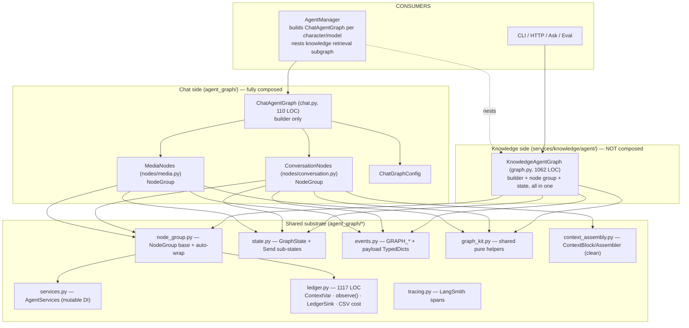
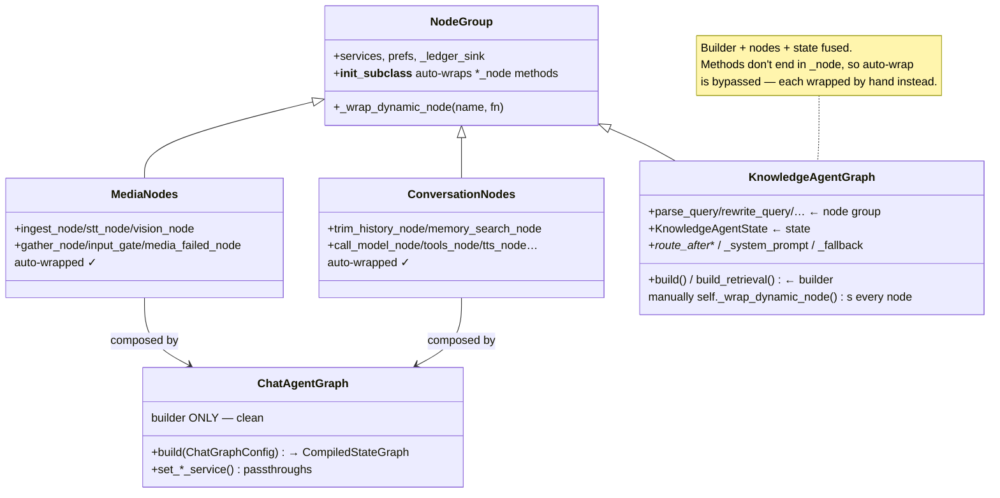
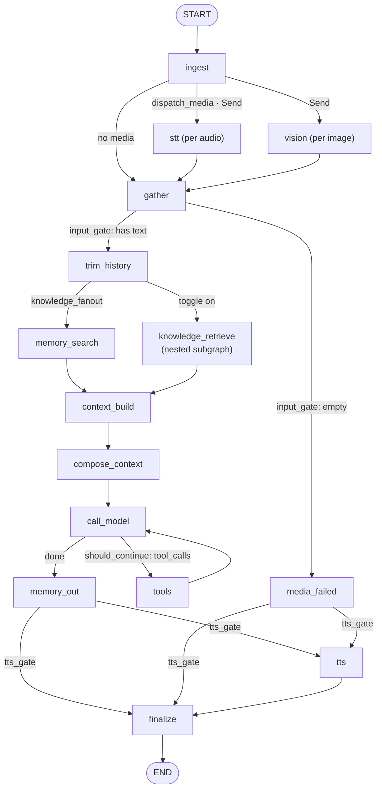
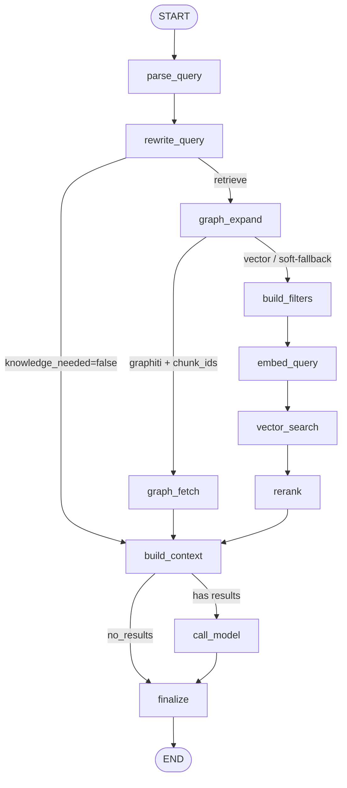
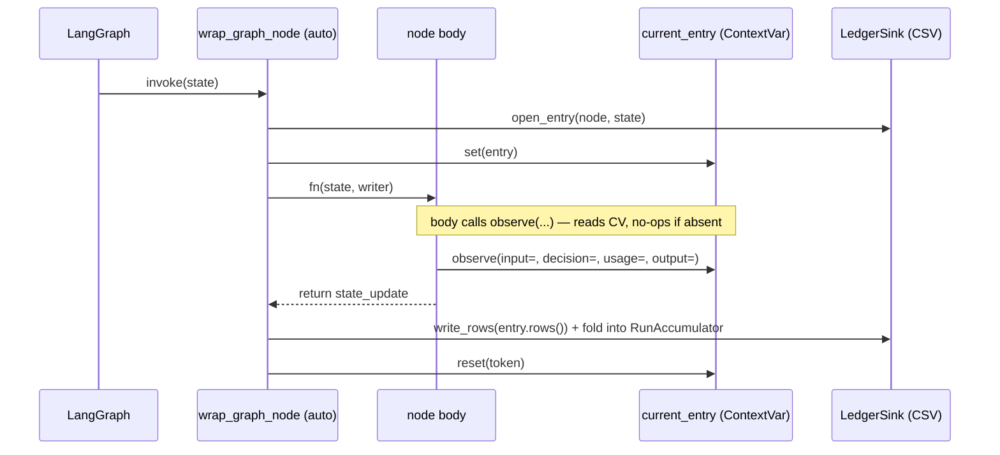
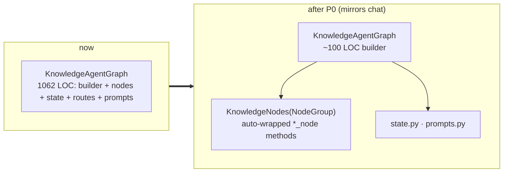
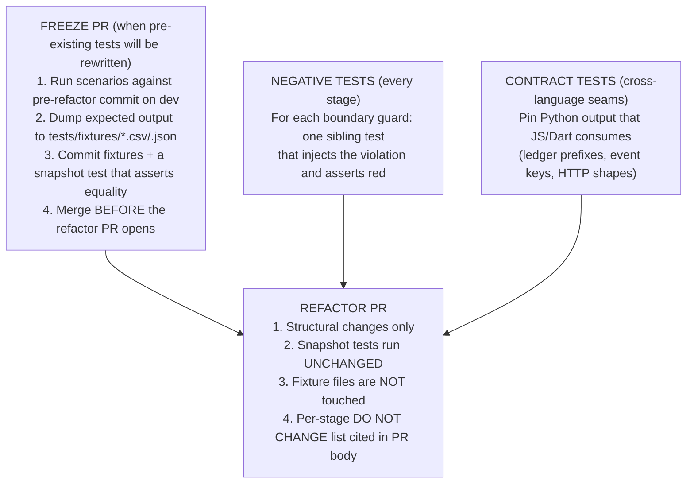

# Agent Graph — Design Review

> **Companion to** [`agent-graph-refactor-design.md`](agent-graph-refactor-design.md) and the P1–P8 plan docs. This review captures the **current state** of the agent graph package after most of the refactor has landed, identifies what's still asymmetric or load-bearing, and proposes the next refactoring slice.
>
> **Scope:** `hiroserver/hirocli/src/hirocli/runtime/agent_graph/**` (chat side) and `hiroserver/hirocli/src/hirocli/services/knowledge/agent/graph.py` (knowledge side).

---

## 0. Framing — the doc is stale

The refactor design doc says *"Status: Proposed — no code yet."* The code on disk tells a different story: **`base.py` is deleted** and most of P1–P4 + P7 has shipped (`graph_kit.py`, `node_group.py`, `services.py`, `config.py`, `nodes/`, `preferences_view.py` all exist). This review covers **the half-refactored present state**, not the god-class the doc describes. The good news: the worst problems (the 1,734-line `BaseAgentGraph`, the Liskov-violating inheritance) are *gone*. What remains is an **asymmetry**: the chat side got the full composition treatment; the knowledge side did not.

---

## 1. Top-down: what exists today

### 1.1 Layering



### 1.2 Class design — the remaining asymmetry



This is the crux: **`ChatAgentGraph` is a thin builder over two cohesive node groups; `KnowledgeAgentGraph` is still a 1,062-line fusion of builder + node group + state schema.** It even opts out of the auto-wrap machinery its own base class provides.

### 1.3 Chat per-message flow



### 1.4 Knowledge retrieval legs



Two compiled forms (`build()` full answer, `build_retrieval()` retrieval-only subgraph nested in chat) from one node set — that part is well-factored.

### 1.5 The ledger mechanism (why nodes are big)



`observe()` (the P3 win) already replaced the old `if entry := current_entry.get(): …` boilerplate — a real improvement. But two nodes (`graph_expand`, `rewrite_query`) still reach for `current_entry.get()` directly for sidecar/flush work.

---

## 2. What's genuinely good (keep these)

| Strength | Where |
|---|---|
| **Composition achieved** — base god-class deleted, services injected as data | [`services.py`](../hiroserver/hirocli/src/hirocli/runtime/agent_graph/services.py), [`node_group.py`](../hiroserver/hirocli/src/hirocli/runtime/agent_graph/node_group.py) |
| **`observe()` declarative ledger** — nodes describe, wrapper records | [`ledger.py:391`](../hiroserver/hirocli/src/hirocli/runtime/agent_graph/ledger.py#L391) |
| **Byte isolation via `Send`** — audio/image bytes never enter the checkpoint; `gather` clears them | [`nodes/media.py`](../hiroserver/hirocli/src/hirocli/runtime/agent_graph/nodes/media.py), [`state.py`](../hiroserver/hirocli/src/hirocli/runtime/agent_graph/state.py) invariants |
| **Ephemeral `turn_context`** — memory+knowledge injected into the user turn, never into durable `messages` | [`nodes/conversation.py:887`](../hiroserver/hirocli/src/hirocli/runtime/agent_graph/nodes/conversation.py#L887) |
| **Degrade-never-crash** — every external call (STT/vision/memory/LLM/TTS/knowledge) has a logged fallback | throughout |
| **`context_assembly.py`** — clean block model, priority ordering, token-budget seam | the template the rest should follow |
| **Centralized prefs read** (P7) — one fallback site, typed getters | [`preferences_view.py`](../hiroserver/hirocli/src/hirocli/runtime/agent_graph/preferences_view.py) |

---

## 3. Refactoring suggestions (prioritized)

| # | Problem | Impact | Effort | Priority |
|---|---------|--------|--------|----------|
| 1 | `KnowledgeAgentGraph` fuses builder + nodes + state | High | M | **P0** |
| 2 | Two node-wrap styles (auto vs `_wrap_dynamic_node`) | High | S | **P0** |
| 3 | Imperative builder wiring; topology not validated vs node set | Med | M | P1 |
| 4 | `ledger.py` mixes 5 concerns; 4 copy-paste wrappers; pricing inline | Med | M | P1 |
| 5 | State monolithic, invariants-by-comment (P6 undone) | Med | M | P1 |
| 6 | Mega-nodes (`rewrite_query` 180, `call_model` 90, `tts` 110) | Med | M | P2 |
| 7 | Event-emit boilerplate (identity re-pulled ~12×) | Low | S | P2 |
| 8 | Duplicate helpers/constants | Low | S | P2 |

> **How to use this section.** Each Pn is a self-contained PR. Land them in order — P0 first because it removes the structural asymmetry that every later stage trips over. Every stage MUST leave the characterization net (§5) green AND its **DO NOT CHANGE** list byte-stable; that net + those lists are the merge gate.
>
> **Honor two repo rules throughout:**
> - **No backward compatibility** — delete, don't shim. No wrappers, no migration.
> - **Test placement** — knowledge graph tests go in **`services/knowledge/`**, NEVER inside `services/knowledge/agent/` (the package `__init__` eager-imports `graph`, so a test collected under `agent/` corrupts `agent.graph` for later monkeypatch tests — full-suite-only failure, very hard to debug).
>
> ---
>
> ### Process rules (lessons from P0)
>
> P0 shipped with three bugs the new test suite did not catch (`knowledge/` ledger prefix silently dropped, a tautology boundary-guard test, an over-narrow grep regression). Root cause in every case: **tests written in the same PR as the refactor describe the new behavior, not preserve the old one.** Apply these five rules to every stage from P1 onward — they are not optional:
>
> 1. **Freeze the snapshot in a separate PR BEFORE the refactor — when pre-existing tests will be touched.** For any stage with a "byte-stable" gate (P1b, P3-style ledger work), the expected output goes into a checked-in fixture file (`.csv` / `.json` / `.txt`) via a dedicated *freeze* PR run against **the pre-refactor commit on your working branch** (`dev` here — there is no `main`-vs-`dev` distinction in this repo). The refactor PR then asserts equality against the fixture and **must not modify it**. If you regenerate the fixture as part of the refactor, the gate is meaningless — that is exactly how P0's `knowledge/` prefix drop went undetected. **Apply this rule with proportion:** the highest risk is when pre-existing behavioral tests get *rewritten* in the same PR (P0's case). If the pre-existing suite stays intact and the new snapshot tests are purely additive (P1's case), the freeze step is belt-and-braces — useful but not load-bearing.
> 2. **Two-author separation for the safety net.** Whoever writes the structural change does NOT write the snapshot/contract tests in the same PR. Pair with a second pass (a fresh agent prompted "review for regressions, don't fix anything") to author the gate. Catches the "tests pin what I just wrote" trap.
> 3. **Every boundary guard gets a negative test.** Any `assert X not in src` / `assert isinstance(...)` / `assert "..." not in module.__dict__` test must have a sibling that *intentionally* injects the forbidden state and asserts the guard reddens. Without this, a vacuous assertion (P0 bug #2) reads green forever. One line of pytest, zero excuses.
> 4. **Cross-language contracts get a contract test on the producing side.** Any Python output a non-Python caller depends on — ledger label prefixes that the admin UI keys on (`graph-runs-pure.isGraphNodeSubstep`), event payload shapes the Svelte side reads, HTTP response keys, etc. — gets a `test_contract_*.py` that pins the exact format. Comment the consuming file path so a future change is forced to update both sides. The P0 prefix drop broke `admin_frontend/.../graph-runs-pure.ts` and no Python test could see it.
> 5. **Every stage has an explicit "DO NOT CHANGE" list.** Each P1+ subsection below names the public surfaces, label formats, schemas, and external contracts that must remain byte-stable. The PR description must call out each item and the test that pins it. Anything not on the list is fair game; anything on the list is a regression to investigate, not a fixture to update.

---

### P0 · Carve `KnowledgeNodes` out of `KnowledgeAgentGraph`

**Why first.** This is the *one structural inconsistency* between the two graphs. Until knowledge mirrors chat, every later stage (declarative builder, ledger split, state-invariant tests) has to special-case two shapes. Splitting it now collapses problems #1 and #2 in one PR and makes the rest of the plan symmetric.

**Target file layout** (mirrors `runtime/agent_graph/`):

```
services/knowledge/agent/
  graph.py     ← builder only (~100 LOC, was 1062)
  nodes.py     ← KnowledgeNodes(NodeGroup) — all *_node methods (auto-wrapped)
  state.py     ← KnowledgeAgentState + small TypedDicts
  prompts.py   ← _system_prompt + _fallback_answer (pure functions)
  helpers.py   ← unchanged (NormalizedQuery, QueryRewrite, build_context, build_qdrant_filter, …)
  legs.py      ← unchanged (RetrievalLeg, effective_leg, intended_leg, graphiti_facts_block)
```

**Concrete steps (do in this order — each step compiles cleanly on its own):**

1. **Create `state.py`** — move `KnowledgeAgentState` TypedDict from [`graph.py:92–148`](../hiroserver/hirocli/src/hirocli/services/knowledge/agent/graph.py#L92) verbatim. Keep the runtime import of `KnowledgeSearchHit`/`KnowledgeSource` (LangGraph's `get_type_hints` evaluates the annotations at build time, so they MUST resolve at runtime even with `from __future__ import annotations`).
2. **Create `prompts.py`** — lift `_system_prompt` (graph.py:1039) and `_fallback_answer` (graph.py:1025) into module-level functions taking explicit args (`prefs`, `normalized`, `sources`, `query`). Pure, no `self`. This removes the last excuses to keep them on the builder.
3. **Create `nodes.py` — `KnowledgeNodes(NodeGroup)`:**
   - Rename every node method to end in `_node`: `parse_query → parse_query_node`, `rewrite_query → rewrite_query_node`, `graph_expand → graph_expand_node`, `graph_fetch → graph_fetch_node`, `build_filters → build_filters_node`, `embed_query → embed_query_node`, `vector_search → vector_search_node`, `rerank → rerank_node`, `build_context → build_context_node`, `call_model → call_model_node`, `finalize → finalize_node`. The `_node` suffix is what `NodeGroup.__init_subclass__` keys on for auto-wrap ([`node_group.py:17`](../hiroserver/hirocli/src/hirocli/runtime/agent_graph/node_group.py#L17)).
   - Move `_route_after_rewrite` / `_route_after_expand` / `_route_after_context` as **static methods on `KnowledgeNodes`** (they read state only). They are not nodes; they're edge predicates.
   - Move `_chunk_dates` (graph.py:862) as a private method on `KnowledgeNodes`.
   - The constructor stays close to today's: `__init__(self, *, services: AgentServices, prefs, workspace_id)`; build `AgentServices` in the builder and pass it in.
4. **Slim `graph.py` to a builder** — `KnowledgeAgentGraph` ends up looking like `ChatAgentGraph`:

   ```python
   class KnowledgeAgentGraph:
       def __init__(self, *, workspace_path, service, prefs, workspace_id=None):
           self._services = AgentServices(workspace_path=workspace_path,
                                          ledger_sink=LedgerSink(workspace_path))
           self._nodes = KnowledgeNodes(services=self._services, service=service,
                                        prefs=prefs, workspace_id=workspace_id)

       def build(self) -> CompiledStateGraph:           # full answer
           g = StateGraph(KnowledgeAgentState)
           self._add_retrieval_nodes(g)
           g.add_node("call_model", self._nodes.call_model_node)
           g.add_node("finalize",   self._nodes.finalize_node)
           g.add_conditional_edges("build_context", KnowledgeNodes._route_after_context,
                                   {"call_model": "call_model", "finalize": "finalize"})
           g.add_edge("call_model", "finalize"); g.add_edge("finalize", END)
           return g.compile()

       def build_retrieval(self) -> CompiledStateGraph: # subgraph for chat
           g = StateGraph(KnowledgeAgentState)
           self._add_retrieval_nodes(g); g.add_edge("build_context", END)
           return g.compile()
   ```

5. **Delete all 11 `self._wrap_dynamic_node(...)` calls** in `_add_retrieval_nodes`. Replace each with `g.add_node("parse_query", self._nodes.parse_query_node)` and friends. The auto-wrap from `NodeGroup.__init_subclass__` does the rest. Use the bare LangGraph node name (`"parse_query"`); the `knowledge/` prefix that today's `_wrap_dynamic_node` injects was for ledger-row labels only — preserve it by labeling at the ledger layer instead (see *Tests* below for the snapshot rule).
6. **Update all imports** — `from hirocli.services.knowledge.agent.graph import KnowledgeAgentGraph` callers don't change; internal-to-module imports do. Search the repo: `Grep -n "KnowledgeAgentState\|_route_after_\|_system_prompt\|_fallback_answer" hiroserver/`.

**Verification checklist (run before opening the PR):**

- [ ] `grep -n "_wrap_dynamic_node" hiroserver/hirocli/src/hirocli/services/knowledge/agent/` returns nothing.
- [ ] `wc -l hiroserver/hirocli/src/hirocli/services/knowledge/agent/graph.py` is under ~120.
- [ ] Every `*_node` method on `KnowledgeNodes` has the `_is_pre_node_wrapped` attribute at import time (one-line REPL check; proves auto-wrap fired).

**Tests to add (placement: `services/knowledge/`, NOT `services/knowledge/agent/`):**

| File | What it asserts |
|---|---|
| `test_knowledge_nodes_unit.py` | One test per node: construct `KnowledgeNodes` with a `FakeAgentServices`, call the node with a hand-built state slice, assert returned dict. Covers the branches you can't see from the top: `rewrite_query_node` with rewrite off / no LLM / parse failure / success; `graph_expand_node` with `graph_mode=off` / no DB / graphiti success / graphiti failure; `vector_search_node` empty vector → 0 hits; `rerank_node` disabled/no_candidates/success. |
| `test_knowledge_graph_wiring.py` | Compile `build()` and `build_retrieval()`; assert exact set of node names and edges. Catches "added a node, forgot to wire it." |
| `test_knowledge_graph_characterization.py` *(may exist; if not, add)* | Black-box: build the graph with fakes, invoke with a canned query, snapshot the ledger CSV rows (sorted by `step_index`). The snapshot from BEFORE P0 and AFTER P0 must be byte-identical except for `node` label changes if you decided to drop the `knowledge/` prefix — if so, record the rename in the snapshot's diff explicitly. |
| `test_no_dynamic_wrap.py` | One-liner: `assert "_wrap_dynamic_node" not in Path(graph_file).read_text()`. Prevents regression. |



---

### P1a · Make the builder declarative + self-validating

**DO NOT CHANGE in this PR:**
- The set of LangGraph node names compiled into the chat graph for any given config (text-only, audio, tools on/off, knowledge on/off). Pin via a snapshot fixture committed in a freeze PR first — `_node_names(compiled)` for each combo dumped to `tests/fixtures/chat_graph_topology_{combo}.json`.
- Conditional-edge predicates (`should_continue`, `tts_gate`, `input_gate`, `dispatch_media`, `knowledge_fanout`) — names, return values, and which targets they route to.
- Retry-policy attachment per node (`stt`, `vision`, `memory_search`, `memory_out`, `tts` each get `_RETRY_TWICE` today). The new `RETRY_POLICIES` dict must produce identical retry behavior — assert per node.
- The order in which nodes are added to the `StateGraph` (LangGraph treats this as defined behavior for some operations). Snapshot the order.

**Why.** Today [`chat.py build()`](../hiroserver/hirocli/src/hirocli/runtime/agent_graph/chat.py#L44) hand-lists 13 `add_node` calls and interleaves `if knowledge_on / if tools` branches. Add a node method, forget to wire it → silent at compile, fails at runtime. The node group already knows its own nodes; the builder should ask it.

**Concrete steps:**

1. **Add `registered_nodes()` to `NodeGroup`** — returns `{label: bound_method}` for every `*_node` / `node_*` method. The metadata is already computed by `__init_subclass__` ([`node_group.py:34`](../hiroserver/hirocli/src/hirocli/runtime/agent_graph/node_group.py#L34)); just expose it.

   ```python
   # node_group.py
   class NodeGroup:
       @classmethod
       def node_methods(cls) -> dict[str, str]:
           """label → attribute name, for every *_node / node_* method on the class."""
           out = {}
           for c in cls.mro():
               for name, attr in getattr(c, "__dict__", {}).items():
                   if _is_graph_node_method(name, attr):
                       out.setdefault(_node_label(name), name)
           return out

       def registered_nodes(self) -> dict[str, Callable]:
           return {label: getattr(self, name) for label, name in type(self).node_methods().items()}
   ```

2. **Builder uses it.** `ChatAgentGraph.build` shrinks to:

   ```python
   for label, fn in media.registered_nodes().items():
       b.add_node(label, fn, retry_policy=_retry_for(label))
   for label, fn in conv.registered_nodes().items():
       if label == "tools" and not config.tools: continue
       if label == "knowledge_retrieve" and self.services.knowledge_subgraph is None: continue
       b.add_node(label, fn, retry_policy=_retry_for(label))
   ```

   Edges stay declarative — they ARE the topology, not boilerplate. Group them in one block at the bottom for readability.

3. **`_retry_for(label)`** — replace the hard-coded `_RETRY_TWICE` sprinkle with a dict `RETRY_POLICIES = {"stt": _RETRY_TWICE, "vision": _RETRY_TWICE, "memory_search": _RETRY_TWICE, "memory_out": _RETRY_TWICE, "tts": _RETRY_TWICE}` so the policy lives in one place.

**Tests:**

| File | Asserts |
|---|---|
| `test_chat_graph_wiring.py` *(extend the existing or create)* | Build with `tools=[]`, `knowledge_subgraph=None`, then with both wired. Snapshot the compiled graph's `nodes` / `edges` for each combo. Topology becomes a test fixture. |
| `test_node_group_registry.py` | `MediaNodes.node_methods()` returns the expected label set; adding a stray `_node` method makes the wiring test fail loudly. |

---

### P1b · Split `ledger.py` (1117 LOC) by concern

**DO NOT CHANGE in this PR (this is the byte-stable stage — gate it hard):**
- **Every column in `GRAPH_LEDGER_COLUMNS`** — name, order, type, default-empty rendering.
- **Every row written for every characterization scenario** — node names (including the `knowledge/` prefix, `tools/` prefix, and sub-step nesting like `step.sub_step`), `decision_kind`/`decision_detail` slugs, `error_code` values, `status` values, all token columns, `cost_usd` numeric format (`f"{x:.10f}".rstrip("0").rstrip(".")`), `pricing_version` strings.
- **`observe()` public signature** and all keyword names (`input`, `output`, `decision`, `usage`, `skipped`, `error`, `fail`, `input_max_len`, `output_max_len`).
- **`@graph_logged(captures=…, flush=…)` semantics** — which captures gate which columns.
- **`current_entry` / `current_run` / `current_substep` ContextVar names** — anything outside the new `ledger/` package reads these by name.
- **Public re-exports from `runtime/agent_graph/ledger`** — every caller today uses `from …ledger import observe, graph_logged, LedgerSink, RunAccumulator, current_entry, current_run, current_substep, substep_scope, record_child`. The new `__init__.py` must export all of them; **add a `test_ledger_public_api.py` that snapshots `dir(ledger)`** and reddens if anything is renamed/removed.
- **CSV file path** (`<workspace>/logs/graph.log`) and **CSV writer behavior** (single-line rows, no embedded newlines in previews).

**Gate (mandatory, in order):**
1. **Freeze PR (before any structural change):** run each characterization scenario from §5 against the pre-refactor commit on `dev`, dump the full row list to `tests/fixtures/ledger_rows_{scenario}.csv`. Commit those fixtures.
2. **Refactor PR:** asserts `captured_rows == fixture_rows` byte-for-byte. If the fixture needs editing, the PR is wrong — investigate.
3. **Negative test:** include one test that intentionally renames a column and asserts the snapshot test reddens.

**Why.** Five concerns in one file: schema, ContextVar bridge, public `observe()` API, entry/accumulator data classes, sink IO, **cost pricing**, **identity resolution**, **4 near-identical wrappers**. Pricing is the volatile part (model catalog evolves); identity is the trickiest part (state shape coupling); both deserve isolation.

**Target file layout:**

```
runtime/agent_graph/ledger/
  __init__.py          ← re-exports the public surface (observe, graph_logged, LedgerSink, …)
  schema.py            ← GRAPH_LEDGER_COLUMNS, LedgerEntry, RunAccumulator
  observe.py           ← observe(), substep_scope(), record_child() — the node-facing API
  wrapper.py           ← wrap_graph_node / wrap_graph_callable (ONE parametrized impl)
  sink.py              ← LedgerSink (file IO, step/attempt indexes, evict_run, read_run_costs)
  pricing.py           ← _with_cost + _to_int/_to_float (75 lines of provider branching)
  identity.py          ← _resolve_ledger_identity, _identity_from_state (80 lines)
```

The `ledger/__init__.py` re-exports the same names the rest of the codebase imports today, so `from ...ledger import observe, graph_logged, …` keeps working with **zero edits to callers**.

**Concrete steps:**

1. **Mechanical extraction** — move functions to the new files, leave imports re-exports in `__init__.py`. Do this BEFORE step 2 so the diff is small and reviewable.
2. **Collapse the 4 wrappers** — `_run_wrapped_{plain,node}_{async,sync}` ([`ledger.py:803,841,879,917`](../hiroserver/hirocli/src/hirocli/runtime/agent_graph/ledger.py#L803)) differ in two axes only: bound-vs-free `self`, sync-vs-async. One parametrized impl:

   ```python
   # wrapper.py
   def _run_wrapped(owner_or_self, node_name, spec, fn, args, kwargs, *, is_method):
       sink = getattr(owner_or_self, "_ledger_sink", None)
       call_args = (owner_or_self, *args) if is_method else args
       if sink is None:
           return fn(*call_args, **kwargs)
       state  = args[0] if args else kwargs.get("state") or kwargs.get("sub_state") or {}
       entry  = sink.open_entry(node_name, state, _runnable_config_from_call(args, kwargs),
                                captures=spec.captures if spec else None)
       token  = current_entry.set(entry)
       def _finish_ok(result):
           entry.finish("ok"); sink.write_rows(entry.rows(include_parent=bool(spec and spec.flush)))
           return result
       def _finish_err(exc, kind):
           if kind == "cancelled": entry.finish("cancelled", error_code="cancelled")
           else: _record_node_exception(entry, exc)
           sink.write_rows(entry.rows(include_parent=bool(spec and spec.flush)))
       try:
           result = fn(*call_args, **kwargs)            # may be a coroutine
           return result if inspect.iscoroutine(result) else _finish_ok(result)
       except asyncio.CancelledError: _finish_err(None, "cancelled"); raise
       except Exception as exc:       _finish_err(exc,  "error"); raise
       finally:
           # async path: see _async_finish below; sync path resets here
           if not inspect.iscoroutine(result): current_entry.reset(token)
   ```

   For the async path, wrap the coroutine in `_async_finish(coro, entry, sink, spec, token)` that awaits and applies the same `_finish_ok`/`_finish_err` logic. The point is **two small helpers (`_finish_ok` / `_finish_err`) instead of four 35-line copies**.
3. **Pricing extraction.** `_with_cost` ([`ledger.py:681`](../hiroserver/hirocli/src/hirocli/runtime/agent_graph/ledger.py#L681)) moves to `pricing.py` and takes `row` + `catalog` (inject the catalog, don't `get_model_catalog()` every row). `LedgerSink.write_rows` calls `price_row(row, self._catalog)` instead. Easier to unit-test (no global lookup) and easier to mock in characterization tests.
4. **Identity extraction.** `_resolve_ledger_identity` / `_identity_from_state` ([`ledger.py:968`](../hiroserver/hirocli/src/hirocli/runtime/agent_graph/ledger.py#L968)) move to `identity.py` verbatim. They reach into envelope/routing structure that is its own coupling surface — isolating them makes it obvious when state shape changes touch the ledger.

**Tests — this is the highest-risk stage; gate it hard:**

| File | Asserts |
|---|---|
| `test_ledger_row_snapshot.py` *(MUST add before refactoring)* | Run each chat characterization scenario (text-only, audio+STT, tool-loop, knowledge on/off), capture all CSV rows from a temp `LedgerSink`, snapshot them. Refactor under this snapshot; **byte-identical or it's a regression.** |
| `test_ledger_pricing.py` | Each cost branch (rerank / TTS / STT / token) gets a unit test feeding a hand-built row + a fake catalog. Today these branches have zero direct coverage. |
| `test_ledger_identity.py` | Round-trip fixture states (chat full, knowledge standalone, knowledge nested under chat — the `current_run` fallback path) → expected identity dict. |
| `test_ledger_wrapper_unified.py` | Both styles (bound method, free callable) and both modes (sync, async) succeed / cancel / raise — one test per (style × mode × outcome) = 12 tests. The collapsed wrapper passes the same matrix the 4 originals did. |

---

### P1c · Enforce state invariants instead of commenting them

**DO NOT CHANGE in this PR:**
- `GraphState`'s field set, names, and annotations (this stage adds tests, not state). If you nest fields, that's a *separate* follow-up PR with its own characterization rerun.
- The checkpoint surface — exactly which fields the LangGraph checkpointer persists. The new `test_state_checkpoint_surface.py` asserts the *current* set; if your test sees more or fewer fields than today, the test is wrong, not the runtime.
- Reducer attachments (`messages` uses `add_messages`; `transcripts`/`visions`/`errors` use `operator.add`). The test must enumerate these and fail if any reducer is added/moved.

**Negative tests required:**
- One test that adds a bytes field to a `Send` payload and asserts `test_state_send_substate_isolation.py` reddens.
- One test that wraps a top-level reducer field inside a sub-TypedDict and asserts `test_state_reducers_top_level.py` reddens.

**Why.** `GraphState`'s three invariants ([`state.py:99–108`](../hiroserver/hirocli/src/hirocli/runtime/agent_graph/state.py#L99)) live in docstrings. The day someone adds a `Annotated[list[…], operator.add]` field nested inside a sub-TypedDict, parallel `Send` merges break and nothing fails until production. A test pins the contract.

**Concrete tests to add** (in `runtime/tests/`):

1. **`test_state_checkpoint_surface.py`** — compile the chat graph with an in-memory checkpointer, drive a full turn carrying audio bytes + transcripts + visions + errors, read the checkpoint back, assert:
   - `messages` is present and non-empty.
   - `audio_items` / `image_items` / `text_inputs` are absent or empty.
   - No `bytes` or base64 strings of length > 1KB anywhere in the checkpoint dict (defensive scan).

   ```python
   async def test_checkpoint_only_messages_persists():
       services = _fake_services_with_inmem_checkpointer()
       graph = ChatAgentGraph(services).build(_fake_config())
       await graph.ainvoke(_state_with_audio_bytes(), config={"configurable": {"thread_id": "t1"}})
       ck = await services.checkpointer.aget({"configurable": {"thread_id": "t1"}})
       channels = ck["channel_values"]
       assert "messages" in channels and channels["messages"]
       assert not channels.get("audio_items") and not channels.get("image_items")
       _assert_no_large_bytes(channels)
   ```

2. **`test_state_reducers_top_level.py`** — at import time, walk `GraphState.__annotations__` and assert every `Annotated[…, reducer]` is at the top level. A nested reducer field is the bug we're guarding against.

3. **`test_state_send_substate_isolation.py`** — invoke a graph with two audio items, intercept the `Send` payloads, assert each carries `audio_item` (singular, the bytes) but NOT `audio_items` (the list — would replicate bytes per branch).

**Nesting the state is optional.** The doc's P6 considered nested TypedDict slices; that's cosmetic. The TESTS are what protect the invariants.

---

### P2a · `emit_for(state, …)` identity helper

**DO NOT CHANGE in this PR:**
- **Every `GRAPH_*` event payload, byte-for-byte.** The custom stream is consumed by `AgentManager`, persisted, and forwarded over the wire. Adding/renaming a key is a wire-protocol break.
- **Contract test (mandatory):** add `test_event_payload_contract.py` that runs each characterization scenario and snapshots `result.events` to a fixture. The refactor must leave the fixture identical.
- **Cross-language check (mandatory):** grep the Flutter/Svelte consumers for each `graph.*` event name; comment each consuming file path in `test_event_payload_contract.py`.

**Why.** Every `emit(...)` in the codebase rebuilds the same identity dict from state. Grep shows ~12 sites all doing:

```python
emit(writer, GRAPH_X, {
    "inbound_id": state.get("inbound_id", ""),
    "chat_channel_id": state.get("chat_channel_id", 0),
    "character_id": state.get("character_id", ""),
    # ...plus the 2-3 fields THIS event actually needs
})
```

**Concrete change** in `graph_kit.py`:

```python
_IDENTITY_KEYS = ("inbound_id", "chat_channel_id", "character_id")

def emit_for(writer: Any, state: dict, name: str, extra: dict[str, Any] | None = None) -> None:
    payload = {k: state.get(k, "" if k != "chat_channel_id" else 0) for k in _IDENTITY_KEYS}
    if extra: payload.update(extra)
    writer(make_event(name, payload))
```

**Migration:** mechanical find-replace. Each call site reduces to `emit_for(writer, state, GRAPH_X, {"count": len(hits), "elapsed_ms": ms})`. Per-event `TypedDict` payloads in [`events.py`](../hiroserver/hirocli/src/hirocli/runtime/agent_graph/events.py) stay — they document the wire shape; `emit_for` just stops the duplication.

**Tests:** one test that `emit_for(writer, {"inbound_id": "x", "chat_channel_id": 7, "character_id": "c"}, "X", {"a": 1})` writes the expected dict. Then run the chat characterization suite — event payloads must be byte-identical to before.

---

### P2b · De-dup helpers and constants

**DO NOT CHANGE in this PR:**
- The *values* of `_AGENT_TOOL_ARGS_MAX` (2000) and `_AGENT_TOOL_RESULT_MAX` (4000) — these bound persisted admin metadata and any test that snapshots tool rows depends on them.
- `_memory_text`'s key-fallback order (`memory → text → content → data → value`) — order matters for which field wins when multiple are present.
- Output of any moved helper for the same input — add a parametrized test feeding 5+ realistic inputs and asserting the new location returns identical results to a copy of the old impl kept locally in the test file.

**Concrete list of duplicates to collapse** — move each to `graph_kit.py` and re-export from the original site for one PR cycle, then delete the originals in a follow-up:

| Symbol | Defined at | Use at |
|---|---|---|
| `_AGENT_TOOL_ARGS_MAX = 2000` | [conversation.py:59](../hiroserver/hirocli/src/hirocli/runtime/agent_graph/nodes/conversation.py#L59) AND [:174](../hiroserver/hirocli/src/hirocli/runtime/agent_graph/nodes/conversation.py#L174) | `_tool_args_one_line` |
| `_AGENT_TOOL_RESULT_MAX = 4000` | conversation.py:60 AND :175 | `_tool_result_bounded` |
| `_memory_text(item)` | [conversation.py:133](../hiroserver/hirocli/src/hirocli/runtime/agent_graph/nodes/conversation.py#L133) and [context_assembly.py:197](../hiroserver/hirocli/src/hirocli/runtime/agent_graph/context_assembly.py#L197) | memory previews / memory_block |
| `_tool_call_id` / `_tool_call_name` / `_tool_call_args` | conversation.py:214–228 | `tools_node`. Trivially reusable. |
| `normalize_reply_content` | already in `graph_kit.py` ✓ | — |

The double `_AGENT_TOOL_*` definition in `conversation.py` is a genuine bug-in-waiting — the second one currently shadows the first; if someone tunes one and not the other, behavior diverges silently. Fix in this PR.

**Tests:** the existing characterization suite catches behavior regressions; add a `test_no_duplicate_constants.py` that greps for known duplicate names defined more than once to prevent regression.

---

### P2c · Slim the mega-nodes

**DO NOT CHANGE in this PR:**
- Ledger row content for `rewrite_query`, `call_model`, `tts` across every characterization scenario — same `observe()` calls, same `decision_kind`/`decision_detail`, same `usage` columns, same `output_preview` text. Snapshot before, assert after.
- Event payloads emitted by these nodes (`GRAPH_LLM_USAGE`, `GRAPH_TTS_COMPLETED`).
- The failure-mode contract — every fallback path in `rewrite_query` (no LLM, no structured-output support, parse failure, call exception) must still produce the same ledger `fail()` slug it produces today. Add per-fallback-path unit tests *before* extracting helpers.

Three nodes carry helper logic that hides their orchestration:

1. **`rewrite_query_node` (~180 LOC,** [`graph.py:307`](../hiroserver/hirocli/src/hirocli/services/knowledge/agent/graph.py#L307)**)** — extract two helpers into `nodes.py` (or `helpers.py`):
   - `_resolve_rewrite_model(prefs, workspace_path, workspace_id) -> ResolvedLLM | SkipReason` — wraps the no-LLM-configured + no-structured-output + missing-spec gates.
   - `_parse_rewrite_result(result, model_id) -> tuple[QueryRewrite | None, UsagePayload, FailReason | None]` — owns the `parsed`/`raw`/`parsing_error` dance.

   The node body shrinks to: resolve model → build messages → call → parse → observe+return.

2. **`call_model_node` (~90 LOC,** [`conversation.py:887`](../hiroserver/hirocli/src/hirocli/runtime/agent_graph/nodes/conversation.py#L887)**)** — extract `_inject_turn_context(messages, turn_context, system_prompt) -> list[AnyMessage]`. The find-the-last-HumanMessage-and-enrich-a-copy loop is the testable piece.

3. **`tts_node` (~110 LOC,** [`conversation.py:691`](../hiroserver/hirocli/src/hirocli/runtime/agent_graph/nodes/conversation.py#L691)**)** — `_resolve_voice` already extracted ✓; extract `_build_tts_attachment_and_payload(result, resolved, text, state) -> tuple[ReplyAudio, dict]`. The base64-encode + usage-count + payload-build block.

**Tests:** unit-test the extracted helpers directly (much smaller fixtures than driving a whole node). Characterization stays the guarantee that orchestration didn't shift.

---

### P2d · Drop the `ChatAgentGraph.set_*_service` passthroughs

**DO NOT CHANGE in this PR:**
- Hot-swap semantics: after `agent_manager` updates the service container, the next graph invocation must see the new service. Add `test_service_hot_swap.py` that constructs a graph, swaps `services.stt` directly, invokes once, asserts the new STT was called. Land it BEFORE deleting the passthroughs.
- `AgentServices` field names (`stt`, `vision`, `tts`, `memory`, `knowledge_subgraph`) — call sites assign by name.
- The `_ledger_sink` *property* on `KnowledgeAgentGraph` (still used by `service.py:649`). This stage may remove `set_*_service` but **not** that property — that's its own follow-up tied to a `service.py` refactor.

**Why.** [`chat.py:100–110`](../hiroserver/hirocli/src/hirocli/runtime/agent_graph/chat.py#L100) defines four methods that just do `self.services.x = y`. `AgentServices` is intentionally mutable for hot-swap (preference reactors). The passthroughs add a layer without value and blur "builder" vs "service container" roles.

**Concrete change:**

1. **In `agent_manager.py`** — find the four call sites (`Grep -n "set_stt_service\|set_tts_service\|set_memory_service\|set_knowledge_subgraph" hiroserver/`). Replace each with direct field assignment: `self._graph.services.stt = new_stt`. (The `ChatAgentGraph` holds the same `services` reference it was constructed with.)
2. **Delete the four methods** from `chat.py`.
3. **Optional**: add `AgentServices.update(**kwargs)` if there's a place that wants to swap multiple fields atomically — only if a real caller asks for it; don't add it speculatively.

**Tests:** the existing `test_agent_manager_stt_reload.py` and friends cover hot-swap; they should pass unchanged after the call-site update. If they currently call `set_stt_service` directly, update them to set the field directly — that's the public API now.

---

## 4. A note on the open decisions

The original design doc left three open calls. Given what shipped:

- **`observe()` vs `NodeResult`** — you chose `observe()`. It's working and the diff was smaller; **don't revisit it now**. The remaining `current_entry.get()` sites in `graph_expand`/`rewrite_query` are the only leak — fine to leave with their "sanctioned direct-entry use" comments.
- **Node classes vs closures** — chat went auto-wrap-classes, knowledge stayed closures. **Pick classes** (suggestion P0) and the question answers itself.
- **Nested vs flat state** — flat-with-a-test is the cheaper, sufficient choice.

---

## 5. Per-stage test spine (cheat sheet)



| Stage | Freeze fixtures committed first | New tests landing with the refactor | Gate |
|---|---|---|---|
| **P0** *(done)* | none captured — see §5.1 postmortem | `test_knowledge_nodes_unit`, `test_knowledge_graph_wiring`, `test_no_dynamic_wrap` (broadened in fix), `test_knowledge_graph_characterization` (now with `knowledge/` prefix), `test_knowledge_graph_decoupled` (tautology fixed + label-prefix pin) | characterization green + boundary asserts |
| **P1a** | `chat_graph_topology_{combo}.json` per (tools, knowledge) combo | `test_chat_graph_wiring`, `test_node_group_registry` | topology fixtures byte-stable |
| **P1b** | `ledger_rows_{scenario}.csv` per characterization scenario; `ledger_public_api.txt` (dir() snapshot) | `test_ledger_row_snapshot` (the gate), `test_ledger_pricing`, `test_ledger_identity`, `test_ledger_wrapper_unified`, `test_ledger_public_api` | every CSV byte-identical; every public name still re-exported; ONE negative test for column rename |
| **P1c** | `chat_checkpoint_surface.json` | `test_state_checkpoint_surface`, `test_state_reducers_top_level`, `test_state_send_substate_isolation` + 2 negative tests | every checkpoint field accounted for |
| **P2a** | `event_payloads_{scenario}.json` per scenario | `test_event_payload_contract` (mandatory cross-language pin) | payloads byte-identical; consumer file paths commented |
| **P2b** | none — helper-equivalence test in PR | duplicate-equivalence parametrized test + regression grep | no behavioral drift on 5+ realistic inputs |
| **P2c** | `ledger_rows_{rewrite,call_model,tts}_paths.csv` (only those nodes' rows) | per-fallback-path unit tests for `rewrite_query` LANDED FIRST | row content for these three nodes byte-stable |
| **P2d** | none | `test_service_hot_swap` LANDED FIRST | hot-swap still works after `set_*` removal |

**Merge rule:** every PR cites its stage's **DO NOT CHANGE** list in the PR body, ticks each item against the test that pins it, and includes a negative test for any new boundary guard. A snapshot fixture diff in a refactor PR is grounds for rejection.

**Fakes you'll reuse (set up once in a conftest):** `FakeSTT`, `FakeVision`, `FakeTTS`, `FakeMemory`, `FakeKnowledgeSubgraph`, `FakeChatModel` (`langchain_core.language_models.fake_chat_models.FakeMessagesListChatModel` returning canned `AIMessage`s, including a tool-call turn for the loop). These already align with the pattern in `test_agent_graph_input_gate.py` / `test_graph_ledger.py` — extend, don't re-invent.

---

### 5.1 P0 postmortem — why three bugs slipped through

P0 shipped green but landed with: (1) the `knowledge/` ledger-label prefix silently dropped, (2) a tautology boundary test (`"x" not in module.__dict__.values()` — `.values()` holds objects, never strings), (3) the `test_no_dynamic_wrap` grep only covering `graph.py` instead of the whole `agent/` directory. Root cause in every case: **the tests were written in the same PR as the refactor against the new code**, so they pinned the new (wrong) behavior instead of the old one. Concretely:

- The characterization test asserted `{"build_context", "call_model", ...} <= sink.nodes()` — bare names. When the prefix got dropped, the test passed because the rows were also bare. There was no fixture captured from the pre-refactor commit to compare against.
- The `__dict__.values()` test went green and was accepted; nobody intentionally reintroduced the forbidden import to confirm it would actually fail.
- The wiring-test sketch in the doc mentioned only `graph.py`; the implementer followed the sketch literally.
- The admin UI dependency on `node.startsWith('knowledge/')` had no contract test on the Python side; a cross-language break is invisible to a Python-only suite.

**The five process rules in §3's intro callout exist specifically to prevent these failure modes.** Re-read them before opening any P1+ PR.

---

## 6. TL;DR

> **Update 2026-06-20 — process rules added after P0 postmortem.** P0 shipped with three regressions a co-authored test suite failed to catch (see §5.1). The new rules in §3's intro callout and per-stage **DO NOT CHANGE** lists are mandatory from P1 onward: freeze fixtures in a separate PR before each refactor, two-author the safety net, negative-test every boundary guard, contract-test every cross-language seam, and cite the DO NOT CHANGE list in every PR body.

---

## Original TL;DR

- **Reality vs doc:** the refactor is **mostly done**, not "proposed." The god `BaseAgentGraph` is deleted; chat is cleanly composed (`ChatAgentGraph` builder + `MediaNodes`/`ConversationNodes` groups + `observe()` ledger). The design doc is stale — worth updating.
- **The one big remaining flaw:** **`KnowledgeAgentGraph` (1,062 LOC) never got the split** — it fuses builder + node group + state schema and **opts out of the auto-wrap** its own `NodeGroup` base provides, hand-wrapping 11 nodes. **Fix first:** carve out `KnowledgeNodes(NodeGroup)` with `*_node` methods + a thin builder, mirroring chat. This also collapses the **two node-wrap styles** into one.
- **Next tier:** make the **builder declarative + self-validating** (iterate registered `_node`s, test topology), **split `ledger.py`** (extract pricing + identity, collapse 4 copy-paste wrappers into 1), and **enforce the state invariants with a checkpoint-surface test** rather than comments.
- **Cheap wins:** an `emit_for(state,…)` identity helper, de-dup `_AGENT_TOOL_ARGS_MAX`/`_memory_text`, slim `rewrite_query`/`call_model`/`tts`, drop the `set_*_service` passthroughs.
- **Keep:** composition, `observe()`, `Send` byte-isolation, ephemeral `turn_context`, degrade-never-crash, and `context_assembly.py` — that last one is the template everything else should converge toward.
- **Open decisions resolve themselves:** stay on `observe()`, choose **node classes** over closures, keep **flat state + a test**.
