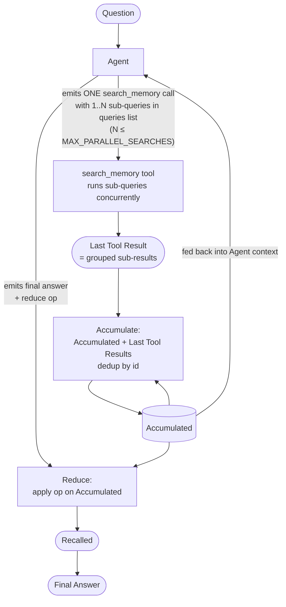

# Agentic Memory Retrieval — Decompose-and-Search Recall Loop

> **Design doc (proposed).** Replace the memory track's **single-shot recall search** with a
> **bounded agentic loop**: the LLM is given a *narrow* `search_memory` tool, may issue **several
> searches**, inspects what comes back, and decides whether to **search again** (different query/knobs)
> or **answer** — capped at a hard search limit. The motivation is an evidence-recall analysis
> (BEAM-128k units 13 & 14) showing the bottleneck is **retrieval reaching the wrong axis**, not
> ingestion or extraction. The design is deliberately **benchmark-agnostic and un-baked**: no
> question-type catalog, no per-category logic, no examples drawn from any eval corpus.
>
> **Companions:**
> [`agentic-memory-retrieval-implementation.md`](agentic-memory-retrieval-implementation.md) (the
> phase-by-phase build plan — files, tests, diagrams),
> [`eval-evidence-recall-design.md`](eval-evidence-recall-design.md) (the ground-truth retrieval
> metric this is optimizing),
> [`memory-graphiti-replacement-design.md`](memory-graphiti-replacement-design.md) (the
> `GraphitiConversationMemory` recall leg this wraps),
> [`memory-eval-vs-chat-parity.md`](memory-eval-vs-chat-parity.md) (why the eval path and the chat
> path must stay aligned),
> [`rag-optimize.md`](rag-optimize.md) (retrieval-tuning levers, which §5 explains are **not** the fix here).
>
> **Mode:** initial development — **no backward compatibility / no migration / no wrappers**
> (repo rule, explicitly abided).
>
> **Status:** **Proposed** — not yet implemented. Grounded in the units 13/14 trace analysis (§3).

---

## 1. The one-paragraph version

The memory recall leg today issues **one** similarity search (`query`, `top_k`, `temporal`) and hands the
top-k facts to the answerer. An evidence-recall analysis of BEAM-128k units 13 & 14 shows this surfaces
only **~44% of gold episodes**, and — critically — **92% of the missed gold already exists as extracted
facts in the graph**; it simply never ranks into the top-k for the *verbatim question*. The questions and
the stored facts live on **different axes**: a question expresses an **intent/operation** ("how did my
plan change", "have I ever…", "suggest X" under a standing rule), while the facts express **content**.
Widening the nets (lower `sim_min_score`, higher `top_k`) only adds topically-similar **distractors** —
the gold was never topically similar. The fix is to let an LLM **decompose the question into one or more
targeted searches**, choosing a *small* set of retrieval knobs, **observe** the returns, and **iterate**
until it has enough or hits a cap — then answer (or honestly abstain). All multi-search complexity
collapses back into the **one** `recalled` set + **one** `answer` the eval already consumes.

---

## 2. The needs that drove this scope

These are the explicit requirements that shaped the design (recorded verbatim-in-spirit so future readers
know *why* the scope is what it is):

1. **Improve retrieval, regardless of answers.** The immediate goal is to raise how much of the
   ground-truth evidence the recall leg actually surfaces — measured objectively against gold evidence
   episodes, independent of whether the final answer was judged correct.
2. **mem eval today, chat afterwards.** The first target is the **memory-eval recall leg**. The same
   mechanism must port cleanly to **live chat conversation** later — so the design is built for chat from
   the start, but only the eval path is wired now.
3. **No knowing the question type.** In real conversation we just get a question. The system must **not**
   depend on recognizing a fixed set of question categories.
4. **Never bake the benchmark.** No tailoring results to a benchmark, no per-category answer shaping, no
   few-shot examples lifted from any eval corpus, no thresholds tuned to a specific suite. Benchmarks are
   **held-out diagnostics**, never targets.
5. **Expose only a narrow, LLM-relevant set of search knobs.** The model should control *only* the
   parameters it can meaningfully reason about:
   - **temporal lens** — `current` (valid-now only) vs `all` (current + historical), depending on whether
     the question is about the present state or change over time;
   - **number of results** — so a hard search that comes back empty/thin can ask for *more* data, capped
     to a sane min/max;
   - **expansion hops** — `1` = no hops, `2` = one hop, `3` = two hops (for multi-hop questions), and no
     more than that;
   - **show expiry in results** — annotate returned edges with `invalid_at` and the `superseded` tag,
     when looking at an event that keeps changing over time or when validity itself matters.
   Everything else (rerank recipe, search scope, similarity floors, reranker min-score, group id) is **not
   exposed** — the LLM has no useful basis to set it; it stays at admin-pref defaults.
6. **Multiple searches, model-paced — sequential and parallel.** The model may run several searches and
   **decide for itself** whether to search more or stop and answer — **up to a hard limit** on the total
   count, and a separate **hard cap on how many searches it can fire in parallel within a single turn**.
7. **Decompose multi-part questions.** When a question asks about *several distinct things* (e.g. "what
   are X, Y, and Z…", "compare A vs B", "list all the times P and Q"), the model is expected to **split
   it into multiple targeted searches** rather than one omnibus query — typically firing the
   sub-question searches in parallel within one turn (subject to the parallel cap, need #6), then
   reading them together. Decomposition is a **method**, not a question category — applied whenever the
   question's *axis is plural*, regardless of topic.
8. **Collapse many returns into one.** The eval (and later chat) expects a single recalled context and a
   single answer. Multiple search returns must accumulate into **one** deduped context — one-in/one-out
   preserved.

---

## 3. Why: the evidence (BEAM-128k units 13 & 14)

Tracing all **111 gold-episode slots** across both units through the pipeline (using the `ingest_trace`
sidecars for what each chunk *persisted*, and the `retrieval_trace` sidecars for what each leg returned):

```
111 gold-episode slots
   ├─ ingested?              111 / 111  (100%)  → nothing lost at ingest
   ├─ converted to facts?    106 / 111  (95%)   → extraction mostly works
   └─ recalled (top-20)?      49 / 111  (44%)   → the cliff
```

| Fate of gold episode | Count | Meaning |
|---|---:|---|
| Recalled (in the top-k pool) | 49 | reached the answerer |
| **Ingested, facts extracted, NOT recalled** | **57** | **facts exist in the graph; retrieval never surfaced them** |
| Ingested, 0 facts extracted, NOT recalled | 5 | extraction gap (mostly standing instructions collapsing to a bare entity) |
| Not ingested | 0 | no data loss |

**The bottleneck is retrieval, not the earlier pipeline.** And it is not a *ranking-strength* problem
fixable by widening candidates — it is an **axis** problem. Two mismatch classes, both confirmed in the
traces (the search query is the **verbatim question** — there is no rewrite on this path):

- **Speech-act mismatch.** Q "Can you suggest some good audiobooks?" vs gold *"Always include audiobook
  narrator details when I ask about audiobook recommendations."* The gold is a **rule** that *governs* the
  request; it shares one noun with the question and none of its defining words. No vector/BM25/keyword
  signal links a request to the rule that constrains it.
- **Abstraction mismatch.** Q "list the **order** in which I **brought up** different **aspects**…" — the
  distinctive words describe an **operation over the conversation**, not the content of any episode, so the
  episodes that *constitute* the answer don't resemble the question. For one ordering question, **4 of 5**
  gold episodes were not candidates in *any* leg.

Conclusion: relevance here is defined by **role / time / completeness**, which similarity cannot see.
The query must be **transformed onto the right axis** before retrieval — and sometimes more than one
search is needed. That is what the loop does.

---

## 4. What was rejected (and why)

| Option | Verdict | Reason |
|---|---|---|
| Widen retrieval (`sim_min_score↓`, `top_k↑`, `k_hop↑`, recipe A/B) | **Rejected as the fix** | Adds topically-similar **distractors**; the gold was never topically similar, so it stays out *and* precision drops. (Still fine as background defaults.) |
| Fixed **intent classifier → canned decomposition** (route into the 10 diagnostic groups) | **Rejected** | The 10 groups were a **diagnosis**, not a routing table. A classifier over benchmark-derived categories is **baking** (need #4) and brittle on open chat turns (need #3). |
| Static **plan-then-execute** with eval-derived examples | **Rejected** | Examples from the eval corpus are leakage; a one-shot plan can't react to empty/thin returns (need #6). |

The 10-group taxonomy survives **only as a thinking tool** for reviewers — never as code.

---

## 5. The design

### 5.1 Loop

**Accumulate** is the per-search step that combines the running **Accumulated** set with the
**Last Tool Results** (dedup-by-id). **Reduce** is the one-shot post-loop step that shapes the final
Accumulated set into `Recalled`.



- **Loop path** (Agent emits a `search_memory` call): the tool runs the sub-queries concurrently →
  produces **Last Tool Result** (sub-results grouped under one ToolMessage) → **Accumulate**
  combines them with the existing **Accumulated** set → updated **Accumulated** is fed back into
  the Agent's context so the next turn sees everything found so far.
- **Exit path** (Agent emits final answer + reduce op): the final **Accumulated** set goes through
  **Reduce** once → result becomes **Recalled** → handed to the answerer.
- Bounded by `MAX_AGENT_TURNS` total LLM invocations and `MAX_PARALLEL_SEARCHES` sub-queries per
  tool call (see [implementation §6](agentic-memory-retrieval-implementation.md) for cap enforcement).

### 5.2 The tool surface (only the four knobs from need #5)

The model emits **one** `search_memory` tool call per turn. The call carries 1..N sub-queries (each
with its own knobs + goal); the tool runs them concurrently internally and returns one combined
result. This shape (multi-arg tool) doesn't depend on the model supporting parallel tool-calling
reliably — it works with any tool-using LLM.

```text
search_memory(
  queries: list[SearchMemoryQuery]    # 1..MAX_PARALLEL_SEARCHES sub-queries
)

SearchMemoryQuery {
  query:        str,                              # always
  temporal:     "current" | "all" = "current",    # current = valid-now; all = valid-now + past/changed
  limit:        int   = 20,                       # capped [MIN=10, MAX=40]; raise when a search is empty/thin
  hops:         1 | 2 | 3 = 1,                    # 1 = no expansion, 2 = one hop, 3 = two hops
  show_expiry:  bool  = false,                    # annotate edges with invalid_at + superseded tag
  goal:         str   = ""                        # provenance label (free text)
}
```

**Hidden from the LLM** (stay at admin-pref defaults): `recipe`, `search_scope`, `sim_min_score`,
`reranker.min_relevance`, `group_id`. The LLM has no useful basis to set these.

**Semantics & interactions:**
- A turn with **N sub-queries in one tool call** = decomposition. The tool runs all N concurrently
  via `asyncio.gather` and returns one combined result.
- `temporal` selects which facts are *candidates* — `current` returns only edges valid-now; `all` widens
  the pool to include superseded/expired edges too.
- `show_expiry` is purely a *presentation* knob over edges: when `true`, returned edges carry
  `invalid_at` + the `superseded` flag (and the older value's `valid_at`); when `false`, those fields are
  omitted. It only adds meaning under `temporal="all"` — under `current` every edge is valid-now and
  has nothing to expire.
- `limit` is the model's "find me more data" lever for hard/empty searches; it is **clamped** to
  `[MIN, MAX]` server-side regardless of what the model asks.
- `hops` is bounded to `{1,2,3}` by construction.

**Settables are admin-pref preferences (not constants).** `MAX_AGENT_TURNS` (every LLM invocation in
the loop, including the final-answer turn — default `4`), `MAX_PARALLEL_SEARCHES` (default `3`; how
many sub-queries one `search_memory` call may carry), the `limit` MIN/MAX/default, and the `hops`
upper bound all land as editable preferences under (e.g.) `graph.retrieval_agent.*`, so they can be
tuned per workspace/run without a code change. (Per repo rule: every settable knob is a preference,
not a hardcoded value.) Implicit worst-case graph load with defaults:
`(MAX_AGENT_TURNS − 1) × MAX_PARALLEL_SEARCHES = 9` graph searches.

**Cap semantics.** `MAX_PARALLEL_SEARCHES` bounds the *length of the `queries` list per tool call*
and is enforced by Pydantic `max_length` (the tool rejects the call if it's exceeded; the model
gets a validation error back and can retry). `MAX_AGENT_TURNS` bounds the *count of LLM invocations
across the whole loop*; the executor advances its counter on every invocation and, when the next
one would be the last allowed, rebinds the agent with `tools=[]` so the model can only emit a final
answer.

**Wiring note (no-backward-compat):** `temporal` and `limit`(=`num_results`) are already per-call on
`search_chunk_ids`. **`hops` (today `graph.k_hop`) and `show_expiry` are global admin prefs and must be
lifted to per-call arguments**, defaulting to the admin pref when the model omits them. The tool is exposed
per the **Tools Architecture** (new `search_memory` tool over `GraphitiConversationMemory`); it is **not**
auto-attached to the chat agent surface yet (eval-only for now).

### 5.3 Prompt shape (system) — **editable profile**, structured like the answer prompt

The retrieval-agent prompt is **not** a Python constant baked into the loop. It is an editable
**preference profile** alongside the existing answer/judge prompts:

- Default text constant `DEFAULT_MEMORY_EVAL_RETRIEVAL_AGENT_PROMPT` in
  `hirocli/domain/preferences.py` (next to `DEFAULT_MEMORY_EVAL_ANSWER_PROMPT` /
  `DEFAULT_MEMORY_EVAL_JUDGE_PROMPT`).
- Profile collection at `graph.eval.retrieval_agent_prompts` (mirroring `graph.eval.answer_prompts`)
  so the eval can A/B prompt variants per run.
- Same blank-⇒-default resolve pattern (see `resolve_answer_prompt` in
  `hirocli/services/eval/judge.py`) — empty string falls back to the constant at runtime.
- Same admin-UI editor card on the Preferences page (Restore-default button included).

Same no-baking rules as before (needs #3, #4): no category **catalog** and no per-category logic, but
the prompt **does** prime the model with common *intent shapes* (open-ended, see §7) plus general
guidance on the four knobs and the reduce library (§6). It teaches the **method** and offers
**illustrative** shapes the model is free to ignore — never a closed enum, never shape-by-category
answer formatting, no examples drawn from any eval corpus.

**Section skeleton (mirrors `DEFAULT_MEMORY_EVAL_ANSWER_PROMPT`):**
`Objective` → `Element formats` → `Method` → `Knobs` → `Reduce ops` → `Positive Calibrators` →
`Negative Calibrators` → `Stopping & abstaining` → `Validation`. Knob mechanics are a **compact
reference**, not the spine — the spine is the method.

```text
## Objective
You retrieve facts from past conversations to answer the user's question. You cannot read the
memory directly — call `search_memory`. Each call carries 1..{MAX_PARALLEL_SEARCHES} sub-queries
in its `queries` list — that's how you DECOMPOSE a multi-part question into sub-questions that
run together. You may call `search_memory` several times (once per turn), observing each return
before deciding to search again or to answer. You have {MAX_AGENT_TURNS} agent turns total — that
includes your final-answer turn, so plan accordingly. If the memory genuinely lacks the detail,
say so — do not guess.

## Element formats
Results arrive as a mix of three element kinds, each shaped differently — use them accordingly:
  - edge (fact) → a dated relational claim, with valid_at / (optional) invalid_at / superseded
                  flag when `show_expiry` is on. The ONLY kind that carries validity, so
                  latest / ever-never / change-over-time live here.
  - entity      → a standing who/what profile (name + summary); NO dates — context, not a
                  timeline; cannot be ordered by time.
  - episode     → a verbatim conversation turn with ONE timestamp; no invalidation.

## Method
  1. Rephrase the question as a STORED FACT, not as the user asked it — drop "can you",
     "how many", "walk me through". The index sees facts, not requests.
  2. **DECOMPOSE if the question is plural.** If it asks about several distinct things
     (multiple subjects, several time windows, "X and Y and Z", a comparison, a list across
     unrelated topics), split it into independent sub-questions and put them as multiple
     entries in the `queries` list of ONE `search_memory` call (up to {MAX_PARALLEL_SEARCHES}
     entries). Each sub-question gets its own `query` + knobs + `goal`. If the question is
     singular, a single-entry list is fine.
  3. Decide the AXIS each (sub-)question lives on: current value/state · change over time ·
     ever/never · count · ordering · synthesis · something else you name yourself.
  4. Choose the four knobs to match that axis (see "Knobs" below) — independently per
     sub-question; they can differ.
  5. Read what came back. If the gap is "wrong axis," rephrase (don't just widen). If the
     gap is "thin data on the right axis," raise `limit` (or `hops`). If a sub-question
     came back empty, retry just that one — leave the rest. If the set already answers, stop.

## Knobs (compact reference)
  query        → a stored-fact phrasing of what's needed.
  temporal     → "current" for the state that holds now; "all" when the question is about
                 change over time, or whether something ever/never happened.
  limit        → start at the default; raise (up to {MAX_LIMIT}) only when a search was empty
                 or thin AND rephrasing didn't help.
  hops         → 1 direct; 2 if the answer links one entity to another; 3 for two links.
  show_expiry  → true to see `invalid_at` and the `superseded` flag on edges (timeline / change
                 questions). Only meaningful with `temporal="all"`.

## Reduce ops (optional, declared on your FINAL turn)
If the answer needs a precise count, an ordering, the latest value, a duration between two
facts, or both sides of an "ever/never", request the matching reduce instead of computing it
yourself — the system runs it deterministically.
  distinct_count · order_by_time · latest · date_diff · keep_conflicting
Omit `reduce` (or `op: none`) to answer straight from the deduped accumulator.

## Positive Calibrators (synthetic; NOT drawn from any benchmark)
P1 — current value
  q: What's the user's monthly book budget?
  knobs: temporal=current, limit=20, hops=1, show_expiry=false. No reduce.
  behavior: one search, take the valid-now edge; answer.

P2 — change over time
  q: How has the book budget changed?
  knobs: temporal=all, show_expiry=true, hops=1. reduce.op=order_by_time.
  behavior: surface valid + superseded edges with their dates; let the reduce order them.

P3 — ever/never
  q: Have they ever mentioned disliking a genre?
  behavior: ONE `search_memory` call with TWO entries in `queries` — one affirming phrasing,
  one negating phrasing. Then reduce.op=keep_conflicting to present both polarities.

P4 — decomposition of a plural question
  q: What's the user's current job, their main hobby, and their last trip?
  behavior: ONE `search_memory` call with THREE entries in `queries` — one per sub-question,
  each with its own query/goal (job: temporal=current; hobby: temporal=current; trip:
  temporal=all, reduce later with `latest`). Read all three sub-results together; answer in one go.

## Negative Calibrators (don't burn the search budget badly)
N1 — empty + same query + higher limit is NOT progress. If a search returned nothing, the
     phrasing is wrong; rephrase first, then widen.
N2 — hops=3 only when the answer chains TWO entities. Otherwise it just slows the search and
     adds distractors.
N3 — show_expiry=true under temporal=current is wasted — every returned edge is valid-now and
     has nothing to expire.
N4 — never answer from the question alone. If after {MAX_AGENT_TURNS} nothing supports the
     answer, abstain.
N5 — do NOT decompose a singular question into N near-duplicate entries in `queries` to "cover
     more ground." Sub-queries are for genuinely independent sub-questions; three rephrasings of
     the same question just burns the budget and clogs the accumulator with topical distractors.
N6 — do NOT put more than {MAX_PARALLEL_SEARCHES} entries in `queries`; Pydantic will reject
     the call and you waste an agent turn on the error round-trip.

## Stopping & abstaining
Stop the moment the accumulated facts answer the question. If after {MAX_AGENT_TURNS} the answer
is still unsupported, abstain in the final turn — do not pad with guesses.

## Validation (pre-final-turn self-check)
- Did I rephrase the question into a stored-fact form before the first search?
- If the question is plural, did I DECOMPOSE it into multiple entries in the `queries` list
  of one tool call, instead of an omnibus single query? Conversely, if it's singular, did I
  avoid firing near-duplicate sub-queries?
- For each empty/thin search, did I diagnose "wrong axis" vs "thin data" before re-trying?
- For a temporal / ever-never question, did I either set show_expiry=true under temporal=all,
  or run BOTH polarities (ideally in parallel)?
- For a count / ordering / duration, did I declare the matching reduce op instead of
  computing it myself?
```

### 5.4 Response shape (per step) — native tool call + free-text `goal`

A search step (during the loop) — exactly **one** `search_memory` tool call per turn, with a
`queries` list of 1..MAX_PARALLEL_SEARCHES entries. One entry when the question is singular:

```json
{ "tool": "search_memory",
  "args": { "queries": [
    { "query": "monthly book and subscription budget",
      "temporal": "all", "limit": 20, "hops": 1, "show_expiry": true,
      "goal": "find the current budget and any earlier value it replaced" }
  ] } }
```

Multiple entries when the model decomposes a plural question (each independent, each with its own
knobs; the tool runs them concurrently and returns one combined ToolMessage with sub-results keyed
by `sub_id`):

```json
{ "tool": "search_memory",
  "args": { "queries": [
    { "query": "current job title and employer",
      "temporal": "current", "limit": 20, "hops": 1, "show_expiry": false,
      "goal": "sub: current job" },
    { "query": "main hobby or recurring leisure activity",
      "temporal": "current", "limit": 20, "hops": 1, "show_expiry": false,
      "goal": "sub: main hobby" },
    { "query": "trips and travel destinations",
      "temporal": "all", "limit": 20, "hops": 1, "show_expiry": true,
      "goal": "sub: last trip (latest)" }
  ] } }
```

`goal` is **free text**, used only as a **provenance label** for the accumulator and the trace — never a
key into canned logic (see §7 on intent). When the model decomposes, the `goal` of each sub-query is
how a reviewer (and the model on the next turn) tells the sub-questions apart in the accumulator.

The final turn is either a direct answer, or an optional **reduce request** over the accumulated set
followed by the answer. The `reduce` field is the model's *declared* op — selected by its own reasoning,
executed deterministically by the reducer (§6):

```json
{ "reduce": { "op": "date_diff", "anchors": ["editing job start date", "reading deadline"] },
  "answer": "…" }
```

`op` ∈ `{ none, distinct_count, order_by_time, latest, date_diff, keep_conflicting }`. Omit `reduce`
(or `op: none`) to answer straight from the deduped, time-sorted accumulator.

### 5.5 Tool-result shape (fed back to the agent)

One `search_memory` call returns **one** ToolMessage containing a `sub_results` array — one entry per
sub-query in the corresponding `queries` list, in the same order. Items within each sub-result are
**kind-tagged** and shaped per kind (`search_scope` — a hidden admin knob — decides which kinds
appear: `edges`, `edges+nodes`, or `edges+nodes+episodes`). Only **edges** carry validity;
**entities** have no dates; **episodes** carry a single `valid_at`. Scores are **kind-local and not
comparable across kinds** (edges/nodes are cosine/cross-encoder; episodes are BM25/rerank only).

```json
{ "turn": 2, "accumulated_total": 14,
  "sub_results": [
    { "sub_id": 1, "goal": "find the current budget", "returned": 9, "new": 6,
      "items": [
        { "kind":"edge",    "id":"e1", "fact":"Monthly budget is $50.",
          "valid_at":"2024-02-10", "invalid_at":null,        "superseded":false, "source_episode":"…m0204", "score":0.71 },
        { "kind":"edge",    "id":"e2", "fact":"Monthly budget is $40.",
          "valid_at":"2024-01-05", "invalid_at":"2024-02-10", "superseded":true,  "source_episode":"…m0090", "score":0.55 },
        { "kind":"entity",  "id":"n1", "name":"Crystal", "summary":"Reader; sets monthly book budgets…", "score":0.49 },
        { "kind":"episode", "id":"ep1","text":"Crystal: let's bump the budget to $50 a month.", "valid_at":"2024-02-10", "score":0.83 }
      ] }
  ] }
```

(`invalid_at`/`superseded` are present only on edges; `source_episode` only on edges; entities have no
`valid_at`; episodes have `valid_at` but no `invalid_at`/`superseded`. With multiple sub-queries the
`sub_results` array has one entry per sub-query, each shaped exactly like above.)

---

## 6. Accumulation — many returns, one context (need #8)

A single **kind-partitioned accumulator** grows across iterations. It is **not** a flat fact list — it
holds whatever element kinds the (hidden) `search_scope` returns: **edges**, **entities**, **episodes**.

- **Dedup by `(kind, uuid)`** — edge, node, and episode uuids are separate namespaces. Each search's
  results are deduped against the accumulator so the agent sees only *new* items (context stays lean). The
  `returned` / `new` / `accumulated_total` counters are the model's signal that a search added nothing →
  change a knob or stop.
- Every item is **kind-tagged** and keeps **provenance** (`search_id`, `goal`). Field availability is
  per-kind: edges carry `valid_at`/`invalid_at`/`superseded` + `source_episode`; entities carry
  `name`/`summary` and **no dates**; episodes carry a single `valid_at`.
- **No cross-kind score sorting.** Edge/node cosine scores and episode BM25/rerank scores are not on one
  scale — never globally rank the mixed set by score. (This is a *second* reason for the anti-truncation
  rule below, beyond facet-drowning.)
- On stop, the accumulator **is** the `recalled` set and the final message **is** the `answer` — so N
  searches collapse to the **one-in/one-out** shape the eval expects.
- **Anti-truncation rule:** never merge by "concatenate all returns, then global top-k" — that re-creates
  the original bug (a dense facet drowning a rare critical item) *and* would compare incomparable cross-kind
  scores. Because each search is a *separate* tool call with its own `limit`, each contributes its own
  results directly into its kind bucket; there is no global re-rank that can evict another search's findings.

### 6.1 Reduce primitives — general ops, model-selected, code-executed

Once the accumulator is final, the answer sometimes needs a **precise transformation** over it (a count,
an ordering, a duration). These are handled by a **small, general, composable reduce library** — *not* an
intent→op routing table. The distinction that keeps this un-baked (need #4):

- **The model selects** which reduce applies (if any) by reasoning about the question — it is the model's
  latent intent made explicit as an `op` choice in its final turn (§5.4). There is **no fixed classifier**
  mapping a question category to an op.
- **Code executes** the deterministic ops — because LLMs miscount large sets and botch date math. The
  *semantic* reduces (comparing, synthesizing, summarizing) stay with the model.
- Every op is a **domain-neutral memory operation** ("count distinct things" is universal, not a benchmark
  category), so the library transfers to any question, including shapes we don't anticipate.
- **Ops are kind-aware and guarded** (see §5–6: edges have validity, entities have no dates, episodes have
  one timestamp). An op that needs validity simply **skips kinds that lack it** rather than erroring.

| Primitive | Executed by | Applies to kind(s) | Model picks it when the answer needs… |
|---|---|---|---|
| `dedupe` (by `(kind, uuid)`) | code — **always** | all | (implicit; runs on every accumulator) |
| `order_by_time` (sort by `valid_at`) | code — always w/ `show_expiry`, else on request | **edges + episodes** (entities have no time → excluded) | an ordering / timeline |
| `latest` (newest `valid_at` per subject+attribute) | code | **edges only** | the current value of something that changed |
| `distinct_count` (dedupe → count + list) | code | **declared target kind** (distinct entities vs facts vs episode-events differ) | a count of distinct things |
| `date_diff` (two model-named anchor facts → delta) | code | **edges** (or episode timestamps) | a duration between two events |
| `keep_conflicting` (affirming + negating sets, labeled) | code | **edges only** (validity-bearing) | both sides of an "ever / never" |
| `compare` / `synthesize` | **model** | all (entities = profile context, episodes = verbatim, edges = dated claims) | any semantic judgement over the set |

`dedupe` and (under `show_expiry`) `order_by_time` always run as part of presenting the accumulator;
the rest fire only when the model requests them. Temporal ops (`latest`, `keep_conflicting`, `date_diff`)
operate over **edges**; `order_by_time` also accepts **episodes** by their single timestamp; **entities are
never ordered** — they are standing context. `distinct_count` must name the kind it counts. **Searching**
both polarities (for `keep_conflicting`) or enumerating enough rows (for `distinct_count`) is **loop-side**
— the model issues the extra/negation searches; the reduce only *shapes* the accumulated set. The two
cooperate: loop gathers, reduce computes.

---

## 7. Intent — open guidance, not a closed classifier (needs #3, #4)

We do **not** maintain a fixed taxonomy of question types and switch retrieval/format on it — that is the
baking we reject. But we also do **not** strip intent from the prompt. The balance:

1. **Open-ended shape guidance in the prompt (§5.3).** A short, explicitly **non-exhaustive** list of
   common intent shapes (current value · change-over-time · ever/never · count · ordering · synthesis)
   primes good query phrasing, knob choices, and reduce selection — with an explicit "*or a shape not
   listed — you decide*." It is illustrative, never a closed enum, and it drives **retrieval behavior
   only**, never answer formatting.
2. **Latent expression** through the query rewrite + which knobs the model sets (`temporal="all" +
   show_expiry=true` *is* the model saying "change over time," without naming a category).
3. **Declared, on the model's terms:** the free-text `goal` per search (provenance/merge label) and the
   optional `reduce.op` on the final turn (§5.4) — both **chosen by the model's reasoning**, not by a
   hardcoded category→behavior table.

The model does **not** choose `search_scope` (which element kinds — edges/nodes/episodes — come back); that
stays a hidden admin knob (§5.2). The model simply reasons over whatever kinds the scope returns, with the
kind-aware guards of §6.1.

What stays forbidden (need #4): a fixed classifier that routes recognized categories to canned
retrieve/reduce/format, any per-category answer shaping, and any shape list tuned to — or examples drawn
from — a specific benchmark. The shapes in §5.3 are general assistant-memory patterns, freely overridable.

---

## 8. Scope: eval today, chat later

**Now — memory eval.** The loop replaces the single recall search in the eval's recall+answer leg. Outputs
are unchanged: a `recalled` fact set (the accumulator) and an `answer` (the final message), so the judge,
the evidence-recall metric ([`eval-evidence-recall-design.md`](eval-evidence-recall-design.md)), and the
retrieval/ingest traces keep working.

**Later — chat.** The same loop and tool drop into the chat `memory_search` node. Only three additions,
none of which touch the core loop:
- a **need-memory gate** in front (most turns skip retrieval entirely — latency/cost);
- **coreference** resolution against recent dialogue *before* the first `query` (eval questions are
  self-contained; chat turns are not);
- the **answerer becomes the persona** (assistant voice/character) instead of the eval's terse format.

Keeping the retrieval loop identical across both is the parity requirement in
[`memory-eval-vs-chat-parity.md`](memory-eval-vs-chat-parity.md).

---

## 9. Anti-baking guardrails (need #4)

- Prompt teaches **general method**, not categories; **no** few-shot examples from any eval corpus.
- **No per-category answer formatting** — the answerer receives a clean fact set, not a benchmark recipe.
- Benchmarks (BEAM, LoCoMo) are **held-out diagnostics**. If we ever change behavior because of a *specific*
  benchmark item, that is the line we don't cross.
- Retrieval reasoning runs on a **capable model**; the local extraction model may not strategize well —
  that is a model-routing decision, not a prompt hack.

---

## 10. Risks & open questions

- **Non-determinism vs eval reproducibility.** An agentic loop makes the eval score noisier. Acceptable
  because the goal is **live quality**, not a reproducible number — but pin **low temperature** and a
  **hard `MAX_AGENT_TURNS`** for stability. Open: do we want a fixed seed / cached-plan mode for regression
  runs?
- **`MAX_AGENT_TURNS`, `MAX_PARALLEL_SEARCHES`, `MIN/MAX limit` values.** Need calibration on units 13/14
  + a stress corpus ([`conversation-memory-stress-corpus-design.md`](conversation-memory-stress-corpus-design.md)).
  Start with `MAX_AGENT_TURNS=4`, `MAX_PARALLEL_SEARCHES=3`, `limit∈[10,40]` default `20`. All five land
  as admin-pref preferences (§5.2), so calibration is a settings change, not a code change. **The
  parallel cap is one global value across eval and chat** — the loop is identical across the two paths
  per [`memory-eval-vs-chat-parity.md`](memory-eval-vs-chat-parity.md), so its limits move together.
- **Decomposition discipline.** A weak model may over-decompose (turning a singular question into
  near-duplicate parallel queries → N5 in the prompt) or under-decompose (omnibus query on a plural
  question). Mitigation: explicit N5 + P4 calibrators in the prompt; observe in traces whether the
  pattern shows up.
- **Cost/latency per question.** Up to `MAX_AGENT_TURNS` LLM round-trips + searches. Tolerable in eval; the
  chat need-memory gate handles the live-traffic common case.
- **Model tool-use discipline.** Weak models may loop without converging or never escalate. Mitigation:
  hard cap + a **verbatim-search fallback** so a degenerate trajectory is never *worse* than today's single
  search.
- **`hops=3` cost.** Two-hop BFS can be expensive on a dense graph
  ([`kuzu-bfs-path-explosion-design.md`](kuzu-bfs-path-explosion-design.md)); keep the per-query timeout
  guard.

---

## 11. Implementation sketch (for a follow-up plan, not this doc)

1. Lift `hops` and `show_expiry` to per-call params on `search_chunk_ids` (default to admin pref).
2. Add the `search_memory` Tool over `GraphitiConversationMemory` (the four knobs; clamp `limit` to
   `[MIN_LIMIT, MAX_LIMIT]` default `20`, bound `hops` to `{1,2,3}`); **not** agent-default.
3. Add admin-pref preferences for the loop settables: `graph.retrieval_agent.max_agent_turns`,
   `…max_parallel_searches` (default `3`), `…limit.min`, `…limit.max`, `…limit.default`,
   `…hops.max`, and the prompt profile `graph.eval.retrieval_agent_prompts` (with
   `DEFAULT_MEMORY_EVAL_RETRIEVAL_AGENT_PROMPT` in `hirocli/domain/preferences.py`). Editor card on
   the Preferences admin page, same shape as the existing answer/judge prompt editors.
4. Build the retrieval-agent node (LangGraph V1 `create_agent`) with the §5.3 prompt (resolved from
   the active profile, blank ⇒ default), the accumulator (§6), and the `MAX_AGENT_TURNS` total cap
   (counter advances per LLM invocation; when the next invocation would be the last allowed, the
   agent is rebound with `tools=[]` so it can only emit a final answer). The `search_memory` tool
   runs its `queries` sub-list concurrently via `asyncio.gather` internally; `MAX_PARALLEL_SEARCHES`
   is enforced by Pydantic `max_length` on the list.
5. Implement the **reduce library** (§6.1) as deterministic functions over the accumulator
   (`distinct_count`, `order_by_time`, `latest`, `date_diff`, `keep_conflicting`; `dedupe` +
   `order_by_time` always-on), invoked by the model's declared `reduce.op` on its final turn (§5.4).
   `compare`/`synthesize` need no code — they are the answerer reasoning over the reduced set.
6. Wire it as the memory-eval recall leg; emit the accumulator as `recalled` and the final message as
   `answer`.
7. Measure **evidence recall** on units 13 & 14 (and the broader BEAM-128k set) as a held-out diagnostic;
   compare against the 44% baseline — **without** tuning to it.

> **To get up to speed after implementing:** changing `graph.k_hop` semantics to per-call needs a **server
> restart**; no re-ingest is required (this is all retrieval-time). No workspace reset needed.
