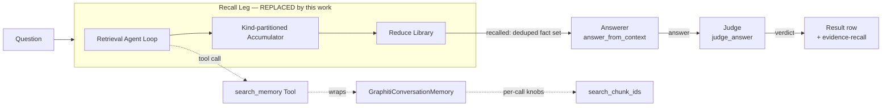
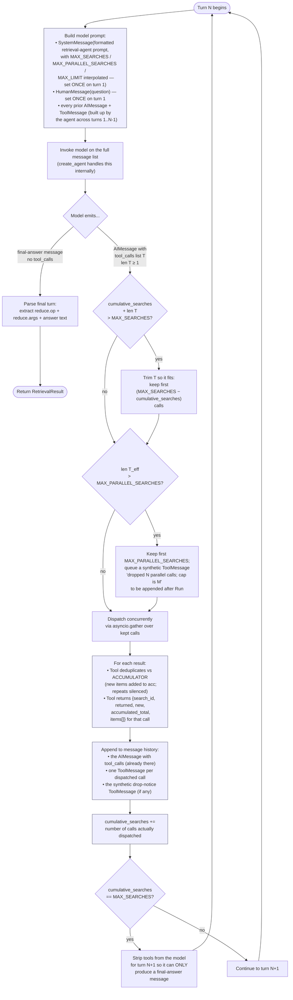
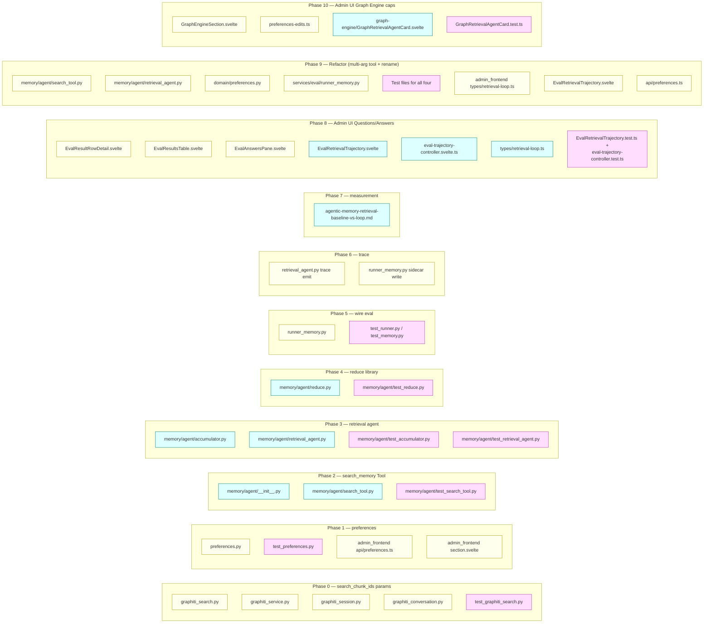

# Agentic Memory Retrieval — Implementation Guide

> **Companion to** [`agentic-memory-retrieval-design.md`](agentic-memory-retrieval-design.md) (the
> *what / why*). This document is the *how* — a phase-by-phase build plan written for an engineer who
> has not seen the design before. It covers high-level architecture, low-level file/function-level
> changes, tests, and validation. Diagrams are mermaid (rendered by the docs viewer).
>
> **Audience:** an engineer (or junior agent) implementing this end-to-end.
>
> **Status:** **Proposed** — not yet implemented. Doc tracks the design as approved.
>
> **Mode:** initial development — **no backward compatibility / no migration / no wrappers**
> (repo rule, explicitly abided).
>
> **Companions:** [`memory-eval-vs-chat-parity.md`](memory-eval-vs-chat-parity.md) (why the eval and
> chat paths must stay aligned — the parallel cap and prompt are one global value across both),
> [`eval-evidence-recall-design.md`](eval-evidence-recall-design.md) (the ground-truth retrieval
> metric this is optimizing against).

---

## 0. Before you start — read these first

| File | What you'll learn |
|---|---|
| [`agentic-memory-retrieval-design.md`](agentic-memory-retrieval-design.md) | The design rationale, the rejected alternatives, the prompt + tool surface, the reduce library, the no-baking guardrails. **Required reading.** |
| [`eval-evidence-recall-design.md`](eval-evidence-recall-design.md) | How we measure recall against gold evidence — the metric you are optimizing. |
| [`memory-eval-vs-chat-parity.md`](memory-eval-vs-chat-parity.md) | Why the retrieval loop is identical across the eval recall leg and the chat `memory_search` node. The parallel cap and prompt are **one** global value — do not split them per surface. |
| [`hiroserver/hirocli/src/hirocli/services/knowledge/graph/graphiti_search.py`](../hiroserver/hirocli/src/hirocli/services/knowledge/graph/graphiti_search.py) | `search_chunk_ids` — the low-level graphiti search. You'll add two per-call params here. |
| [`hiroserver/hirocli/src/hirocli/services/memory/graphiti_conversation.py`](../hiroserver/hirocli/src/hirocli/services/memory/graphiti_conversation.py) | `GraphitiConversationMemory` — the eval-scoped recall surface the `search_memory` tool will wrap. |
| [`hiroserver/hirocli/src/hirocli/services/eval/runner_memory.py`](../hiroserver/hirocli/src/hirocli/services/eval/runner_memory.py) | The current single-shot recall leg you will replace with the agent loop. |
| [`hiroserver/hirocli/src/hirocli/services/eval/judge.py`](../hiroserver/hirocli/src/hirocli/services/eval/judge.py) | Pattern for `resolve_*_prompt` (blank ⇒ default). Mirror it for the retrieval-agent prompt. |
| [`hiroserver/hirocli/src/hirocli/domain/preferences.py`](../hiroserver/hirocli/src/hirocli/domain/preferences.py) | Where the new preferences + the default prompt constant live. |
| [Tools Architecture](../../hiro-docs/mintdocs/architecture/misc/tools-architecture.mdx) | The Tool abstraction the `search_memory` tool conforms to. |

> **Rule check** before you write code: re-read the rules under `.claude/rules/` (no
> backward-compat, common-utility, general-coding-rules, human-first-structured-logging,
> langchain-langgraph-versions). Especially: use `create_agent`, not `create_react_agent`.

---

## 1. High-level architecture

### 1.1 Where this lives in the system



**One sentence:** the recall leg in `runner_memory.py` stops being a single `memory.search(question)`
call and becomes a small **LangGraph agent** that may issue up to `MAX_PARALLEL_SEARCHES` `search_memory`
tool calls per turn, up to `MAX_SEARCHES` total — then either declares a `reduce.op` over the
accumulated facts or answers directly. The accumulated set is the `recalled` fact list the existing
answerer + judge already consume; **the rest of the eval row shape is unchanged**.

### 1.2 The loop, end-to-end

```mermaid
sequenceDiagram
    autonumber
    participant Caller as runner_memory.run_one
    participant Agent as Retrieval Agent (LangGraph)
    participant Tool as search_memory Tool
    participant Mem as GraphitiConversationMemory
    participant Search as search_chunk_ids
    participant Reduce as Reduce Library
    participant Answerer as answer_from_context
    participant Judge as judge_answer

    Caller->>Agent: invoke(question, system_prompt, accumulator=∅)
    loop until answer OR MAX_SEARCHES
        Agent->>Agent: think
        alt single search
            Agent->>Tool: search_memory(query, temporal, limit, hops, show_expiry)
            Tool->>Mem: search(...)
            Mem->>Search: search_chunk_ids(... hops, show_expiry ...)
            Search-->>Tool: edges/nodes/episodes
            Tool-->>Agent: {search_id, returned, new, accumulated_total, items[]}
        else decomposed plural question (parallel)
            par up to MAX_PARALLEL_SEARCHES (asyncio.gather)
                Agent->>Tool: search_memory(sub_q_1, ...)
                Tool->>Mem: search(...)
                Mem->>Search: search_chunk_ids(...)
            and
                Agent->>Tool: search_memory(sub_q_2, ...)
                Tool->>Mem: search(...)
                Mem->>Search: search_chunk_ids(...)
            and
                Agent->>Tool: search_memory(sub_q_3, ...)
                Tool->>Mem: search(...)
                Mem->>Search: search_chunk_ids(...)
            end
            Tool-->>Agent: 3 result blocks (one per call)
        end
        Note over Tool: Each call: dedup by (kind, uuid) vs accumulator;<br/>tag items with {search_id, goal}.
    end
    Agent->>Caller: final {reduce?, answer}
    alt reduce.op != none
        Caller->>Reduce: apply(op, accumulator, args)
        Reduce-->>Caller: shaped set
    end
    Caller->>Answerer: answer_from_context(question, recalled=shaped_set)
    Answerer-->>Caller: answer
    Caller->>Judge: judge_answer(question, answer, ideal, recalled)
    Judge-->>Caller: verdict + evidence
```

### 1.3 Caps in one place

| Cap | Default | Where enforced | Effect on overflow |
|---|---|---|---|
| `MAX_SEARCHES` | 4 | Executor (in the agent node) | Force the agent into its final-answer turn next. |
| `MAX_PARALLEL_SEARCHES` | 3 | Executor — clamps tool calls per turn | Drop extras; feed back an explicit `"dropped N parallel calls; cap is M"` notice so the next turn knows. |
| `limit` per call | 20 (clamp `[10, 40]`) | Tool — clamps before calling `search_chunk_ids` | Silent clamp + a debug log line. |
| `hops` per call | 1 (bound `{1,2,3}`) | Tool — validated by pydantic | Pydantic raises → tool call returns an error to the agent. |

**Parallel cap is GLOBAL.** Identical value for eval and chat (parity requirement). Do not introduce a
`chat_max_parallel_searches` override.

---

## 2. Phase plan

Eleven phases. **P0–P8 are already implemented.** P9 is a focused refactor on top of them
(multi-arg tool + counter rename); P10 follows up with the admin settings card.

```mermaid
flowchart LR
    subgraph PL[Plumbing]
        P0[P0 — search_chunk_ids<br/>per-call params]
        P1[P1 — Preferences +<br/>prompt profile]
    end
    subgraph SF[Surface]
        P2[P2 — search_memory<br/>Tool]
    end
    subgraph AG[Agent]
        P3[P3 — Retrieval-agent<br/>node + accumulator]
        P4[P4 — Reduce library]
    end
    subgraph IN[Integration]
        P5[P5 — Wire into<br/>memory-eval recall leg]
        P6[P6 — Trace + metrics]
    end
    subgraph VA[Validation]
        P7[P7 — Evidence-recall<br/>measurement]
    end
    subgraph UI[Admin UI]
        P8[P8 — Questions/Answers<br/>tab surfaces]
    end
    subgraph RF[Refactor + Settings]
        P9[P9 — Multi-arg tool<br/>+ max_agent_turns rename]
        P10[P10 — Graph Engine<br/>caps settings card]
    end
    P0 --> P1 --> P2 --> P3 --> P4 --> P5 --> P6 --> P7
    P6 --> P8
    P8 --> P9 --> P10

    classDef plumbing fill:#dff,stroke:#077;
    classDef surface  fill:#ffe,stroke:#a90;
    classDef agent    fill:#fdf,stroke:#a3a;
    classDef integ    fill:#dfd,stroke:#393;
    classDef valid    fill:#fdd,stroke:#a33;
    classDef ui       fill:#eef,stroke:#557;
    classDef refactor fill:#fed,stroke:#a73;
    class P0,P1 plumbing;
    class P2 surface;
    class P3,P4 agent;
    class P5,P6 integ;
    class P7 valid;
    class P8 ui;
    class P9,P10 refactor;
```



| Phase | Title | Depends on | Status | Rough size |
|---|---|---|---|---|
| **P0** | `search_chunk_ids` per-call params | — | ✅ done | small (1 file + tests) |
| **P1** | Preferences + prompt profile | P0 | ✅ done | medium (pydantic + admin UI for the prompt profile only) |
| **P2** | `search_memory` Tool | P1 | ✅ done | small (one new module + tests) |
| **P3** | Retrieval-agent node + Accumulator | P2 | ✅ done | **largest** (loop + cap enforcement + parallel exec) |
| **P4** | Reduce library | P3 | ✅ done | small-medium (6 pure functions + tests) |
| **P5** | Wire into memory-eval recall leg | P4 | ✅ done | small (swap one call in `runner_memory.py`) |
| **P6** | Trace + metrics | P5 | ✅ done | small (sidecar writer + ledger preview tweak) |
| **P7** | Evidence-recall measurement | P6 | ✅ done | report-only — no code |
| **P8** | Admin UI Questions/Answers surfaces | P6 | ✅ done | medium (3 modified .svelte + 1 new component + 1 controller + types) |
| **P9** | Refactor: multi-arg tool + `max_agent_turns` rename | P8 | ✅ done | medium (focused refactor across P2/P3/P6/P8 touchpoints) |
| **P10** | Admin UI Graph Engine caps card | P9 | **next** | small (1 new card + GraphEngineSection mount + tests) |

Each phase below has: **goal · files touched · low-level changes · tests · acceptance criteria**.

---

## 3. Phase 0 — Lift `hops` + `show_expiry` to per-call params on `search_chunk_ids`

### Goal

Today `hops` (=`k_hop`) is per-call (good) and `show_expiry` doesn't exist (validity is always
omitted from result rows unless the trace path adds it). Add `show_expiry` as a per-call boolean and
make sure both default to admin-pref values when the caller omits them.

### Files touched

- [`hiroserver/hirocli/src/hirocli/services/knowledge/graph/graphiti_search.py`](../hiroserver/hirocli/src/hirocli/services/knowledge/graph/graphiti_search.py) — add `show_expiry: bool = False` to `search_chunk_ids` signature; when true, attach `valid_at` / `invalid_at` / `superseded` to each edge row in the returned expansion.
- [`hiroserver/hirocli/src/hirocli/services/knowledge/graph/graphiti_service.py`](../hiroserver/hirocli/src/hirocli/services/knowledge/graph/graphiti_service.py) — thread `show_expiry` through `GraphitiService.search_chunk_ids`.
- [`hiroserver/hirocli/src/hirocli/services/knowledge/graph/graphiti_session.py`](../hiroserver/hirocli/src/hirocli/services/knowledge/graph/graphiti_session.py) — same thread-through on the session shim.
- [`hiroserver/hirocli/src/hirocli/services/memory/graphiti_conversation.py`](../hiroserver/hirocli/src/hirocli/services/memory/graphiti_conversation.py) — expose `show_expiry` on `GraphitiConversationMemory.search`.

### Low-level

```python
# graphiti_search.py
async def search_chunk_ids(
    graphiti: Any,
    query: str,
    *,
    group_id: str | None = None,
    num_results: int = 20,
    temporal: str = "current",
    recipe: str = "rrf",
    k_hop: int = 1,
    min_relevance: float = 0.0,
    sim_min_score: float = 0.3,
    scope: str = "edges",
    show_expiry: bool = False,                        # NEW
) -> GraphitiExpansion:
    ...
    # When True, each edge in the returned GraphitiExpansion carries:
    #   item.valid_at, item.invalid_at, item.superseded (bool)
    # When False, those fields are omitted (or None) — current behaviour.
```

`GraphitiExpansion` may need a new shape for edges (e.g. a `validity: ValidityDates | None` field, or
extend `RankedFact`). Pick the smallest change that doesn't disturb existing consumers.

### Tests

In [`test_graphiti_search.py`](../hiroserver/hirocli/src/hirocli/services/knowledge/graph/test_graphiti_search.py):

- `test_search_chunk_ids_show_expiry_false_omits_validity` — assert `valid_at`/`invalid_at`/`superseded` are absent on returned edges.
- `test_search_chunk_ids_show_expiry_true_emits_validity_on_edges` — assert edges carry those three fields (use a fake graphiti that returns an edge with a known invalidation date).
- `test_search_chunk_ids_show_expiry_only_on_edges` — entities/episodes never carry the fields regardless of the flag.

### Acceptance

- `npm-equivalent` Python test suite passes: `pytest hiroserver/hirocli/src/hirocli/services/knowledge/graph/test_graphiti_search.py -v`.
- No existing callers break (they default to `show_expiry=False`).

---

## 4. Phase 1 — Preferences + prompt profile

### Goal

Add every settable knob as an editable preference, and promote the retrieval-agent prompt to a
profile with the same shape as the existing answer/judge prompts.

### Files touched

- [`hiroserver/hirocli/src/hirocli/domain/preferences.py`](../hiroserver/hirocli/src/hirocli/domain/preferences.py) — add the default prompt constant and the new pydantic models.
- [`hiroserver/hirocli/src/hirocli/domain/tests/test_preferences.py`](../hiroserver/hirocli/src/hirocli/domain/tests/test_preferences.py) — round-trip + default-restore tests.
- `admin_frontend/src/lib/api/preferences.ts` — type + default object for the new section.
- `admin_frontend/src/lib/features/preferences/sections/...` — **only** the prompt-profile editor card (under the Eval section, alongside the existing answer/judge prompt editors). The **caps** admin UI card lives in **Phase 9** under the **Graph Engine** section.

### Low-level — new preference paths

**Two namespaces**, separated by who shares them:

- **Loop bounds (caps)** live under `graph.retrieval_agent.*` — *not* under `graph.eval.*` — because
  the same loop runs in both eval and chat per [`memory-eval-vs-chat-parity.md`](memory-eval-vs-chat-parity.md).
  The parallel cap is one global value across both surfaces (design §2 need #6); housing it under
  `graph.eval.*` would falsely imply eval-only.
- **Prompt profile** stays under `graph.eval.retrieval_agent_prompts` — chat uses a different
  persona/answerer (design §8), so the prompt is eval-specific.

| Dotted path | Type | Default | Bound |
|---|---|---|---|
| `graph.retrieval_agent.max_searches` | int | 4 | `[1, 10]` |
| `graph.retrieval_agent.max_parallel_searches` | int | **3** | `[1, 5]` |
| `graph.retrieval_agent.limit_default` | int | 20 | `[1, 100]` |
| `graph.retrieval_agent.limit_min` | int | 10 | `[1, 100]` |
| `graph.retrieval_agent.limit_max` | int | 40 | `[1, 100]` |
| `graph.retrieval_agent.hops_max` | int | 3 | `[1, 3]` |
| `graph.eval.retrieval_agent_prompts` | list of `{id, label, prompt}` profiles | one profile (`id="default"`, `prompt=""`) | — |
| `graph.eval.active_retrieval_agent_prompt_id` | str | `"default"` | — |

> **Admin UI for the caps** lives in **Phase 9**. P1 ships the backend + the prompt-profile editor;
> P9 ships the caps card under **Preferences → Graph Engine**.

Pydantic model:

```python
# preferences.py
DEFAULT_MEMORY_EVAL_RETRIEVAL_AGENT_PROMPT = """\
## Objective
You retrieve facts from past conversations to answer the user's question...
"""  # full text from agentic-memory-retrieval-design.md §5.3

class RetrievalAgentLimits(BaseModel):
    max_searches:           int = Field(4, ge=1, le=10)
    max_parallel_searches:  int = Field(3, ge=1, le=5)
    limit_default:          int = Field(20, ge=1, le=100)
    limit_min:              int = Field(10, ge=1, le=100)
    limit_max:              int = Field(40, ge=1, le=100)
    hops_max:               int = Field(3, ge=1, le=3)

    @model_validator(mode="after")
    def _coherent_limits(self) -> "RetrievalAgentLimits":
        if self.limit_min > self.limit_default or self.limit_default > self.limit_max:
            raise ValueError("limit_min ≤ limit_default ≤ limit_max")
        return self
```

Then add `retrieval_agent: RetrievalAgentLimits` under the **graph** section (not under eval — see
the namespacing note above), and a `RetrievalAgentPromptProfile` alongside `AnswerPromptProfile`
under the eval section.

### Resolver — mirror `resolve_answer_prompt`

```python
DEFAULT_RETRIEVAL_AGENT_PROMPT_ID = "default"

def resolve_retrieval_agent_prompt(prefs: PreferencesSnapshot) -> tuple[str, str]:
    """Return (id, text). Blank text in active profile → built-in default."""
    profiles = prefs.graph.eval.retrieval_agent_prompts
    active = prefs.graph.eval.active_retrieval_agent_prompt_id
    profile = next((p for p in profiles if p.id == active), None)
    if profile is None:
        return (DEFAULT_RETRIEVAL_AGENT_PROMPT_ID, DEFAULT_MEMORY_EVAL_RETRIEVAL_AGENT_PROMPT)
    text = (profile.prompt or "").strip() or DEFAULT_MEMORY_EVAL_RETRIEVAL_AGENT_PROMPT
    return (profile.id, text)
```

Also add the path to `BUILTIN_PROMPT_DEFAULTS` so the admin UI "Restore default" works.

### Tests

In [`domain/tests/test_preferences.py`](../hiroserver/hirocli/src/hirocli/domain/tests/test_preferences.py):

- `test_retrieval_agent_defaults` — model loads with defaults `max_searches=4`, `max_parallel_searches=3`, `limit_default=20`, bounds `[10,40]`, `hops_max=3`.
- `test_retrieval_agent_limit_coherence_validator` — setting `limit_min=30, limit_default=20` raises.
- `test_retrieval_agent_caps_clamped_to_pydantic_bounds` — `max_parallel_searches=99` is rejected (≤5).
- `test_resolve_retrieval_agent_prompt_blank_falls_back_to_default` — empty profile text returns the constant.
- `test_resolve_retrieval_agent_prompt_uses_active_id` — switching `active_retrieval_agent_prompt_id` picks the right profile.
- `test_retrieval_agent_prompt_default_in_builtin_defaults` — UI restore-default mapping includes the new path.

In [`admin_frontend/src/lib/features/preferences/state/test/preferences-edits.test.ts`](../admin_frontend/src/lib/features/preferences/state/test/preferences-edits.test.ts) (run with `npm run test:unit -- preferences-edits`): assert the new fields are picked up by the structural diff.

### Acceptance

- Backend tests pass; **server restart required** for new fields to load.
- Admin UI Preferences page shows the new card; editing a value persists on Save; "Restore default" on the prompt editor brings back the constant text.

---

## 5. Phase 2 — `search_memory` Tool

### Goal

Build the LLM-facing tool. It is a thin clamp + dispatcher over `GraphitiConversationMemory.search`,
with the four LLM-visible knobs from the design.

### Files added

- `hiroserver/hirocli/src/hirocli/services/memory/agent/__init__.py` (new package — *consider hiro-commons if pattern recurs*, but for now memory-local).
- `hiroserver/hirocli/src/hirocli/services/memory/agent/search_tool.py` — the Tool class.
- `hiroserver/hirocli/src/hirocli/services/memory/agent/test_search_tool.py` — unit tests.

**Use the Tools Architecture.** Notify the user up-front (rule: `consider-creating-tools-first.md`).
The Tool wraps an operation; the same Tool can later expose as Agent Tool + (optionally) CLI + HTTP.

### Low-level

```python
# search_tool.py
from typing import Literal
from pydantic import BaseModel, Field, model_validator

class SearchMemoryArgs(BaseModel):
    query:        str    = Field(..., min_length=1)
    temporal:     Literal["current", "all"] = "current"
    limit:        int    = 20      # clamped to [limit_min, limit_max] at call time
    hops:         Literal[1, 2, 3] = 1
    show_expiry:  bool   = False
    goal:         str    = ""      # provenance label (free text, never canned-keyed)

class SearchMemoryResult(BaseModel):
    search_id:         int
    goal:              str
    returned:          int
    new:               int          # after dedup vs accumulator
    accumulated_total: int
    items:             list[dict]   # kind-tagged, see design §5.5

class SearchMemoryTool:
    """LLM-facing memory search tool. Operates over a GraphitiConversationMemory bound
    at construction; the accumulator + search_id counter are external state injected
    by the retrieval-agent node (so concurrent agents don't share state)."""

    def __init__(
        self,
        *,
        memory: GraphitiConversationMemory,
        accumulator: "Accumulator",
        limits: RetrievalAgentLimits,
    ) -> None:
        self._memory = memory
        self._accumulator = accumulator
        self._limits = limits
        self._next_search_id = 1

    async def call(self, args: SearchMemoryArgs) -> SearchMemoryResult:
        clamped_limit = max(self._limits.limit_min, min(self._limits.limit_max, args.limit))
        sid = self._next_search_id
        self._next_search_id += 1

        log.info("⬇️ search_memory — agent · q='%s' · sid=%d", _preview(args.query), sid,
                 extra={"goal": args.goal, "temporal": args.temporal,
                        "limit": clamped_limit, "hops": args.hops,
                        "show_expiry": args.show_expiry})

        try:
            hits = await self._memory.search(
                args.query,
                num_results=clamped_limit,
                temporal=args.temporal,
                k_hop=args.hops,
                show_expiry=args.show_expiry,
            )
        except Exception:
            log.exception("❌ search_memory failed · sid=%d", sid)
            raise

        added = self._accumulator.merge(hits, search_id=sid, goal=args.goal)
        return SearchMemoryResult(
            search_id=sid, goal=args.goal,
            returned=len(hits), new=len(added),
            accumulated_total=self._accumulator.size(),
            items=[_serialize(item) for item in added],
        )
```

**Notes:**
- Clamping is silent on `limit` (it's a soft cap; a debug log is enough). `hops` is enforced by the Literal type — pydantic raises, the agent gets a tool error and can retry. That is intentional: hops bound is a hard rule.
- The tool **does not enforce the parallel cap** — that is the executor's job (it sees all tool calls per turn). The tool sees one call at a time.
- The tool is **not** auto-attached to the chat agent surface yet (eval-only — design §5.2 wiring note).
- Per the human-first-logging rule: leading message says **what / who / kind** (`⬇️ search_memory — agent · q=...`), readable extras first, opaque IDs last.

### Tests

- `test_clamps_limit_within_bounds` — request `limit=999` → `search_chunk_ids` is called with `limit_max`.
- `test_pydantic_rejects_hops_out_of_bounds` — `hops=4` raises before any search.
- `test_empty_query_returns_zero_results` — leading/trailing whitespace, etc.
- `test_dedup_against_accumulator` — second call with overlapping results returns `new < returned`.
- `test_search_id_increments_per_call` — sequential `sid=1, 2, 3`.
- `test_propagates_show_expiry_to_search_chunk_ids` — fake `GraphitiConversationMemory` records the param.
- `test_error_in_underlying_search_raises_with_log` — `caplog` asserts the `❌` line, and the exception bubbles.

### Acceptance

- `pytest hiroserver/hirocli/src/hirocli/services/memory/agent/test_search_tool.py -v` passes.

---

## 6. Phase 3 — Retrieval-agent node (the loop itself)

### Goal

Build the LangGraph node that drives the loop: bind `search_memory` as the only tool, run the model
with the resolved prompt, enforce both caps, gather parallel calls concurrently.

### Files added

- `hiroserver/hirocli/src/hirocli/services/memory/agent/accumulator.py` — kind-partitioned accumulator.
- `hiroserver/hirocli/src/hirocli/services/memory/agent/retrieval_agent.py` — the node + the public entrypoint `run_retrieval(question, ...) -> RetrievalResult`.
- `hiroserver/hirocli/src/hirocli/services/memory/agent/test_accumulator.py`
- `hiroserver/hirocli/src/hirocli/services/memory/agent/test_retrieval_agent.py`

### Low-level — Accumulator

```python
# accumulator.py
@dataclass
class AccumulatedItem:
    kind:        Literal["edge", "entity", "episode"]
    uuid:        str
    payload:     dict          # serialized item (see design §5.5)
    search_id:   int
    goal:        str

class Accumulator:
    """Kind-partitioned dedup-by-uuid store. Edge/node/episode uuids are SEPARATE
    namespaces (do not collide). Items keep provenance (search_id, goal)."""

    def __init__(self) -> None:
        self._by_key: dict[tuple[str, str], AccumulatedItem] = {}

    def merge(self, hits: Sequence[Any], *, search_id: int, goal: str) -> list[AccumulatedItem]:
        added: list[AccumulatedItem] = []
        for hit in hits:
            kind, uuid = _kind_uuid(hit)
            key = (kind, uuid)
            if key in self._by_key:
                continue
            item = AccumulatedItem(kind=kind, uuid=uuid, payload=_serialize(hit),
                                   search_id=search_id, goal=goal)
            self._by_key[key] = item
            added.append(item)
        return added

    def size(self) -> int:
        return len(self._by_key)

    def items_by_kind(self) -> dict[str, list[AccumulatedItem]]:
        out: dict[str, list[AccumulatedItem]] = {"edge": [], "entity": [], "episode": []}
        for item in self._by_key.values():
            out[item.kind].append(item)
        return out
```

### Low-level — Retrieval Agent

```python
# retrieval_agent.py
from langchain.agents import create_agent  # LangChain V1; NEVER create_react_agent
# Use LangGraph V1 primitives.

@dataclass
class RetrievalResult:
    accumulator:  Accumulator
    reduce_op:    str            # "none" or one of the §6.1 ops
    reduce_args:  dict
    answer_text:  str            # the model's final-turn text
    transcript:   list[dict]     # for the trace

async def run_retrieval(
    *,
    question: str,
    memory: GraphitiConversationMemory,
    limits: RetrievalAgentLimits,
    prompt_text: str,
    model: BaseChatModel,
) -> RetrievalResult:
    """Drive the bounded agent loop. Returns the populated accumulator and the final answer."""
    acc = Accumulator()                                 # persists across turns; see §6 "State"
    tool = SearchMemoryTool(memory=memory, accumulator=acc, limits=limits)

    cumulative_searches = 0                              # turn-spanning counter, NOT visible to model
    transcript: list[dict] = []                          # trace artefact for Phase 6

    formatted_prompt = prompt_text.format(
        MAX_SEARCHES=limits.max_searches,
        MAX_PARALLEL_SEARCHES=limits.max_parallel_searches,
        MAX_LIMIT=limits.limit_max,
    )

    # Message history is built up by create_agent across turns:
    #   [SystemMessage(formatted_prompt), HumanMessage(question),
    #    AIMessage(tool_calls=...), ToolMessage(...), ToolMessage(...),    ← turn 1
    #    AIMessage(tool_calls=...), ToolMessage(...),                       ← turn 2
    #    ...
    #    AIMessage(final answer)]                                           ← terminal turn
    # The model sees the FULL list on every invocation — that's how it "remembers" prior tool
    # results and decides whether to search again.
    agent = create_agent(
        model,
        tools=[_as_langchain_tool(tool)],
        prompt=formatted_prompt,
    )

    async for event in agent.astream({"messages": [HumanMessage(question)]}):
        ...  # apply the cap-enforcement flowchart below; update cumulative_searches per turn;
             # append synthetic drop-notice ToolMessage when parallel cap clips extras.

    return RetrievalResult(
        accumulator=acc,
        reduce_op=parsed_final.reduce_op,
        reduce_args=parsed_final.reduce_args,
        answer_text=parsed_final.answer,
        transcript=state["transcript"],
    )
```

### State that persists across turns

The loop carries **three** things forward between turns. Two are read by the model on every turn
(they shape what it sees and therefore what it decides); one is the executor's bookkeeping:

| State | Type | Lives in | Used by |
|---|---|---|---|
| **Message history** | LangChain `messages` list (`SystemMessage` once, then `HumanMessage`, then alternating `AIMessage`/`ToolMessage` per turn) | The agent's internal state (managed by `create_agent`) | The model — every turn the FULL message history (system prompt + question + every prior tool call + every prior tool result) is fed back as the next prompt. This is how the model "sees what came back" — design §5.1 calls this "sees: question + all prior tool results". |
| **Accumulator** | `Accumulator` instance (kind-partitioned dedup-by-uuid store, design §6) | The executor (`run_retrieval` local), injected into `SearchMemoryTool` | The Tool — each `search_memory` call deduplicates its returns against the accumulator, so the model only sees **new** items in the `items[]` of each tool result. Survives the loop, then becomes the `recalled` set after the reduce. |
| **`cumulative_searches`** | `int` counter — total `search_memory` calls that have actually been dispatched across all turns so far | The executor (`run_retrieval` local) | The cap-enforcement logic — when `cumulative_searches == MAX_SEARCHES`, the next model turn must be the final answer (no more tool calls accepted). Never shown to the model directly; the model knows the cap because it's interpolated into the system prompt as `{MAX_SEARCHES}`. |

**Yes — results accumulate across tool turns.** That is the whole point of the Accumulator. Turn 1
adds items A, B, C. Turn 2 issues a search that returns B, C, D, E — only D, E are reported as `new`
to the model (B, C are deduped silently), and the accumulator now holds A, B, C, D, E. By the end of
the loop the accumulator is the *union* of every search's results, deduped by `(kind, uuid)`. That
final union — optionally shaped by a reduce — is what the answerer sees as `recalled`.

### Per-turn loop — model invocation + cap enforcement



**Reading the diagram:**

- **`Build`** is where the prompt happens, every turn. The system prompt (with `{MAX_SEARCHES}` etc.
  interpolated) was set once at loop start and stays at message position 0. The accumulator's contents
  reach the model **indirectly** — through the ToolMessages that prior turns appended (each tool
  result already shows only `new` items thanks to dedup, so context stays lean).
- **`cumulative_searches`** is the executor's counter: how many `search_memory` calls have actually
  been dispatched across all turns so far. It's distinct from `accumulated_total` (the *count of items
  in the Accumulator*, which the model sees in each tool result). Two different "counts" with two
  different jobs:

  | Counter | Counts | Visible to model? | Compared against |
  |---|---|---|---|
  | `cumulative_searches` | dispatched **calls** (turn-spanning) | no (only via `{MAX_SEARCHES}` in the prompt) | `MAX_SEARCHES` |
  | `accumulated_total` | deduped **items** in the Accumulator | yes (in every tool result) | nothing — informational signal that helps the model decide "do I have enough?" |
- **`Force`** is the only place a turn changes behaviour mid-loop: when the total cap is hit, the
  next model invocation is run with the tool list stripped (or equivalently, with a single allowed
  "final answer" tool), so the model **cannot** emit more `search_memory` calls.
  > **Superseded by P9 (§12) + §5.2:** the shipped loop does NOT strip tools mid-loop — it runs
  > `max_agent_turns − 1` tool-bound search turns and then a separate dedicated tool-free structured
  > final turn. And the **verbatim fallback is a distinct safety**: if the accumulator is still empty
  > after the loop, one search is run with the raw question so recall is never worse than the
  > pre-agentic single-shot baseline (it is NOT just "force a final answer").

**Why the drop-notice matters.** When parallel-cap clips extras, the agent gets a synthetic
`ToolMessage` like `"dropped 2 parallel calls; cap is 3 — re-issue if needed next turn"`. Otherwise
the model would think those calls silently returned empty and might erroneously conclude "the memory
doesn't have it." The notice is appended in the same turn's `ToolMessage` batch so it lands in the
context before the next inference.

### Tests

In `test_accumulator.py`:

- `test_dedup_within_same_kind` — same uuid, different `search_id` → second is ignored.
- `test_separate_namespaces_per_kind` — same uuid across kinds → both stored.
- `test_provenance_recorded` — `search_id`/`goal` are preserved on every item.

In `test_retrieval_agent.py` (use a **stub chat model** that yields a scripted sequence of tool calls / final answers — fixture pattern already used in `test_memory.py`):

- `test_single_search_then_answer` — agent emits 1 search, then a final answer. Accumulator size matches the search result.
- `test_decomposition_parallel_calls_gathered_concurrently` — agent emits 3 search calls in one turn; spy asserts all three are dispatched via `asyncio.gather` (one event loop iteration, not three sequential).
- `test_caps_total_searches` — agent tries to emit 6 sequential searches; only the first `MAX_SEARCHES` are executed; the (forced) final turn runs even if the model wanted more.
- `test_caps_parallel_searches` — agent emits 5 calls in one turn with `MAX_PARALLEL_SEARCHES=3`; only 3 executed, and the tool-result block fed back includes the `"dropped 2 parallel calls"` notice.
- `test_total_cap_trims_partial_turn` — `MAX_SEARCHES=4`, agent has used 3, emits 3 more in one turn → only 1 is executed (the trim), and the agent gets the dropped-extras notice.
- `test_parses_final_reduce_op` — final message includes `{"reduce": {"op": "latest"}, "answer": "..."}` → `RetrievalResult.reduce_op == "latest"`.
- `test_no_tool_calls_returns_direct_answer` — model answers without searching at all (rare; allowed).
- `test_underlying_search_error_fed_back_as_tool_error` — one of the parallel calls raises; the gather doesn't bring the whole loop down — that call returns an error result and the agent continues. Verify with `pytest.raises` *not* triggered + an error item in the transcript.

### Acceptance

- All `test_retrieval_agent.py` tests pass.
- `asyncio.gather` is used for parallel calls — assert via a spy or by measuring that the test's wall-clock for 3 parallel 100ms stubs is `< 200ms`.

---

## 7. Phase 4 — Reduce library

### Goal

Implement the six reduce primitives from design §6.1 as deterministic, kind-aware pure functions over
an `Accumulator`. The model declares `reduce.op` on its final turn; the caller invokes the matching
function before passing the result to the answerer.

### Files added

- `hiroserver/hirocli/src/hirocli/services/memory/agent/reduce.py`
- `hiroserver/hirocli/src/hirocli/services/memory/agent/test_reduce.py`

### Low-level — dispatch

```python
# reduce.py
ReduceOp = Literal["none", "distinct_count", "order_by_time", "latest",
                   "date_diff", "keep_conflicting"]

@dataclass
class ReducedSet:
    """What goes to the answerer in place of the raw accumulator."""
    items:    list[AccumulatedItem]
    summary:  dict           # op-specific structured result (e.g. {"count": 5})

def apply_reduce(acc: Accumulator, *, op: ReduceOp, args: dict) -> ReducedSet:
    if op == "none":
        return _dedupe_and_time_sort(acc)
    if op == "distinct_count":
        return _distinct_count(acc, kind=args["kind"])
    if op == "order_by_time":
        return _order_by_time(acc)
    if op == "latest":
        return _latest(acc, subject=args.get("subject"), attribute=args.get("attribute"))
    if op == "date_diff":
        return _date_diff(acc, anchors=args["anchors"])
    if op == "keep_conflicting":
        return _keep_conflicting(acc)
    raise ValueError(f"unknown reduce op: {op!r}")
```

Each `_*` function is one screen, fully tested. Per design §6.1:

| Op | Operates on kind(s) | Skips/ignores |
|---|---|---|
| `dedupe` + `order_by_time` (auto under `show_expiry`) | edges + episodes | entities (no time) |
| `latest` | edges only | nodes, episodes |
| `distinct_count` | declared target kind | other kinds |
| `date_diff` | edges (preferred) or episode timestamps | entities |
| `keep_conflicting` | edges only | nodes, episodes |
| `compare` / `synthesize` | — model handles, no code | — |

### Tests — one per op

- `test_distinct_count_counts_only_named_kind` — accumulator has 5 edges + 2 entities; `distinct_count(kind="entity")` returns 2, lists the names.
- `test_order_by_time_sorts_edges_and_episodes_skipping_entities` — input out-of-order → output sorted ascending by `valid_at`; entities omitted.
- `test_latest_picks_newest_valid_at_per_subject_attribute` — three "book budget" edges → returns only the latest.
- `test_date_diff_two_named_anchors` — finds two anchor edges by `goal`/text match → returns `days` delta.
- `test_keep_conflicting_partitions_affirming_vs_negating` — edges tagged with opposite polarities → output has two labelled lists.
- `test_apply_reduce_unknown_op_raises` — invariant guard.
- `test_op_none_is_dedupe_plus_time_sort` — confirms the always-on baseline.

### Acceptance

- `pytest .../test_reduce.py -v` passes; coverage of `reduce.py` ≥ 90%.

---

## 8. Phase 5 — Wire into the memory-eval recall leg

### Goal

Replace the single `memory.search(question)` call in `runner_memory.py` with `run_retrieval(...)` →
`apply_reduce(...)` → existing answerer + judge. **No other shape changes** — the eval row, the
`recalled` field, the judge call all stay identical.

### Files touched

- [`hiroserver/hirocli/src/hirocli/services/eval/runner_memory.py`](../hiroserver/hirocli/src/hirocli/services/eval/runner_memory.py) — swap the recall block.

### Low-level — the swap

```python
# runner_memory.py, inside the `with traced_run("recall", ...)` block

# OLD:
hits = await memory.search(q["question"], user_id=user_id, character_id=character_id)
facts = [...]

# NEW:
from hirocli.services.memory.agent.retrieval_agent import run_retrieval
from hirocli.services.memory.agent.reduce import apply_reduce, ReduceOp
from hirocli.domain.preferences import resolve_retrieval_agent_prompt

prompt_id, prompt_text = resolve_retrieval_agent_prompt(prefs)

result = await run_retrieval(
    question=q["question"],
    memory=memory,
    limits=prefs.graph.retrieval_agent,
    prompt_text=prompt_text,
    model=answer_model,                # the existing eval answer model drives the loop
)
reduced = apply_reduce(
    result.accumulator,
    op=result.reduce_op,
    args=result.reduce_args,
)
recalled_rows = [_to_legacy_row(item) for item in reduced.items]
facts = [r["memory"] for r in recalled_rows if r.get("memory")]
```

`_to_legacy_row` adapts `AccumulatedItem` to the dict shape the existing answerer + judge consume
(kind/memory/metadata). The answerer/judge code is **unchanged**.

### Tests

- Update [`test_runner.py`](../hiroserver/hirocli/src/hirocli/services/eval/test_runner.py) / [`test_memory.py`](../hiroserver/hirocli/src/hirocli/services/eval/test_memory.py):
  - `test_recall_leg_invokes_retrieval_agent` — fake `run_retrieval` is called once with the right `prompt_text`/`limits`.
  - `test_recall_leg_applies_declared_reduce_op` — fake `run_retrieval` returns `reduce_op="latest"`; the eval row's `recalled` reflects the post-`latest` shape.
  - `test_eval_row_shape_unchanged` — golden-row test: keys/values match what the current eval emits (sans the actual retrieval content).

### Acceptance

- `pytest hiroserver/hirocli/src/hirocli/services/eval/ -v` passes.
- Manual smoke: run one memory-eval question end-to-end, confirm the row still has `recalled`, `answer`, `verdict` (and per-question evidence-recall metric, once Phase 7 lands).

---

## 9. Phase 6 — Trace + metrics

### Goal

Surface what the loop did, so reviewers can debug. Two artefacts: a per-question **retrieval trace**
sidecar (mirror of the existing `retrieval_trace/*.jsonl`), and a **memory_recall** ledger node that
shows tokens + per-search timings.

### Files touched

- `hiroserver/hirocli/src/hirocli/services/memory/agent/retrieval_agent.py` — emit one trace row per agent step (think / tool-call / parallel-batch / final).
- [`hiroserver/hirocli/src/hirocli/services/eval/runner_memory.py`](../hiroserver/hirocli/src/hirocli/services/eval/runner_memory.py) — write the trace to `<workspace>/logs/retrieval_trace/agent/<run_id>__<q_id>.jsonl`.
- Ledger entry: the existing `memory_recall` node already exists (line 263 in `runner_memory.py`). Extend its `output_preview` to include `searches=N · parallel_turns=M · reduce=<op>`.

### Trace schema (one line per event)

```json
{ "ts_ms": 12, "event": "tool_call_batch", "turn": 2, "calls": 3,
  "cumulative_searches": 4, "calls_dispatched": 3, "calls_dropped": 0 }
{ "ts_ms": 89, "event": "tool_result",     "search_id": 2, "returned": 9,
  "new": 6, "accumulated_total": 14 }
{ "ts_ms": 91, "event": "tool_call_batch_drop", "turn": 3, "dropped": 2,
  "reason": "max_parallel_searches" }
{ "ts_ms": 410, "event": "final", "reduce_op": "latest", "answer_len_chars": 42 }
```

### Tests

- `test_trace_emits_one_row_per_tool_call_and_batch` — count rows in a fixture run.
- `test_trace_records_drop_reason` — cap-overflow scenario produces a `tool_call_batch_drop` row.
- `test_memory_recall_output_preview_summarizes_loop` — preview contains `searches=N` + `reduce=...`.

### Acceptance

- Trace file appears under `<workspace>/logs/retrieval_trace/agent/` after a memory-eval run.
- Visible in the admin UI Graph Runs ledger viewer.

---

## 10. Phase 7 — Evidence-recall measurement

### Goal

Compare the new loop to the 44% baseline on BEAM-128k units 13/14, as a **held-out diagnostic** —
**without** tuning to it (design §9 anti-baking).

### Files touched

- Existing evidence-recall metric (per [`eval-evidence-recall-design.md`](eval-evidence-recall-design.md)). Re-run on a fresh eval results DB.

### Procedure

1. Restart the workspace's hiro-server (the new pref fields require a restart).
2. Run the memory eval on the BEAM-128k units 13 & 14 set; let the new loop drive recall.
3. Compute evidence recall (gold-episode hit rate against the recalled set) per question.
4. Report — bucket each question into one of four quadrants based on whether the **baseline**
   single-shot recall and the **new agentic-loop** recall each surfaced ≥ the gold episode set:

   |   | **Baseline: missed gold** | **Baseline: found gold** |
   |---|---|---|
   | **Loop: found gold** | **Quadrant A — agent wins** (improvement; the loop reached gold the single-shot couldn't). The bigger this bucket, the better the case for shipping. | **Quadrant C — both find** (easy questions; loop wasted budget here — watch for over-decomposition). |
   | **Loop: missed gold** | **Quadrant B — both miss** (still hard; needs a different lever — likely extraction, not retrieval). | **Quadrant D — agent regresses** (loop made it worse; investigate every case). |

   Report the four bucket counts + per-quadrant question lists + aggregate evidence-recall delta.
   The acceptance bar is **A > D** by a clear margin (agent wins more often than it regresses), plus
   the aggregate target below.

5. **Do not tune** thresholds or prompt to the diagnostic. Quadrant D cases inform a *qualitative*
   read (was the question miscategorized by the model? did decomposition over-fire?), never a
   targeted patch.

### Acceptance

- Report committed under [`docs/`](.) as `agentic-memory-retrieval-baseline-vs-loop.md`
  (created at this phase, not now).
- Aggregate evidence recall ≥ 60% (a soft target — even hitting 50% materially closes the gap to
  the 95% extraction ceiling).

---

## 11. Phase 8 — Admin UI surfaces (Questions/Answers tab)

### Goal

Surface the agentic loop's trajectory in the admin UI **Questions/Answers** sub-tab. The data is
already on disk after P5/P6 (extended `row_json.retrieval_loop` block + trace sidecar) — this phase
makes it visible to a reviewer. Path the user already clicks: **Eval → Memory** (or
**Knowledge**) **→ Questions/Answers → click a row to expand**.

> Apply the **svelte-best-practice** skill before authoring. The new component is a Svelte 5
> `.svelte` file with runes; the trajectory state goes in a `.svelte.ts` controller; styling stays
> Tailwind v4 utilities consistent with the existing sibling components.

### What changes the user actually sees

Three surfaces inside the existing **Questions/Answers** sub-tab:

1. **The row-detail fold** (the panel that drops down when you click a question row) gets **one new
   tab on the right of the existing tab strip — `Trajectory N/M`** (N searches across M turns).
   The other tabs (`Overview`, `Evidence`, `Facts`, `Entities`, `Episodes`) and the right-side
   controls (`elapsed_ms`, `cost`, `trace`, `Graph Run`, `Copy`) are unchanged.

   When the `Trajectory` tab is active, the body of the fold renders a **turn-by-turn list**: each
   turn header (e.g. `Turn 1 · 2 parallel calls · decomposition`) followed by its searches
   indented below (`S1`, `S2`, …), each row showing `goal`, knob summary
   (`current · limit 20 · hops 1`), `returned`, and a `+N new` green pill. A footer row
   summarizes `Reduce: <op(args)>`, `Stopped: <reason>`, `Total: K of MAX_SEARCHES`,
   `Accumulated: N items`.

2. **The results table `Recall` column** changes its leading number from a flat fact count
   (e.g. `4`) to a compact triple: `N/M · F facts · <reduce-op>` (e.g. `3/2 · 4 facts · latest`).
   The existing `recall miss` / `sufficient` badges and column behavior are unchanged. A small
   warning chip appears next to the count when the question hit `MAX_SEARCHES` or had a turn
   clipped by the parallel cap, so reviewers can sort/filter for "saturated" rows.

3. **The Questions/Answers pane header strip** (next to the existing cost/latency widgets) gets two
   run-level summary widgets: **searches-per-question histogram** (1, 2, 3, 4 buckets) and
   **decomposition rate** (% of questions with ≥1 parallel batch ≥2 calls). These diagnose at a
   glance whether `MAX_SEARCHES` is biting and whether decomposition guidance is landing.

### Files touched

Modified:

- [`admin_frontend/src/lib/features/eval/answers/EvalResultRowDetail.svelte`](../admin_frontend/src/lib/features/eval/answers/EvalResultRowDetail.svelte) — add the `Trajectory` entry to `tabsForLeg`, render the new pane snippet, wire the `search_id` click-highlight into the existing `Facts` tab.
- [`admin_frontend/src/lib/features/eval/answers/EvalResultsTable.svelte`](../admin_frontend/src/lib/features/eval/answers/EvalResultsTable.svelte) — update the `Recall` column renderer.
- [`admin_frontend/src/lib/features/eval/answers/EvalAnswersPane.svelte`](../admin_frontend/src/lib/features/eval/answers/EvalAnswersPane.svelte) — add the two header summary widgets.

New:

- `admin_frontend/src/lib/features/eval/answers/EvalRetrievalTrajectory.svelte` — the trajectory pane (renders the per-turn list + footer).
- `admin_frontend/src/lib/features/eval/answers/eval-trajectory-controller.svelte.ts` — derives turn-grouping, click-highlight selection, and the header histograms from `row.retrieval_loop`.
- TypeScript types extension under the existing `$lib/features/eval/types` module — add the `RetrievalLoop` / `RetrievalLoopTurn` / `RetrievalLoopCall` shapes (matches the §15 appendix `row_json.retrieval_loop` payload that P5 already writes).

Tests:

- `admin_frontend/src/lib/features/eval/answers/EvalRetrievalTrajectory.test.ts`
- `admin_frontend/src/lib/features/eval/answers/eval-trajectory-controller.test.ts`

### Low-level

**Types** (matches the P5 `row_json.retrieval_loop` payload):

```ts
// $lib/features/eval/types/retrieval-loop.ts
export type RetrievalLoopCall = {
  sid: number;
  goal: string;
  query: string;
  temporal: 'current' | 'all';
  limit: number;
  hops: 1 | 2 | 3;
  show_expiry: boolean;
  returned: number;       // raw hits from this search
  new: number;            // after dedup vs accumulator
  accumulated_total: number;
};

export type RetrievalLoopTurn = {
  turn: number;
  tool_calls: RetrievalLoopCall[];
  dropped: number;        // parallel-cap drops in this turn (Phase 3 cap-enforcement)
};

export type RetrievalLoop = {
  turns: RetrievalLoopTurn[];
  reduce: { op: string; args: Record<string, unknown> };
  cumulative_searches: number;
  stopped_reason: 'model_answered' | 'max_searches';
};
```

**Tab wiring** in `EvalResultRowDetail.svelte` (mirror the existing `tabsForLeg` pattern — see
[`TraceTabs`](../admin_frontend/src/lib/features/eval/answers/EvalResultRowDetail.svelte#L96) usage):

```svelte
{@const tabs = tabsForLeg(mode, leg, r.evidence_recall, {
  facts: recalled.facts.length,
  entities: recalled.entities.length,
  episodes: recalled.episodes.length,
  trajectory: leg.retrieval_loop                              // new entry — only shown when present
    ? `${leg.retrieval_loop.cumulative_searches}/${leg.retrieval_loop.turns.length}`
    : undefined
})}
...
{:else if active === 'trajectory' && leg.retrieval_loop}
  <EvalRetrievalTrajectory
    loop={leg.retrieval_loop}
    facts={recalled.facts}
    onSearchSelect={(sid) => trajectorySearchId.set(sid)}     // drives Facts-tab highlight
  />
{/if}
```

**Trajectory pane** (`EvalRetrievalTrajectory.svelte`) — turn grouping is computed in the
controller, not the template:

```svelte
<script lang="ts">
  import type { RetrievalLoop, RecalledFact } from '$lib/features/eval/types';
  import { trajectoryStats } from './eval-trajectory-controller.svelte';

  let { loop, facts, onSearchSelect }: {
    loop: RetrievalLoop;
    facts: RecalledFact[];
    onSearchSelect: (sid: number) => void;
  } = $props();

  const stats = $derived(trajectoryStats(loop, facts));
</script>

<div class="grid gap-3 text-xs">
  {#each loop.turns as turn (turn.turn)}
    <div class="flex items-baseline gap-3">
      <span class="font-mono font-medium min-w-[56px]">Turn {turn.turn}</span>
      <span class="text-xs px-2 py-0.5 rounded bg-muted text-muted-foreground">
        {turn.tool_calls.length} {turn.tool_calls.length === 1 ? 'call' : 'parallel calls'}
        {#if turn.tool_calls.length > 1} · decomposition{/if}
        {#if turn.dropped > 0} · {turn.dropped} dropped{/if}
      </span>
    </div>
    {#each turn.tool_calls as c (c.sid)}
      <button type="button" class="grid grid-cols-[56px_1fr_auto_auto] gap-x-3 gap-y-1 items-center pl-4 text-left hover:bg-muted/40"
              onclick={() => onSearchSelect(c.sid)}>
        <span class="font-mono text-muted-foreground">S{c.sid}</span>
        <div class="grid gap-0.5">
          <span class="italic text-muted-foreground">goal: "{c.goal}"</span>
          <span class="font-mono text-[11px] text-muted-foreground/80">
            {c.temporal} · limit {c.limit} · hops {c.hops}{#if c.show_expiry} · show_expiry{/if}
          </span>
        </div>
        <span class="font-mono text-muted-foreground">{c.returned} returned</span>
        <span class="font-mono px-2 py-0.5 rounded bg-success/15 text-success">+{c.new} new</span>
      </button>
    {/each}
  {/each}
  <div class="border-t border-border pt-2 flex flex-wrap gap-x-4 gap-y-1 text-xs">
    <span><span class="text-muted-foreground">Reduce</span>
      <code class="ml-2 px-2 py-0.5 rounded bg-info/15 text-info">{stats.reduceLabel}</code></span>
    <span><span class="text-muted-foreground">Stopped</span>
      <span class="ml-2 font-mono">{loop.stopped_reason}</span></span>
    <span><span class="text-muted-foreground">Total</span>
      <span class="ml-2 font-mono">{stats.totalLabel}</span></span>
    <span><span class="text-muted-foreground">Accumulated</span>
      <span class="ml-2 font-mono">{stats.accumulatedLabel}</span></span>
  </div>
</div>
```

**Click-to-highlight in `Facts` tab.** The accumulator already tags every item with the `search_id`
that produced it (Phase 3). On select, the controller publishes the chosen `sid` via a tiny
URL-preference store (mirror the existing pattern used for `recalledTerm`); when the `Facts` tab
renders, it dims facts whose `search_id !== selected_sid`. Round-trip is a no-op when no `sid` is
selected — the existing UI keeps working unchanged.

**Results-table `Recall` column.** Single-string formatter in
`EvalResultsTable.svelte`:

```ts
function recallCellLabel(leg: EvalRow['legs']['recall']): string {
  if (!leg.retrieval_loop) return `${leg.recalled.length}`;          // pre-loop rows still render
  const { cumulative_searches: s, turns, reduce } = leg.retrieval_loop;
  return `${s}/${turns.length} · ${leg.recalled.length} facts · ${reduce.op}`;
}
```

Plus a `<Badge variant="warning">` cap-saturation chip when
`cumulative_searches === MAX_SEARCHES` (read `MAX_SEARCHES` from the row's preferences snapshot —
already on `row.config`).

**Pane header widgets** in `EvalAnswersPane.svelte`. Two `<Sparkline>` / `<MetricChip>` widgets
(mirror the existing cost-strip pattern in
[`EvalCostStrip.svelte`](../admin_frontend/src/lib/features/eval/execute/EvalCostStrip.svelte)):
- Searches per question — counts how many rows had `cumulative_searches ∈ {1,2,3,4}`.
- Decomposition rate — share of rows where any turn had `tool_calls.length ≥ 2`.

Both reactive over the existing `eval_.rows` derived store.

### Tests

`EvalRetrievalTrajectory.test.ts` — render with three fixtures (use Vitest + Svelte testing
library, same as existing component tests):

- **Singular question** — 1 turn, 1 search, `reduce.op = "none"`. Assert: one turn header, one
  search row, footer shows `Total: 1 of 4` and `Reduce: none`.
- **Decomposed plural** — 1 turn with 2 parallel calls then a follow-up turn with 1 call. Assert:
  first turn header includes `decomposition` chip; both calls render with their goals; second turn
  renders separately.
- **Cap-saturated, with dropped extras** — `cumulative_searches = MAX_SEARCHES`, a turn with
  `dropped > 0`. Assert: dropped chip visible; footer says `Stopped: max_searches`.
- **Click highlight** — click `S2`; assert `onSearchSelect` is called with `2`.

`eval-trajectory-controller.test.ts` — pure derivation logic:
- `trajectoryStats` produces the right `reduceLabel` for each op (`latest`, `latest(subject=x)`,
  `none` → `—`).
- Searches-per-question histogram bucketing over a row set.
- Decomposition-rate calculation over the same row set.

Existing tests must stay green:
- `npm run check` (admin_frontend type-check + svelte-check).
- `npm run test:unit` — full suite; assert no regressions on the existing
  `EvalResultRowDetail` / `EvalResultsTable` / `EvalAnswersPane` tests.

### Acceptance

- All P8 tests green.
- Manual run: complete a memory-eval run end-to-end. Expand a question row → `Trajectory` tab
  appears and renders the loop; click an `S{N}` row → the `Facts` tab highlights only that
  search's facts; the `Recall` column in the table shows the new triple; the pane header shows
  the histogram + decomposition rate.
- No regression in any other tab.

---

## 12. Phase 9 — Refactor: single tool call with sub-queries · rename `max_searches` → `max_agent_turns`

> **Scope:** focused refactor on top of the already-implemented Phases 1–8. Do not re-derive the
> design from scratch — this section reads as a **diff** against what's in the codebase today.

### Goal

Two changes ride together because they touch the same loop boundary:

1. **Replace parallel tool calls with a single `search_memory` tool call carrying a list of
   sub-queries.** The model emits exactly one tool call per turn; the tool internally runs the
   sub-queries via `asyncio.gather`. The parallel cap is enforced by Pydantic `max_length` on the
   list. This removes the dependency on the model supporting parallel tool calling reliably (works
   with any tool-using LLM, removes the executor's mid-turn trim/drop logic).
2. **Rename `max_searches` → `max_agent_turns`** with a semantic change. The new counter advances
   **once per LLM invocation** — every turn, whether it emitted a tool call or a final answer —
   because we pay tokens for every invocation regardless of what it emits. **As implemented**, the
   loop runs up to `max_agent_turns − 1` tool-bound search turns and then **always** spends one
   dedicated, tool-free `with_structured_output` final turn (rather than rebinding the same agent
   with `tools=[]` on the last turn) — binding no competing tool makes structured output work on
   every provider, not just OpenAI.

### Why now (after P1–P8 shipped)

- Parallel tool-calling support is unreliable across the model fleet — frontier models do it but
  weaker / open-source / older models often emit one tool call when three were appropriate.
  Multi-arg tool sidesteps that entirely.
- The old `max_searches` name implied a cap on raw graph load; what we actually want to bound is
  agent thinking depth + LLM cost. `max_agent_turns` says what it does.

### What's changing — at a glance

| Surface | Before (P1–P8) | After (P9) |
|---|---|---|
| Tool call shape | model emits 1..N `search_memory` calls per turn | model emits **exactly one** `search_memory` call per turn |
| Tool args | one `SearchMemoryArgs` per call (single query + knobs) | one `SearchMemoryArgs` with `queries: list[SearchMemoryQuery]` (1..3) |
| Parallel-cap enforcement | executor clips extras, sends synthesized drop-notice ToolMessage | Pydantic `max_length=3` on `queries` list — model gets a tool-validation error if it tries more |
| Counter | `cumulative_searches` — increments per dispatched call | `cumulative_agent_turns` — increments **per LLM invocation** (every turn) |
| Cap field name | `max_searches` | `max_agent_turns` |
| Cap enforcement | mid-turn `TotalCap → Trim` branch (see §6 flowchart) | **gone** — the search loop runs `max_agent_turns − 1` tool-bound turns, then a separate dedicated tool-free structured final turn always runs |
| Worst-case graph calls | `max_searches` | `(max_agent_turns − 1) × max_parallel_searches` (implicit; not separately capped) |

### Files touched

Backend:

- [`hiroserver/hirocli/src/hirocli/services/memory/agent/search_tool.py`](../hiroserver/hirocli/src/hirocli/services/memory/agent/search_tool.py) — schema + `call()` rewrite (multi-arg, internal `asyncio.gather`).
- [`hiroserver/hirocli/src/hirocli/services/memory/agent/retrieval_agent.py`](../hiroserver/hirocli/src/hirocli/services/memory/agent/retrieval_agent.py) — rename counter, remove trim/drop logic, simplify exhaustion check.
- [`hiroserver/hirocli/src/hirocli/domain/preferences.py`](../hiroserver/hirocli/src/hirocli/domain/preferences.py) — rename field on `RetrievalAgentLimits`; update `DEFAULT_MEMORY_EVAL_RETRIEVAL_AGENT_PROMPT` (`{MAX_SEARCHES}` interpolation token → `{MAX_AGENT_TURNS}`).
- [`hiroserver/hirocli/src/hirocli/services/eval/runner_memory.py`](../hiroserver/hirocli/src/hirocli/services/eval/runner_memory.py) — no functional change; `prefs.graph.retrieval_agent.max_searches` reference becomes `…max_agent_turns`.
- Trace sidecar emit code (currently in `retrieval_agent.py` per P6) — schema change: one `tool_call` event per turn carries a `sub_queries` array; drop the `tool_call_batch_drop` event entirely (no longer emitted).
- Test files for all four sites.

Admin UI:

- [`admin_frontend/src/lib/api/preferences.ts`](../admin_frontend/src/lib/api/preferences.ts) — field rename in TS type.
- [`admin_frontend/src/lib/features/eval/types/retrieval-loop.ts`](../admin_frontend/src/lib/features/eval/types/retrieval-loop.ts) (or equivalent) — `RetrievalLoopTurn` shape change: each turn now has **one** call with sub-queries, not a list of independent calls.
- [`admin_frontend/src/lib/features/eval/answers/EvalRetrievalTrajectory.svelte`](../admin_frontend/src/lib/features/eval/answers/EvalRetrievalTrajectory.svelte) — render each turn as one tool-call group with sub-query rows underneath; drop the "dropped N" chip (no longer emitted).
- Affected component / controller tests.

### Low-level — tool schema and call

```python
# search_tool.py — replaces the per-call SearchMemoryArgs from P2
from typing import Literal
from pydantic import BaseModel, Field

class SearchMemoryQuery(BaseModel):
    query:       str
    temporal:    Literal["current", "all"] = "current"
    limit:       int                       = 20
    hops:        Literal[1, 2, 3]          = 1
    show_expiry: bool                      = False
    goal:        str                       = ""        # provenance label, free text

class SearchMemoryArgs(BaseModel):
    queries: list[SearchMemoryQuery] = Field(
        ...,
        min_length=1,
        max_length=3,                                  # = MAX_PARALLEL_SEARCHES
    )

class SearchMemorySubResult(BaseModel):
    sub_id:            int          # 1-based within this tool call
    goal:              str
    returned:          int
    new:               int
    items:             list[dict]

class SearchMemoryResult(BaseModel):
    turn:              int          # supplied by the executor
    sub_results:       list[SearchMemorySubResult]
    accumulated_total: int          # after this turn's merges
```

```python
# search_tool.py — SearchMemoryTool.call() body
async def call(self, args: SearchMemoryArgs, *, turn: int) -> SearchMemoryResult:
    log.info("⬇️ search_memory — agent · turn=%d · sub_queries=%d",
             turn, len(args.queries))

    async def _one(idx: int, q: SearchMemoryQuery) -> SearchMemorySubResult:
        clamped = max(self._limits.limit_min, min(self._limits.limit_max, q.limit))
        try:
            hits = await self._memory.search(
                q.query, num_results=clamped, temporal=q.temporal,
                k_hop=q.hops, show_expiry=q.show_expiry,
            )
        except Exception:
            log.exception("❌ search_memory sub-query failed · turn=%d · sub=%d", turn, idx)
            raise
        added = self._accumulator.merge(hits, search_id=(turn, idx), goal=q.goal)
        return SearchMemorySubResult(
            sub_id=idx, goal=q.goal,
            returned=len(hits), new=len(added),
            items=[_serialize(item) for item in added],
        )

    sub_results = await asyncio.gather(
        *(_one(i + 1, q) for i, q in enumerate(args.queries))
    )
    return SearchMemoryResult(
        turn=turn,
        sub_results=list(sub_results),
        accumulated_total=self._accumulator.size(),
    )
```

`search_id` is now a `(turn, sub_id)` tuple instead of a flat int — Phase 8's UI join (click an
S{N} row → highlight facts in the Facts tab) needs to key on the tuple.

### Low-level — retrieval_agent.py simplifications

```python
# retrieval_agent.py — counter + per-turn semantics (as implemented)
cumulative_agent_turns = 0
max_search_turns = max(0, limits.max_agent_turns - 1)  # last turn reserved for the final call
search_model = model.bind_tools([lc_tool])

for turn in range(1, max_search_turns + 1):
    cumulative_agent_turns += 1
    response = await search_model.ainvoke(messages)
    if not response.tool_calls:
        break                       # model is done searching → go straight to the final turn
    ...                             # run search_memory, accumulate, append ToolMessage(s)

# ALWAYS spend one dedicated, tool-free structured turn (works on every provider, not just OpenAI):
cumulative_agent_turns += 1
reduce_op, reduce_args, answer, raw = await _final_structured_turn(model=model, messages=messages)
```

The old `Trim`, `Drop`, `TotalCap` branches in §6's flowchart all disappear. The only remaining
mid-turn enforcement is "did the model produce more than 3 sub-queries in its single tool call?" —
and that's caught by Pydantic before dispatch (the model gets a validation error back; it can retry
next turn).

### Low-level — preference field rename

```python
# preferences.py
class RetrievalAgentLimits(BaseModel):
    max_agent_turns:        int = Field(4, ge=1, le=10)   # renamed; same default + bound
    max_parallel_searches:  int = Field(3, ge=1, le=5)
    limit_default:          int = Field(20, ge=1, le=100)
    limit_min:              int = Field(10, ge=1, le=100)
    limit_max:              int = Field(40, ge=1, le=100)
    hops_max:               int = Field(3, ge=1, le=3)
```

No-backward-compat (repo rule): no migration, no alias. Anyone holding `preferences.json` with the
old `max_searches` field loses the value on next load (pydantic defaults reapply); state this in the
PR description.

### Low-level — prompt template token

`DEFAULT_MEMORY_EVAL_RETRIEVAL_AGENT_PROMPT` (in `preferences.py`) uses `{MAX_SEARCHES}` today —
change to `{MAX_AGENT_TURNS}`. Same `.format(...)` call site in `run_retrieval` uses the new key.
While editing the prompt, also delete the §5.3 P3/P4 wording that talks about "fire them in the
SAME turn as parallel calls" — the new shape is "include both polarities as two entries in your
`queries` list." Trim P3/P4 worked examples accordingly (keep them short).

### Low-level — trace schema change

Per-event shapes change from (P6):

```json
{ "event": "tool_call_batch",     "turn": 2, "calls": 3,    ... }
{ "event": "tool_result",         "search_id": 2, ... }
{ "event": "tool_call_batch_drop", "turn": 3, "dropped": 2, ... }   // DELETE — never emitted
```

To:

```json
{ "event": "tool_call",  "turn": 2, "sub_queries": 3, "cumulative_agent_turns": 2 }
{ "event": "sub_result", "turn": 2, "sub_id": 1, "returned": 9, "new": 6, "accumulated_total": 8 }
{ "event": "sub_result", "turn": 2, "sub_id": 2, "returned": 4, "new": 3, "accumulated_total": 11 }
{ "event": "final",      "reduce_op": "latest", "answer_len_chars": 42 }
```

### Low-level — Phase 8 UI adjustment

The `RetrievalLoopTurn` TS shape on the admin frontend changes from:

```ts
// before
type RetrievalLoopTurn = { turn: number; tool_calls: RetrievalLoopCall[]; dropped: number };
```

to:

```ts
// after
type RetrievalLoopSubQuery = {
  sub_id: number;
  goal: string;
  query: string;
  temporal: 'current' | 'all';
  limit: number;
  hops: 1 | 2 | 3;
  show_expiry: boolean;
  returned: number;
  new: number;
};
type RetrievalLoopTurn = {
  turn: number;
  sub_queries: RetrievalLoopSubQuery[];   // 1..3
  accumulated_total: number;
};
```

`EvalRetrievalTrajectory.svelte` now renders each turn as one tool-call group (single header) with
the sub-queries indented underneath. The Trajectory tab badge `Trajectory N/M` becomes
`Trajectory N turns` (count = `turns.length`). The "dropped N" chip is removed (Pydantic prevents
the overflow; no drops happen at runtime).

The click-to-highlight key (Phase 8) keys on `(turn, sub_id)` instead of the old flat `search_id`.

### Tests

Backend — replace / add:

- `test_search_memory_args_pydantic_max_length` — `queries` list with 4 entries raises validation error.
- `test_search_memory_runs_sub_queries_concurrently` — gather-timing assertion as before.
- `test_search_memory_returns_grouped_sub_results` — result has `sub_results` keyed by `sub_id`.
- `test_search_id_is_turn_sub_tuple` — accumulator items carry `(turn, sub_id)` provenance.
- `test_agent_counter_advances_per_invocation` — counter is +1 on every LLM call, whether it emitted a tool call or a final answer.
- `test_caps_search_turns_then_final` — with `max_agent_turns=N` the loop runs at most `N − 1` tool-bound search turns and then exactly one dedicated tool-free structured final turn (total LLM invocations ≤ `N`); `test_zero_search_turns_goes_straight_to_final` covers `max_agent_turns=1`.
- **Remove** `test_caps_total_searches`, `test_total_cap_trims_partial_turn`, `test_caps_parallel_searches`'s drop-notice assertion — those behaviors no longer exist. Replace with `test_pydantic_rejects_over_max_parallel` covering the new boundary.

Preferences:

- `test_retrieval_agent_defaults` — update field name; default `max_agent_turns=4`.

Admin UI:

- `EvalRetrievalTrajectory.test.ts` — fixture rewrites for the new `RetrievalLoopTurn` shape; assert one tool-call header per turn with sub-queries underneath; the dropped-chip test case is **deleted**.

### Acceptance

- All backend tests green: `pytest hiroserver/hirocli/src/hirocli/services/memory/agent/ hiroserver/hirocli/src/hirocli/domain/tests/test_preferences.py hiroserver/hirocli/src/hirocli/services/eval/ -v`.
- All admin tests green: `cd admin_frontend && npm run check && npm run test:unit`.
- Manual end-to-end: re-run one memory-eval question. Expand row in **Eval → Memory → Questions/Answers → Trajectory** — each turn shows as one tool-call group with sub-queries; no "dropped N" chips appear; the Recall column reads `N turns · F facts · op`.
- LangSmith: each `recall` span has one child `search_memory` span per turn (not N children).
- `preferences.json` no longer holds `max_searches` after re-save (renamed cleanly).

### What stays unchanged from P1–P8

- The Accumulator (kind-partitioned, dedup-by-uuid).
- The Reduce library and reduce-op dispatch.
- The §1.2 sequence diagram (still accurate at the loop level — the only difference is now there's only ever one tool call per turn).
- The preference namespaces: caps still under `graph.retrieval_agent.*`; prompt profile still under `graph.eval.retrieval_agent_prompts`.
- The judge / answerer integration.

---

## 13. Phase 10 — Graphiti settings UI (retrieval-agent caps)

> **Depends on P9** — uses the renamed field `max_agent_turns` (not the pre-P9 `max_searches`).

### Goal

Surface the loop-bound caps as **editable settings under Preferences → Graph Engine**, so an
operator can tune `max_agent_turns`, `max_parallel_searches`, and the `limit_*` bounds without
hand-editing `preferences.json`. The backend prefs already land in P1 (and P9 renamed
`max_searches` → `max_agent_turns`) under `graph.retrieval_agent.*`; this phase delivers the admin
UI card on top of them.

> Apply the **svelte-best-practice** skill. The card is a Svelte 5 `.svelte` file with runes, uses
> the existing Preferences-section primitives (dirty marking + `editsForSave` structural diff), and
> follows the visual pattern of sibling cards like `GraphEngineSection`'s existing entries.

### What the operator sees

A new card titled **Retrieval Agent** inside the existing **Graph Engine** section of the
Preferences page. Six labeled controls (number inputs):

| Label | Path | Default | Bound |
|---|---|---|---|
| Max agent turns | `graph.retrieval_agent.max_agent_turns` | 4 | `[1, 10]` |
| Max parallel searches | `graph.retrieval_agent.max_parallel_searches` | 3 | `[1, 5]` |
| Limit default | `graph.retrieval_agent.limit_default` | 20 | `[1, 100]` |
| Limit min | `graph.retrieval_agent.limit_min` | 10 | `[1, 100]` |
| Limit max | `graph.retrieval_agent.limit_max` | 40 | `[1, 100]` |
| Hops max | `graph.retrieval_agent.hops_max` | 3 | `[1, 3]` |

Inline cross-field validation matches the pydantic `model_validator`:
`limit_min ≤ limit_default ≤ limit_max`. Save button disables when the validator fails.
Each row has a `Restore default` button (pattern reused from the existing prompt-profile editor).
Help text under `Max agent turns` reads: *"How many LLM turns the agent gets across the whole loop
(includes the final-answer turn). Each search turn may emit up to `max_parallel_searches`
sub-queries in one tool call."*

### Files touched

Modified:

- [`admin_frontend/src/lib/features/preferences/sections/GraphEngineSection.svelte`](../admin_frontend/src/lib/features/preferences/sections/GraphEngineSection.svelte) — mount the new card.
- [`admin_frontend/src/lib/api/preferences.ts`](../admin_frontend/src/lib/api/preferences.ts) — extend the `Preferences` TS shape with the new `graph.retrieval_agent` object (matches the pydantic model from P1).
- [`admin_frontend/src/lib/features/preferences/state/preferences-edits.ts`](../admin_frontend/src/lib/features/preferences/state/preferences-edits.ts) — confirm the new paths flow through the structural diff (no entries in `SKIP_PATHS` or `WHOLE_OBJECT_PATHS` should be needed; verify with the test below).

New:

- `admin_frontend/src/lib/features/preferences/sections/graph-engine/GraphRetrievalAgentCard.svelte` — the editor card (already drafted in the working tree as `GraphEvalRetrievalAgentCard.svelte`; **rename to drop the `Eval` prefix** since the caps are no longer eval-only).
- `admin_frontend/src/lib/features/preferences/sections/graph-engine/GraphRetrievalAgentCard.test.ts`.

### Low-level

Card shape (Svelte 5 runes; reuses the existing field-input primitives — see sibling cards in
`graph-engine/`):

```svelte
<script lang="ts">
  import type { PreferencesController } from '$lib/features/preferences/state/preferences-controller.svelte';
  import NumberField from '$lib/features/preferences/widgets/NumberField.svelte';
  import RestoreDefault from '$lib/features/preferences/widgets/RestoreDefault.svelte';
  import { sectionA11y } from '$lib/features/preferences/shared/preferences-section-a11y';

  let { ctrl }: { ctrl: PreferencesController } = $props();

  const limits = $derived(ctrl.draft.graph.retrieval_agent);
  const validationError = $derived(
    limits.limit_min > limits.limit_default || limits.limit_default > limits.limit_max
      ? 'limit_min ≤ limit_default ≤ limit_max'
      : null
  );

  $effect(() => { ctrl.setSectionError('retrieval_agent', validationError); });
</script>

<section {...sectionA11y('Retrieval Agent')}>
  <h3>Retrieval Agent</h3>

  <NumberField bind:value={limits.max_agent_turns} min={1} max={10}
               label="Max agent turns" help="How many LLM turns across the whole loop (includes final-answer turn)."
               oninput={ctrl.markDirty} />
  <NumberField bind:value={limits.max_parallel_searches} min={1} max={5}
               label="Max parallel searches" help="Fan-out cap per turn."
               oninput={ctrl.markDirty} />
  <NumberField bind:value={limits.limit_default} min={1} max={100}
               label="Limit default" oninput={ctrl.markDirty} />
  <NumberField bind:value={limits.limit_min} min={1} max={100}
               label="Limit min" oninput={ctrl.markDirty} />
  <NumberField bind:value={limits.limit_max} min={1} max={100}
               label="Limit max" oninput={ctrl.markDirty} />
  <NumberField bind:value={limits.hops_max} min={1} max={3}
               label="Hops max" oninput={ctrl.markDirty} />

  {#if validationError}
    <p class="text-danger text-xs">{validationError}</p>
  {/if}

  <RestoreDefault target="graph.retrieval_agent" {ctrl} />
</section>
```

`editsForSave` in [`preferences-edits.ts`](../admin_frontend/src/lib/features/preferences/state/preferences-edits.ts)
**should** pick up these fields automatically (structural diff over baseline vs draft). The test
below pins that behavior so a future `SKIP_PATHS` change doesn't accidentally drop them.

### Tests

`GraphRetrievalAgentCard.test.ts` (Vitest + Svelte testing library — same pattern as existing
preferences card tests):

- `renders_with_defaults` — card renders all six controls with default values.
- `marks_dirty_on_change` — typing into any field calls `ctrl.markDirty`.
- `cross_field_validator_blocks_save` — set `limit_min=30, limit_default=20` → validation error
  appears; `ctrl.setSectionError` is called with the message; save disabled at the controller level.
- `restore_default_reverts_all_six` — `RestoreDefault` resets the whole `graph.retrieval_agent`
  subtree back to the snapshot's defaults.
- `bounds_respected_at_widget_level` — `NumberField` does not allow `max_agent_turns` > 10 etc.

`preferences-edits.test.ts` extension:

- `picks_up_new_caps_paths_in_diff` — set fixture baseline with default values, mutate the
  retrieval-agent subtree in the draft, assert `editsForSave` yields the six dotted paths.

Existing tests stay green:

- `cd admin_frontend && npm run check`
- `cd admin_frontend && npm run test:unit` — full suite.

### Acceptance

- `npm run check && npm run test:unit -- GraphRetrievalAgentCard preferences-edits` green.
- Manual: open **Preferences → Graph Engine → Retrieval Agent**; change `max_agent_turns` from
  4 to 6; click Save; verify the value persists in `preferences.json` after a hard refresh; run
  one memory-eval question and confirm the loop honors the new cap.
- Restart-the-server reminder is unchanged from P1 (the *fields* already exist in pydantic; what
  P10 adds is the editor UX).

---

## 14. Cross-cutting checklist

### Logging — apply human-first-structured-logging rule

| Layer | Message shape |
|---|---|
| Tool entry | `⬇️ search_memory — agent · q='<preview>' · sid=N`, extras `goal, temporal, limit, hops, show_expiry`, IDs last. |
| Tool error | `❌ search_memory failed · sid=N`, `exc_info=True`. |
| Loop decision | `✅ retrieval — agent · {searches}/{max} · reduce={op}` on final turn. |
| Cap drop | `⚠️ parallel cap — dropped {n}/{requested} calls`. |

### Error handling — apply general-coding-rules

- `search_chunk_ids` failures: caught **once** in the Tool (`log.exception` + re-raise). The
  agent-loop executor catches per-call exceptions during `asyncio.gather` and feeds them back as
  tool-error messages so a single bad search does not abort the loop.
- No try/except/pass. No nested try/except — extend the existing one if needed.
- Loop entry (`run_retrieval`) catches `Exception` at the outermost level only to log + re-raise
  with context (`run_id`, `question_id`); the eval row falls back to `recalled=[], answer=""`.

### Performance

- `asyncio.gather` for parallel calls; **do not** spawn threads.
- The graphiti search is already async-safe per call. The dedup-merge into the accumulator is
  synchronous (sub-millisecond) — no lock needed because all parallel calls await before merging,
  and the merge happens after the `gather` returns (serialized).
- `hops=3` cost: keep the per-query timeout guard from `kuzu-bfs-path-explosion-design.md`.

### Determinism

- Pin **low temperature** (e.g. `0.0`) on the retrieval-agent model — design §10.
- Hard `MAX_SEARCHES` cap is the backstop against runaway loops.

### Rule reminders (before each PR)

- **No backward compatibility** — this is a hard replacement of the single-shot recall path. No
  wrapper, no feature flag, no compatibility shim. State this explicitly in each PR description.
- **Common utility** — if any helper (e.g. accumulator dedup, kind tagging, validity field
  extraction) starts looking useful outside memory, move it to `hiro-commons`.
- **Consider creating tools first** — `search_memory` IS a Tool per the Tools Architecture; mention
  it in the PR description.
- **Code comments** — when fixing a specific issue, add a brief comment explaining the *why*.
  Architecture refactor (this) follows the design doc — broad comments only where the *why* is
  non-obvious.

---

## 15. Touched-files summary



**Legend:** teal = new file · yellow = modified · pink = test file (new or modified).

---

## 16. Validation matrix — what to run before each PR

| PR | Command | Expect |
|---|---|---|
| P0 | `pytest hiroserver/hirocli/src/hirocli/services/knowledge/graph/test_graphiti_search.py -v` | green; existing tests untouched |
| P1 | `pytest hiroserver/hirocli/src/hirocli/domain/tests/test_preferences.py -v` + `cd admin_frontend && npm run test:unit -- preferences-edits` + `npm run check` | green; UI card editable + persists |
| P2 | `pytest hiroserver/hirocli/src/hirocli/services/memory/agent/test_search_tool.py -v` | green; clamps logged at DEBUG |
| P3 | `pytest hiroserver/hirocli/src/hirocli/services/memory/agent/test_accumulator.py test_retrieval_agent.py -v` | green; parallel test confirms `asyncio.gather` (timing assertion) |
| P4 | `pytest hiroserver/hirocli/src/hirocli/services/memory/agent/test_reduce.py -v` | green; ≥90% coverage |
| P5 | `pytest hiroserver/hirocli/src/hirocli/services/eval/ -v` + run **one** memory-eval question manually | green; row shape unchanged |
| P6 | manual: run a memory-eval question, inspect `<workspace>/logs/retrieval_trace/agent/*.jsonl` | trace events present; ledger preview shows summary |
| P7 | full memory-eval run on BEAM-128k units 13/14 + evidence-recall metric | report committed |
| P8 | `cd admin_frontend && npm run check && npm run test:unit -- EvalRetrievalTrajectory eval-trajectory-controller` + manual: expand a row in **Eval → Memory → Questions/Answers**, click the **Trajectory** tab | green; new tab renders; `Recall` column shows `N/M · F facts · op`; pane header shows histogram + decomposition rate; no regression in other tabs |
| P9 | `pytest hiroserver/hirocli/src/hirocli/services/memory/agent/ hiroserver/hirocli/src/hirocli/domain/tests/test_preferences.py hiroserver/hirocli/src/hirocli/services/eval/ -v` + `cd admin_frontend && npm run check && npm run test:unit -- EvalRetrievalTrajectory` + manual: run one memory-eval question, inspect LangSmith — each `recall` span has **one** `search_memory` child per turn (not multiple); Trajectory tab shows sub-queries grouped under one tool-call header per turn; no `dropped N` chips appear | green; `preferences.json` re-saves without the old `max_searches` field; loop honors `max_agent_turns` per the new per-invocation counter |
| P10 | `cd admin_frontend && npm run check && npm run test:unit -- GraphRetrievalAgentCard preferences-edits` + manual: open **Preferences → Graph Engine → Retrieval Agent**, change `max_agent_turns`, save | green; values persist in `preferences.json`; loop honors the new value after server restart; cross-field validator blocks invalid `limit_min/default/max` combos |

---

## 17. Up-to-speed notes (per `reflecting-build-updates.md` rule)

After P1 lands you (and the user) must:

- **Restart `hiro-server`** for the new `graph.retrieval_agent.*` (caps) + `graph.eval.retrieval_agent_prompts` (prompt profile) preference fields to load.
- **No workspace reset, no re-ingest** required — this is purely a retrieval-time change. `graph.k_hop`
  semantics moving from global to per-call needs only the restart.
- **Mintdocs** — after P5 lands, update [Memory requirements](../../hiro-docs/mintdocs/architecture/design-decisions/memory-requirements.mdx) to point to the agentic loop as the recall mechanism (per `.claude/rules/document-executed-plans.md`).
- **Admin UI** — after P8 lands, the **Questions/Answers** sub-tab on the **Eval** page gains a
  `Trajectory` tab inside the row-detail fold + updated `Recall` column + header histogram. Tell
  users to **hard-refresh** the admin UI tab (or restart the dev server at `localhost:5173`) so
  the new component bundle loads.
- **After P9 lands:** server restart needed (the pydantic field renamed from `max_searches` →
  `max_agent_turns`; any `preferences.json` value under the old name is dropped on load and the
  pydantic default reapplies). Tell users they may need to re-set their cap if they had customized
  it. Also **admin UI hard-refresh** — the Trajectory tab's data shape changed (one tool call per
  turn with sub-queries underneath, instead of multiple tool calls per turn).
- **After P10 lands:** **Preferences → Graph Engine** gains a **Retrieval Agent** card with editable
  `max_agent_turns`, `max_parallel_searches`, `limit_default/min/max`, `hops_max`. Same admin UI
  hard-refresh applies.

---

## 18. Appendix — key constants & paths

| Symbol | Where | Default |
|---|---|---|
| `DEFAULT_MEMORY_EVAL_RETRIEVAL_AGENT_PROMPT` | `domain/preferences.py` | text from [design §5.3](agentic-memory-retrieval-design.md) |
| `DEFAULT_RETRIEVAL_AGENT_PROMPT_ID` | `domain/preferences.py` | `"default"` |
| `graph.retrieval_agent.max_agent_turns` | preference | `4` (counts every LLM invocation in the loop, including the final-answer turn) |
| `graph.retrieval_agent.max_parallel_searches` | preference | `3` (one global value across eval and chat) |
| `graph.retrieval_agent.limit_default` | preference | `20` |
| `graph.retrieval_agent.limit_min` | preference | `10` |
| `graph.retrieval_agent.limit_max` | preference | `40` |
| `graph.retrieval_agent.hops_max` | preference | `3` |
| `graph.eval.retrieval_agent_prompts` | preference | `[{id="default", label="Default", prompt=""}]` |
| `graph.eval.active_retrieval_agent_prompt_id` | preference | `"default"` |
| Trace sidecar | `<workspace>/logs/retrieval_trace/agent/<run_id>__<q_id>.jsonl` | — |
| Ledger node | `memory_recall` (existing) — preview extended with `searches=N · reduce=<op>` | — |

---

## TL;DR

- **Eleven phases**, each its own PR. **P0–P8 are already implemented**; **P9 is the next focused refactor**; **P10 follows up with the admin settings card**.
- **One LangGraph V1 agent** with one tool (`search_memory`). After **P9**, the tool takes a `queries: list[SearchMemoryQuery]` (1–3 sub-queries, Pydantic `max_length`-capped) and runs them concurrently via `asyncio.gather` internally — the model emits **one tool call per turn**, never parallel tool calls.
- **Two caps** — `MAX_AGENT_TURNS=4` (every LLM invocation in the loop, including the final-answer turn) and `MAX_PARALLEL_SEARCHES=3` (sub-queries per `queries` list, enforced by Pydantic).
- **Two preference namespaces:** `graph.retrieval_agent.*` (caps — global across eval and chat per parity) + `graph.eval.retrieval_agent_prompts` (prompt profile — eval-specific).
- **No backward compatibility** — replace the single-shot recall path entirely; preserve the eval row shape so judge/answerer code is untouched.
- **Parallel cap is global** — same value for eval and chat (parity).
- **P8 adds one new tab** (`Trajectory`) to the row-detail fold on the **Questions/Answers** sub-tab, updates the `Recall` column, and adds two header summary widgets.
- **P9 refactor** simplifies the loop — removes mid-turn trim/drop logic; counter is now per-LLM-invocation, not per-call; tool args change shape; trace events change shape; UI types change shape.
- **P10 adds the caps card** under **Preferences → Graph Engine → Retrieval Agent** with six editable fields.
- **Mintdocs update** after P5 (per the executed-plans rule).
- **Server restart** required after P1 and P9; **admin UI hard-refresh** after P8, P9, and P10; no workspace reset.
