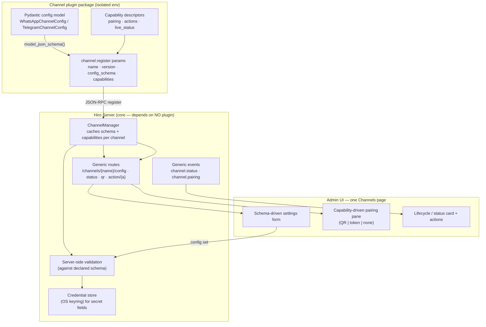
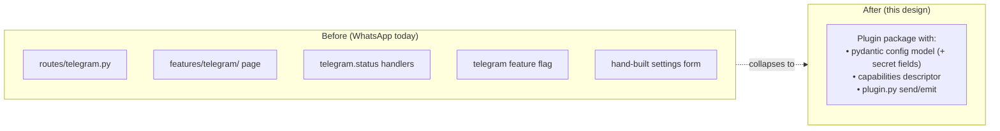

# Channel Configuration Standardization — Design

> **Scope.** A forward-looking design to make **channel configuration, onboarding, and admin
> UI generic across channels** — so the next channel (Telegram, Discord, …) ships as a
> **plugin-only package** with *no* new server routes, event handlers, or Svelte feature code.
> This is a **design / direction doc**, not an implementation plan: it fixes the contracts and
> the target shape, and leaves exact signatures to the implementation phase.
>
> **Motivation.** WhatsApp (see [`whatsapp-channel-design.md`](whatsapp-channel-design.md),
> [`whatsapp-channel-implementation.md`](whatsapp-channel-implementation.md)) shipped a
> *dedicated* admin page, `/whatsapp/*` routes, `whatsapp.qr`/`whatsapp.status` events, and a
> `whatsapp` feature flag. ~90% of that surface is already generic (it calls channel-agnostic
> Tools with the name hardcoded). Left as-is, every new channel duplicates the bespoke 10%. This
> doc removes that duplication.
>
> **Companions:** [Channel Plugins](../../hiro-docs/mintdocs/architecture/concepts/channel-plugins.mdx),
> [Channel Manager](../../hiro-docs/mintdocs/architecture/concepts/channel-manager.mdx),
> [Tools architecture](../../hiro-docs/mintdocs/architecture/misc/tools-architecture.mdx),
> [Workspace Preferences](../../hiro-docs/mintdocs/architecture/misc/preferences.mdx).
>
> **Mode:** initial development — **no backward compatibility / no migration / no wrappers**
> (repo rule, abided). `/whatsapp/*` routes and `features/whatsapp/` are **replaced**, not aliased.
>
> **Status:** Design draft. Approved in principle (all optimizations + credential-store secrets).
> Not yet implemented.

---

## 1. The one-paragraph version

Channel config already has the right **storage** (`workspace.db :: channel_plugins.config`) and
the right **generic Tools** (`ChannelConfigShowTool`/`ChannelConfigSetTool`, `hiro channel
config …`). What's missing is that the **admin surface** (routes, events, UI page, feature flag)
was built per-channel. We make it generic by having each **plugin declare its own config schema
and capabilities** at registration — the same schema→validate→auto-form method the Preferences
subsystem uses, except the schema arrives **at runtime from the plugin** instead of being
compiled into core, so core keeps depending on no channel package. Server routes become
`/channels/{name}/…`; events become `channel.status`/`channel.pairing`; the UI becomes **one
Channels page** that renders a channel's detail view from its declared schema + capabilities;
and **channel secrets** (Telegram bot token, etc.) route through the existing **credential
store** (OS keyring), never plaintext in `channel_plugins.config`.

---

## 2. Where we are today (grounded in code)

| Concern | Today | Verdict |
|---------|-------|---------|
| **Config storage** | Opaque JSON blob in `channel_plugins.config`, one row per channel ([channel_config.py:36](../hiroserver/hirocli/src/hirocli/domain/channel_config.py:36)) | ✅ Keep — right home |
| **Config Tools / CLI** | `ChannelConfigShowTool` / `ChannelConfigSetTool`; `hiro channel config <name> --set K --value V` — already channel-agnostic ([tools/channel.py](../hiroserver/hirocli/src/hirocli/tools/channel.py)) | ✅ Keep — already generic |
| **Runtime session state** | `<workspace>/channels/<name>/session.db`, `qr.png` (WhatsApp derives from `--log-dir` parent, [plugin.py:71](../hiroserver/channels/hiro-channel-whatsapp/src/hiro_channel_whatsapp/plugin.py:71)) | ✅ Promote to a **documented convention** |
| **Admin routes** | Bespoke `/whatsapp/*` with `_WHATSAPP` hardcoded ([routes/whatsapp.py](../hiroserver/hirocli/src/hirocli/admin_svelte/routes/whatsapp.py)); a second thinner `/channels/*` router exists separately ([routes/channels.py](../hiroserver/hirocli/src/hirocli/admin_svelte/routes/channels.py)) | ❌ Generalize + unify |
| **Infra events** | `whatsapp.qr` / `whatsapp.status`, cached in `ServerContext.channel_status[name]` by per-channel `InfraEventHandlers.handle_whatsapp_qr/status` | ❌ Generic `channel.status` / `channel.pairing` |
| **Config schema / validation** | None — free-form dict; UI form hand-written per channel | ❌ Plugin-declared schema |
| **Admin UI** | Dedicated `features/whatsapp/` page + nav entry + `whatsapp` feature flag | ❌ One Channels page |
| **Secrets** | Would sit **plaintext** in `channel_plugins.config` | ❌ Route through credential store |

**Two config worlds** exist in a workspace, and the split is correct: `preferences.json`
(schema-driven, pydantic, codegen'd UI, global singleton) vs `channel_plugins` (free-form dict,
a **dynamic set of rows with lifecycle**). Channel config stays out of preferences — see §4.

---

## 3. Target architecture



Core never imports a plugin. The **schema and capabilities travel over the wire** at
registration; everything downstream (validation, form, pairing pane, secret routing) is driven
by that declaration.

---

## 4. Decision: channel config does **not** move into Preferences

Tempting (schema-driven PATCH, codegen'd types, save-diffing are all nice) but wrong home:

- **Coupling.** The preferences pydantic model is compiled into `hirocli`. Plugins are
  deliberately **separate, opt-in packages in isolated envs**; `hirocli` depends on no channel.
  Putting `WhatsAppChannelConfig` in `preferences.py` means core knows every plugin's schema —
  adding Telegram edits core. That breaks the plugin isolation model (validated during WhatsApp
  P1: protobuf 7.x vs core's 6.x cannot share a venv).
- **Cardinality.** Preferences is a **global singleton document**. Channels are a **dynamic set
  of rows** with lifecycle (installed / enabled / spawned / connected / paired). `channel_plugins`
  models that; a preferences section can't.
- **Push semantics.** Channel config pushes live to the subprocess via `channel.configure`
  (`_push_config`) — a different runtime contract than preference-change reactors.

**What we borrow is the *method*, not the storage:** schema → validation → auto-generated form.
The only difference is the schema is **runtime-supplied by the plugin**, not compiled into core.

---

## 5. The optimizations

### 5.1 Plugin-declared config schema (the keystone)

> **Status: IMPLEMENTED (2026-07-12).** `ChannelInfo` gained `config_schema` +
> `capabilities`; the SDK transport ships them on `channel.register`. WhatsApp declares
> `WhatsAppChannelConfig` (pydantic, `extra="forbid"`) → `model_json_schema()`. Server:
> `ChannelManager` caches + persists the descriptor to
> `<workspace>/channels/<name>/descriptor.json` (`domain/channel_descriptor.py`);
> `ChannelConfigSetTool` coerces loosely-typed CLI/HTTP values to the declared types
> (fixes `owner_number` stored as int → str) then validates via `jsonschema`, rejecting
> unknown keys / bad types. Consuming routes + UI form = §5.3/§5.5 (not yet done).

The plugin already introduces itself via `channel.register` → `params{name, version,
description}` ([channel_manager.py:298](../hiroserver/hirocli/src/hirocli/runtime/channel_manager.py:298)).
Extend that handshake (or add a `channel.describe` RPC) to also carry:

- **`config_schema`** — JSON Schema from a pydantic model **living in the plugin package**
  (`WhatsAppChannelConfig.model_json_schema()`). Server caches it on the `_ConnectedChannel`
  record and validates writes against it. The admin UI renders a **generic schema-driven form**
  from it — the Preferences trick, schema delivered at runtime.
- **Field annotations** the form/validator honor (via pydantic `Field(json_schema_extra=…)`):
  - `secret: true` → value routes to the **credential store**, UI masks it (§5.6).
  - `title` / `description` → labels + helper text.
  - bounds / enums / defaults → input constraints, exactly like preferences fields.

**Server-side validation.** Today `ChannelConfigSetTool` writes blind. With a cached schema the
Tool validates the merged config against it and rejects unknown keys / bad types with a clear
error — closing the current "any string key is writable" gap.

**Isolation preserved:** the schema is *data on the wire*; core parses JSON Schema, never imports
the plugin's pydantic class.

### 5.2 Capability descriptors (drives the non-config UI)

> **Status: IMPLEMENTED (2026-07-12).** `hiro_channel_sdk.capabilities` defines
> `ChannelCapabilities` (pairing / actions / live_status / state_machine) + constants
> (`PAIRING_QR`, `ACTION_LOGOUT`, …). WhatsApp declares `pairing="qr"`,
> `actions=[logout, reconnect]`, `live_status=True`, and its lifecycle states. Shipped in
> the register payload and persisted in the descriptor alongside the schema. The generic
> pairing pane / action buttons that consume it are §5.5 (not yet done).

The bespoke bits that aren't config — QR pairing, logout/reconnect, live status — become
**declarative capabilities** in the registration payload, e.g.:

```jsonc
"capabilities": {
  "pairing": "qr",                     // "qr" | "token" | "oauth" | "none"
  "actions": ["logout", "reconnect"],  // generic action buttons
  "live_status": true,                 // poll status endpoint + render lifecycle
  "state_machine": ["installed","enabled","spawned","connected","paired","ready"]
}
```

The UI renders the right pane from the descriptor: WhatsApp declares `pairing: "qr"` → QR pane;
Telegram declares `pairing: "token"` → a (secret) token field + "Connect" button; a channel with
`pairing: "none"` shows neither. Actions become generic buttons that POST to
`/channels/{name}/action/{action}`.

### 5.3 Generic admin routes (unify the two routers)

> **Status: IMPLEMENTED (2026-07-12).** `routes/whatsapp.py` deleted; its endpoints
> folded into a parameterized `routes/channels.py`: `/channels/{name}/{status,pairing,
> config,install,enable,disable}` + `/channels/{name}/action/{action}` + a new
> `/channels/{name}/descriptor` (serves the §5.1/§5.2 schema+capabilities to the UI).
> enable/disable persist via the Tool **and** hot-activate via `ChannelManager`. Router
> is always-mounted (no per-channel gate); the `whatsapp` feature now only gates the UI
> nav. Frontend `api/whatsapp.ts` repointed to `/channels/whatsapp/*` — the existing page
> keeps working unchanged (full unified page = §5.5).

Collapse `/whatsapp/*` into parameterized routes and **merge** with the existing
`/channels/*` router so there's one channel surface:

| Generic route | Replaces | Backed by |
|---------------|----------|-----------|
| `GET /channels/{name}/config` | `GET /whatsapp/config` | `ChannelConfigShowTool` |
| `POST /channels/{name}/config` | `POST /whatsapp/config` | `ChannelConfigSetTool` (+ schema validation) |
| `GET /channels/{name}/status` | `GET /whatsapp/status` | `ServerContext.channel_status[name]` (already name-keyed) |
| `GET /channels/{name}/pairing` | `GET /whatsapp/qr` | status cache (`qr` / token challenge) |
| `POST /channels/{name}/{enable,disable}` | both `/whatsapp/*` and `/channels/*` variants | Enable/Disable Tool **+** `ChannelManager.activate/deactivate` |
| `POST /channels/{name}/install` | `POST /whatsapp/install` | `ChannelInstallTool` |
| `POST /channels/{name}/action/{action}` | `/whatsapp/{logout,reconnect}` | `send_event_to_channel(name, f"channel.{action}", …)` |

Bodies barely change — they already call generic Tools; only the hardcoded `_WHATSAPP` becomes a
path param. Per no-backward-compat, `/whatsapp/*` is deleted outright.

### 5.4 Generic event contract

> **Status: IMPLEMENTED (2026-07-12).** `whatsapp.qr`/`whatsapp.status` →
> `channel.pairing`/`channel.status`; `whatsapp.logout`/`whatsapp.reconnect` →
> `channel.logout`/`channel.reconnect` (via `/action/{action}`). `ChannelManager` injects
> the emitting channel's name into every event's data, so `InfraEventHandlers` has ONE
> `handle_channel_pairing` + `handle_channel_status` pair keyed by channel (was
> per-channel). `pairing` carries a `kind` (`qr`/`token`/…) so the UI renders the right
> pane. `ServerContext.channel_status` was already name-keyed — unchanged.

Replace `whatsapp.qr` / `whatsapp.status` with **`channel.pairing`** / **`channel.status`** (the
channel name is already known from the emitting plugin's connection). `InfraEventHandlers` gets
**one** pair of handlers for all channels instead of per-channel `handle_whatsapp_*`;
`ServerContext.channel_status` is already keyed by name and needs no change. Pairing payloads
carry a `kind` (`"qr"` | `"token"` | …) so the UI knows how to render.

### 5.5 One Channels page (retire per-channel pages)

> **Status: IMPLEMENTED (2026-07-12).** Channel management folded into the existing
> **Channels & Devices** page: each row has a **Manage** button opening a generic detail
> view (`ChannelDetail.svelte`) built from the channel's `/channels/{name}/descriptor` —
> a **Connection card** (status badge + capability-driven pairing pane, QR/token/none +
> action buttons from `capabilities.actions`), and a **schema-driven Settings form**
> (`SchemaConfigForm` from `fieldsFromSchema`, secret fields masked with a Clear action).
> `features/whatsapp/`, its route, the nav entry, and the `whatsapp` feature flag are
> **deleted**. Verified live: WhatsApp's whole page reproduced with zero channel-specific
> UID. **Deviation from the sketch:** no new `channels_management` flag — the Channels &
> Devices page is already core/ungated, so a per-feature flag was unnecessary machinery.
> (Install-from-UI not surfaced — parity with the old page; stays CLI.)

Fold channel management into the existing **Channels & Devices** page (nav gets unmanageable
otherwise: WhatsApp, Telegram, Discord…). The page lists installed/available channels; selecting
one opens a **detail view composed of generic building blocks**:

- **Lifecycle / status card** — from `channel.status` + declared `state_machine`.
- **Schema-driven settings form** — from `config_schema` (§5.1), secret fields masked.
- **Capability-driven pairing pane** — QR vs token vs none (§5.2).
- **Action buttons** — from `capabilities.actions`.

One feature flag (`channels_management`) for the whole feature, **not one per channel**. The
per-channel `whatsapp` flag, `features/whatsapp/` page, and dedicated nav entry are removed. Keep
a documented **escape hatch** for a genuinely bespoke pane, but reach for it only when a
capability descriptor truly can't express the need.

### 5.6 Channel secrets → credential store (approved)

> **Status: IMPLEMENTED (2026-07-12).** Secret plumbing built (no WhatsApp secret today
> — exercised by Telegram next). A schema field `Field(json_schema_extra={"secret": True})`
> ⇒ `secret_keys(schema)` routes it away from `channel_plugins.config`: the value goes to
> the OS keyring via `ChannelSecretStore` (service `hiroleague:{workspace_id}:channel:
> {name}`, shared low-level `keyring_secrets` helper), and the config row keeps only a
> `SECRET_MARKER` sentinel. `ChannelConfigSetTool` branches on secret keys (unset ⇒ keyring
> delete); validation excludes secret fields (their stored form is a marker, not the
> value). `ChannelManager._push_config` calls `resolve_channel_secrets` to swap markers →
> real values just before the push; `GET /config` returns only the marker, so the value is
> never echoed. Chosen **sibling `ChannelSecretStore`** (not reusing provider `CredentialStore`)
> sharing the hoisted keyring helper — resolves the §5.6 open sub-question.

Telegram's first config key is a **bot token** — a secret. It must **not** live plaintext in
`channel_plugins.config`. Route it through the existing per-workspace **credential store**
([credential_store.py](../hiroserver/hirocli/src/hirocli/domain/credential_store.py)): secrets in
the **OS keyring**, non-secret metadata in a JSON doc.

Design:

- **Schema marks secrets.** A `Field(json_schema_extra={"secret": True})` in the plugin's config
  model. The server sees `secret: true` in the JSON Schema and diverts that field.
- **Storage split (mirrors providers).** The secret value goes to the keyring under a
  channel-namespaced service key — extend `_service_name` with a channel namespace, e.g.
  `hiroleague:{workspace_id}:channel:{name}:{field}` (parallel to the current
  `hiroleague:{workspace_id}:{provider_id}`). `channel_plugins.config` stores **only a reference/
  presence marker** (e.g. `"bot_token": {"secret_ref": "channel:telegram:bot_token"}`), never the
  value.
- **Push-time resolution.** When `ChannelManager._push_config` sends `channel.configure`, it
  **resolves secret refs to real values** from the keyring just before the push, so the plugin
  receives usable config over the (local, trusted) transport but the value never persists in the
  DB. Same as how providers resolve `get_api_key` at call time.
- **UI.** Secret fields render as masked inputs showing "•••• set" / "not set"; saving a new
  value calls a set-secret path (write-only, never echoed back on `GET /config`).

Open sub-question for implementation: whether to **reuse `CredentialStore`** with a channel
namespace (least new code, but it's currently provider-catalog-shaped — `provider_id`,
`auth_method`, `account_id`) or add a **sibling `ChannelSecretStore`** sharing the same keyring
backend + `providers.json`-style metadata doc. Leaning **sibling store, shared keyring helper**
(move the keyring get/set/delete into `hiro-commons` per the common-utility rule) — keeps the
provider store's semantics clean while reusing the proven mechanism.

### 5.7 Standardize the on-disk convention

Promote to a documented contract in the channel-plugins mintdocs page:

- **Per-channel state dir:** `<workspace>/channels/<name>/` — session DBs, QR PNGs, any plugin
  scratch. WhatsApp already does this; make it the rule. **Never** `~/.hiro/...`.
- **Config:** `channel_plugins.config` (non-secret) + credential store (secret). Never elsewhere.
- **Session ≠ config:** session/link state is runtime state under the state dir; config is the
  schema-validated row. Deleting the state dir = "log out"; it never touches config.

---

## 6. What each new channel costs (the acceptance test for this design)



**Telegram is the proof:** it should require **zero** new admin routes, **zero** new infra event
handlers, and **zero** new Svelte feature code — only a plugin package declaring a schema +
capabilities. If it needs more, the generalization is incomplete.

---

## 7. Suggested sequencing (when we implement)

Each step is independently shippable; WhatsApp keeps working throughout.

| Step | What | Risk | Notes |
|------|------|------|-------|
| **1. Generalize routes + events** | `/channels/{name}/*`; `channel.status`/`channel.pairing`; one `InfraEventHandlers` pair; merge the two routers | Low — pure refactor | WhatsApp switches to generic routes; delete `/whatsapp/*` |
| **2. Schema handshake** | Config pydantic model **in the plugin**; `config_schema` + `capabilities` in `channel.register`; server caches + validates | Med — wire contract change | Isolation preserved (schema is data) |
| **3. Credential store for secrets** | `secret: true` fields → keyring; refs in `config`; resolve at `_push_config`; masked UI | Med | Move keyring helper to `hiro-commons`; sibling `ChannelSecretStore` (§5.6) |
| **4. Unified Channels page** | Schema-driven form + capability pairing pane on Channels & Devices; retire `features/whatsapp/`, per-channel flag, nav entry | Med — UI | Escape hatch kept but discouraged |
| **5. Telegram** | New plugin package only — validates the whole design | — | Zero new routes/events/UI = success |

Per repo rules: use the **Tools Architecture** for any new operation (CLI/HTTP/UI over one Tool);
add **code comments explaining the reason** for non-obvious changes; **human-first structured
logging**; shared helpers to **hiro-commons**; update **mintdocs** (channel-plugins page +
first-time-setup if provisioning changes) per the document-executed-plans rule.

---

## 8. Open questions (defer to implementation)

1. **Register vs describe.** Fold `config_schema`/`capabilities` into `channel.register`, or add a
   separate `channel.describe` RPC the server calls after register? (Register is simpler; describe
   decouples schema fetch from connection.)
2. **Secret store shape.** ~~Reuse `CredentialStore` vs a sibling `ChannelSecretStore`.~~
   **Resolved (§5.6):** sibling `ChannelSecretStore` sharing the hoisted `keyring_secrets`
   helper; `CredentialStore` left untouched to preserve its provider-scoped logging.
3. **Live schema changes.** If a plugin upgrade changes its schema, how does a config saved
   against the old schema reconcile? (Validate-on-load, surface drift in the UI — likely just
   "unknown key" warnings given no-migration mode.)
4. **Escape hatch boundary.** Exact mechanism for a channel that needs a bespoke pane the
   capability descriptors can't express (custom Svelte component keyed by channel name), and how
   hard to discourage it.

---

## 9. TL;DR

- **Keep** the storage (`channel_plugins.config`) and the generic config **Tools/CLI** — those
  were already right. **Don't** move channel config into Preferences (would couple core to every
  plugin's schema and break plugin isolation); **do** steal the Preferences *method*
  (schema→validate→auto-form).
- **Keystone:** plugins **declare their own config schema + capabilities** at registration; the
  schema travels as **data on the wire**, so core validates and the UI renders **generically**
  without importing any plugin.
- **Generalize the admin surface:** parameterized `/channels/{name}/*` routes (merging the two
  routers), generic `channel.status`/`channel.pairing` events (one handler pair), **one Channels
  page** with schema-driven form + capability-driven pairing pane, **one** feature flag.
- **Secrets** (bot tokens, etc.) route through the existing **credential store** (OS keyring) —
  refs in config, values resolved at `_push_config`, masked in UI. Never plaintext in the DB.
- **Disk convention:** `<workspace>/channels/<name>/` for state, `channel_plugins.config` +
  keyring for config; never `~/.hiro`.
- **Proof of success:** **Telegram** lands as a **plugin-only package** — zero new routes, events,
  or Svelte feature code.
- **Sequencing:** routes/events refactor → schema handshake → secrets → unified page → Telegram.
- **Open:** register-vs-describe, secret-store shape, schema-drift reconciliation, escape-hatch
  boundary.
