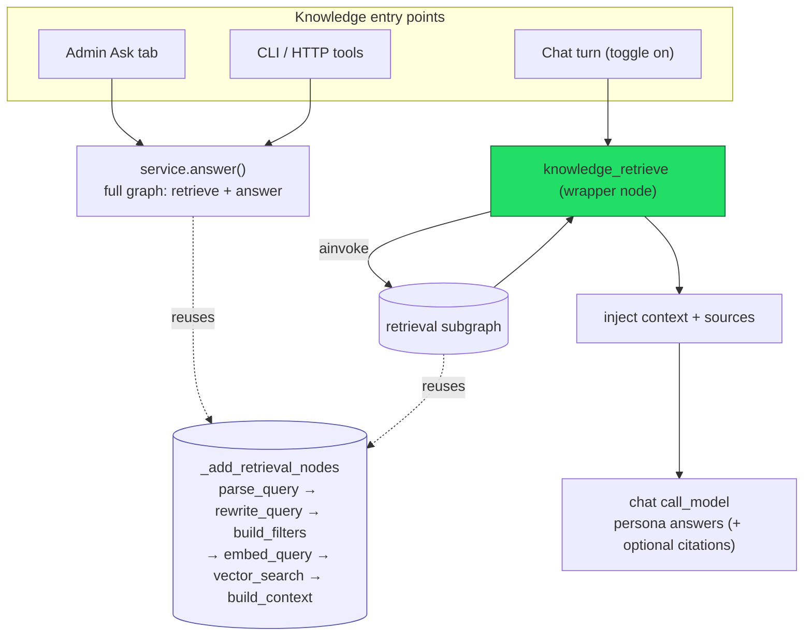
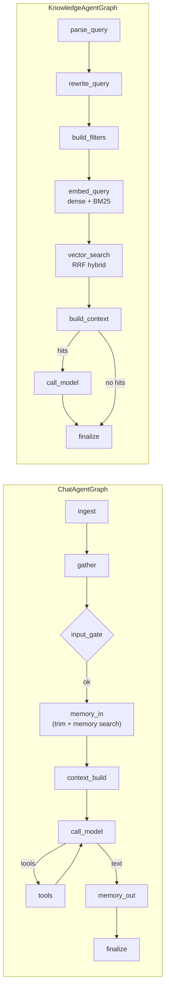
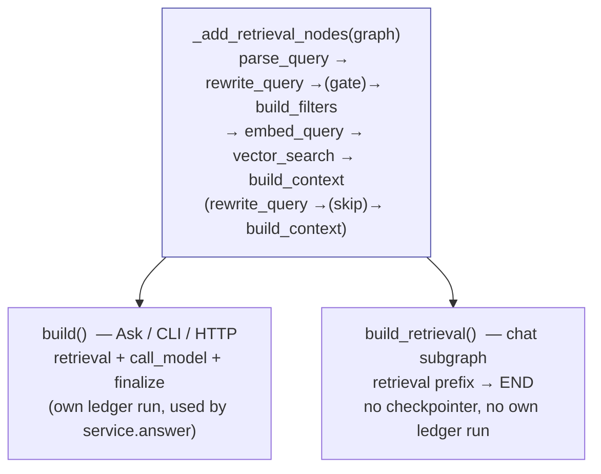
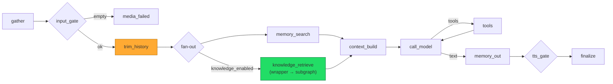
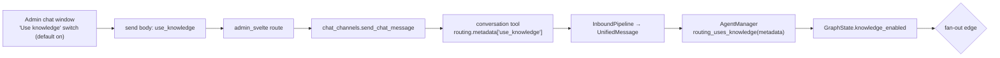
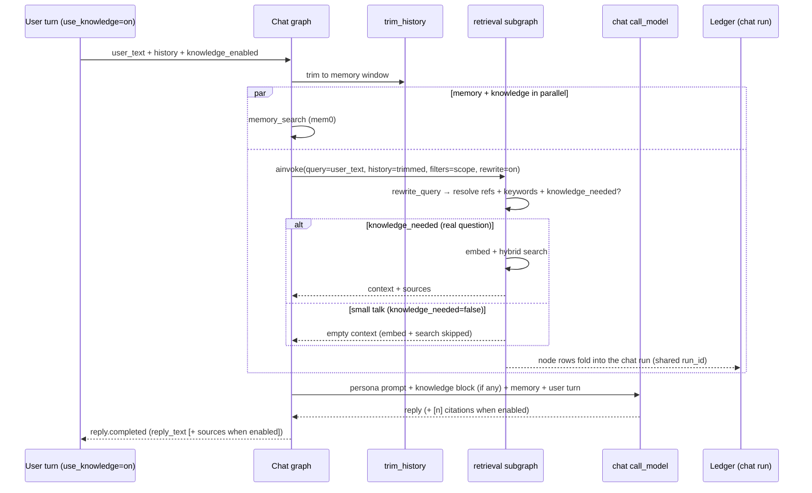
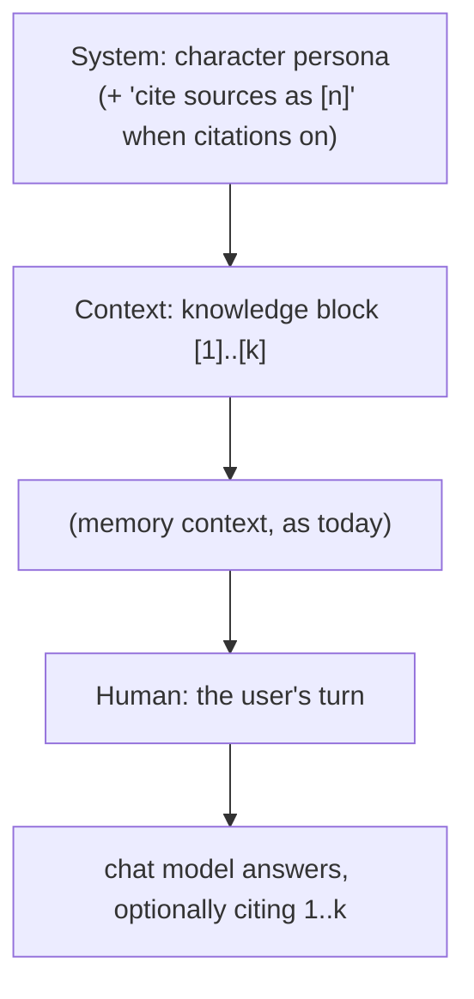
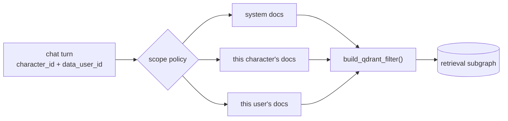

# Chat ↔ Knowledge: Subgraph Integration

**Status:** ✅ implemented.
**Decision:** knowledge retrieval is integrated into the chat agent as a **LangGraph subgraph**,
reusing the existing knowledge-graph nodes (including the **query-rewrite** node, which doubles as
the retrieve/skip **gate** — see §8). A per-message **toggle** (default on) controls it, communicated
exactly like voice replies.
**Repo rule:** *no-backward-compatibility* mode — the refactor changed graph shapes and added state
keys with **no shims, no migration**. After pulling, **restart the workspace server** to load the new
chat graph. The new top-level `chat.*` preferences are additive (pydantic defaults) — no migration.

---

## 1. Goal & principles

When a user talks to a character, the assistant should pull **relevant context** from the
workspace knowledge base — using the *same* retrieval pipeline the Admin "Ask" tab uses (hybrid
dense + BM25, RRF fusion, Arabic normalization, structural context, **and the history-aware query
rewrite**) — then answer **in the character's voice, with full conversation context**.

> Note on wording: the job is to **find and inject relevant context**, not to "ground" / verify the
> model's output. The doc uses *retrieval / relevant context* throughout.

| Principle | What it means here |
|---|---|
| **Reuse, don't fork** | The chat path reuses the knowledge graph's retrieval nodes verbatim — including `rewrite_query`. One implementation, two graph shapes. |
| **One answering model** | The **chat** model writes the reply. Retrieval only *feeds* it context; no second answering LLM. |
| **History lives on the chat side, query rewriting stays in the knowledge graph** | The chat graph hands the (trimmed) conversation history to the knowledge subgraph; the **`rewrite_query` node** turns it into a standalone, reference-resolved query. |
| **Scope is server-enforced** | Owner/category filters come from the chat turn's identity, never from the LLM. |

---

## 2. High-level design

Everything hangs off **one reusable retrieval subgraph** extracted from `KnowledgeAgentGraph`.
Ask/CLI keep the full graph (retrieve **and** answer); chat reuses only the retrieval prefix and
lets the character answer.



The blue box is the **single source of truth** for retrieval, including the rewrite node.

---

## 3. Where we are today

Two independent LangGraphs sharing the same `BaseAgentGraph` plumbing (ledger, events,
`graph_logged` wrapping) but not referencing each other. Only `service.answer()` builds the
knowledge graph, as a **standalone run**.



---

## 4. Refactor: one knowledge graph, two shapes

Split node *wiring* from graph *shape* with a private helper, so retrieval logic (rewrite included)
has exactly one implementation (common-utility rule — no duplication).



The retrieval prefix branches after `rewrite_query` (`_route_after_rewrite`): `knowledge_needed=False`
routes straight to `build_context`, bypassing `build_filters` / `embed_query` / `vector_search` (see §8).

- `build()` keeps today's Ask/CLI/HTTP path unchanged.
- `build_retrieval()` compiles `START → …retrieval… → build_context → END`.
- The retrieval nodes already prefer state over prefs (`vector_search` reads `state["top_k"]`/
  `state["min_score"]`; `embed_query` appends `state["rewrite_keywords"]`; `build_filters` consumes
  `state["filters"]`; `rewrite_query` runs when `state["rewrite"]` is truthy). So the chat path
  drives every knob **through the subgraph's initial state** — see §8 for the one node change
  (history-aware rewrite).

---

## 5. The extended chat graph

Two structural changes:

1. **Split `memory_in`** into an earlier shared **`trim_history`** node + a **`memory_search`**
   node. Trimming must happen *before* knowledge, because the knowledge query rewrite consumes the
   conversation history — so it must see the *same* trimmed window memory does.
2. After trimming, **fan out in parallel** to `memory_search` (always) and `knowledge_retrieve`
   (only when the per-message toggle is on). Both join at `context_build`.



- `memory_search` and `knowledge_retrieve` read the trimmed `messages`; neither writes `messages`
  (memory writes `retrieved_memories`, knowledge writes `knowledge_context`/`knowledge_sources`), so
  the parallel branches can't conflict. `context_build` appends the new user turn afterward.
- `knowledge_retrieve` is a **wrapper node** that calls `retrieval_subgraph.ainvoke(...)` and maps
  the result back into chat state. (Why a wrapper, not `add_node`/`Send`: the chat and knowledge
  state schemas barely overlap; a wrapper keeps retrieval scratch out of the checkpoint, gives full
  knob control, and propagates the ledger + custom stream via the inherited runnable config.)

### 5.1 The per-message toggle (mirrors voice replies)

The toggle is **per message, default on**, sent with the message in `routing.metadata` — the same
mechanism as `request_voice_reply`. The user flips it in the admin chat window before each send.



Files to touch (each mirrors an existing `request_voice_reply` site):

| File | Voice today | Knowledge (new) |
|---|---|---|
| `admin_svelte/schemas.py` | `request_voice_reply: bool = False` | `use_knowledge: bool = True` |
| `admin_svelte/routes/chat_channels.py` | passes `request_voice_reply` | passes `use_knowledge` |
| `admin/features/chat_channels/service.py` | `send_chat_message(..., request_voice_reply)` | `..., use_knowledge=True` |
| `tools/conversation.py` | sets `meta["request_voice_reply"]` | sets `meta["use_knowledge"]` (always, so default-on is explicit) |
| `runtime/comm_log.py` | `routing_requests_voice_reply()` → `is True` | `routing_uses_knowledge()` → **absent = True**, explicit `False` = off |
| `runtime/agent_manager.py` | reads into `request_voice_reply` | reads into `knowledge_enabled` |
| `runtime/agent_graph/state.py` | `request_voice_reply: bool` | `knowledge_enabled: bool` |
| admin Svelte chat page | voice-reply switch | "Use knowledge" switch (default on) |
| `commands/message.py` (CLI, optional) | `--voice-reply` | `--knowledge/--no-knowledge` |

Because the toggle is a **runtime state flag**, the graph *shape* never changes → **no
compiled-graph-cache impact**.

### 5.2 One turn, end to end



---

## 6. State at the boundary (inputs vs outputs)

**Subgraph INPUTS** (set by `knowledge_retrieve` from chat state):

| Subgraph input | Sourced from |
|---|---|
| `query` | raw `user_text` (the subgraph's `parse_query` normalizes it) |
| `history` | trimmed prior `messages` (formatted) — **the new input that makes rewrite reference-aware** |
| `rewrite` | **`True`** — we use the rewrite node we built |
| `filters` | **server-injected** scope from `character_id` / `data_user_id` |
| `top_k`, `min_score` | the workspace `knowledge.retrieval.*` prefs, as-is |
| `inbound_id`, `chat_channel_id`, `character_id`, `user_id` | copied so ledger rows carry identity **and fold into the chat run** |

**Subgraph OUTPUTS** (mapped back into chat state):

| Chat `GraphState` key | From subgraph | Meaning |
|---|---|---|
| `knowledge_context: str \| None` | `context` | the `[n]`-numbered block the chat model reads |
| `knowledge_sources: list[KnowledgeSource]` | `sources` | for citations + UI source list |

`standalone_query`, `keywords`, and `knowledge_needed` are produced **inside** the subgraph by
`rewrite_query` — they are *not* chat-boundary state. New chat-side input key: `knowledge_enabled: bool`.

---

## 7. How the retrieved knowledge enters the chat prompt

> **Superseded by [context-assembly.md](context-assembly.md).** Knowledge (and memory + citation)
> are now assembled into an **ephemeral `system_context`** by the `compose_context` node, so they
> never enter the durable `messages` history. `context_build` stores only the clean user turn. The
> shape below still describes *what* the model sees; *where* it's assembled changed.

Two touch-points, mirroring how **memory** already flows:

**(a) `context_build` injects a context block.** `build_context()` already emits exactly this shape:

```
[1] Refund Policy §Returns
Customers may return items within 30 days...

[2] Refund Policy §Exceptions
Final-sale items are not eligible...
```

It goes into the model input as a **dedicated context segment** — separate from the user's words, so
source text isn't confused with the user's message and `[n]` maps cleanly to the source list.

**(b) `call_model` adds a citation instruction** *only when* `knowledge_sources` is non-empty **and**
the knowledge citations preference is on (§9). What the chat model receives:



Invariant: the `[n]` in the block **===** `ref` in `knowledge_sources`, so inline citations and the
UI source list stay in sync.

---

## 8. The rewrite node: history-aware reformulation **and** retrieve/skip gate

The `rewrite_query` node does three jobs in its single (already-paid-for) structured-output call:
**(1)** normalize + resolve references, **(2)** extract literal keywords for BM25, **(3)** decide
whether retrieval is needed at all. We **reuse the existing node** rather than inventing a chat-side
reformulator or a separate gate model.

**History-aware reformulation** — resolves *"the second one"* / *"his brother"*:

- `KnowledgeAgentState` gains an optional `history` field. When present (chat), `rewrite_query`
  includes the trimmed conversation so the LLM emits a **standalone** query, plus **keywords**
  (proper nouns) that reinforce the BM25 branch.
- The prompt (`DEFAULT_KNOWLEDGE_REWRITE_PROMPT`) carries a conditional reference-resolution clause —
  a no-op when no history is supplied (Ask).

**Retrieve/skip gate** — `QueryRewrite.knowledge_needed: bool` (default `True`):

- The model sets it **false** for greetings, farewells, thanks, acknowledgements, and pure small
  talk; **true** otherwise.
- `_route_after_rewrite` reads it: **only an explicit `False` skips** (`→ build_context`, bypassing
  embed + search). Absent/`True` — rewrite off, no LLM, or a parse failure — **retrieves** (safe
  default).
- **Cost note:** the rewrite call still runs (it *is* the decider). The skip saves the vector search
  and, more importantly, avoids injecting irrelevant chunks into the answer prompt. A truly free skip
  for "hi" would need a cheap heuristic pre-gate ahead of the subgraph — deferred.

The same node now serves **both** callers:

| Caller | `history` | `rewrite_query` behaves as |
|---|---|---|
| Ask / CLI | absent | normalize + keyword extraction (unchanged when rewrite is off) |
| Chat | trimmed conversation | normalize + **reference resolution** + keyword extraction + **gate** |

**Ask interaction (note):** because the gate lives in the shared retrieval prefix, an Ask query with
rewrite **on** that the model marks `knowledge_needed=False` will skip retrieval **and** the answer
LLM (`build_context` → `no_results` → `finalize`), returning "no results". Default Ask is unaffected
(rewrite is opt-in there). If Ask should always answer, scope the gate to chat with a one-line guard.

So: **rewrite is on in chat**, **keywords are generated by the node**, and history-aware querying is
owned by the knowledge graph's rewrite node — fed history by the chat side.

---

## 9. Handling the knobs

| Knob (`knowledge.*`) | Chat handling |
|---|---|
| `retrieval.top_k` / `min_score` | **Use the prefs values as-is**, passed into the subgraph. If 20 is too many for a chat prompt, change it in preferences (applies everywhere); the Ask tab can override per-query in its filters. |
| `retrieval.hybrid`, `sparse_model`, `prefetch_limit` | Reuse as-is (read live by the retrieval nodes). |
| `chunking.embed_structural_context` | Ingest-time; N/A at query. |
| `rewrite.prompt`, `rewrite.default_on` | **Rewrite is on in chat** (history-aware, §8). `default_on` still seeds the Ask toggle; the prompt may get a chat-aware variant for reference resolution. |
| `answering.model` | Unused in chat — the chat model answers. |
| `answering.cite_sources`, `language_policy` | Ask-only (they configure the knowledge graph's *own* answerer, which chat doesn't invoke). See the chat equivalents below. |
| **`chat.cite_sources`** *(top-level pref, default off)* | When on, inject the citation instruction (§7b) **and** surface `knowledge_sources` to the client. Lives under top-level `chat` (with `chat.instructions`), surfaced in the Admin → Preferences → Agent tab. |
| **`chat.preferred_answering_language`** *(new, later)* | No per-character language exists today. v1 sends **English** as a placeholder (or leaves it to persona); a real preferred-language setting overrides later. |
| `filters` (owner/category/tags) | **Server-injected** from chat identity — never LLM-supplied. v1 = all owners visible (system + character + user); tightening is an optional later step (§12). |
| `explain` | Off in chat. |

---

## 10. Cross-cutting concerns

**Ledger consolidation (one turn = one cost total).** `service.answer()` opens its own ledger run,
and `fold_row` ignores rows whose `run_id` differs. So the chat subgraph runs **without its own
ledger-run config** — its `_wrap_dynamic_node`-wrapped nodes inherit the chat `run_id` (via the
`current_run` fallback in `_resolve_ledger_identity`) and **fold into the chat turn's totals**.

**Streaming.** `.ainvoke()` inside `knowledge_retrieve` inherits the chat run's runnable config, so
the subgraph's `graph.llm.usage` events still reach `AgentManager`'s `custom` stream and the ledger.
*(Verify in a smoke test: per-node `updates` visibility for the subgraph would need `subgraphs=True`
on the chat `astream`; custom events + the ledger do not.)*

**No subgraph checkpointer.** Retrieval is ephemeral per turn — `build_retrieval()` compiles without
a checkpointer, so vectors/hits never enter the chat thread's SQLite checkpoint.

**Compiled-graph cache.** The toggle is a runtime flag → no recompile. Per-turn knobs are read at
node runtime → no recompile.

**Service liveness.** The subgraph reads `self._service`/`self._prefs` off a `KnowledgeAgentGraph`
instance that `AgentManager` builds from `ctx.knowledge_manager.service`. On embedder/prefs swaps,
add a live-setter (mirroring `set_stt_service`) or rebuild the subgraph.

**Scope / privacy.** `knowledge_retrieve` derives `filters` from the turn's identity, not the LLM:



**Citation bridge.** When `chat.cite_sources` is on, `graph.reply.completed` (and its persistence)
carry `knowledge_sources` alongside `reply_text`, so chat citations render like the Ask UI.

**Empty / absent corpus.** No `knowledge_manager`, or zero documents → `knowledge_retrieve` returns
empty and `context_build` proceeds without a knowledge block.

---

## 11. What this looks like in the admin UI (graph runs)

The graph-runs reader groups by `run_id`: the **list** shows one row per run (`row_kind=run`);
**inspect** shows the node timeline (`row_kind=node`, by `step_index`) plus the `@run` aggregate.

Because the subgraph folds into the chat run:

| | Subgraph (this design) | Today's standalone `answer()` |
|---|---|---|
| Runs **list** | **One** consolidated chat-turn line | **Two** lines (separate knowledge run, linked by `inbound_id`) |
| **Inspect** | Knowledge steps inline in the chat timeline | Separate run |
| Node names | `knowledge/parse_query`, `knowledge/rewrite_query`, `knowledge/embed_query`, `knowledge/vector_search`, `knowledge/build_context` — distinguishable by the `knowledge/` prefix | same names, separate run |
| `@run` cost | Folded into the **chat turn** total | Separate total |
| LangSmith | Same trace, knowledge nodes as children | Separate trace |

**You'll see it consolidated** — one chat-run line; knowledge steps as extra rows inside that run's
timeline. It is **not** a new graph/run kind. **Admin graph_runs code: no changes** (it already
groups by `run_id`). The only rule is on the chat side: invoke the subgraph **without** its own
ledger run. *(Pending your further input on the admin presentation.)*

---

## 12. Optional later steps (not v1, but noted)

- **Scope tightening.** v1 shows all owners; later, restrict to a policy (e.g. system + character +
  user only). Subgraph stays the main path; this is just a filter change.
- **Knowledge as an additional tool caller.** For agentic "research" characters, expose a tool that
  wraps the *same* subgraph (LLM-decided, multi-hop). Subgraph remains the engine; the tool is one
  more caller alongside Ask/CLI/chat-node. Subgraph-via-node stays the default.

---

## 13. Open decisions (remaining)

- **Admin-UI ledger presentation** (§11) — you'll weigh in later.
- **Chat rewrite prompt** — extend `DEFAULT_KNOWLEDGE_REWRITE_PROMPT` with a history section, or add
  a chat-specific rewrite prompt preference?

Settled in discussion: toggle = per-message, default on (§5.1); memory + knowledge parallel after a
shared `trim_history` (§5); rewrite **on** and history-aware (§8); citations = `chat.cite_sources`,
default off (§9); top_k/min_score from prefs as-is (§9); language = English placeholder for now (§9);
scope = all owners for v1, tightening optional (§12).

> **Context assembly note.** Memory + knowledge + citation are no longer injected by `context_build`;
> they are assembled by a `compose_context` node and injected into the **current user turn** (persona
> stays a stable system message). Knowledge renders as `<source rank doc section score>` tags with
> structural Markdown neutralized (headers → bold, rules removed). General answering guidance lives in
> the editable `chat.instructions` pref. See [context-assembly.md](context-assembly.md).

---

## 14. Implementation sequencing

1. Refactor `KnowledgeAgentGraph` → `_add_retrieval_nodes` + `build()` + `build_retrieval()`.
2. Make `rewrite_query` history-aware (`history` in `KnowledgeAgentState`; prompt update) — §8.
3. Add chat state keys: `knowledge_enabled`, `knowledge_context`, `knowledge_sources` (§6).
4. Split `memory_in` → `trim_history` + `memory_search`; add `knowledge_retrieve`; wire the parallel
   fan-out with the toggle conditional (§5).
5. Per-message toggle plumbing across the 9 sites in §5.1 (mirror `request_voice_reply`), incl. the
   admin chat switch (default on).
6. `AgentManager`: build the retrieval subgraph from `ctx.knowledge_manager.service`; inject scope
   filters; handle absent/empty corpus.
7. Context injection via `compose_context` (tagged/neutralized knowledge + memory + instructions) +
   citation instruction, gated on `chat.cite_sources` (§7, §9; see context-assembly.md).
8. Citation bridge: carry `knowledge_sources` on `graph.reply.completed` + persistence (when on).

---

## 15. Eval harness

A multi-turn loop is hard to eyeball — especially for Arabic. Before tuning, hand-curate **10–20
`(history, follow-up question → expected source)` pairs** and run them through the chat path, so
rewrite reference-resolution and retrieval recall are *measured*, not guessed.
