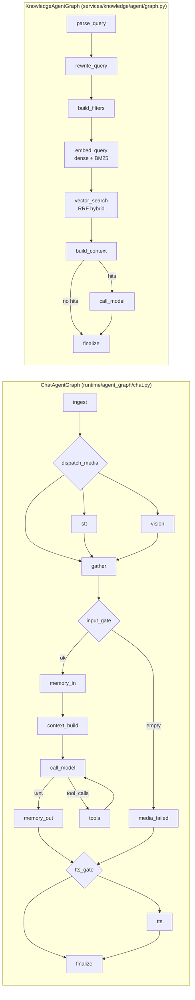
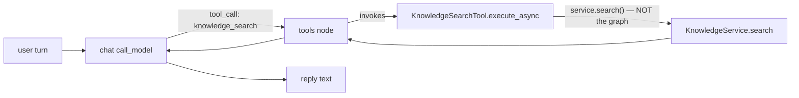
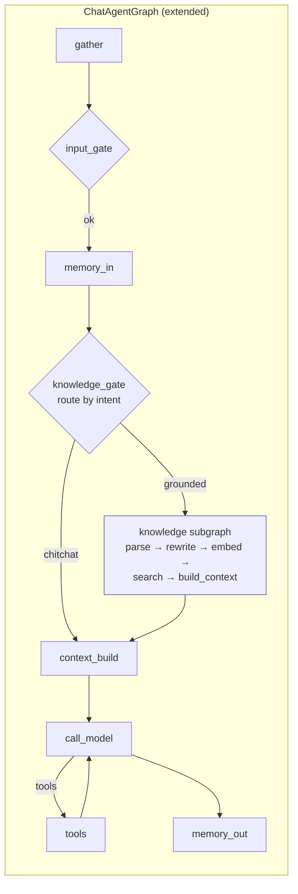
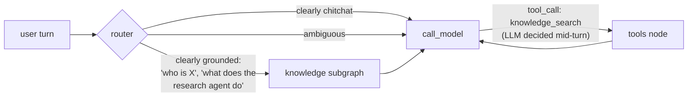

`KnowledgeSearchTool` and `KnowledgeAnswerTool` don't set `agent_default = False`, so they're already wired into the chat agent's toolbelt by default. That's a critical fact. Now I have everything I need.

I have a clear picture. Here's my review and integration recommendation.

---

## Where things stand today

The chat graph (`runtime/agent_graph/chat.py`) and the knowledge graph (`services/knowledge/agent/graph.py`) are **two independent LangGraphs** that already share the same `BaseAgentGraph` (services, ledger, event emission, `graph_logged`). They don't know about each other yet at the **graph** level — but the chat graph is *already* able to call knowledge **as a tool**, because:

- `tools/knowledge.py` defines `KnowledgeSearchTool` and `KnowledgeAnswerTool`
- Neither sets `agent_default = False` (compare `KnowledgeDeleteDocumentTool` which does)
- `agent_manager._langchain_tools_for_agent()` calls `reg.agent_tools()` and binds them via `model.bind_tools(tools)` inside `make_call_model_node`

So the chat LLM can already emit a `tool_call` for `knowledge_search` / `knowledge_answer` and the existing `tools` node executes it. That's the **path of least resistance** and a real, working integration — but it's not the only option, and (per the doc's §6 *"once knowledge runs inside a chat, queries that reference earlier turns…"*) it's not the strongest one.

### Today's two graphs side-by-side

---

## Three integration shapes

These aren't mutually exclusive — option A is shipping, B is the real integration the doc calls for, C is the long-term cleanup.

### A — Tool-call (already working, do nothing)

**What it gives you:** the LLM decides when knowledge is needed; zero new graph wiring.
**What it costs you:** the tool calls `service.search()` directly, **bypassing the knowledge graph** entirely — so you lose `parse_query` (Arabic alef-fold, langdetect), `rewrite_query` (the opt-in LLM cleanup added in the latest doc bullet), the `build_context` citations, and the per-node ledger rows. The chat LLM also has no mechanism to pass conversation history to the rewrite step. It's a recall path, not the rewrite path the doc Status §4 was scoped for.

### B — Subgraph: the chat graph **invokes the knowledge graph** as a node (recommended)

This is what the doc actually outlines under §1.3 of the *Query rewriting* note ("In chat it would default on (reference resolution is required there)"). The chat graph adds a router that decides "this turn needs grounded knowledge", runs the knowledge graph's compiled `StateGraph` as a subgraph, and feeds its `sources` + `answer` back into `context_build` before `call_model`.

How it concretely wires:

1. `KnowledgeAgentGraph.build()` already returns a `CompiledStateGraph` — that's exactly what LangGraph calls a "subgraph". You can `add_node("knowledge", knowledge_graph)` directly in `ChatAgentGraph.build()`.
2. State bridging: `KnowledgeAgentState` keys (`query`, `filters`, `top_k`, `min_score`, `rewrite`, `inbound_id`, `chat_channel_id`, `character_id`) are already a strict subset of what the chat `GraphState` carries — just map them at the boundary (or use a shared parent state schema; LangGraph supports both).
3. The doc's "rewrite must default ON in chat" lands cleanly here: the chat router sets `state["rewrite"] = True` when calling the subgraph and forwards the prior turns so `rewrite_query` can do **reference resolution** (the only piece that's a no-op in Ask).
4. `build_context` already returns `sources` + `context`. Plumb `context` into `context_build_node` as additional message content (or as a new `KnowledgeContext` block in `GraphState`), then `call_model` answers with the chat persona while citing the knowledge sources.

What you give up vs. tool-call: the LLM no longer "decides" — but a tiny **router** node (literal-keyword or zero-shot classifier) is cheaper, more predictable, and ledger-able, and you can keep the knowledge tool registered for cases where the LLM *does* want to drill in mid-tool-loop.

### C — Hybrid: router-first, tool fallback (long term)

Most production RAG-in-chat systems land here:

This keeps the deterministic path for the obvious cases (cheap, traceable, gives `rewrite_query` history to resolve references) and keeps the LLM-driven escape hatch for ambiguous turns or multi-tool reasoning.

---

## Concrete next steps if you take **option B**

1. **Lift `KnowledgeAgentState` to a shared shape.** Right now it constructs its own `StateGraph(KnowledgeAgentState)`. Either (a) make the chat graph pass `query`/`filters` via `Send` payloads (no state-schema change needed; chat state stays clean), or (b) widen `GraphState` with optional `knowledge_sources`/`knowledge_context`/`knowledge_answer` keys and have `KnowledgeAgentGraph` accept that schema. (a) is lower-blast-radius.
2. **Add `knowledge_gate` to `ChatAgentGraph`** — between `memory_in` and `context_build`. Implement it as a tiny structured-output LLM call **or** start with a deterministic heuristic (e.g. `@knowledge` mention, character flag, or chat-channel preference) so you don't add a model hop on every turn before the data shows it's worth it.
3. **Pass conversation history into `rewrite_query`.** This is the *one* feature that's a no-op in Ask. Today `rewrite_query` takes `state["normalized_query"]`; extend it to also accept the last N `messages` so `prompt` can do reference resolution ("the second one" → "the Research agent"). The doc's §"Query rewriting" already structures the LLM call to allow this — `is_followup` is in the schema.
4. **Citation bridge.** `KnowledgeAgentGraph.build_context` already produces numbered `sources` with `[i]` refs. Surface those into the chat reply by:
   - including `context` as part of the human message into the chat `call_model`, **and**
   - persisting `state["sources"]` into the chat reply metadata (so the device renders citations the same way the Ask UI does — which is exactly the integration §6 of the doc was waving at).
5. **Don't double-rewrite.** If you keep the knowledge **tool** registered alongside the subgraph, demote it (`agent_default = False`) for chat agents that already get the subgraph, otherwise the LLM may also fire `knowledge_search` and you pay rewrite + retrieval twice.
6. **Keep a small eval harness.** §5 of *Recommended direction* in the doc applies double here — once knowledge is inside a multi-turn loop, regressions become hard to eyeball. Hand-curate 10–20 (history, follow-up question → expected source) pairs before you tune the gate.

---

## Recommendation

Start with **B (subgraph) + keep `knowledge_answer` as a low-priority tool fallback**. You already have:
- a compiled knowledge `StateGraph` ready to be embedded,
- `BaseAgentGraph` plumbing (ledger, retries, event emission, `graph_logged`),
- the `rewrite_query` node specifically scoped in the doc to "extend with chat-agent integration",
- both states sharing `inbound_id` / `chat_channel_id` / `character_id`,

so the actual integration cost is roughly: one router node, one state-mapping shim, one `add_node("knowledge", knowledge_graph)`, plus surfacing `sources` into the chat reply. Most of the doc's pending work (embedder upgrade, reranker, multi-query) can then ship behind this shape without touching the chat graph again.

If you want, I can sketch the exact `ChatAgentGraph.build()` diff (no edits — just the proposed wiring) once you pick A vs B vs C.