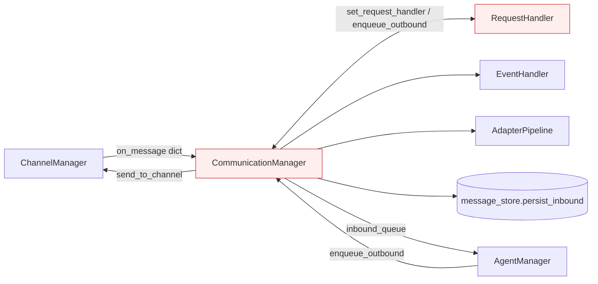
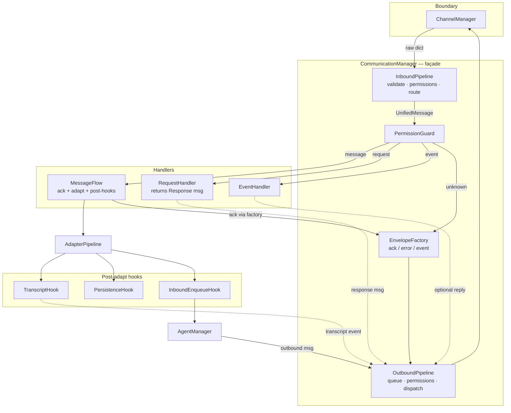
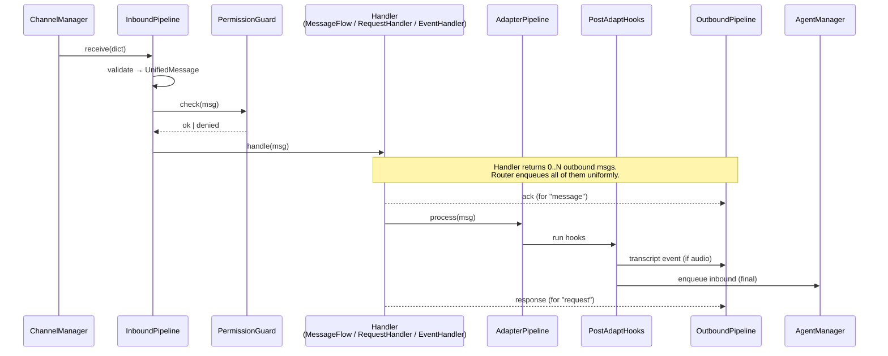

# Communication Manager Refactor — Design Doc

Status: **Proposal** · Author: design review · Scope: `hiroserver/hirocli/src/hirocli/runtime/communication_manager.py` and its immediate collaborators.

> Per the workspace rule, we are in initial development mode: **no backward
> compatibility, no migration, no wrappers**. This doc proposes the target
> shape directly.

---

## 1. TL;DR

`CommunicationManager` has accumulated six responsibilities and a circular
dependency with `RequestHandler` / `ChannelManager` that is currently papered
over with two-phase setter injection. We propose splitting it into a thin
**façade + small single-purpose collaborators**, breaking the cycles via
**dependency inversion** (return-value handlers + an `OutboundSink` protocol),
and moving content-specific behaviour (audio transcript event, persistence)
out of the router into a **post-adapt hook chain**.

End state: `communication_manager.py` shrinks from ~510 lines to ~120 lines
and stops being the place where every new feature wants to land.

---

## 2. Background

### 2.1 What `CommunicationManager` does today

It is the central message router between channel plugins and the application
core (see `mintdocs/architecture/concepts/communication-manager.mdx` for the
user-facing description). Concretely, the file owns:

1. **Routing** — `receive()` validates a raw dict into a `UnifiedMessage`,
   runs a permission check, and dispatches by `message_type`.
2. **Logging helpers** — module-level `_comm_kind`, `_comm_content_hint`,
   `_req_resp_extras`, `_comm_extras`, `_parse_req_resp_body`, `_snippet_text`,
   `comm_peer_label` (~110 lines).
3. **Ack generation** — `_send_ack_event` builds a `message.received` event.
4. **Error response generation** — `_enqueue_error_response`.
5. **Adapter orchestration + transcript event** — `_adapt_and_queue` runs the
   pipeline, inspects per-item metadata, and hand-rolls a
   `message.transcribed` event when audio metadata is present.
6. **Persistence** — calls `domain.message_store.persist_inbound`.
7. **Outbound queue worker** — `_outbound_worker` drains the queue and calls
   `ChannelManager.send_to_channel`.
8. **Wiring helpers** — `set_channel_manager`, `set_request_handler` exist
   only to break a circular dependency.

### 2.2 Smell inventory

| # | Smell | Evidence (file:line) |
|---|---|---|
| 1 | Two-phase init signals a dependency cycle | `communication_manager.py:228-234` |
| 2 | Inbound and outbound dispatch are asymmetric | `:240-298` vs `:469-498` |
| 3 | Three different task-spawn patterns in `receive()` | `:262-298` |
| 4 | Side-effects hard-coded in router (transcript event, persistence) | `:318-396` |
| 5 | Envelope construction repeated inline | `:344-358`, `:422-438`, `:440-455` |
| 6 | Logging helpers bloat the manager file | `:62-173` |
| 7 | `run()` only runs the outbound worker (misnamed) | `:504-507` |
| 8 | `match` with guard clauses where a handler dict would be clearer | `:261` |
| 9 | Permission check is a placeholder, called from two sites | `:176-181`, `:253`, `:475` |
| 10 | `EventHandler` vs `ChannelEventHandler` name collision (cross-cutting) | `event_handler.py`, `channel_event_handler.py` |

### 2.3 The dependency cycle visualized



The red nodes form the cycle that forces `set_request_handler()`.

---

## 3. Goals and non-goals

**Goals**

- Eliminate the two-phase init / circular dependency.
- Confine `communication_manager.py` to routing + lifecycle.
- Make adding a new content side-effect (e.g. image-caption event, audit log)
  a one-file change that does not touch the router.
- Make every message type follow the same dispatch contract.
- Keep the existing public boundary stable for the rest of the runtime
  (`receive`, `enqueue_outbound`, `inbound_queue`, `serve`).
- Stay testable: every collaborator is constructible with fakes.

**Non-goals**

- Reworking `UnifiedMessage` or the wire protocol.
- Replacing `asyncio.Queue` with anything fancier.
- Implementing the real permission system (we just give it a proper seam).
- Changing the adapter contract (`metadata["description"]` /
  `metadata["adapter_error"]`).

---

## 4. Proposed architecture

### 4.1 Big picture



### 4.2 Inbound sequence (after refactor)



### 4.3 Module / file layout

```
runtime/
├── communication_manager.py     # ~120 lines: façade + lifecycle (serve/stop)
├── inbound_pipeline.py          # validate + dispatch
├── outbound_pipeline.py         # queue worker + sink
├── envelope_factory.py          # ack / error / event constructors
├── permission_guard.py          # PermissionGuard protocol + NoopGuard default
├── outbound_sink.py             # OutboundSink protocol
├── post_adapt/
│   ├── __init__.py              # PostAdaptHook protocol + chain runner
│   ├── transcript_hook.py
│   ├── persistence_hook.py
│   └── enqueue_hook.py
├── handlers/
│   ├── message_flow.py          # ack + adapt orchestration
│   ├── request_handler.py       # handle(msg) -> UnifiedMessage  (response)
│   └── event_handler.py
└── comm_log.py                  # _comm_kind, _comm_content_hint, peer label
```

### 4.4 Key interfaces

```python
# outbound_sink.py
class OutboundSink(Protocol):
    async def send(self, channel: str, msg: dict) -> None: ...

# permission_guard.py
class PermissionGuard(Protocol):
    def check(self, msg: UnifiedMessage, direction: Direction) -> None:
        """Raise PermissionError to block."""

# handlers/request_handler.py
class RequestHandler:
    async def handle(self, msg: UnifiedMessage) -> UnifiedMessage:
        """Return the response message; router enqueues it."""

# handlers/event_handler.py
class EventHandler:
    async def handle(self, msg: UnifiedMessage) -> Iterable[UnifiedMessage]:
        """Return any outbound side-effect messages (usually empty)."""

# handlers/message_flow.py
class MessageFlow:
    async def handle(self, msg: UnifiedMessage) -> Iterable[UnifiedMessage]:
        """Yield ack immediately; pipeline + hooks run as a background task."""

# post_adapt/__init__.py
class PostAdaptHook(Protocol):
    async def run(self, msg: UnifiedMessage, emit: EmitFn) -> None: ...
    # `emit(msg)` enqueues an outbound side-effect message.
```

`ChannelManager` implements `OutboundSink`. The façade depends on the
protocol, **not** the concrete class — `set_channel_manager()` goes away.

`RequestHandler` no longer holds a back-reference to the manager. The router
awaits `handle()` and enqueues its return value — `set_request_handler()`
goes away.

### 4.5 Handler contract

Every handler returns *what it wants the router to send*. The router is the
only thing that touches the outbound queue. This kills the three-different-
task-spawn patterns in today's `receive()`.

| Handler | Returns | Background task? |
|---|---|---|
| `MessageFlow` | the ack | yes — adapter+hooks run detached |
| `RequestHandler` | the response | no — request handlers should be quick; if not, they spawn their own task |
| `EventHandler` | iterable (usually empty) | no |
| (unknown type) | the routing-error response | no |

### 4.6 Lifecycle

```python
class CommunicationManager:
    def __init__(self, *, sink: OutboundSink, ...):
        self._inbound = InboundPipeline(...)
        self._outbound = OutboundPipeline(sink=sink, guard=...)

    @property
    def inbound_queue(self): return self._inbound.queue

    async def receive(self, data: dict) -> None:
        await self._inbound.receive(data)

    async def enqueue_outbound(self, msg: UnifiedMessage) -> None:
        await self._outbound.enqueue(msg)

    async def serve(self) -> None:
        async with asyncio.TaskGroup() as tg:
            tg.create_task(self._inbound.run(), name="inbound-worker")
            tg.create_task(self._outbound.run(), name="outbound-worker")
```

`run()` is renamed to `serve()` and gathers both workers, making the name
match what it does.

---

## 5. What stays the same

- The **outbound queue + single-worker** model — correct and simple.
- The **fire-and-forget background task** for the adapter pipeline — the
  non-blocking `receive()` requirement is real.
- The **`MessageAdapterPipeline` contract** (`metadata["description"]` /
  `metadata["adapter_error"]`).
- The **public surface** seen by the rest of the runtime: `receive`,
  `enqueue_outbound`, `inbound_queue`. Only `run` → `serve` and the two
  setter methods are removed.
- The **human-first logging style** (arrows, peer label, kind) — just
  relocated to `comm_log.py` and used by both pipelines.

---

## 6. Migration plan (incremental, each step independently shippable)

We are not maintaining backward compatibility, but we still want each step to
land as a small, reviewable change.

| # | Step | Risk | Reversible? |
|---|---|---|---|
| 1 | Move logging helpers → `comm_log.py` | very low | trivially |
| 2 | Extract `EnvelopeFactory` (ack / error / event / transcript) | low | trivially |
| 3 | Change `RequestHandler.handle` to return the response; drop `set_request_handler` | medium — touches `request_methods.py` call sites | yes |
| 4 | Introduce `OutboundSink` protocol; drop `set_channel_manager` | low | yes |
| 5 | Pull transcript event + persistence into `PostAdaptHook`s | medium — moves real behaviour | yes |
| 6 | Split `MessageFlow`, `InboundPipeline`, `OutboundPipeline` into their own files; façade becomes a wiring shell | low (mechanical) | yes |
| 7 | Rename `run()` → `serve()`; `serve()` gathers both workers | low | yes |
| 8 | (Optional) rename `EventHandler` → `ApplicationEventDispatcher` or `ChannelEventHandler` → `ChannelControlHandler` to remove the cognitive collision | low | yes |

The first four steps deliver ~70% of the value with the lowest risk and can
be one PR. Steps 5–7 are a second PR. Step 8 is cosmetic and can land
whenever.

---

## 7. Test plan

There is currently no test suite for `runtime/`. This refactor is the
natural moment to add one (it's also item #3 in
`mintdocs/build/todo/hirocli-refactoring.mdx`). Minimum coverage to add as
part of the refactor:

| Area | Test |
|---|---|
| `EnvelopeFactory` | building ack / error / transcript / event produces frames that match fixtures in `protocol/fixtures/` |
| `InboundPipeline` | malformed dict → drop with warning; valid `message` → ack emitted; valid `request` → handler awaited; valid `event` → handler awaited; unknown type → error response emitted |
| `OutboundPipeline` | enqueued msg reaches sink; permission denial drops with warning; sink failure logged |
| `PermissionGuard` | `NoopGuard` allows everything; a `DenyAllGuard` blocks both directions |
| `RequestHandler` | unknown method → `method_not_found`; handler exception → `handler_error` response |
| `PostAdaptHook` chain | audio with transcript metadata → transcript event emitted; persistence failure does not break the inbound enqueue |

All tests use `pytest-asyncio` with fake `OutboundSink` and in-memory
queues — no real channel plugin needed.

---

## 8. Risks and open questions

1. **Request handlers that need to send unsolicited messages** (not just a
   response) — today they could call `comm.enqueue_outbound(...)`. After the
   refactor the recommended path is to inject the `OutboundSink` (or the
   façade) into the handler that needs it. Need to audit
   `request_methods.py` for this pattern.
2. **Backpressure on the inbound queue** — symmetrizing inbound with a queue
   makes back-pressure possible; we should decide a default `maxsize` (or
   keep it unbounded as today) before flipping the switch.
3. **Permission system shape** — `PermissionGuard.check(msg, direction)` is
   a guess. If the real design needs async checks (DB lookups, cached
   policy fetch), the protocol should be `async def check(...)` from day
   one. Worth confirming before step 1 lands.
4. **Logging continuity** — `channel_manager.py` currently imports private
   symbols from `communication_manager.py`. Step 1 must update those
   imports in the same PR or `ChannelManager` will break.
5. **Naming of `EventHandler`** — renaming is cheap but ripples through
   call sites and docs. Defer to step 8 unless the refactor touches the
   files anyway.

---

## 9. Decision log (to be filled in as we go)

| Date | Decision | Rationale |
|---|---|---|
| _pending_ | Adopt the façade + collaborators shape above | this doc |
| _pending_ | `RequestHandler.handle` returns the response | breaks the cycle without callbacks |
| _pending_ | `OutboundSink` protocol owned by `runtime/` | breaks Comm↔Channel cycle |
| _pending_ | `PostAdaptHook` chain for transcript + persistence | router stops knowing about audio |

---

## 10. References

- Current implementation: `hiroserver/hirocli/src/hirocli/runtime/communication_manager.py`
- User-facing description: `mintdocs/architecture/concepts/communication-manager.mdx`
- Broader refactor backlog: `mintdocs/build/todo/hirocli-refactoring.mdx`
- Adjacent design review: `docs/refactor-review-map.md`
