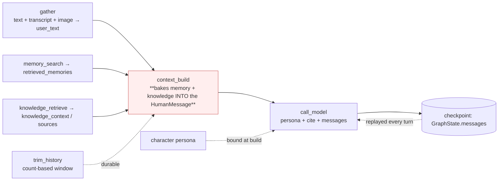
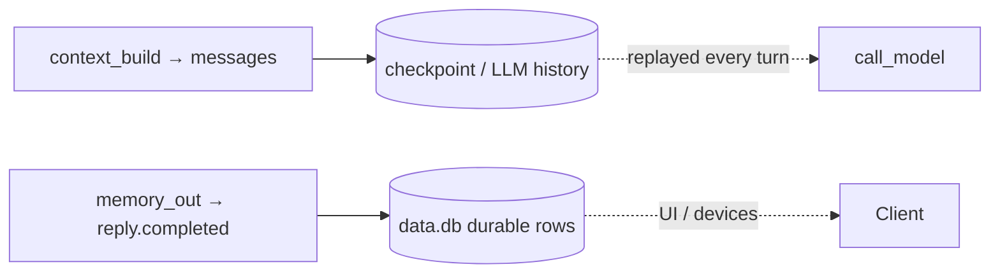
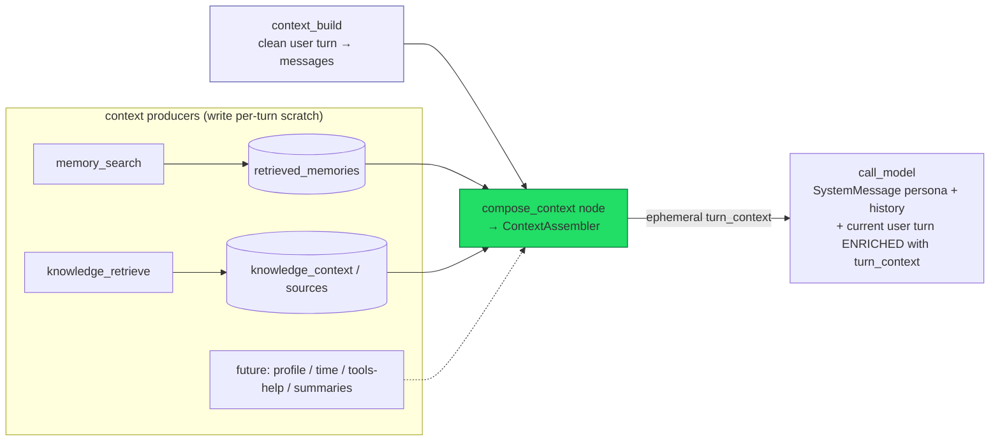

# Context Assembly (Design)

**Status:** ✅ Phase 1 implemented (seam + pollution fix) **+ rich rendering** (instructions /
tagged-neutralized knowledge / dated memory) **+ Admin → Preferences → Agent tab** (markdown editor
for `chat.instructions` + the `chat.cite_sources` toggle). Phases 2 (token budget) and 3 (provider
registry + new sources + summarization) pending.
**Scope:** how the chat agent turns *(persona + clean history + a growing pile of retrieved/derived
context)* into the actual model input — without polluting durable state, and in a shape that scales
as context sources multiply.
**Relationship:** supersedes the inline memory/knowledge injection described in
[chat-rag.md](chat-rag.md) §7. The retrieval pipeline itself (subgraph, gate, toggle) is unchanged;
this doc is only about the **assembly seam** between retrieval and the LLM call.
**Repo rule:** *no-backward-compatibility* mode — this changes graph wiring and node responsibilities
with no shims.

---

## 1. Why this doc exists

Two problems, one root cause.

**Problem A — history pollution (a real bug today).** Per-turn context (memory + knowledge) is baked
into the persisted `HumanMessage`, so it leaks into the durable conversation history and gets
replayed on every future turn. Prior turns that should be clean carry stale, turn-specific chunks.

**Problem B — context won't stop growing.** Memory, knowledge, and future sources (user profile,
current time, tool descriptions, summaries…) all compete for one finite context window at finite
cost. There is no budget, no prioritization, and every new source means editing `call_model`.

**Root cause:** there is no context-assembly *layer*. Context is stapled together ad-hoc across three
nodes, and the one growing source is written into durable turn state. Problem A is just the first
visible symptom of the missing layer.

---

## 2. Where context is assembled today



Three places shape "what the model sees":

| Node | Produces | Durable? |
|---|---|---|
| `gather` | `user_text` from text + transcripts + image descriptions | becomes durable (legitimate — it's the user's actual turn) |
| `context_build` | a `HumanMessage` = **memory + knowledge + user_text** | **persisted into `messages`** ← the bug |
| `call_model` | `SystemMessage(persona [+ citation instr])` + `messages` | ephemeral, but re-built ad-hoc each call |

### The pollution mechanism

`context_build_node` returns `{"messages": [HumanMessage(memory + knowledge + user_text)]}`. That goes
through the `add_messages` reducer into `GraphState.messages`, which is the **checkpointed LLM history**
(`AsyncSqliteSaver`, keyed by `thread_id`). So the user's turn is stored with the per-turn context
fused in. By turn 3 the history `call_model` sends looks like:

```
Human:  «turn-1 memory» + «turn-1 knowledge chunks» + "what's the refund policy?"
AI:     ...reply 1...
Human:  «turn-2 memory» + «turn-2 knowledge chunks» + "and digital goods?"
AI:     ...reply 2...
Human:  «turn-3 memory» + «turn-3 knowledge chunks» + "thanks, what about Selim?"   ← current
```

Turns 1–2 should be pristine. Instead they carry stale chunks until the window trims them out. The
same applies to `memory_context` (pre-existing — knowledge just made it large and obvious).

### Two stores, don't conflate them



- **Checkpoint (`GraphState.messages`)** — the LLM history. Keeps user turns, AI replies, **and tool
  exchanges** (`AIMessage(tool_calls)` + `ToolMessage`); `trim_history` only *windows* it (count-based)
  and forces the first kept message to be a `HumanMessage`. Tool messages are **not** stripped here.
- **`data.db` rows** — the durable conversation for UI/devices. The `graph_event_subscriber` saves only
  the user turn + the agent **text reply**; tool internals never become rows.

The pollution is in the **checkpoint**, because that's what feeds the LLM.

---

## 3. The invariant (the permanent rule)

> **`messages` holds only clean conversation turns. All retrieved/derived context is assembled
> ephemerally per turn and never persisted.**

`gather` → `context_build` may write the **user's turn** (text + transcript + image descriptions) to
`messages` — that is the user's real content. Memory, knowledge, and every future derived source must
**never** enter `messages`; they are inputs to *this* answer only.

Get this right first. Everything below is how to house it so it scales.

---

## 4. Proposed architecture — one assembly seam

A single **context assembler** is the only thing that converts *(persona + clean history + a list of
context blocks)* into the model input. Sources stop knowing about the prompt; they **produce typed
blocks**. The assembler owns **ordering, budget, and rendering**.



### Placement: persona in system, context in the current user turn

Two slots, by design (revised from an earlier "assembler owns the full system message" idea):

- **Persona → a stable system message.** `call_model` puts the character system prompt in
  `SystemMessage` unchanged every turn. Stable ⇒ cache-friendly: a volatile system prefix would
  invalidate the whole cached prefix each turn, whereas per-turn context riding in the latest user
  turn keeps `system + history` cacheable.
- **Per-turn context → merged into the current user turn**, context first / question last, so it sits
  in the recency zone next to the query. The merge is **ephemeral** (a fresh `HumanMessage` built only
  for the LLM call); the stored turn in `messages` stays clean.

### Rendered format (what the model sees in the current user turn)

```
## Instructions                       ← chat.instructions pref (author-controlled markdown)
- This is a conversation between you (the character) and the user.
- Use the Knowledge / Memories below as optional background …

## Knowledge retrieved
<source rank="1" doc="Holi's Full Flame Life Story" section="Gap Year" score="0.40">
**Gap Year**                          ← chunk body, structural markdown NEUTRALIZED
* **Glow-Ridge Mountains** – …        ← inline bold + bullets kept
</source>
<source rank="2" doc="…" section="…" score="0.30"> … </source>

## Memories retrieved
- 2026-05-20 14:03 · score 0.30 · User's name is Andrew

{the user's actual question}          ← appended last (recency)
```

- **Knowledge** renders from the structured `knowledge_sources` (not the joined string): one
  `<source rank doc section score>` tag per chunk; `doc` = document title, `section` = heading path.
  Each body is passed through **`neutralize_structural_markdown`** — ATX/setext headers → `**bold**`,
  thematic breaks (`---`/`***`/`___`) removed, inline emphasis + lists kept — so a chunk's own headers
  cannot read as new prompt sections, and the tag prevents bodies from bleeding into each other.
- **Memory** renders `- {date} · score {s} · {text}` (date/score read defensively from the mem0 hit).
- **Instructions** are always present (general answering guidance, broader than knowledge); Knowledge
  and Memories sections are always present too, showing `(none for this message)` when empty.
- **`chat` preferences** (top-level): `chat.instructions` (markdown, editable), `chat.cite_sources`
  (adds the `[n]` citation instruction + the source-list bridge), `chat.preferred_answering_language`
  (placeholder). Moved here from `knowledge.chat` so general chat-answering knobs live in one place.

### Core types

```text
ContextBlock {
    source: str        # "memory" | "knowledge" | "profile" | …
    heading: str       # section label shown to the model
    body: str          # rendered text
    priority: int      # lower = kept first under budget
    tokens: int        # estimated; filled by the assembler
}

ContextAssembler.assemble(*, blocks: list[ContextBlock]) -> turn_context: str
```

- **Adding a source = add a block-builder** (a pure function reading its scratch slot → `ContextBlock`).
  No edit to `call_model`.
- The assembler orders blocks by `priority`, (Phase 2) fits them to a token budget, and renders one
  `turn_context` string (context sections only — **no persona**).
- The **citation instruction** is itself a block (it depends on knowledge presence + the
  `knowledge.chat.cite_sources` pref) — so even that leaves `call_model`.

### Graph placement & the tool loop

`compose_context` runs **once**, after the parallel producers join, before `call_model`:

```
trim_history → {memory_search ∥ knowledge_retrieve} → context_build → compose_context → call_model
                                                                                          ↑   ↓ tools
                                                                                          └───┘
```

- `compose_context` writes an **ephemeral `turn_context`** to state (never to `messages`).
- `call_model` builds `[SystemMessage(persona), *history, <current user turn enriched with
  turn_context>]`. The current user turn is the **last `HumanMessage`** — after a tool loop it is no
  longer the final element, so `call_model` finds it by scanning from the end and enriches a copy.
- The tool loop re-enters `call_model` (not `compose_context`), so `turn_context` is computed once and
  re-injected each iteration into the same user turn, while `messages` grows with the tool exchange.
  Context never goes stale within a turn, and the durable history stays clean across turns.

### Why a node, not just a helper

This codebase gives every graph node a ledger row. A `compose_context` node yields a visible,
priced row — *"context_assembly: memory(3, 180 tok) + knowledge(5 chunks, 1200 tok); dropped profile
(budget)"*. As sources multiply, that observability is the payoff. (A module-only variant — assemble
inside a renamed `context_build` — is the lighter Phase-1 option, promoted to a node later.)

---

## 5. The budget model (the real scaling axis)

```text
|<------------------------- model context window ------------------------->|
| persona (fixed) | recent history (token-windowed) | retrieved context | response reserve |
                                                       ^ filled by priority; trimmed/dropped to fit
```

- Reserve for **persona** (fixed) and **response** (`max_tokens`).
- **History**: token-windowed. Today `trim_history` is *count*-based (`memory.max_messages`); it
  converges into this budget later (token-aware, possibly summarized).
- **Retrieved context**: fill by `priority` until the remaining budget is spent; trim the last block
  or drop low-priority ones.

Today there is no budget (everything is included). The assembler is the single place this lands — no
graph change needed to add it.

---

## 6. Phased plan — ease in, no beast

| Phase | Scope | Size |
|---|---|---|
| **1 — seam + fix** | Add `ContextAssembler` + `ContextBlock`; add `compose_context` node; move memory + knowledge + citation into it; `context_build` appends the **clean** turn; `call_model` reads `system_context`. **Fixes pollution, establishes the seam.** No budget yet (or one generous cap). | ≈ the inline patch, but structured |
| **2 — budget** | Token budget + allocation policy; ledger shows included/dropped/tokens; make history trimming token-aware and coordinate with the budget. | medium |
| **3 — grow** | Provider *registry* (sources self-register vs. the assembler reading known slots); new producers (user profile, current time, tools-help); history / large-knowledge **summarization** blocks. | as needed |

Phase 1 is no larger than the inline patch — it just puts the same fix behind an interface that
Phases 2–3 extend **without touching the graph or `call_model` again**. That is the difference
between a patch and something you grow into.

---

## 7. What changes in Phase 1 (concrete)

| File | Change |
|---|---|
| new `context_assembly.py` | `ContextBlock` dataclass + `ContextAssembler` (order → budget(no-op) → render, **blocks only, no persona**); pure block-builders for memory + knowledge + citation |
| `state.py` | add ephemeral `turn_context: str` (per-turn scratch; not checkpointed beyond the turn) |
| `base.py` `context_build_node` | return **clean** `HumanMessage(user_text)` only — stop prepending memory/knowledge |
| `base.py` new `compose_context` node | `make_compose_context_node()` → assembles `turn_context` from scratch blocks (no persona) |
| `base.py` `call_model` | persona → stable `SystemMessage`; inject `turn_context` ephemerally into the current user turn (last `HumanMessage`), context first / question last; never mutates `messages` |
| `chat.py` | wire `context_build → compose_context → call_model` |
| tests | `test_memory_search_and_compose_context_injects_memory` — `context_build` clean; memory in `turn_context` (no persona); `call_model` enriches the user turn (incl. tool-loop case) |

Net behavior: identical prompt content to a correct turn today, but **`messages` stays clean**, persona
stays a stable (cacheable) system message, per-turn context sits next to the query, and the assembly
logic lives in one growable place.

---

## 8. Decisions (resolved)

1. **Node vs. module-only.** ✅ `compose_context` **node** (ledger observability).
2. **Phase-1 budget.** ✅ **No budget** — pure refactor + pollution fix; `budget` left as a no-op seam.
3. **Persona / placement.** ✅ **Revised after review:** persona stays a **stable system message**;
   the assembler emits **context only** (no persona), which `call_model` injects into the **current
   user turn** (context first, question last). Rationale: cache-friendliness (a stable system prefix
   keeps `system + history` cacheable) + recency (context next to the query). Supersedes the earlier
   "assembler owns the full system message" idea.
4. **History coordination.** ✅ `trim_history` stays count-based for Phase 1; converges into the token
   budget in Phase 2.

---

## 9. TL;DR

- **Invariant:** durable `messages` = clean turns only; all retrieved/derived context is **ephemeral**
  per turn. This fixes the pollution bug and is non-negotiable.
- The inline-in-`call_model` fix honors the invariant but **doesn't scale** — every source edits
  `call_model`, and there's no budget.
- **Scalable shape:** a `compose_context` node backed by a `ContextAssembler` that turns typed
  `ContextBlock`s into one ephemeral `turn_context`, with ordering + a token-budget seam. Persona
  stays a stable system message; context is injected into the current user turn.
- **Grow in phases:** (1) seam + pollution fix, (2) token budget, (3) provider registry + new sources
  + summarization. Phase 1 ≈ the patch in size, but built to extend without re-touching the graph.
