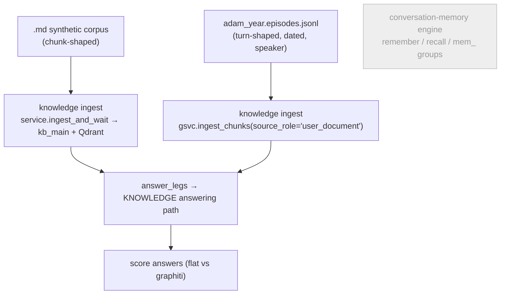
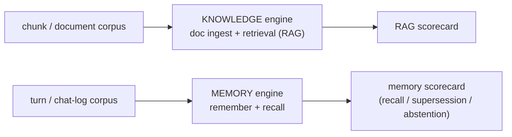
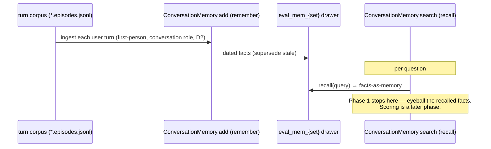

# Eval Corpus Tracks — Route Each Corpus to the Engine It Tests

> **Tracker doc (single source).** Design for splitting the knowledge/memory **eval** into
> two tracks selected by **corpus shape**: *document/chunk* corpora test the **knowledge**
> engine (ingest + retrieval), *turn/chat-log* corpora test the **conversation-memory**
> engine (`remember` + `recall`). Today both corpora run through the **knowledge** pipeline,
> so the conversation-memory engine is never evaluated and the turn corpus is tested by the
> wrong engine.
>
> **Companions:** [`graph-group-policy-design.md`](graph-group-policy-design.md) (the firm
> group-ID partition policy this builds on — `kb_`/`mem_`/`eval_` drawers, the leak fix), and
> [`memory-graphiti-replacement-design.md`](memory-graphiti-replacement-design.md) (the
> conversation-memory engine + its planned memory eval, §10).
>
> **Mode:** initial development — **no backward compatibility / no migration / no wrappers**
> (repo rule, explicitly abided).
>
> **Update (answer + judge, unified):** the eval now generates a **model answer** (memory: grounded
> only in recalled facts; knowledge: from retrieval) and grades it with an **optional LLM judge**
> (reuses the workspace answering model) against the row's **ideal answer** (`expected_answer`).
> Substring scoring is **dropped**; the judge verdict (✓/◐/✗/🛇) drives marks/Δ/gate for **both**
> tracks. Answer + judge are ledgered as `eval_answer`/`eval_judge` nodes (priced) under each
> question's run. Added a **contamination-free** temporal corpus (`helix_station`, invented nouns).
> Results UI unified: **Question · Ideal · Model answer** at a glance, fold for recalled facts /
> judge reason / full answers / run links; judge is a toolbar toggle.
>
> **Status:** **Phase 1 (memory eval track) — implemented** ✅ — `eval_mem_{set}` scoped-memory
> facade, `run_memory_eval` (remember → recall, single leg, no gate, scoring deferred), Tool + route
> `track="memory"`, group-scoped clear, and the admin recall-inspector UI; 90 backend tests green.
> Phase 0 (Adam → first-person) is **still pending** (the corpus is third-person today — the eval
> runs and is self-consistent about the entity "Adam", but first-person *self* semantics need the
> conversion). Phases 2–3 (dedicated knowledge corpus + `eval_kb_` isolation) remain in scope.
> Supersedes the "Phase A-bis (thread a group through the knowledge path)" note in the group-policy doc.

---

## 1. The one-paragraph version

The eval harness has **two corpora** but runs them through **one pipeline**. The synthetic
corpus (`.md`, chunk-shaped) and the Adam corpus (`*.episodes.jsonl`, turn-shaped, dated,
speaker-aware) are **both** ingested as `user_document` knowledge and answered via the
**knowledge** path (`answer_legs`). So the **conversation-memory** engine (`remember`/`recall`,
`mem_` groups, the `conversation` gate role, facts-as-memory, supersession, abstention) is
**never evaluated** — and the turn corpus, whose dated/speaker shape exists precisely to test
remembered-fact supersession, is tested by the knowledge engine instead. The fix: **the corpus
shape selects the engine.** Chunks → knowledge engine; turns → memory engine. All eval data lands
under one **`eval_`** namespace — `eval_mem_{set}` for the memory track, `eval_kb_{set}` for the
knowledge track — so eval is structurally separate from real `mem_`/`kb_` data and wipes by a single
prefix. The memory track is still the **cheaper** one (a single scoped binding vs threading the
knowledge ingest/retrieval path) and the **higher-value** one (the only engine with no eval today).

---

## 2. Where we are today — two corpora, one pipeline



Verified in `eval_runner.py`: both corpora write as `user_document`; both read via
`service.answer_legs`. The conversation-memory engine is untouched by eval.

**Two problems:**
1. **The memory engine is never tested** — recall / supersession / abstention have no eval.
2. **The turn corpus is mis-routed** — its temporal, speaker-aware shape is built to test
   *remembered* facts, but it's graded by the knowledge graph instead.

---

## 3. The principle — corpus shape selects the engine



We want **both** engines tested, each by its matching corpus — not one path chosen for all.

---

## 4. The two tracks

| Track | Corpus | Write path | Read / eval path | Drawer (group) | Status |
|---|---|---|---|---|---|
| **Knowledge eval** | `.md` chunks (synthetic) **+ a new dedicated corpus** (Phase 2) | knowledge ingest (scoped) | `answer_legs` (flat vs graphiti) | `eval_kb_{set}` | exists, re-scoped 🔁 |
| **Memory eval** | `*.episodes.jsonl` turns (Adam, converted to **first-person** — Phase 0) | conversation `remember` (`conversation` role, user-turns-only D2) | `recall` — a **single leg**; **scoring deferred** (§8.4) | `eval_mem_{set}` | **new** ❌ |

---

## 5. The isolation asymmetry (why the plan flips)

Both tracks isolate via the **scoped-service-object** mechanism (§6) — an eval-scoped instance
carries its `eval_…` drawer — but at **different depths**, which is what orders the work:

- **Memory track — one binding.** `GraphitiConversationMemory` derives `mem_{user}_{char}` from its
  call args today. An **eval-scoped instance** overrides that to mint `eval_mem_{set}` — a single
  constructor binding, with **no change to the runtime memory path** (the runtime keeps constructing
  the unscoped instance exactly as before). Cheap.
- **Knowledge track — deeper.** The knowledge ingest + retrieval **hard-wire** `kb_main` deep in the
  stack, so an `eval_kb_{set}`-scoped service has to reach **both** the ingest and the
  `answer`/`answer_legs` retrieval path. More surface — hence sequenced after memory.

> *(Earlier drafts called the memory track "free isolation." With its own `eval_mem_` drawer that no
> longer holds — it costs the one scoped binding above. Worth it for a clean, single-prefix-wipeable
> eval namespace.)*

> **Singleton DB connection is unaffected either way.** The Kuzu `Database`/driver is one
> handle per process (Kuzu file-locks); a `group_id` is a **partition tag / query filter on
> that one connection**, not a second connection. "Many drawers, one connection" is already the
> design. (A *separate eval DB file* — explicitly **not** chosen — is the only thing that would
> touch the connection model.)

---

## 6. Mechanism choice — the scoped service object (both tracks)

Both tracks need their `eval_…` drawer to reach the engine code. Three mechanisms, ranked:

| Mechanism | Verdict |
|---|---|
| **Scoped service object** — an eval-scoped service instance carries its group | ✅ **chosen (both tracks)** — the object knows its drawer; minimal hot-path churn |
| **Thread a `group=` param** through each function | ⚠️ works, but noisy signatures on a hot path |
| **ContextVar** ("current group" for the run) | ❌ avoid — this repo already ripped out a ContextVar hack from mem0; implicit global state bit us before |

**Decision:** scoped service object for both — memory binds one constructor arg (`eval_mem_{set}`);
knowledge binds an ingest+retrieval-scoped service (`eval_kb_{set}`). No `group=` threading on hot
paths, no ContextVar.

---

## 7. Phased plan

| Phase | What | Cost / risk | Priority |
|---|---|---|---|
| **0 — Adam → first-person** | One-time rewrite of `eval/adam_year.episodes.jsonl` from third-person narration to first-person user turns; keep the third-person original as `*_bak` | **Low** — data only, no code | **Prereq for Phase 1** |
| **1 — Memory eval track** | Turn corpus → conversation `remember`/`recall` via an **eval-scoped** `GraphitiConversationMemory` (`eval_mem_{set}`); **single recall leg**; own runner + events; group-scoped clear. **Scoring deferred.** | **Low** — one scoped binding | **Do first** |
| **2 — Dedicated knowledge corpus** | Author a purpose-built document/chunk corpus + question bank for the knowledge track (the synthetic `.md` set is thin; Adam is leaving for chat) | Low–Medium — data | **In scope** |
| **3 — Knowledge eval isolation** | Knowledge eval → its own `eval_kb_{set}` via a **scoped service** for both ingest + retrieval | **Medium** — touches the knowledge ingest/retrieval path | After corpus |

**Ordering:** memory first — cheapest isolation (one binding) and the only engine with **no eval
today**. The dedicated knowledge corpus and its `eval_kb_` isolation follow **in this scope** (no
longer deferred): once the corpus exists, scoping its ingest+retrieval to `eval_kb_{set}` is the
remaining work.

---

## 8. Phase 1 — Memory eval track (detail)



**Prerequisite — Phase 0 (first-person conversion).** The Adam corpus is **third-person narration**
today (`"Adam started a new job at Brightloom…"`). To ride the chat / `remember` path it must be
rewritten to **first-person user turns** (`"I started a new job at Brightloom…"`). This is a data
edit on `eval/adam_year.episodes.jsonl`, not runtime code (its own phase).

**Single leg, no gate.** The memory track runs **one engine** (recall) — there is no flat-vs-graph
comparison and **no PROCEED/PIVOT gate** (that gate is a knowledge-track artifact comparing two
retrieval legs). It gets its **own runner** (`run_memory_eval`) + event types, parallel to
`run_eval`, rather than a `mode` bolted onto `answer_legs`.

1. **New eval mode `memory`** — feed the (first-person) turn corpus through
   `GraphitiConversationMemory.add(...)` (the `remember` path) on an **eval-scoped instance** that
   mints **`eval_mem_{set}`**, not the knowledge ingest.
2. **Evaluate via `recall`** (not `answer_legs`) — exercises the real memory engine.
3. **Targets:** **recall** (right fact surfaces), **supersession** ("latest wins" over a
   superseded fact), **abstention** (no fabrication when the graph can't know).
4. **Scoring — deferred to a later phase.** The eval scoring model is being reconsidered wholesale,
   so Phase 1 builds **no scorer**. It proves the *plumbing*: each turn is remembered, and `recall`
   surfaces the right **current** facts (supersession working, stale facts gone). Verify by
   eye / smoke for now; formal recall / supersession / abstention scoring lands when scoring is
   redesigned.
5. **Deletion is clean** — `clear_group("eval_mem_{set}")`, one drawer wipe; or wipe **all** eval at
   once by the shared `eval_` prefix.
6. **Graph tab** — `eval_mem_{set}` classifies as **eval** (label `Eval · Memory · {set}`), so it
   shows + labels itself via the existing selector, visibly separate from real memory.

---

## 9. Phases 2–3 — Knowledge track (in scope)

**Phase 2 — dedicated knowledge corpus.** Author a document/chunk corpus built for the knowledge
engine (richer than the thin synthetic `.md` set), with its own question bank. This is the knowledge
track's data, now that Adam has left for chat.

**Phase 3 — `eval_kb_{set}` isolation.** Give the knowledge eval a **scoped service** bound to
`eval_kb_{set}` for both ingest and retrieval, so its corpus never enters `kb_main`. Deletion becomes
group-scoped (`clear_group("eval_kb_{set}")` — or the shared `eval_` prefix) instead of the
document-scoped tag sweep `clear_eval_data` that §10 retires.

---

## 10. What changes / what we retire

- **Re-route** the Adam corpus to the **memory / chat** track — a **correction, not a retirement**:
  Adam is just data, and turn-shaped data belongs in chat. Its third-person text is converted to
  first-person (Phase 0).
- **Author a dedicated knowledge corpus** (Phase 2) as the knowledge track's data; the thin
  synthetic `.md` set stays usable in the meantime.
- **Move eval to its own `eval_` namespace** — `eval_mem_{set}` / `eval_kb_{set}` — replacing the
  flat `eval_{set}` helper form.
- **Retire the old eval traces.** Today's eval lives in `kb_main` (Adam-through-knowledge) and is
  tracked by document tags (`_l3_eval_synthetic`, `_adam_eval`) with a document-scoped
  `clear_eval_data` sweep. All of that goes: eval data lives **only** under `eval_` groups, cleared
  by group/prefix. The `corpus_source="adam"` knowledge branch and `ingest_adam_corpus_via_service`
  are removed (no-backward-compat).

---

## 11. Open decisions (settle when building Phase 1)

| # | Question | Lean |
|---|---|---|
| **E-a** | ~~Reserved eval user id~~ | **Moot** — `eval_mem_{set}` no longer derives from a user id (the scoped instance mints the group), so there's nothing to collide. A nominal user id may still be passed for non-group bookkeeping. |
| **E-b** | **Speaker gating** for multi-speaker corpora (D2 = user turns only) | Adam is **third-person today** → convert to **first-person** user turns (§8 step 0); with one first-person subject the speaker gate is inactive — revisit only for a genuinely multi-speaker corpus |
| **E-c** | ~~Facts-only judge shape~~ | **Out of scope for Phase 1** — scoring is being reconsidered wholesale in a later phase; Phase 1 only proves recall returns the right *current* facts |
| **E-d** | The `{set}` suffix granularity in `eval_mem_{set}` / `eval_kb_{set}` | one drawer per eval set (e.g. `eval_mem_adam`); add a run-id suffix only if concurrent runs appear |

---

## 12. UI — the Eval Batch panel (admin)

The existing panel (`admin_frontend/.../eval/KnowledgeEvalPanel.svelte` + the
`knowledge-eval.svelte.ts` controller) keys everything off `corpusSource: 'synthetic' | 'adam'` and
always renders legs + a PROCEED/PIVOT gate + marks + a Δ column. The two-track split needs the panel
to **reshape by track**, because the engines differ.

### 12.1 Structure — track **sub-tabs** + a folder/corpus picker (implemented)

The panel keys off **`track: 'knowledge' | 'memory'`**, chosen via **sub-tabs** (not a dropdown).
Each track scans a **folder** (text field + native **pick** button, like Knowledge Add) for its
corpuses and lists them in a **dropdown**; picking a corpus loads its question bank. Stem
convention: `<id>.episodes.jsonl ↔ <id>.questions.yaml` (memory), `<id>/ ↔ <id>.questions.yaml`
(knowledge). The chosen corpus `id` is the eval drawer suffix (`eval_mem_<id>` / `eval_kb_<id>`).

```
[ Memory | Knowledge ]   ← sub-tabs
Engine: backend=graphiti · extraction=… · embedder=… · recall top-k=8 · …      [⚙ Settings]
Folder [ …/eval         ] [📁 pick] [⟳]   Corpus [ adam_year (35 ep · 100 Qs) ▾ ]
☑ Remember turns first        ● Recall                              [Clear] [▶ Run eval]
Questions  (12/100 selected · select at least one)   ← required; NO implicit "run all", no cap
```

- **Engine-params strip**: read-only preference values that drive the run (graph backend,
  extraction model, embedder, recall/retrieval top-k, sim floor, search scope/recipe…), with a
  **⚙ Settings** link to `/preferences`.
- **Question selection is required** — the Run button is disabled until a corpus *and* ≥1 question
  are picked; the server also rejects an empty selection. The old 50-cap is gone.
- **Activity / Results render only when they have data** (Activity once processing starts; Results
  once rows/summary exist), and both **persist across navigation** via the server run registry.

### 12.2 What differs per track

| Control / Section | **Knowledge track** (≈ today) | **Memory track** (new) |
|---|---|---|
| Setup checkbox | `☑ Ingest corpus` `☑ Build graph` | `☑ Remember turns` (one step — `remember` builds the graph) |
| **Legs selector** | `Flat` / `Graphiti` toggle (1–2) | **gone** — one engine; static `● Recall` pill |
| Questions checklist | yes | yes (categories = **recall / supersession / abstention**) |
| Per-question **marks** (✓◐✗🛇) | yes | **none in Phase 1** (scoring deferred) → shows **recalled facts** instead |
| **Δ column** | yes (best graph vs flat) | **gone** (no second leg) |
| Summary | **PROCEED/PIVOT** gate card | "remembered N turns · recalled for M/Q" — **no gate** |
| Per-category breakdown | pass counts per leg | deferred with scoring (or a recall-rate column) |
| Drawer / Graph-tab link | `eval_kb_{set}` | `eval_mem_{set}` |
| Graph Runs link | per-leg `answer` run | `memory_out` (ingest) / `memory_search` (recall) run |

### 12.3 Memory track — the "recall inspector" (Phase 1, no scorer)

In Phase 1 the memory **Results** table is **not** a scorecard — it's a recall inspector: per
question, surface the recalled *current* facts and let the operator judge by eye.

```
┌ Eval ───────────────────────────────────────────────────────────────────┐
│ Track [Memory ▾]   Corpus [Adam · first-person ▾]                         │
│ ☑ Remember turns (35 episodes → eval_mem_adam)                            │
│ Engine: ● Recall (single)                       [Clear]  [▶ Run eval]     │
└───────────────────────────────────────────────────────────────────────────┘

Results — remembered 35 turns → eval_mem_adam · recalled for 12/12 Qs   [View drawer in Graph ↗]
 # │ ▲ │ Question                    │ Recalled │ Top fact (expand ▸)
 1 │   │ What's my job?              │    2     │ "I work at Brightloom (as of Jan)"      ▸
 2 │ ▲ │ Where do I live now?        │    3     │ "I moved to Denver (as of Sep)"   ⚠ stale? ▸
 3 │   │ Do I have a dog?            │    0     │ — (nothing recalled)                    ▸
```

Expanded row — gold from the question bank shown for reference, no auto-score:

```
Q: Where do I live now?                                         category: supersession
Gold (reference): Denver        Must-not-surface: Boston
Recalled facts (current lens):
   • I moved to Denver in September   (valid_at 2024-09-03)
   • I live near the river            (valid_at 2024-02-03)
[Open memory_search Graph Run ↗]
```

A cheap aid that works **without** a scorer: the **recalled-count / gold-vs-recalled**
side-by-side. It makes supersession failures eye-visible now; formal pass/fail lands with the
scoring redesign.

### 12.4 Knowledge track — mostly unchanged

Same legs / gate / marks / Δ / per-category UI as today. Only deltas: **Adam disappears** from this
track's corpus list (it moved to Memory), a **Dedicated corpus** option appears (Phase 2), and the
Graph/links point at **`eval_kb_{set}`** instead of `kb_main` (Phase 3).

### 12.5 Phase mapping (so the UI isn't half-built)

- **Phase 0–1:** add the Track selector; build the Memory branch as the **recall inspector** above
  (no marks, no gate, no Δ, no legs). Knowledge branch untouched.
- **Scoring phase (later):** memory rows gain marks + a memory summary card (recall / supersession /
  abstention pass-rates), replacing the raw fact dump.
- **Phase 2–3:** Knowledge gets the dedicated-corpus option and the `eval_kb_` drawer label.

**Controller delta (implemented):** `track` sub-tabs; a corpus-picker surface (`folder`,
`scanCorpuses`, `browseFolder`, `corpuses`, `selectedCorpus`, `selectCorpus`); questions loaded
from the chosen corpus's `questions_path` with **no cap** and a **required non-empty** selection;
`EvalRow` carries the memory `recalled`/`gold` fields; legs/gate/Δ render only on
`track === 'knowledge'`. New endpoints: `GET /knowledge/eval/corpuses` (discover), `GET
/knowledge/eval/questions?path=` (bank by path); `POST /knowledge/eval/run` takes
`corpus_id/corpus_path/questions_path` + required `question_ids`.

---

> **Next:** Phase 0 (Adam → first-person) then Phase 1 (memory eval track, `eval_mem_`) are
> implementation-ready, with **scoring out of scope**. Phases 2–3 (dedicated knowledge corpus +
> `eval_kb_` isolation) follow **in this scope**. The group-policy doc's KB-spaces (Phase B) remain
> deferred; its namespace grammar is updated to admit `eval_mem_`/`eval_kb_`.

---

## 13. Persisted per-corpus memory results (implemented)

The in-memory run registry (`eval_registry.py`) keeps only the *latest run per workspace* and
drops everything on restart. For the **memory track** results are now also **persisted to disk per
corpus**, so picking a corpus shows its latest results and re-running a question subset makes the
saved snapshot **more complete** over time without re-running everything.

**Model — a single living snapshot per corpus.** One row per `(corpus_id, question_id)` in a
per-workspace SQLite DB `knowledge/eval_results.db` (`EvalResultStore`, table
`memory_eval_results`, full `question_completed` payload stored as `row_json`). A re-run
**upserts** each question's row (add new / overwrite existing) — there is **no run history**.
Rows are written as each question completes (`eval_registry._persist_memory_row`), so a
cancelled/crashed run still keeps the questions that finished.

**Read — bank is the spine.** `GET /knowledge/eval/results?track=memory&corpus_id=&questions_path=`
joins the **current question bank** (fresh question text / category / ideal) with the saved rows,
in **bank order**, and **recomputes the merged summary** over the whole accumulated set
(`summarize_memory_rows`, shared with the live runner). Bank questions with no saved row are absent
here and surface as **`not run`** badges in the checklist.

**Clear — results only.** `POST /knowledge/eval/results/clear` deletes a corpus's saved snapshot
from disk. **Distinct** from `POST /knowledge/eval/clear` (which wipes the ingested `eval_mem_{set}`
drawer): clearing results leaves ingested memory intact, so a re-run reuses it. The panel's memory
**“Clear results”** button is the disk clear; re-running every question eventually overwrites all
rows.

**UI deltas (memory track only).** Picking a corpus auto-loads the saved snapshot into Results +
summary; the checklist shows per-question **coverage badges** (`pass`/`partial`/`fail`/`abstain`/
`answered`/`not run`) from `savedStatusById`; switching corpora no longer prompts (nothing is lost —
results are saved); on run completion the table **reconciles** to the full merged snapshot. The
knowledge track is unchanged (its results are still in-memory only; the store is built track-aware
so it can adopt this later). Initial-dev mode: clean add, **no migration** — the DB is created
lazily on first write.

> **Reloaded-snapshot fix:** on snapshot load the controller now sets `runModes` to the snapshot's
> legs (`['recall']`). Without it `runModes` stayed at the default flat/graphiti, so the memory
> rows' `recall` leg matched no table column and expanded rows rendered empty.

### 13.1 Question + corpus filters (panel)

- **Question checklist filters:** free-text search (question/subcategory/id/category) + **difficulty**
  + (memory) **saved-state** (`pass`/`partial`/`fail`/`abstain`/`answered`/`not run`). **Select all /
  Clear** act on the **filtered** set ("Select shown" / "Clear shown" when a filter is active), so you
  can e.g. select only the failed questions and re-run them. View-only; the badge icons are small
  colored status glyphs with hover tooltips, placed after the question.
- **Corpus search:** the Corpus section filters the episode transcript to matches and **highlights**
  the term (`EvalCorpusReview` + `highlightSegments`, no `{@html}`). The old "Questions by category"
  pills were removed.

### 13.2 Corpus tab in the pipeline trace dialogs

Both Graph-Runs trace dialogs gained an **optional** `extraTabLabel` + `extraTab` (Snippet) prop —
generic, so `graph-runs` stays decoupled from eval. The eval panel injects a searchable **Corpus
(N)** tab (`EvalCorpusReview`) into:

- the **retrieval** trace dialog (already opened per question via a leg's recall run), and
- the **ingest** trace dialog, opened from a new **“Ingest pipeline”** button in the Cost strip. The
  remember run's ingest Graph Run id is surfaced via `ingest_run_id` on the `remember_done` setup
  event **and** the completed summary (`run_memory_eval`); the controller exposes it as `ingestRunId`
  (null on a subset re-run or a reloaded snapshot). Opening fetches `getGraphRunIngestTrace`; the
  Corpus tab shows the full source transcript regardless of which episode the pipeline view lands on.
