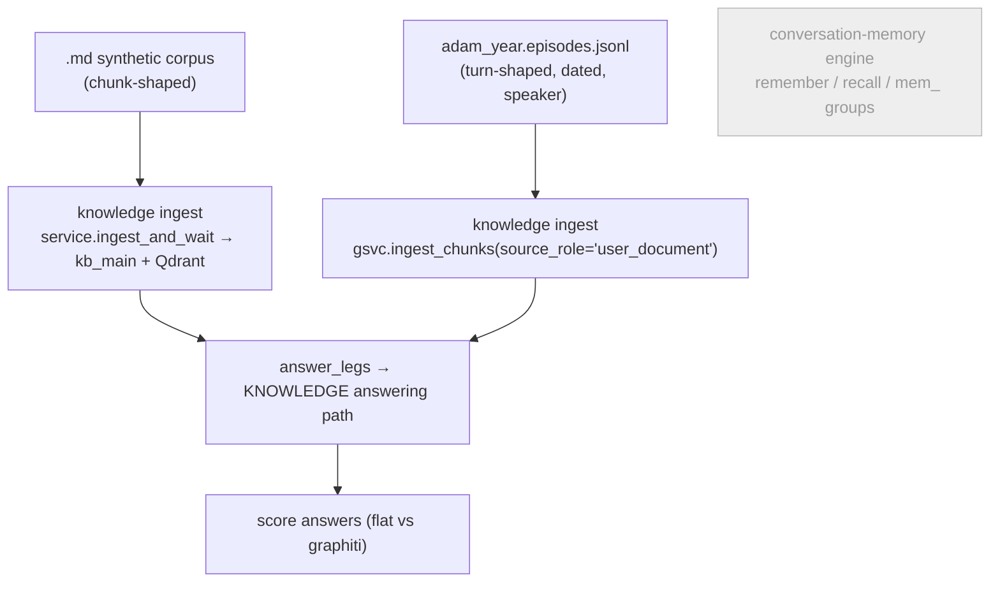
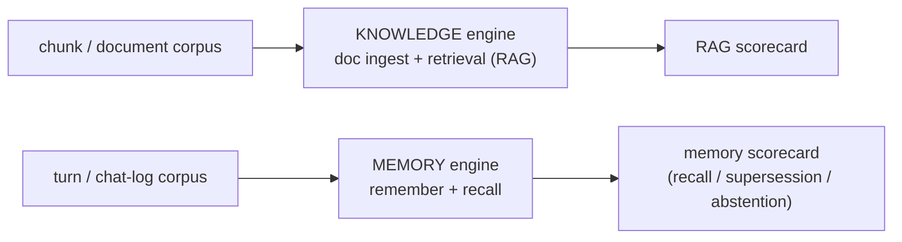
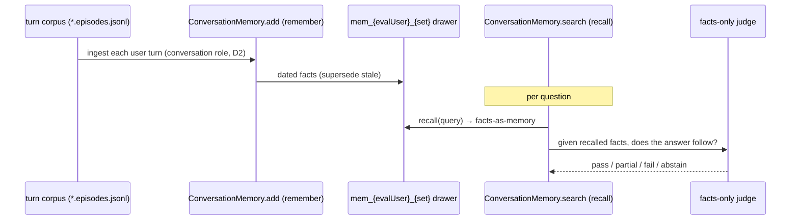

# Eval Corpus Tracks — Route Each Corpus to the Engine It Tests

> **Tracker doc (single source).** Design for splitting the knowledge/memory **eval** into
> two tracks selected by **corpus shape**: *document/chunk* corpora test the **knowledge**
> engine (ingest + retrieval), *turn/chat-log* corpora test the **conversation-memory**
> engine (`remember` + `recall`). Today both corpora run through the **knowledge** pipeline,
> so the conversation-memory engine is never evaluated and the turn corpus is tested by the
> wrong engine.
>
> **Companions:** [`graph-group-policy-design.md`](graph-group-policy-design.md) (the firm
> group-ID partition policy this builds on — `kb_`/`mem_`/`eval_` drawers, the leak fix), and
> [`memory-graphiti-replacement-design.md`](memory-graphiti-replacement-design.md) (the
> conversation-memory engine + its planned memory eval, §10).
>
> **Mode:** initial development — **no backward compatibility / no migration / no wrappers**
> (repo rule, explicitly abided).
>
> **Status:** design only — nothing implemented. Supersedes the brief "Phase A-bis (thread a
> group through the knowledge path)" note in the group-policy doc.

---

## 1. The one-paragraph version

The eval harness has **two corpora** but runs them through **one pipeline**. The synthetic
corpus (`.md`, chunk-shaped) and the Adam corpus (`*.episodes.jsonl`, turn-shaped, dated,
speaker-aware) are **both** ingested as `user_document` knowledge and answered via the
**knowledge** path (`answer_legs`). So the **conversation-memory** engine (`remember`/`recall`,
`mem_` groups, the `conversation` gate role, facts-as-memory, supersession, abstention) is
**never evaluated** — and the turn corpus, whose dated/speaker shape exists precisely to test
remembered-fact supersession, is tested by the knowledge engine instead. The fix: **the corpus
shape selects the engine.** Chunks → knowledge engine; turns → memory engine. As a bonus, the
memory track **isolates itself for free** (the conversation pipeline is already keyed by
`user_id`/`character_id`), so it's both the higher-value *and* the cheaper track.

---

## 2. Where we are today — two corpora, one pipeline

Verified in `eval_runner.py`: both corpora write as `user_document`; both read via
`service.answer_legs`. The conversation-memory engine is untouched by eval.

**Two problems:**
1. **The memory engine is never tested** — recall / supersession / abstention have no eval.
2. **The turn corpus is mis-routed** — its temporal, speaker-aware shape is built to test
   *remembered* facts, but it's graded by the knowledge graph instead.

---

## 3. The principle — corpus shape selects the engine

We want **both** engines tested, each by its matching corpus — not one path chosen for all.

---

## 4. The two tracks

| Track | Corpus | Write path | Read / eval path | Drawer (group) | Status |
|---|---|---|---|---|---|
| **Knowledge eval** | `.md` chunks (synthetic) | knowledge ingest | `answer_legs` (flat vs graphiti) | `kb_main` today → `kb_eval_{set}` when isolated | exists ✅ |
| **Memory eval** | `*.episodes.jsonl` turns (Adam) | conversation `remember` (`conversation` role, user-turns-only D2) | `recall` + facts-only judge | `mem_{evalUser}_{set}` | **new** ❌ |

---

## 5. The isolation asymmetry (why the plan flips)

The two tracks have **opposite isolation costs**, which is what reorders the work:

- **Memory track — free isolation.** The conversation pipeline already takes
  `user_id`/`character_id` and derives `mem_{user}_{char}` itself. Run the memory eval under a
  **dedicated eval user/character** and its data lands in its own `mem_eval…` drawer with **no
  changes to any shared/hot code path**.
- **Knowledge track — needs work.** The knowledge ingest + retrieval **hard-wire** `kb_main`
  deep in the stack, so isolating it into `kb_eval_{set}` requires a **scoped service** (§6).

> **Singleton DB connection is unaffected either way.** The Kuzu `Database`/driver is one
> handle per process (Kuzu file-locks); a `group_id` is a **partition tag / query filter on
> that one connection**, not a second connection. "Many drawers, one connection" is already the
> design. (A *separate eval DB file* — explicitly **not** chosen — is the only thing that would
> touch the connection model.)

---

## 6. Mechanism choice (for the knowledge track's scoping)

When we do isolate the knowledge eval, the drawer must reach the ingest + retrieval code.
Three mechanisms, ranked:

| Mechanism | Verdict |
|---|---|
| **Scoped service object** — an eval-scoped service instance carries its group | ✅ **preferred** — the object knows its drawer; minimal hot-path churn |
| **Thread a `group=` param** through each function | ⚠️ works, but noisy signatures on a hot path |
| **ContextVar** ("current group" for the run) | ❌ avoid — this repo already ripped out a ContextVar hack from mem0; implicit global state bit us before |

The memory track needs **none** of these (it's keyed by user/character already).

---

## 7. Phased plan

| Phase | What | Cost / risk | Priority |
|---|---|---|---|
| **1 — Memory eval track** | Turn corpus → conversation `remember`/`recall` under a dedicated eval user/character; new facts-only scoring leg; group-scoped clear | **Low** — no hot-path threading; isolation free | **Do first** |
| **2 — Knowledge eval isolation** | Chunk corpus → its own `kb_eval_{set}` via a **scoped service** | **Medium** — touches the knowledge ingest/retrieval path | Defer |

**Why memory first:** it fills the *missing, higher-value* eval **and** is the *cheaper* to
isolate. Knowledge-eval pollution is already mitigated (eval tag + pre-run reset +
`clear_eval_data`), and running it against `kb_main` is arguably realistic — so isolate it only
when it actually bothers us.

---

## 8. Phase 1 — Memory eval track (detail)

1. **New eval mode `memory`** — feed a turn corpus through `GraphitiConversationMemory.add(...)`
   (the `remember` path) under a **reserved eval user + per-set character**, not the knowledge
   ingest.
2. **Evaluate via `recall`** (not `answer_legs`) — exercises the real memory engine.
3. **Targets:** **recall** (right fact surfaces), **supersession** ("latest wins" over a
   superseded fact), **abstention** (no fabrication when the graph can't know).
4. **New scoring leg — facts-only judge.** Memory has no Qdrant passage layer, so scoring asks
   "given the recalled facts, does the answer follow?" (the only genuinely new build).
5. **Deletion is clean** — `clear_group("mem_{evalUser}_{set}")`, one drawer wipe.
6. **Graph tab** — the eval memory drawer is a real `mem_` group, so it shows + labels itself
   via the existing selector.

---

## 9. Phase 2 — Knowledge eval isolation (deferred)

- Give the knowledge eval a **scoped service** bound to `kb_eval_{set}` for both ingest and
  retrieval, so its corpus never enters `kb_main`.
- Deletion becomes group-scoped (`clear_group("kb_eval_{set}")`) instead of the current
  document-scoped `clear_eval_data`.
- **Deferred** because pollution is already mitigated and the change touches the shared
  knowledge ingest/retrieval path.

---

## 10. What changes / what we retire

- **Keep** the synthetic chunk corpus → knowledge eval as-is.
- **Re-point** the Adam turn corpus to the **memory** track (its natural home).
- *(Optional)* keep a "knowledge-temporal" variant of the turn corpus only if we ever want to
  test the knowledge graph's temporal handling specifically — not the default.

---

## 11. Open decisions (settle when building Phase 1)

| # | Question | Lean |
|---|---|---|
| **E-a** | Reserved **eval user id** so `mem_{evalUser}_{set}` can't collide with a real user | a dedicated sentinel constant |
| **E-b** | **Speaker gating** for multi-speaker corpora (D2 = user turns only) | Adam is first-person → fits; gate to the eval subject otherwise |
| **E-c** | **Facts-only judge** shape (LLM judge vs fragment match) | reuse the existing answer scorer over recalled facts first; LLM judge later if needed |
| **E-d** | One eval set = one `mem_` character, or per-run subdivision | per-set character; add run-id only if concurrent runs appear |

---

> **Next:** confirm this plan, then Phase 1 (memory eval track) is implementation-ready. The
> knowledge-eval isolation (Phase 2) and the group-policy doc's KB-spaces (Phase B) remain
> deferred.
