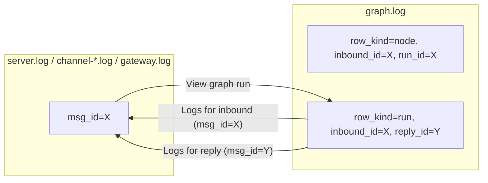

## Issue

 currently the graph log is keyed by a run_id. and the other logs group - server, channels, gateway, etc... they identify a message id to filter messages. i am just thinking of few things:
- is message id now a thing that needs to be tracked?
- how can we link graph run to a message id, in other words, how to click from graph log page on a certain graph run, and get all log lines related to the message and its reply and its progress across the network?
- ideally, i want to go smoothly between the 2 graphs, for debugging, tracking. also i dont want to keep accumulating ids that are no longer needed (refactoring)
- do we need to add a reference from the server log or other logs, back to the graph log? just to allow for going back from server to graph log pages?
just throwing ideas, waiting for opinion, dont be too verbose plz. focus on goal/answers.

Good catch — but you actually have less to add than you think.

## The bridge already exists

`run_id` is just a thin wrapper around the inbound message id:

- `agent_manager.py` builds `ledger_run_id = f"chat-{msg.routing.id}"`.
- That same `msg.routing.id` is the `msg_id` value the operational logs scope by (`log_scope(msg_id=_mid, …)`).
- Every ledger row already carries `inbound_id` (= `msg_id`).

So `inbound_id ≡ msg_id`. There's no new id to track. The `chat-` prefix is decoration, not identity.

## Answers

1. **Is message id a new thing to track?** No. It's `inbound_id` in the ledger and `msg_id` in operational logs — the same value, two names. Already in every row of both surfaces.

2. **Graph Run → operational logs.** No new column. From the Run inspector header build two deep links to the existing Logs page: one filtered by `msg_id=<inbound_id>` (the user turn), one by `msg_id=<reply_id>` (the assistant reply). The Logs page already supports `msg_id` filtering (`LogsService.search_filtered`), so this is purely UI.

3. **For that to work, the aggregate run row needs `reply_id`.** Right now node rows don't carry it (the assistant message doesn't exist until `reply_completed`). Add it as one more column populated by the orchestrator's outer `try/finally` (it's in `messages.metadata.agent.reply_id`). Without it the "logs for the reply" link can't be built.

4. **Operational logs → Graph Run.** Also no new column. The operational row already has `msg_id`; the admin Logs page just needs a small action button "View graph run" that deep-links to `/graph-runs/<msg_id>` (or to the empty-state if no ledger rows exist for that id — gateway lifecycle / server boot won't have any). One-way derivation, zero schema change in `server.log` / `channel-*.log` / `gateway.log`.

5. **Refactor opportunity (no-BC mode):** drop the `chat-` prefix entirely and let `run_id == inbound_id`. One id, one column, no string juggling. The LangSmith uuid is derived (`uuid5(NAMESPACE_URL, run_id)`) — re-deriving from the bare id just produces a different (but still stable) uuid going forward, fine in no-BC mode.

## Diagram

## TL;DR

- **No new id.** `inbound_id` (ledger) ≡ `msg_id` (logs). Bridge already exists.
- **Add `reply_id` to the aggregate run row** — it's the only missing piece for the reply-side pivot.
- **Two UI affordances, no schema changes elsewhere:** Graph inspector → pre-filtered Logs page (by inbound and reply `msg_id`); Logs row → Graph Run inspector (by `msg_id`).
- **Don't add `run_id` back to operational logs** — it would be `chat-{msg_id}`, pure redundancy.
- **Bonus simplification (no-BC mode):** drop `chat-` and make `run_id == inbound_id`. One id wins.