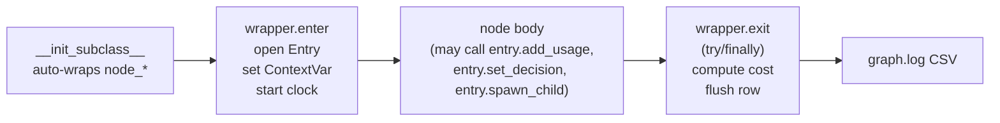
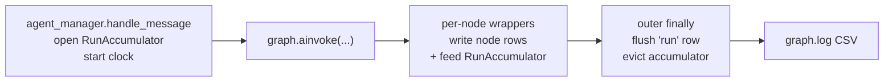

# Graph Execution Ledger — Requirements & Design

## Request

Track agent-graph activity as an analytical ledger so we can answer:

- How long did each important node take?
- How many tokens did each model call burn, and what did it cost?
- Which message / channel / device / character / model is each row tied to?
- Where did a slow or expensive run go (per-node timeline for one `run_id`)?

The ledger is a **new surface** alongside existing logs and persisted message
metadata. It must not duplicate either, must not require nodes to know about
file paths or schemas, and must be small enough to live next to existing log
files in the workspace.

We are in initial-development mode (no backward compatibility, no migration,
no wrappers).

## Boundary vs Existing Surfaces

| Surface | Owns | Granularity | Lifetime |
|---|---|---|---|
| `server.log` / `channel-*.log` (CSV) | operational narrative, errors, transitions | line per transition/error | log rotation |
| `messages.metadata.agent` | aggregate per-run snapshot for chat UI | one per run | with the message |
| Graph events on the bus (`graph.*`) | drive CommManager persistence + outbound | one per hop, ephemeral | not stored |
| LangSmith | full I/O traces (prompts, tool args, responses) | per node, with payload | external |
| **Graph Execution Ledger (new)** | per-node metrics: timing, usage, cost, decision, identity | one row per node call | log file (rotation later) |

Two boundary rules that keep this from drifting:

1. **No payloads.** No prompt text, no tool args, no responses, no exception
   stack traces. Anything that's prose belongs elsewhere (LangSmith for I/O,
   `server.log` for stack traces).
2. **No double-role for events.** The graph event bus stays focused on
   CommManager side-effects. The ledger reads from inside the node via a
   contextvar entry, not from the event bus.

## Storage & Format

- **Format:** CSV (same family as `server.log` / `channel-*.log`), rendered
  by extending the existing `Logger.add_file_sink` so the column header is
  caller-supplied instead of hard-coded to `_CsvRenderer.HEADER`.
- **Path:** `<workspace>/logs/graph.log` (workspace-scoped, beside
  `channel-*.log`).
- **Rotation:** deferred. Same global rotation policy that will eventually be
  applied across all log files.
- **One row per node call.** Retries inside a node (e.g. `call_model` invoked
  twice in a tool loop) are separate rows with the same `run_id` and an
  incremented `step_index` / `node_attempt`.

### Column Schema

A single fixed, flat schema. Every column is intended to map 1:1 to a future
SQLite column when an ingester is added.

| Column | Type | Notes |
|---|---|---|
| `ts` | float (unix epoch) | sub-second; matches existing log convention |
| `run_id` | string | `chat-<inbound_id>` (see LangSmith section) |
| `step_index` | int | monotonic within `run_id` |
| `node` | string | node method name (`call_model`, `tools/<tool_name>`, …) |
| `node_attempt` | int | 1-based; >1 for in-loop retries |
| `branch_index` | int or empty | set for `Send`-fan-out children (per-branch order) |
| `status` | enum | `ok` / `error` / `cancelled` / `skipped` |
| `elapsed_ms` | int | wall-clock from wrapper enter → exit |
| `inbound_id` | string | inbound user message id |
| `chat_channel_id` | int | |
| `device_id` | string | empty if not resolvable |
| `user_id` | string | empty if not resolvable |
| `character_id` | string | resolved character for the run |
| `provider` | string | LLM/TTS/STT provider id (empty for non-model nodes) |
| `model` | string | model id (empty for non-model nodes) |
| `input_tokens` | int | LLM input |
| `output_tokens` | int | LLM output |
| `cached_input_tokens` | int | LLM cached input |
| `reasoning_tokens` | int | LLM reasoning |
| `tts_chars` | int | TTS only (OpenAI `tts-1`/`tts-1-hd` formula input) |
| `tts_text_tokens` | int | TTS text-prompt tokens from provider ``usage_metadata`` (Gemini TEXT modality / OpenAI ``input_token_details`` when present) — required to price Gemini TTS and the recommended path for OpenAI ``gpt-4o-mini-tts`` |
| `tts_audio_tokens` | int | TTS generated-audio tokens from provider ``usage_metadata`` (Gemini AUDIO modality on ``candidatesTokensDetails``) — required to price Gemini TTS |
| `stt_audio_seconds` | float | STT only (OpenAI ``whisper-1`` formula input) |
| `stt_audio_tokens` | int | STT audio-prompt tokens from provider ``usage_metadata`` (OpenAI ``input_token_details.audio_tokens`` / Gemini AUDIO modality on ``promptTokensDetails``) — required to price token-billed STT models (``gpt-4o-transcribe``, Gemini 3.x). Persisted but not yet wired into cost (placeholder for ``estimate_stt_usage_cost``). |
| `cost_usd` | float | computed at write time, see Cost Snapshot |
| `pricing_version` | string | `catalog_version` + `:` + 12-char SHA-256 of sorted model pricing payloads (single cell; repricing/debug ID) |
| `decision_kind` | string | bounded enum, see Decision Field |
| `decision_detail` | string | short slug; never prose |
| `error_code` | string | short slug only; full trace stays in `server.log` |

Columns that don't apply to a given node are written as empty strings.

## Writer Architecture

Three components, separated cleanly:



### 1. Auto-wrap via `__init_subclass__`

Adopted from rewayatai's `pre_node` pattern (see `docs/langgraph_tips.md`
item 1). On subclass declaration, every `node_*` method is wrapped:

- supports both sync and async node methods
- guards against double-wrap with a `_is_pre_node_wrapped` sentinel
- calls cancel check (when external-cancel is wired later)
- opens the ledger entry, runs the body, flushes the row in a strict
  `try/finally`

The wrapper itself is universal — every node is wrapped, no exceptions.
Whether a row is **flushed** is driven by the per-node decorator (next
section). Unmarked nodes are still wrapped (cancel + timing for in-process
debug) but write nothing.

### 2. `@graph_logged(...)` marker — node authority

A small decorator on node methods declares what the wrapper should capture
and write:

```python
@graph_logged()                                  # timing + status + identity
def ingest(self, state, *, writer): ...

@graph_logged(captures={"usage", "decision"})    # also pulls usage / decision
def call_model(self, state, *, writer): ...

@graph_logged(captures={"decision"})             # decision-only
def tts(self, state, *, writer): ...
```

- Without the decorator → no row.
- Decorator without captures → row with timing + status + identity only.
- `captures` selects which optional column groups get populated from the
  ContextVar entry.

This is the discipline knob: it keeps the ledger free of dummy/noisy node
rows without having node code know about the writer.

### 3. ContextVar entry — the bridge from body to wrapper

```
current_entry: ContextVar[LedgerEntry]
```

- **Wrapper enter:** create a `LedgerEntry`, prefill identity from `state` +
  `RunnableConfig`, `token = current_entry.set(entry)`, start clock.
- **Node body:** if it has anything to contribute, calls
  `entry.add_usage(...)`, `entry.set_decision(kind, detail)`,
  `entry.spawn_child(node="tools/search", ...)` for sub-step rows.
- **Wrapper exit (finally):** stamp `elapsed_ms` and `status`, compute cost,
  write the row, write any child rows (with their own `step_index`), reset
  the contextvar token. Re-raise any exception unchanged.

`spawn_child` is how the `tools` node logs one row per tool call instead of
one row per node visit, and how `call_model` logs one row per LLM call when
it retries inside a single node visit.

## Per-node Logging Policy

Initial set. Add the decorator to these; everything else stays unmarked
until proven useful.

| Node | Decorator | Why |
|---|---|---|
| `ingest` | none initially | deterministic split; rarely interesting |
| `stt` (per `Send` branch) | `@graph_logged(captures={"usage","decision"})` | duration + provider cost + ok/silence/error |
| `vision` (per `Send` branch) | `@graph_logged(captures={"decision"})` | duration + ok/skipped |
| `gather` | none | pure aggregation |
| `memory_in` | none | local read |
| `context_build` | none initially | no decision, no cost; revisit if latency matters |
| `call_model` | `@graph_logged(captures={"usage","decision"})` | the cost+latency hotspot; per-attempt rows |
| `tools` (per tool call via `spawn_child`) | `@graph_logged(captures={"decision"})` | one row per tool invocation |
| `memory_out` | none | local write |
| `tts` | `@graph_logged(captures={"usage","decision"})` | provider cost + voiced/skipped reason |
| `finalize` | `@graph_logged(captures={"decision"})` | terminal status (`completed`/`failed`) |

Adding/removing nodes from this list is a one-line decorator change — no
schema, plumbing, or admin UI change required.

## Decision Field

A **decision** is the bounded, non-obvious branching outcome of a node — the
answer to "why did the run take this path", expressed as metadata.

Two columns, both short:

- `decision_kind` — short enum slug
- `decision_detail` — short slug or short bounded string (tool name,
  reason slug). Never prose, never user content.

| Node | `decision_kind` examples | `decision_detail` examples |
|---|---|---|
| `stt` | `transcribed` / `silence` / `provider_error` | provider id |
| `vision` | `described` / `skipped_unsupported` | content type |
| `call_model` | `text_reply` / `tool_call` / `refusal` / `empty` | tool name (when `tool_call`) |
| `tools/<name>` | `ok` / `client_error` / `server_error` / `timeout` | result-kind slug |
| `tts` | `voiced` / `skipped_pref` / `skipped_no_voice` / `provider_error` | provider id |
| `finalize` | `completed` / `failed` | failure-class slug |

Two rules:

- **Slugs only.** If it requires escaping or wrapping, it doesn't belong here.
- **Bounded cardinality.** Anything that could legally take "any string the
  model produced" is wrong. `GROUP BY decision_kind` must remain meaningful.

## Cost Snapshot

- Computed **at row write time** by the wrapper, using existing
  `ModelCatalog.estimate_token_usage_cost` /
  `ModelCatalog.estimate_tts_usage_cost` (and an STT analogue when STT cost
  is wired).
- **Always store the raw counts** (token / character / second columns) in
  addition to `cost_usd`, so a future repricing job can recompute.
- Raw counts required by `docs/model_pricing.md` are persisted per row:
  - LLM (chat) — `input_tokens`, `output_tokens`, `cached_input_tokens`, `reasoning_tokens`.
  - TTS OpenAI `tts-1`/`tts-1-hd` — `tts_chars`.
  - TTS OpenAI `gpt-4o-mini-tts` — `tts_text_tokens` (preferred) or `input_tokens` (legacy
    fallback) + `tts_audio_seconds`.
  - TTS Gemini — `tts_text_tokens` (TEXT modality on `promptTokensDetails`) +
    `tts_audio_tokens` (AUDIO modality on `candidatesTokensDetails`); both come from
    provider ``usage_metadata`` via `hiro_commons.llm_usage.modality_token_count`.
  - STT OpenAI `whisper-1` — `stt_audio_seconds`.
  - STT OpenAI `gpt-4o-transcribe*` and Gemini 3.x — `stt_audio_tokens` (AUDIO modality
    on prompt details / `input_token_details.audio_tokens`) + `output_tokens`. *Persisted
    today; pricing wire-up is a follow-up.*
- `pricing_version` is a stable fingerprint of the bundled catalog pricing
  snapshot at write time: `{catalog_version}:{hash12}`, where `hash12` is the
  first 12 hex characters of SHA-256 over JSON of every model's `id` + `pricing`
  (sorted, compact separators). Implementation: ``ModelCatalog`` in
  `hirocli/domain/model_catalog.py`. The colon is intentional (one CSV field),
  not multiple columns concatenated by mistake.
- If pricing is unavailable for a (provider, model) at write time:
  `cost_usd` empty, `pricing_version` empty, `decision_detail` may carry
  a slug like `pricing_missing`. The row still writes — the analytics view
  will surface unpriced rows.

This matches the explicit decision in conversation: historical price
backfill is out of scope (LangSmith does not do it either); the artefact we
keep is the catalog version, not a frozen price table.

## LangSmith Linkage

- **Generate `run_id` per turn** at the entry to `agent_manager` /
  `chat.py`'s `ainvoke`: `run_id = f"chat-{inbound_id}"` (or a UUID5 of it
  if a strict UUID is required by LangSmith at the moment of writing).
- **Pass it via `RunnableConfig`** along with `run_name="chat"` and useful
  tags (`character:<id>`, `chat_channel_id:<id>`, `voice_input:<bool>`).
  This is `langgraph_tips.md` item 3 and is a prerequisite for ledger rows
  to be correlatable to LangSmith.
- **Store `run_id` in every ledger row.** Do **not** store the LangSmith
  URL. The admin API exposes **GET `/graph-runs/{run_id}`** for ledger rows
  only, and **GET `/graph-runs/{run_id}/langsmith-url`** for the browser link
  so the node timeline is not blocked on LangSmith latency. Resolution uses
  **langsmith** ``Client().read_run`` on
  **UUID5(NAMESPACE_URL, ledger `run_id`)** (same id as ``RunnableConfig["run_id"]``), then
  ``run.url`` or ``get_run_url``. Requires ``LANGCHAIN_API_KEY`` / ``LANGSMITH_API_KEY``;
  returns no URL if the run is not in LangSmith yet. One LangSmith HTTP round-trip
  per langsmith-url request (the SPA fires it after rows load).

## Admin UI Surface

A new admin page (working name: **Graph Runs** or **Agent Runs**), separate
from the Logs page.

- Same tail-by-offset mechanics as the Logs page (reuse `LogTailTool` /
  the file-offset polling) over `graph.log`.
- Renders rows as a **table**, not as log lines. Fixed columns mirror the
  CSV header.
- Two views from the same stream:
  - **Live ledger** — newest first, filterable by `chat_channel_id`,
    `character_id`, `model`, `decision_kind`. Default window: last
    24 hours. This satisfies the "we mostly need recent transactions"
    requirement.
  - **Run inspector** — clicking a `run_id` opens an ordered timeline
    (rows for that `run_id` sorted by `step_index`, sub-steps grouped
    under their parent). Includes an **Open in LangSmith** button built
    from `run_id` + workspace prefs.

The existing Logs page stays untouched. The new page imports a new
`GraphLedgerService` (sibling of `LogsService`) for reads.

## ContextVar Discipline

Implementer checklist — all of these must hold or the writer is unsafe:

1. **`try/finally` in the wrapper.** The row must flush on healthy
   completion, body exception, early return, and `asyncio.CancelledError`.
   Exceptions must propagate after the row writes.
2. **One entry per node call.** No stacks. Sub-step granularity is achieved
   via `entry.spawn_child(...)`, which writes a sibling row sharing
   `run_id` with its own `step_index`.
3. **Re-enter per `Send` branch.** The wrapper opens a fresh entry on every
   call. `Send`-fan-out children each get their own entry; `branch_index`
   distinguishes them.
4. **Sentinel against double-wrap.** Mirror rewayatai's
   `_is_pre_node_wrapped` so subclass overrides don't double-wrap.
5. **No raw threads inside node bodies.** Standard `contextvars` propagate
   across `await` and `asyncio.create_task`, but not to `threading.Thread`.
   If a future node must spawn a thread, copy the context explicitly.
6. **Test the four cancel paths:** healthy completion, body raises, body
   returns early, `CancelledError`. Each must produce exactly one parent
   row with the expected `status`.

## Out of Scope (Defer)

- SQLite ingester / dashboards beyond the live last-24h view. The CSV
  schema is designed so this is a one-shot future job.
- Per-sink rotation tuning. Will be set globally for all logs in a
  separate pass.
- External cancel API + LLM-call abort callback (`langgraph_tips.md`
  items 2 + 10). Independent track; the ledger only needs to handle
  `CancelledError` correctly when it does arrive.
- Subgraph composition, friendly node names, `TAG_HIDDEN`, deep-merge
  state reducers — separate tracks from `langgraph_tips.md`.
- Historical repricing. Catalog version is recorded; no recompute job is
  built.

## Implementation Touch Points

- `hiroserver/hiro-commons/src/hiro_commons/log.py` — extend
  `Logger.add_file_sink` to accept a caller-supplied CSV column list and
  write that header on first open. Existing `_CsvRenderer` stays for
  operational logs; add a thin sibling renderer (or parametrize the
  existing one) that writes a fixed flat row from a dict using the
  caller's column order.
- `hiroserver/hirocli/src/hirocli/runtime/agent_graph/ledger.py` (new) —
  `LedgerEntry` dataclass, `current_entry` ContextVar, `graph_logged`
  decorator, `LedgerSink` (open the workspace `graph.log`, write rows).
- `hiroserver/hirocli/src/hirocli/runtime/agent_graph/base.py` — add
  `__init_subclass__` auto-wrap (`pre_node`-style) that consults the
  decorator marker and drives the ContextVar entry; mark the nodes listed
  in the policy table with `@graph_logged(...)`. No changes to event
  emission.
- `hiroserver/hirocli/src/hirocli/runtime/agent_graph/chat.py` /
  `hiroserver/hirocli/src/hirocli/runtime/agent_manager.py` — at
  `ainvoke`, build `RunnableConfig` with `run_id = f"chat-{inbound_id}"`,
  `run_name="chat"`, and tags. Open the workspace ledger sink at server
  start (alongside `Logger.open_log_dir`).
- `hiroserver/hirocli/src/hirocli/domain/model_catalog.py` — expose ``pricing_version``
  as `{catalog_version}:{hash12}` (see Cost Snapshot above) so the ledger can stamp
  it on every priced row.
- `hiroserver/hirocli/src/hirocli/admin/features/graph_runs/` (new) —
  `GraphLedgerService` (tail / filter / by-run-id reads of `graph.log`),
  admin route, list/inspector responses.
- `admin_frontend/src/lib/features/graph-runs/` (new) — Live ledger table,
  Run inspector view, "Open in LangSmith" link built from `run_id` +
  workspace prefs.
- Tests:
  - `runtime/agent_graph/tests/test_ledger.py` — wrapper writes one row
    per call (4 cancel paths), `spawn_child` produces sibling rows,
    `Send` fan-out gets distinct `branch_index` values, double-wrap
    sentinel works, contextvar token resets.
  - `admin/features/graph_runs/tests/test_service.py` — tail, filter
    by channel/character/model/decision, by-run-id timeline assembly.
  - `domain/test_model_catalog.py` — `pricing_version` stable across
    reads of the same catalog state, changes when catalog mutates.

## Build Reflection

- New workspace log file: `<workspace>/logs/graph.log` will appear after
  the first server start on this branch. No action required from the
  operator; existing workspaces just gain the file.
- `Logger.add_file_sink` gains a new optional parameter; all existing
  callers keep working unchanged because the parameter is optional.
- No config-file changes, no workspace reset, no breaking changes for
  device apps or gateways. (Per workspace rule
  `no-backward-compatibility`: confirmed no-BC mode applies but no
  breaking changes were needed here.)

---

# Addendum — Two-Level Ledger (Run + Node)

This section extends the original design after the first implementation
landed. The original sections above still describe the per-node writer
correctly; this addendum adds a **per-run aggregate row** in the same file
and the few schema and writer changes that follow.

(Per workspace rule `no-backward-compatibility`: this is a forward-only
change. Pre-existing rows in `graph.log` from earlier runs simply lack the
new columns and an empty `row_kind`; readers should treat empty `row_kind`
as `node`.)

## Motivation

Looking at real `graph.log` output it became clear the admin UI needs two
zoom levels, not one:

- **Runs list** — one row per turn, showing aggregate cost / tokens /
  latency / status with denormalized identity (channel, character,
  device, user). This is what the operator scans first.
- **Run inspector** — when an interesting run is clicked, drill into the
  per-node rows for that `run_id`, with identity hidden because the
  header already shows it.

Reusing the same CSV file (one writer, one tail, one offset poll) keeps
the implementation small.

## Schema Changes

One new discriminator column and three new payload-adjacent columns. All
strictly bounded.

| Column | Type | Notes |
|---|---|---|
| `row_kind` | enum: `node` / `run` | new discriminator. Empty = `node` for legacy rows. |
| `input_preview` | string, ≤140 chars | aggregate-only; user turn text, capped, never truncated mid-grapheme if avoidable |
| `output_preview` | string, ≤140 chars | aggregate-only; assistant reply text, capped |
| `tts_audio_seconds` | float | also added now to fix the per-node TTS-repricing gap (the field was captured but never persisted) |

`row_kind` is the canonical filter for both views (`WHERE row_kind='run'`
for the list, `WHERE run_id=X` for the inspector). `node` value remains
informational and can stay `@run` or empty on aggregate rows.

Updated `GRAPH_LEDGER_COLUMNS` (insertion points only — column order at
implementer's discretion):

- after `status`: `row_kind`
- after `tts_chars`: `tts_text_tokens`, `tts_audio_tokens`, `tts_audio_seconds`
- after `stt_audio_seconds`: `stt_audio_tokens`
- after `decision_detail`: `input_preview`, `output_preview`

## Run-Row Population

Per-run aggregate row contents (only the columns that differ from the
node-row contract):

| Column | Aggregate value |
|---|---|
| `row_kind` | `run` |
| `node` | `@run` (or empty) |
| `step_index`, `node_attempt`, `branch_index` | empty |
| `ts` | run end timestamp |
| `status` | terminal: `completed` / `failed` / `cancelled` |
| `elapsed_ms` | **wall-clock** from outer enter → outer exit (not the sum of node `elapsed_ms`, which would hide parallelism) |
| identity (`inbound_id`, `chat_channel_id`, `device_id`, `user_id`, `character_id`) | denormalized, same as node rows |
| `provider`, `model` | the **primary `call_model`** provider/model (the one driving the text reply). Other model calls in the run are visible only in the per-node drill-down. |
| `input_tokens`, `output_tokens`, `cached_input_tokens`, `reasoning_tokens` | sum across all `call_model` rows in the run |
| `tts_chars`, `tts_text_tokens`, `tts_audio_tokens`, `stt_audio_seconds`, `stt_audio_tokens`, `tts_audio_seconds` | sum across the run |
| `cost_usd` | **sum of per-node `cost_usd`** — never recomputed from token sums (avoids rounding drift across pricing-version boundaries) |
| `pricing_version` | `{catalog_version}:{hash12}` snapshot on priced nodes (typically same across a run unless catalog reload mid-run) |
| `decision_kind` / `decision_detail` | terminal reason (e.g. `completed`/`text_reply`, `failed`/`provider_error`) |
| `error_code` | empty on success; failure-class slug on `failed` / `cancelled` |
| `input_preview` | first ≤140 chars of the user turn text |
| `output_preview` | first ≤140 chars of the assistant reply text |

### Preview Boundary

Previews are a **hard-capped UI hint**, not a payload. Rules:

- ≤140 chars (treat like `unified_message_text_preview` in the SDK).
- Trim whitespace; collapse interior whitespace to single space.
- For multimodal turns, prefer the typed text; fall back to STT
  transcript joined with `· ` separators.
- Never include tool args, tool results, or model reasoning content.

Full I/O remains LangSmith's territory via the existing run-id deep link.

## Writer Architecture

The aggregate row is written by the **orchestrator's outer
`try/finally`**, not by `finalize_node`. This gives:

- One row per run guaranteed (success, exception, `CancelledError`).
- True wall-clock `elapsed_ms` measured around `ainvoke`.
- `finalize_node` stays a per-node concern.



### `RunAccumulator`

A small per-run object held in a contextvar (or passed explicitly through
`RunnableConfig.configurable`). The per-node wrapper calls into it on
every `finally` to fold per-node values into the aggregate.

State carried:

- `run_id` (key), `started_at` (perf_counter), denormalized identity
- running totals: tokens (4 fields), `tts_chars`, `tts_text_tokens`,
  `tts_audio_tokens`, `stt_audio_seconds`, `stt_audio_tokens`,
  `tts_audio_seconds`, `cost_usd`
- `primary_model` / `primary_provider` — set the first time a
  `call_model` row reports usage; subsequent `call_model`s do not
  overwrite (the first is the text-reply driver in the current graph
  shape; revisit if a future graph routes to a smaller model first)
- latest `pricing_version` seen
- terminal `status`, `decision_kind`, `decision_detail`, `error_code`
  (set by orchestrator from the success/exception path)

### Eviction Replaces the Class-Level Counters

The accumulator's lifecycle ends at the outer `finally`. At that point
the orchestrator:

1. fills the run row from the accumulator,
2. asks the sink to flush it (same CSV writer path as node rows),
3. **evicts** the accumulator and the per-`run_id` entries from
   `LedgerSink._step_indexes` / `_attempt_indexes`.

This single change closes the unbounded-state issue identified in the
implementation review: counters now have a defined end-of-life tied to
`graph.run.completed` / `graph.run.failed` / cancellation, instead of
living on the class until process exit.

## Admin UI — Two Levels Over One File

Same tail-by-offset infra as the original design.

| View | Source | Filter | Columns shown |
|---|---|---|---|
| **Runs list** (default) | `graph.log` | `row_kind = 'run'` (last 24h default) | identity + aggregate metrics + previews + LangSmith link |
| **Run inspector** | same file | `run_id = X`, ordered by `step_index` | per-node columns; identity hidden (header carries it); spawn-children grouped under their parent |

Identity stays denormalized in storage; the inspector view simply
suppresses the repeated columns at render time.

## Failure Semantics

| Outer outcome | Aggregate row written | `status` | `error_code` |
|---|---|---|---|
| `finalize_node` ran, text reply produced | yes | `completed` | empty |
| Exception inside any node | yes | `failed` | short slug from exception class |
| `asyncio.CancelledError` propagated through `ainvoke` | yes (then re-raised) | `cancelled` | `cancelled` |

Crashed runs no longer disappear from the list view.

## Implementation Touch Points (Delta)

Additive to the original "Implementation Touch Points" section:

- `hiroserver/hirocli/src/hirocli/runtime/agent_graph/ledger.py`
  - extend `GRAPH_LEDGER_COLUMNS` with `row_kind`, `tts_text_tokens`,
    `tts_audio_tokens`, `tts_audio_seconds`, `stt_audio_tokens`,
    `input_preview`, `output_preview`
  - add `RunAccumulator` dataclass + contextvar
  - add `LedgerSink.write_run_row(accumulator, *, status, error_code,
    decision_kind, decision_detail, input_preview, output_preview)`
  - add `LedgerSink.evict_run(run_id)` for the orchestrator to call
    after the run row flushes
  - per-node wrapper's `finally`: fold node values into the
    accumulator if one is bound to the contextvar
- `hiroserver/hirocli/src/hirocli/runtime/agent_manager.py`
  - around `ainvoke`: open `RunAccumulator(run_id=ledger_run_id, ...)`,
    bind to contextvar, start wall-clock
  - in `finally`: derive terminal `status` / `error_code` /
    `decision_kind` / `decision_detail` from the outcome, build
    `input_preview` / `output_preview` (capped, whitespace-normalized),
    call `sink.write_run_row(...)`, then `sink.evict_run(run_id)`
- `hiroserver/hirocli/src/hirocli/admin/features/graph_runs/service.py`
  - add `row_kind` to filter pipeline; `tail_initial` returns
    aggregate-only by default
  - `inspect_run(run_id)` returns `node`-kind rows for the timeline and
    the latest aggregate row (`row_kind=run`) for the run-detail header (single CSV read).
- `admin_frontend/src/lib/features/graph-runs/`
  - tabbed layout: runs list vs run tab — header shows every ledger field
    on the aggregate row; node rows in a spreadsheet-style table (`GRAPH_RUN_NODE_TABLE_FIELDS`).
- Tests:
  - aggregate row written on success / exception / `CancelledError`
  - `RunAccumulator` correctly evicts `LedgerSink` per-run state
  - cost equals sum of per-node `cost_usd` (not a recompute from token
    sums)
  - preview cap is enforced (≤140 chars after whitespace normalization)
  - `row_kind` filter returns the right population for each view

## Build Reflection (Delta)

- `graph.log` rows written before this change have empty `row_kind`,
  empty `tts_audio_seconds`, empty `tts_text_tokens` / `tts_audio_tokens`
  / `stt_audio_tokens`, and empty `input_preview` / `output_preview`.
  Readers must treat empty `row_kind` as `node` so historical rows still
  appear in the inspector. No file truncation needed.
- No workspace reset, no config change. New columns are additive in
  CSV; existing tooling that reads by header name keeps working.
