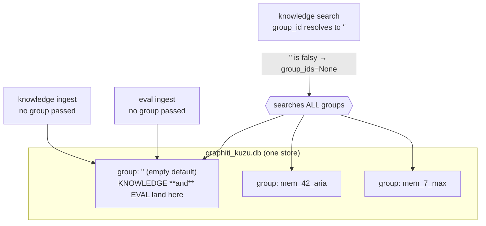
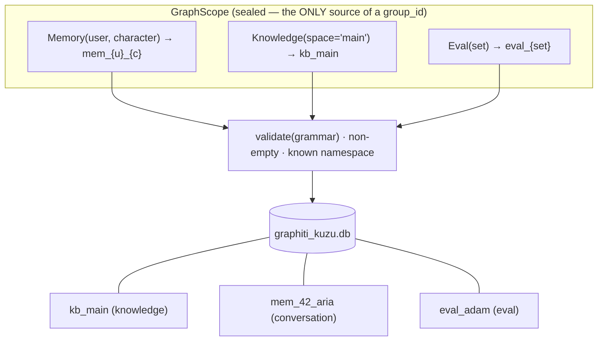

# Graph Group-ID Policy — Firm Partitioning for One Kuzu Store

> **Tracker doc (single source).** Design for a **firm `group_id` policy** over the one
> shared Graphiti + Kuzu store. Today three verticals — **conversation memory**,
> **document knowledge**, and **eval** — share one store partitioned by `group_id`, but
> only conversation memory has a *named, validated* partition (`mem_{user}_{character}`).
> Knowledge and eval both fall into Graphiti's **empty-string default group** on Kuzu,
> which (a) leaks across verticals and (b) is a silent catch-all for any forgotten write.
> This doc makes every partition **minted from a typed scope against a closed grammar**,
> so a leak becomes structurally impossible rather than merely fixed.
>
> **Companions:** [`memory-graphiti-replacement-design.md`](memory-graphiti-replacement-design.md)
> (the mem0→Graphiti replacement that introduced `mem_{user}_{char}` and the one-store model),
> and [`knowledge-scoping-design.md`](knowledge-scoping-design.md) (a *different* axis —
> per-speaker **retrieval** scoping, not the storage partition this doc owns).
>
> **Mode:** initial development — **no backward compatibility / no migration / no wrappers**
> (repo rule, explicitly abided). Switching knowledge from the empty default group to a named
> group **orphans the existing graph** → a one-time **knowledge-graph rebuild**, not a migration.
>
> **Status:** Phase A **landed** (backend + tests green). Admin UI button for eval-clear and
> mintdocs pages are the remaining follow-ups; eval graph-isolation (Phase A-bis) and KB spaces
> (Phase B) deferred.

---

## 1. The one-paragraph version

The store is **one Kuzu DB**; `group_id` is the partition. Conversation memory already uses
a named, validated partition (`mem_{user}_{character}`). Knowledge and eval do **not** — they
both resolve to `get_default_group_id(provider)`, which on Kuzu is the **empty string `""`**.
Because `""` is falsy, knowledge **search** drops to `group_ids=None` and graphiti searches
**every** group — so a knowledge query returns other users' private `mem_*` conversation
facts. The fix is not a rename; it is a **policy**: groups can only be **minted from typed
`GraphScope` constructors** validated against a **closed grammar**, reads must **name their
targets** (no "falsy means all"), and writes are **guarded** against an empty/unknown group.
Knowledge becomes `kb_{space}` (one named space, `kb_main`, today), eval becomes `eval_{set}`.

---

## 2. Where we are today — one named partition, two unnamed



**Root cause (verified in code):**

| Fact | Location |
|---|---|
| Kuzu default group is `""` | `graphiti_core/helpers.py::get_default_group_id` → `''` for non-FalkorDB |
| Knowledge service group = `""` | `graphiti_service.py` ctor: `self._group_id = group_id or get_default_group_id(driver.provider)`; `from_preferences` never passes a group |
| Eval shares `""` | `eval_runner.py` builds the service via `from_preferences` with no group |
| **Search leak** | `graphiti_search.py`: `group_ids=[group_id] if group_id else None` → `""` falsy → `None` → all groups |
| Tests hide it | every test pins a **truthy** literal (`"knowledge"`, `"grp"`, `_database="knowledge"`), so the real `""` default's falsy branch is never exercised |

---

## 3. Where we're going — every partition is named & minted



No code path constructs a `group_id` string directly; it can only obtain one from a
`GraphScope`. There is **no default, no empty, no falsy-means-all**.

---

## 4. The namespace registry (closed grammar)

A single registry is the source of truth for every legal group shape. Adding a vertical =
adding a row, not sprinkling string literals.

| Namespace | Grammar | Granularity unit | Cross-group read? | Rationale |
|---|---|---|---|---|
| **Conversation** | `mem_{user_id}_{character}` | per `(user, character)` | yes (a user's chars) | dedup/supersession isolated per relationship. **Exists today.** |
| **Knowledge** | `kb_{space}` (default `kb_main`) | per **corpus/space** (one today) | no (Phase A) | the graph's value *is* cross-document fact merging — never silo per-document. Doc-level ops stay at the episode layer (`source_description == document_id`). |
| **Eval** | `eval_mem_{set}` / `eval_kb_{set}` (`+_{run}` optional, later) | per **eval set × track** | yes (clear-all, by `eval_` prefix) | one `eval_` roof over both tracks (memory + knowledge), structurally separate from real `mem_`/`kb_`; wipes by prefix. Routing → [`eval-corpus-tracks-design.md`](eval-corpus-tracks-design.md). |

```
group_id   := namespace "_" part ("_" part)*
namespace  := "mem" | "kb" | "eval_mem" | "eval_kb"   # closed set; fixed leading token(s)
part       := slug( value )              # coerced to graphiti's [A-Za-z0-9_-]; "_"-joined
```

Eval is one `eval_` roof with a per-track token (`eval_mem_`, `eval_kb_`). Both begin with `eval_`,
so they are disjoint from real `mem_`/`kb_` — an `eval_mem_…` group never matches the `mem_` prefix.

**Disjointness invariant:** the leading tokens (`mem_`, `kb_`, `eval_`) never overlap, so
every group belongs to **exactly one** vertical. A character literally named "eval" still
lives under `mem_42_eval` — the leading token disambiguates. **Trailing-separator
enumeration** (`mem_42_`) can't bleed into a sibling (`mem_420_`).

> `kb_main` is a **named, intentional** space — fundamentally unlike `""`. It is typed,
> validated, and cannot silently catch a forgotten write.

### 4.1 Logical display names

UIs (the Graph-tab selector) show a group's **logical name**, never the raw id. The mapping is
defined once in the policy module (`group_scope.group_label`) so naming is consistent
everywhere:

| group_id | Logical name |
|---|---|
| `kb_main` | **Knowledge** |
| `kb_{space}` | **Knowledge · {space}** |
| `mem_{user}_{character}` | **Memory · {character} (user {user})** |
| `eval_mem_{set}` | **Eval · Memory · {set}** |
| `eval_kb_{set}` | **Eval · Knowledge · {set}** |
| anything else (legacy / unknown, e.g. `mem:1:hiro`) | the **raw id** (still selectable/removable) |

**Enumeration is by presence, not a registry** (§7 lean): a partition appears in the selector
only once it has episodes (`DISTINCT Episodic.group_id`). There is **no empty named partition** —
`kb_main` is a write/read *target constant*, not a declared entity, so it surfaces only after
knowledge is ingested. Consequently the Graph tab simply **lists the groups that exist** and shows
the selected one (**default = first in the list; last selection remembered**) — no privileged
"knowledge is home" default.

---

## 5. The `GraphScope` abstraction

```
GraphScope (sealed)
 ├ Memory(user_id, character_id)        → "mem_42_aria"
 ├ Knowledge(space = "main")            → "kb_main"
 ├ EvalMemory(set_id)                   → "eval_mem_adam"
 └ EvalKnowledge(set_id)                → "eval_kb_adam"

  .group_id            → validated string (WRITE target — always exactly one)
  .read_targets()      → list[str]      (READ targets — one, or enumerated)
```

- **Writes take one concrete scope.** The **guard** lives at the write boundary
  (`ingest_chunks` / `ingest_episodes`): a resolved write group that is empty or not a
  registered grammar → **raise**. *This guard is the real fix; the rename is cosmetic
  without it.*
- **Reads take a `ReadScope`**: a single scope, an enumerated set, or an explicit
  `AllGroups` capability. There is **no** `None`-means-all. The current
  `[group_id] if group_id else None` falsy path becomes unrepresentable.

---

## 6. Enforcement invariants — the "no leak" proof

| Invariant | Leak it kills |
|---|---|
| Groups only from typed `GraphScope` constructors | no stray write can land in a catch-all (there's nothing to land in) |
| Closed grammar + non-empty validation at the write boundary | the empty-string identity; malformed groups |
| Reads require ≥1 explicit target; "all" is a *named* capability | **knowledge search can no longer fall through to every group** |
| Disjoint leading tokens | a query for one vertical can't match another's groups |
| Trailing-separator prefixes for enumeration | sibling scopes can't bleed |
| Eval is its own namespace | eval episodes never appear in knowledge search/snapshot |
| **API boundary re-mints + authorizes** the incoming scope | a crafted `{scope:"mem_99_x"}` can't read another user's memory |

**API-boundary rule (critical once dropdowns exist):** the server **never** trusts a raw
`group_id` from the client. It accepts a *typed scope descriptor*, **re-mints + re-validates**
it against the grammar, and **authorizes** it. Admin/maintenance surfaces may name any scope;
any *user-facing* path **derives** the `mem_*` scope from the session — never from the client.

---

## 7. Surfaces — current state vs. target

| Surface | Today | Phase A target |
|---|---|---|
| **KB ingestion** | no group passed → `""` | always `Knowledge("main")` → `kb_main`; `space` param exists, defaulted |
| **KB deletion** (`clear_knowledge_graph`, `remove_document_from_graph`) | operate on `""` group | operate on `kb_main`; per-document unchanged (episode `source_description`) |
| **Graph filter** (`graph_groups_payload`, `_label_graph_group`) | **selector exists**; "Knowledge" keyed off the empty default group | re-point to `kb_main`; add eval kind; scope round-trips as a typed descriptor |
| **Eval** | shares `""`; **no eval deletion** (only per-document pre-run reset) | **Phase A**: eval **deletion** (clear all eval-tagged docs from graph + Qdrant). **Graph-isolation deferred** (§8 note). |
| **Memory** (`list/clear/delete`) | already named `mem_*` | unchanged (already firm) |

The Graph selector (`graph_groups_payload`) is **already built** for knowledge + memory —
Phase A re-points its knowledge identity and adds the eval kind; it is not invented.

---

## 8. Phasing

**Phase A — firm policy (closes the leak, minimal surface):**
typed mint fns + closed grammar + **write-boundary guard**; knowledge = single named
`kb_main`; reads require explicit scopes (kill the falsy path); re-point the Graph selector +
snapshot defaults to `kb_main`; **eval deletion** (clear eval-tagged docs);
**API-boundary scope validation**; tests rewritten to exercise the *real* default; doc made
literal. **No KB-space UI.**

> **Eval graph-isolation — deferred (decision, this turn).** Full eval isolation into
> `eval_{set}` groups turned out to require threading a group through **both** the production
> knowledge **ingest** path (synthetic eval ingests via `service.ingest_and_wait`, which writes
> to `kb_main`) **and** the chat **retrieval** path (`answer`/`answer_legs`/`graph_expand` read
> `kb_main`). Half-isolating (write `eval_`, read `kb_main`) would *break* eval. That blast
> radius — the chat hot path — exceeds Phase A's "minimal surface", and the cross-vertical
> **privacy leak is already closed** by the named `kb_main` + the search guard (tasks 1–4).
> Eval-in-`kb_main` is *pollution during eval runs*, already mitigated by the eval tag + the
> document-scoped pre-run reset. So Phase A ships **eval deletion** (the named gap) and defers
> graph-isolation to its own phase (Phase A-bis), where the group is threaded through ingest +
> retrieval together.

**Phase A-bis — eval restructure → [`eval-corpus-tracks-design.md`](eval-corpus-tracks-design.md)
(superseded).** The original "thread a group through the knowledge path to isolate eval" was
**replaced** by a corpus-shape-driven plan: chunk corpora test the **knowledge** engine, turn
corpora test the **conversation-memory** engine (`remember`/`recall`). All eval data now lives under
its own **`eval_` namespace** (`eval_mem_{set}` / `eval_kb_{set}`), reached by the **scoped
service object** mechanism on each track — memory binds one constructor arg (cheap), knowledge binds
an ingest+retrieval-scoped service. See that doc for the full plan and phasing.

**Phase B — KB spaces as a feature (only if a real multi-knowledge-base need appears):**
ingestion picks/creates a space; space dropdown for clear; spaces appear in the same Graph
selector. Pure addition on top of A — nothing in A changes (the proof the grammar was right).

> Opinion: ship **A**, defer **A-bis** + **B**. The leak is indifferent to eval isolation or
> the number of KB spaces.

---

## 9. Phase A task breakdown

1. ✅ **Policy module** (`services/knowledge/graph/group_scope.py`) — namespace registry
   (`mem_`/`kb_`/`eval_`) + mint fns (`memory_group_id` / `knowledge_group_id` / `eval_group_id`)
   + `validate_group_id` guard + `classify_group`. Centralized the memory/slug helpers
   (`graphiti_conversation` + `graphiti_service.is_memory_group_id` import from here — no dupes).
   hirocli-internal for now (promote to `hiro-commons` if it gets cross-package use).
2. ✅ **Constructor** — `self._group_id = (group_id or KNOWLEDGE_GROUP_ID)` (`kb_main`); dropped
   `get_default_group_id` for our store; `driver._database` seeded with the named group;
   `read_graph_snapshot` / `read_graph_group_ids` default to `kb_main`.
3. ✅ **Write guard** — `ingest_chunks` validates the resolved group via `validate_group_id`;
   `ingest_episodes` bans the empty catch-all on an actual write (after the role/empty checks).
4. ✅ **Search/read** — `graphiti_search.search_chunk_ids` removes the falsy fallthrough; a
   missing group fails **safe to empty**, never an all-groups scan.
5. ✅ **Eval deletion** — `clear_eval_data` (+ `collect_eval_doc_ids`) clears all eval-tagged
   docs (synthetic + Adam) from catalog + Qdrant + graph via `service.delete_document`; admin
   route `POST /knowledge/eval/clear`. *(Eval graph-isolation into `eval_{set}` is Phase A-bis.)*
6. ✅ **Snapshot / selector + API boundary** — `_label_graph_group` classifies via
   `classify_group` (knowledge=`kb_main`, + eval kind); `graph_export` re-validates client
   `group_ids` against the grammar. *(Selector's eval kind is live; eval groups only appear
   once Phase A-bis isolates eval writes.)*
7. ✅ **Tests** — `test_group_scope.py` (grammar + guard); search/ingest/ledger tests updated to
   name a group, `test_no_group_id_passes_none` → `test_missing_group_id_is_safe_noop`;
   `clear_eval_data` tests. ⏳ **Docs**: mintdocs memory/knowledge pages + the eval-clear UI
   button remain.

---

## 10. Cutover (no migration — repo rule)

Existing knowledge/eval episodes live in the `""` group; switching to `kb_main` / `eval_{set}`
**orphans** them. Per the no-backward-compatibility rule this is a **one-time rebuild**, not a
migration: operators **rebuild the knowledge graph** (and re-run any eval) after upgrade.
Conversation memory (`mem_*`) is **unaffected** — it was already named correctly.
