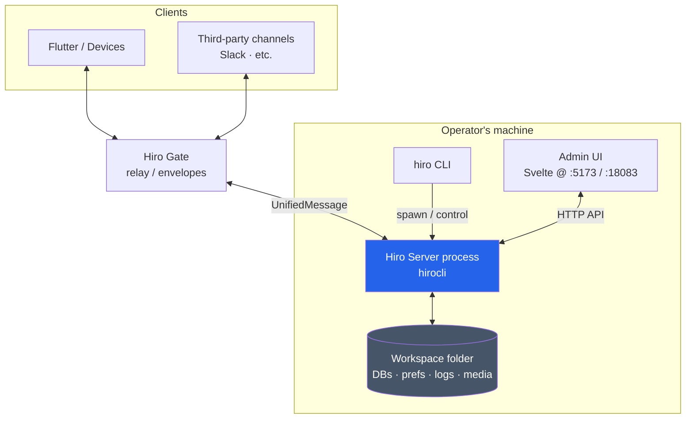
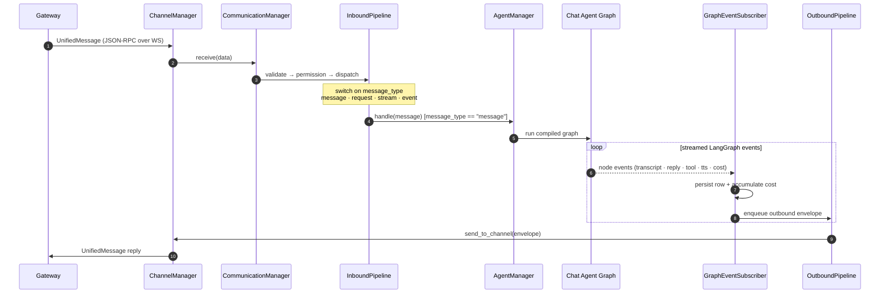
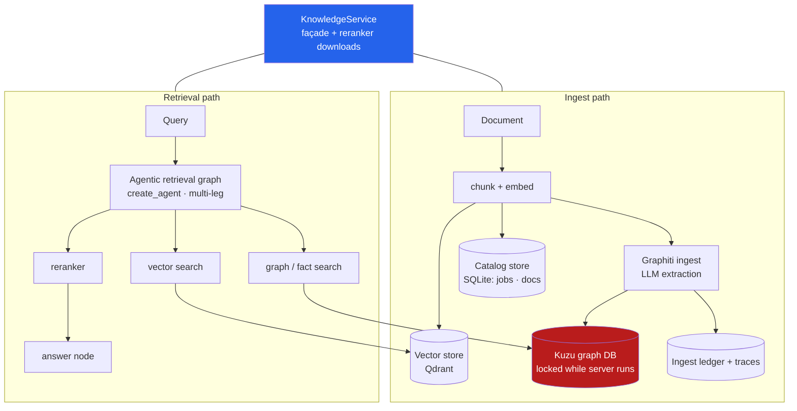
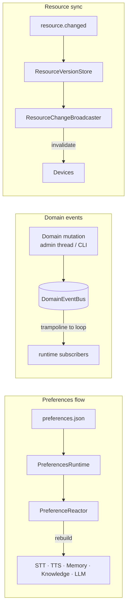

# hirocli Backend — Architecture Overview

**Status:** 🗺️ Living map · **Date:** 2026-06-24
**Scope:** the Python server backend `hiroserver/hirocli` — the process started by `hiro start`. Top-down, drilling from the whole-system view into the runtime managers, the per-message agent graph, and the knowledge/RAG stack.
**Companion:** [hirocli-backend-review.md](hirocli-backend-review.md) (robustness critique of what's mapped here).
**Audience:** you — a "stay on top of it" reference. Each diagram zooms in one level; read top to bottom.

> Deeper per-component docs live in mintdocs (`../hiro-docs/mintdocs/architecture/concepts/*`). This doc is the **index map** that ties them together.

---

## Level 0 — Where the backend sits in Hiro League

The backend (`hirocli`, a.k.a. **Hiro Server**) is one process in a larger topology. Devices and third-party channels reach it through the **Gateway**; operators reach it through the **CLI** and the **Admin UI**.



**What each does**

| Component | Role |
|---|---|
| **Hiro Server (hirocli)** | The subject of this doc. One process per workspace; runs the agent, channels, and HTTP control surface in a single asyncio loop. |
| **Hiro Gate** | External relay. Carries `UnifiedMessage` envelopes between devices/channels and the server. Owned by the mandatory `devices` channel plugin. |
| **CLI (`hiro …`)** | Thin wrappers over the Tool layer; starts/stops the server and drives operations. |
| **Admin UI** | Svelte frontend over the server's HTTP API. Dev site `:5173`; served bundle `:18083`. |
| **Workspace folder** | All durable state: `workspace.db`, `data.db`, `preferences.json`, Kuzu graph, vector store, logs, media. |

---

## Level 1 — Inside the server process

`runtime/server_process.py` is the **composition root**: it builds one `ServerContext`, wires the managers, and launches them all as coroutines under a single event loop. Everything shares `ServerContext`; nothing reaches for globals.

```mermaid
flowchart TB
    ctx{{ServerContext<br/>config · prefs · keys · loop}}

    subgraph io[I/O & Control surfaces]
        chan[ChannelManager<br/>WS server · plugin subprocesses]
        http[HTTP Server<br/>FastAPI control + Tool /invoke]
        adminui[Admin UI server<br/>admin_svelte routes]
        metrics[MetricsCollector]
    end

    subgraph core[Message core]
        comm[CommunicationManager]
        inb[InboundPipeline]
        outb[OutboundPipeline]
        ges[GraphEventSubscriber]
        rcb[ResourceChangeBroadcaster]
    end

    subgraph brain[Agent & knowledge]
        am[AgentManager<br/>owns the chat graph]
        graph[[Chat Agent Graph<br/>LangGraph]]
        km[KnowledgeManager → KnowledgeService]
        mem[MemoryService]
        media[STT · Vision · TTS · ImageGen]
    end

    subgraph found[Foundations]
        tools[ToolRegistry<br/>CLI = Agent = HTTP]
        dom[Domain layer<br/>stores · prefs · models · crypto]
        bus[(DomainEventBus<br/>thread → loop)]
        prefrt[PreferencesRuntime<br/>+ PreferenceReactor]
    end

    ctx -.shared by all.-> io & core & brain & found

    chan <-->|UnifiedMessage| comm
    comm --> inb --> am
    am --> graph
    graph -->|graph events| ges --> outb --> comm
    graph --> km & mem & media
    am --> tools
    http --> tools
    adminui --> tools
    tools --> dom
    dom --> bus --> prefrt
    prefrt -.hot-reload.-> am
    rcb -->|resource.changed| comm
    metrics -.samples.-> chan

    style ctx fill:#475569,color:#fff
    style graph fill:#2563eb,color:#fff
    style bus fill:#7c3aed,color:#fff
```

**The major components**

| Component | File | What it owns |
|---|---|---|
| **ServerContext** | `runtime/server_context.py` | Workspace path, `Config`, keys, the event loop, `PreferencesRuntime`, `PreferenceReactor`, device-name cache. Built once; passed everywhere. |
| **ChannelManager** | `runtime/channel_manager.py` | Local WebSocket server (`plugin_port`); spawns channel plugins as **subprocesses**, talks JSON-RPC. The `devices` plugin owns Gateway connectivity. |
| **CommunicationManager** | `runtime/communication_manager.py` | Routes between channels and the agent. Owns `InboundPipeline`, `OutboundPipeline`, `GraphEventSubscriber`. |
| **AgentManager** | `runtime/agent_manager.py` | Builds & caches the compiled chat graph; owns STT/Vision/TTS/Memory/Knowledge service handles; hot-reloads them on preference changes. |
| **Chat Agent Graph** | `runtime/agent_graph/` | The per-message LangGraph workflow (Level 2). |
| **KnowledgeManager** | `runtime/knowledge_manager.py` → `services/knowledge/` | RAG over Graphiti + Kuzu + a vector store (Level 3). |
| **HTTP Server** | `runtime/http_server.py` | Local FastAPI control surface + the Tool `/invoke` endpoint. |
| **Admin UI server** | `admin/run.py` + `admin_svelte/routes/` | Separate FastAPI app backing the Svelte UI. |
| **ToolRegistry** | `tools/registry.py` | The unification seam: one operation = CLI command + agent tool + HTTP call. |
| **DomainEventBus** | `domain/events.py` | Thread-safe bridge: synchronous domain mutations (admin worker threads, CLI) trampoline onto the runtime loop as async events. |
| **PreferencesRuntime / Reactor** | `runtime/preferences_runtime.py`, `preference_reactor.py` | Live `preferences.json` snapshot + change reactors that rebuild subsystems. |

---

## Level 2 — One message, end to end

This is the hot path: a user message arriving from a device, flowing through the agent, and a reply going back. The **inbound** side dispatches by `message_type`; the **outbound** side is event-driven (graph events → persistence + envelopes).



**Key facts**

- **Inbound dispatch** (`runtime/inbound_pipeline.py`) is a `match` on `message_type`: `message` → agent graph; `request` → `RequestHandler` (status/history/files/etc.); `stream` → stream sender; `event` → `EventHandler`.
- **The graph runs in the background.** `_dispatch_to_agent` fires the run and returns; outbound is produced reactively by `GraphEventSubscriber` subscribing to graph events. (Synthetic injectors — Admin UI / CLI `message_send` — can pass `await_message_flow=True` to block until the inbound row is persisted.)
- **GraphEventSubscriber is the side-effect hub:** it persists messages/transcripts/replies, accumulates LLM/TTS cost, and builds outbound envelopes. (Flagged in the review as a god object worth splitting.)

---

## Level 2b — The chat agent graph

The per-message workflow itself is a LangGraph `StateGraph` (`runtime/agent_graph/chat.py`). Media branches (STT/vision) fan in before retrieval; retrieval feeds context assembly; the model loop calls tools until done; TTS is optional on the way out.

```mermaid
flowchart TD
    start([START]) --> ingest

    ingest -->|dispatch_media| stt[stt]
    ingest -->|dispatch_media| vision[vision]
    ingest -->|dispatch_media| gather
    stt --> gather
    vision --> gather

    gather -->|input_gate| trim[trim_history]
    gather -->|input_gate fail| mfail[media_failed]

    trim -->|knowledge on| kret[knowledge_retrieve]
    trim -->|knowledge off| msearch[memory_search]
    kret --> ctxb[context_build]
    msearch --> ctxb

    ctxb --> compose[compose_context] --> call[call_model]

    call -->|should_continue: tools| tools
    tools --> call
    call -->|should_continue: done| mout[memory_out]

    mout -->|tts_gate| tts
    mout -->|tts_gate skip| final[finalize]
    mfail -->|tts_gate| tts
    tts --> final --> done([END])

    style call fill:#2563eb,color:#fff
    style kret fill:#0d9488,color:#fff
    style msearch fill:#0d9488,color:#fff
```

**Node responsibilities** (`runtime/agent_graph/nodes/`)

| Node | Does |
|---|---|
| `ingest` | Normalize the inbound message; decide which media branches to run. |
| `stt` / `vision` | Transcribe audio / analyze images (external model calls). |
| `gather` | Join media branches; gate on success (`media_failed` on hard failure). |
| `trim_history` | Bound conversation history before retrieval. |
| `knowledge_retrieve` | RAG subgraph (Level 3) — when knowledge is enabled. |
| `memory_search` | Conversation-memory recall (Graphiti). |
| `context_build` → `compose_context` | Assemble persona + clean history + retrieved context into the model input (the "assembly seam" — see [context-assembly.md](context-assembly.md)). |
| `call_model` ↔ `tools` | The model/tool loop (`should_continue` routes back to `tools` or out). |
| `memory_out` | Write turn outcomes back to memory. |
| `tts` | Optional voice synthesis. |
| `finalize` | Emit terminal event; close the run. |

---

## Level 3 — Knowledge / RAG subsystem

The largest service. `KnowledgeService` orchestrates **three stores** plus an agentic retrieval graph. Note the dual write path (vectors + catalog + graph) — the review flags its cross-store consistency.



**Components**

| Piece | File | Role |
|---|---|---|
| `KnowledgeService` | `services/knowledge/service.py` | Façade: ingest orchestration, search, answer/compare, reranker-download subprocess lifecycle. |
| `GraphitiMemoryService` | `services/knowledge/graph/graphiti_service.py` | Kuzu lifecycle, write/read CRUD, graph↔dict mapping, snapshot/export. |
| Vector store | `services/knowledge/vector_store.py` | Qdrant point I/O + hybrid (vector + FTS) search with RRF. |
| Catalog store | `services/knowledge/catalog_store.py` | SQLite jobs/documents/taxonomy + crash recovery. |
| Agentic retrieval | `services/knowledge/agent/retrieval_nodes.py` | Multi-leg retrieval graph (flat vs graph-expand) with reranking. |
| Ingest ledger / trace | `services/knowledge/graph/ingest_ledger.py`, `ingest_trace.py` | Observability of what was ingested (not a transaction boundary). |

> ⚠️ The **Kuzu graph DB is exclusively locked while the server runs** — to inspect it: `hiro stop` → inspect → `hiro start`. Vector store, catalog, ledger, and traces are readable live.

---

## Cross-cutting mechanisms

These don't sit on the hot path but glue the system together.



| Mechanism | Purpose |
|---|---|
| **Preferences flow** | `preferences.json` is the single source of tunable knobs. The runtime snapshot + reactors mean changing a model/temperature in the Admin UI **hot-reloads** the affected subsystem (no restart for most fields). See [`preferences.mdx`](../hiro-docs/mintdocs/architecture/misc/preferences.mdx). |
| **DomainEventBus** | Lets synchronous domain code (admin worker threads, CLI sync paths) safely publish events onto the async runtime loop. The thread→loop bridge. |
| **Resource sync** | The `resource.changed` + version-counter pattern that keeps device-side caches consistent after reconnect. See [`resource-sync.mdx`](../hiro-docs/mintdocs/architecture/concepts/resource-sync.mdx). |
| **Tool architecture** | One operation implementation, three surfaces (CLI / agent tool / HTTP). The `ToolRegistry` is the registration point. See [`tools-architecture.mdx`](../hiro-docs/mintdocs/architecture/misc/tools-architecture.mdx). |

---

## How to read the layers

```
L0  Hiro League topology .............. where the server sits
 └ L1  Server process .................. the managers under ServerContext
     └ L2  Message flow (sequence) ..... inbound dispatch → agent → outbound
     └ L2b Chat agent graph ............ the LangGraph nodes of one turn
         └ L3  Knowledge / RAG ......... the three-store retrieval stack
     └ Cross-cutting ................... prefs · domain events · resource sync · tools
```

---

## TL;DR

- **One process, one event loop.** `runtime/server_process.py` is the composition root; everything shares a single `ServerContext` and runs as coroutines under one asyncio loop.
- **Three surfaces, one core.** Channels (via Gateway), the HTTP control API, and the Admin UI all funnel into the same managers and the same **Tool layer** (CLI = agent = HTTP).
- **Inbound is type-dispatched; outbound is event-driven.** `InboundPipeline` routes by `message_type`; the agent graph runs in the background and `GraphEventSubscriber` turns graph events into persisted rows + outbound envelopes.
- **The brain is a LangGraph.** One message = one graph run: media → retrieval (knowledge + memory) → context assembly → model/tool loop → optional TTS → finalize.
- **Knowledge = three stores** (Qdrant vectors · Kuzu graph · SQLite catalog) behind `KnowledgeService`, with an agentic multi-leg retrieval graph. Kuzu is **exclusively locked while the server runs**.
- **Glue:** `preferences.json` + reactors give **hot-reload**; the `DomainEventBus` bridges thread→loop; resource-sync keeps devices consistent.
- **For the critique of all this**, see [hirocli-backend-review.md](hirocli-backend-review.md).
