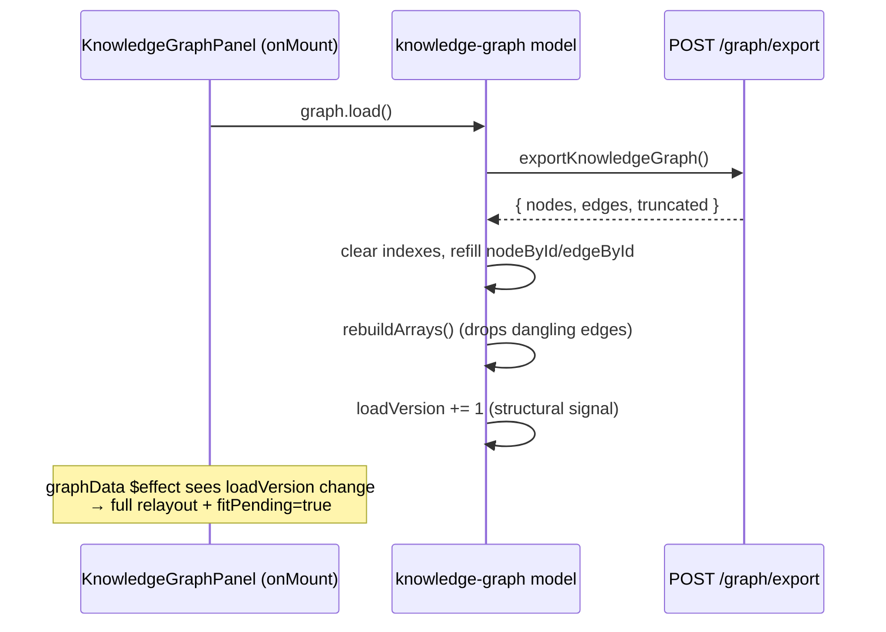

# Knowledge Graph Page — Frontend Design (as-built)

> **Scope.** A top-down walkthrough of the **admin frontend** code that renders the
> live, force-directed knowledge graph (nodes/edges) on the Knowledge page's **Graph**
> tab. This is an *as-built* architecture description of the rendering pipeline — the
> data model, the live-update path, the canvas renderer, and the supporting modules.
>
> **Companion:** [`knowledge-graph-viz-design.md`](knowledge-graph-viz-design.md) is the
> original *plan/tracker* (goals, phases, decisions). This doc is the "how it actually
> works now" map. Backend serialization (`services/knowledge/graph/serialize.py`) and the
> `/knowledge/graph/*` endpoints are out of scope except where the wire contract matters.

---

## 1. Where it lives (entry points)

```
/knowledge/?tab=graph
   └── routes/knowledge/+page.svelte                 (thin route wrapper)
        └── features/knowledge/KnowledgePage.svelte   (tab shell; mounts the controller)
             └── KnowledgeGraphPanel.svelte           (the Graph tab — canvas + UI)
```

The Graph tab is one slice of a multi-tab Knowledge page (Browse / Add / Ask / Eval /
Graph). Two ownership facts drive the whole design:

- **The data model is created once at page level** (`knowledge-controller.svelte.ts`),
  not inside the panel.
- **The live SSE subscription is owned at page level too** — so graph deltas keep
  accumulating in the model even while the user is on another tab. The panel only owns
  **rendering** and the **initial export load** when it mounts.

This split exists because builds are usually triggered from the *Add* / *Eval* tabs. If
the panel owned the subscription, every node/edge emitted during a build that started
while the Graph tab was closed would be lost, and you'd only ever see a one-shot export.

---

## 2. Component map

```
┌─────────────────────────────────────────────────────────────────────────────┐
│ knowledge-controller.svelte.ts        (page composition root)                 │
│   • createKnowledgeGraphModel({ setError })   ← one model, page-lifetime       │
│   • mount(): graph.connectEvents()            ← SSE owned here, all tabs        │
└───────────────┬─────────────────────────────────────────────────────────────┘
                │ ctl.graph  (the model)
                ▼
┌─────────────────────────────────────────────────────────────────────────────┐
│ KnowledgeGraphPanel.svelte            (the Graph tab — ~1700 lines)            │
│                                                                               │
│   ┌─ toolbar ──────────────────────────────────────────────────────────────┐ │
│   │ FilterBar │ Search box │ Fit │ Reload │ Fullscreen                      │ │
│   └────────────────────────────────────────────────────────────────────────┘ │
│   ┌─ canvas surface (force-graph appends its <canvas>) ────────────────────┐ │
│   │   • options toggle  → KnowledgeGraphOptionsPanel (sliders)             │ │
│   │   • stats overlay (nodes/edges · live · ingesting · capped)           │ │
│   │   • selection aside → provenance / chunk-detail panel                  │ │
│   └────────────────────────────────────────────────────────────────────────┘ │
└───────────────┬───────────────────────────────────────────┬─────────────────┘
                │ reads model getters                        │ uses
                ▼                                            ▼
┌──────────────────────────────────┐   ┌──────────────────────────────────────┐
│ knowledge-graph.svelte.ts (MODEL)│   │ supporting modules                    │
│  • nodes()/links() (+ indexes)   │   │  knowledge-graph-style.ts (colors)    │
│  • rAF-coalesced delta buffer    │   │  knowledge-graph-prefs.ts  (sliders)  │
│  • filters (hidden type sets)    │   │  KnowledgeGraphFilterBar.svelte       │
│  • search match sets             │   │  KnowledgeGraphOptionsPanel.svelte    │
│  • load() / connectEvents()      │   │  knowledge-events.ts (SSE subscribe)  │
└──────────────┬───────────────────┘   │  knowledge-event-stream.svelte.ts     │
               │                        └──────────────────────────────────────┘
               ▼
┌──────────────────────────────────────────────────────────────────────────────┐
│ api/knowledge.ts   POST /knowledge/graph/export · /chunks-detail · /search-... │
│ SSE  /api/knowledge/events   knowledge.graph.{node,edge}_upserted · progress   │
└──────────────────────────────────────────────────────────────────────────────┘
```

There are **two parallel representations of the graph**, and understanding the boundary
between them is the single most important thing in this design (see §5.1):

1. The **reactive model** — Svelte `$state` arrays + `Map` indexes in
   `knowledge-graph.svelte.ts`. Source of truth for *data*.
2. The **force-graph mirror objects** — plain non-reactive objects inside the panel
   (`fgNodeById` / `fgLinkById`). Source of truth for *simulated position* (x/y/vx/vy).

---

## 3. Data model (the wire contract)

All shapes are in [`api/knowledge.ts`](../admin_frontend/src/lib/api/knowledge.ts) and
mirror the backend serializer. Edges deliberately use `source`/`target` (not
`source_id`/`target_id`) so they drop straight into force-graph's link model.

```
GraphNodeDTO                       GraphEdgeDTO
├─ id                              ├─ id
├─ name                           ├─ source        (node id)
├─ type   Person|Place|Event|     ├─ target        (node id)
│         Organization|Object|    ├─ rel_type      free-form relation label
│         Entity (fallback)       ├─ fact          human-readable statement
├─ aliases[]                      ├─ chunk_ids[]   provenance (Qdrant point_ids)
├─ chunk_ids[]   provenance       ├─ document_ids[]
├─ document_ids[]                 ├─ valid_at      ┐ bi-temporal window
└─ summary       Graphiti desc.   ├─ invalid_at    │ (carried, shown in detail panel,
                                  └─ expired_at    ┘  not yet used by the layout)
```

**Transport payloads:**

| Channel | Shape | Purpose |
|---|---|---|
| `POST /knowledge/graph/export` | `KnowledgeGraphExportData { nodes, edges, truncated, counts }` | One-shot full snapshot (initial paint + Reload + reconcile) |
| SSE `knowledge.graph.node_upserted` | `GraphNodeEvent { node, is_new, document_id }` | Live node delta |
| SSE `knowledge.graph.edge_upserted` | `GraphEdgeEvent { edge, is_new, document_id }` | Live edge delta |
| SSE `knowledge.graph.ingest_progress` | `{ document_id, chunk_index, chunk_total }` | "Building…" progress |
| SSE `knowledge.graph.ingest_completed` | — | Triggers the reconciling re-export |
| `POST /knowledge/graph/chunks-detail` | `{ chunks: GraphChunkDetail[] }` | Resolve chunk_ids → text + doc title (detail panel) |
| `POST /knowledge/graph/search-chunks` | `{ point_ids }` | Backend chunk-text search → ids mapped onto nodes/edges |

`is_new` distinguishes a brand-new entity from a provenance "pulse" (an existing node
re-touched by another chunk). Only `is_new` sightings trigger the glow.

---

## 4. Data flow

Three load paths feed one model. Two are structural (full relayout + zoom-to-fit); one is
incremental (local settle, camera held).

### 4.1 Initial paint + manual reload (structural)



### 4.2 Live deltas during a build (incremental)

```mermaid
sequenceDiagram
    participant SSE as /api/knowledge/events
    participant Sub as connectKnowledgeGraphEvents
    participant Model as graph model
    participant rAF as requestAnimationFrame
    participant Panel as graphData $effect

    SSE-->>Sub: knowledge.graph.node_upserted (xN, fast)
    Sub->>Model: onNode → pendingNodes.push(e); scheduleFlush()
    Note over Model: many events coalesce into ONE flush per frame
    rAF-->>Model: flush()
    Model->>Model: upsert into nodeById/edgeById (mutate in place)
    Model->>Model: mark recent[`n:id`]=now for is_new (glow)
    Model->>Model: rebuildArrays()  → nodes/links $state reassigned
    Model-->>Panel: reactive render set changes
    Panel->>Panel: reconcile mirrors, seed new nodes near neighbours,<br/>damped reheat (camera held, no fit)
```

### 4.3 Reconcile after a build (self-healing)

`ingest_completed` schedules a **debounced (400 ms) full re-export** via `load()`. This
heals any deltas that were dropped (e.g. SSE blip) by replacing the in-memory graph with
the authoritative snapshot. It is intentionally a structural reload (re-fit).

```
node/edge deltas ──▶ rAF flush ──▶ in-memory graph
                                        ▲
ingest_completed ──(debounce 400ms)──▶ load()  (authoritative re-export, heals drops)
```

---

## 5. The model layer — `knowledge-graph.svelte.ts`

`createKnowledgeGraphModel(deps)` is a closure returning getter functions (the codebase's
controller pattern). Responsibilities: hold the graph, apply deltas, expose filters and
search match sets. It knows **nothing** about canvas or force-graph.

### 5.1 Dedup indexes vs reactive arrays

```
nodeById : Map<id, GraphNodeDTO>   ← non-reactive, O(1), the dedup source of truth
edgeById : Map<id, GraphEdgeDTO>      values are the SAME refs held in the arrays

nodes = $state<GraphNodeDTO[]>   ─┐ rebuildArrays(): nodes = [...nodeById.values()]
links = $state<GraphEdgeDTO[]>   ─┘ links = edges whose BOTH endpoints exist
```

**Upsert mutates in place** (`Object.assign(existing, dto)`) rather than replacing the
object, so the *reference identity* of a node is stable across a provenance pulse. (The
panel relies on stable identity at its own layer too — see §6.1.)

**Dangling-edge filter, with a subtle bug fix:** `rebuildArrays()` drops edges whose
endpoints aren't loaded yet (an edge delta can arrive before its node delta). The catch:
once force-graph lays the graph out, it **rewrites `link.source`/`link.target` from id
strings into the actual node objects**. So a naive `nodeById.has(e.source)` becomes
`has(<object>)` → `false` → *every already-rendered edge gets filtered out every delta*,
collapsing the link structure and letting charge re-scatter the nodes. The fix is the
`endId()` helper that normalizes either shape (string id **or** node object) back to an id
before the membership check.

### 5.2 rAF-coalesced delta buffer

A fast ingest can emit hundreds of upserts per second. Each would otherwise reassign the
`$state` arrays and thrash the force sim. Instead deltas are buffered and flushed **once
per animation frame**:

```
onNode/onEdge → pendingNodes/pendingEdges.push() → scheduleFlush()
scheduleFlush(): if not already scheduled, requestAnimationFrame(flush)
flush(): drain buffers → upsert all → update recent{} glow map → rebuildArrays()
```

`recent` is `Record<"n:id"|"e:id", epochMs>` — the timestamp of the last `is_new` sighting,
which drives the glow. Entries older than `GLOW_MS` (3 s) are pruned on each flush.

### 5.3 Filters (client-side)

The full snapshot is already in memory, so filtering is pure client-side. The model stores
the **hidden** type sets (so the default empty set means "show all"), persisted to
**sessionStorage** (filters aren't meant to be shareable links):

- `hiddenNodeTypes`, `hiddenEdgeTypes` — reassigned as fresh `Set`s so `$state` fires.
- `visibleNodes` / `visibleLinks` — `$derived` subsets fed to the renderer.
- **"Hide connected edges" semantics:** an edge is visible only if its relation type is
  shown *and* both endpoint node types are shown — hiding a node type also hides its edges.
- `nodeTypeFacets` / `edgeTypeFacets` — `$derived` counts over **all** data (not the
  filtered subset) so hidden types stay listed and can be toggled back on. Node facets sort
  by the known ontology order then alphabetically; edge facets sort busiest-first.

### 5.4 Search match sets (hybrid)

One unified query produces two `$derived` sets, `matchedNodeIds` and `matchedEdgeIds`,
from the **union of two match sources**:

```
client-side (instant):  node.name / aliases substring
                        edge.rel_type / fact substring
backend (debounced):    chunk TEXT  → searchGraphChunks() returns point_ids
                        panel pushes them via setMatchedChunkIds()
                        model maps point_ids → nodes/edges by chunk_ids
```

Search **highlights without filtering** — the matched set is consumed by the renderer for
ring/dim/hide treatment (§6.5), not by `visibleNodes`.

---

## 6. The render layer — `KnowledgeGraphPanel.svelte`

The heaviest file. It owns the force-graph instance, all custom canvas drawing, the d3
force tuning, camera ownership, redraw gating, and the selection/detail panel. force-graph
(`force-graph` v1.51, 2D canvas + d3-force) is imported **dynamically on mount** (it's
browser-only; this component also runs during SSR).

### 6.1 The mirror-object problem (the core fix)

> This is *the* bug that shaped the architecture — "the whole graph resets on every update".

force-graph / d3 store live simulation state (`x, y, vx, vy, fx, fy, index`) **directly on
the node/link objects you hand them**. Those objects must keep a stable identity and
persist across deltas. But we **cannot** feed force-graph the model's Svelte `$state`
objects: every model rebuild (`nodes = [...nodeById.values()]`) makes Svelte create **fresh
proxies**, and the `$state` set-trap stores writes in signals — never on the raw target —
so each fresh proxy reads `x`/`y` back as `undefined`, and d3 re-initializes every node to
a spiral position.

The fix: the panel keeps its **own plain, non-reactive mirror objects**, reconciled by id:

```
reconcileFgData(reactiveNodes, reactiveLinks):
    for each reactive node:
        mirror exists?  → refresh display fields (type/name), KEEP x/y/vx/vy/index
        new id?         → create mirror, record in freshNodeIds
    drop mirrors whose id is gone
    (same for links; new link endpoints start as ids, force-graph resolves to node objs)
    return { fgNodes, fgLinks, freshNodeIds }
```

So: **model = data identity, mirrors = position identity.** Existing mirrors keep their
simulated coordinates; only `freshNodeIds` are new arrivals.

### 6.2 Structural vs. delta updates (the graphData `$effect`)

A single `$effect` tracks `renderNodes`, `renderLinks`, `loadVersion`, and the hidden-type
sets, then decides which kind of update this is:

```
structural = loadVersion changed  OR  a hidden-set changed  OR  first paint
```

| | Structural (load / reload / reconcile / filter) | Delta (live node/edge add) |
|---|---|---|
| Node targets | retarget **every** node's radial ring | only the **new** nodes |
| New-node seed | — | placed near neighbour centroid (+jitter) |
| Velocity decay | `0.4` (d3 default — full energy) | `0.8` (heavy damping, small steps) |
| Alpha decay | `0.0228` (~300 ticks) | `0.08` (~70 ticks, brief local settle) |
| Camera | `fitPending = true` → zoom-to-fit on engine stop | no fit (camera held) |

Why decay instead of starting alpha lower: `graphData()` always restarts the sim at
`alpha = 1` and there's no public hook to start gentler, so motion is controlled via
**decay** — structural updates spread the whole graph; deltas let the established layout
drift only slightly while the new region settles locally. The whole block runs inside
`untrack()` so a stray proxy read can't turn a per-tick mutation into a
`graphData()`+reheat loop (the old "tense and shaky / never settles" bug).

### 6.3 Force simulation & the degree-radial layout

d3 forces are configured in `onMount` and re-tuned live by the sliders:

```
link    → distance = linkDistance slider, strength = linkStrength slider
charge  → CHARGE_STRENGTH (-240) repulsion, distanceMax 320 (corral strays)
center  → CENTER_STRENGTH (0.05, loose pull to origin)
gravity → degreeRadial(RADIAL_STRENGTH)   ← custom inline d3 force
```

`degreeRadial` implements the "most-connected in the middle, leaves around the edge"
layout. Each node is pulled toward a ring whose radius encodes its connectivity:

```
n.__targetR = (1 - degree/maxDegree) * outerRing       (hub → 0, leaf → outer ring)
outerRing   = RADIAL_RING * √(nodeCount)               (scales with graph size)
each tick:  pull n toward radius __targetR from current |(x,y)|
```

Ring **targets** are only recomputed on structural updates — recomputing `outerRing`
(∝ √N) every delta would grow the ring each batch and yank the whole graph outward.

### 6.4 Custom canvas drawing

force-graph's default node/link render is fully replaced:

- **`nodeCanvasObject` (mode `replace`)** stacks: glow halo → colored disc (by type) →
  white Lucide icon → wrapped name label below.
  - **Icons** are hardcoded Lucide SVG path strings, parsed once into cached `Path2D`
    objects (re-parsing per frame at 60fps was wasteful) and stroked in white inside the
    disc. Deterministic across platforms (unlike emoji).
  - **Labels** wrap at 12 chars / 3 lines, and are **zoom-gated**: hidden below
    `NODE_ZOOM_MIN`, interpolated `FONT_MIN..FONT_MAX` on-screen px (converted to
    canvas-space by dividing by `scale`) so a dense graph isn't a wall of text when zoomed
    out.
- **`linkCanvasObject` (mode `after`)** draws the fresh-edge flash (follows the same
  straight/curved path the line uses) then the relation label, rotated to follow the edge
  and flipped to never read upside-down. For parallel/self-loop edges the label sits at the
  **arc apex** (computed from force-graph's `__controlPoints`).

**Parallel-edge fanning:** when 2+ edges share a node pair they'd overlap. `assignLinkCurvatures`
groups by *unordered* pair (so A→B and B→A fan together), assigns a symmetric fan of
`__curvature` values (reciprocals flip sign), and self-loops stack at increasing radii.
`capParallelLinks` caps how many are drawn per pair (the "Max links per pair" option;
`MAX_LINKS_CAP = 10` means "show all").

### 6.5 Search highlight & focus modes

Three treatments of non-matching nodes/edges, set by the `searchFocusMode` option:

```
highlight : matches get an amber ring; non-matches drawn normally
dim       : non-matches faded (globalAlpha 0.12 nodes / dim link color)
hide      : non-matches REMOVED from the data fed to force-graph
            → matched subset re-lays-out to fill the frame (true recreate)
```

`highlight`/`dim` are pure render treatments (every node stays in the sim);
`hide` changes `renderNodes`/`renderLinks` so it's a structural relayout. After matches
resolve, the camera zoom-to-fits **just the matched subset** (matched nodes + endpoints of
matched edges, via `focusNodeIds`), skipping when there are zero matches so a typo doesn't
yank the camera to an empty frame.

### 6.6 Camera ownership

Auto-fit otherwise fights the user. Two flags arbitrate:

```
userMovedCamera  : set when onZoom fires WITHOUT a programmatic fit in progress.
                   While true, onEngineStop stops auto-fitting (user's viewport holds).
                   Reset on intentional reframes: filter change, new search, Fit button,
                   manual Reload.
programmaticZoom : true only while one of OUR zoomToFit animations is running, so onZoom
                   doesn't mistake an auto-fit for a user gesture. Starts true so initial
                   auto-centring isn't counted as a user move.
```

`programmaticFit(run)` wraps every programmatic camera move, suppressing user-move
detection for `FIT_ANIM_MS + 150 ms`.

### 6.7 Redraw gating (performance)

force-graph's `autoPauseRedraw(true)` lets the canvas idle once the sim settles and there's
no interaction. The panel keeps that on and only kicks frames for **its own animations**:

```
keepRedrawing(ms): autoPauseRedraw(false); after ms → autoPauseRedraw(true)
  kicked by:  glow halos fading (GLOW_MS+150), theme switch (150ms),
              search-match changes (200ms)
```

This replaced an earlier `autoPauseRedraw(false)` that repainted at 60 fps forever.
Relatedly, `computeScheme()` (theme-aware colors) is cached and refreshed only on a
`data-theme` `MutationObserver` tick — not read from the DOM inside every draw callback.

### 6.8 Selection & provenance detail panel

Clicking a node/edge sets `selected` in the model; the panel renders a right-hand aside.
The DTO carries only `chunk_ids`, so on selection the panel **lazily fetches** the real
chunk text + owning document titles via `fetchGraphChunksDetail`, grouped by document.
Requests are `AbortController`-guarded (cancelled on selection change / unmount) — a leaked
same-origin request matters because pages + API share one origin and the browser caps ~6
connections per origin. Each chunk card shows its `heading_path` and the episode event date
(`valid_at`, the semantic "when this happened", not ingest time).

---

## 7. Supporting modules

| File | Role |
|---|---|
| [`knowledge-graph-style.ts`](../admin_frontend/src/lib/features/knowledge/graph/knowledge-graph-style.ts) | `TYPE_COLORS` + `colorFor()` + `KNOWN_NODE_TYPE_ORDER`. Shared by canvas and filter chips so they agree on the palette. Unknown Graphiti types fall back to the slate `Entity` color. |
| [`knowledge-graph-prefs.ts`](../admin_frontend/src/lib/features/knowledge/graph/knowledge-graph-prefs.ts) | localStorage read/write for the 4 sliders + `searchFocusMode`, clamped/NaN-guarded. Durable across reloads (options are view prefs, not shareable URL state). |
| [`KnowledgeGraphFilterBar.svelte`](../admin_frontend/src/lib/features/knowledge/graph/KnowledgeGraphFilterBar.svelte) | Node-type toggle chips (color dot + count) + edge-relation multi-select dropdown (free-form vocabulary) + Clear. Maps the dropdown's "visible" model to the model's "hidden" sets. |
| [`KnowledgeGraphOptionsPanel.svelte`](../admin_frontend/src/lib/features/knowledge/graph/KnowledgeGraphOptionsPanel.svelte) | Sliders: link strength, link distance, edge curvature, max links per pair; search-focus mode toggle; Reset. Two-way `bind:` to the panel's slider state. |
| [`knowledge-events.ts`](../admin_frontend/src/lib/features/knowledge/shared/knowledge-events.ts) | `connectKnowledgeGraphEvents({onNode,onEdge,onProgress,onCompleted})` — parses each `knowledge.graph.*` frame and dispatches; returns teardown. |
| [`knowledge-event-stream.svelte.ts`](../admin_frontend/src/lib/features/knowledge/shared/knowledge-event-stream.svelte.ts) | **One** ref-counted `EventSource` per browser tab, multiplexing all knowledge features (jobs/eval/graph) by `event.type`. Prevents the per-origin HTTP/1.1 connection-cap starvation that 3 separate streams caused; flips `degraded` if it can't reconnect within 8 s. |

---

## 8. Cross-cutting invariants (the "don't break these" list)

1. **Never feed force-graph the Svelte `$state` objects.** Always reconcile into the plain
   mirror objects, or positions read back `undefined` and the graph resets (§6.1).
2. **Normalize link endpoints to ids** before any `Map.has()` check — force-graph rewrites
   them to node objects after layout (§5.1).
3. **Upsert mutates in place**, never replaces — preserves reference identity across a
   provenance pulse (§5.1).
4. **Structural vs. delta** is gated on `loadVersion` + hidden-set identity. Live deltas
   must *not* retarget all nodes or zoom-to-fit, or the established layout jumps (§6.2).
5. **Ring targets only recompute on structural updates** — `outerRing ∝ √N` would grow
   per-batch otherwise (§6.3).
6. **Camera yields to the user** via `userMovedCamera`; programmatic fits are wrapped so
   they don't self-trigger it (§6.6).
7. **Keep `autoPauseRedraw` on**; kick frames only via `keepRedrawing()` (§6.7).
8. **SSE subscription is page-owned, not panel-owned** — leaving the Graph tab must not
   stop deltas accumulating (§1). The panel's `onDestroy` deliberately does *not* tear it
   down.

---

## 9. Tuning-knob reference

| Constant / option | Where | Default | Effect |
|---|---|---|---|
| `CHARGE_STRENGTH` | panel const | `-240` | Node-to-node repulsion (biggest spread lever) |
| `CHARGE_DISTANCE_MAX` | panel const | `320` | Caps repulsion range (corral strays) |
| `CENTER_STRENGTH` | panel const | `0.05` | Pull toward origin (loose) |
| `RADIAL_STRENGTH` / `RADIAL_RING` | panel const | `0.08` / `90` | Degree-radial pull + outer-ring spacing |
| `VELOCITY/ALPHA_DECAY_{DEFAULT,DELTA}` | panel const | `.4/.0228`, `.8/.08` | Cooling for structural vs delta updates |
| `linkStrength` | option/slider | `0.5` | d3 link-force stiffness |
| `linkDistance` | option/slider | `80` | Edge resting length (px) |
| `curveAmount` | option/slider | `0.45` | Parallel-edge bow |
| `maxLinksPerPair` | option/slider | `10` (=all) | Cap parallel edges per pair |
| `searchFocusMode` | option | `highlight` | Non-match treatment: ring / dim / hide |
| `GLOW_MS` | model + panel | `3000` | Fresh node/edge glow duration |
| `NODE/EDGE_ZOOM_MIN..MAX`, `FONT_MIN..MAX` | panel const | — | Zoom-gated label sizing |
| `RECONCILE_DEBOUNCE_MS` | model | `400` | Post-build re-export debounce |
| `SEARCH_DEBOUNCE_MS` | panel | `250` | Chunk-text backend search debounce |
