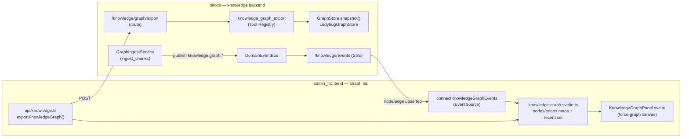
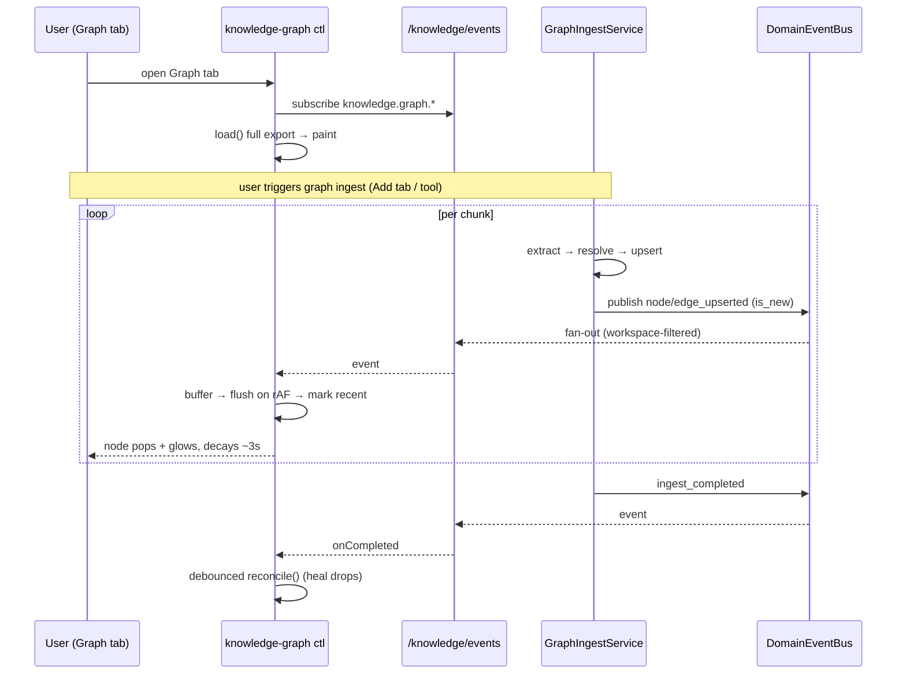

# Knowledge Graph Visualization — Design Doc

> **Tracker doc.** Design for an interactive, physics-based graph view of the L3
> knowledge graph, surfaced as a new **Graph** tab on the admin knowledge page,
> with **live updates** (new nodes/edges pop + highlight while you watch a graph build).
>
> **Companions:** [`knowledge-l3-prototype-plan.md`](knowledge-l3-prototype-plan.md)
> (the L3 thesis prototype this visualizes), [`knowledge-l3-content-routing-design.md`](knowledge-l3-content-routing-design.md).
>
> **Mode:** initial development; **no backward compatibility / no migration / no wrappers**.
> **Status:** plan only — nothing implemented. Tick checkboxes as phases land.

## 1. Goal (one sentence)

Give a force-directed, live-updating view of the entity graph that doubles as a
**debugging instrument for extraction + resolution quality (F1/F2)** and as the
**visual explanation of why graph-on beats flat** — so the Phase 4 proceed/pivot gate
in the prototype plan is faster and more honest to judge.

**Reframing note.** "admin UI for the graph" was a deliberate *non-goal* in the
prototype plan (§6) — kept out so the thesis test stayed lean. This doc brings it in
*intentionally* and scoped as a **read-only inspection/debug surface**, not as graph
editing. It does not change the prototype's critical path to the gate.

## 2. Scope

**Sequencing principle:** ship a **working MVP first** (render + live updates +
provenance), *then* layer inspection/analysis features. Everything below is still
planned — the split is about order, not cutting.

**Phase 1 — MVP (the working slice)**
- New **Graph** tab on the knowledge page (4th tab alongside Browse / Add / Ask).
- Full-graph render with a 2D physics layout (drag, zoom, hover), nodes colored by type,
  edges labeled by relation.
- **Live updates over the existing SSE bus**: as `knowledge_graph_ingest` runs, new
  nodes/edges stream in and **pop + glow**, decaying over a few seconds.
- Click a node/edge → **provenance panel** (aliases, `chunk_ids`, `document_ids`) with
  jump-to-chunk-text (reuse the existing document/chunk read path).
- Manual **Reload**.

> The graph **export** (backend `snapshot()` → `/knowledge/graph/export`) is the *load
> path* that paints the view — foundational, so it's in Phase 1. It is **not** a
> "download to file" feature; there is no file-export anywhere in this design.

**Later phases (planned, after MVP is proven)**
- **Filters** (by node type, by document) + **name search** — *Phase 2*.
- **Freeze/pin** layout for stable inspection — *Phase 2*.
- **Query overlay**: type a question → run the same `expand_entities_to_chunk_ids`
  path → highlight the resolved entities + 1-hop subgraph + the chunks it would feed
  to retrieval ("why graph-on wins" demo) — *Phase 3*.

**Out of scope (entirely, this feature)**
- Graph **editing** (add/merge/split/delete nodes from the UI). Read-only.
- **3D** view — 2D only for now (see V1).
- Community/cluster detection, timeline/bi-temporal views (prototype non-goals).
- WebGL-scale rendering (thousands+ of nodes) — corpus is tiny by design.
- Persisted node positions across sessions (layout re-runs each load).

## 3. Decisions locked

| # | Decision | Why |
|---|---|---|
| V1 | **`force-graph`** (vasturiano, canvas, d3-force under the hood), **2D only** | "physics and stuff" with least code; framework-agnostic → drops into Svelte; scale here is tiny so canvas 2D is plenty and most legible for debugging. 3D is dropped for now; Cytoscape.js is the documented plan-B if this ever graduates into an analysis tool |
| V2 | Library loaded **client-only via dynamic `import()` in `onMount`** | adapter-static SSR build; `force-graph` touches `window`/`canvas` and must not run server-side |
| V3 | **Live updates ride the existing knowledge SSE stream** (`/knowledge/events`) with **new `knowledge.graph.*` event types** | exact pattern already used by ingest jobs + L3 eval; no new transport |
| V4 | **Incremental SSE for live upserts; full re-export only to reconcile** | one round-trip to paint, then cheap deltas. Re-export is the *safety-net* path — used for initial load, manual Reload, the post-`ingest_completed` reconcile (heals dropped deltas), workspace switch, and **deletes** (the one live action with no incremental event). Upserts never wait on a re-export. See §4.1 |
| V5 | Graph export exposed **through the Tool Registry** (`knowledge_graph_export`), then an HTTP route + API client wrapper | repo rule *consider-creating-tools-first* / prototype D10 — all knowledge surfaces go through the Tool Registry |
| V6 | **Reuse `expand_entities_to_chunk_ids`** for the query overlay (extended to also return touched node/edge ids) | one expansion path for ingest, retrieval, and viz — no parallel logic |
| V7 | New tab lives in the **existing knowledge controller composition** as a `knowledge-graph.svelte.ts` sub-model | matches `ask`/`browse`/`ingest` sub-controller pattern |
| V8 | Keep the whole feature **rip-out-able** (frontend `features/knowledge/graph/`, backend stays in `services/knowledge/graph/`) | mirrors the prototype's isolation boundary |

> **Version check required before adding `force-graph`** (repo rule *check-package-versions*).
> Verify the current stable version at implementation time; do not assume.

## 4. Architecture at a glance



**Boundary:** the backend gains exactly two new capabilities — a **read snapshot**
(`snapshot()` → export tool → route) and **event emission** from ingest. Everything
else (render, animation, overlay) is frontend.

### 4.1 Re-export vs incremental (when each fires)

| Trigger | Path |
|---|---|
| Node/edge created or provenance-merged during ingest | **Incremental** SSE delta (pop/glow) |
| Initial tab open · manual **Reload** · workspace switch | Full **export** |
| `ingest_completed` | **One** debounced full **export** — heals any deltas dropped under the SSE queue cap |
| **Deletes / re-ingest** (no delete event this slice) | Full **export** (the only live action relying on re-export) |

Upserts are always incremental; re-export is the reconcile/recovery path, never the
per-upsert mechanism. A future `knowledge.graph.node_deleted` event would make deletes
incremental too.

## 5. Backend changes

### 5.1 `GraphStore`: add a whole-graph read

There is **no list-all op today** — traversal is always anchored by id/name. Add a
snapshot to the Protocol (`services/knowledge/graph/store.py`) + the Ladybug adapter:

```python
# store.py — GraphStore Protocol
def snapshot(
    self, *, node_limit: int | None = None, edge_limit: int | None = None
) -> tuple[list[GraphNode], list[GraphEdge]]:
    """Whole-graph read for visualization. Bounded by limits (safety cap)."""
```

Ladybug adapter (`ladybug_adapter.py`): `MATCH (n:Entity) RETURN n` and
`MATCH ()-[r:Rel]->() RETURN r` (endpoints already persisted as `source_id`/`target_id`
columns, so edge reconstruction works). Apply `LIMIT` when a cap is given.

### 5.2 Export: service method → Tool → route → API client

- **Service** (`KnowledgeService`): `graph_snapshot(...)` opens the store, calls
  `snapshot()`, maps `GraphNode`/`GraphEdge` dataclasses → the wire DTO (§7), returns
  counts + truncation flag. Missing graph DB = empty graph, not an error.
- **Tool** (`tools/knowledge_graph.py`): `KnowledgeGraphExportTool` registered as
  `knowledge_graph_export` (Tool Registry, per V5). CLI / Agent / HTTP all reuse it.
- **Route** (`admin_svelte/routes/knowledge.py`): `POST /knowledge/graph/export` →
  `_success({nodes, edges, truncated, counts})`. Same `_resolve_service` /
  `_close_if_owned` envelope as the other knowledge routes.

### 5.3 Live updates: new `knowledge.graph.*` domain events

**Gap confirmed:** graph ingest currently publishes *nothing*. Add event types and emit
them from `GraphIngestService` after each upsert.

New constants (`services/knowledge/constants.py`):

```python
KNOWLEDGE_GRAPH_NODE_UPSERTED = "knowledge.graph.node_upserted"
KNOWLEDGE_GRAPH_EDGE_UPSERTED = "knowledge.graph.edge_upserted"
KNOWLEDGE_GRAPH_INGEST_PROGRESS = "knowledge.graph.ingest_progress"   # per chunk
KNOWLEDGE_GRAPH_INGEST_COMPLETED = "knowledge.graph.ingest_completed" # → client may reconcile via export
```

- **Publish** from `GraphIngestService.ingest_chunks` via `get_domain_event_bus().publish(DomainEvent(...))`,
  scoped to `workspace_path` (same `_publish` pattern as `KnowledgeService`).
- **`is_new` flag**: the resolver ladder (`GraphResolver.link_or_create`) already returns
  link-vs-create; pass that through so node events carry `is_new`. For edges, the store
  upsert can report created-vs-merged (check existence in the MERGE path) — this drives
  "pop" (new) vs "pulse" (provenance merged onto an existing element) on the frontend.
- **Subscribe**: add the four new types to the `event_types` tuple in
  `stream_knowledge_events` — the SSE plumbing, workspace filter, and heartbeat are
  unchanged.

**Event storm note.** A batch ingest can emit many events fast. The backend already
caps the SSE queue at 100 with a drop-warning; the frontend coalesces (§6.4). The
`ingest_completed` event lets the client do a single reconciling `export` after a burst,
so a few dropped deltas never leave the view permanently wrong.

### 5.4 Query overlay: extend the expansion result

`expand_entities_to_chunk_ids` returns only `chunk_ids` + counts today. For the overlay
we need the *touched graph elements*. Extend `GraphExpansion` (or add a sibling
`expand_entities_to_subgraph`) to also return `node_ids: tuple[str, ...]` and
`edge_ids: tuple[str, ...]`. Retrieval keeps using `chunk_ids` only; the viz uses the
ids to highlight. One expansion path, two consumers (V6).

## 6. Frontend changes

### 6.1 Wire the new tab

- `features/knowledge/shared/knowledge-pure.ts`: add `'graph'` to `KnowledgeTabId` and a
  `{ id: 'graph', label: 'Graph' }` entry in `KNOWLEDGE_TABS`.
- `KnowledgePage.svelte`: add the `{:else if tabPrefs.activeTab === 'graph'}` branch →
  `<KnowledgeGraphPanel {ctl} />`.
- Preferences: extend the allowed-tab list in `createKnowledgePreferences()` (`'graph'`)
  so the tab is URL/localStorage-addressable like the others (`PREF_KEYS.knowledgeActiveTab`).

### 6.2 `knowledge-graph.svelte.ts` sub-controller

Same composition shape as `ask`/`browse`/`ingest` (deps-injected, runes, returns
getters + methods; instantiated in `createKnowledgePageController`, cleanup added to
`mount()`).

State (runes) — **Phase 1**:
- `nodes: Map<string, GraphNodeDTO>`, `edges: Map<string, GraphEdgeDTO>` — source of truth.
- `recent: Map<string, number>` — id → timestamp for the pop/glow decay.
- `selected: {kind:'node'|'edge', id} | null` — drives the provenance panel.
- `loading`, `error`.

State added **later**: `filters` (types/document), `nameQuery` (Phase 2), `frozen`
(Phase 2), `overlay: { entities, nodeIds, edgeIds } | null` (Phase 3). 2D only — no
`layout` field.

Methods — **Phase 1**: `load()` (full export), `applyNodeEvent()/applyEdgeEvent()`
(merge + mark recent), `reconcile()` (re-export after `ingest_completed`), `select()`,
`connectEvents()` (returns cleanup).
**Later**: `setFilters()` (P2), `toggleFreeze()` (P2), `runOverlay(query)`/`clearOverlay()` (P3).

### 6.3 `KnowledgeGraphPanel.svelte` + force-graph

- **Client-only mount**: `onMount(async () => { const { default: ForceGraph } = await import('force-graph'); ... })`
  (V2 — never import at module top, SSR would break).
- Feed `{ nodes, links }` from the controller's maps; re-set data on change (force-graph
  diffs internally). Node color by `type`; `linkLabel`/`nodeLabel` for hover; drag + zoom
  on by default.
- **Pop/glow**: custom `nodeCanvasObject` (and link paint) reads `recent` — draws an
  expanding halo whose alpha decays over ~3 s, then falls back to the default render.
  Run a `requestAnimationFrame` ticker while `recent` is non-empty so the decay animates,
  then stop (no idle repaint).
- **Freeze** *(Phase 2)*: set fixed `fx/fy` on nodes (or `cooldownTicks = 0`) so the
  layout stops jittering during debugging.

### 6.4 Live update consumer

Add to `features/knowledge/shared/knowledge-events.ts`, mirroring
`connectKnowledgeJobEvents` / `connectKnowledgeEvalEvents`:

```ts
export function connectKnowledgeGraphEvents(handlers: {
  onNode: (n: GraphNodeEvent) => void;
  onEdge: (e: GraphEdgeEvent) => void;
  onProgress?: (p: GraphIngestProgress) => void;
  onCompleted?: () => void;
}): () => void;
```

`EventSource` on `/api/knowledge/events?workspace=…`, `addEventListener` per
`knowledge.graph.*` type, returns `() => source.close()`. The controller **coalesces**
bursts: buffer incoming events and flush into the maps once per animation frame so a
fast ingest doesn't thrash the force simulation. On `onCompleted`, debounce a single
`reconcile()` to heal any dropped deltas.

### 6.5 Interactions

| Interaction | Phase | Behavior |
|---|---|---|
| Click node/edge | **1** | Side **provenance panel**: name, type, `aliases`, `chunk_ids`, `document_ids`; click a chunk id → jump to its verbatim text (reuse the browse/document read path) |
| Reload | **1** | Manual full `load()` (also the recovery path) |
| Type filter | 2 | Toggle Person/Place/Event/Organization/Object/Entity; hides filtered nodes (+ now-dangling edges) |
| Name search | 2 | Highlight + center matching nodes |
| Freeze | 2 | Pin layout for stable inspection |
| **Query overlay** | 3 | Input a question → `runOverlay` → highlight resolved entities + 1-hop subgraph + dim the rest; panel lists the chunks the overlay would feed retrieval |

### 6.6 API client

`api/knowledge.ts` (matches the existing `apiRequest<T>` + `ApiResponse<T>` envelope,
`x-hiro-workspace` header):

```ts
export function exportKnowledgeGraph(
  opts?: { node_types?: string[]; document_id?: string }
): Promise<ApiResponse<KnowledgeGraphExportData>> {
  return apiRequest<KnowledgeGraphExportData>('/knowledge/graph/export', {
    method: 'POST', body: opts ?? {}, timeoutMs: 60000,
  });
}
```

## 7. Data contracts

```ts
// wire DTOs (export + SSE share node/edge shape)
type GraphNodeDTO = {
  id: string; name: string; type: string;       // Person | Place | Event | Organization | Object | Entity
  aliases: string[]; chunk_ids: string[]; document_ids: string[];
};
type GraphEdgeDTO = {
  id: string; source: string; target: string;   // source/target = node ids
  rel_type: string; chunk_ids: string[]; document_ids: string[];
};
type KnowledgeGraphExportData = {
  nodes: GraphNodeDTO[]; edges: GraphEdgeDTO[];
  truncated: boolean; counts: { nodes: number; edges: number };
};

// SSE payloads
type GraphNodeEvent = { node: GraphNodeDTO; is_new: boolean; document_id: string };
type GraphEdgeEvent = { edge: GraphEdgeDTO; is_new: boolean; document_id: string };
type GraphIngestProgress = { document_id: string; chunk_index: number; chunk_total: number };
```

> `source`/`target` (not `source_id`/`target_id`) on the edge DTO so it drops straight
> into `force-graph`'s `{ nodes, links }` model.

## 8. Live-update sequence



## 9. Edge cases & risks

| Risk / case | Handling |
|---|---|
| SSR build imports `force-graph` → `window is not defined` | dynamic `import()` in `onMount` only (V2) |
| Event storm during batch ingest (queue cap 100, drops) | frontend coalesces per rAF; `ingest_completed` triggers one reconciling export (V4) |
| Created vs. provenance-merged element | `is_new` from the resolver/store → "pop" (new) vs "pulse" (merged) |
| Graph grows beyond comfortable canvas size | export `truncated` flag + node cap; surface a "showing N of M" banner — **never silently truncate** |
| Node deleted/document re-ingested | no delete event in this slice; `reconcile()` after completion re-syncs. (A `knowledge.graph.node_deleted` event is a clean follow-up if needed) |
| Force layout non-determinism (hairball) | freeze/pin + type filters; 2D default for legibility |
| Overlay entity doesn't resolve | panel shows `entities_resolved / entities_requested` (already in `GraphExpansion`) so a miss is visible, not silent |
| Workspace switch | reuse the existing workspace-filtered SSE + `x-hiro-workspace`; re-`load()` on workspace change |

## 10. Phased plan

> **MVP = Phase 1.** Render the graph + live pop/glow + provenance — something working
> end-to-end. Phases 2–3 are additive and only start once Phase 1 is proven.

### Phase 1 — MVP: live graph + provenance  ⭐ *the working slice* — ✅ built

> **Verified:** svelte-check 0 errors · prod build clean (knowledge bundle 382 KB) ·
> backend graph suite **72 green** · `knowledge_graph_export` registered in Tool
> Registry · empty-graph export round-trips. Live browser run still needs a
> workspace with a provider key + a graph-ingested doc.

**Backend — read path**
- [x] `GraphStore.snapshot()` + `get_edge()` on the Protocol + Ladybug adapter impl (+ tests vs temp DB).
- [x] `graph_snapshot_payload()` helper → shared `serialize.py` DTO mapping (`source`/`target`, `fact`).
- [x] `KnowledgeGraphExportTool` (`knowledge_graph_export`) registered in the Tool Registry.
- [x] `POST /knowledge/graph/export` route (Qdrant-independent; empty graph when none built).

**Backend — live events**
- [x] New `knowledge.graph.*` constants (`node_upserted`, `edge_upserted`, `ingest_progress`, `ingest_completed`).
- [x] Emit node/edge/progress from `GraphIngestService` via an optional `event_sink` (with `is_new`); `ingest_completed` from the route after the batch.
- [x] Added the new types to the `stream_knowledge_events` subscription tuple.
- [x] Tests: events emitted with correct `is_new` (pop vs pulse), DTO shape, no-sink path silent.

**Frontend**
- [x] Added `force-graph@1.51.4` (latest stable verified at install), 2D only.
- [x] Tab wiring (`knowledge-pure.ts` `KnowledgeTabId` + `KNOWLEDGE_TABS`, `KnowledgePage.svelte` branch + Share2 icon, prefs allow-list).
- [x] `state/knowledge-graph.svelte.ts` sub-controller + `api/knowledge.ts` `exportKnowledgeGraph` + DTO/event types.
- [x] `KnowledgeGraphPanel.svelte` — client-only dynamic `import('force-graph')`, color-by-type, drag/zoom, hover, legend.
- [x] `connectKnowledgeGraphEvents` + rAF-coalesced apply + **pop/glow decay** (3 s) + debounced reconcile-on-completed.
- [x] Provenance side panel (click → name/type/aliases/chunk_ids/document_ids) + manual Reload. *(Jump-to-chunk text content deferred to Phase 2 — provenance ids displayed.)*
- [ ] **mintdocs:** short "Knowledge Graph view" section + the new `knowledge.graph.*`
      events + export tool/route (per *document-executed-plans* / *consider-creating-tools-first*).

➡️ **Checkpoint: see it working.** Ingest a doc, watch nodes pop, click for provenance.

### Phase 2 — Inspection controls
- [ ] Type filter + document filter (`$derived` visible set).
- [ ] Name search (highlight + center).
- [ ] Freeze/pin layout.
- [ ] Persist filter/freeze prefs (optional).

### Phase 3 — Query overlay (the "why graph wins" demo)
- [ ] Extend `GraphExpansion` with `node_ids`/`edge_ids` (+ overlay route or reuse).
- [ ] Overlay UI: highlight resolved entities + 1-hop subgraph, dim the rest, list focused chunks.
- [ ] mintdocs note for the overlay.

## 11. Open decisions

**Resolved:** ~~3D toggle~~ → **2D only**. ~~`force-graph` vs Cytoscape~~ → **`force-graph`**.

1. **Delete handling** — this slice reconciles deletes via re-export rather than emitting
   delete events (§4.1). Add `knowledge.graph.node_deleted` later if live removal matters.

## 12. TL;DR

- **What:** a 4th **Graph** tab on the knowledge page — **2D** physics layout
  (`force-graph`), color-by-type, click→provenance, **live pop/glow** as the graph builds.
- **MVP-first (Phase 1):** render + live updates + provenance + reload. Filters / search /
  freeze are **Phase 2**; the query overlay is **Phase 3**. Ship something working, then layer on.
- **Backend (small):** `GraphStore.snapshot()` → `knowledge_graph_export` **Tool** →
  `/knowledge/graph/export`; emit new **`knowledge.graph.*` events** from
  `GraphIngestService` into the existing SSE stream. *(Ingest emits no events today — the
  one real new integration point.)*
- **Frontend:** new `knowledge-graph.svelte.ts` sub-controller (ask/browse/ingest pattern),
  `KnowledgeGraphPanel.svelte` with **client-only dynamic import**, and
  `connectKnowledgeGraphEvents` mirroring the existing SSE consumers.
- **Live updates** ride the **existing** `/knowledge/events` SSE bus: upserts = incremental
  deltas; **re-export only reconciles** (load/reload/completion/deletes) — see §4.1.
- **Export = the load path** that paints the graph (foundational, Phase 1), *not* a
  download feature.
- **Resolved:** 2D only · `force-graph`. **Still open:** live-delete events (Phase 1 deletes reconcile via re-export).
