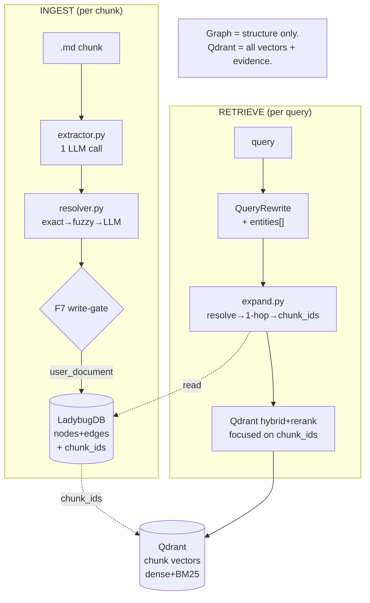
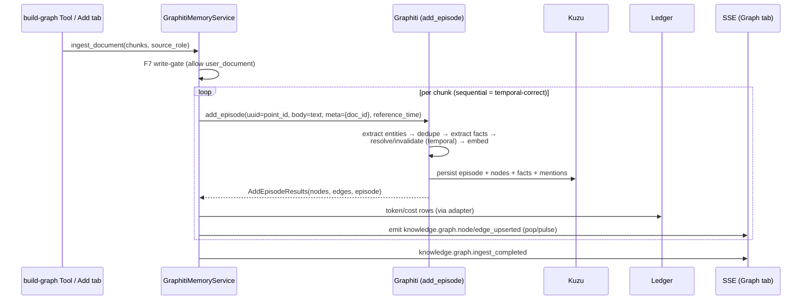
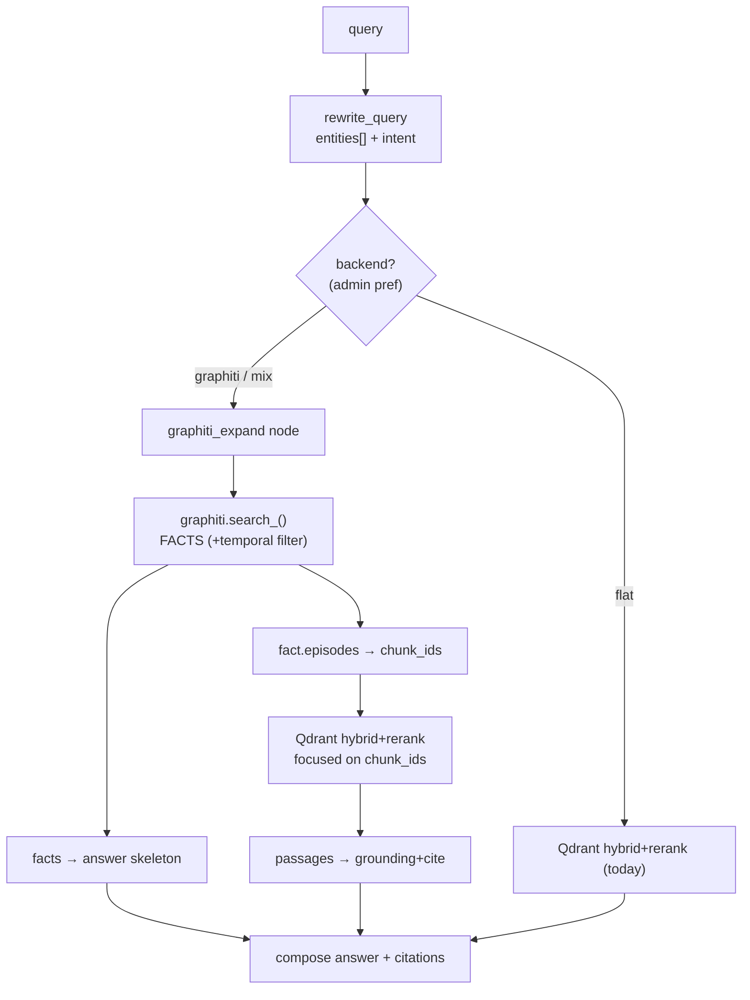
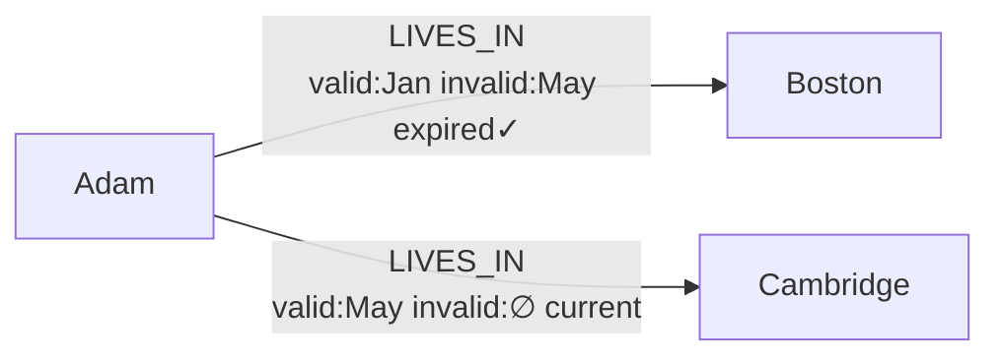
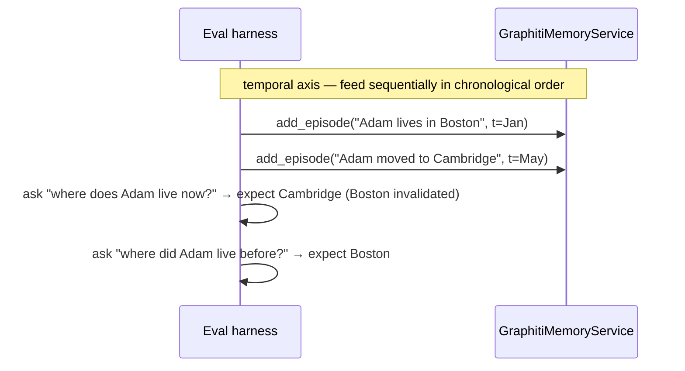

# Knowledge → Graphiti Pivot — Design & Phased Plan

> **Tracker doc (single source).** Specs + design + phases for pivoting the L3
> knowledge-graph vertical from the bespoke **Ladybug (Kuzu fork)** implementation
> to embedding **`graphiti-core`** (with real **Kuzu** as the graph DB), keeping
> **Qdrant** as the evidence/passage layer, and positioning Graphiti as the
> long-term **memory brain** that eventually replaces **mem0**.
>
> **Companions:** [`knowledge-l3-prototype-plan.md`](knowledge-l3-prototype-plan.md)
> (the Ladybug L3 slice this replaces), [`knowledge-graph-viz-design.md`](knowledge-graph-viz-design.md)
> (Graph tab — re-mapped here), [`graphiti-core-quick-map.md`](../../hiro-docs/mem-research/graphiti-core-quick-map.md)
> (Graphiti internals reference).
>
> **Mode:** initial development — **no backward compatibility / no migration / no
> wrappers** (we abide by the repo rule: the old graph vertical is **ripped and
> replaced**, not wrapped). mem0 is the one exception — **kept in code, disabled in
> prefs**, removed only after the evaluation.
>
> **Status:** design only — nothing implemented. Tick checkboxes as phases land.

---

## 1. Goals

### 1.1 Ultimate goal (north star)
A single **temporal knowledge/memory brain** built on Graphiti + Kuzu that:
- maintains a temporal entity/fact graph (facts gain `valid_at`/`invalid_at`/`expired_at`),
- powers **both** knowledge RAG **and** agent memory from one store,
- **replaces mem0** as the memory backend once proven,
- retrieves better on relational / multi-hop / temporal questions than flat RAG,
- scales: Qdrant carries the vector weight, Kuzu carries the structure + time.

### 1.2 Current implementation goal (this pivot)
Replace the **L3 knowledge-graph vertical** (ingest + retrieval + viz + eval) with
Graphiti, behind the existing user surfaces, such that:
- the **build-graph** feature and **Graph tab** keep working (re-pointed underneath),
- **Qdrant stays** the verbatim evidence/citation layer; the two retrievers fuse,
- the **`episode == chunk == Qdrant point_id`** identity preserves chunk-level citations,
- a **temporal-aware 3-way eval** (flat / graphiti / mix) proves or kills the thesis,
- **mem0 stays disabled, not removed**,
- every settable knob is an **admin-UI preference** (no hardcoded params).

---

## 2. Critical decisions (locked in this thread)

| # | Decision | Rationale / source |
|---|---|---|
| **G1** | **Pivot, not drop-in.** Adopt `graphiti-core==0.29.1` as the orchestrator; it replaces `extractor`/`resolver`/`ingest`/`expand`/`ladybug_adapter`, not just the store adapter. | Graphiti owns the whole ingest+retrieval pipeline (quick-map §5–6). |
| **G2** | **Engine = real Kuzu** (`kuzu>=0.11.3`), Graphiti's built-in driver — **not** Ladybug. | Graphiti's driver does `import kuzu`; **`kuzu-0.11.3-cp312-cp312-win_amd64.whl` verified** on this box → Phase 0 unblocked. |
| **G3** | **Integration role = Option B** — Graphiti becomes the memory/knowledge **brain** (long-term mem0 replacement). | User call. |
| **G4** | **Qdrant stays** the verbatim evidence/passage layer (dense+BM25+RRF+rerank). **Two retrievers fused** at answer time. | RAG quality: graph = connections+time, vectors = verbatim grounding. Each fails opposite. |
| **G5** | **Vector-search path = (c)** — rely on Qdrant for vector weight + **deterministic entity lookup** on the graph side; accept that Graphiti's Kuzu driver does **brute-force `array_cosine_similarity`** (no `QUERY_VECTOR_INDEX`) for now. | Kuzu engine *has* HNSW ANN since 0.9.0; the brute-force is a **driver gap**, fine at personal-KG scale. Patch deferred (D-deferred). |
| **G6** | **Provenance bridge:** `add_episode(uuid = Qdrant point_id)`, `episode_metadata` carries `document_id`; `EntityEdge.episodes` gives native fact→episode→chunk. **Feed Graphiti at the existing chunk granularity** (episode == chunk). | Episodes *are* chunks; keeps chunk-level citations + the Qdrant join intact. |
| **G7** | **Model clients = adapter.** LangChain `BaseChatModel` (`model_factory`) → Graphiti `LLMClient`; existing embedder → Graphiti `EmbedderClient`. Honor `model_size` (medium/small). | Preserves tuning profiles + ledger + no-hardcoded-params. Same play used for mem0. |
| **G8** | **Same embedder** for the graph layer as the Qdrant knowledge embedder. | One model to manage; consistency. (Still an admin pref.) |
| **G9** | **Temporal ON** (the reason to adopt). **Communities OFF** (opt-in, deferred). | User call; cost/scope. |
| **G10** | **Write-gate (F7)** re-placed **in front of `add_episode`** (allow-list `user_document`). | Preserve mem0 #4573 bleed prevention by construction. |
| **G11** | **mem0 stays, disabled in prefs**; removal/cleanup is post-eval. | User call. |
| **G12** | **Eval pivots:** 3-way (flat / graphiti / mix) + **temporal/episodic-sequence** axis. **Sequential time-ordered `add_episode`** for temporal; **bulk** only for independent docs. | Bulk doesn't cut extraction LLM cost; supersession needs chronological order. |
| **G13** | **Every settable → admin-UI preference**, enumerated at design time (§9). | Repo convention. |

---

## 3. The pivot at a glance (top-down)

### 3.1 Before — Ladybug as a structure-only router



### 3.2 After — Graphiti brain + Qdrant evidence (dual retriever)

```mermaid
flowchart TD
    subgraph ADAPT["ADAPTERS (preserve model_factory + tuning + ledger)"]
        LLMAD["GraphitiLLMClient<br/>(LangChain → Graphiti)"]
        EMBAD["GraphitiEmbedderClient<br/>(shared embedder)"]
    end
    subgraph ING["INGEST (per chunk = per episode)"]
        C1[".md chunk"] --> GATE1{"F7 write-gate"}
        GATE1 -->|user_document| AE["Graphiti.add_episode<br/>(uuid = point_id)"]
        AE --> KZ[("Kuzu<br/>Episodic + Entity +<br/>EntityEdge facts<br/>+ name/fact_embedding")]
    end
    subgraph RET["RETRIEVE (per query)"]
        Q["query"] --> RW["QueryRewrite + entities[]"]
        RW --> GS["Graphiti.search_()<br/>→ FACTS (+episode uuids)"]
        RW --> QH["Qdrant hybrid+rerank<br/>→ PASSAGES"]
        GS --> FU["FUSE<br/>facts = skeleton + time<br/>passages = grounding + cite"]
        QH --> FU
        FU --> ANS["answer + citations"]
    end
    AE -. uses .-> LLMAD
    AE -. uses .-> EMBAD
    GS -. uses .-> LLMAD
    KZ -. episode.uuid == point_id .-> QD[("Qdrant<br/>chunk passages")]
    GS -. fact.episodes → chunk_ids .-> QD
    QH --> QD
```

### 3.3 What goes away · what comes in

```mermaid
flowchart LR
    subgraph OUT["⛔ GOES AWAY / replaced"]
        O1["extractor.py"]
        O2["resolver.py (ingest-side)"]
        O3["ingest.py / GraphIngestService"]
        O4["ladybug_adapter.py"]
        O5["store.py GraphStore port"]
        O6["expand.py (rewritten)"]
        O7["ladybug dep"]
        O8["old L3 corpus"]
    end
    subgraph IN["✅ COMES IN"]
        N1["graphiti-core 0.29.1 + kuzu dep"]
        N2["GraphitiLLMClient adapter"]
        N3["GraphitiEmbedderClient adapter"]
        N4["GraphitiMemoryService<br/>(bootstrap + ingest + search)"]
        N5["ontology → entity_types +<br/>edge_type_map (Pydantic)"]
        N6["fusion retrieval node"]
        N7["viz/export re-map to Graphiti schema"]
        N8["temporal eval + pivoted corpus"]
        N9["admin prefs + UI controls"]
    end
    OUT -.->|rip & replace| IN
```



> **Kept / reused:** `normalize_name` + the deterministic name/alias lookup (now used
> **query-side** for entity resolution into Graphiti), the **F7 write-gate** concept,
> the **ledger** surface, the **Graph tab** frontend shell, the
> **`knowledge.graph.*` SSE events**, the **Qdrant** vector store unchanged.

---

## 4. Target architecture

```mermaid
flowchart TD
    APP["KnowledgeService / Tools / Agent"]
    subgraph BRAIN["GraphitiMemoryService (new, rip-out-able)"]
        BOOT["bootstrap()<br/>Graphiti(uri/driver=Kuzu,<br/>llm=adapter, embedder=adapter)"]
        ING2["ingest_chunk() → add_episode"]
        SRCH["search() → facts + episode→chunk_ids"]
        SNAP["snapshot() → viz DTO"]
    end
    subgraph GX["graphiti-core 0.29.1"]
        ORCH["Graphiti orchestrator"]
        KDRV["Kuzu GraphDriver"]
    end
    KUZU[("Kuzu DB<br/>workspace/knowledge/graph/")]
    QDR[("Qdrant<br/>workspace/knowledge/qdrant")]
    LLMF["model_factory + tuning profiles"]
    LEDG["ledger (token/cost)"]

    APP --> BRAIN
    BRAIN --> ORCH --> KDRV --> KUZU
    BOOT --> LLMF
    ING2 -. tokens .-> LEDG
    SRCH -. fact.episodes==point_id .-> QDR
    APP -. passages .-> QDR
```

**Boundary:** Graphiti + Kuzu are reached **only** through `GraphitiMemoryService`
(mirrors how mem0 sits behind `MemoryService`). The rest of the system never imports
`graphiti_core` directly — keeps the brain swappable and the boundary rip-out-able
(frontend `features/knowledge/graph/`, backend `services/knowledge/graph/`).

---

## 5. Specs & data contracts

### 5.1 LLM client adapter (G7)
Implement Graphiti's `LLMClient` over a `model_factory`-built `BaseChatModel`:

```text
class GraphitiLLMClient(LLMClient):
    # honor model_size: medium → strong extraction profile, small → cheap profile
    async def generate_response(messages, response_model, max_tokens, model_size, ...) -> dict:
        model = self._resolve(model_size)                  # tuning profile per size
        structured = model.with_structured_output(response_model)
        out = await structured.ainvoke(to_langchain(messages))
        emit_tokens_to_ledger(out)                          # preserve observability
        return out.model_dump()
```

- **Two tuning profiles** (admin prefs §9/§10): `graphiti_extraction` (medium/strong,
  structured-output-capable model — smaller models cause schema failures, vendor-confirmed)
  and `graphiti_small` (cheap sub-steps).
- **No hardcoded params** — temperature/max_tokens/thinking come from the profile.
- **Ledger:** token usage captured via LangChain callback → existing ledger rows.

### 5.2 Embedder adapter (G8)
```text
class GraphitiEmbedderClient(EmbedderClient):
    async def create(input) -> list[float]: ...
    async def create_batch(inputs) -> list[list[float]]: ...
    # wraps the SAME embedder the Qdrant knowledge layer uses
```

### 5.3 Episode ↔ chunk provenance bridge (G6)
| Graphiti field | We set it to |
|---|---|
| `add_episode(uuid=...)` | the Qdrant **`point_id`** (== `chunk_id`) |
| `episode_body` / `content` | the chunk text |
| `episode_metadata` | `{ "document_id": ..., "document_title": ... }` |
| `reference_time` | content/ingest timestamp (drives temporal ordering) |
| `source` | `EpisodeType.text` (docs); `.message` later for chat |
| `group_id` | workspace partition key |

Read-back for citations: `fact.episodes` (UUIDs) → those **are** `chunk_id`s →
fetch verbatim from Qdrant (or `EpisodicNode.content`). **No mapping table.**

> **Chunking rule:** our chunker owns chunking; we ingest **one episode per chunk**.
> Graphiti's internal `should_chunk` (auto-splits large *entity-dense* episodes) will
> mostly no-op on our already-small chunks — keeping `episode==chunk==point_id`. The
> one accepted exception: a very entity-dense single chunk may be split by Graphiti;
> handle by recording the parent `point_id` in `episode_metadata` of sub-episodes.

### 5.4 Ontology → Graphiti types (replaces `ontology.py`)
- `entity_types: dict[str, type[BaseModel]]` — Person, Place, Event, Organization, Object (unknown → base `Entity`).
- `edge_types` + `edge_type_map: {(src,tgt): [REL,...]}` — pins relation vocabulary
  (without it Graphiti free-forms `LIVES_IN`/`RESIDES_IN`/`STAYS_AT` synonyms).

### 5.5 Fusion contract (retrieval)
```text
expand(query) ->
  entities = QueryRewrite.entities
  facts    = graphiti.search_(query, recipe, group_ids=[ws],
                              filters = current_only? )       # temporal filter (admin pref)
  chunk_ids_from_facts = union(f.episodes for f in facts)     # == point_ids
  passages = qdrant.hybrid_rerank(query, focus=chunk_ids_from_facts or None)
  return Answer(skeleton=facts, grounding=passages, citations=chunk_ids)
```

### 5.6 Viz/export DTO re-map (Graph tab)
`snapshot()` maps Graphiti's schema → existing wire DTO:
- `EntityNode` → `GraphNodeDTO{ id=uuid, name, type=labels[0], aliases, chunk_ids=mentioned_episode_uuids, document_ids }`
- `EntityEdge` (RELATES_TO) → `GraphEdgeDTO{ id, source, target, rel_type=fact_type, fact, valid_at, invalid_at, chunk_ids=episodes }`
- (optional) `EpisodicNode` exposed as a distinct node kind later.
- `knowledge.graph.*` SSE events emitted from `AddEpisodeResults` (nodes/edges/episode).

---

## 6. Ingest design



- **Sequential per chunk** for temporal correctness (a later fact can invalidate an earlier one).
- **Bulk (`add_episode_bulk`)** reserved for **independent** documents (throughput);
  grounded note: bulk **does** dedup+invalidation in 0.29.1 but **does not** cut
  per-episode extraction LLM cost.

---

## 7. Retrieval design



- New **`graphiti_expand`** LangGraph node replaces `graph_expand`; soft-fallback to
  flat on any error (same resilience policy as today).
- **Temporal filter** (`current facts only` vs `include historical`) is an admin pref
  with a per-query override — Graphiti's default `search` is relevance-first, *not*
  current-only, so we set `SearchFilters` explicitly.
- `use_graph` / backend selection threaded `KnowledgeService.answer → KnowledgeAnswerTool`.

---

## 8. Temporal model + eval design

### 8.1 Temporal facts (new capability)
`EntityEdge` carries `valid_at` / `invalid_at` / `expired_at`. Supersession example
(from the relatable corpus §8.2 — Adam moves Boston → Cambridge in May):



### 8.2 Relatable corpus — "Adam's year" (35 episodes)

One person's life over ~12 months, authored as dated notes/chat — relatable and easy
to follow (replaces the abstract framing). The cast + arc is deliberately built so a
single corpus exercises **every** category in §8.4:

- **People:** Adam (owner), Nora (wife), Lina (sister), Omar (Lina's husband), **Sam**
  (Adam's brother) **and Sam Reyes** (a coworker — the *entity-confusion* trap), friends Marco & Yuki.
- **Orgs:** Brightloom (Adam's 1st job) → Cedar Labs (2nd job); Meridian Bank (Omar's job).
- **Places:** Boston → Cambridge (Adam moves, May); Lina & Omar → Kyoto, Japan (open-domain hook: yen).
- **Preferences that change (conflict/update):** coffee espresso → oat-milk latte (Sep); diet → vegetarian (Oct).
- **Dated events (causal/temporal):** Jan start Brightloom · Mar marathon training *(because the
  doctor flagged blood pressure)* · Apr Lina↔Omar wedding · May move to Cambridge · Jun runs the
  marathon · Jul Lina/Omar move to Kyoto · Aug switch to Cedar Labs · Nov trip organized by Marco (jazz fan).
- **Deliberate gaps (abstention / false-premise):** no pet · never visited Paris · blood type never stated.

**35 episodes**, ~3/month, fed **sequentially in chronological order** so supersession
works (a later fact invalidates the earlier one).

### 8.3 Corpus file format — single file, many episodes (our split, never Graphiti's)

Canonical = **JSONL**, one episode per line (`*.episodes.jsonl`). We split on line
boundaries and hand Graphiti **one small body at a time**, so `should_chunk` never fires
and `episode == chunk == Qdrant point_id` holds.

```jsonl
{"id":"ep_001","timestamp":"2024-01-15T09:00:00Z","type":"text","body":"Adam started a new job at Brightloom today as a backend engineer.","metadata":{"source":"journal","document_id":"adam_year"}}
{"id":"ep_007","timestamp":"2024-03-04T19:30:00Z","type":"text","body":"Adam's doctor warned him his blood pressure is high, so he's decided to train for a marathon.","metadata":{"source":"journal","document_id":"adam_year"}}
{"id":"ep_022","timestamp":"2024-08-12T08:00:00Z","type":"message","speaker":"Adam","body":"Big news — I left Brightloom and start at Cedar Labs next week!","metadata":{"source":"chat","document_id":"adam_year"}}
{"id":"ep_028","timestamp":"2024-09-20T07:45:00Z","type":"text","body":"Funny how tastes change — Adam now orders an oat-milk latte every morning, no more espresso.","metadata":{"source":"journal","document_id":"adam_year"}}
```

| Field | Req | Maps to | Notes |
|---|---|---|---|
| `id` | ✓ | `add_episode(uuid=)` **and** Qdrant `point_id` | unique; the join key |
| `timestamp` | ✓ | `reference_time` | ISO-8601; temporal order |
| `type` | – | `EpisodeType` (`text`/`message`) | default `text` |
| `speaker` | – | prefixed into body for `message` | optional |
| `body` | ✓ | `episode_body` | **small** (< `CHUNK_MIN_TOKENS`) → no auto-chunk |
| `metadata` | – | `episode_metadata` | `document_id`, `source`, … |

**Loader contract (the "won't be Graphiti-chunked" guarantee):** parse line-by-line
(our split) → sort by `timestamp` → per episode **sequentially**: assert
`tokens(body) < CHUNK_MIN_TOKENS` (else fail-loud), **upsert to Qdrant** (`point_id=id`)
so flat/mix see it, then **`add_episode(uuid=id, …)`**. One small body per call ⇒
`should_chunk=False` ⇒ no internal split.

> **Reusable beyond eval:** this is the general **series-ingest** format too — upload one
> journal/chat-log file, processed as a dated episode series (ties to G6). A human-friendly
> Markdown-with-frontmatter authoring format that *compiles* to this JSONL is a deferred nicety.

### 8.4 Question categories (eval-platform-style, smaller scale)

| Category | Subcat | Tests | Example (Adam corpus) | Expected |
|---|---|---|---|---|
| `direct` | — | fact stated once | "What's Adam's wife's name?" | Nora |
| `single_hop` | — | one relation | "Who is Omar married to?" | Lina |
| `multi_hop` | relational | chain person→…→fact | "What does Adam's sister's husband do for work?" | Meridian Bank |
| `multi_hop` | person→event→pref | cross-type chain | "Who organized the Nov trip, and what music do they like?" | Marco · jazz |
| `causal` | — | why / because | "Why did Adam start marathon training?" | doctor / blood pressure |
| `non_existing` | — | entity absent → abstain | "What's the name of Adam's dog?" | **ABSTAIN** |
| `event_recall` | — | recall dated event | "Did Adam run a marathon, and when?" | yes · June |
| `preference_recall` | — | stated preference | "What running-shoe brand does Adam wear?" | Asics |
| `temporal` | order | event ordering | "Did Adam change jobs before or after moving to Cambridge?" | after |
| `temporal` | latest_state | current value | "Where does Adam work now?" | Cedar Labs |
| `temporal` | comparison | time math | "How many months after joining Brightloom did he leave?" | ~7 |
| `knowledge_update` | conflict | latest wins, not superseded | "What's Adam's current favorite coffee?" | oat-milk latte (**not** espresso) |
| `open_domain` | mem+world | stored fact + world knowledge | "What currency does Lina use where she lives now?" | yen |
| `misleading` | entity_confusion | two same-name people | "Where does Sam work?" | disambiguate (brother vs coworker) |
| `misleading` | contradictory_trap | false embedded relation | "Who's Adam's manager at Brightloom now?" | correct premise — he left in Aug |
| `misleading` | false_premise | event never happened | "When did Adam visit Paris?" | **ABSTAIN** / correct |
| `abstention` | — | unanswerable | "What's Adam's blood type?" | "I don't know" |

### 8.5 Question bank + checklist feature (new)

**Bank** = `eval/question_bank.yaml`, **≥50 questions** across the categories above:

```yaml
- id: q_update_01
  category: knowledge_update
  subcategory: conflict
  text: "What is Adam's current favorite coffee?"
  expected_kind: fragments          # fragments | abstain | world
  expected: ["oat", "latte"]
  must_not_contain: ["espresso"]     # catches superseded-fact leakage
  requires: [graph, temporal]        # which mode "should" win
- id: q_falsepremise_01
  category: misleading
  subcategory: false_premise
  text: "When did Adam visit Paris?"
  expected_kind: abstain
  requires: []
```

**Checklist (new admin feature):** an **Eval panel** renders the bank **grouped by
category**, each question a checkbox; a **selected counter capped at 50** (further checks
disabled at the cap); per-category "select all"; pick **modes** (flat / graphiti / mix);
**Run**. Backend: `knowledge_eval_run(question_ids[], modes[])` **Tool + route** → runs
selected Qs × modes → returns per-question verdicts, **per-category aggregates**, and the
3-way table (Tool Registry, like every surface).

### 8.6 Scoring & gate

- **fragments:** all `expected` present (substring, normalized) **and** none of
  `must_not_contain` → ✓; partial → ◐; miss → ✗.
- **abstain:** ✓ when the answer declines; **✗ = hallucination** when it fabricates — the
  metric that matters for `non_existing` / `false_premise` / `abstention`.
- **Per-category × 3-way table** so you see *where* graph/mix helps:

```
category            | flat | graphiti | mix | Δ(best)
--------------------+------+----------+-----+--------
direct              |  ✓   |    ✓     |  ✓  |   0
single_hop          |  ◐   |    ✓     |  ✓  |  +1
multi_hop           |  ✗   |    ✓     |  ✓  |  +1
causal              |  ◐   |    ✓     |  ✓  |  +1
temporal/latest     |  ✗   |    ✓     |  ✓  |  +1
knowledge_update    |  ✗   |    ✓     |  ✓  |  +1
open_domain         |  ◐   |    ◐     |  ✓  |  +1
entity_confusion    |  ✗   |    ◐     |  ◐  |  +1
false_premise       |  ✗   |    ✓     |  ✓  |  +1
abstention          |  ◐   |    ✓     |  ✓  |  +1
```

- **Gate:** proceed/pivot on the **relational + temporal + abstention** deltas,
  evidence-first (same discipline as L3 §5.6). Expect parity on `direct`/`preference_recall`,
  big wins on `multi_hop`/`temporal`/`knowledge_update`, and `abstention` measuring
  hallucination resistance.



---

## 9. Admin UI changes (every settable → preference)

| Setting | Type | Where it renders | Notes |
|---|---|---|---|
| **Memory/graph backend** | enum `off / graphiti / mix` (+ legacy off) | Knowledge settings | master switch for the new path |
| **Graphiti extraction model + tuning profile** | model + profile id | Knowledge/Models settings | structured-output-capable (medium) |
| **Graphiti small-model + profile** | model + profile id | Knowledge/Models settings | cheap sub-steps (`model_size=small`) |
| **Graph embedder** | model (default = shared knowledge embedder) | Knowledge settings | G8; still selectable |
| **Temporal filter default** | enum `current-only / include-historical` | Knowledge settings | per-query override allowed |
| **Communities** | bool (default off) | Knowledge settings (advanced) | G9 — placeholder, deferred |
| **k-hop / BFS depth** | int | Knowledge settings (advanced) | retrieval expansion |
| **Search recipe** | enum (RRF / MMR / cross-encoder) | Knowledge settings (advanced) | Graphiti `search_` config |
| **Chunk density knobs** | ints (`CHUNK_*`) | Knowledge settings (advanced) | only if we override Graphiti defaults |
| **Use-graph at query** | bool / per-request | Ask tab + tool param | A/B + runtime control |
| **Eval: question selection** | multi-select checklist, **cap 50** | new **Eval panel** | grouped by category; per-category select-all; live counter |
| **Eval: modes** | multi `flat/graphiti/mix` | Eval panel | which retrievers to compare |
| **Eval: model/profile** | reuse knowledge models | Eval panel | the answering model under test |

- Schema lives in `domain/preferences.py` (`KnowledgePreferences` / a new `KnowledgeGraphPreferences` group + validated writes + change events).
- Frontend: extend the knowledge settings/preferences Svelte surface (follow
  `svelte-best-practice`; reuse existing settings controls). Exact files confirmed at implementation.
- **Rule:** no knob ships hardcoded; each lands with its preference key + UI control in the same phase.

---

## 10. Preferences schema additions (sketch)

```text
KnowledgeGraphPreferences:
    backend: "off" | "graphiti" | "mix" = "off"
    extraction_model: str | None
    extraction_tuning_profile: str = "graphiti_extraction"
    small_model: str | None
    small_tuning_profile: str = "graphiti_small"
    embedder_model: str | None            # default → knowledge.default_embedding_model
    temporal_default: "current" | "all" = "current"
    communities_enabled: bool = False     # deferred
    k_hop: int = 1
    search_recipe: str = "rrf"
# tuning_profiles[]: add graphiti_extraction (medium) + graphiti_small (small)
```

---

## 11. Tooling / Tool Registry

| Tool | Fate |
|---|---|
| `knowledge_graph_ingest` | **re-pointed** to `GraphitiMemoryService.ingest_*` (same name/UX) |
| `knowledge_graph_export` | **re-mapped** to Graphiti snapshot → viz DTO |
| `knowledge_answer` | gains backend/temporal params (still default-safe) |
| *(new)* `knowledge_graph_search` | optional — expose Graphiti fact search as a Tool (CLI/Agent/HTTP) |
| `knowledge_graph_ingest_batch` | maps to `add_episode_bulk` (independent docs only) |

All surfaces go through the **Tool Registry** (repo rule *consider-creating-tools-first*).

---

## 12. Observability (ledger)
- Token/cost captured in the **LLM adapter** (§5.1) → existing ledger rows, per
  add_episode sub-step where feasible (extract / dedupe / edge-resolve).
- Ingest stats row: episodes, entities created/merged, facts created/invalidated, tokens.
- Retrieval ledger: facts returned, episodes→chunk_ids, passages, fusion outcome
  (so cost/quality stays visible per Ask, like today).

---

## 13. Phased plan

> Status legend: **[x] done + tested** · **[~] backend done, frontend/live pending** · **[ ] not started**.
> mintdocs updates are intentionally deferred across all phases (per user) and tracked once in Phase 9.

### Phase 0 — Verify & scaffold ✅
- [x] `kuzu-0.11.3-cp312-cp312-win_amd64.whl` resolves on Windows/py3.12.
- [x] `graphiti-core==0.29.1` installs clean on py3.12; pinned in `hirocli/pyproject.toml` (+ `kuzu`, `neo4j` transitive).
- [x] Smoke: `KuzuDriver` opens an embedded DB; `build_indices_and_constraints()` runs on Windows.

### Phase 1 — Adapters + bootstrap ✅
- [x] `GraphitiLLMClient` (LangChain→Graphiti, `model_size` routing, ledger usage sink) — `graphiti_adapters.py`.
- [x] `GraphitiEmbedderClient` (shared knowledge `EmbeddingBackend`, G8).
- [x] `GraphitiMemoryService` bootstrap (clients + Kuzu driver + default group_id; RRF no-op cross-encoder to avoid forced OpenAI reranker) — `graphiti_service.py`.
- [x] Tuning profiles `graphiti_extraction` + `graphiti_small` + resolve helpers + `KnowledgeGraphPreferences` (backend) — `domain/preferences.py`.
- [x] Tests: 10 adapter + 8 prefs + 3 bootstrap, green.

### Phase 2 — Ingest path + re-point build-graph + Ladybug rip-out ✅
- [x] `ingest_episodes` / `GraphitiMemoryService.ingest_chunks` → `add_episode(uuid=point_id, …)`, **sequential, chronological** — `graphiti_ingest.py`.
- [x] **F7 write-gate** in front of `add_episode`; ontology `entity_types` — `graphiti_ontology.py`.
- [x] Re-pointed `knowledge_graph_ingest` Tool to Graphiti; backend toggle pref (`off/graphiti/mix`).
- [x] **Full Ladybug rip-out** (ladybug+kuzu can't share a process) — deleted 9 modules + 7 tests, dropped `ladybug`+`rapidfuzz` deps.
- [x] Tests: write-gate, param mapping, ordering, stats, events. 568 collect.

### Phase 3 — Retrieval fusion ✅
- [x] `graph_expand` node → Graphiti `search()` → facts → `episodes`→chunk_ids → existing Qdrant `HasIdCondition` focus — `graphiti_search.py`.
- [x] Temporal filter (drop superseded for `current`) + admin pref `temporal_default` + per-query `graph_temporal`.
- [x] Soft-fallback to flat on miss/error; no-graph guard (no empty-DB side effect). `use_graph` threading reused.
- [x] Tests: 7 search + 21 agent compat.

### Phase 4 — Viz/export re-map (backend) ✅
- [x] `read_graph_snapshot` (read-only Kuzu via `get_by_group_ids`; empty-graph handled; **Kuzu lock-release fix**) → `graphiti_serialize.py` DTO (+ `fact`/`valid_at`/`invalid_at`).
- [x] Real async `graph_snapshot_payload` + export route awaits it. node/edge live-viz SSE events from `add_episode` results.
- [~] **Frontend Graph tab** is DTO-compatible (same shape) — expected to render unchanged; needs a live browser check.

### Phase 5 — Eval backend: corpus + scoring + parser ✅
- [x] `eval/adam_year.episodes.jsonl` — **35 dated episodes** (relatable; all categories + temporal traps).
- [x] `eval/adam_questions.yaml` — **32 questions** across all 12 categories (abstain + must_not_contain + requires).
- [x] JSONL parser `graphiti_corpus.py` (our-split, chronological, fail-loud on oversize).
- [x] Scoring: `must_not_contain` (superseded-fact guard); `load_questions` extended; `category_breakdown` + `by_category`.
- [x] Tests: ~20 incl. corpus integrity (35 episodes, all categories, forbidden facts present).

### Phase 6 — Eval runner wiring (Adam corpus ingest + run) ✅
- [x] `KnowledgeVectorStore.upsert_point` (caller-chosen `point_id`) + `KnowledgeService.ingest_text_chunk` (dense+sparse) for the Qdrant double-write.
- [x] `ingest_adam_corpus_via_service` — parse JSONL → `uuid5(episode_id)` shared as Qdrant point_id **and** Graphiti episode uuid → Qdrant upsert (tagged) + `add_episode`, sequential.
- [x] eval route/tool `corpus_source: synthetic|adam` (+ `question_ids` subset) → `run_eval(questions=adam_questions, filters=adam_tag)`.
- [x] Tests: uuid mapping + double-write (fakes); 571 collect.

### Phase 7 — Eval checklist UI ✅
- [x] `GET /knowledge/eval/questions` (bank list) + `question_ids` subset filter on route+tool.
- [x] `KnowledgeAskEvalBatch.svelte`: corpus-source selector; **category-grouped checklist** (cap 50, per-category select-all, live counter); per-category × flat/graph results table from `by_category`.
- [x] api/events/controller threaded (`corpus_source`/`question_ids`/`by_category`). svelte-check 0 errors.
- [~] Live browser check pending (needs backend running).

### Phase 8 — Admin settings UI for graph prefs ✅
- [x] `KnowledgeSection.svelte`: "Knowledge Graph (Graphiti)" subsection — backend enum, extraction + small model pickers + profiles, embedder, temporal default, k_hop, search recipe, communities.
- [x] Controller setters + `KnowledgePreferences` TS type + `DEFAULT_KNOWLEDGE` extended with `graph`. svelte-check 0 errors.
- [ ] Add-tab build-graph result fields → new Graphiti stat keys (minor cosmetic; deferred).
- [~] Live browser check pending (needs backend running).

### Phase 9 — Deferred / follow-up (not now)
- [ ] **mintdocs** — Graph view, `knowledge.graph.*` events, tools/routes, new prefs, first-time-setup deps, workspace-folder Kuzu file (all docs deferred to here).
- [ ] Patch Kuzu driver to use `QUERY_VECTOR_INDEX` (ANN) when fact-vector recall matters at scale.
- [ ] Communities · Sagas · Chat-as-ingestion (live `message` episodes).
- [ ] **mem0 removal** + cleanup (after eval confirms). Remove now-dead old graph resolve helpers/profiles.

---

## 14. Deferred items & non-goals (this pivot)

| Item | Status |
|---|---|
| Kuzu driver ANN (`QUERY_VECTOR_INDEX`) | **Deferred** (G5) — engine supports it; driver gap; not needed at current scale |
| Communities | **Deferred** (G9) — opt-in flag placeholder only |
| Sagas | **Deferred** — useful with chat |
| Chat/connector ingestion | **Deferred** — docs only now; episodic eval *simulates* sequence |
| mem0 removal | **Deferred** (G11) — disabled, not deleted |
| Custom per-type node/edge attribute models | **Deferred** — base ontology first |
| 3D / WebGL viz, query overlay (viz Phase 3) | **Deferred** — re-map after MVP |

---

## 15. Risks & mitigations

| Risk | Mitigation |
|---|---|
| Smaller models → schema/ingestion failures (vendor-confirmed) | Structured-output model for `medium`; route via tuning profile; fail-loud + ledger |
| Graphiti per-episode LLM cost at scale | Small model for sub-steps; bulk for independent docs; cost visible in ledger; corpus tiny for eval |
| Brute-force fact-vector search ceiling | G5 path (c): Qdrant carries vectors; deterministic entity lookup; driver ANN deferred |
| Episode/chunk identity fork on dense chunks | Ingest at our chunk granularity; record parent `point_id` in sub-episode metadata |
| Temporal ordering wrong → bad supersession | Sequential, `reference_time`-ordered ingest for temporal paths |
| Boundary leak (graphiti imported widely) | All access via `GraphitiMemoryService`; rip-out-able boundary |
| Kuzu py3.13 wheels lag | Stay on py3.12 (current) |

---

## 16. Build/setup changes to reflect (repo rules)

- **no-backward-compatibility:** we **abide** — the old graph vertical is removed, not
  wrapped; no migration of existing Ladybug graphs (re-ingest).
- **reflecting-build-updates:** new deps (`graphiti-core`, `kuzu`), removed dep
  (`ladybug`) → update `first-time-setup.mdx`; new workspace layout note for the Kuzu DB
  → `workspace-folder.mdx`; new prefs → `preferences.mdx`.
- **To get up to speed after this lands (breaking):** existing `workspace/knowledge/graph/`
  (Ladybug) must be **wiped and re-ingested** under Kuzu; set the backend pref + models.

---

## 17. TL;DR

- **What:** pivot the L3 knowledge-graph vertical from **Ladybug → `graphiti-core` + Kuzu**;
  Graphiti becomes the **temporal memory brain** (long-term mem0 replacement); **Qdrant stays**
  the verbatim evidence/citation layer; **two retrievers fuse**.
- **Why it works:** **episodes == chunks** (`uuid = point_id`), so chunk-level citations
  and the Qdrant join survive; facts carry `episodes` natively. Graph = connections+time,
  vectors = grounding.
- **Decisions locked:** Option **B**; vector path **(c)** (Qdrant carries vectors; Graphiti
  driver brute-force accepted, ANN deferred); **adapter** for LLM+embedder (preserve tuning
  profiles+ledger); **same embedder**; **temporal on / communities off**; **write-gate kept**;
  **mem0 disabled not removed**; **sequential ingest for temporal, bulk for independent docs**.
- **Goes away:** `extractor/resolver/ingest/expand/ladybug_adapter/store` + ladybug dep + old corpus.
  **Comes in:** graphiti+kuzu, two adapters, `GraphitiMemoryService`, ontology types, fusion node,
  viz re-map, temporal eval, **admin prefs/UI for every knob**.
- **Phases:** 0 verify · 1 adapters · 2 ingest+re-point build-graph · 3 retrieval fusion ·
  4 viz re-map · 5 temporal eval · 6 deferred (ANN, communities, sagas, chat, mem0 removal).
- **Status:** design only — **awaiting your "let's implement."**
