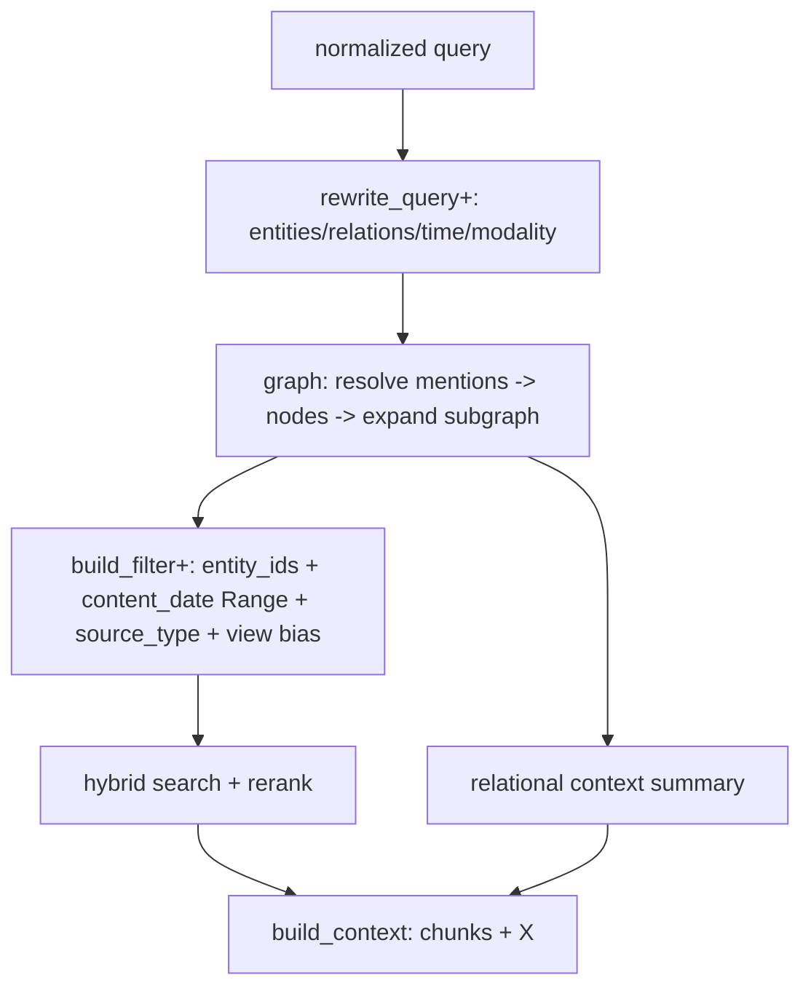

# Knowledge RAG — L3 **Content Routing** Design (initial)

> Child of [`knowledge-scoping-design.md`](knowledge-scoping-design.md) — that doc defines the
> scoping funnel (L0 gating · L1 identity · L2 character profile · **L3 content routing** · L4
> quality · L5 abstain). This doc drills into **L3 only**: narrowing *and expanding* retrieval
> by **what the query is about** — topic, entity, time, modality, and **relationships**.
>
> Siblings: [`knowledge-service-v1-design.md`](knowledge-service-v1-design.md) (service/data
> model), [`rag-optimize.md`](rag-optimize.md) (retrieval **quality**).
>
> **Initial-development mode:** no backward compatibility, no migration, no wrappers.
> **Status: design / discussion. Nothing here is implemented.** This is the *initial* draft —
> the backbone and decisions, not the final spec.

## 1. The thesis

Two claims drive every decision below.

**Claim A — L3 is an *index* problem, not a *query* problem.** The query→filter step is a
mechanical extension of machinery that already exists (`QueryRewrite` structured output +
`build_qdrant_filter`). You can only filter/route on **what you indexed at ingest**. So all the
leverage — and all the real work — is on the **ingest/index** side: deciding what structure to
manufacture from raw, messy, multi-modal personal data.

**Claim B — personal knowledge is relational, so a graph is the backbone.** Human questions are
multi-entity and multi-hop *by default*. "Tell me about my sister" is only meaningful with her
neighbors (husband, kids, employer, last visit). "What did I do with Selim in Paris" is two
entities + a relation + the user. Even a single-entity ask never isolates the entity from its
relations. Neighbor expansion (anchor on entities → pull their k-hop ego-graph → fetch attached
chunks) is therefore a **core retrieval primitive**, not an edge case.

The one distinction that keeps Claim B affordable:

> **Graph *model* + traversal = a necessity, designed in from the start.**
> **Graph *database product* = a swappable storage detail, deferrable, and at personal scale
> possibly never required.**

These are different commitments. We commit to the model now and keep the engine behind a thin
interface (§6).

## 2. What L3 must answer (classic examples)

| Query | Dimensions | Graph operation |
|---|---|---|
| "what did I say in my **voice notes** about the apartment **last week**?" | modality + time + topic | *(no graph)* payload filter only |
| "tell me about **my sister**" | entity + neighborhood | node + 1-hop ego-graph → chunks per node |
| "what did I do with **Selim** in **Paris**?" | 2 entities + relation | resolve {Selim, Paris} → connecting events → chunks |
| "what does **my sister's husband** do?" | 2-hop path | Lina —spouse→ Omar —works_at→ ? |
| "did anyone from the **ski trip** ever meet **my parents**?" | set intersection over edges | participants(ski_trip) ∩ neighbors(parents) |
| two people named **Ahmed** | disambiguation | resolve mention → correct node id (not string) |

The first row needs no graph; the rest do. Relationship-aware retrieval is the **norm**.

## 3. The graph plays two roles at once

This is why the graph "connects everything":

1. **Router / scope.** Resolve the mentioned entities → expand their neighborhood → the
   subgraph's **node-ids become the filter** over the Qdrant evidence chunks. Replaces fragile
   string matching with structural reach.
2. **Context itself.** The subgraph *is* answer material — "Selim is your colleague; the Paris
   trip was Jul 2025; Lina was there too." Flat chunks cannot express that; the edges can. This
   relational context is fed alongside the retrieved chunks.

## 4. The hard part is the **write** side, not the read side

Traversal is cheap. The engineering difficulty — and the reason this is "sooner or later," not
"next sprint" — is **constructing and maintaining a correct graph from messy personal data**:

- **Entity resolution across modalities** — "Selim" in a chat, "my colleague" in a voice note, a
  face in a photo description → **one** node. This is make-or-break.
- **Relationship extraction + typing** — not "Selim appears near Paris" but
  `(you)-[traveled_with {when: 2025-07}]->(Selim)`.
- **Temporal validity of edges** — `works_at` changes; "my ex"; an edge true in 2023, not 2025.
- **Dedup / contradiction / provenance** — which source asserted an edge (for trust + citation),
  and how to resolve disagreements.

The query layer (resolve → expand → intersect) is comparatively trivial. **Budget accordingly.**

## 5. Ownership: knowledge owns its entity layer — **not** Mem0

The graph/entity capability is built and owned **by knowledge**, not borrowed from the memory
subsystem. Rationale:

- **Different semantics.** Mem0 extracts *facts from conversation turns* with memory lifecycle
  (supersession, decay, importance, `user_id`/`agent_id` scope). Indexing a document corpus for
  retrieval is a different task; reusing Mem0's output would make knowledge quality hostage to
  memory's extraction choices.
- **Different lifecycle / fate.** Memory (Mem0) is under review and can be disabled; nothing
  load-bearing in knowledge may depend on it. (Observed today: knowledge-augmented context being
  re-ingested into Mem0 makes memory an echo of recent knowledge — a write-policy bleed that is
  *worse* under coupling and is a direct argument for keeping the two separate.)
- **Honors the existing rule:** *"RAG retrieves evidence. Mem0 remembers meaning."* Separate
  stores, separate pipelines.

**Allowed reuse — code, never data.** If both subsystems extract entities, the *extraction
helper* may live in `hiro-commons` (per the common-utility rule), but the **stores, graphs,
pipelines, and instances stay fully separate**. Share the utility; never the data or the
instance.

## 6. Architecture: design the graph in, abstract the storage

The graph capability is committed now; the concrete engine sits behind a thin `GraphStore` port
so it stays replaceable.

```
 retrieval code ──► GraphStore (port) ──►  [ LadybugDB (chosen)  ]  Cypher + persistence
                    resolve(mention) -> node   [ DuckDB+DuckPGQ      ]  ← sole fallback
                    neighbors(node, k) -> nodes [ (port keeps it      ]
                    connect(nodes) -> subgraph  [  swappable)         ]
                    edges(node) -> [edge]
        every node & edge carries chunk_ids ──► Qdrant evidence chunks
```

**Decision (locked): adopt an embedded graph DB — `LadybugDB` (the community Kuzu-lineage fork) —
behind a `GraphStore` port.** A graph DBMS gives us, out of the box, the features a relational
personal-knowledge graph actually needs and that an in-memory library does **not** have:
persistence + ACID/WAL, **Cypher** (declarative pattern-matching for multi-hop / multi-entity),
an enforced node/relationship **schema**, secondary indexes, and larger-than-RAM storage. Those
are categorical capabilities, not performance tuning — which is why a library was the wrong call.

Why Ladybug specifically, and why *not* the others — **settled, not reopened**:

| Option | Verdict | Why |
|---|---|---|
| **LadybugDB** (Kuzu fork) | **chosen** | strongest community-continuity fork (~1.2k★ vs Vela 36★), collective governance, confirmed `pip install ladybug`, single-writer embedded is its mainline, positioned as a 1:1 Kuzu successor; gives Cypher + persistence + schema + vector/FTS |
| Vela Kuzu fork | **rejected** | single-company (VC) fork; its one differentiator is concurrent **multi-writer**, which our single-writer personal workload excludes |
| Upstream Kuzu | **rejected** | archived Oct 2025 (PyPI frozen at 0.11.3); don't found on a dead project |
| NetworkX / rustworkx (library) | **rejected** | no persistence, no Cypher, no schema, no built-in indexes — lacks the obvious features needed; only wins on longevity |
| hand-rolled SQLite recursive-CTE traversal | **rejected** | this *is* reinventing a query engine |
| ArcadeDB / Neo4j-embedded | **rejected** | embedded **JVM** violates the lightweight / no-external-runtime deal-breakers |

**Risk management (because it is a young fork):** pin **and vendor** a specific Ladybug version
(verify Windows wheels for the target Python first, per the deps rule); keep the `GraphStore` port
thin (~4 ops: `resolve` / `neighbors` / `connect` / `edges`) so the engine is swappable. **Sole
sanctioned fallback** if Ladybug ever stalls: **DuckDB + DuckPGQ** (embedded, no-JVM,
Windows-native, persistent graphs, SQL/PGQ) behind the same port — one path, not a menu.

**Scope boundary — keep Qdrant for evidence.** Ladybug ships vector + full-text search, but the
knowledge chunk pipeline (dense + BM25 + RRF + rerank) already lives in Qdrant and works. The
graph stores **structure** (entities, relationships, links to `chunk_ids`); Qdrant stores
**evidence**. Do **not** fold chunk vectors into the graph engine now — that's throwing away
working infra. Revisit only if a clear reason emerges later.

**Scale reality:** one person's life ≈ 10⁴–10⁵ entities, ≤ ~10⁶ edges; a household × years is
still modest — comfortably within an embedded graph DB. The graph **model** is necessary; a
heavy *server* graph DB is not, which is exactly what an embedded engine like Ladybug gives.

## 7. The index side — what we manufacture at ingest

Three indexed artifacts, all produced by knowledge's own ingest pipeline:

### 7a. The entity/relationship graph (the backbone)
Nodes (`person / place / object / event / org / …`) and typed, time-stamped edges, each linked
to the `chunk_ids` (and `document_id`s) that assert them. Built by an ingest-time extraction +
resolution step (§4). Stored via the `GraphStore` interface (§6).

### 7b. Flat structured chunk metadata (the cheap, always-on layer)
Added to each Qdrant chunk payload so the common dimensions filter without the graph:

| Field | Qdrant type | Unlocks | Source |
|---|---|---|---|
| `entity_ids` | `KEYWORD` (array) | entity scope by **resolved id**, not string | graph resolution |
| `content_date` (epoch int) | `INTEGER` + `Range` | "last week", "in 2019" | **parsed from content** (≠ `ingested_at`) |
| `source_type` | `KEYWORD` *(exists)* | "my voice notes", "my photos" | loader |
| `category_id` / `tags` | *(exist)* | topic | taxonomy |

> **`content_date` ≠ `ingested_at`.** "Last summer" means when the event *happened*, not when the
> file was imported. Needs a content-parsed date + a Qdrant `Range` clause (not wired today).

### 7c. Multi-representation views (turn raw dumps into queryable shapes)
Raw personal data (a 4,000-message export, a photo folder) is not in a retrievable shape. At
ingest, generate *additional* indexed representations, each tagged with a `view_type` payload
field and stored alongside the raw chunks in the same collection:

| `view_type` | What it is | Query shape it serves |
|---|---|---|
| `raw` | verbatim chunks *(today)* | detail / recall |
| `entity_card` | synthesized "everything about Selim" | persona "tell me about X" → one strong hit |
| `summary` | per-doc / per-section summary | document-level routing |
| `timeline` | one record per event + `content_date` | "what did I do last summer" |
| `qa` *(optional)* | hypothetical questions a chunk answers | question-shaped queries |

Ingest is offline/manual (per v1 D12), so this is the right place to spend: **pay at ingest to
make every query cheap and precise.**

## 8. The query side (mechanical — extend what exists)

Two small extensions plus a graph step:

1. **Extend `QueryRewrite`** (`helpers.py`) — add `entities[]`, `relations[]` (optional),
   `time_range`, `modality`, `categories[]` to the existing structured-output call. Same node,
   same token accounting, same silent fallback.
2. **Graph resolve + expand** — resolve the emitted entity mentions to node-ids, expand the
   relevant neighborhood/path, collect the subgraph's node-ids (+ a relational context summary).
3. **Extend `build_qdrant_filter`** — add `entity_ids` (keyword), `content_date` (`Range`),
   `source_type` (keyword), `view_type` bias, alongside the existing scalar/tag clauses.

Retrieval flow (L3 internals), slotting into the existing graph between rewrite and search:



**Safety rules (inherited from the scoping doc):**
- **Identity scope (L1) stays a hard filter**, server-side, never from the LLM.
- **Inferred content scope is soft** — run the scoped/graph-narrowed pass; if it returns too few
  hits over `min_score`, **re-run unfiltered** (graph expansion is a *boost*, not a gate). A wrong
  entity guess must not erase recall.
- **Explicit user constraints may be hard** — "my voice notes" → `source_type=voice_note` is
  certain because the user said so.

## 9. Worked example (end to end)

**Maya → Aria (persona): "what does my sister's husband do for work?"**

1. `rewrite_query+` → entities `["my sister", "husband"]`, relation `spouse → employment`.
2. graph: `resolve("my sister") → Lina(e_204)`; `neighbors(e_204, spouse) → Omar(e_211)`;
   `edges(e_211, works_at) → Acme(e_330)` (2-hop path).
3. filter: `entity_ids ∋ {e_211, e_330}` (+ L1 identity hard filter: system+aria+user:42).
4. hybrid search + rerank over the attached chunks; **fallback** to unfiltered if thin.
5. context = retrieved chunks **+** relational summary ("Omar is Lina's husband; works at Acme").
6. answer with citation, or abstain (L5) if truly unknown.

## 10. Phasing (initial)

1. **Flat layer + query plumbing** — `content_date` (Range), `source_type`, extend `QueryRewrite`
   + `build_qdrant_filter`. Unlocks time + modality + topic immediately. Low risk.
2. **Graph model on LadybugDB + `GraphStore` port** — Cypher node/rel schema, resolve/neighbors/
   connect, link to `chunk_ids`. Entity resolution is the centerpiece. Pin+vendor the version.
3. **Graph-aware retrieval** — resolve→expand→filter + relational context; soft with fallback.
4. **Multi-representation views** — `entity_card` + `summary` first (biggest persona payoff),
   then `timeline` / `qa`.
5. **Engine swap (only on measured need)** — fall back behind `GraphStore` to **DuckDB + DuckPGQ**
   if Ladybug stalls. Likely never, at single-user personal scale.

## 11. Open decisions

1. **Extraction engine** — LLM structured output (reuse `model_factory`) vs. local NER
   (GLiNER/spaCy). Arabic quality is the deciding factor — *verify*. (LLM is the safe default.)
2. ~~GraphStore backend~~ — **locked (§6): LadybugDB (Kuzu-lineage) behind a `GraphStore` port; sole fallback DuckDB+DuckPGQ.**
3. **Graph build trigger** — during ingest per document, or a separate post-ingest graph pass
   over the corpus? (Cross-document entity resolution argues for a corpus-level pass.)
4. **Edge provenance & citation** — how a traversed edge cites its source chunk in the answer.
5. **Temporal model** — edge validity intervals vs. simple `content_date` on chunks (or both).
6. **View set & cost** — which `view_type`s ship first; ingest cost/storage budget.
7. **`hiro-commons` extraction helper** — shared with memory at the *code* level, or fully
   separate to avoid even soft coupling?

## 12. TL;DR

- **L3 is an index problem.** Query→filter is a mechanical extension of `QueryRewrite` +
  `build_qdrant_filter`; all leverage is in what you manufacture at **ingest**.
- **A graph is the backbone** — personal-knowledge queries are relational/multi-entity/multi-hop
  by default; neighbor expansion is a core primitive. The graph is both **router** (node-ids →
  Qdrant filter) and **context** (edges are answer material).
- **Locked: embedded graph DB `LadybugDB` (Kuzu-lineage) behind a `GraphStore` port.** A graph
  DBMS brings the features a relational personal-knowledge graph needs — persistence/ACID,
  **Cypher**, schema, indexes — that a library (NetworkX/rustworkx) lacks. Ladybug over Vela
  (community vs single-VC, ~1.2k★ vs 36★, single-writer mainline); upstream Kuzu archived. Risk:
  young fork → pin+vendor, keep the port thin. Sole fallback: **DuckDB + DuckPGQ**. Keep Qdrant
  for evidence; the graph holds structure only.
- **The hard part is the write side** — entity resolution across modalities, relationship +
  temporal extraction, dedup/provenance — not traversal.
- **Knowledge owns its entity layer; no Mem0 dependency.** Share only the *extraction helper* via
  `hiro-commons` (code, not data). The observed Mem0↔knowledge bleed reinforces decoupling.
- **Three ingest artifacts:** the entity/relationship **graph**; **flat chunk metadata**
  (`entity_ids`, `content_date` Range, `source_type`); **multi-representation views**
  (`entity_card`, `summary`, `timeline`, `qa`) tagged `view_type`.
- **Safety:** identity hard; inferred content soft with unfiltered fallback; explicit user
  constraints hard. `content_date` ≠ `ingested_at`.
- **Phasing:** flat layer + plumbing → graph on SQLite + interface → graph-aware retrieval →
  views → engine swap (maybe never).
- **Open decisions in §11** before this becomes a build spec.
