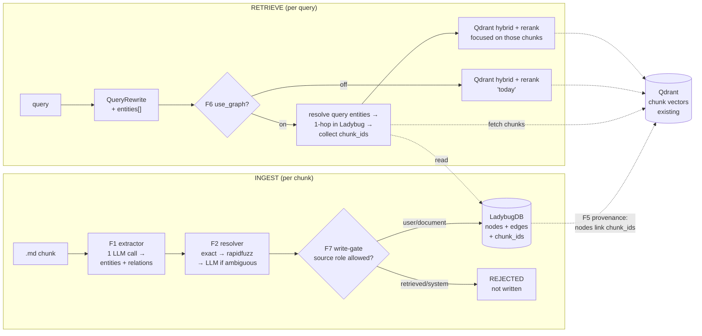
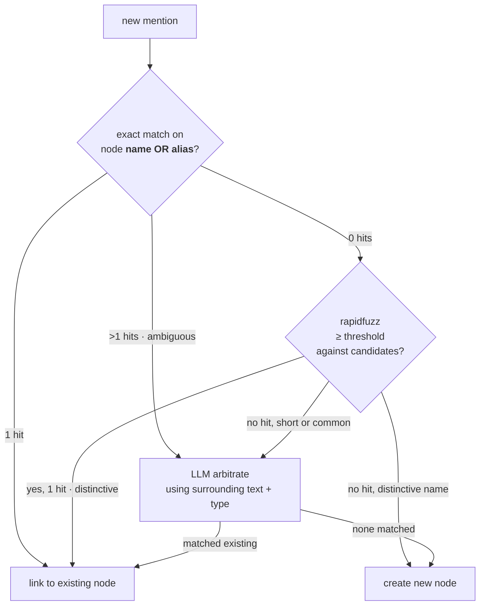
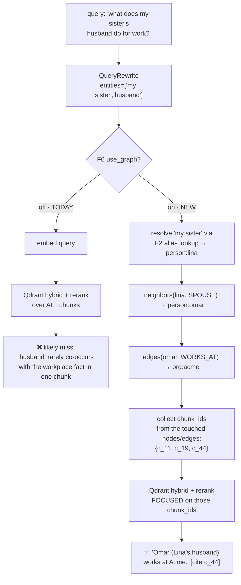

# Knowledge L3 — Minimal Prototype Plan

> **Tracker doc.** Concise feature/design/phase plan for the first L3 vertical slice —
> the experiment that proves (or kills) the graph-RAG thesis for personal data.
>
> **Companions:** [`knowledge-l3-content-routing-design.md`](knowledge-l3-content-routing-design.md)
> (full L3 design), [`knowledge-l3-research-references.md`](knowledge-l3-research-references.md)
> (techniques + sources), [`knowledge-graph-viz-design.md`](knowledge-graph-viz-design.md)
> (interactive graph view + live updates — visualizes this prototype's graph).
>
> **Mode:** initial development; no backward compatibility / no migration / no wrappers.
> **Status:** plan only — nothing implemented. Tick checkboxes as phases land.

## 1. Goal (one sentence)

Prove that a graph over personal data answers relational / multi-entity questions that
flat RAG misses — using only convergent, trusted techniques from the research, reusing
the existing Qdrant hybrid + rerank, behind a `use_graph` toggle so the eval is a free A/B.

**Out of scope (deliberately, per research §7.2):** community detection, global
map-reduce search, bi-temporal facts, chat/connector ingestion, gleaning, per-entity
LLM summarization. *Thesis first; everything else later.*

## 2. Decisions locked

| # | Decision | Reference |
|---|---|---|
| D1 | **Integrated vertical slice** (not throwaway CLI), isolated in `services/knowledge/graph/` so it stays rip-out-able | user call |
| D2 | **Synthetic relational + Arabic corpus** for eval (deliberate multi-hop relations) | user call |
| D3 | Primary goal = **relational retrieval quality** (graph-on vs graph-off A/B on the same eval) | user call |
| D4 | **LadybugDB** (`pip install ladybug`) as the embedded graph DB, behind a thin `GraphStore` port | L3 §6 |
| D5 | **Qdrant stays the evidence store** — graph holds structure only; nodes/edges link to Qdrant `chunk_ids` | L3 §6 |
| D6 | Single-call typed extraction via `model_factory` (LightRAG-style) | Research §2.1 |
| D7 | **Deterministic-first** entity resolution (exact → fuzzy → LLM-only-if-ambiguous) | Research §1.3 |
| D8 | Fuzzy lib = **`rapidfuzz`** (long-term default; MIT, fast) | user call |
| D9 | Extraction params via a **locked tuning profile** (`knowledge_graph_extraction`) — no hardcoded model params | repo rule |
| D10 | All knowledge surfaces go through the **Tool Registry** | repo rule |
| D11 | Provenance write-gate: never re-extract `retrieved_knowledge`/`system` content into the graph | Research §4.2.3 (mem0 #4573 bleed) |

## 3. Architecture at a glance



**Boundary:** the graph holds *structure* (who/where/when, links between them). Qdrant
keeps holding *evidence* (the raw chunk text + your existing dense+BM25+rerank). Every
graph node/edge stores the `chunk_ids` that asserted it — that's the join.

## 4. Features (each anchored to a worked example in §5)

| # | Feature | Demonstrated in |
|---|---|---|
| **F1** | **Single-call typed extraction** — one structured-output LLM call per chunk via `model_factory` → typed entities (with **aliases** when the text uses a kinship/relational term, e.g. "my mother Sara" → Sara + `aliases:["my mother","mom"]`) + relations (LightRAG-style, no gleaning) | Examples A, B |
| **F2** | **Deterministic-first resolution** — exact **name-or-alias** match → `rapidfuzz` fuzzy → LLM disambiguation on ambiguity (collision >1, or distinctive name w/ candidates below threshold); link-or-create. *(Deferred: also escalating 1-hit low-entropy names to LLM — extra cost, smaller win than aliases at this scale; revisit if eval shows same-name conflations.)* | Examples A, B, C |
| **F3** | **Ontology** — small Pydantic typed schema (Person, Place, Event, Organization, Object) + edge type map; unknowns fall back to generic `Entity` | Example A |
| **F4** | **`GraphStore` port + Ladybug adapter** — ~4 ops (`upsert_node/edge`, `resolve`, `neighbors`, `edges`); engine swappable | all examples |
| **F5** | **Inline provenance** — every node + edge stores the `chunk_ids` (and `document_id`s) that assert it; no separate join table | Example A |
| **F6** | **Retrieval toggle (`use_graph`)** — off = current behavior unchanged; on = resolve→1-hop→fetch chunks→same hybrid+rerank | Example D |
| **F7** | **Provenance write-gate** — ingest rejects content tagged `retrieved_knowledge` or `system`; prevents the mem0-style bleed loop | Example E |
| **F8** | **Synthetic eval corpus + harness** — generated personal-data set (family/places/events, Arabic + multi-hop) + ~12 relational questions; side-by-side graph-on vs graph-off | Example F |

## 5. Worked examples

Each example is **what comes in → what the techniques do → what's stored / answered**.
Together they exercise every feature (F1–F8) on concrete personal data.

### 5.1 — Example A · Happy-path ingest (F1, F2, F3, F5)

**Input chunk** (`document_id=d_07`, `chunk_id=c_42`, from `trips.md`):

> "Maya went to Paris with Selim in July 2025. They stayed near the Eiffel Tower."

**F1 single-call extraction** returns (one LLM call):

```json
{
  "entities": [
    {"name":"Maya",          "type":"Person"},
    {"name":"Selim",         "type":"Person"},
    {"name":"Paris",         "type":"Place"},
    {"name":"Eiffel Tower",  "type":"Place"},
    {"name":"Trip_2025_07",  "type":"Event"}
  ],
  "relations": [
    {"src":"Trip_2025_07","rel":"PARTICIPANT","tgt":"Maya"},
    {"src":"Trip_2025_07","rel":"PARTICIPANT","tgt":"Selim"},
    {"src":"Trip_2025_07","rel":"LOCATED_IN", "tgt":"Paris"},
    {"src":"Trip_2025_07","rel":"WHEN",       "tgt":"2025-07"},
    {"src":"Maya",        "rel":"STAYED_NEAR","tgt":"Eiffel Tower"}
  ]
}
```

**F2 resolution** runs each entity through the ladder (deterministic-first):



Applied to the chunk:

| Mention | Path through the ladder | Outcome | LLM call? |
|---|---|---|---|
| `Maya` | exact hit → `person:maya` (the user node) | link | no |
| `Selim` | exact hit → `person:selim` | link | no |
| `Paris` | 0 exact · fuzzy 0 · distinctive name | create `place:paris` | no |
| `Eiffel Tower` | 0 exact · fuzzy 0 · distinctive | create `place:eiffel_tower` | no |
| `Trip_2025_07` | 0 exact · fuzzy 0 · distinctive | create `event:trip_2025_07` | no |

**F5 inline provenance** — when the upserts hit Ladybug, every node and every edge
stores `chunk_ids: ["c_42"]` and `document_ids: ["d_07"]`. The graph alone tells you
*who/what/where*; the `chunk_ids` jump you back to the verbatim sentence in Qdrant for
citation. **No separate join table.**

**Cost for this chunk:** 1 LLM call (extraction). 0 resolution LLM calls. That's the
target shape — deterministic where possible, model only where needed.

---

### 5.2 — Example B · Alias merge: "mom" → Sara (F2 deterministic-first wins)

This case only works if **both halves** of F1/F2 are wired — and it's worth showing
how, because the original sketch hand-waved the *write* half. Both halves are tiny
extensions to the structured-output schema and the Ladybug node properties.

**Prior ingestion (the write half — how Sara gets her aliases).** Earlier chunk
(`chunk_id=c_03`):

> "My mother Sara lives in Cairo with my dad."

F1 extraction (the tuning-profile prompt instructs the LLM to emit `aliases[]` when
the text uses a kinship/possessive term for an entity):

```json
{
  "entities": [
    {"name":"Sara",  "type":"Person", "aliases":["my mother","mom","mommy"]},
    {"name":"Cairo", "type":"Place"}
  ],
  "relations": [
    {"src":"user","rel":"MOTHER_OF","tgt":"Sara"},
    {"src":"Sara","rel":"LIVES_IN","tgt":"Cairo"}
  ]
}
```

F2 writes `person:sara` to Ladybug with an **indexed `aliases: list[str]` property**
holding `["my mother","mom","mommy"]`. (Same column on every Person node; empty list
when no aliases were extracted.)

**New chunk (the read half — finding Sara from `"mom"`):** *"Mom called today, she'll
come over Friday."*

- F1 returns `{"name":"mom","type":"Person"}` (the possessive can't be resolved from
  *this* chunk alone — there's no anchor sentence here).
- F2 candidate generation runs the widened lookup:
  **`name = "mom" OR aliases CONTAINS "mom"`** → **1 hit: `person:sara`**.
- 1 hit + matching type → **link**. Append the new `chunk_id` to Sara's provenance
  list. **No LLM call** for this resolution — deterministic path won.

```mermaid
flowchart LR
    A["chunk c_03:<br/>'my mother Sara lives in Cairo'"] -->|F1: extract<br/>with aliases| W[("person:sara<br/>aliases=['my mother','mom','mommy']")]
    B["chunk c_99:<br/>'Mom called today'"] -->|F1: {name:'mom'}| Q{F2 lookup:<br/>name OR aliases<br/>CONTAINS 'mom'}
    W -.indexed.-> Q
    Q -->|1 hit| L[link to person:sara<br/>append c_99 to chunk_ids]
```

**What if there were two candidates?** If somewhere else the user said "my mother in
law" and that resolved to a *different* Person, both nodes would have `"mom"`-family
aliases and the lookup returns 2 hits → **ambiguous → LLM arbitrates** with the new
chunk's surrounding text + both candidates' relation summaries. Exact same code path
as Example C.

**Why this matters.** Without **both** alias-emission at extraction time AND
alias-aware lookup at resolve time, `"mom"` silently spawns a new orphan node every
chunk — exactly LightRAG's known weakness (research §2.7). The minimal fix is one
extra schema field at extraction and one extra indexed property at storage.

---

### 5.3 — Example C · Disambiguation: two people named "Ahmed" (F2 LLM arbitration)

**How we got two Ahmed nodes in the first place.** With low-entropy names, F2 doesn't
trust even a 1-hit exact match — it escalates to the LLM whenever the deterministic
step's hit is on a short/common name. That's the only honest way two `Ahmed` nodes can
coexist. Prior ingestion:

- Chunk `c_07`: *"Ahmed my cousin just got engaged."* F1 → `{name:"Ahmed", aliases:["my cousin"]}`.
  F2: exact name lookup → **0 hits** → fuzzy 0 → low-entropy → LLM with no candidates →
  **CREATE** `person:ahmed_cousin` (alias `"my cousin"` stored on the node).
- Chunk `c_31`: *"Ahmed at work helped me debug the deployment."* F1 → `{name:"Ahmed"}`.
  F2: exact name lookup → **1 hit** (`ahmed_cousin`) — but `"Ahmed"` is **low-entropy**, so
  F2 escalates to the LLM with the cousin as the only candidate. The LLM sees `"at work / debug
  the deployment"` vs the cousin's stored context (`"my cousin, got engaged"`) → returns
  **NO MATCH** → **CREATE** `person:ahmed_coworker`.

**The case at hand.** New chunk `c_99`: *"Ahmed helped me debug the deployment yesterday."*

- F1 → `{name:"Ahmed", type:"Person"}`.
- F2 candidate generation: exact name lookup → **2 hits** (cousin + coworker).
- Multiple hits → **LLM arbitrates** with `c_99`'s surrounding text + each candidate's
  summary (cousin: *got engaged*; coworker: *Acme, debug the deployment*).
- Coworker context matches → **LINK to** `person:ahmed_coworker`. The cousin node is
  untouched.

**Why this matters.** A naive "1-hit exact match → auto-merge" rule would silently fuse
the second "Ahmed at work" into the cousin node, turning two real people into one — the
documented "<85% resolution accuracy → graph poisoning" trap (research §3.6). The
**entropy gate on 1-hit name matches (not just on >1 hits)** is what makes the prototype
safe for short/common personal names. Alias matches bypass the gate because aliases were
deliberately stored by F1.

---

### 5.4 — Example D · The retrieval A/B (F6 `use_graph` toggle)

**Prerequisites (what prior ingestion must have built).** This example exercises Lina,
Omar, and Acme, so for the query to work the graph must already contain:

- `person:lina` with `aliases: ["my sister"]` — stored by F1 from a chunk like
  *"My sister Lina just had a baby"* (same alias mechanism as Example B).
- Edge `(lina)-[SPOUSE]->(omar)` — from a chunk like *"Lina married Omar in 2020"*,
  provenance `chunk_ids:["c_19"]`.
- Edge `(omar)-[WORKS_AT]->(acme)` — from a chunk like *"Omar joined Acme last
  spring"*, provenance `chunk_ids:["c_44"]`.

**Query:** *"what does my sister's husband do for work?"*

This is the canonical L3 thesis question: **2-hop, multi-entity, no single chunk
contains the answer.** Same question, both modes, same hybrid+rerank downstream.



**How `"my sister"` finds Lina.** `QueryRewrite` emits `entities:["my sister","husband"]`.
`graph_expand` runs the **same F2 alias-aware lookup used at ingest time**:
`name="my sister" OR aliases CONTAINS "my sister"` → 1 hit on `person:lina` (via the
alias list F1 stored at ingest). No new mechanism — write-side and read-side use one
lookup. The second entity `"husband"` is then resolved structurally via the SPOUSE
edge from Lina, which is more reliable than a name lookup for relational terms.

**What changed:** the graph turned a recall failure into a precise filter. Off-mode
searches a haystack and hopes the chunk-with-the-answer happens to mention the husband
*and* the sister; on-mode uses the graph to *find which chunks could contain the
answer*, then leans on your existing retrieval. Same rerank, dramatically better candidates.

---

### 5.5 — Example E · Bleed prevention: assistant answer rejected (F7 write-gate)

**The failure we're preventing** (mem0 issue #4573 — "User prefers Vim" hallucination
multiplied to 808 stored memories): an assistant answer that mentions facts gets fed
back into the extractor and re-stored, then re-retrieved, then re-extracted again.

**What F7 does** — every piece of content arriving at the ingest pipeline carries a
`source_role` tag:

```mermaid
flowchart LR
    A["user-authored .md (doc/note)<br/>role=user_document"] --> GATE
    B["chat user turn<br/>role=user_message (future)"] -.future.-> GATE
    C["assistant reply<br/>role=assistant_output"] --> GATE
    D["retrieved knowledge context<br/>role=retrieved_knowledge"] --> GATE
    E["system prompt / config<br/>role=system"] --> GATE
    GATE{"F7 write-gate<br/>role allowed?"}
    GATE -->|user_document<br/>(allowed in this prototype)| INGEST[F1 extract → F2 resolve → graph]
    GATE -->|any other role| DROP[(REJECT + log<br/>no graph mutation)]
    INGEST --> LB[(Ladybug)]
```

**Allowed in this prototype:** `user_document` only (the .md ingest path).
**Rejected:** `assistant_output`, `retrieved_knowledge`, `system`.
**The bleed loop becomes impossible by construction** — retrieved knowledge cannot be
re-ingested even if a future code path tries.

---

### 5.6 — Example F · Eval output (F8 — what success looks like)

The harness runs each of the ~12 questions twice (graph-off, graph-on) and prints:

```
question                                                  | flat | graph | Δ
----------------------------------------------------------+------+-------+---
"what does my sister's husband do for work?"              |  ✗   |   ✓   | +1
"who was on the Paris trip in 2025?"                      |  ◐   |   ✓   | +1
"tell me about Selim's family"                            |  ✗   |   ✓   | +1
"what year did we move to Cairo?"                         |  ✓   |   ✓   |  0
"ما هي وصفة أمي للكبسة؟" (mom's kabsa recipe)             |  ◐   |   ✓   | +1
"which Ahmed helped with the deployment?"                 |  ✗   |   ✓   | +1
"where did Lina work before Acme?"                        |  ✗   |   ◐   | +1
"who else was at the ski trip?"                           |  ✗   |   ✓   | +1
"what's my dad's birthday?"                               |  ✓   |   ✓   |  0
"did Selim ever visit our apartment in Paris?"            |  ✗   |   ✓   | +1
"family members who live in Cairo"                        |  ◐   |   ✓   | +1
"my colleague Ahmed's manager"                            |  ✗   |   ✓   | +1
----------------------------------------------------------+------+-------+---
totals:                                                       2✓     11✓    +9
                                                              3◐      1◐
                                                              7✗      0✗
```

**Gate (§7 Phase 4):**
- ✅ **Proceed** if graph-on wins on the relational/multi-hop rows (the ✗→✓ deltas).
- ❌ **Pivot/root-cause** if graph-on doesn't beat flat — find whether the failure is
  extraction quality, resolution merges, or expansion gathering the wrong chunks.

The table is the evidence. No proceed/pivot decision without it.

## 6. Non-goals (this prototype)

Communities · global search · bi-temporal facts (`valid_at`/`invalid_at`) ·
chat-as-ingestion · drive connectors · coreference front-end · reranker swap · new
embedder · admin UI for the graph. All on the L3 design roadmap; **out of scope for
the thesis test.**

## 7. Phased plan

### Phase 0 — Verify & scaffold ✅
- [x] `ladybug==0.17.0` verified (Python <3.15,≥3.10; native Windows wheels cp310–314); pinned.
- [x] `rapidfuzz==3.14.5` verified (Python ≥3.10; win_amd64 cp310–313; MIT); pinned.
- [x] Added via `uv add` in `hirocli/`; `mintdocs/build/local-build/first-time-setup.mdx` updated.
- [x] `workspace/knowledge/graph/` created on first ingest (via `LadybugGraphStore.open`); `mintdocs/architecture/misc/workspace-folder.mdx` updated.
- [x] `services/knowledge/graph/` submodule with isolated, rip-out-able boundary.

### Phase 1 — GraphStore port + Ladybug adapter ✅
- [x] `GraphStore` Protocol (5 ops: `upsert_node/edge`, `find_by_name_exact`, `find_candidates_by_name`, `neighbors`, `edges`, `get_node`, `close`).
- [x] `LadybugGraphStore`: open/close, Cypher schema init (single `Entity` + `Rel` typed tables), MERGE-based idempotent upserts, provenance + alias merge on re-write, k-hop neighbors, edges by direction, name-or-alias exact match.
- [x] Two Ladybug dialect quirks caught & fixed (TIMESTAMP→STRING; persisted `source_id`/`target_id` for endpoint reads).
- [x] **15 smoke tests** against a temp Ladybug file, all green.

### Phase 2 — Ingestion (write side) — *exercises Examples A, B, C, E* ✅
- [x] `knowledge_graph_extraction` + `knowledge_graph_disambiguation` tuning profiles (locked presets).
- [x] `extract_from_chunk(chunk_text)` — single structured-output LLM call (F1), with alias support per §4.
- [x] `GraphResolver.link_or_create(mention)` — deterministic-first ladder (exact name-or-alias → rapidfuzz → LLM-if-ambiguous), aliases persisted normalized, provenance merged (F2).
- [x] Provenance write-gate via `ALLOWED_SOURCE_ROLES` allow-list — `retrieved_knowledge`/`assistant_output`/`system` rejected before any LLM call (F7).
- [x] `GraphIngestStats` reports per-branch counts + token totals (cost/quality signals to the ledger).
- [x] **Tool**: `KnowledgeGraphIngestTool` registered as `knowledge_graph_ingest` (Tool Registry).
- [x] Reads chunks from existing `KnowledgeService.get_document` (Qdrant `point_id` = graph `chunk_id` — direct join for Phase 3).
- [x] **31 new tests** (resolver + ingest), 46 total in `services/knowledge/graph/`, all green.

### Phase 3 — Retrieval integration — *exercises Example D* ✅
- [x] `QueryRewrite` extended with `entities[]` field + prompt examples (proper nouns + qualified relational mentions).
- [x] `expand_entities_to_chunk_ids(db_path, entities, k=1)` → `GraphExpansion(chunk_ids, nodes_touched, entities_resolved, entities_requested)`. Resolves via name **or alias**, expands 1-hop, unions node + edge provenance, returns sorted deterministic set. Missing DB / empty entities = silent no-op (no raise).
- [x] New `graph_expand` LangGraph node wired between `rewrite_query` and `build_filters` — short-circuits when `use_graph=False` or no entities; soft-fallback to flat search on any error.
- [x] `build_filters` folds `graph_chunk_ids` into the Qdrant filter as `HasIdCondition` (focus the existing hybrid+rerank; no rerank changes).
- [x] `use_graph: bool` param threaded through `KnowledgeService.answer` → `KnowledgeAnswerTool` (with `rewrite: bool` since graph needs entities from the rewrite step). Warning logged if `use_graph=True && rewrite=False`.
- [x] Ledger row for `graph_expand` reports `entities resolved/requested · nodes touched · chunks` so cost/quality is visible per query.
- [x] **20 new tests** (9 graph_expand + 4 QueryRewrite/entities + 3 build_qdrant_filter chunk_ids paths + existing), **66/66 total green** in 7s.

### Phase 4 — Synthetic corpus + eval — *exercises Example F* ✅ (harness shipped; user runs the gate)
- [x] `eval/l3_synthetic/*.md` — 6 docs: family, work_notes, cousin_ahmed, paris_trip_2025, ski_trip_2023, moms_kabsa_recipe (Arabic). Deliberately structured so multi-hop facts span chunks (e.g. Lina↔Omar relation in family.md; Omar→Acme job in work_notes.md — flat RAG can't stitch).
- [x] `eval/l3_questions.yaml` — 12 questions tagged `requires_graph` + categories (relational/multi-hop, alias, disambiguation, cross-doc, Arabic, negative-control). Each carries `expected_fragments` for substring-match scoring.
- [x] `eval/l3_synthetic_eval.py` — runnable harness (CLI: `python eval/l3_synthetic_eval.py --workspace <path>`). Ingests corpus → builds graph → runs each Q × 2 modes → prints `flat | graph | Δ` table + PROCEED/PIVOT gate. `--skip-ingest` for re-runs; `--show-answers` for full diff.
- [x] `eval/test_l3_synthetic_eval.py` — 22 pure-logic tests (scoring, abstain vs hallucination, delta math, table/summary rendering, gate verdict, corpus/yaml integrity).
- [x] `eval/README.md` — prerequisites, cost expectation, how to read the output, how to wipe between runs.
- [ ] **Gate: run it.** Needs a workspace with `knowledge.answering.model` (or `llm.default_chat`) set + provider key. Harness fails loud if not. Cost: cents at `gpt-5-mini` scale (~$0.05–0.20 first ingest + few cents per question pass).

### Phase 5 — In-server eval + admin Eval Batch UI ✅
The CLI harness has an in-server twin so the eval runs from the admin **Ask → L3 Eval Batch** panel, streaming live.

- [x] `services/knowledge/eval_runner.py` — `run_eval()` mirrors the CLI logic but publishes `knowledge.eval.*` Domain Events (started / setup_progress / question_completed / completed / failed / cancelled). Two corpora: legacy synthetic `.md` and the Adam temporal JSONL episodes.
- [x] **Live activity terminal** — setup emits a `setup_progress` event **per episode** (Qdrant write + the slow per-episode Graphiti extraction, bridged via the graph `event_sink`), so the panel shows fine-grained progress instead of freezing for minutes. The admin `KnowledgeAskEvalTerminal.svelte` renders these + per-question lines in a scrollable, auto-following log.
- [x] **Full answers** — `question_completed` carries both a compact `answer_preview` (terminal line) and the FULL `answer`; table rows expand to show the whole flat/graph answers side-by-side.
- [x] **Cancel** — `POST /knowledge/eval/cancel` cancels the background task; the runner catches `CancelledError` and emits the neutral `cancelled` terminal event.
- [x] **Server-side run store** — `services/knowledge/eval_registry.py` is a per-workspace, in-memory registry that folds the eval events into replayable state (setup trail + full-answer rows + summary + the cancel handle). `GET /knowledge/eval/state` replays it on mount. This is the single source of truth, so the run survives navigation **mid-run** and is **consistent across origins** (the Vite dev UI and the packaged admin UI are different origins with separate `sessionStorage`; the old client-only snapshot diverged). State lives in the server process — a restart drops it.
- [x] Tests: `test_eval_runner.py` (event order + payload shape incl. full answer + run_id), `test_eval_registry.py` (event folding, row upsert, stale-run drop, cancel).

## 8. Risks & mitigations

| Risk | Mitigation |
|---|---|
| Ladybug Windows wheel gap or runtime issue | Phase 0 verifies before any code; `GraphStore` port keeps the engine swappable (DuckDB+DuckPGQ documented fallback) |
| Extraction quality poor on Arabic | Same extraction tuning profile; if results are bad, fall back to a single-pass JSON output mode (LightRAG-style explicit schema) before more invasive fixes |
| Resolution under-merges aliases ("mom" vs "Sara") | Deterministic-first with rapidfuzz handles literals; LLM fallback handles aliases (Example B); eval surfaces remaining cases |
| Cost balloons on a small corpus | Single-call extraction (no gleaning), small model via tuning profile, no per-entity summarization |
| Bleed (graph echoes retrieved knowledge) | F7 write-gate from day one (Example E) |

## 9. Definition of done (for this prototype)

- All 8 features (F1–F8) implemented and wired through the Tool Registry.
- Every worked example (§5.1–§5.5) runs end-to-end on the synthetic corpus.
- Side-by-side table (§5.6) generated by one command, graph-on vs graph-off, on
  ~12 questions.
- The Phase 4 gate is answered with evidence — **proceed or pivot, not "TBD"**.

## 10. Tracking against the overall L3 plan

| L3 design phase ([scoping doc §10](knowledge-scoping-design.md) + [L3 design §10](knowledge-l3-content-routing-design.md)) | Covered by this prototype? |
|---|---|
| L1 identity scope (hard owner filter) | No — orthogonal, prereq elsewhere |
| L2 character knowledge profile | No |
| Embedder upgrade | No |
| Metadata enrichment (entities, content_date, modality) | **Partial** — graph IS the entity layer; content_date deferred |
| L3 content routing (graph backbone) | **Yes — this is the thesis test** |
| L5 abstain gate | No |

## 11. TL;DR

- **Goal:** prove graph-aug beats flat RAG on relational/multi-hop personal-data Qs.
- **Form:** integrated slice in `services/knowledge/graph/`, behind Tool Registry, with
  a `use_graph` toggle that makes A/B free.
- **Stack:** Ladybug (graph) + existing Qdrant (evidence) + `model_factory` (extraction)
  + `rapidfuzz` + `GraphStore` port.
- **Borrows only convergent techniques** (LightRAG single-call extraction; Graphiti
  deterministic-first resolution; mem0 bleed-fix write-gate).
- **6 worked examples (§5)** show every feature on concrete data — happy ingest, alias
  merge, two-Ahmeds, the retrieval A/B, the bleed-gate, the eval table.
- **4 phases** (verify → port → ingest → retrieve+eval); synthetic corpus + ~12 questions.
- **Gate:** the side-by-side table answers proceed/pivot/kill with evidence.
- **Excluded for now:** communities, global search, bi-temporal, chat ingestion,
  gleaning, per-entity summarization.
