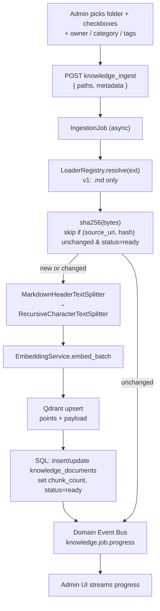
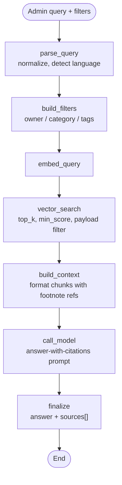
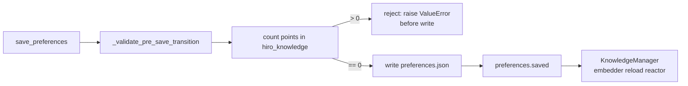

# Knowledge Service (RAG) v1 — Design

## Request

Add a workspace-local RAG system to Hiro: ingest files, embed and store them
in a vector DB, and answer admin queries with cited sources. The agent-side
integration (chat agent calling knowledge as a sub-agent) is **out of scope
for v1** — v1 is admin-only.

Initial-development mode: no backward compatibility, no migration, no wrappers.

Reference review: `c:\Users\augr\Downloads\hiro_rag_tooling_review.md`.

## Design Decisions (high-level)

| # | Decision | Why |
|---|---|---|
| D1 | LangChain-native RAG, no LlamaIndex | Hiro already on LangChain/LangGraph; avoids second framework + duplicate document/retrieval abstractions. |
| D2 | Separate Qdrant folder + collection from mem0 (`workspace/knowledge/qdrant`, `hiro_knowledge`) | Independent embedding lifecycle; one subsystem's re-embed never invalidates the other. |
| D3 | Default embedder is **FastEmbed `sentence-transformers/paraphrase-multilingual-MiniLM-L12-v2` (local)**; catalog id override allowed | Bulk ingest + frequent queries make API embeddings expensive and slower; this model is multilingual, supported by the pinned FastEmbed release, and verified to load locally. |
| D4 | Embedding-model field is **separate** from `memory.default_embedding_model` | Mem0 and knowledge have different optimal models and independent re-embed gates. |
| D5 | Changing `knowledge.default_embedding_model` is **locked while the collection has points** | No migration in v1; lock prevents silent dim mismatch / orphaned vectors. |
| D6 | SQL = source of truth for metadata; Qdrant payload = denormalized mirror | Vector search can pre-filter without joins; metadata edits update SQL then `set_payload` (no re-embed). |
| D7 | **No `knowledge_chunks` SQL table** | Qdrant payload already holds chunk text + ord + heading_path; avoids duplication and sync bugs. |
| D8 | Categories: schema allows recursion, **code enforces exactly 2 levels** (category + subcategory) | Matches product intent; relaxing later requires no migration. |
| D9 | Ingestion = plain async pipeline; **LangGraph used only for retrieval/answer** | Ingestion is deterministic (load → chunk → embed → upsert); LangGraph reserved for model-in-loop work. |
| D10 | One Qdrant collection with payload filters (not collection-per-owner) | Simpler v1; payload indexes make filtered search fast; can split later if true isolation needed. |
| D11 | No reranker in v1 | Adds latency + a model dependency before we've measured retrieval quality. Placeholder hook documented for v2. |
| D12 | Re-ingest is **manual only**; dedupe by `content_hash` | No background file watcher; user controls when re-embedding cost is paid. |
| D13 | Citations are **footnote style** (`[1]`, `[2]`) with a `sources[]` companion array | Stable, parseable, model-friendly across providers. |
| D14 | Single Tool Registry tool per operation | CLI, HTTP and the future chat sub-agent share one implementation (per `tools-architecture.mdx`). |
| D15 | Job state persisted in SQL, live progress on the existing Domain Event Bus | Survives page reload/refresh; reuses the bus already used by `preferences.saved`, graph events. |
| D16 | UI pickers show the **resolved default value** even when the JSON stores `null` | User always knows what model is actually running; no hidden behavior. |

## Boundary vs Existing Surfaces

| Surface | Owns | Lifetime |
|---|---|---|
| Mem0 SQLite `messages` (`workspace/memory/history.db`) | last-k raw turns per scope | rolling |
| Mem0 Qdrant (`workspace/memory/qdrant`, collection `hiro_memory_v2`) | extracted facts/preferences per user × character | persistent |
| **Knowledge SQLite (new, `workspace/knowledge/knowledge.db`)** | document catalog + categories + tags + ingestion jobs | persistent |
| **Knowledge Qdrant (new, `workspace/knowledge/qdrant`, collection `hiro_knowledge`)** | chunk vectors + payload (text, metadata) | persistent |
| Conversation JSONL / `data.db` messages | raw episodic log | append-only |

Rule of thumb: **RAG retrieves evidence. Mem0 remembers meaning.** They share
no storage and run on independent embedding models so re-embed events in one
never invalidate the other.

## Stack

- **LangChain ≥ 1.0** — `MarkdownHeaderTextSplitter`, `RecursiveCharacterTextSplitter`,
  and `langchain-qdrant` `QdrantVectorStore` for **retrieval** (similarity search by
  precomputed query vectors).
- **LangGraph ≥ 1.0** — knowledge agent graph (search → answer).
- **Qdrant local** (`qdrant-client`, already a dep) — own folder, own collection.
- **FastEmbed** (already a dep via mem0) — default dense embedder via
  `sentence-transformers/paraphrase-multilingual-MiniLM-L12-v2`
  (multilingual, local, free, ~1GB on disk).
- **Catalog embedding fallback** — same model factory the memory service uses;
  user can switch to OpenAI / Gemini / Ollama embedding ids if desired.
- **No reranker in v1.** FlashRank/Cohere planned later (see Non-Goals).
- **No LlamaIndex.** Per the review, LangChain-native is sufficient.

**Ingest vs retrieval (intentional split, D9):** ingestion is a deterministic
async pipeline — load → chunk → `EmbeddingBackend.embed_texts` → direct
`qdrant-client` upsert with a denormalized payload schema. Retrieval uses
`QdrantVectorStore.similarity_search_with_score_by_vector` so LangChain owns
filter + score plumbing. We do **not** route ingest through
`QdrantVectorStore.add_documents`; that API cannot express our per-chunk payload
(`ord`, `heading_path`, owner metadata) or the delete-then-upsert re-ingest
contract without fighting the abstraction.

**One new pip dep:** `langchain-qdrant`. Everything else is already in the
lockfile because of mem0.

## Service vs Tool split

Per `architecture/misc/tools-architecture.mdx`:

| Layer | Path | Callers |
|---|---|---|
| Service | `services/knowledge/` | Knowledge LangGraph nodes (hot path), tools |
| Tools | `tools/knowledge.py` | CLI, agent (future), HTTP/admin via Tool Registry |

Mirrors `services/memory/` and `tools/memory.py`.

## Data Model

### `knowledge.db` (SQLite, new file in workspace)

```text
knowledge_documents
  id              uuid PK
  source_uri      str           -- absolute path or URL
  source_type     str           -- "file" | "url" | "audio" | "image" (v1: "file" only)
  mime            str
  ext             str
  owner_kind      str           -- "system" | "character" | "user"
  owner_id        str           -- "0" | character_id | str(user_id)
  category_id     int FK NULL
  subcategory_id  int FK NULL
  title           str           -- derived (filename / H1 / URL title)
  content_hash    str           -- sha256(raw bytes), idempotent re-ingest
  size_bytes      int
  chunk_count     int           -- denormalized, no separate chunk table
  status          str           -- "pending" | "parsing" | "embedding" | "ready" | "failed"
  error           str NULL
  ingested_at     datetime
  updated_at      datetime
  UNIQUE(source_uri)

knowledge_categories
  id              int PK
  name            str
  parent_id       int FK NULL   -- NULL = top-level category; NOT NULL = subcategory
  UNIQUE(parent_id, name)
  -- D8: service-layer validator enforces exactly 2 levels:
  --     INSERT/UPDATE rejected if parent_id refers to a row whose own parent_id is NOT NULL.

knowledge_tags
  id              int PK
  name            str UNIQUE

knowledge_document_tags
  document_id     uuid FK
  tag_id          int FK
  PRIMARY KEY (document_id, tag_id)

knowledge_ingestion_jobs
  id              uuid PK
  created_at      datetime
  finished_at     datetime NULL
  status          str           -- "running" | "completed" | "failed"
  totals_json     str           -- {requested, skipped, ingested, failed, chunks}
  errors_json     str           -- per-file error map (truncated)
  params_json     str           -- {paths, owner, category, tags, ...}
```

No `knowledge_chunks` table. Chunks live in Qdrant payload (see below). The
detail panel in Tab 3 fetches chunks from Qdrant by `document_id` filter.

### Qdrant payload (per chunk = one point)

```text
{
  "document_id":    uuid,
  "ord":            int,
  "text":           str,
  "heading_path":   str | None,     -- e.g. "# Intro / ## Goals" (markdown)
  "owner_kind":     str,
  "owner_id":       str,
  "category_id":    int | None,
  "subcategory_id": int | None,
  "tags":           [str],
  "source_type":    str,
  "mime":           str,
  "title":          str,
  "source_uri":     str,
  "ingested_at":    iso8601
}
```

Qdrant payload is a **denormalized copy** of SQL fields so vector search can
pre-filter without joining SQLite. SQL is the source of truth; metadata edits
(rename category, retag) update SQL first, then re-sync Qdrant via
`set_payload`. No re-embedding needed for metadata changes.

Payload indexes: `owner_kind`, `owner_id`, `category_id`, `subcategory_id`,
`tags`, `document_id`.

### Owners

| `owner_kind` | `owner_id` source |
|---|---|
| `system` | `"0"` (constant) |
| `character` | character slug from `workspace.db.characters` / `characters/<id>/` |
| `user` | `data.db.users.id` as string |

Owner picker in Tab 1 reuses the character/user pickers from the channel editor.

## Tools (registered in Tool Registry)

Registry `Tool.name` values use **snake_case** (e.g. `knowledge_scan_folder`).
HTTP `/invoke` and agent dispatch use these ids. Logical grouping below uses
`knowledge_*` names matching `tools/knowledge.py`.

| Tool | Purpose |
|---|---|
| `knowledge_scan_folder` | Enumerate a folder (recursive); return tree + sizes + ext + `already_ingested` flag. |
| `knowledge_ingest` | Async ingest of a selected path list + metadata. Returns `job_id`. |
| `knowledge_job_status` | Poll/stream an ingestion job. |
| `knowledge_search` | Embed + filter + vector search. Returns chunks with scores + citations. |
| `knowledge_answer` | Full RAG: search → build context → LLM → answer with footnote citations. |
| `knowledge_list_documents` | Paginated, filterable list for Tab 3. |
| `knowledge_get_document` | Document detail (metadata + chunks fetched from Qdrant). |
| `knowledge_delete_document` | Removes Qdrant points by `document_id` filter + SQL row. **Does not touch the source file on disk** — this is a knowledge index, not file management. |
| `knowledge_reingest_document` | Re-read file, recompute hash. If unchanged: no-op. If changed: **delete all existing Qdrant points for `document_id` first**, then re-chunk + re-embed + upsert, and update `chunk_count`. Old chunks must never coexist with new ones for the same document. |
| `knowledge_list_categories` / `knowledge_list_tags` | Drives Tab 1 dropdowns. |
| `knowledge_update_document_metadata` | Edit owner/category/tags; updates SQL + Qdrant payload. |

All callers (CLI, HTTP, future chat agent) go through the same tools. Same
pattern as `tools/memory.py`.

## Ingestion Flow (Tab 1)



**Key points:**

- `content_hash` is the dedupe key — re-ingest of the same file is a no-op
  unless the bytes changed. No preference toggle.
- Loader registry is keyed by extension. v1 registers `.md` only; future
  loaders (PDF, HTML, audio via STT, images via vision) plug in without
  touching the rest of the pipeline.
- Splitter pipeline for markdown: header-aware first (preserves
  `heading_path` in chunk metadata), then recursive split for sections still
  over `chunk_size`.
- Job state lives in `knowledge_ingestion_jobs` (so Tab 1 can show recent
  jobs after refresh). Live progress is streamed via the existing Domain
  Event Bus, same channel used by `preferences.saved` and graph events.
- Errors per file are captured in `errors_json`; one bad file does not abort
  the job. The document row's `status="failed"` + `error` lets the user retry.
- Files whose extension is unknown to the registry are listed in
  `scan_folder` but rendered with a disabled checkbox in the UI.

## Retrieval / Answer Flow (backend)

**LangGraph scope (D9):** retrieval/answer only. Ingestion is plain async
Python — no agent decisions are needed in the load → chunk → embed → upsert
path. Wrapping ingestion in LangGraph would add ceremony for no benefit.

This section describes the backend graph that powers Tab 2 — the UI itself is
specified under [Admin UI Tabs](#admin-ui-tabs).

Specialized LangGraph, inheriting from the base graph for streaming, error
handling, and usage tracking. Future: register as a sub-agent tool of the
chat agent.



**Node implementations (all new code in `services/knowledge/agent/`):**

| Node | What it does | Implementation |
|---|---|---|
| `parse_query` | Strip whitespace, NFC unicode normalize, normalize Arabic alef forms, detect language. | New helper `normalize_query(text) -> NormalizedQuery`. Language detection via the `langdetect` Python library (heuristic, MIT license). **Not** query rewriting / HyDE / multi-query — those are v2. |
| `build_filters` | Convert UI filter dict into a Qdrant `Filter`. Scalar fields (`owner_*`, `document_id`, `category_id`, `subcategory_id`) are ANDed; when multiple tags are selected, a chunk matches if it has **any** of those tags (OR), and that tag group is ANDed with the scalar filters. | New helper `build_qdrant_filter(filters)`. |
| `embed_query` | Run the configured embedder on the normalized query string (single embed for the request). | `KnowledgeService.embed_query` via the LangChain embedding adapter. |
| `vector_search` | Qdrant search with `top_k`, `min_score`, and payload filter using the **precomputed** query vector from `embed_query` (no second embed in the store). | `KnowledgeService.vector_search_by_vector` → `QdrantVectorStore.similarity_search_with_score_by_vector` (offloaded with `asyncio.to_thread`; may switch to `asimilarity_search_with_score_by_vector` when convenient). Do **not** use `asimilarity_search_with_score(query=…)` here — that would re-embed and duplicate work. |
| `build_context` | Format chunks into a numbered context block with footnote refs. | New helper; renders `[n] {title} §{heading_path}\n{text}`. |
| `call_model` | Standard LangGraph model node with answer-with-citations system prompt. Skipped when `build_context` sets `no_results` (graph routes straight to `finalize`). | Reuses the chat model factory (`domain/model_factory.py`). |
| `finalize` | Pack `{answer, sources[]}` and emit the terminal graph event. | New helper. |

**Citations:** footnote style. The model is instructed to attach `[1]`, `[2]`
inline; `sources[]` returns one entry per footnote with `document_id`, title,
`heading_path`, `source_uri`, score, and the chunk text. UI renders the
footnotes as a collapsible source list under the answer.

**Filters in v1:** admin-only, set in the UI. The cross-owner permission
question (can character X read user Y's docs?) is deferred to the chat-agent
integration milestone.

## Preferences

New top-level section in `preferences.json`. Slim by design:

```json
"knowledge": {
  "default_embedding_model": null,
  "chunking": {
    "chunk_size": 1200,
    "chunk_overlap": 150,
    "markdown": { "respect_headings": true }
  },
  "retrieval": {
    "top_k": 20,
    "min_score": 0.0
  },
  "answering": {
    "model": null,
    "cite_sources": true,
    "language_policy": "match_query"
  }
}
```

**Not in preferences (constants in code):**

- Collection name (`hiro_knowledge`), Qdrant path
  (`workspace/knowledge/qdrant`), `on_disk=True` — module constants.
- Loader registry contents.
- `chunking.strategy` — header-then-recursive is the only strategy for
  markdown today; new source types bring their own chunkers in code.
- Reranker — not in v1.
- Max file size guardrail (~25MB).

**Embedding model field semantics:**

| `default_embedding_model` value | Behavior |
|---|---|
| `null` (default) | Use FastEmbed `sentence-transformers/paraphrase-multilingual-MiniLM-L12-v2` locally. |
| Catalog id (e.g. `openai:text-embedding-3-small`) | Use the catalog model via the same factory `services/memory` uses. |

The choice is **separate from memory's `memory.default_embedding_model`** —
each subsystem owns its embedding lifecycle and re-embed gate.

### Embedding-model lock

**Rule:** `knowledge.default_embedding_model` cannot be changed while the
knowledge Qdrant collection has any points.

Enforcement lives in ``save_preferences`` via
``_validate_pre_save_transition`` (and the admin runtime's pre-save check),
**before** ``preferences.json`` is written:



After an allowed change, ``KnowledgeManager`` hot-reloads the embedder via
``PreferenceReactor``. Migration tooling is out of scope for v1; the only
ways to switch are (a) the collection is empty, or (b) the user explicitly
deletes all documents first.

### Retrieval / answering knobs

- `retrieval.top_k` — number of chunks pulled from Qdrant.
- `retrieval.min_score` — drops low-confidence chunks before the LLM call.
- `answering.model` — `null` inherits `llm.default_chat`; otherwise a catalog
  chat id. **Must be exposed as a picker** in the Preferences UI (typical
  use: choose a faster/cheaper chat model than the main one — e.g.
  `openai:gpt-5-mini` — since RAG answering doesn't need full reasoning).
- `default_tuning_profile` — defaults to locked preset `knowledge_answering`
  (lower temperature, bounded `max_tokens`). Resolution uses
  `resolve_knowledge_answering_llm` (catalog + credentials + tuning), same
  path as the answer graph's `call_model` node.
- `answering.cite_sources` — toggle footnote citations.
- `answering.language_policy` — `"match_query"` answers in the query's
  language; later: `"prefer_english"`, `"prefer_arabic"`.

### D16 — show the resolved default in UI

`null` in the JSON means "track the system default". The UI must never hide
what's actually running:

- **Pickers:** when set to "Use default", display the concrete resolved id in
  italics ("Default: sentence-transformers/paraphrase-multilingual-MiniLM-L12-v2 (local)" for embedding; "Default:
  openai:gpt-5.4" for answering model).
- **API surface:** the preferences read endpoint returns companion fields
  `default_embedding_model_resolved`, `answering.model_resolved`, and
  `answering.model_resolved_source` so the UI and CLI never recompute them.
  `model_resolved` is only set when the model is catalog-available and
  credentials are configured (via `resolve_knowledge_answering_llm`).
- **Tooltip:** picker hint shows where the default came from
  (built-in constant for embedding; `knowledge.answering.model` or
  `llm.default_chat` for answering).

Same pattern applied to both fields. Mirrors how OS apps display "Default
browser: Firefox" instead of just "Default".

## Admin UI Tabs

Single Knowledge page in the admin UI with three tabs. This section is the
source of truth for what the user sees and interacts with. Implementation
follows the `svelte-best-practice` skill.

### Tab 1 — Ingest

**Purpose:** turn a folder of files into ingested knowledge.

Top-to-bottom layout:

1. **Folder picker.** Browses the host filesystem; remembers the last picked
   folder per workspace.
2. **File list.** Recursive listing of every file under the chosen folder.
   - Per-file checkbox.
   - Top-level "Select all" / "Deselect all" actions.
   - Each row shows: filename, relative path, size, extension badge, and an
     "already ingested" indicator when `source_uri` exists with `status=ready`.
   - Files with unsupported extensions (anything other than `.md` in v1) are
     listed but their checkbox is disabled and the row tooltips "Not yet
     supported".
3. **Metadata form** (applies to every checked file in this batch):
   - **Owner kind** — select: `system` / `character` / `user`.
   - **Owner id** — hidden and auto-set to `0` for system; for character/user
     it shows a select. Character options display character names and submit
     character ids. User options display predefined user rows from
     `data.db.users` and submit user ids.
   - **Category** — combobox over existing categories with an inline
     "+ Create new" option.
   - **Subcategory** — combobox scoped to the chosen category, also with
     inline create. (2 levels max, enforced by the service per D8.)
   - **Tags** — multi-select chip input over existing tags with inline create
     of new ones.
4. **"Start ingestion" button.** Disabled until at least one supported file
   is checked and required metadata is filled. Click → calls
   `knowledge_ingest`, returns a `job_id`.
5. **Job progress panel** below the form:
   - **Current job** strip: file-by-file progress bar, counts
     (`requested / skipped / ingested / failed`), elapsed time, "Cancel" button.
     Cancellation is a documented UI affordance for this panel, but backend
     cancellation support is not implemented in this build step.
   - **Recent jobs** list (last N): timestamp, totals, status, "View errors"
     link for failures. Persists across page reloads (read from
     `knowledge_ingestion_jobs`).
6. **Live updates** stream from the Domain Event Bus so the panel updates
   without polling; on page (re)mount the UI re-subscribes and backfills
   from SQL.

### Tab 2 — Ask

**Purpose:** ask a natural-language question against the knowledge base and
get an answer with cited sources.

Top-to-bottom layout:

1. **Query input.** Large single-line (with multi-line expand) text box.
   Press Enter or "Ask" button to submit.
2. **Filter strip** (collapsible, mirrors Tab 1's metadata for consistency):
   - Owner kind / owner id pickers.
   - Category + subcategory pickers.
   - Tag multi-select.
   - All filters optional; empty = search everything.
3. **Retrieval controls** (small inline row, defaults pulled from
   preferences, per-query overrides allowed):
   - `top_k` (slider/number).
   - `min_score` (slider, 0.0–1.0).
4. **Answer panel** (appears after submit):
   - Streaming answer text with inline footnote refs `[1]`, `[2]`, …
   - "Copy answer" button, elapsed time, token usage badge.
5. **Sources list** under the answer:
   - One expandable row per footnote ordered by reference number.
   - Each row shows: document title, owner, category > subcategory, tags,
     `heading_path`, retrieval score, and the chunk text.
   - Row action: **"Open in Browse"** → switches to Tab 3 with the document
     selected and detail drawer open.
6. **No-results / low-confidence state** when retrieval returns nothing
   above `min_score`: show a clear empty state with a hint to relax filters
   or lower `min_score`, no LLM call is made.

### Tab 3 — Browse

**Purpose:** see and manage what's actually in the knowledge base.

Top-to-bottom layout:

1. **Filter bar** above the table:
   - Owner kind / owner id, category/subcategory, tag, status
     (`pending` / `parsing` / `embedding` / `ready` / `failed`), source_type.
   - Free-text on title.
2. **Document table** (paginated):
   - Columns: title, owner, category › subcategory, tags, chunk_count, size,
     status, ingested_at.
   - Row selection checkboxes for bulk actions.
   - Sort by any column.
3. **Bulk actions bar** (visible when rows are selected):
   - Delete, Re-tag, Change category, Re-ingest.
4. **Row click → detail drawer** (slides in from the right):
   - **Metadata header** with all stored fields plus `source_uri`.
   - **Actions:** Re-ingest, Delete, Edit metadata (opens an inline editor
     that lets the admin change owner / category / tags; saves via
     `knowledge_update_document_metadata`).
   - **Chunks list** (paged), fetched from Qdrant by `document_id` filter —
     no SQL chunk table. Each chunk row shows `ord`, `heading_path`, the
     chunk text, and the vector id.
   - **"Test query against this doc only"** button → opens Tab 2 with a
     pre-applied `document_id` filter and focused query box.

### Preferences page (Knowledge section)

The Knowledge tabs do not own preferences UI. A new **Knowledge** section is
added to the existing Preferences page (mirroring the Memory section),
exposing exactly:

- Embedding model picker (disabled when the collection has points; shows the
  resolved default per D16).
- `retrieval.top_k`, `retrieval.min_score` (act as the default values that
  Tab 2's inline controls inherit on first load).
- Answering model picker (with "Use default chat model" option, resolved
  default shown per D16).
- `answering.cite_sources` toggle, `answering.language_policy` select.
- Chunking knobs (`chunk_size`, `chunk_overlap`, `markdown.respect_headings`).

## Knowledge Manager (server component)

New active component sibling to Agent Manager and Communication Manager,
listed in `architecture/concepts/hiro-server-components.mdx` once built.

```text
KnowledgeManager
├── SourceScanner           # folder enumeration
├── LoaderRegistry          # ext → Loader (v1: MarkdownLoader)
├── Chunker                 # markdown-then-recursive
├── EmbeddingService        # FastEmbed default, catalog fallback
├── KnowledgeVectorStore    # langchain-qdrant wrapper
├── CatalogStore            # SQLAlchemy/aiosqlite over knowledge.db
├── IngestionJobs           # async job runner + progress events
└── KnowledgeAgent          # LangGraph for search/answer
```

**Inputs:** Tool invocations (CLI, HTTP, future agent), `preferences.saved`
events (embedder reload reactor after an allowed embedding-model change).

**Outputs:** Domain events (`knowledge.job.progress`, `knowledge.job.completed`,
`knowledge.job.failed`, `knowledge.ingested`, `knowledge.deleted`), tool
results.

## Concurrency, batching, crash recovery

### Job runtime

- Each ingestion job is an `asyncio.Task` owned by `KnowledgeManager`. The
  tool call returns the `job_id` immediately and the task runs in the
  background. Pattern mirrors `Mem0MemoryService.add` (sync work pushed
  through `asyncio.to_thread`, guarded by an `asyncio.Lock`).
- Job status persists in `knowledge_ingestion_jobs` and on each document row,
  so closing the admin page and reopening it shows the same state (live
  events resume via the Domain Event Bus on re-subscribe).

### Parallelism budgets

| Layer | Strategy | Default |
|---|---|---|
| Concurrent jobs | Allowed without limit (jobs are independent). | n/a |
| Files within a job | `asyncio.Semaphore(file_concurrency)`. | `min(cpu_count, 4)` for local FastEmbed; `8` for catalog/API embedders (override per ingest call) |
| Same-`source_uri` overlap | Per-URI `asyncio.Lock` in an in-process dict. | serialized |
| Chunks within a file | Batched into the embedder. | batch of 32 |
| Qdrant upsert | Batched alongside the embedding batch. | batch of 32 |
| FastEmbed (local) | Single ONNX runtime instance; do **not** add Python-thread fanout. | bound to `min(cpu_count, 4)` files |
| API embedder | Bounded by provider rate limit. | start at 8 concurrent files |

For local FastEmbed, going wider than `cpu_count` files thrashes the CPU
without throughput gain — ONNX runtime already parallelizes internally.

### Conflicts with other systems

- **Mem0 / chat agent:** different folder, different collection, different
  SQLite file. Knowledge ingest cannot block or corrupt mem0 or the chat
  pipeline. Embedding pools are separate by default (knowledge → FastEmbed
  local; mem0 → user's API choice).
- **Chat continues to work** while ingestion runs. The only shared resource
  is the embedding API quota if a user pointed both knowledge and memory at
  the same provider — the API-side rate limiter handles that.
- **Future chat-side knowledge retrieval (v2):** runs read-only `search`
  against the same Qdrant collection. Qdrant tolerates concurrent reads
  during writes (it's MVCC under the hood); no extra coordination needed.
  If a write batch is in flight when a read arrives, the read returns the
  pre-batch state — acceptable for v1/v2.

### Crash recovery

- Server restart abandons in-flight `asyncio.Task`s.
- On `KnowledgeManager` start: scan `knowledge_ingestion_jobs` for rows with
  `status="running"`; mark them `"failed"` with `error="server restarted"`,
  and mark their documents whose status is not `"ready"` as `"failed"` too.
- v1 does **not** auto-resume jobs. The user clicks "Retry" in Tab 1 (which
  re-invokes `knowledge_ingest` with the same `params_json`). `content_hash`
  dedupe means already-ingested files are skipped on retry — no duplicate
  vectors.
- Same recovery pass runs on workspace open, before any new tool call is
  served.

## Logging

Follows the "Human-first structured logging" rule and mirrors
`services/memory/audit_log.py`.

- `log = Logger.get("SVC.KNOWLEDGE")`.
- Audit builders return one dict per operation; `logger.fineinfo(...)` writes
  human line + `audit_json=...` for the FINEINFO sink.
- INFO milestones with emojis: `⬆️` outbound to vector store, `⬇️` inbound
  query, `✅` success, `⚠️` skipped/dedup, `❌` failure.
- Per-file ingest log: `✅ ingest — file=… · chunks=12 · 480ms` (not per-chunk).
- Per-job summary: `✅ ingest job — files=8 · chunks=147 · 6210ms`.
- Search: `⬇️ knowledge_search — owner=… · cat=… · hits=N · 120ms`.
- DEBUG for chunk dumps and per-batch embedding traces.
- ERROR `exc_info=True` around Qdrant and embedding calls (general coding rule).

## Workspace folder additions

Documented in `architecture/misc/workspace-folder.mdx` once built:

```text
workspace/
├── knowledge/
│   ├── knowledge.db
│   └── qdrant/             # embedded Qdrant data
└── ...
```

First server start creates the folder; empty workspace = empty
collection = no behavior change.

## Non-goals (v1)

- Reranking (FlashRank / Cohere) — preference + LangGraph node added later.
- File watcher / auto re-ingest on disk change — manual "Re-ingest" only.
- Migration of the vector collection when the embedding model changes —
  blocked by the lock above.
- Multiple loaders (PDF, HTML, audio, images, web crawl) — registry is
  designed for them, only `.md` is wired.
- Hybrid search (BM25 + dense) — FastEmbed already supports sparse vectors,
  trivial to add later.
- Chat-agent sub-agent integration and cross-owner permission model.
- Evaluation harness (Ragas, DeepEval).
- Multi-collection / per-tenant isolation. v1 uses one collection with
  payload filters.

## Open questions deferred

1. When chat agent integration lands: should a query carrying character X's
   identity see `system` + `character/X` docs, also `user/Y` docs (Y being
   the channel's user), or anything else? Captured as a v2 design item, not
   blocking v1.
2. Whether to seed an initial category taxonomy or stay free-form forever.
   v1: free-form.
3. Whether language detection in `parse_query` should be heuristic
   (langdetect) or model-based. v1: heuristic; revisit if accuracy hurts
   retrieval.

## Build order

1. Vertical slice, CLI-driven: `knowledge_ingest` + `knowledge_search` end
   to end for `.md`, FastEmbed default, Qdrant local. No UI.
2. Tab 1 — folder picker, file tree, metadata form, job progress via
   Domain Event Bus.
3. Tab 2 — minimal Knowledge LangGraph, filter strip, footnote citations.
4. Tab 3 — document table + detail drawer (chunks fetched from Qdrant).
5. Preferences UI section + pre-save embedding-model lock + embedder reload reactor.
6. Categories / tags lightweight management UI.

Each step is independently shippable.

## Dev environment notes

- `uv add langchain-qdrant` (version verified at install time per
  `check-package-versions` rule).
- First server start creates `workspace/knowledge/` and the Qdrant data dir
  on demand.
- FastEmbed downloads `sentence-transformers/paraphrase-multilingual-MiniLM-L12-v2` weights on first use (~220MB,
  user data cache).
- `preferences.json` version bump; missing `knowledge` section filled with
  defaults on load (no migration code).
- `mintdocs` updates required:
  - new `architecture/concepts/knowledge-manager.mdx`,
  - update `architecture/concepts/hiro-server-components.mdx`,
  - update `architecture/misc/workspace-folder.mdx`,
  - update `architecture/misc/preferences.mdx`,
  - update `build/first-time-setup.mdx`.
- Admin UI: extend `lib/features/preferences/PreferencesPage.svelte` with
  the Knowledge section and add the new Knowledge feature folder under
  `lib/features/knowledge/`.
