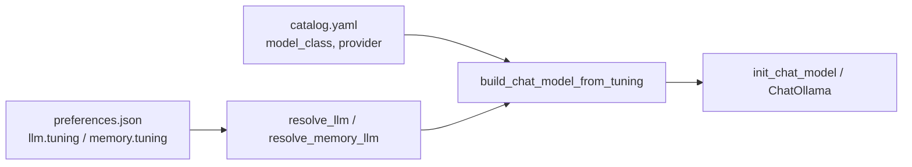

## Question

i want to define in preferences the thinking level when its a thinking model and the max tokens , how can i do that so it works with any model??


## Answer

You already have **half** of this pattern for chat — but not for memory, and not for thinking yet.

## What exists today

| Surface | Max tokens | Thinking | Where resolved |
|--------|------------|----------|----------------|
| **Chat** (`llm.default_chat`) | ✅ `llm.tuning[<model_id>].max_tokens` | ❌ not exposed | `resolve_llm()` → `create_chat_model()` |
| **Memory** (`memory.default_llm`) | ❌ hardcoded (2000 / 8192) | ❌ hardcoded (`thinking_level="low"`, etc.) | `_chat_langchain_config()` in `services/memory/service.py` |

Chat tuning is already per-model and provider-agnostic at the **preference** layer:

```126:139:hiroserver/hirocli/src/hirocli/domain/preferences.py
class ModelTuning(BaseModel):
    """Per-model runtime overrides keyed by canonical model id."""

    temperature: float = Field(default=0.7, ge=0.0, le=2.0)
    max_tokens: int = Field(default=1024, ge=1)


class LLMPreferences(BaseModel):
    ...
    tuning: dict[str, ModelTuning] = Field(default_factory=dict)
```

Admin UI exposes it as **Model tuning JSON** under Models. Memory has no equivalent — only `default_llm`, `default_embedding_model`, `max_messages`.

So the fix is not “invent preferences from scratch”; it’s **extend the existing tuning model + centralize how it’s applied**.

---

## Recommended design (works with any model)

### 1. Extend `ModelTuning` once, use it everywhere

Add one optional, provider-neutral field:

```python
ThinkingLevel = Literal["off", "minimal", "low", "medium", "high"]

class ModelTuning(BaseModel):
    temperature: float = ...
    max_tokens: int = ...
    thinking: ThinkingLevel | None = None  # None = smart default for purpose
```

Keep **`max_tokens`** as the single user-facing output budget name. Internally map it per provider:

| Provider / model | Maps to |
|------------------|---------|
| OpenAI (normal) | `max_tokens` |
| OpenAI (GPT-5 / o-series) | `max_completion_tokens` |
| Google | `max_output_tokens` |
| Ollama | `num_predict` |
| Anthropic | `max_tokens` |

### 2. Add `memory.tuning` (mirror `llm.tuning`)

Don’t reuse `llm.tuning` for memory — chat and memory want different defaults (memory: `temperature=0`, `thinking=low`, higher `max_tokens`).

```json
"memory": {
  "enabled": true,
  "default_llm": "google:gemini-3-flash-preview",
  "default_embedding_model": "openai:text-embedding-3-small",
  "tuning": {
    "google:gemini-3-flash-preview": {
      "temperature": 0,
      "max_tokens": 8192,
      "thinking": "low"
    }
  }
}
```

Add `resolve_memory_llm(prefs) -> ResolvedModel` parallel to `resolve_llm()`.

### 3. One builder — not duplicated provider branches

Today provider logic is split:

- `domain/model_factory.py` — agent chat
- `services/memory/service.py` — `_chat_langchain_config()` (duplicate + hardcoded)

Extract something like:

```text
build_chat_model_from_tuning(
    model_id, workspace_path, tuning, *, callbacks=None, purpose="chat"|"memory"
)
```

Inside, branch on **catalog + provider**, not on call site:

```text
spec = catalog.get_model(model_id)
tuning = prefs...tuning.get(model_id, default_for_purpose)

base = { temperature, max_tokens mapped, callbacks }

if provider == "google":
  if spec supports thinking (model_class == "reasoning" OR gemini-2.5/3 heuristic):
    apply thinking_level / thinking_budget from tuning.thinking
  else:
    ignore thinking field

if provider == "openai" and is_reasoning_model(spec, api_model):
  use max_completion_tokens; map thinking → reasoning_effort if supported

if provider == "anthropic" and extended_thinking:
  map thinking → anthropic budget param
```

**Key rule:** if a model doesn’t support thinking, **ignore** `tuning.thinking` (don’t error). That’s what makes it work with any model.

### 4. Use catalog to decide *whether* thinking applies

Catalog already has `model_class: reasoning` on some rows. You can use that instead of string heuristics like `gemini-3`:

- `model_class == "reasoning"` → thinking prefs apply
- optional future catalog field: `thinking_control: google_level | google_budget | openai_effort | none`

That keeps prefs stable when Google adds Gemini 4.

### 5. Wire reload paths

| Change | Needs |
|--------|--------|
| `memory.tuning.*` or `memory.default_llm` | Rebuild `Mem0MemoryService` (already partial via `_reload_memory_on_change`) |
| `llm.tuning.*` | Evict agent compile cache / rebuild graph (doc says “future reaction”) |
| Compile cache key | Include `thinking` + `max_tokens` in `_compile_key()` |

---

## Flow (target state)



---

## What you can do **right now** (no code)

For **agent chat only**, set tuning in admin **Model tuning JSON**:

```json
{
  "google:gemini-3-flash-preview": {
    "temperature": 0.7,
    "max_tokens": 4096
  }
}
```

That affects `call_model`, **not** mem0 `memory_out` — and **`thinking` still isn’t honored** anywhere; Google will still default to high thinking on Gemini 3 until code maps a thinking param.

For **memory**, there is no prefs hook yet — only the hardcoded values in `_chat_langchain_config`.

---

## Minimal implementation order

1. Extend `ModelTuning` with `thinking`
2. Add `memory.tuning: dict[str, ModelTuning]`
3. Add `resolve_memory_llm()`
4. Extract shared `build_chat_model_from_tuning()`; point **both** `model_factory` and mem0 at it
5. Pass `prefs` into `Mem0MemoryService` / `_mem0_model_config`
6. Admin UI: memory tuning block (same pattern as chat JSON, or fields when `default_llm` is selected)
7. Preference reactor: reload memory on `memory.tuning.*`; evict compile cache on `llm.tuning.*`

---

### TL;DR

- **Chat**: `max_tokens` is already in `llm.tuning[<model_id>]`; **thinking is not**.
- **Memory**: neither is configurable — both are hardcoded in `services/memory/service.py`.
- **To work with any model**: extend `ModelTuning` with optional `thinking`, add `memory.tuning`, and **one central builder** that maps generic prefs → provider kwargs using catalog (`model_class: reasoning`), ignoring thinking on non-thinking models.
- **Don’t share** chat and memory tuning — same model id, different purposes.

If you want this implemented, switch to Agent mode and say whether you want memory-only first or chat + memory together.