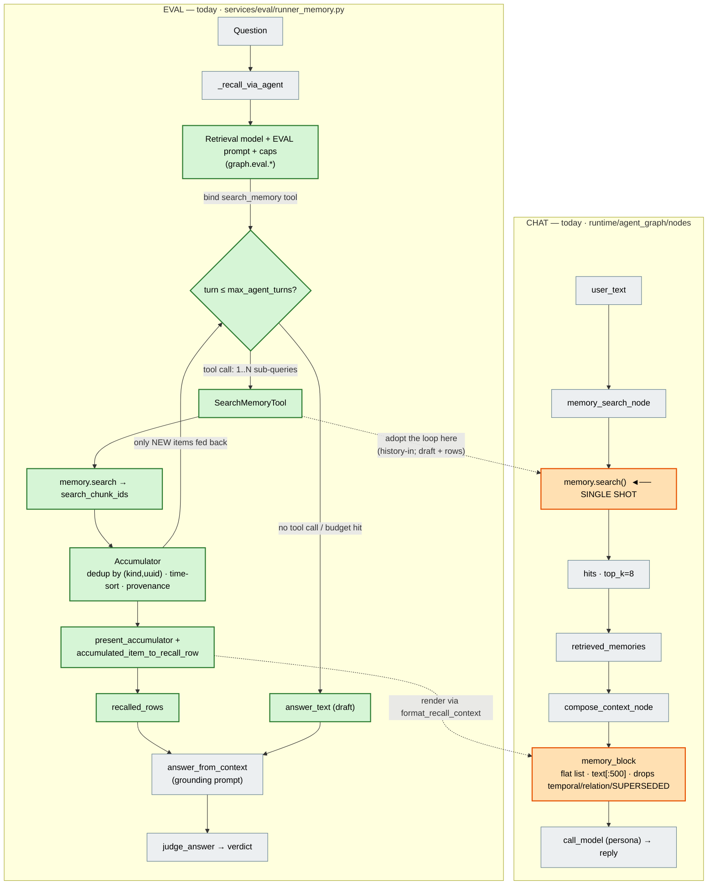
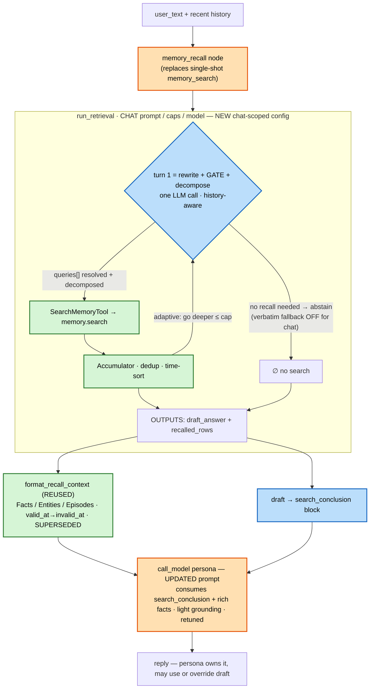

# Memory: Eval vs Chat — Parity Analysis & Gaps

> **Status:** Research note (no code changes). Goal: bring the live **chat** conversation-memory
> experience up to the quality the **memory-eval** track already reaches.
>
> **Eval vs chat today:** the eval recall leg runs an **agentic retrieval loop**
> (`services/memory/agent/`, `run_retrieval`); chat still does a single `memory.search()` + a flat
> `memory_block`. Code **takes precedence over docs**. Retrieval **config/engine is already shared**
> across both (§1 Configuration) — the gaps are in **ingestion inputs** (§2 + the Ingestion design)
> and **chat retrieval flow + output formatting** (the *Chat retrieval* section), not configuration.
>
> Related: [`memory-graphiti-replacement-design.md`](memory-graphiti-replacement-design.md),
> [`eval-corpus-tracks-design.md`](eval-corpus-tracks-design.md),
> [`agentic-memory-retrieval-implementation.md`](agentic-memory-retrieval-implementation.md).

## Chat retrieval — new design (spec)

> **Status:** spec, Jul 2026 — *what changes* + the before/after shape; the detailed code design is
> a later turn. This section is **self-contained** (the whole chat-retrieval story). **Ingestion**
> has its own [implementation design](#ingestion--implementation-design-windowed-batch) (being
> built) and is untouched here. **Knowledge retrieval is out of scope** and unchanged — it is
> toggled off during memory tests so it doesn't pollute results.

### Today → target

**Chat today** does **one** `memory.search()` and folds the raw hits into the persona prompt via a
flat `memory_block` (drops temporal / relationship / `SUPERSEDED`, truncates to 500 chars). **Eval**
runs the agentic loop `run_retrieval`: the LLM decomposes the question into parallel sub-queries,
searches across several turns, accumulates a deduped / time-sorted set, and produces **two** outputs
— a **draft answer** (`answer_text`, from the natural-stop turn (Exit A) or a final compose turn
(Exit B)) **and** the **accumulated recalled rows** — which eval's grounding answerer + judge
consume.

The loop is **already surface-neutral** (`services/memory/agent/`); the only eval-bound parts are
the prefs namespace (`graph.eval.*`), the call site (`runner_memory.py`), the eval-only verbatim
fallback, and *who answers*. So adopting it in chat is **lift-and-share, not a rewrite**.

**The target in a nutshell:** chat replaces single-shot `memory_search` with the loop as a
**pre-pass** (chosen for control), fed **recent history** so the loop's first turn does **rewrite +
recall-gate + decomposition** in one LLM call. It hands the persona **both** the **draft** (as a
`search_conclusion` block) and the **rich recalled rows** (rendered by eval's `format_recall_context`).
The **persona owns the reply** and may use or override the draft. Retrieval config is **shared with
eval today**, retuned / split for chat later (§1).

### Today: both flows, with reuse highlighted



**Legend** — 🟩 green = **reused from eval** (loop engine + `DRAFT` + rich rows, untouched) · 🟧
orange = **chat change points** · ⬜ grey = unchanged. Chat swaps its single `memory.search()` for
the **loop** (fed history, producing **both** draft + rows) and renders memory via
`format_recall_context` instead of the flat `memory_block`. (Eval's answerer/judge stay eval-only —
the **persona** answers in chat.)

### Target chat flow (after adoption)



**Legend** — 🟩 green = **reused eval engine** (`SearchMemoryTool`, `Accumulator`,
`format_recall_context`) · 🟦 blue = **chat-scoped config/behavior** (prompt, caps, model, abstain)
· 🟧 orange = **chat change points** (the node replacement, the updated persona prompt).

**Reading the target:** the loop is the **same eval engine** under **chat-scoped config**. Its
**first turn** collapses **rewrite + recall-gate + decomposition** into one history-aware LLM call —
the **gate** is simply the model choosing *not* to search (which requires eval's **verbatim
fallback disabled** for chat, else abstain is overridden and a search is forced). **Adaptive depth**
is the loop's own stop decision (Exit A), bounded by the caps; `turns=1` collapses toward today's
single-shot, so it ships safe and tunes up. Chat consumes **both outputs** — the `draft` as a
`search_conclusion` block and the rich rows via `format_recall_context` — and the **persona**
(updated, retuned prompt) writes the final reply.

### What gets reused vs added

| Eval component | File | In chat? |
|---|---|---|
| `run_retrieval` loop | `services/memory/agent/retrieval_agent.py` | **Reuse** — add chat flags: feed **history** + **disable verbatim fallback** (enable abstain) |
| `SearchMemoryTool` | `services/memory/agent/search_tool.py` | **Reuse** as-is |
| `Accumulator` | `services/memory/agent/accumulator.py` | **Reuse** as-is |
| `present_accumulator` / `accumulated_item_to_recall_row` | `services/memory/agent/presentation.py` | **Reuse** as-is |
| `format_recall_context` (rich render) | `services/eval/judge.py` | **Reuse** — chat renders memory with it (**replaces** the flat `memory_block`) |
| Draft `answer_text` | `run_retrieval` output | **Consume** — inject as a `search_conclusion` block in the persona prompt |
| History → loop input | knowledge does it; memory doesn't | **New** — feed recent messages so turn 1 does the rewrite (**subsumes I4**) |
| Retrieval prompt | `graph.eval.retrieval_agent_prompts` | **Done (P1)** — locked `chat` profile in the **shared** library; chat selects via its own `memory.retrieval.active_prompt_id` (new `promptLibrarySelect` widget) |
| Caps / model | `graph.eval.retrieval_agent`, `graph.eval.retrieval_model` | **Done (P1)** — chat got its **own** `memory.retrieval.{limits,model,tuning_profile}` (turns=4 default); the `memory.retrieval.*` split is no longer deferred |
| Shared entrypoint | _does not exist yet_ | **New** small `MemoryRetriever` seam (eval + chat both call) |
| Persona / answering prompt | `call_model` (`compose_context`) | **Update** to consume `search_conclusion` + rich facts (light grounding; retuned) |
| Loop transcript + trajectory + preview | `services/memory/agent/agent_trace.py` (P6/P8/P9) | **Reuse** — pure over `RetrievalResult.transcript`; chat calls `write_agent_retrieval_trace` (**generalize** the `question_id` key → G3) + `format_memory_recall_output_preview` (G2) |
| `memory_recall` ledger node | `_write_recall_usage` + `@graph_logged` wrapper | **Reuse** — chat names its recall node `memory_recall` w/ `captures={"usage","decision"}`; usage lands automatically (G1) |
| Graph-Runs → detail bridge | `store.find_row_by_run_id` (`run_id → eval_results.db`) | **New (chat-safe)** — a chat run isn't in `eval_results.db`; add a sidecar-backed trajectory + recall view (G4) |
| Answerer / judge | `services/eval/judge.py` | **Not used** — persona answers in chat |

### Output rendering — why the rich rows matter (O1–O5)

The loop hands over rich rows, but they only help if chat *renders* them. Reusing
`format_recall_context` (vs today's flat `memory_block`) is what makes the recalled facts usable:

| # | Eval `format_recall_context` (`eval_judge.py:110-137`) | Chat `memory_block` today (`context_assembly.py:157-176`) |
|---|---|---|
| **O1** | Keeps **relationship**, **temporal validity** (`valid X → present`), **`SUPERSEDED`** per fact | **Drops all of it** — only `- {date} · score · {text[:500]}` |
| **O2** | **Facts / Entities / Episodes** sections | **Flattens** all kinds into one bullet list |
| **O3** | **No truncation** | Truncates each memory to **500 chars** |
| **O4** | Shows the fact's **`valid_at`** window | Reads **`created_at`** (ingest time) → date often **blank** |
| **O5** | Strict grounding-only answer prompt at temp **0.2** | Memory is one advisory block in the **persona** prompt (temp **0.7**), **no grounding instruction** |

**O1 is the headline:** the model can pick the *current* fact only because it *sees*
`valid → present` / `SUPERSEDED` — chat strips those today. **O5 in chat becomes a *light* grounding
nudge on the persona** (plus the draft `search_conclusion`), retuned for chat — not eval's strict
prompt, so persona voice is preserved.

### Components — build / reuse / change

| Kind | Component | Note |
|---|---|---|
| **Reuse as-is** | `SearchMemoryTool`, `Accumulator`, `present_accumulator`, `format_recall_context` | no changes |
| **Extend** | `run_retrieval` | add **history input** + a flag to **disable the verbatim fallback** (enable abstain); defaults keep eval behavior |
| **New (seam)** | `MemoryRetriever` | surface-neutral entrypoint; eval + chat both call it |
| **New (config)** | `memory.retrieval.*` prefs + chat retrieval prompt | caps / model / enable; prompt via the multi-prompt locked defaults |
| **Change (node)** | `memory_search_node` (`runtime/agent_graph/nodes/memory.py`) | single-shot → pre-pass loop; stash `draft` + `recalled_rows`; ledger under a `memory_recall` node |
| **Change (render)** | chat `memory_block` (`context_assembly.py`) | → `format_recall_context` |
| **Change (answer)** | persona prompt (`compose_context` / `call_model`) | consume `search_conclusion` + rich facts; light grounding; retune |
| **Untouched** | knowledge retrieve, eval answerer / judge | off-scope |

### Graph-run representation — observability parity (G1–G5)

> A chat retrieval turn must be as **inspectable** in the **Graph Runs** page as an eval question is
> today: one **`memory_recall`** ledger node (cost / decision / preview), the loop **transcript
> sidecar** (turns · sub-queries), and the per-search **retrieval traces** — all reachable from the
> node row. **Most of this machinery already exists** — it was built for eval
> (`services/memory/agent/agent_trace.py`, tagged P6/P8/P9). The catch: **every *write / persist /
> resolve* path is eval-bound.** Phase 2's one-liner ("`_write_recall_usage` → cost shows as the
> recall node") only covers the *cost* slice; the transcript, the node decision/preview, and the
> detail dialog are the rest of a *complete* representation.

**Already produced by the loop — surface-neutral (reuse as-is):**

- `run_retrieval` returns `RetrievalResult.transcript` (`tool_call` / `sub_result` / `tool_error` /
  `final` events) **and** `error_count` (`retrieval_agent.py:50-58, 383-406`).
- `_write_recall_usage` (`retrieval_agent.py:93-105`) folds the loop's LLM tokens onto **whatever
  `memory_recall` ledger entry is active** via `observe(usage=…)` — no-op off-ledger, caller-agnostic.
- `agent_trace.py` pure helpers: `write_agent_retrieval_trace` (sidecar),
  `build_retrieval_loop_payload` (admin trajectory block), `format_memory_recall_output_preview`
  (node `output_preview`) — all pure over the transcript.

**Eval-bound today — the chat deltas:**

| # | Artifact | Eval wiring (today) | Chat delta |
|---|---|---|---|
| **G1** | `memory_recall` **ledger node** | `runner_memory` opens `sink.open_entry("memory_recall", …, captures={"usage","decision"})` around the loop, so `_write_recall_usage`'s `observe` lands | Chat's recall node must be **named `memory_recall`** and declare `captures={"usage","decision"}` — the `@graph_logged` wrapper then opens the same entry and usage lands automatically. The admin marker keys on the **node name** (`GraphRunsNodesTable.svelte:70`), so the current `memory_search` label must become `memory_recall`. |
| **G2** | node **decision + preview** | eval sets the decision from the loop outcome + `output_preview` via `format_memory_recall_output_preview` | Chat calls `observe(decision=…)` distinguishing **recalled / abstained / recalled-empty / errored** (use `RetrievalResult.error_count` — a recall emptied by search errors must not read as a clean "found nothing") and sets the same preview helper. |
| **G3** | **transcript sidecar** | `write_agent_retrieval_trace(run_id, question_id, transcript)` (`runner_memory.py:288`), keyed `run_id__question_id` | Chat calls it too, but **`question_id` has no chat analogue** → generalize the key (a neutral `leg`/`slot`, e.g. `step_index`) so a chat turn writes `…/retrieval_trace/agent/{run}__{step}.jsonl`. |
| **G4** | **detail dialog** | `memory_recall` row → `onOpenEvalRow` → resolves `run_id → eval_results.db` (`store.find_row_by_run_id`, `store.py:166`) → rich dialog (gold / our-answer / **trajectory** / facts) | **A chat run is not in `eval_results.db`** → the bridge returns `None` and the marker **dead-ends with an error toast** (`graph-runs-controller.svelte.ts:82-89`). Chat needs a **chat-safe detail path**: read the sidecar → `build_retrieval_loop_payload` → show **trajectory + recalled rows**, hiding the eval-only gold/judge tabs. New backend read + a degraded dialog branch. |
| **G5** | per-search **retrieval traces** | each sub-query search writes `write_trace_sidecar(run_id, step_index, sid)` under the recall step (observability=`trace`) | Works as-is **iff** the loop's searches run under the recall node's `step_index` context and thread `sid` per sub-query; **verify** the live `SearchMemoryTool → graphiti_conversation` path stamps `sid` (eval does; confirm chat does). |

**Gating (`graph.observability`, unchanged).** Under **`ledger`** (prod default) a chat turn gets
**G1+G2** — the recall node with cost, decision, and preview (loop fully cost-attributed). Under
**`trace`** it additionally gets **G3+G5** (transcript + per-search pipeline) and thus the **G4**
trajectory view. So a normal chat turn is always cost-visible; the deep loop internals appear when
tracing is on — the same contract eval uses. **This means G1/G2/G3/G5 are backend/ledger wiring
folded into Phase 2; G4 (admin chat-safe detail) is its own phase.**

### Implementation phases

> High-level ordering only — a **detailed design is a later run**. Each phase leaves chat working.
> **Caps decision (2026-07-02):** chat **reuses eval's validated `graph.eval.retrieval_agent`
> (default `max_agent_turns=4`)** — eval parity, not a tight `turns=1` override. Safety in early
> phases comes from the **abstain gate + flat render + observability gating**, and Phase 6 can tune
> *down* if latency/cost demands.
>
> **Turn-semantics fix (2026-07-03):** `max_agent_turns` now means the **search-turn budget** — the
> model gets exactly that many tool-bound search turns, and the *optional* exit-B compose turn (only
> when the loop never stops on its own) is **not** counted (total LLM calls ≤ `max_agent_turns + 1`).
> Previously the loop reserved one turn for the answer (`max_agent_turns − 1` search turns), so
> `turns=1` gave **zero** search turns and every `turns=1` recall could only fall back / abstain —
> which also made a starved recall read as a deliberate *abstain* in Graph Runs (the M3 review
> finding). Now `turns=1` grants one real search turn, so `searches == 0` is an honest
> abstain. **Effect:** at the default `4`, chat and eval each get **one more** effective search turn
> than before (was 3) — this breaks the P0 "eval byte-identical" property, so **re-run the memory
> eval** to confirm the bar holds; drop the pref to `3` to reproduce the old effective depth.

**Bucket A — Foundations (no user-visible change)**

| # | Phase | Goal | Ships safe because | Validate |
|---|---|---|---|---|
| **0** ✅ | Shared seam + loop flags **(done 2026-07-02)** | lift `run_retrieval` into `MemoryRetriever`; add `history` + abstain flag; eval calls the seam. **Also generalize** `write_agent_retrieval_trace`'s `question_id` → a neutral `slot` key (G3) so chat can key by `step_index` | flags default to eval's current behavior; `RetrievalResult` already carries `transcript`/`error_count` (no shape change) | **eval track unchanged** (regression) — 41 tests green |
| **1** ✅ | Chat config + prompt — **`memory.retrieval.*` split (done 2026-07-02)** | own `memory.retrieval.{active_prompt_id, limits, model, tuning_profile}` on the Agent-memory card; **shared** prompt library via new `promptLibrarySelect` widget; caps default `turns=4` (eval parity) | nothing wired to the loop yet; config + UI only | 231 backend + 69 frontend prefs tests, `svelte-check` 0 errors |

**Bucket B — Quality package (2–4 land together for the real win)**

| # | Phase | Goal | Ships safe because | Validate |
|---|---|---|---|---|
| **2** ✅ | Wire the pre-pass loop **+ graph-run wiring (G1–G3, G5)** — **done 2026-07-02** | `memory_search_node` runs `MemoryRetriever.retrieve` (chat cfg, fed history, **abstain on**); stashes rich rows + **`memory_draft`**; decision distinguishes recalled/**abstained**/errored/empty (G2) + `format_memory_recall_output_preview` (G2); transcript sidecar under `trace` (G3); usage lands via `_write_recall_usage` (G1); **flat render kept** (P3). **Node NOT renamed** — kept `memory_search` (rename → `memory_recall` deferred to P5/G4 to avoid 8-fixture churn; usage/decision land name-independently). New `build_memory_retrieval_model` (`memory.retrieval.model → llm.default_chat`). | reuses eval caps (turns=4); usage/preview land on the wrapper entry (no new ledger plumbing) | **latency/cost inflection** (loop = ≥1 extra LLM call/turn); abstain skips chit-chat; recall node shows model/tokens/cost + decision. Tests: 283 runtime (incl. rewritten node tests + regenerated snapshot fixtures) + 270 domain/memory/eval + `svelte-check`. **G5** per-search trace nesting: deferred verify (needs a live `trace` run) |
| **3** ✅ | Rich rendering **+ chat render caps** — **done 2026-07-02** | flat `memory_block` → shared `format_recall_context` (moved out of `services/eval` into `services/memory/agent/presentation.py`; eval re-exports); **new `memory.retrieval.render.*` prefs** (chat copy of eval's "Answer context" caps + temporal toggles) on the Memory tab, built into a chat `RecallRenderOptions` | pure formatting on rows in hand | temporal / relationship / `SUPERSEDED` visible; kinds grouped; no bad truncation; render caps editable + honored — 640 backend + 69 frontend prefs, `svelte-check` clean |
| **4** ✅ | Draft + persona answer — **done 2026-07-02** | inject the loop's draft as a `## Memory search conclusion` block + a **light** grounding nudge, both in **turn_context** (not the system prompt); persona consumes conclusion + rich facts | persona still owns voice (turn_context only; blocks conditional on recall) | memory actually used; voice preserved; draft overridable — 283 runtime tests. *Temp retune → Phase 6.* |
| **5** ✅ | Graph-run detail parity (G4, admin) — **done 2026-07-02** | node rename `memory_search → memory_recall` (40 files, consistent); eval-detail (ⓘ) marker **gated to eval runs** so chat recall no longer dead-ends; **new trajectory (📊) marker** on a chat `memory_recall` row → `GET /graph-runs/{run_id}/retrieval-loop` (reads the agent-transcript sidecar) → a dialog reusing the eval **`EvalRetrievalTrajectory`** renderer (turns/sub-queries); the per-search pipeline stays on the ⌗ marker alongside | pure read/render + a mechanical rename; endpoint returns null off-`trace` | chat `memory_recall` row (under `trace`) opens the loop trajectory, no toast — 283 runtime + 81 graph-runs + 7 agent-trace + `svelte-check` |

**Bucket C — Tune**

| # | Phase | Goal | Validate |
|---|---|---|---|
| **6** | Tune & measure | loosen caps, tune chat retrieval + persona prompts, A/B vs the eval bar; optional cheap pre-gate for cost | quality up; latency / cost acceptable |

**Cross-cutting**

- **Latency/cost inflection is Phase 2** — at eval-parity caps (turns=4) the loop adds up to a few
  LLM calls before the persona replies; the **abstain gate** (skip search when no memory is needed)
  is the main mitigation, with a heuristic pre-gate and/or tuning caps *down* as the Phase-6 levers.
- **Config shared with eval now, split later** (post-task) — retune-for-chat happens on the shared
  knobs first.
- **Graph-run representation** — the loop's LLM usage, decision, preview, transcript, and per-search
  traces all attribute to a **`memory_recall`** node in the chat turn's Graph Run (reuse eval's
  P6/P8/P9 machinery; see [Graph-run representation — observability parity](#graph-run-representation--observability-parity-g1g5)).
  G1–G3/G5 are Phase-2 backend wiring; **G4** (the admin chat-safe detail view) is Phase 5. Under
  the `ledger` default, cost + decision are always visible; the deep loop internals appear under
  `trace`.
- **Knowledge retrieve** untouched (toggled off during memory tests).

### Detailed design (per phase)

> Grounded in today's code. Expands each phase into concrete seams (files / functions / shapes).
> Still design-level — signatures are the intended shape, not final.

**Data flow (target):**
`memory_search_node` → `MemoryRetriever.retrieve(query, history, …)` → `run_retrieval` →
`RetrievalResult{accumulator, answer_text}` → state `{retrieved_memories: rich rows, memory_draft}`
→ `memory_block` (via `format_recall_context`) + `search_conclusion_block(draft)` →
`compose_context_node` → `inject_turn_context` (onto last human turn) → `call_model` (persona).

**Phase 0 — `MemoryRetriever` seam + `run_retrieval` flags.** Today `run_retrieval` is called only
from `runner_memory._recall_via_agent` and bakes in two eval-isms: it seeds
`messages = [SystemMessage(prompt), HumanMessage(question)]` (no history) and runs an
**unconditional verbatim fallback** on an empty accumulator (`retrieval_agent.py:359-370`).

- **New** `MemoryRetriever` (`services/memory/agent/retriever.py`) — surface-neutral callable:
  `retrieve(query, *, memory, limits, prompt_text, model, model_id, user_id, character_id, history=None, allow_abstain=False) -> RetrievalResult`. Just forwards to `run_retrieval`.
- **Extend** `run_retrieval(...)` with `history: list[AnyMessage] | None = None` (seeded into
  `messages` before the `HumanMessage(question)`) and `allow_abstain: bool = False` (gates the
  fallback: `if acc.size()==0 and not allow_abstain: …`; abstain → `RetrievalResult(∅, "")`).
- Eval's `_recall_via_agent` calls the seam with defaults ⇒ **byte-identical** behavior.
- **G3 key seam:** `run_retrieval` already returns the `transcript` + `error_count`
  (`RetrievalResult`, `retrieval_agent.py:50-58`), so no loop change is needed for the trace — but
  `write_agent_retrieval_trace(run_id, question_id, …)` (`agent_trace.py:140`) bakes in a
  `question_id`. Generalize that parameter to a neutral `leg`/`slot` string (eval passes the
  question id; chat will pass `step_index`) so the sidecar stem works for both surfaces.
- *Validate:* eval track regression (unchanged); `test_agent_trace` still green.
- **Built 2026-07-02:** new `services/memory/agent/retriever.py` (`MemoryRetriever.retrieve`,
  dispatched through the `retrieval_agent` module so tests monkeypatching `run_retrieval` still
  bind); `run_retrieval` gained `history` / `allow_abstain` (both default to eval behavior — abstain
  returns `RetrievalResult(∅, "")` only when `acc.size()==0 and allow_abstain`); trace key renamed
  `question_id → slot` (eval passes the question id). Eval's `_recall_via_agent` now calls the seam.
  Tests: `test_retrieval_agent` (+abstain/history), `test_agent_trace`, `test_memory` — 41 green.

**Phase 1 — chat config + prompt (the `memory.retrieval.*` split, brought forward).** After review
the deferred split was **pulled into P1**: chat gets its **own** `memory.retrieval.*` config on the
**Agent ▸ Agent memory** card, so nothing chat-related lives in the eval card. Decisions (via
`AskUserQuestion`): **shared prompt library** (one dict, two independent dropdowns) + **full split**
(own prompt selection + caps + model).

- **Shared library, own selector.** The prompt *library* stays the single
  `graph.eval.retrieval_agent_prompts` (holds the locked `default` (eval) + `chat` profiles); chat
  selects via its **own** `memory.retrieval.active_prompt_id` (default → `chat`), eval via
  `graph.eval.active_retrieval_agent_prompt_id`. The manifest owns each library **dict** per-tab and
  the `promptLibrary` widget owns its `dictPath`, so a naive shared reference would double-claim the
  eval dict on the agent tab → **new `promptLibrarySelect` widget** that renders the same
  dropdown/editor over a shared `dictPath` but owns **only** its `activeIdPath`.
- **Own caps + model (turns=4).** `memory.retrieval.limits` (own `RetrievalAgentLimits`, default
  `max_agent_turns=4` — eval parity, **not** `turns=1`) + `memory.retrieval.model` /
  `tuning_profile`. Chat tunes independently of eval; the eval caps card is relabeled eval-only.
- *Built 2026-07-02:* prompt file `memory_chat_retrieval_agent.md` + constants; locked `chat` profile
  in the shared library; new `MemoryRetrievalPreferences` (`models_memory.py`) on `MemoryPreferences`;
  `resolve_prompt_from_library` (shared helper) + cross-namespace `resolve_chat_retrieval_agent_prompt`
  (reads `memory.retrieval.active_prompt_id`); new `promptLibrarySelect` manifest widget
  (owns only `activeIdPath`); Agent-memory card gains model + prompt-select + caps (card `validate`
  mirrors eval); `PrefModelIdPath` += `memory.retrieval.model`. Tests: 231 backend + 69 frontend
  prefs; `svelte-check` 0 errors. **Needs a server restart** (schema-driven UI serves the new fields
  only after restart).
- *UI reorg 2026-07-02:* the **eval** retrieval-agent cards ("Retrieval Agent Model & Prompt" +
  "Retrieval Agent" caps, incl. the answerer/judge "Answer context" render caps) **moved from the
  "Memory" (graph-engine) tab to the Eval tab** (routing rules in `preferences-tabs.ts` + cards moved
  `graph-engine-manifest.ts` → `eval-manifest.ts`), so eval settings no longer live on the shared
  engine tab. Still on the graph-engine tab: the eval temporal render toggles (`graph.eval.show_*`) —
  a possible follow-up. Frontend-only (no schema change).
- *UI reorg 2026-07-02 (chat side):* the **chat** `memory.retrieval.*` config **moved from the Agent
  tab to the Memory (graph-engine) tab** and reorganized eval-style — two cards, **"Chat Retrieval
  Agent Model & Prompt"** (model + shared-library prompt select) + **"Chat Retrieval Agent"** (a
  "Loop limits" panel with the 6 caps). Rationale: these are memory-engine-specific, not general chat
  settings. Routing: `{ prefix: 'memory.retrieval', tab: 'graph-engine' }` overrides `memory → agent`.
  Distinct card titles from eval's (avoids a search-index title-rank collision). Frontend-only.

**Phase 2 — wire the loop into `memory_search_node`** (`runtime/agent_graph/nodes/memory.py:87`).

- Gather `history = state["messages"]`, `query = user_text`; resolve chat config from
  `memory.retrieval.*` (P1): `limits = memory.retrieval.limits`, prompt via
  `resolve_chat_retrieval_agent_prompt(prefs)`, model from `memory.retrieval.model` (add a
  `build_memory_retrieval_model` mirroring `build_eval_retrieval_model`); call
  `MemoryRetriever.retrieve(query, memory=self.services.memory, history=history, allow_abstain=True, …)`.
- Stash into state: `retrieved_memories =` rich rows
  (`present_accumulator` → `accumulated_item_to_recall_row`), and **new** `memory_draft: str | None`
  (`GraphState`) `= result.answer_text`.
- **Graph-run wiring (G1/G2/G3/G5):**
  - **G1** — the node already runs under `@graph_logged(captures={"usage","decision"})`; **rename it
    `memory_recall_node`** (label `memory_recall`) so (a) the loop's `_write_recall_usage` →
    `observe(usage=…)` lands on that entry ⇒ model/tokens/cost show on the recall node, and (b) the
    admin trace/eval marker (keyed on node name `memory_recall`, `GraphRunsNodesTable.svelte:70`)
    lights up. *(No-backward-compat mode — plain rename, no `memory_search` alias.)*
  - **G2** — after the loop, `observe(decision=…, output=format_memory_recall_output_preview(result.transcript, facts_preview=…))`;
    decision distinguishes `recalled` / `abstained` / `recalled-empty` / `errored` (from
    `result.error_count`), so an error-emptied recall isn't confused with a clean miss.
  - **G3** — call the (now-generalized) `write_agent_retrieval_trace(run_id, leg=str(step_index), result.transcript)`
    so the loop transcript sidecar exists for the chat run (best-effort; observability=`trace`).
  - **G5** — the loop's per-sub-query searches already flow `SearchMemoryTool → memory.search →
    graphiti_conversation.write_trace_sidecar(run_id, step_index, sid)`; because they run inside the
    `memory_recall` node they share its `step_index`, so multiple `sid`-stamped traces nest under the
    one recall step (as in eval). **Confirm `sid` threading** on the live path at impl time.
- **Keep the flat `memory_block`** this phase (rows adapted) to isolate loop-wiring risk from render.
- *Validate:* latency (one added LLM call), abstain skips chit-chat (empty rows, no reply
  regression), recall node shows tokens/cost + decision, sidecar written under `trace`, error paths.
- **Built 2026-07-02:** `memory_search_node` rewritten to run `MemoryRetriever.retrieve` (history +
  `allow_abstain=True`); stashes rich rows + `GraphState.memory_draft`; decision =
  recalled/abstained/errored/empty (via `summarize_agent_transcript` + `error_count`) + preview via
  `format_memory_recall_output_preview`; G3 sidecar written under `trace` (keyed `run_id`/`step_index`
  via `current_entry`); new `services/memory/models.build_memory_retrieval_model` +
  `resolve_memory_retrieval_llm` (`memory.retrieval.model → llm.default_chat`, shown in the picker's
  empty box via a new `modelProfile` `emptyFallback`). **Deviations from the plan above:** (1) node
  **kept `memory_search`** — the `→ memory_recall` rename (G1 label + admin marker) is **deferred to
  Phase 5/G4**, since usage/decision land name-independently and the rename would churn 8 snapshot
  fixtures for no P2 value; (2) with **no chat model configured** the loop can't run → the node
  degrades to `("empty","no_model")` (model-less snapshot fixtures regenerated to this contract; live
  recall is covered by `test_retrieval_agent` + `test_agent_graph_preferences`). Tests: 283 runtime +
  270 domain/memory/eval; `svelte-check` 0 errors. **Needs a server restart** (schema + new node
  behavior). *Deferred:* live-`trace` G5 sid-nesting check; per-turn model-build caching (Phase 6).
- **Identity threading (done 2026-07-02):** the loop now phrases queries with the **real names** —
  memory anchors facts to the speaker's real name, so "Misho's wife" hits the entity hub + BM25 far
  better than "the user's wife". `run_retrieval`/`MemoryRetriever.retrieve` gained `user_name` /
  `agent_name` (formatted into a new **## Identities** block in `memory_chat_retrieval_agent.md` via
  `{USER_NAME}` / `{AGENT_NAME}`; blank → generic wording, so no regression); `memory_search_node`
  resolves them exactly as ingest does (`memory.user_name` + `get_character_name`). The assistant is
  marked as **"AI"** on both sides for same-name collision safety: its episode speaker label is now
  `{name} (AI)` (`windowing._render_body`) and the prompt refers to it as "AI assistant {name}" — the
  two forms kept **aligned** so hybrid terms match. Eval unchanged (its prompt lacks the placeholders,
  so the extra `.format` kwargs are ignored) — eval-prompt parity is an optional follow-up.

**Phase 3 — rich render via `format_recall_context`** (`services/eval/judge.py:206`).

- `memory_block` (`context_assembly.py:159`) body ⇒ `format_recall_context(memories, render)` with a
  chat `RecallRenderOptions` built from the chat render prefs (below). Pure formatting on rows in state.
- **Chat render caps (new prefs — the replication deferred from P1).** Eval's `RecallRenderOptions`
  is driven by the "Answer context" caps `graph.eval.{max_elements_per_kind, max_fact_chars,
  max_episode_chars, max_summary_chars}` + the temporal toggles `graph.eval.{show_event_time,
  show_expired_at, show_superseded}` (Eval tab). Chat needs its **own** copy — add
  `memory.retrieval.render.*` (mirror the eval fields + bounds), surface them on the **Memory tab**
  next to the "Chat Retrieval Agent" cards, and build the chat `RecallRenderOptions` from them
  instead of hardcoding `show_event_time=True` / large `max_*`. Full pref round-trip
  (backend model → `gen:prefs-types` → Memory-tab UI → schema-driven save → `npm run check` +
  prefs tests → **server restart**). *(These are NOT the retrieval-loop caps — they bound how the
  recalled set is rendered into the prompt, the answer/rendering stage.)*
- **Layering:** `format_recall_context` lives under `services/eval` — importing eval into runtime is
  a smell; **move it to a shared render module** (e.g. `services/memory/agent/presentation.py`) as
  part of this phase (common-utility rule); eval imports from the new home.
- *Validate:* temporal / relationship / `SUPERSEDED` present, kinds grouped, no bad truncation;
  chat render caps editable on the Memory tab and honored by the renderer.
- **Built 2026-07-02:** `RecallRenderOptions` + `format_recall_context` (+ `_format_recall_item` etc.)
  **moved** `services/eval/judge.py` → `services/memory/agent/presentation.py`; `judge.py` re-exports
  them (eval callers/tests unchanged, but runtime no longer imports eval). `context_assembly.memory_block`
  now takes a `render` and calls `format_recall_context` (flat one-bullet list gone; dead
  `_format_memory_date`/`memory_text` removed). New `MemoryRetrievalRenderPreferences`
  (`memory.retrieval.render.*` — 3 toggles + 4 caps, mirroring eval) + a **"Recall rendering"** panel
  on the "Chat Retrieval Agent" card (Memory tab); `PreferencesView.memory_recall_render()` builds
  the options, `compose_context_node` passes them. Also fixed a P2 flake: event-payload snapshots now
  blank `elapsed_ms` (`normalize_event_stream`), fixtures regenerated. **Needs a server restart.**

**Phase 4 — draft + persona answer.**

- **Draft block:** new `search_conclusion_block(draft)` `ContextBlock` (heading e.g.
  "## Memory search conclusion") assembled in `compose_context_node` (`nodes/context.py:85`) — it
  rides in **turn_context** (`inject_turn_context`, `llm.py:143`), *not* the persona system prompt,
  so character voice stays clean.
- **Light grounding nudge:** one short line in turn_context ("use the recalled facts + the search
  conclusion where relevant; prefer the current fact when validity is shown; if memory doesn't cover
  it, say so") — again in turn_context, not `config.system_prompt`.
- **Retune** chat retrieval + answer settings (temp etc.).
- *Validate:* persona uses memory and can override the draft; voice preserved.
- **Built 2026-07-02:** `search_conclusion_block(draft)` + `memory_grounding_block(has_memory=…)`
  (`context_assembly.py`) added to `compose_context_node` between the memory facts and the citation
  instruction (priorities 35/40) — both ride in `turn_context`, never `config.system_prompt`. The
  conclusion shows only when the loop produced a draft (`state["memory_draft"]`); the light grounding
  line shows whenever facts and/or a draft exist (abstained turns get neither, so a no-memory turn is
  unchanged). Pure runtime (no prefs/schema/frontend); **temp retune deferred to Phase 6** — chat
  keeps its persona temp (0.7), which is the point (light grounding preserves voice). Tests: the
  memory-inject test asserts the conclusion + grounding in `turn_context`; 283 runtime green; the
  model-less snapshot/characterization harness (no draft/facts) is unaffected. **Needs a restart.**

**Phase 5 — graph-run detail parity (G4).** Today the `memory_recall` ⓘ marker calls
`onOpenEvalRow` → `getEvalRowByRunId` → `store.find_row_by_run_id`, which queries
`eval_results.db` (`store.py:166`). A **chat** run has no row there, so it returns `None` and the UI
raises *"No saved eval row found for this recall node"* (`graph-runs-controller.svelte.ts:82-89`).
Give chat a **chat-safe path**, not the eval bridge:

- **Backend read** — a small endpoint (e.g. `GET /graph-runs/{run_id}/retrieval-loop`) that reads
  the agent transcript sidecar (`agent_trace_dir` → `{run}__{step}.jsonl`) and returns
  `build_retrieval_loop_payload(events, max_agent_turns=…)` — the same trajectory shape eval persists
  to `row_json.retrieval_loop`, but sourced live from the sidecar instead of the eval DB.
- **Frontend** — when a `memory_recall` row belongs to a **non-eval** run (no eval row), open a
  **degraded dialog branch** that shows only the **trajectory** tab (reuse
  `EvalRowDetailDialog`'s trajectory renderer / `eval-trajectory-controller`) plus the node's
  **recalled rows** (already rendered by `format_recall_context` from Phase 3) — hide the eval-only
  gold / our-answer / judge tabs. The bare per-search retrieval-trace dialog (G5) remains reachable.
- *Validate:* on the Vite dev site (`:5173`, per CLAUDE.md), a live chat turn's `memory_recall` row
  opens the loop trajectory (turns / sub-queries) + recalled facts with **no eval-row toast**;
  eval rows still open the full dialog.
- **Built 2026-07-02 (part 1 — rename + dead-end fix):** the deferred node rename
  `memory_search → memory_recall` shipped (scoped sed across 40 files: node method, `chat.py` edges,
  `knowledge.py` fanout, topology + ledger fixtures, tests — all consistent, 283 runtime green). The
  eval-detail (ⓘ) marker `rowHasEvalDetail` (`GraphRunsNodesTable.svelte`) is **gated to eval runs**
  (`run_id.startsWith('memory_eval')`), so a **chat** `memory_recall` row no longer opens the eval
  bridge (no toast).
- **Built 2026-07-02 (part 2 — full recall detail dialog):** a chat `memory_recall` row now opens the
  **exact same `EvalRowDetailDialog`** an eval row does — one ⓘ marker, one dialog, **Overview +
  Facts + Entities + Episodes (with counts) + Trajectory**, per-search pipeline reachable from the
  Trajectory tab. Achieved by persisting what eval keeps in `row_json`:
  - **Node** (`memory_recall_node`) — under `observability=trace` it now writes, beside the transcript,
    a **recalled-rows + draft companion** (`write_agent_recall_result` → `{run}__{slot}.result.json`,
    `{recalled, answer}`). The rows are the SAME `accumulated_item_to_recall_row(present_accumulator(
    result.accumulator))` eval builds; `answer` is the loop's draft. No extra compute — the node
    already had `rows`/`draft`.
  - **Backend** — `GraphLedgerService.retrieval_loop` reads both sidecars and returns
    `{loop, recalled, answer, render}` (render = `memory.retrieval.render.*` caps); `GET
    /graph-runs/{run_id}/retrieval-loop` returns that shape (all null/empty off-`trace`).
  - **Frontend** — `openRetrievalLoopForNode` wraps the response as an `EvalRow`
    (`chatEvalRowFromLoop`: one `recall` leg carrying `recalled` + `answer` + `retrieval_loop` +
    `render` + the node's `run_id`) and sets the SAME `activeEvalRow`; closed by `closeEvalRow`. The
    single ⓘ marker replaces the earlier 📊+⌗ pair; the stripped-down
    `GraphRunsRetrievalLoopDialog.svelte` was **deleted**. Chat has no gold/judge, so those Overview
    rows show "—" (tabs gate on presence).
  Tests: `read_agent_recall_result` round-trip (+ confirms the `.jsonl` transcript reader ignores the
  `.result.json` companion); 8 agent-trace + 29 runtime node/memory + 81 graph-runs + `svelte-check`
  0 errors. **Needs a server restart** (new endpoint + node rename), and set `observability = trace`.

**Phase 6 — tune & measure.** Loosen caps, tune the chat retrieval + grounding prompts, A/B vs the
eval bar; optional cheap **pre-gate** heuristic before the loop if per-turn cost matters.

**New state / shapes:** `GraphState.memory_draft: str | None`; `retrieved_memories` becomes the rich
recall rows (same shape eval passes to `format_recall_context`), not raw `hits`.

---

## 1. Configuration — essentially at parity ✅

| Knob | Eval | Chat | Same? |
|---|---|---|---|
| Recall depth `top_k` | 8 | 8 | ✅ |
| Temporal lens | `graph.temporal_default` | same | ✅ |
| Recipe / scope / k_hop | `graph.search_recipe/scope/k_hop` | same | ✅ |
| Candidate floor `sim_min_score` | 0.3 | 0.3 | ✅ |
| Extraction / small / embedder model | shared `graph.*` | same | ✅ |
| Group isolation | `eval_mem_{set}` | `mem_{user}_{char}` | ✅ (isolation only) |

There is **no retrieval-config gap to close**. The engine the eval validated is the engine
chat uses. (Note: the "eval recalls 20 vs chat 8" intuition is **false** — both read
`memory.search.top_k`, default 8: runtime at `services/memory/__init__.py:71`, eval at
`services/memory/__init__.py:128`.)

## 2. Inputs — ingestion (corrected Jun 2026 after design review)

> **Framing correction.** Earlier notes treated eval as a *mirror* of chat ("eval reproduces
> what the agent sees"). That is **not** the working relationship: **eval is a testbench** — a
> harness to test ingestion/retrieval configurations *before* applying the winners to chat. Eval
> and chat are *allowed* to diverge (the corpus is deliberately two-sided because the benchmarks
> need both speakers as gold turns). The goal is not to make chat identical to eval — it is to
> use eval to find the best chat ingestion, then ship it to chat.

**The ingest engine is fully shared and identical** (confirmed in code): both surfaces build
through `GraphitiMemoryService.from_preferences` and call the same `ingest_episodes`. Shared and
identical across chat & eval:

- Extraction model, embedder, `custom_extraction_instructions`, temporal default — all `graph.*`.
- Observability tier (`graph.observability`: off/ledger/trace) + the per-episode / per-operation
  ledger rows and the trace sidecar (chat folds these under the turn's `memory_out`; eval folds
  them under a dedicated remember run — same machinery, different run topology).
- No document chunking: **1 turn = 1 episode = 1 point_id**.

The only intentional divergence today is the **drawer** (`group_override` → `eval_mem_{set}`). So
every difference below is about **what episodes the caller feeds the engine**, not the engine.

### I1 — the assistant side (the one real gap) → **decided: approach 4A**

| | Eval | Chat (today) |
|---|---|---|
| What's written | Full dialogue: **both speakers**, each turn its own stored episode (corpus fixture) | **User turn only**; assistant reply never written (F7 write-gate / decision D2 anti-echo) |

`F7` is the write-gate mechanism (`ALLOWED_SOURCE_ROLES` in `graphiti_ingest.py`); `D2` is the
policy it enforces — *user-half only, never the assistant reply, so the graph can't become a
stale echo of its own output* (mem0 #4573). Because only user turns are ever stored, graphiti's
internally-injected extraction context is **user-only**, so an anaphoric user turn ("yes, the
second one") has **no antecedent to resolve against**.

**Decided approach — windowed batch ingestion (chat's default; no per-surface pref).** Chat stops
writing one user turn per episode. Instead it **accumulates N exchanges** (both speakers) and
ingests them **once** as a single timestamped, two-speaker episode — agent lines as *context*,
**user-only extraction**. This restores the coreference signal eval gets from a two-sided corpus
while keeping D2's anti-echo intent (agent facts are never recorded).

> A naïve "fold the prior assistant reply into every user turn" is **rejected** — it re-ingests
> overlapping content every turn (duplicate episodes). The correct mechanism is a
> **watermark-advanced, non-overlapping window**; see **[Ingestion — implementation design](#ingestion--implementation-design-windowed-batch)** below for the full algorithm, flush triggers, temporal model, prefs and touch points.

**Eval stays two-sided and per-line** (unchanged): its benchmarks require the assistant turns as
gold episodes. Eval is the testbench; it does **not** adopt the chat windowing.

### I2 — timestamps → at parity (no action)

Chat already passes the real turn time (`routing.timestamp`) as `reference_time`; in-turn dated
facts get their own `valid_at` from extraction. The only eval-only trait is *backdating* a
simulated months-long history, which live chat can't and shouldn't reproduce.

### I3 — turn cleanliness → **not a gap** (handled by extraction prompts)

Noisy / multi-topic / greeting turns are absorbed by graphiti's extraction prompt (+
`custom_extraction_instructions`) → "no facts." Dropped from the gap list.

### I4 — query quality → retrieval, not ingestion

Memory query-rewrite is a *recall* concern, tracked with retrieval — not an ingestion input.

### New — chunk guard for chat (oversized turns/windows)

Memory turns aren't chunked (the corpus loader keeps eval bodies under `CHUNK_MIN_TOKENS`), but a
**large chat body is unguarded** and could trip graphiti's internal `should_chunk`, breaking the
pre-seeded `uuid == point_id` invariant (`graphiti_ingest.py:508`). Windowing makes this sharper
(a window is bigger than one turn). Folded into the design below: a **turn-granular guard** that
*shrinks the window* rather than truncating text — see the [design section](#ingestion--implementation-design-windowed-batch).

### Rollout / params

Keep ingestion params **shared today**; add **eval-specific overrides later** (factory seam or a
`graph.eval.ingest.*` namespace) when we want eval to A/B configs independently of chat.

---

## Ingestion — implementation design (windowed batch)

> **Status:** design agreed (this session), no code yet. This is the concrete plan for the I1
> assistant-side gap + the chunk guard. Chat-only; **eval ingestion is untouched**.

### Essence

A conversation is a stream of **exchanges** — `U1 A1 U2 A2 U3 A3 …`. Chat ingestion changes from
"one user turn → one episode" to: **accumulate N exchanges, then ingest that window once** as a
single two-speaker, timestamped episode — non-overlapping, watermark-advanced, so **no exchange is
ever ingested twice**. `memory_search` (recall) stays **per-turn**; only extraction/storage
(`memory_out`) batches. The graph grows every N turns, not every turn.

### Turn structure — chat vs eval (different units)

| | Eval corpus turn | Chat turn (at `memory_out`) |
|---|---|---|
| Unit | one **utterance** (pre-segmented corpus line) | one **exchange** = user msg **+** this character's reply |
| Fields | `{id, timestamp, speaker, body}` | `user_text`+`inbound_id`+`routing.timestamp`; `reply_text`+`reply_id`; `character_id`; `thread_id`; `channel_id` |
| Speakers on hand | one per line | **both at once** (user + this character) |
| Episode mapping | 1 line → 1 episode (**unchanged**) | **N exchanges → 1 windowed episode (2N speaker lines)** |

### Identities (existing settings — no new naming knobs)

- **User speaker label** = `memory.user_name` (`models.py:180`, the A1 anchor; falls back to `User`).
- **Agent speaker label** = the **character's `name`** (`characters` table, `character.py:76`),
  resolved by `state["character_id"]`. Each `(user, character)` memory group already isolates one
  character, so its name is the agent label for that group.

### Window body

A timestamped two-speaker transcript (agent lines are **context**; extraction is **user-only**):

```
[2026-07-01 09:00] {user_name}: U1
[2026-07-01 09:00] {Character.name}: A1
[2026-07-01 09:12] {user_name}: U2
[2026-07-01 09:12] {Character.name}: A2
…                                        (up to N exchanges)
```

- Passed to the facade pre-assembled with `speaker=""`, so `_episode_body` emits it verbatim
  (`graphiti_ingest.py` unchanged). The user's `{user_name}:` prefix preserves A1 anchoring.
- `custom_extraction_instructions` (per-call override, see touch points) instructs the extractor
  to record facts **only from the user** (incl. the user's confirmations), treating agent lines
  as disambiguation context — never recording agent-only assertions (D2 intact).

### The batching process — per-conversation watermark

State is a single **N-independent** cursor per conversation; windows are reconstructed from
**durable history** (not the `chat.max_messages`-trimmed `state["messages"]`):

```
on memory_out(turn):
  gap = now − last_pending_turn_time
  if pending and gap > session_gap:          # trigger 3 (session boundary) — flush BEFORE adding
      flush(pending)                          # its own episode, real turn times
  append current turn to pending
  while len(pending) ≥ N:                     # trigger 1 (count) — loop-flush drains any backlog
      flush(window ≤ N)                        # trigger 2 (size) applied inside flush
```

- **No duplication** — the watermark only moves forward over contiguous windows.
- **Skipping is safe** — turns below the threshold aren't lost; they live in persisted history and
  join the next window.
- **Watermark key = the conversation** (`thread_id`/`chat_channel_id`); the episode still writes to
  `mem_{user}_{character}`. Interleaving two threads into one episode would be nonsense, so batching
  is per-conversation. Cursor row lives in `data.db` (`conversation_id → last_ingested_message_id,
  last_activity_ts`).

### Flush triggers (three)

1. **Count** — pending reaches `window_turns` (N).
2. **Size** — the turn-granular **chunk guard** (below).
3. **Session-gap** — the next turn is further than `session_gap_minutes` from the last pending
   turn → close the prior burst as a session, start fresh. Runs **before** the current turn is
   appended (the new turn belongs to the new session).

### Chunk guard (turn-granular — shrink, don't truncate)

Assemble the window; if `estimate_tokens(body) ≥ chunk_min_tokens`:

- **> 1 turn:** drop turns until it fits → ingest fewer turns; the rest stay pending (watermark
  advances only by what was ingested). **N is a max, not a fixed count.**
- **exactly 1 turn, still too big:** the only case where we **trim that turn's text + `⚠️` warn**
  (unavoidable to preserve `uuid == point_id`).

### Temporal model

Two distinct signals, deliberately not conflated:

- **`reference_time` (hard, graphiti's engine)** = the window's **last turn** time. Drives each
  fact's default `valid_at` and cross-episode supersession ordering (a later window's facts can
  invalidate an earlier window's; `invalid_at` ≈ the newer window's time). Cross-window ordering is
  monotonic; **intra-window** ordering by `reference_time` is lost (all facts share one time).
- **Per-line body timestamps (soft, for the extractor)** *recover* that intra-window resolution —
  explicit ordered times the extraction LLM can attach as `valid_at` — plus time-of-day context.
- **The session-gap lock tightens the window's time span**, so the single `reference_time` is
  genuinely representative (fewer facts bunched at a misleading time). Gap-lock + body timestamps
  are complementary temporal mitigations.
- **Empirical check at impl time** (not a design branch): confirm graphiti promotes body
  timestamps into `valid_at` and does **not** extract the `[…]` prefix as a spurious entity. If it
  ignores them, windowing carries a real `valid_at`-resolution cost → weigh smaller N vs. coarser
  temporal.

### Idle flush (backstop)

`memory_out` can't self-trigger on silence, so a session the user never returns to needs an
**out-of-band** flush: a background **sweep** flushes conversations idle longer than
`idle_flush_hours`, ingesting the partial window with **real turn timestamps** (not flush time) and
advancing the watermark. The sweep **check interval is internal (hourly)** — not a pref — narrow
enough that the 12h backstop actually means ~12h. Division of labor: `session_gap` (reactive) does
the real grouping on the user's *return*; `idle_flush` only rescues *abandoned* sessions.

### Changing N mid-conversation is safe

The watermark stores a **position, never N**; N is read fresh each `memory_out`. Raising N just
defers the next boundary; lowering N flushes a smaller window on the next turn; **loop-flush**
drains any backlog (from an N-decrease, an idle-flush, or a chunk-shrink) into successive
non-overlapping episodes. Nothing already committed shifts.

### Preferences (all under `MemoryExtractionPreferences`, `models.py:154`)

| Pref | Default | Role |
|---|---|---|
| `window_turns` (N) | TBD | count cap — exchanges per window (`1` = every turn) |
| `chunk_min_tokens` | graphiti's `CHUNK_MIN_TOKENS` | size cap / guard threshold |
| `session_gap_minutes` | ~120 | reactive session boundary (tunable — episode granularity vs coherence) |
| `idle_flush_hours` | 12 | background backstop for abandoned sessions |

Sweep check interval: **internal, hourly** (no pref). Full pref round-trip per CLAUDE.md (backend
model → `gen:prefs-types` → Memory/extraction UI card → schema-driven save → `npm run check` +
prefs tests → **server restart**). UI card placement to be confirmed with the user (don't guess).

### Touch points

| # | File | Change |
|---|---|---|
| 1 | `domain/preferences/models.py` (`MemoryExtractionPreferences`) | add `window_turns`, `chunk_min_tokens`, `session_gap_minutes`, `idle_flush_hours`. |
| 2 | `data.db` layer | durable per-conversation ingest cursor: read / advance / query-stale (for the sweep). |
| 3 | `runtime/agent_graph/nodes/memory.py` (`_store_turn_memory`) | batching controller: gap/count/size flush logic, reconstruct window from durable history, resolve `Character.name` + `memory.user_name`, build the timestamped transcript. |
| 4 | background sweep (runtime) | hourly pass flushing conversations idle > `idle_flush_hours`. |
| 5 | `services/memory/graphiti_conversation.py` (`add`/`__init__`) | accept a pre-assembled window body (`speaker=""`), apply the turn-granular chunk guard, pass the user-only `custom_extraction_instructions` override; anchor episode uuid = window's last user message id. |
| 6 | `services/knowledge/graph/graphiti_service.py` (`ingest_chunks`) | new optional `custom_extraction_instructions` pass-through (append memory clause to shared nudge). |
| 7 | `services/memory/__init__.py` (factories) | chat facade = windowed/user-only config; eval facade unchanged (per-line, two-sided). |

`graphiti_ingest.py` / `ingest_episodes` stay **unchanged**.

### Decided design choices (were open)

- **Watermark store:** per-conversation cursor in `data.db` (episode still lands in the
  `(user, character)` group).
- **Episode uuid:** keep it (it *is* the point_id); anchor to the window's **last user message id**
  — no synthetic window id (it would only coarsen citation to the closing turn for zero gain).
- **`reference_time`:** window's **last turn** (monotonic cross-window supersession).
- **Extraction scope:** user-only (agent = context); D2 preserved.
- **Flush drain:** loop-flush is standard. **Sweep** (not per-conversation timers) for idle.

### Not in scope

Eval ingestion (per-line, two-sided); eval-specific ingest overrides (deferred — params shared
today); all retrieval / `memory_block` / answer-prompt work (see the *Chat retrieval* section).

## How to close the gap — two workstreams

Each has its own self-contained section above:

1. **Chat retrieval (spec)** — one package: adopt `run_retrieval` as a pre-pass (history + abstain +
   draft), render via `format_recall_context`, and update the persona prompt. See
   [Chat retrieval — new design](#chat-retrieval--new-design-spec).
2. **Ingestion (being built)** — windowed batch (+ turn-granular chunk guard). See
   [Ingestion — implementation design](#ingestion--implementation-design-windowed-batch).

I2 (timestamps) / I3 (cleanliness) need no work; **I4 (query-rewrite) is subsumed** by the retrieval
loop's decomposition.

## TL;DR

- **No config gap.** Eval and chat share one recall engine and the same knobs
  (`top_k=8`, temporal, recipe, scope, `sim_min_score`, models).
- **The gap is in ingestion inputs and retrieval flow + output-formatting, not config.**
- **Ingestion:** the engine, observability, tracking and params are shared/identical — the only
  gap is the **assistant side** (chat writes user-only). **Decided fix: windowed batch ingestion**
  — accumulate **N exchanges**, ingest once as a two-speaker timestamped episode (agent-as-context,
  user-only extraction), watermark-advanced so nothing re-ingests; three flush triggers (count /
  size / session-gap), turn-granular chunk guard, last-turn `reference_time` + body timestamps,
  idle-sweep backstop. **Eval stays two-sided** (a testbench, *not* a mirror). Full plan in the
  **[Ingestion — implementation design](#ingestion--implementation-design-windowed-batch)** section.
- **Retrieval (chat):** adopt eval's `run_retrieval` as a **pre-pass** fed **history** → turn-1
  **rewrite + recall-gate + decomposition**; **abstain** by disabling eval's verbatim fallback; hand
  the persona **both** the **draft** (`search_conclusion`) and the **rich rows** rendered by
  `format_recall_context`; the **persona owns the reply**. New `memory.retrieval.*` config + chat
  prompt (multi-prompt locked defaults). **I4 subsumed.** Knowledge retrieval untouched. *Spec —
  detailed design later.*
- **Answer discipline:** eval uses a strict grounding-only prompt at temp 0.2; chat gets a **light**
  grounding nudge + the draft, retuned for chat (voice preserved).
- **Graph-run parity (new):** the loop already emits a full graph-run representation (ledger
  `memory_recall` node + cost + transcript sidecar + trajectory payload + preview,
  `agent_trace.py` P6/P8/P9) — but **every write/persist/resolve path is eval-bound**. Chat closes it
  with **G1–G5**: name the recall node `memory_recall` (usage lands), set decision/preview from the
  transcript + `error_count`, write the transcript sidecar under a **generalized (non-`question_id`)
  key**, keep per-search traces nesting under the recall step, and — because a chat run isn't in
  `eval_results.db` — add a **chat-safe detail view** so the `memory_recall` marker doesn't dead-end.
  **G1–G3/G5 fold into Phase 2; G4 is the new Phase 5** (old *tune* → Phase 6). Gated by
  `graph.observability` (cost always visible under `ledger`; loop internals under `trace`).
- **Recommended order:** (1) retrieval package — adopt loop (history + abstain + draft) **+** render
  via `format_recall_context` **+** update persona prompt (one unit); (2) windowed batch ingestion
  (+ turn-granular chunk guard, in progress).
