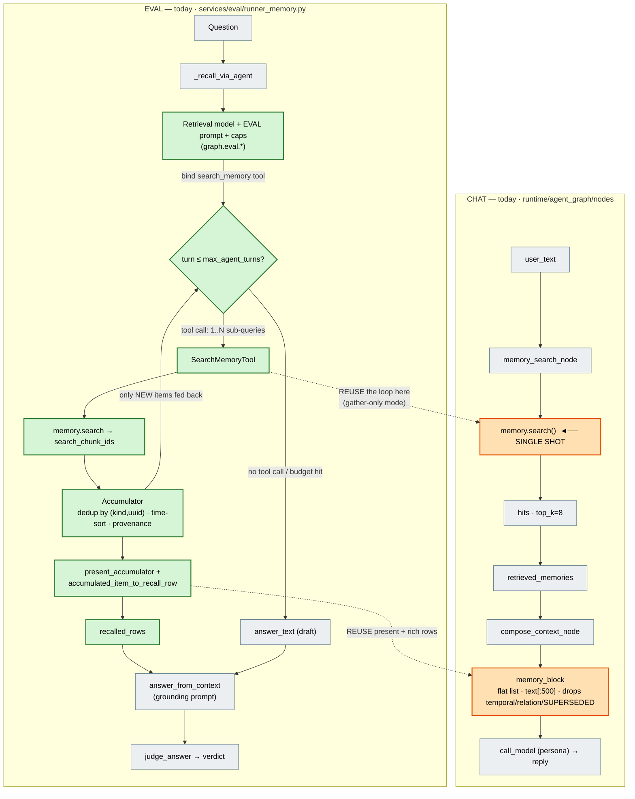
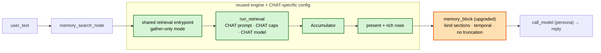

# Memory: Eval vs Chat — Parity Analysis & Gaps

> **Status:** Research note (no code changes). Goal: bring the live **chat** conversation-memory
> experience up to the quality the **memory-eval** track already reaches.
>
> **⚠️ Jun 2026 update:** the eval recall leg was rebuilt around an **agentic retrieval loop**
> (`services/memory/agent/`); chat was **not** changed. The *"Current reality"* section below
> reflects today's code (which **takes precedence over docs**). The original *"Key insight"*
> analysis further down **predates the loop and is now stale** — kept only for the
> output-formatting gaps it catalogs, which still apply.
>
> Related: [`memory-graphiti-replacement-design.md`](memory-graphiti-replacement-design.md),
> [`eval-corpus-tracks-design.md`](eval-corpus-tracks-design.md),
> [`agentic-memory-retrieval-implementation.md`](agentic-memory-retrieval-implementation.md).

## Current reality (Jun 2026) — supersedes the analysis below

**Eval** runs a full agentic retrieval loop (`run_retrieval`): the LLM decomposes the question
into parallel sub-queries, searches across several turns, accumulates a deduped/time-sorted fact
set, then drafts an answer that the answerer + judge consume. **Chat** still does **one**
`memory.search()` call and folds the raw hits into the persona prompt via a flat `memory_block`.

The loop engine is **already surface-neutral** — the only eval-bound parts are the *preferences
namespace* (`graph.eval.*`), the *call site* (`runner_memory.py`), and *what's consumed from the
result*. So adopting it in chat is **lift-and-share, not a rewrite**.

### Today: both flows, with reuse highlighted



**Legend** — 🟩 green = **reuse from eval** (the loop engine, untouched) · 🟧 orange = **chat
insertion points** (the two places that change) · ⬜ grey = unchanged.
The two dashed arrows are the whole job: swap chat's single `memory.search()` for the **loop**
(gather-only), and upgrade `memory_block` to render the **rich rows** `present_*` already produces.

### Target chat flow (after adoption)



**Reading the target:** the green blocks are the **same eval engine**; only the **config is
chat-specific** (its own prompt, caps, model — blue intent). Chat consumes the **accumulator**
(not the loop's draft answer) and lets the **persona** write the reply → "gather-only" skips the
loop's final synthesis turn. With caps at `turns=1, parallel=1`, this collapses back to today's
single-shot — so it ships safe and tunes up.

### What gets reused vs added

| Eval component | File | In chat? |
|---|---|---|
| `run_retrieval` loop | `services/memory/agent/retrieval_agent.py` | **Reuse** (add gather-only mode) |
| `SearchMemoryTool` | `services/memory/agent/search_tool.py` | **Reuse** as-is |
| `Accumulator` | `services/memory/agent/accumulator.py` | **Reuse** as-is |
| `present_accumulator` / `accumulated_item_to_recall_row` | `services/memory/agent/presentation.py` | **Reuse** as-is |
| Retrieval prompt | `graph.eval.retrieval_agent_prompts` | **New** chat-scoped prompt (tuned for user/characters) |
| Caps / model | `graph.eval.retrieval_agent`, `graph.eval.retrieval_model` | **New** chat-scoped instances |
| Shared entrypoint | _does not exist yet_ | **New** small `MemoryRetriever` seam |
| `memory_block` | `runtime/agent_graph/context_assembly.py` | **Upgrade** to rich rows |
| Answerer / judge | `services/eval/judge.py` | **Not used** — persona answers in chat |

---

## Key insight

> **⚠️ Stale (pre-agentic-loop).** The claim below that "both paths run the exact same recall
> engine" is **no longer true** — see *Current reality* above. The output-formatting gaps it
> documents (sections 3 / O1–O5) still hold and feed the `memory_block` upgrade.

Both paths run the **exact same recall engine**. `create_memory_service` (chat) and
`create_eval_memory_service` (eval) both build the same `GraphitiConversationMemory` over
`GraphitiMemoryService.from_preferences`, reading the same `graph.*` and `memory.search.*`
preferences. The eval was deliberately written to *reproduce* the runtime
(`services/memory/__init__.py:129-130` — *"Eval mirrors the runtime… so the Memory eval
reproduces what the agent will actually see at recall time"*).

So the quality gap is **not** in retrieval configuration. It is in two places: **the inputs
written to memory**, and **how recalled facts are formatted into the answer prompt**.

```
          INGEST                    RETRIEVE (identical)            ANSWER
EVAL   both speakers,            ┌────────────────────┐    format_recall_context →
       real reference_time   →   │ GraphitiMemory     │ →  Facts/Entities/Episodes
       clean turns               │ .search()          │    w/ temporal+rel+SUPERSEDED
                                 │ top_k=8, temporal, │    → grounding-only prompt
CHAT   user half only,           │ recipe, scope,     │    memory_block →
       arrival timestamp,    →   │ sim_min_score —    │ →  flat "- date·score·text[:500]"
       raw user_text query       │ SAME for both      │    → persona chat prompt
                                 └────────────────────┘
```

## 1. Configuration — essentially at parity ✅

| Knob | Eval | Chat | Same? |
|---|---|---|---|
| Recall depth `top_k` | 8 | 8 | ✅ |
| Temporal lens | `graph.temporal_default` | same | ✅ |
| Recipe / scope / k_hop | `graph.search_recipe/scope/k_hop` | same | ✅ |
| Candidate floor `sim_min_score` | 0.3 | 0.3 | ✅ |
| Extraction / small / embedder model | shared `graph.*` | same | ✅ |
| Group isolation | `eval_mem_{set}` | `mem_{user}_{char}` | ✅ (isolation only) |

There is **no retrieval-config gap to close**. The engine the eval validated is the engine
chat uses. (Note: the "eval recalls 20 vs chat 8" intuition is **false** — both read
`memory.search.top_k`, default 8: runtime at `services/memory/__init__.py:71`, eval at
`services/memory/__init__.py:128`.)

## 2. Inputs — ingestion (corrected Jun 2026 after design review)

> **Framing correction.** Earlier notes treated eval as a *mirror* of chat ("eval reproduces
> what the agent sees"). That is **not** the working relationship: **eval is a testbench** — a
> harness to test ingestion/retrieval configurations *before* applying the winners to chat. Eval
> and chat are *allowed* to diverge (the corpus is deliberately two-sided because the benchmarks
> need both speakers as gold turns). The goal is not to make chat identical to eval — it is to
> use eval to find the best chat ingestion, then ship it to chat.

**The ingest engine is fully shared and identical** (confirmed in code): both surfaces build
through `GraphitiMemoryService.from_preferences` and call the same `ingest_episodes`. Shared and
identical across chat & eval:

- Extraction model, embedder, `custom_extraction_instructions`, temporal default — all `graph.*`.
- Observability tier (`graph.observability`: off/ledger/trace) + the per-episode / per-operation
  ledger rows and the trace sidecar (chat folds these under the turn's `memory_out`; eval folds
  them under a dedicated remember run — same machinery, different run topology).
- No document chunking: **1 turn = 1 episode = 1 point_id**.

The only intentional divergence today is the **drawer** (`group_override` → `eval_mem_{set}`). So
every difference below is about **what episodes the caller feeds the engine**, not the engine.

### I1 — the assistant side (the one real gap) → **decided: approach 4A**

| | Eval | Chat (today) |
|---|---|---|
| What's written | Full dialogue: **both speakers**, each turn its own stored episode (corpus fixture) | **User turn only**; assistant reply never written (F7 write-gate / decision D2 anti-echo) |

`F7` is the write-gate mechanism (`ALLOWED_SOURCE_ROLES` in `graphiti_ingest.py`); `D2` is the
policy it enforces — *user-half only, never the assistant reply, so the graph can't become a
stale echo of its own output* (mem0 #4573). Because only user turns are ever stored, graphiti's
internally-injected extraction context is **user-only**, so an anaphoric user turn ("yes, the
second one") has **no antecedent to resolve against**.

**Decided approach — windowed batch ingestion (chat's default; no per-surface pref).** Chat stops
writing one user turn per episode. Instead it **accumulates N exchanges** (both speakers) and
ingests them **once** as a single timestamped, two-speaker episode — agent lines as *context*,
**user-only extraction**. This restores the coreference signal eval gets from a two-sided corpus
while keeping D2's anti-echo intent (agent facts are never recorded).

> A naïve "fold the prior assistant reply into every user turn" is **rejected** — it re-ingests
> overlapping content every turn (duplicate episodes). The correct mechanism is a
> **watermark-advanced, non-overlapping window**; see **[Ingestion — implementation design](#ingestion--implementation-design-windowed-batch)** below for the full algorithm, flush triggers, temporal model, prefs and touch points.

**Eval stays two-sided and per-line** (unchanged): its benchmarks require the assistant turns as
gold episodes. Eval is the testbench; it does **not** adopt the chat windowing.

### I2 — timestamps → at parity (no action)

Chat already passes the real turn time (`routing.timestamp`) as `reference_time`; in-turn dated
facts get their own `valid_at` from extraction. The only eval-only trait is *backdating* a
simulated months-long history, which live chat can't and shouldn't reproduce.

### I3 — turn cleanliness → **not a gap** (handled by extraction prompts)

Noisy / multi-topic / greeting turns are absorbed by graphiti's extraction prompt (+
`custom_extraction_instructions`) → "no facts." Dropped from the gap list.

### I4 — query quality → retrieval, not ingestion

Memory query-rewrite is a *recall* concern, tracked with retrieval — not an ingestion input.

### New — chunk guard for chat (oversized turns/windows)

Memory turns aren't chunked (the corpus loader keeps eval bodies under `CHUNK_MIN_TOKENS`), but a
**large chat body is unguarded** and could trip graphiti's internal `should_chunk`, breaking the
pre-seeded `uuid == point_id` invariant (`graphiti_ingest.py:508`). Windowing makes this sharper
(a window is bigger than one turn). Folded into the design below: a **turn-granular guard** that
*shrinks the window* rather than truncating text — see the [design section](#ingestion--implementation-design-windowed-batch).

### Rollout / params

Keep ingestion params **shared today**; add **eval-specific overrides later** (factory seam or a
`graph.eval.ingest.*` namespace) when we want eval to A/B configs independently of chat.

---

## Ingestion — implementation design (windowed batch)

> **Status:** design agreed (this session), no code yet. This is the concrete plan for the I1
> assistant-side gap + the chunk guard. Chat-only; **eval ingestion is untouched**.

### Essence

A conversation is a stream of **exchanges** — `U1 A1 U2 A2 U3 A3 …`. Chat ingestion changes from
"one user turn → one episode" to: **accumulate N exchanges, then ingest that window once** as a
single two-speaker, timestamped episode — non-overlapping, watermark-advanced, so **no exchange is
ever ingested twice**. `memory_search` (recall) stays **per-turn**; only extraction/storage
(`memory_out`) batches. The graph grows every N turns, not every turn.

### Turn structure — chat vs eval (different units)

| | Eval corpus turn | Chat turn (at `memory_out`) |
|---|---|---|
| Unit | one **utterance** (pre-segmented corpus line) | one **exchange** = user msg **+** this character's reply |
| Fields | `{id, timestamp, speaker, body}` | `user_text`+`inbound_id`+`routing.timestamp`; `reply_text`+`reply_id`; `character_id`; `thread_id`; `channel_id` |
| Speakers on hand | one per line | **both at once** (user + this character) |
| Episode mapping | 1 line → 1 episode (**unchanged**) | **N exchanges → 1 windowed episode (2N speaker lines)** |

### Identities (existing settings — no new naming knobs)

- **User speaker label** = `memory.user_name` (`models.py:180`, the A1 anchor; falls back to `User`).
- **Agent speaker label** = the **character's `name`** (`characters` table, `character.py:76`),
  resolved by `state["character_id"]`. Each `(user, character)` memory group already isolates one
  character, so its name is the agent label for that group.

### Window body

A timestamped two-speaker transcript (agent lines are **context**; extraction is **user-only**):

```
[2026-07-01 09:00] {user_name}: U1
[2026-07-01 09:00] {Character.name}: A1
[2026-07-01 09:12] {user_name}: U2
[2026-07-01 09:12] {Character.name}: A2
…                                        (up to N exchanges)
```

- Passed to the facade pre-assembled with `speaker=""`, so `_episode_body` emits it verbatim
  (`graphiti_ingest.py` unchanged). The user's `{user_name}:` prefix preserves A1 anchoring.
- `custom_extraction_instructions` (per-call override, see touch points) instructs the extractor
  to record facts **only from the user** (incl. the user's confirmations), treating agent lines
  as disambiguation context — never recording agent-only assertions (D2 intact).

### The batching process — per-conversation watermark

State is a single **N-independent** cursor per conversation; windows are reconstructed from
**durable history** (not the `chat.max_messages`-trimmed `state["messages"]`):

```
on memory_out(turn):
  gap = now − last_pending_turn_time
  if pending and gap > session_gap:          # trigger 3 (session boundary) — flush BEFORE adding
      flush(pending)                          # its own episode, real turn times
  append current turn to pending
  while len(pending) ≥ N:                     # trigger 1 (count) — loop-flush drains any backlog
      flush(window ≤ N)                        # trigger 2 (size) applied inside flush
```

- **No duplication** — the watermark only moves forward over contiguous windows.
- **Skipping is safe** — turns below the threshold aren't lost; they live in persisted history and
  join the next window.
- **Watermark key = the conversation** (`thread_id`/`chat_channel_id`); the episode still writes to
  `mem_{user}_{character}`. Interleaving two threads into one episode would be nonsense, so batching
  is per-conversation. Cursor row lives in `data.db` (`conversation_id → last_ingested_message_id,
  last_activity_ts`).

### Flush triggers (three)

1. **Count** — pending reaches `window_turns` (N).
2. **Size** — the turn-granular **chunk guard** (below).
3. **Session-gap** — the next turn is further than `session_gap_minutes` from the last pending
   turn → close the prior burst as a session, start fresh. Runs **before** the current turn is
   appended (the new turn belongs to the new session).

### Chunk guard (turn-granular — shrink, don't truncate)

Assemble the window; if `estimate_tokens(body) ≥ chunk_min_tokens`:

- **> 1 turn:** drop turns until it fits → ingest fewer turns; the rest stay pending (watermark
  advances only by what was ingested). **N is a max, not a fixed count.**
- **exactly 1 turn, still too big:** the only case where we **trim that turn's text + `⚠️` warn**
  (unavoidable to preserve `uuid == point_id`).

### Temporal model

Two distinct signals, deliberately not conflated:

- **`reference_time` (hard, graphiti's engine)** = the window's **last turn** time. Drives each
  fact's default `valid_at` and cross-episode supersession ordering (a later window's facts can
  invalidate an earlier window's; `invalid_at` ≈ the newer window's time). Cross-window ordering is
  monotonic; **intra-window** ordering by `reference_time` is lost (all facts share one time).
- **Per-line body timestamps (soft, for the extractor)** *recover* that intra-window resolution —
  explicit ordered times the extraction LLM can attach as `valid_at` — plus time-of-day context.
- **The session-gap lock tightens the window's time span**, so the single `reference_time` is
  genuinely representative (fewer facts bunched at a misleading time). Gap-lock + body timestamps
  are complementary temporal mitigations.
- **Empirical check at impl time** (not a design branch): confirm graphiti promotes body
  timestamps into `valid_at` and does **not** extract the `[…]` prefix as a spurious entity. If it
  ignores them, windowing carries a real `valid_at`-resolution cost → weigh smaller N vs. coarser
  temporal.

### Idle flush (backstop)

`memory_out` can't self-trigger on silence, so a session the user never returns to needs an
**out-of-band** flush: a background **sweep** flushes conversations idle longer than
`idle_flush_hours`, ingesting the partial window with **real turn timestamps** (not flush time) and
advancing the watermark. The sweep **check interval is internal (hourly)** — not a pref — narrow
enough that the 12h backstop actually means ~12h. Division of labor: `session_gap` (reactive) does
the real grouping on the user's *return*; `idle_flush` only rescues *abandoned* sessions.

### Changing N mid-conversation is safe

The watermark stores a **position, never N**; N is read fresh each `memory_out`. Raising N just
defers the next boundary; lowering N flushes a smaller window on the next turn; **loop-flush**
drains any backlog (from an N-decrease, an idle-flush, or a chunk-shrink) into successive
non-overlapping episodes. Nothing already committed shifts.

### Preferences (all under `MemoryExtractionPreferences`, `models.py:154`)

| Pref | Default | Role |
|---|---|---|
| `window_turns` (N) | TBD | count cap — exchanges per window (`1` = every turn) |
| `chunk_min_tokens` | graphiti's `CHUNK_MIN_TOKENS` | size cap / guard threshold |
| `session_gap_minutes` | ~120 | reactive session boundary (tunable — episode granularity vs coherence) |
| `idle_flush_hours` | 12 | background backstop for abandoned sessions |

Sweep check interval: **internal, hourly** (no pref). Full pref round-trip per CLAUDE.md (backend
model → `gen:prefs-types` → Memory/extraction UI card → schema-driven save → `npm run check` +
prefs tests → **server restart**). UI card placement to be confirmed with the user (don't guess).

### Touch points

| # | File | Change |
|---|---|---|
| 1 | `domain/preferences/models.py` (`MemoryExtractionPreferences`) | add `window_turns`, `chunk_min_tokens`, `session_gap_minutes`, `idle_flush_hours`. |
| 2 | `data.db` layer | durable per-conversation ingest cursor: read / advance / query-stale (for the sweep). |
| 3 | `runtime/agent_graph/nodes/memory.py` (`_store_turn_memory`) | batching controller: gap/count/size flush logic, reconstruct window from durable history, resolve `Character.name` + `memory.user_name`, build the timestamped transcript. |
| 4 | background sweep (runtime) | hourly pass flushing conversations idle > `idle_flush_hours`. |
| 5 | `services/memory/graphiti_conversation.py` (`add`/`__init__`) | accept a pre-assembled window body (`speaker=""`), apply the turn-granular chunk guard, pass the user-only `custom_extraction_instructions` override; anchor episode uuid = window's last user message id. |
| 6 | `services/knowledge/graph/graphiti_service.py` (`ingest_chunks`) | new optional `custom_extraction_instructions` pass-through (append memory clause to shared nudge). |
| 7 | `services/memory/__init__.py` (factories) | chat facade = windowed/user-only config; eval facade unchanged (per-line, two-sided). |

`graphiti_ingest.py` / `ingest_episodes` stay **unchanged**.

### Decided design choices (were open)

- **Watermark store:** per-conversation cursor in `data.db` (episode still lands in the
  `(user, character)` group).
- **Episode uuid:** keep it (it *is* the point_id); anchor to the window's **last user message id**
  — no synthetic window id (it would only coarsen citation to the closing turn for zero gain).
- **`reference_time`:** window's **last turn** (monotonic cross-window supersession).
- **Extraction scope:** user-only (agent = context); D2 preserved.
- **Flush drain:** loop-flush is standard. **Sweep** (not per-conversation timers) for idle.

### Not in scope

Eval ingestion (per-line, two-sided); eval-specific ingest overrides (deferred — params shared
today); all retrieval / `memory_block` / answer-prompt work (Section 3 + retrieval track).

## 3. Outputs — the biggest controllable lever

The same `hits` (same metadata keys) flow to both renderers, but they render very differently:

| # | Eval `format_recall_context` (`eval_judge.py:110-137`) | Chat `memory_block` (`context_assembly.py:157-176`) |
|---|---|---|
| **O1** | Keeps **relationship**, **temporal validity** (`valid X → present`), and **`SUPERSEDED`** markers per fact | **Drops all of it.** Renders only `- {date} · score {s} · {text[:500]}` |
| **O2** | Groups into **Facts / Entities / Episodes** sections with headings | **Flattens** all kinds into one bullet list — a raw episode body looks identical to an extracted fact |
| **O3** | **No truncation** | Truncates each memory to **500 chars** |
| **O4** | Shows the fact's **`valid_at`** validity window | Reads **`created_at`** (ingest time), which fact rows generally don't carry → date often **blank/missing** |
| **O5** | System prompt = strict grounding-only `DEFAULT_MEMORY_EVAL_ANSWER_PROMPT` ("use ONLY the facts… answer every part the facts support"); answer model = knowledge-answering tuning (temp **0.2**) | Memory is one advisory block inside the **persona** prompt + `chat.instructions`; chat model is `balanced_chat` (temp **0.7**) with a tool loop. The grounding/completeness discipline is **never instructed**. |

**O1 is the headline:** the eval answer model reaches its quality partly because it *sees*
`valid → present` and `SUPERSEDED` annotations and can choose the current fact. Chat strips
those before the model ever sees them.

## How to close the gap (proposed, by leverage-to-effort)

1. **Bring `memory_block` to parity with `format_recall_context`** (O1–O4). The metadata is
   already on the `hits` — chat just discards it. Render kind sections, keep relationship +
   `valid_at → invalid_at` + `SUPERSEDED`, use `valid_at` for the date, don't truncate facts.
   *Highest leverage, lowest risk — pure formatting on data already in hand.*
2. **Instruct grounding/completeness in the chat answer** (O5). Adapt the eval's "answer every
   part the facts support" discipline into the persona context so memory is actually used.
3. **Add a memory query-rewrite** (I4) mirroring `knowledge.rewrite.*`, so chat searches memory
   with a standalone question instead of raw anaphoric `user_text`.
4. **Assistant-as-context ingestion (I1) — decided (4A).** Make chat fold the prior assistant
   turn (N−1) into the user episode body as context, with `custom_extraction_instructions`
   restricting extraction to the user. Chat's **default** behavior, no pref; the assistant turn
   is never stored as its own episode (keeps D2's anti-echo intent). **Eval stays two-sided.**
5. **Chunk guard for chat (new).** Guard chat turns against `CHUNK_MIN_TOKENS` and expose it as a
   chat/memory pref, so an oversized turn can't trip graphiti's internal split and break
   `uuid == point_id`.
6. **Timestamp fidelity** (I2) — none; already at parity. Cleanliness (I3) — none; extraction
   prompts handle it.

## TL;DR

- **No config gap.** Eval and chat share one recall engine and the same knobs
  (`top_k=8`, temporal, recipe, scope, `sim_min_score`, models).
- **The gap is in inputs and output-formatting, not retrieval.**
- **Output (biggest lever):** chat's `memory_block` strips temporal/relationship/`SUPERSEDED`
  metadata, flattens kinds, truncates to 500 chars, and shows the wrong date — all of which
  eval's `format_recall_context` keeps. The data is already on the hits.
- **Ingestion:** the engine, observability, tracking and params are shared/identical — the only
  gap is the **assistant side** (chat writes user-only). **Decided fix: 4A** — fold the prior
  assistant turn as context with user-only extraction, as chat's default; **eval stays two-sided**
  (it is a testbench, *not* a mirror). Add a **chunk guard** for oversized chat turns. Timestamps
  already at parity; cleanliness handled by extraction prompts; query-rewrite is a retrieval item.
- **Answer discipline:** eval uses a grounding-only prompt at temp 0.2; chat folds memory into
  a persona prompt at temp 0.7 with no completeness instruction.
- **Recommended order:** (1) `memory_block`↔`format_recall_context` parity, (2) grounding
  instruction, (3) memory query-rewrite, (4) 4A assistant-as-context ingestion + chunk guard.
