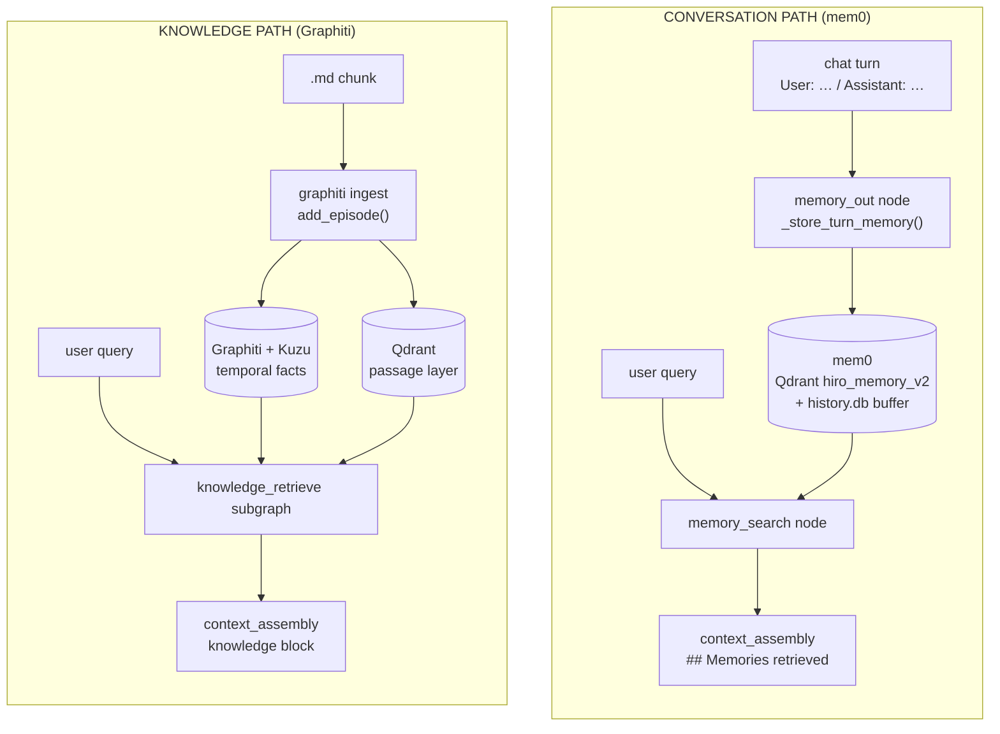
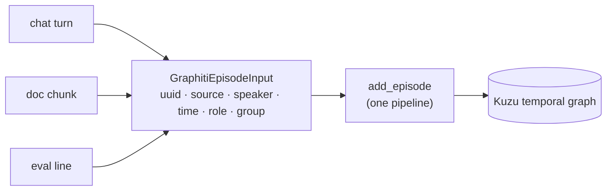
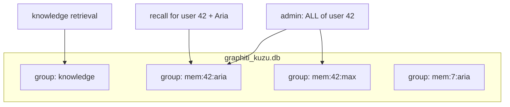
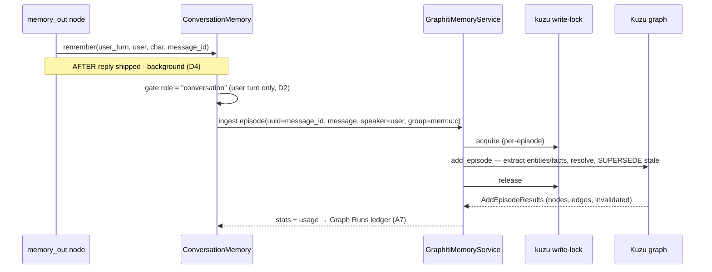
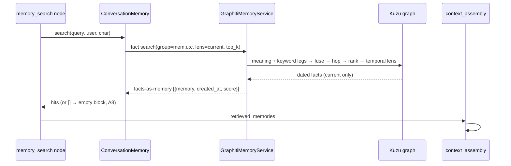
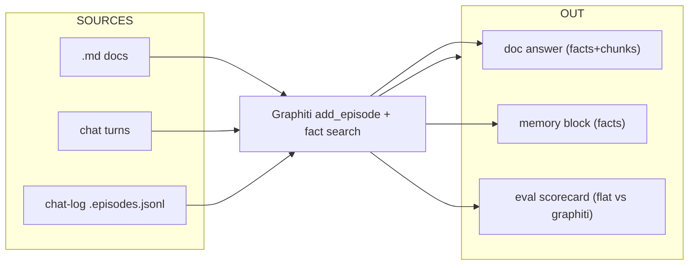

# Memory → Graphiti Replacement — High-Level Design

> **Tracker doc (single source).** High-level design for replacing **mem0**
> (conversation long-term memory) with **Graphiti + Kuzu** — the same temporal
> graph brain that already powers knowledge/document retrieval. One engine,
> partitioned by `group_id`, serving **chat memory**, **document knowledge**, and
> **evaluation** from a single store.
>
> **Companions:** [`knowledge-graphiti-pivot-design.md`](knowledge-graphiti-pivot-design.md)
> (the docs/knowledge pivot this builds on — north star §1.1 already names Graphiti
> the mem0 replacement), and the MDX architecture pages
> [Graphiti Ingestion](../../hiro-docs/mintdocs/architecture/memory-knowledge/graphiti-ingestion.mdx) /
> [Graphiti Retrieval](../../hiro-docs/mintdocs/architecture/memory-knowledge/graphiti-retrieval.mdx).
>
> **Mode:** initial development — **no backward compatibility / no migration / no
> wrappers** (repo rule). Consequently **mem0 is ripped out on day zero** (decision
> D7) — not kept disabled. There is no parallel-run period.
>
> **Status:** design only — nothing implemented.

---

## 1. The one-paragraph version

Today HiroLeague has **two memory brains**: mem0 distills *conversation* turns into
flat "memory statements" in its own Qdrant collection, while Graphiti builds a
*temporal knowledge graph* from *document* chunks in Kuzu. Graphiti's **facts** are
a strict superset of mem0's memories — they are deduplicated, **temporal**
(`valid_at`/`invalid_at`), typed, relational, and citable. This design **collapses
the two into one**: conversation turns become Graphiti **episodes** in the *same*
Kuzu store as documents, isolated by a per-`(user, character)` **`group_id`**. The
chat graph's existing `memory_search` / `memory_out` nodes keep their shape — only
the service behind the `MemoryService` interface changes from mem0 to Graphiti.

---

## 2. Where we are today — two brains



**Two stores, two extraction pipelines, two embedders, two sets of preferences.**
mem0 also drags along machinery that exists *only* to paper over its quirks
(the `history.db` last-k buffer, a content-block `.strip()` workaround, a ContextVar
token-capture hack, a channel-clear buffer wipe).

---

## 3. Where we're going — one brain, partitioned


The store is **one Kuzu DB**; `group_id` is the partition. Knowledge stays in its
own group (decision: knowledge separate, A1). Conversation memory gets one group per
`(user, character)`. Qdrant remains the **document** passage layer only — conversation
memory surfaces **facts directly** (no conversation passage layer in Phase 1, D3).

---

## 4. Decisions & assumptions

### 4.1 Open decisions (resolved)

| # | Decision | Resolution | Why |
|---|---|---|---|
| **D1** | Scoping / partition | **`group_id` per `(user, character)`** | Drop-in match for mem0's `user_id`+`agent_id`; filter-by-character = one group, cross-character = multi-group read. Loses only cross-character fact *merging*, which mem0 never did. |
| **D2** | What gets written (anti-echo #4573) | **User turns only** | Preserves Graphiti's by-construction anti-echo; the assistant reply is derivable and storing it risks a self-echo. |
| **D3** | Retrieval output shape | **Facts-as-memory** (Phase 1) | Closest to mem0; zero new infra; `memory_block` already renders text+date. Turns-as-chunks (Qdrant) deferred. |
| **D4** | Ingest timing / cost | **Background, after reply** | `add_episode` is multi-LLM-call (heavier than mem0); don't block turn-finalize. Gated by `extraction.enabled`. |
| **D5** | Episode identity (provenance) | **Stable message id** from the persistence layer | Episode `uuid = message_id` → free provenance back to the stored turn (mirrors doc G6, episode == citable unit). |
| **D6** | Models for extraction | **Reuse the Graphiti tiers** (extraction / small / shared embedder) | Same engine, same store; one embedder is mandatory anyway (A2). |
| **D7** | mem0 cutover | **Rip out on day zero** | Repo no-backward-compat rule; no parallel run. A memory eval (§10) proves quality *after* on Graphiti, not by A/B with mem0. |
| **D8** | Temporal lens default | **`current`** (overridable per query) | "Where does the user live *now*" dominates memory; superseded facts shouldn't eat the budget. |

### 4.2 Working assumptions

| # | Assumption | Rationale |
|---|---|---|
| **A1** | **One Kuzu store, separate `group_id`s** — memory episodes share `graphiti_kuzu.db` with knowledge; "knowledge separate" = separate **group**, not separate **DB**. | One brain; group_id is the isolation primitive. |
| **A2** | **Single embedder** across the whole Graphiti store. | Vectors must be consistent within one store (doc G8). |
| **A3** | Conversation ingests as `EpisodeType.message` with `speaker`. | Already supported in `GraphitiEpisodeInput`; graph knows *who* said what. |
| **A4** | **Reuse the entity ontology** (Person/Place/Org/Event/Object); edge types free-form for now. | Same human-knowledge domain. |
| **A5** | **New source role `conversation`** in `ALLOWED_SOURCE_ROLES`, gated to user turns (D2). | F7 currently rejects everything but `user_document`. |
| **A6** | **A clean `ConversationMemory` service** implementing the `MemoryService` Protocol, backed by `GraphitiMemoryService`. Done properly (not a thin shim), but keeping the chat-graph contract so blast radius stays small. | User call: clean design, minimal blast. |
| **A7** | Memory writes/reads are observable in **Graph Runs** (reuse the ingest/search ledger). | Replaces mem0's bespoke usage hack. |
| **A8** | **Graceful degradation** — empty/missing memory graph → empty memory block, never an error. | Matches today's fail-open `memory_search_node` and knowledge soft-fallback. |
| **A9** | Admin route + `memory_list`/`memory_clear` tools re-point to group-scoped Graphiti primitives. | Same shapes, low risk. |
| **A10** | **mem0-only machinery dies with mem0**: `history.db` last-k buffer (→ Graphiti `previous_episodes`), content-block `.strip()` workaround, ContextVar token-capture hack (→ ledger), channel-clear buffer wipe. | These exist only to work around mem0. |
| **A11** | Per-turn extraction cost accepted; gated by `extraction.enabled`, run in background (D4). A sampling/cap knob is a possible later addition. | Graphiti is heavier per turn than mem0. |
| **A12** | Write-lock contention (a big doc ingest vs live memory writes) is handled by the **existing per-workspace `kuzu_registry` write lock** (held per-episode, released between). | Already designed for this. |

---

## 5. The unifying idea — one episode abstraction

Everything Graphiti ingests is an **episode**. Chat turns, document chunks, and eval
lines are just three sources of the same shape:

| Source | `uuid` (identity) | `source` | `speaker` | `reference_time` | `source_role` (gate) | `group_id` |
|---|---|---|---|---|---|---|
| **Chat turn** | message id | `message` | user | now | `conversation` | `mem:{user}:{char}` |
| **Doc chunk** | Qdrant point_id | `text` | — | doc/ingest time | `user_document` | knowledge (default) |
| **Eval line** | line `id` | `message`/`text` | optional | line `timestamp` | `user_document`* | `eval:{set}` |

\* eval already runs through the document gate today; a chat-trajectory eval would use
the `conversation` role (§10).

Because all three are episodes, **the same `add_episode` ingestion** (extract →
resolve → supersede → persist) and the **same fact search** (meaning + keyword →
fuse → hop → rank → temporal lens) serve all three. The only differences are the
**identity**, the **gate role**, and the **group**.



---

## 6. Connection points — where Graphiti drops in

The chat graph keeps its shape. We swap the **implementation** behind the
`MemoryService` Protocol and add a group-aware path on `GraphitiMemoryService`.

```mermaid
flowchart TB
    subgraph GRAPH["chat agent graph (unchanged topology)"]
        trim["trim_history"] --> fan{{"knowledge_fanout"}}
        fan --> msearch["memory_search_node ★"]
        fan --> kret["knowledge_retrieve"]
        msearch --> cbuild["context_build"]
        kret --> cbuild
        cbuild --> call["call_model"]
        call --> mout["memory_out · _store_turn_memory ★"]
    end

    msearch -- "recall(query,user,char)" --> CM["ConversationMemory<br/>(MemoryService impl) ★"]
    mout -- "remember(user_turn,user,char)" --> CM
    CM --> GSVC["GraphitiMemoryService<br/>group-aware ★"]
    GSVC --> KUZU[("graphiti_kuzu.db")]

    style msearch fill:#1d4ed8,color:#fff
    style mout fill:#1d4ed8,color:#fff
    style CM fill:#047857,color:#fff
    style GSVC fill:#047857,color:#fff
```

★ = the only touch points. Green = new/changed; blue = existing nodes that keep their
signatures.

### 6.1 Read path
`memory_search_node` (`runtime/agent_graph/base.py`) calls
`MemoryService.search(query, user_id, character_id)` exactly as today. The Graphiti
impl runs a **fact search** scoped to `group_id = mem:{user}:{char}`, temporal lens
`current`, and returns **facts-as-memory** dicts (`{"memory": dated_fact, "created_at":
valid_at, "score": …}`) — the shape `context_assembly.memory_block` already renders.

### 6.2 Write path
`_store_turn_memory` calls `MemoryService.add(...)`. The Graphiti impl ingests **only
the user turn** as a `message` episode (`speaker=user`, `uuid=message_id`,
`source_role="conversation"`), in the **background** after the reply ships (D4),
under the existing write lock.

### 6.3 Render
`context_assembly.memory_block` — **no change** (already renders `## Memories
retrieved` from `{memory, created_at, score}` dicts).

### 6.4 Surfaces
Admin route (`admin_svelte/routes/memory.py`) and agent tools (`tools/memory.py`:
`memory_list`, `memory_clear`) re-point onto the group-scoped Graphiti primitives
(`remove_episode`, `get_by_group_ids`). Same request/response shapes.

### 6.5 What gets ripped (day-zero, D7)

| mem0 component | Fate |
|---|---|
| `services/memory/service.py` (`Mem0MemoryService`) | **Replaced** by `GraphitiConversationMemory`. |
| `services/memory/usage_capture.py` (ContextVar + `.strip()` hack) | **Deleted** (ledger handles usage; adapter handles content blocks). |
| `services/memory/audit_log.py` | Folded into Graph Runs ledger or simplified. |
| `domain/memory.py` `mem0_history_db_path` / `mem0_session_scope` | **Deleted** (no `history.db`). |
| `MemoryService` Protocol (`domain/memory.py`) | **Kept** — Graphiti impl conforms. |
| `conversation_channel.py::_delete_mem0_session_messages` | **Deleted** (no buffer to wipe). |
| mem0 Qdrant collection `hiro_memory_v2` + `history.db` | **Orphaned/removed** (no migration — repo rule). |
| `mem0ai` / qdrant memory deps | Removed from `pyproject.toml`. |

---

## 7. Scoping model (the `group_id` partition)



- **Dedup / supersession happens *inside* a group.** Each `(user, character)` has its
  own independent memory and its own "latest wins" timeline — exactly mem0's behaviour.
- **Filter by character** → query the single group `mem:{user}:{char}`.
- **All of a user's memory across characters** → `get_by_group_ids([mem:{user}:*])`
  (enumerate the user's character groups; reads accept a list).
- **Trade-off (accepted):** a fact the user states to two characters is **not merged**
  across them — each character knows its own version. mem0 never merged across
  `agent_id` either, so this is parity, not regression.

> **Design detail to settle in implementation:** how to enumerate a user's groups for
> the cross-character read — a `DISTINCT group_id LIKE 'mem:{user}:%'` Kuzu query vs a
> tiny group registry. Either works; the query avoids extra bookkeeping.

---

## 8. Chat ingestion flow (write)



A new memory contradicting an old one (*"now lives in Tokyo"*) **supersedes** the
prior fact in the same group — mem0's UPDATE/DELETE, but temporal and reversible
(history retained, retrievable via the `all` lens).

---

## 9. Chat retrieval flow (read)



No `chunk_ids` step (facts-as-memory, D3) — the conversation graph has no Qdrant
passage layer in Phase 1. Soft-fallback: an empty/missing graph yields an empty
memory block, never an error.

---

## 10. How one engine serves chat, docs, and eval

| Vertical | Ingest source | Group | Retrieval | Status after this design |
|---|---|---|---|---|
| **Docs (knowledge)** | `.md` chunks → episodes (`text`) | knowledge | facts → **Qdrant chunk_ids** → fused answer | **Unchanged** (already Graphiti). |
| **Chat (memory)** | user turns → episodes (`message`) | `mem:{u}:{c}` | facts-as-memory | **New path** (this doc). |
| **Eval** | `*.episodes.jsonl` series (dated, speaker-aware) | `eval:{set}` | flat vs graphiti legs, category breakdown (direct / multi-hop / **temporal** / abstention) | **Extended**: the existing series-ingest format *is* the chat-log format, so a **conversation-memory eval** is the same harness fed a chat transcript with a `conversation` gate role. |

The eval harness already parses `{id, timestamp, speaker?, body}` lines and ingests
them as a **dated episode series** — explicitly documented as reusable for
"upload a journal / chat-log file." So evaluating memory quality (does the graph
recall the right fact, does supersession pick the latest, does it abstain when it
shouldn't know) reuses the same legs and scoring that prove knowledge retrieval —
no new eval engine.



---

## 11. Preferences (reshape, not regrow)

`MemoryPreferences` stays the public surface but its internals re-point to the
Graphiti engine. Likely shape:

- `enabled` — master switch (unchanged).
- `search { enabled, top_k, threshold/sim floor, temporal_lens, recipe, rerank }` —
  retrieval knobs, mirroring the knowledge graph's retrieval prefs.
- `extraction { enabled }` — write toggle (unchanged meaning: read-only when off).
- **Models** — reuse the Graphiti extraction/small/embedder tiers (D6) rather than
  a separate `memory.default_llm` / `default_embedding_model`. (Decision to confirm at
  design-detail time: a memory-specific model override, or strict reuse.)
- **Removed:** mem0 reranker block (`sentence_transformer`-only) → the knowledge
  cross-encoder recipe covers it.

Every knob remains an admin-UI preference (repo convention; no hardcoded params).

---

## 12. Risks & mitigations

| Risk | Mitigation |
|---|---|
| Per-turn extraction cost (Graphiti > mem0). | Background ingest (D4); `extraction.enabled` gate; optional sampling/cap later (A11). |
| Write contention: doc ingest vs live memory writes. | Existing `kuzu_registry` per-workspace write lock, held per-episode (A12). |
| Cross-character read needs group enumeration. | `DISTINCT group_id LIKE 'mem:{user}:%'` query (§7). |
| No verbatim turn citation in Phase 1 (facts-as-memory). | Acceptable for memory; turns-as-chunks (Qdrant) is a clean later add (D3). |
| Day-zero rip leaves orphaned mem0 store. | Expected under no-migration rule; cleanup noted in cutover. |

---

## 13. Phased plan (high level)

1. **Group-aware `GraphitiMemoryService`** — accept `group_id` on ingest/search; add a
   `conversation` source role to the F7 gate (user turns only).
2. **`GraphitiConversationMemory`** implementing the `MemoryService` Protocol
   (remember / recall / list / clear / forget), facts-as-memory output, group per
   `(user, character)`.
3. **Re-point `create_memory_service`** to build the Graphiti impl from prefs;
   chat-graph nodes unchanged.
4. **Re-point surfaces** — admin route + `memory_list`/`memory_clear` tools.
5. **Rip mem0** — delete `Mem0MemoryService`, usage hack, `history.db` helpers,
   channel-clear wipe; drop deps.
6. **Memory eval** — feed chat-trajectory `*.episodes.jsonl`; score recall /
   supersession / abstention on the existing legs.
7. **Docs** — author the mintdocs *Conversation Memory* page; update the memory
   architecture index.

---

## 14. Cutover (day-zero rip — D7)

Per the no-backward-compatibility rule (explicitly abided): mem0 code, its Qdrant
collection `hiro_memory_v2`, and `history.db` are **removed, not migrated**. Existing
mem0 memories do **not** carry over — the graph rebuilds from new conversations.
Operators get a clear "memory store reset" note in release steps.

---

> **Next:** confirm this high-level shape, then we drill into the detailed design
> (service interfaces, preference schema, ledger rows, eval dataset format).
