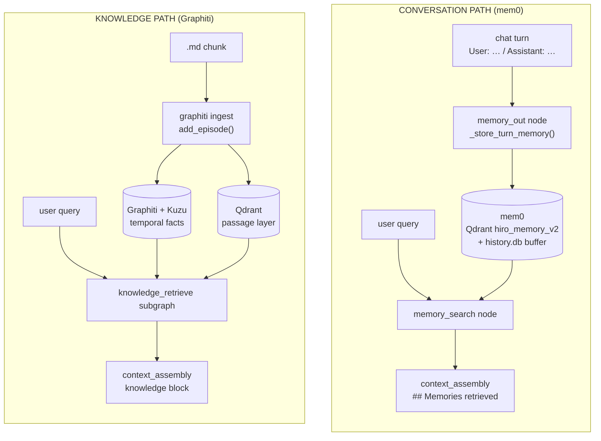
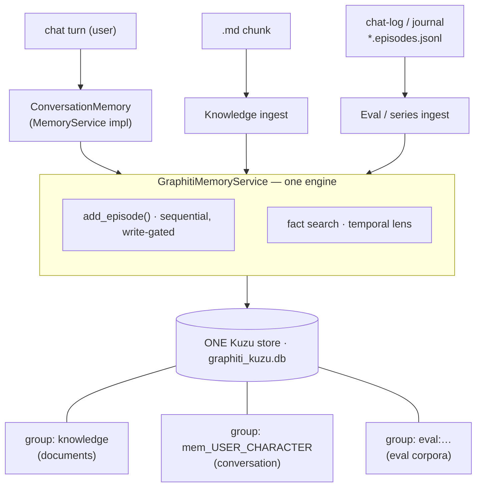
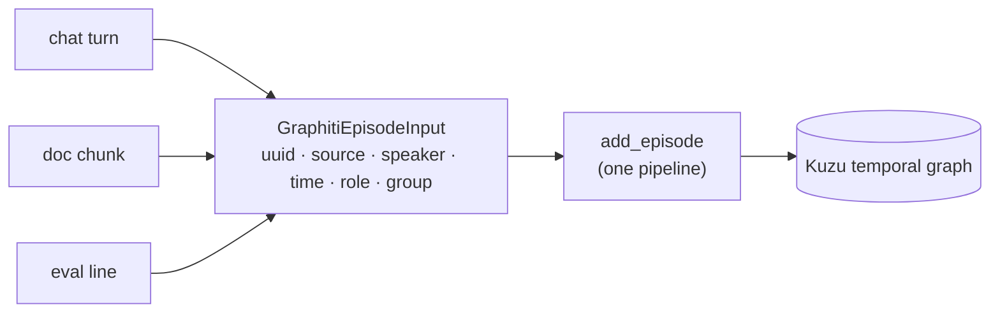
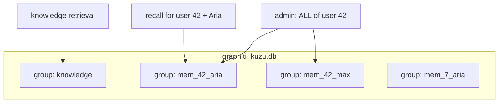
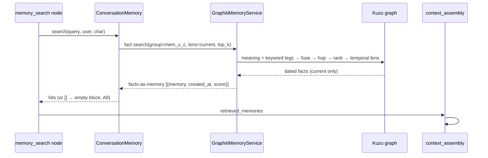
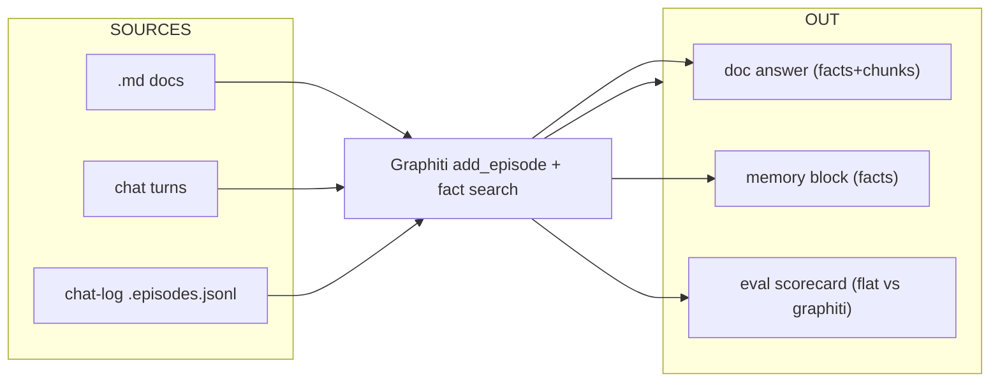
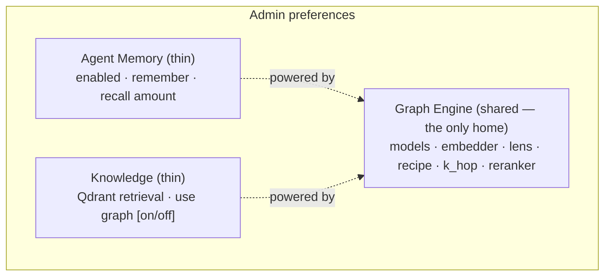
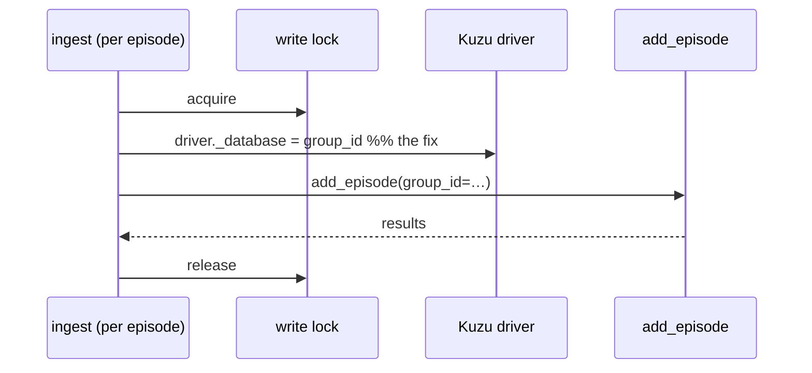
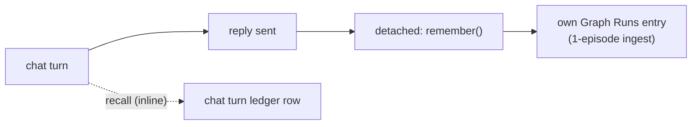

# Memory → Graphiti Replacement — High-Level Design

> **Tracker doc (single source).** High-level design for replacing **mem0**
> (conversation long-term memory) with **Graphiti + Kuzu** — the same temporal
> graph brain that already powers knowledge/document retrieval. One engine,
> partitioned by `group_id`, serving **chat memory**, **document knowledge**, and
> **evaluation** from a single store.
>
> **⚠️ Group-ID correction (see [`graph-group-policy-design.md`](graph-group-policy-design.md)):**
> the `group: knowledge` label in this doc's diagrams was **conceptual**, not literal. In code,
> knowledge originally used graphiti's **empty default group** (`""` on Kuzu), which leaked into
> all-groups reads. Phase A of the group-policy work gives knowledge a **named** partition
> (`kb_main`) and a firm grammar (`mem_`/`kb_`/`eval_`). Conversation memory's `mem_{user}_{char}`
> here is unchanged and correct.
>
> **Companions:** [`graph-group-policy-design.md`](graph-group-policy-design.md) (the firm
> group-ID partition policy — knowledge `kb_main`, the leak fix), [`knowledge-graphiti-pivot-design.md`](knowledge-graphiti-pivot-design.md)
> (the docs/knowledge pivot this builds on — north star §1.1 already names Graphiti
> the mem0 replacement), and the MDX architecture pages
> [Graphiti Ingestion](../../hiro-docs/mintdocs/architecture/memory-knowledge/graphiti-ingestion.mdx) /
> [Graphiti Retrieval](../../hiro-docs/mintdocs/architecture/memory-knowledge/graphiti-retrieval.mdx).
>
> **Mode:** initial development — **no backward compatibility / no migration / no
> wrappers** (repo rule). Consequently **mem0 is ripped out on day zero** (decision
> D7) — not kept disabled. There is no parallel-run period.
>
> **Status:** design only — nothing implemented.

---

## 1. The one-paragraph version

Today HiroLeague has **two memory brains**: mem0 distills *conversation* turns into
flat "memory statements" in its own Qdrant collection, while Graphiti builds a
*temporal knowledge graph* from *document* chunks in Kuzu. Graphiti's **facts** are
a strict superset of mem0's memories — they are deduplicated, **temporal**
(`valid_at`/`invalid_at`), typed, relational, and citable. This design **collapses
the two into one**: conversation turns become Graphiti **episodes** in the *same*
Kuzu store as documents, isolated by a per-`(user, character)` **`group_id`**. The
chat graph's existing `memory_search` / `memory_out` nodes keep their shape — only
the service behind the `MemoryService` interface changes from mem0 to Graphiti.

---

## 2. Where we are today — two brains



**Two stores, two extraction pipelines, two embedders, two sets of preferences.**
mem0 also drags along machinery that exists *only* to paper over its quirks
(the `history.db` last-k buffer, a content-block `.strip()` workaround, a ContextVar
token-capture hack, a channel-clear buffer wipe).

---

## 3. Where we're going — one brain, partitioned



The store is **one Kuzu DB**; `group_id` is the partition. Knowledge stays in its
own group (decision: knowledge separate, A1). Conversation memory gets one group per
`(user, character)`. Qdrant remains the **document** passage layer only — conversation
memory surfaces **facts directly** (no conversation passage layer in Phase 1, D3).

---

## 4. Decisions & assumptions

### 4.1 Open decisions (resolved)

| # | Decision | Resolution | Why |
|---|---|---|---|
| **D1** | Scoping / partition | **`group_id` per `(user, character)`** | Drop-in match for mem0's `user_id`+`agent_id`; filter-by-character = one group, cross-character = multi-group read. Loses only cross-character fact *merging*, which mem0 never did. |
| **D2** | What gets written (anti-echo #4573) | **User turns only** | Preserves Graphiti's by-construction anti-echo; the assistant reply is derivable and storing it risks a self-echo. |
| **D3** | Retrieval output shape | **Facts-as-memory** (Phase 1) | Closest to mem0; zero new infra; `memory_block` already renders text+date. Turns-as-chunks (Qdrant) deferred. |
| **D4** | Ingest timing / cost | **Background, after reply** | `add_episode` is multi-LLM-call (heavier than mem0); don't block turn-finalize. Gated by `extraction.enabled`. |
| **D5** | Episode identity (provenance) | **Stable message id** from the persistence layer | Episode `uuid = message_id` → free provenance back to the stored turn (mirrors doc G6, episode == citable unit). |
| **D6** | Models for extraction | **Reuse the Graphiti tiers** (extraction / small / shared embedder) | Same engine, same store; one embedder is mandatory anyway (A2). |
| **D7** | mem0 cutover | **Rip out on day zero** | Repo no-backward-compat rule; no parallel run. A memory eval (§10) proves quality *after* on Graphiti, not by A/B with mem0. |
| **D8** | Temporal lens default | **`current`** (overridable per query) | "Where does the user live *now*" dominates memory; superseded facts shouldn't eat the budget. |

### 4.2 Working assumptions

| # | Assumption | Rationale |
|---|---|---|
| **A1** | **One Kuzu store, separate `group_id`s** — memory episodes share `graphiti_kuzu.db` with knowledge; "knowledge separate" = separate **group**, not separate **DB**. | One brain; group_id is the isolation primitive. |
| **A2** | **Single embedder** across the whole Graphiti store. | Vectors must be consistent within one store (doc G8). |
| **A3** | Conversation ingests as `EpisodeType.message` with `speaker`. | Already supported in `GraphitiEpisodeInput`; graph knows *who* said what. |
| **A4** | **Reuse the entity ontology** (Person/Place/Org/Event/Object); edge types free-form for now. | Same human-knowledge domain. |
| **A5** | **New source role `conversation`** in `ALLOWED_SOURCE_ROLES`, gated to user turns (D2). | F7 currently rejects everything but `user_document`. |
| **A6** | **A clean `ConversationMemory` service** implementing the `MemoryService` Protocol, backed by `GraphitiMemoryService`. Done properly (not a thin shim), but keeping the chat-graph contract so blast radius stays small. | User call: clean design, minimal blast. |
| **A7** | Memory writes/reads are observable in **Graph Runs** (reuse the ingest/search ledger). | Replaces mem0's bespoke usage hack. |
| **A8** | **Graceful degradation** — empty/missing memory graph → empty memory block, never an error. | Matches today's fail-open `memory_search_node` and knowledge soft-fallback. |
| **A9** | Admin route + `memory_list`/`memory_clear` tools re-point to group-scoped Graphiti primitives. | Same shapes, low risk. |
| **A10** | **mem0-only machinery dies with mem0**: `history.db` last-k buffer (→ Graphiti `previous_episodes`), content-block `.strip()` workaround, ContextVar token-capture hack (→ ledger), channel-clear buffer wipe. | These exist only to work around mem0. |
| **A11** | Per-turn extraction cost accepted; gated by `extraction.enabled`, run in background (D4). A sampling/cap knob is a possible later addition. | Graphiti is heavier per turn than mem0. |
| **A12** | Write-lock contention (a big doc ingest vs live memory writes) is handled by the **existing per-workspace `kuzu_registry` write lock** (held per-episode, released between). | Already designed for this. |

---

## 5. The unifying idea — one episode abstraction

Everything Graphiti ingests is an **episode**. Chat turns, document chunks, and eval
lines are just three sources of the same shape:

| Source | `uuid` (identity) | `source` | `speaker` | `reference_time` | `source_role` (gate) | `group_id` |
|---|---|---|---|---|---|---|
| **Chat turn** | message id | `message` | user | now | `conversation` | `mem_{user}_{char}` |
| **Doc chunk** | Qdrant point_id | `text` | — | doc/ingest time | `user_document` | knowledge (default) |
| **Eval line** | line `id` | `message`/`text` | optional | line `timestamp` | `user_document`* | `eval:{set}` |

\* eval already runs through the document gate today; a chat-trajectory eval would use
the `conversation` role (§10).

Because all three are episodes, **the same `add_episode` ingestion** (extract →
resolve → supersede → persist) and the **same fact search** (meaning + keyword →
fuse → hop → rank → temporal lens) serve all three. The only differences are the
**identity**, the **gate role**, and the **group**.



---

## 6. Connection points — where Graphiti drops in

The chat graph keeps its shape. We swap the **implementation** behind the
`MemoryService` Protocol and add a group-aware path on `GraphitiMemoryService`.

```mermaid
flowchart TB
    subgraph GRAPH["chat agent graph (unchanged topology)"]
        trim["trim_history"] --> fan{{"knowledge_fanout"}}
        fan --> msearch["memory_search_node ★"]
        fan --> kret["knowledge_retrieve"]
        msearch --> cbuild["context_build"]
        kret --> cbuild
        cbuild --> call["call_model"]
        call --> mout["memory_out · _store_turn_memory ★"]
    end

    msearch -- "recall(query,user,char)" --> CM["ConversationMemory<br/>(MemoryService impl) ★"]
    mout -- "remember(user_turn,user,char)" --> CM
    CM --> GSVC["GraphitiMemoryService<br/>group-aware ★"]
    GSVC --> KUZU[("graphiti_kuzu.db")]

    style msearch fill:#1d4ed8,color:#fff
    style mout fill:#1d4ed8,color:#fff
    style CM fill:#047857,color:#fff
    style GSVC fill:#047857,color:#fff
```

★ = the only touch points. Green = new/changed; blue = existing nodes that keep their
signatures.

### 6.1 Read path
`memory_search_node` (`runtime/agent_graph/base.py`) calls
`MemoryService.search(query, user_id, character_id)` exactly as today. The Graphiti
impl runs a **fact search** scoped to `group_id = mem_{user}_{char}`, temporal lens
`current`, and returns **facts-as-memory** dicts (`{"memory": dated_fact, "created_at":
valid_at, "score": …}`) — the shape `context_assembly.memory_block` already renders.

### 6.2 Write path
`_store_turn_memory` calls `MemoryService.add(...)`. The Graphiti impl ingests **only
the user turn** as a `message` episode (`speaker=user`, `uuid=message_id`,
`source_role="conversation"`), in the **background** after the reply ships (D4),
under the existing write lock.

### 6.3 Render
`context_assembly.memory_block` — **no change** (already renders `## Memories
retrieved` from `{memory, created_at, score}` dicts).

### 6.4 Surfaces
Admin route (`admin_svelte/routes/memory.py`) and agent tools (`tools/memory.py`:
`memory_list`, `memory_clear`) re-point onto the group-scoped Graphiti primitives
(`remove_episode`, `get_by_group_ids`). Same request/response shapes.

### 6.5 What gets ripped (day-zero, D7)

| mem0 component | Fate |
|---|---|
| `services/memory/service.py` (`Mem0MemoryService`) | **Replaced** by `GraphitiConversationMemory`. |
| `services/memory/usage_capture.py` (ContextVar + `.strip()` hack) | **Deleted** (ledger handles usage; adapter handles content blocks). *Phase 2 already relocated the `MemoryUsage` / `MemoryAddResult` result types out of here into `domain/memory.py` — the contract's result types belong in the domain, and the new facade must not depend on a doomed module.* |
| `services/memory/audit_log.py` | Folded into Graph Runs ledger or simplified. |
| `domain/memory.py` `mem0_history_db_path` / `mem0_session_scope` | **Deleted** (no `history.db`). |
| `MemoryService` Protocol (`domain/memory.py`) | **Kept** — Graphiti impl conforms. |
| `conversation_channel.py::_delete_mem0_session_messages` | **Deleted** (no buffer to wipe). |
| mem0 Qdrant collection `hiro_memory_v2` + `history.db` | **Orphaned/removed** (no migration — repo rule). |
| `mem0ai` / qdrant memory deps | Removed from `pyproject.toml`. |

---

## 7. Scoping model (the `group_id` partition)



- **Dedup / supersession happens *inside* a group.** Each `(user, character)` has its
  own independent memory and its own "latest wins" timeline — exactly mem0's behaviour.
- **Filter by character** → query the single group `mem_{user}_{char}`.
- **All of a user's memory across characters** → `get_by_group_ids([mem_{user}_*])`
  (enumerate the user's character groups; reads accept a list).
- **Trade-off (accepted):** a fact the user states to two characters is **not merged**
  across them — each character knows its own version. mem0 never merged across
  `agent_id` either, so this is parity, not regression.

> **Design detail to settle in implementation:** how to enumerate a user's groups for
> the cross-character read — a `DISTINCT group_id LIKE 'mem_{user}_%'` Kuzu query vs a
> tiny group registry. Either works; the query avoids extra bookkeeping.

---

## 8. Chat ingestion flow (write)


A new memory contradicting an old one (*"now lives in Tokyo"*) **supersedes** the
prior fact in the same group — mem0's UPDATE/DELETE, but temporal and reversible
(history retained, retrievable via the `all` lens).

---

## 9. Chat retrieval flow (read)



No `chunk_ids` step (facts-as-memory, D3) — the conversation graph has no Qdrant
passage layer in Phase 1. Soft-fallback: an empty/missing graph yields an empty
memory block, never an error.

---

## 10. How one engine serves chat, docs, and eval

| Vertical | Ingest source | Group | Retrieval | Status after this design |
|---|---|---|---|---|
| **Docs (knowledge)** | `.md` chunks → episodes (`text`) | knowledge | facts → **Qdrant chunk_ids** → fused answer | **Unchanged** (already Graphiti). |
| **Chat (memory)** | user turns → episodes (`message`) | `mem_{u}_{c}` | facts-as-memory | **New path** (this doc). |
| **Eval** | `*.episodes.jsonl` series (dated, speaker-aware) | `eval:{set}` | flat vs graphiti legs, category breakdown (direct / multi-hop / **temporal** / abstention) | **Extended**: the existing series-ingest format *is* the chat-log format, so a **conversation-memory eval** is the same harness fed a chat transcript with a `conversation` gate role. |

The eval harness already parses `{id, timestamp, speaker?, body}` lines and ingests
them as a **dated episode series** — explicitly documented as reusable for
"upload a journal / chat-log file." So evaluating memory quality (does the graph
recall the right fact, does supersession pick the latest, does it abstain when it
shouldn't know) reuses the same legs and scoring that prove knowledge retrieval —
no new eval engine.



---

## 11. Preferences — 2 features + 1 shared engine

The mental model that resolves "two tabs, one graph": settings split into **features**
(what the user enables) and **engine** (how the graph works). The engine is shared and
**cannot** be duplicated — it is *one* Kuzu store with *one* embedding space, so memory
facts and knowledge facts must share the same embedder. That single fact forces the
engine to be configured once.

### 11.1 Three preference groups

| Group | Owner | Settings | Change vs today |
|---|---|---|---|
| **`knowledge`** (Qdrant passage layer) | Knowledge tab | embedding model, chunking, retrieval `{top_k, min_score, reranker}`, rewrite prompt | **Untouched** — Qdrant stays exactly as-is. |
| **`graph`** (Graphiti **engine**, shared) | **Graph Engine tab (new)** | extraction model, small model, **graph embedder**, temporal lens, search recipe, k_hop, sim floor, graph reranker, ledger detail | **Promoted** out of `knowledge.graph` → top-level `graph`, so it reads as *shared*, not "owned by knowledge". |
| **`memory`** (conversation feature) | Memory tab | `enabled`, `extraction.enabled` (remember on/off), `search.{enabled, top_k, threshold}` | **Slimmed** — loses its own `default_llm` / `default_embedding_model` / `reranker`; inherits `graph`. |

Net effect: **less** total config than today. mem0's model, embedder, and
`sentence_transformer` reranker blocks all disappear, folded into the one shared
engine. Each feature tab keeps only the knobs that genuinely differ per feature
(e.g. how many *memories* to inject vs how many *knowledge* chunks).

### 11.2 UI information architecture (decided)

A **dedicated "Graph Engine" tab** is the single home for the shared engine. The two
feature tabs become thin:



- **Agent Memory tab** — `memory.*` feature toggles only.
- **Knowledge tab** — `knowledge.*` Qdrant retrieval + the graph backend on/off toggle.
- **Graph Engine tab** — `graph.*`, configured once, used by both.

### 11.3 The one coupling to surface in the UI

Because the engine is shared, **changing the graph embedder re-indexes *all* graph
data — memory *and* knowledge.** The Graph Engine tab must warn on embedder change
(the same guard `knowledge.default_embedding_model` already enforces for Qdrant).
Per-feature engine overrides (e.g. a different temporal-lens default for knowledge)
are explicitly **deferred** — one shared engine now, split later only if a real need
appears.

Every knob remains an admin-UI preference (repo convention; no hardcoded params).

---

## 12. Risks & mitigations

| Risk | Mitigation |
|---|---|
| Per-turn extraction cost (Graphiti > mem0). | Background ingest (D4); `extraction.enabled` gate; optional sampling/cap later (A11). |
| Write contention: doc ingest vs live memory writes. | Existing `kuzu_registry` per-workspace write lock, held per-episode (A12). |
| Cross-character read needs group enumeration. | `DISTINCT group_id LIKE 'mem_{user}_%'` query (§7). |
| No verbatim turn citation in Phase 1 (facts-as-memory). | Acceptable for memory; turns-as-chunks (Qdrant) is a clean later add (D3). |
| Day-zero rip leaves orphaned mem0 store. | Expected under no-migration rule; cleanup noted in cutover. |

---

## 13. Phased plan (high level)

1. ✅ **Group-aware `GraphitiMemoryService`** *(done)* — `ingest_chunks` / `search_chunk_ids`
   accept an optional `group_id` (default = knowledge group); the multi-group Kuzu
   `driver._database` re-point (§L2.2) lands inside the per-episode write lock; the F7
   gate admits a new `conversation` source role. Covered by tests in
   `test_graphiti_ingest.py` / `test_graphiti_search.py` (92 graph-package tests green).
2. ✅ **`GraphitiConversationMemory`** *(done)* — implements the `MemoryService` Protocol
   (`add`/`search`/`list_all`/`clear_all`/`delete`/`close`), facts-as-memory output, group
   per `(user, character)` (`mem_{user}_{char}`). Backed by new group-scoped primitives on
   `GraphitiMemoryService` (`clear_group`, `list_facts`, `list_group_ids`, `delete_facts`,
   shared `_episode_uuids_in_group`). Covered by `test_graphiti_conversation.py` (facade,
   fake graph) + new `test_graphiti_service.py` cases (real-Kuzu empty reads + monkeypatched
   writes). All green.
3. ✅ **Re-point `create_memory_service`** *(done)* — builds `GraphitiConversationMemory`
   over `GraphitiMemoryService.from_preferences(require_backend=False)`, gated by
   `memory.enabled`; the mem0-specific `_disable_without_models` validator was removed
   (engine availability is the gate now). `_store_turn_memory` now ingests the **user turn
   only** (D2) with `message_id` provenance (D5); recall/`memory_search_node` unchanged
   (signature already matched). Ingest stays **inline** in `memory_out` (reply already sent
   → no reply-latency regression); **D4 background ingest deferred** as a follow-up. Tests:
   factory tests moved to `test_graphiti_conversation.py`; node + prefs tests updated.
3b. **Preferences restructure (§11)** — split into two steps (user call):
   - 3b-1 ✅ **UI reorg** *(done)* — new **Graph Engine** admin tab surfaces the engine
     fields (still keyed `knowledge.graph.*`); **Knowledge** tab keeps only the graph
     *backend* toggle (memory uses `require_backend=False`, so it's knowledge-only);
     **Memory** tab slimmed to feature toggles (enable / remember / recall + top_k).
     Fixed the frontend mirror of the removed mem0 validator (`editsForSave` forced
     `memory.enabled = default_llm && embedding`, which blocked enabling Graphiti memory).
     Fixed **F4** (dropped `threshold`/`rerank` from the `memory_search` ledger preview).
     `svelte-check` clean on touched files; 62 backend tests green.
   - 3b-2 ✅ **Full promotion** *(done)* — `knowledge.graph.*` → top-level `graph.*`
     across backend (`GraphPreferences`, `WorkspacePreferences.graph`, validator,
     `resolve_graphiti_*`, `PREFERENCE_SECTIONS`, `graphiti_service`/`agent.graph`/eval)
     **and** frontend (`api/preferences.ts` type+`DEFAULT_GRAPH`+normalize,
     `preferences-edits`, controller, Graph Engine + Knowledge sections). Event constants
     (`"knowledge.graph.node_upserted"`) and the `services/knowledge/graph/` module path
     are unchanged. `knowledge.*` (Qdrant) untouched. Backend tests + `svelte-check` clean
     on touched files. **The legacy `memory.*` mem0 fields + now-dead controller methods
     were left for Phase 5** (they're mem0 config, removed cleanly with the rip).
     **⚠️ No migration:** existing `preferences.json` with `knowledge.graph.*` is dropped
     on load (pydantic `extra=ignore`) → graph config resets to defaults; reconfigure under
     the Graph Engine tab.
3c. ✅ **Memory-write observability (F1)** *(done)* — extraction LLM tokens are captured
   per turn via Graphiti's own `on_usage` sink (a ContextVar-scoped accumulator in
   `graphiti_conversation.py`), returned as `MemoryUsage`, and recorded onto the
   **`memory_out` ledger row** by the existing `_store_turn_memory` (**cost-on-row /
   mem0-parity** chosen over L2.5's separate entry, since ingest is inline → no per-turn
   Graph Runs noise, no ledger-run nesting risk). Tests in `test_graphiti_conversation.py`.
   *(L2.5's separate Graph Runs entry + **D4 background ingest** remain a later option if/when
   the write is detached from the turn.)*
4. ✅ **Re-point surfaces** *(done)* — admin route (`/memory/list|clear|{id}`) + `memory_list`/
   `memory_clear` tools were already working through the `MemoryService` Protocol the facade
   implements (verified by their tests). Made the admin **Memories** view meaningful: the
   facade's `list_all` enriches each fact row with `character_id` (parsed from the fact's
   `group_id`) + `source="conversation"` (added `group_id` to the service's fact dict), so the
   Character/Source columns attribute correctly. Retired the user-facing "Mem0" label + dev
   comments (the `delete` path = remove the fact edge). 61 backend tests + `svelte-check` clean.
   *(Channel-clear's `_delete_mem0_session_messages` is a harmless no-op now — removed in Phase 5.
   Internal a11y/helper "Mem0" comments swept in Phase 5 too.)*
5. ✅ **Rip mem0** *(done)* — deleted `service.py` (`Mem0MemoryService`), `usage_capture.py`,
   `audit_log.py`, `test_service.py`, `test_usage_capture.py`, `test_audit_log.py`; removed
   `mem0_history_db_path` / `mem0_session_scope` / `resolve_memory_llm` / the channel-clear
   wipe (+ tests); slimmed `MemoryPreferences` (dropped `default_llm` / `default_embedding_model`
   / `reranker` / `MemoryRerankerPreferences` / `search.threshold` / `search.rerank`) + the
   matching frontend type/defaults/edits + dead controller methods; dropped `mem0ai` + `spacy`
   + `en-core-web-sm` from `pyproject` (kept `qdrant-client` / `fastembed` / `sentence-transformers`
   for knowledge) and relocked; deleted `utils/fix-mem0-windows.sh`, de-mem0'd `dev-sync-fast.sh`
   + the stale comments. **Also fixed a 3b-2 reactor regression** (a `graph.*` engine change now
   rebuilds *both* knowledge and memory — it used to be missed once `knowledge.graph` → `graph`).
   248 backend tests pass; `svelte-check` clean on touched files. **Follow-ups:** run `uv sync`
   to drop the now-unlocked deps from the venv (the `hiro.exe` lock blocked auto-sync);
   `first-time-setup.mdx` had no mem0 step to remove (none found).

   *(original plan below, for reference)* Delete `Mem0MemoryService` (`service.py`), `usage_capture.py` (the
   callback hack), `audit_log.py`, `domain/memory.py`'s `mem0_history_db_path` /
   `mem0_session_scope`, `conversation_channel.py::_delete_mem0_session_messages` (+ its
   test), `resolve_memory_llm`; slim `MemoryPreferences` (drop `default_llm` /
   `default_embedding_model` / `default_tuning_profile` / `reranker` + `MemoryRerankerPreferences`
   + `search.threshold`/`search.rerank`) and the matching **frontend** type/defaults/edits
   + **dead controller methods** (`setMemoryModel`, `setReranker*`, …); drop `mem0ai` dep
   (keep `qdrant-client` — knowledge uses it); remove `utils/fix-mem0-windows.sh` + the mem0
   step in `dev-sync-fast.sh` and update `mintdocs/build/first-time-setup.mdx`.
   **⚠️ Before deleting `usage_capture.py`, redirect its importers** (`test_agent_graph_preferences`
   imports `MemoryUsage`/`MemoryAddResult` via re-export → point at `domain.memory`; delete
   `test_usage_capture.py`). The whole `test_service.py` goes with `Mem0MemoryService` (which
   also retires the 2 pre-existing Gemini `thinking_budget` failures). *(Finding F2 — the
   `extraction_dropped` logic — was **fixed early** during the pre-Phase-5 review, since Phase
   3c's real `usage` turned it from inert into a live bug that mis-marked no-facts turns as
   failed.)*
6. **Memory eval** — feed chat-trajectory `*.episodes.jsonl`; score recall /
   supersession / abstention on the existing legs.
7. **Docs** — author the mintdocs *Conversation Memory* page; update the memory
   architecture index.

---

## 13b. Admin deletion & remaining work (post-Phase 5)

The admin **Graph Runs → Memories** pane is the live conversation-memory surface
(facts-as-memory rows from the `mem_{user}_{character}` groups). Deletion was layered on
top of its filters — **the active filters define the delete scope**.

| Scope | Mechanism | Status |
|---|---|---|
| **All** (default user, no filter) | `clear_all` → `clear_group(mem_*)` (also drops episodes) | ✅ done |
| **Per-character** | Character filter → delete shown rows by edge id (`delete_facts`) | ✅ done |
| **Per-source / search** | Source or Search filter → delete shown rows | ✅ done |
| **Date range** | `From`/`To` filter (by fact `valid_at`/created) → delete shown rows | ✅ done |
| **Single memory** | per-row 🗑 (`delete` one edge) | ✅ done |
| **Per-channel** | facts don't carry a channel — needs episode-level resolve (`source_description == conv:{channel}` within the `mem_` group). **Dropped for now**; the dead Channel column + filter were **removed** from the pane. | ⏳ deferred |

Backend: `POST /memory/delete {ids}` → `GraphitiConversationMemory.delete_many` →
`delete_facts` (single Kuzu batch). Frontend cleanup: removed the vestigial mem0
**Updated / Channel / Shared** columns + the dead Channel filter.

### Remaining (explicitly deferred)

- **Per-channel conversation delete** — resolve channel → `mem_{user}_{char}` group, then
  wipe episodes whose `source_description == conv:{channel}` (reuses the
  `_episode_uuids_in_group(group, match=…)` predicate helper). Not exposed yet.
- ✅ **Knowledge-graph deletion (Knowledge tab, per-document + clear-all)** *(done)* —
  Knowledge facts live in **one** group scoped by **`document_id`** (not `mem_` groups), so
  this lives on the Knowledge surface, not the Memories pane. **Tools Architecture:** new
  reusable helpers `clear_knowledge_graph(workspace_path)` and
  `remove_document_from_graph(workspace_path, document_id)` in `tools/knowledge_graph.py`
  (alongside `graph_snapshot_payload`), over the existing `clear_group` /
  `remove_episodes_by_document` primitives. Thin admin routes `POST /knowledge/graph/clear`
  and `POST /knowledge/graph/remove-document` mirror `graph_export` (workspace resolve +
  `is_kuzu_lock_error` handling). UI: **Graph tab toolbar → "Clear graph"** (confirm →
  `graph.clearGraph()` → reload) and **Browse toolbar → "Remove from graph"** (selection-
  based, per-document loop with isolation + toast). Both keep documents/chunks so the graph
  can be rebuilt. *Note:* deleting a **document** still does **not** auto-purge its graph
  episodes (`service.py::_delete_document_sync` only touches Qdrant) — the explicit "Remove
  from graph" action covers the gap; auto-purge-on-document-delete is an **optional
  follow-up** (left out to avoid changing existing delete semantics under the no-backcompat
  rule).
- ✅ **Graph tab — filter conversations vs knowledge (or by group id)** *(done)* —
  `read_graph_snapshot` now takes `group_ids` (defaults to the knowledge group); a new
  `read_graph_group_ids` + `graph_groups_payload` + `GET /knowledge/graph/groups` enumerate
  the partitions ("Knowledge" + each `mem_{user}_{character}`, labeled). The Graph-tab
  toolbar gained a **partition selector** (shown once >1 partition exists); the model's
  `selectGroup`/`load` scope the export to the chosen group.
- ✅ **Live conversation-memory viz (like eval/knowledge ingestion)** *(done)* — the memory
  facade now takes an `event_sink`, injected at construction in `create_memory_service` as
  `graph_event_bus_sink(workspace_path)` (new shared `graph_events.py` helper over the
  **process-wide** `DomainEventBus` — verified singleton, so the runtime publishes directly;
  there was **no runtime→HTTP boundary**). Every graph event now carries `group_id`
  (`_emit_graph_elements`/`_emit_progress`), and the Graph model filters live deltas to the
  viewed partition. The existing `/knowledge/events` SSE endpoint already forwards
  `knowledge.graph.*` for the workspace, so **no SSE change was needed** — a remembered turn
  now pops its new facts into the Graph tab while that memory group is open.

---

## 14. Cutover (day-zero rip — D7)

Per the no-backward-compatibility rule (explicitly abided): mem0 code, its Qdrant
collection `hiro_memory_v2`, and `history.db` are **removed, not migrated**. Existing
mem0 memories do **not** carry over — the graph rebuilds from new conversations.
Operators get a clear "memory store reset" note in release steps.

---

---

# Level 2 — Detailed design

> Drills into the connection points from a self-review of the high-level plan.
> Resolves the implementable details; **flags the few that still need a product call**
> (collected in §L2.9).

## L2.1 Group-parametric `GraphitiMemoryService`

Today the service fixes **one** `group_id` at construction (the knowledge default) and
shares one Kuzu driver via `kuzu_registry`. Memory needs **many** groups (one per
`user × character`) on that *same* driver. The change:

- `ingest_chunks(...)` and `search_chunk_ids(...)` take an **optional `group_id`**
  (default = the knowledge group). One service instance serves both verticals,
  reusing the shared driver.
- A thin **`GraphitiConversationMemory(MemoryService)`** facade owns the conversation
  semantics and delegates to the group-parametric service:

```
remember(user_turn, *, user_id, character_id, message_id)
    → ingest episode(group=mem_{u}_{c}, source=message, speaker=user, role="conversation")
recall(query, *, user_id, character_id, top_k)
    → fact search(group=mem_{u}_{c}, lens=current) → facts-as-memory
list_all(user_id, character_id?)   → get_by_group_ids([...])
clear_all(user_id, character_id?)  → remove episodes in the group(s)
forget(message_id)                 → remove_episode(uuid=message_id)
```

## L2.2 The multi-group Kuzu gotcha (must-fix)

graphiti-core's `add_episode` compares `group_id != driver._database`; a **mismatch**
triggers a Neo4j-only "clone to a per-group database" path that breaks on Kuzu. The
current code dodges it by pinning `driver._database` to the single group at
construction ([graphiti_service.py §"graphiti-core 0.29.1's KuzuDriver…"](hiroserver/hirocli/src/hirocli/services/knowledge/graph/graphiti_service.py)).
With many groups that dodge no longer holds.

**Fix:** writes are already serialized on the per-workspace `kuzu_registry` write lock
(single-writer). Inside that lock, **set `driver._database = group_id` immediately
before each `add_episode`**. No race (one writer at a time); reads (`search`) pass
`group_ids` explicitly and never hit the comparison.



## L2.3 Episode mapping (chat turn → episode)

| Field | Value | Note |
|---|---|---|
| `uuid` | stable **message id** (persistence layer) | provenance back to the stored turn (D5); synth id only if none exists |
| `source` | `message` | speaker-aware (A3) |
| `speaker` | user's name/label | woven into the episode body |
| `reference_time` | message timestamp | drives ordering + supersession (facts can still be dated *earlier* by extraction, e.g. "I lived in Paris until 2019") |
| `group_id` | `mem_{user_id}_{character_id}` | the partition (D1). **`_` separator, not `:`** — graphiti validates `group_id` against `[A-Za-z0-9_-]`, so colons are rejected; the free-form `character_id` is slugged to that alphabet (`hiro:bot` → `hiro-bot`). |
| `source_role` | `conversation` | **user turn only** (D2); added to `ALLOWED_SOURCE_ROLES` |

**Long-turn policy (open — §L2.9):** a turn above `CHUNK_MIN_TOKENS` would be re-chunked
by `add_episode`, breaking `uuid == message_id`. Lean: **accept it** (rare; the episode
maps to the first chunk, provenance coarsens) rather than pre-splitting into
`msg#0/#1` sub-ids.

## L2.4 Recall — query, ranking, and the knob boundary

- **Query:** start with the **raw `user_text`** (mem0 parity). Reusing the knowledge
  rewrite/normalization is a later toggle, not Phase 1.
- **Knob ownership** (resolves the §11 fuzziness):

| Knob | Lives in | Why |
|---|---|---|
| temporal lens, search recipe, k_hop, **`sim_min_score`** (candidate floor), graph reranker | **`graph.*` (engine)** | mechanics of the graph; shared with knowledge |
| `enabled`, `extraction.enabled`, **`search.top_k`** | **`memory.*` (feature)** | "is memory on", "how many memories to inject" |
| ~~`memory.search.threshold`~~ | **dropped** | folds into the engine candidate floor / reranker min — keeping it would be a 2nd overlapping gate (open — §L2.9) |

## L2.5 Background ingest + observability (behavior change)

- `memory_out` becomes **fire-after-reply**: once the reply ships, schedule the episode
  ingest as a detached task. A failure is logged and **never blocks the turn** (A8).
- **Ledger:** each memory **write** becomes its **own small Graph Runs entry**
  (a 1-episode `graph_ingest` run, `group=mem_{u}_{c}`) — *not* folded into the chat
  turn row (it runs after the turn). **Recall stays inline** in the chat turn (a graph
  search step). This differs from mem0, which ledgered the write inside `memory_out`.



## L2.6 Cross-character + admin reads

- `list_all(user, character)` → `get_by_group_ids(["mem_u_c"])`.
- `list_all(user, None)` → enumerate the user's groups with a Kuzu
  `DISTINCT group_id` query filtered `STARTS WITH "mem_{user}_"`, then
  `get_by_group_ids(list)`. (Reads accept a list — this is what makes "all of a user's
  data across characters" a single query.)
- `clear_all` mirrors the same group set; `forget(message_id)` =
  `remove_episode(uuid)`.

## L2.7 Memory eval (honest scope)

The series-ingest `*.episodes.jsonl` format **is** the chat-log format, so the eval
*input* is free. But **scoring differs**: knowledge scores answers grounded in Qdrant
passages; facts-as-memory has **no passage layer**, so the eval needs a **facts-only
judge leg** — given the recalled facts, does the answer follow? Targets:

- **recall** — the right fact surfaces for the question,
- **supersession** — "latest wins" picks the current fact, not a superseded one,
- **abstention** — no fabricated answer when the graph doesn't know.

So: input free; **a facts-only scoring leg is the new build** (correcting the
high-level doc's "almost free").

## L2.8 Concurrency recap

Knowledge ingest, memory writes, and eval builds all serialize on the **one**
`kuzu_registry` write lock, held **per-episode**. Memory writes are 1-episode, so they
interleave *between* a long doc ingest's episodes without starving (A12).

## L2.9 Detail-level decisions still open

| # | Question | Lean |
|---|---|---|
| **L-a** | Long user turn > `CHUNK_MIN_TOKENS`: accept re-chunk, or pre-split into sub-ids? | **Accept re-chunk** (rare) |
| **L-b** | Drop `memory.search.threshold` (engine floor is the only gate)? | **Drop it** |
| **L-c** | Recall query: raw text in Phase 1, rewrite later? | **Raw first** |

---

> **Next:** confirm Level 2 (especially the §L2.9 leans), then this is implementation-
> ready. Detailed design covered: group-parametric service, the multi-group fix, episode
> mapping, recall knob boundary, background-ingest observability, cross-character reads,
> and the memory-eval facts leg.
