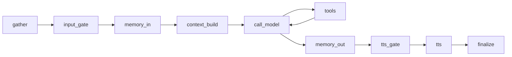

# Memory Service v1 — Design

## Request

Add long-term memory to the chat agent: extract facts from each turn, retrieve
relevant ones before the next reply. Smallest implementation possible — enough
to observe behavior in production, not enough to over-commit to a taxonomy.

Initial-development mode: no backward compatibility, no migration, no wrappers.

## Boundary vs Existing Surfaces

| Surface | Owns | Lifetime |
|---|---|---|
| `AsyncSqliteSaver` checkpoint | per-thread message history (short-term) | per thread |
| `memory_in_node` trim | bounded window into checkpoint | per turn |
| Mem0 SQLite `messages` table (`workspace/memory/history.db`) | last-10 raw turns per `session_scope`, fed back into mem0's extraction prompt as `last_k_messages` | per channel/thread, rolling |
| Mem0 Qdrant collection (`workspace/memory/qdrant`) | extracted facts/preferences scoped per user × character | persistent in workspace |
| Conversation JSONL (existing, unwired) | raw episodic log | append-only |
| **Memory Service (new)** | thin async wrapper around the two mem0 stores above | — |
| `RunAccumulator` / ledger | per-node metrics | one row per node call |

The Memory Service is the long-term layer. It does not replace the checkpoint or
the trim; it sits alongside them.

### Clear-channel × memory coordination

`clear_channel_messages` (in `domain/conversation_channel.py`) wipes:

1. `data.db` messages and attachments for the channel.
2. The LangGraph checkpoint thread (`thread_id = str(channel_id)`).
3. Mem0's `messages` table rows for the channel/thread scope
   (`run_id=<channel id>&user_id=<data.db user id>`) — **not** the Qdrant facts.

That matches the user expectation "clear the conversation but remember what you
learned about me". To also forget the facts, users invoke the separate
`memory_clear` tool, which calls `MemoryService.clear_all` → mem0
`delete_all` against Qdrant. `Memory.reset()` is intentionally not wired:
it is unscoped (drops every collection in the workspace) and would also
nuke other characters' memories.

`history_db_path` is pinned to `workspace_path / "memory" / "history.db"` in
`Mem0MemoryService.__init__` so the wipe is deterministic and isolated per
workspace (mem0's default `~/.mem0/history.db` would be shared across every
workspace on the machine).

## Stack

Per `architecture/design-decisions/memory-requirements.mdx`:

- **Mem0 SDK** (`mem0ai`) — extraction + retrieval
- **Qdrant local** (`qdrant-client`) — embedded vector store at
  `workspace_path / "memory" / "qdrant"`
- **Extraction LLM** — mem0 default (`gpt-5-mini` since 2026). No config needed.
- **Embedding model** — mem0 default. Migration is a known cost if changed.

No graph backend (Kuzu), no admin UI, no categories, no shared-vs-private
control surface yet. All deferred.

## Service vs Tool split

Per `architecture/misc/tools-architecture.mdx`:

| Layer | Path | Callers |
|---|---|---|
| Service | `services/memory/` | `memory_in_node`, `memory_out_node` (hot path) |
| Tools | `tools/memory.py` | CLI, agent, HTTP/admin via Tool Registry |

Service mirrors the shape of `services/tts/`, `services/stt/`, `services/vision/`.

## Partitioning

Hiro maps its three identifiers directly onto mem0's three native entity slots
so retrieval uses indexed entity filtering, not metadata gymnastics:

| Hiro concept | Mem0 entity slot | Set on |
|---|---|---|
| `data.db` user id | `user_id` | `add`, `search`, `list_all`, `clear_all` |
| Character slug | `agent_id` | `add`, `search`, `list_all`, `clear_all` |
| Conversation thread (`channel_id`) | `run_id` | `add` only |

Rationale:

- **`user_id`**: passed to mem0 as `str(user_id)` (mem0 requires strings).
- **`agent_id` = character**: mem0 reserves this slot for "the agent
  personality talking to the user", which is exactly what a character is in
  Hiro. Native filtering means `delete_all(user_id=..., agent_id=...)` is a
  single SDK call and no post-filter is needed.
- **`run_id` = channel**: included on `add` so mem0's `messages` last-k buffer
  (in `history.db`) is per-thread. Long-term retrieval (`search`/`list_all`)
  intentionally **does not** filter by `run_id` — memory survives conversation
  resets and is shared across threads with the same character.
- **Session scope**: mem0 sorts the three IDs into
  `agent_id=<char>&run_id=<channel>&user_id=<uid>`; `clear_channel_messages`
  rebuilds the same key when wiping the last-k buffer.
- **Collection**: `hiro_memory_v2`. Bumped from `hiro_memory` when
  `character_id` moved from a metadata field to `agent_id`; the old
  collection is orphaned by design (initial-development mode — no migration).
- **Free-form metadata** still rides on every write (`{thread_id, channel_id,
  source, ...}`) for audit and admin display, but is no longer used for
  scoping.

## Retrieval tuning

`MemoryPreferences.search` (`MemorySearchPreferences`) sets the defaults
`Mem0MemoryService.search` applies when callers don't override:

| Field | Default | Effect |
|---|---|---|
| `top_k` | `8` | Result cap (matches mem0's `top_k`). |
| `threshold` | `0.1` | Drop rows with fused score below this (`0.0` disables). |
| `rerank` | `false` | Per-call default for the cross-encoder pass. |

Per-call overrides (`limit=`, `threshold=`, `rerank=`, `metadata_filters=`)
let the agent graph and tools tighten or relax retrieval without rebuilding
the service. `metadata_filters` AND-merges into the entity filter dict, so
callers can add scoping like `{"source": "conversation"}` without losing
`user_id` / `agent_id`.

## Reranker

`MemoryPreferences.reranker` (`MemoryRerankerPreferences`) opts into mem0's
**local cross-encoder** path:

- **Provider**: `sentence_transformer` only — no cloud reranker calls.
- **Default model**: `cross-encoder/ms-marco-MiniLM-L-6-v2`.
- **Disabled by default**. When enabled, mem0 instantiates a HuggingFace
  cross-encoder on first use; weights are cached under the Hugging Face cache
  dir. `sentence-transformers` is a direct dependency so the import path
  works without `mem0ai[extras]`.
- Setting `search.rerank=true` while `reranker.enabled=false` is a no-op —
  the service downgrades the request and logs at DEBUG; mem0 has no
  reranker instance to call.

## Service contract

```python
# domain/memory.py
class MemoryService(Protocol):
    async def add(self, content: str, *, user_id: int, run_id: str, character_id: str,
                  metadata: dict | None = None) -> None: ...
    async def search(self, query: str, *, user_id: int, character_id: str,
                     limit: int = 8) -> list[dict]: ...
    async def list_all(self, *, user_id: int,
                       character_id: str | None = None) -> list[dict]: ...
    async def clear_all(self, *, user_id: int,
                        character_id: str | None = None) -> int: ...
```

Implementation: `services/memory/service.py::Mem0MemoryService` wraps the mem0
SDK. All four methods route through `asyncio.to_thread` since the SDK is sync.

Factory: `services/memory/__init__.py::create_memory_service(workspace_path,
prefs) -> MemoryService | None` returns `None` when `prefs.memory.enabled` is
false, mirroring how `create_stt_service` handles unavailability.

## Preferences

Extend `MemoryPreferences` minimally — keep what we use, nothing else:

```python
class MemorySearchPreferences(BaseModel):
    top_k: int = 8
    threshold: float = 0.1
    rerank: bool = False


class MemoryRerankerPreferences(BaseModel):
    enabled: bool = False
    model: str = "cross-encoder/ms-marco-MiniLM-L-6-v2"
    device: str | None = None  # None = auto (CUDA if available, else CPU)
    batch_size: int = 32


class MemoryPreferences(BaseModel):
    enabled: bool = False
    default_llm: str | None = None
    default_embedding_model: str | None = None
    default_tuning_profile: str = DEFAULT_MEMORY_TUNING_PROFILE_ID
    max_messages: int = DEFAULT_MEMORY_MAX_MESSAGES
    search: MemorySearchPreferences = Field(default_factory=MemorySearchPreferences)
    reranker: MemoryRerankerPreferences = Field(default_factory=MemoryRerankerPreferences)
```

## Graph integration

Inject `memory_service` into `ChatAgentGraph.__init__` next to `tts_service`
etc. `AgentManager.serve()` builds it (same site as `create_stt_service`).

Touched nodes in `runtime/agent_graph/base.py`:



- **`memory_in_node`** — after the existing trim, if service is wired and
  enabled, `await service.search(user_text, user_id, character_id=...)`
  and stash hits on state under `retrieved_memories`.
- **`context_build_node`** — if `retrieved_memories` present, prepend a compact
  `Memory context:\n- ...\n- ...` block to the new `HumanMessage`. Keep prompt
  assembly in one place; do not touch the system prompt.
- **`memory_out_node`** — after emitting `GRAPH_REPLY_COMPLETED`, `await
  service.add(turn_text, user_id, character_id=..., metadata={...})`. Wrap
  in try/except. On failure: log via the ledger entry, do not block finalize.

`turn_text` = `f"User: {user_text}\nAssistant: {reply_text}"`.

Both new write/read calls are **real graph steps**, not fire-and-forget. They
get `@graph_logged(captures={"usage", "decision"})` and `RetryPolicy(max_attempts=2)`
like other I/O nodes. Trade-off accepted: +1–3s graph wall time per turn after
the reply has already been emitted to the user; gain ledger row + custom event
+ structured logs.

## Tools (user-facing)

`tools/memory.py` exposes two tools registered in the Tool Registry:

| Tool | Args | Behavior |
|---|---|---|
| `memory_list` | optional `character_id` | List memories for current user. |
| `memory_clear` | optional `character_id` | Destructive; gated by registry's confirmation policy. |

Both call the service via app state. CLI commands and admin UI later consume
these without re-implementing logic.

## Observability

- `memory_in` node emits ledger entry with `decision = "retrieved"` /
  `"empty"`, captures count of hits and `elapsed_ms`.
- `memory_out` node emits ledger entry with `decision = "stored"` /
  `"failed"`, captures `elapsed_ms` and `extraction_tokens` if mem0 returns
  usage metadata.
- New custom graph event `GRAPH_MEMORY_RETRIEVED` and `GRAPH_MEMORY_STORED`
  carrying `{inbound_id, chat_channel_id, character_id, count, elapsed_ms}`.
  The subscriber on the comm side logs them; no persistence side-effect yet.
- Human-first log line per write/read using the existing emoji convention
  (`✅ memory_in — retrieved · n=3` / `✅ memory_out — stored · 850ms`).

## File touch list

**New (3):**

- `services/memory/__init__.py`
- `services/memory/service.py`
- `tools/memory.py`
- `domain/memory.py` (Protocol + `resolve_memory_user_id`)

**Touched (5):**

- `domain/preferences.py` — `MemoryPreferences.enabled`
- `runtime/agent_graph/base.py` — `memory_in_node`, `context_build_node`,
  `memory_out_node`
- `runtime/agent_graph/chat.py` — pass memory_service through ctor (nothing
  else; wiring already exists)
- `runtime/agent_manager.py` — build service in `serve()`, pass to graph
- `pyproject.toml` — add `mem0ai`, `qdrant-client` (verify latest versions
  via WebSearch when adding)

**Tool Registry** — register `MemoryListTool` and `MemoryClearTool` alongside
existing tools.

## What's deliberately out of v1

- Categories / quadrants / importance scoring — wait for real extraction data.
- Shared-vs-private toggle UI — partition shape supports it; UI deferred.
- Graph mode + Kuzu — Phase 3 in architecture doc.
- Admin UI memory page — CLI via the tools is the v1 inspection surface.
- Hot-reload on `PROVIDERS_CHANGED` — only matters once extraction LLM is
  configurable.
- Memory consolidation / TTL / decay — wait for store size to be a problem.

## Open follow-ups (not blocking v1)

- Pin embedding model explicitly before first prod use (changing it later
  invalidates the store).
- Decide a memory-prompt template once we see what extraction returns.
- Wire the existing unused `conversation_log.append_message` if we want the
  raw JSONL episodic log alongside mem0 extractions.
