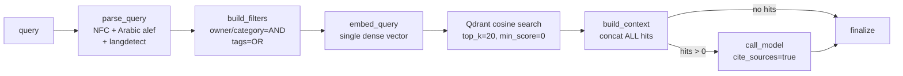
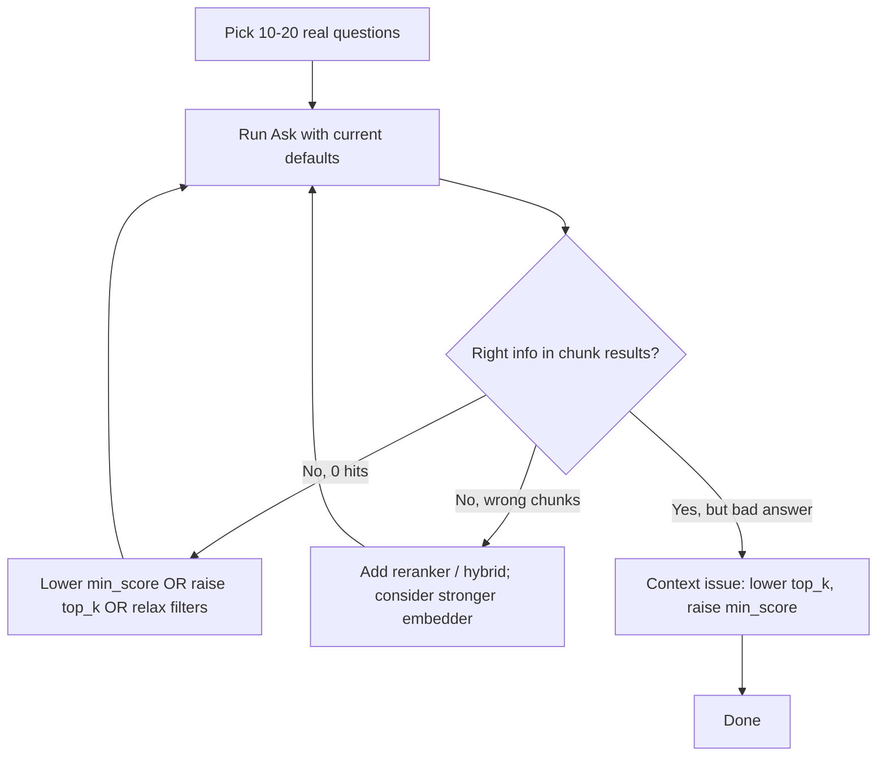

# Knowledge RAG — Retrieval Optimization

Analysis of the workspace knowledge retrieval pipeline (`agent/graph.py` + `helpers.py`,
the chunker, the Qdrant vector store, embedder resolution in
`services/knowledge/embedder.py`, and `default/preferences.json`): what it does today,
where it leaves recall/precision on the table, and what to change. Environment facts
below were verified against the installed stack, not assumed from model cards.

## Status

- ✅ **Hybrid retrieval (dense + BM25 sparse, RRF fusion) — implemented.** The Qdrant
  collection stores named `dense` + `bm25` sparse vectors per chunk; queries fuse both
  branches server-side with Reciprocal Rank Fusion. Controlled by
  `knowledge.retrieval.{hybrid, sparse_model, prefetch_limit}`. Sparse vectors are always
  stored at ingest, so `hybrid` is a query-time toggle (no re-ingest to flip). `min_score`
  now applies as the cosine threshold on the **dense** branch; the BM25 branch is rank-fused
  and the RRF output is not thresholded (precision left to a future reranker). Sparse model:
  `Qdrant/bm25` — language-agnostic, ships Arabic stopwords, and lives in the already-present
  `fastembed` (no new dependency).
- ✅ **Explain mode (opt-in) — implemented.** A per-query "Explain" toggle on the Ask screen
  (`explain=true`) returns per-result diagnostics for human evaluation: which branch matched
  (dense / sparse / both), per-branch **cosine** and **BM25** scores, the fused **RRF** score,
  and **matched query terms**. The default path is unchanged — a single fused query with no
  extra work; explain runs the two branches separately and fuses in-process only when asked.
- ✅ **Structural-context embedding — implemented.** Each chunk's *embedded* text (dense +
  BM25) is prefixed with `{title} / {heading path}` so every chunk — including heading-less
  continuation/overlap pieces and deep chunks whose body never repeats the parent headings —
  carries its document and section context. Controlled by
  `knowledge.chunking.embed_structural_context` (default on); ingest-time only, so flipping it
  needs a re-ingest. The stored payload `text` is unchanged — the UI and LLM context still add
  `title`/`heading_path` separately.
- ✅ **Query rewrite (Ask, opt-in) — implemented.** An optional per-query "Rewrite" toggle on the
  Ask screen runs one structured-output LLM call before retrieval that normalizes wording and
  extracts literal keywords (`standalone_query` → dense branch; `keywords` are appended to the
  BM25 branch text to keep exact-match signal). Reuses the resolved answering model; any failure
  silently falls back to the normalized query (retrieval never blocks). The system prompt is
  editable and the default toggle state is set in Admin → Preferences → Knowledge → "Query rewrite
  (Ask)" (`knowledge.rewrite.{prompt, default_on}`). The new `rewrite_query` graph node reports
  token cost + in/out previews in graph runs. Scope: Ask only — conversational reference-resolution
  remains deferred to chat-agent integration; multi-query / decomposition can later extend the same
  structured-output call.
- ⏳ **Pending:** embedder upgrade (Arabic recall), reranker, multi-query / decomposition.

> **Migration (no-backward-compatibility):** the collection schema changed from a single
> unnamed vector to named `dense` + `bm25`. Existing workspaces must **clear knowledge and
> re-ingest once** — old points don't match the new schema (the store raises a clear
> "must be rebuilt" error until cleared). No migration is provided.

## How retrieval works today



| Stage | Current setting | Source |
|---|---|---|
| Embedder | `null` → FastEmbed `sentence-transformers/paraphrase-multilingual-MiniLM-L12-v2` (384-dim) | `constants.py`, `embedder.py` |
| Chunking | 1200 chars, overlap 150, heading-aware markdown then recursive split | `constants.py`, `chunker.py` |
| Retrieval | `top_k=20`, `min_score=0.0`, dense only | `vector_store.search_by_vector` |
| Rerank | None (agent memory has one; knowledge does not) | `preferences.json` |
| Context | All hits concatenated and sent to the LLM | `helpers.build_context` |
| Answering | `gemini-3-flash-preview`, temp 0.2, max 1600 tokens | tuning profile |

There is **no query-side transformation** — no conversational rewriting, multi-query, HyDE,
or decomposition — and no reranking, MMR, or per-document dedup. `parse_query` only normalizes
text and detects language for the answer prompt, not for retrieval. See
[Query transformation](#query-transformation-query-side-recall) for the technique breakdown.

## Environment & stack notes

- Embedding uses **FastEmbed** (ONNX). The stack ships **CPU-only** `onnxruntime` (and a CPU
  `torch` build), so embedding and any cross-encoder reranking run on **CPU** by default.
  Deployments that have a CUDA GPU can install the GPU builds (`onnxruntime-gpu` /
  `fastembed-gpu`, and a CUDA-matched `torch`) to accelerate bulk ingest; query-time latency
  is acceptable on CPU. GPU is an optional, environment-specific optimization — not assumed.
- The default embedder is **not bundled** — FastEmbed lazily downloads weights (~0.22 GB)
  from HuggingFace on the **first ingestion**, caching to
  `<workspace>/knowledge/fastembed_cache`. There is currently **no user consent prompt**
  before this download.
- **The default embedder is not truncating chunks.** FastEmbed's build of MiniLM
  (`qdrant/paraphrase-multilingual-MiniLM-L12-v2-onnx-Q`) allows **512 input tokens**
  (per FastEmbed's own model metadata). The default 1200-char chunks are ~250–350 tokens,
  well under 512. (The "128 token" figure sometimes quoted comes from the
  *sentence-transformers* packaging of this model, not the FastEmbed ONNX build used here.)
  The embedder is a **quality** lever — and a correctness issue for Arabic — not a length fix.

## Gaps, ranked by leverage

Retrieval is gated by **recall first**: if the right chunk never makes the candidate set,
nothing downstream (`min_score`, reranking, prompt formatting) can recover it. The list is
ordered accordingly — recall fixes first, precision/ordering second.

### 1. Embedder is weak, and effectively unusable for Arabic (highest leverage)
The default `paraphrase-multilingual-MiniLM-L12-v2` is a small 384-dim, 2019 general
multilingual model. Its Arabic representations are poor, so Arabic queries frequently fail to
surface the correct chunk at all — a **recall** failure at the source, before any ranking
step runs. A strong multilingual embedder is the single biggest lever for this corpus.
(Dimension change → re-index; see options below.)

### 2. Dense-only retrieval — no hybrid (recall) — ✅ RESOLVED
Pure dense embedding misses proper nouns ("Selim"), identifiers, dates, exact phrases, and
Arabic surface forms / morphology. **Now addressed:** retrieval fuses a dense vector with a
BM25 sparse vector via Qdrant RRF (see Status above). Lexical/sparse signal recovers exactly
the matches a weak dense model drops, so this compounds with the (still pending) embedder fix.

### 3. Chunks embedded without structural context (recall) — ✅ RESOLVED
Previously only `chunk["text"]` was embedded. Because the chunker keeps heading lines in the
body (`strip_headers=False`), the *first* chunk of each section did embed its own deepest
heading — but the ancestor headings, the document title, and every heading-less continuation /
overlap chunk had no structural context in the vector at all (`title` / `heading_path` lived
only in the Qdrant payload, added back after retrieval in `build_context`). So "what does
section X say about Y?" could miss the right chunk whenever the section name wasn't repeated in
that chunk's body. **Now addressed:** the embedded text (dense + BM25) is prefixed with the full
`{title} / {heading path}` breadcrumb for *every* chunk, so section/document context is
searchable regardless of where a chunk falls. Compounds with the (still pending) embedder
upgrade. (Ingest-time; re-ingest to apply.)

### 4. `min_score = 0.0` and no diversity control (precision)
With no score floor, unrelated hits still enter the prompt; and all `top_k` slots can come
from one document (overlapping chunks) with no MMR / per-document cap / near-duplicate
collapse. These are precision knobs — useful, but only once recall produces good candidates.

### 5. No reranker (precision / ordering — secondary)
A cross-encoder reranker reorders the candidate set so the LLM sees the best 5–8 instead of
all 20. Important eventually, but it can **only reorder what retrieval already surfaced** —
with the current recall it would add latency for little gain. Fix recall (1–3) first.

### 6. Single-shot query → single embedding (recall, vague & conversational queries)
No conversational rewriting, multi-query rewrite, or sub-question decomposition. Short/vague
queries — and, once knowledge runs inside a chat, queries that reference earlier turns ("the
second one", "his brother") — get one shot at the index. This is the *query-side* recall
lever; see [Query transformation](#query-transformation-query-side-recall) for the technique
breakdown and the HyDE rejection. Worth adding once the core recall path is solid.

## Query transformation (query-side recall)

Everything above fixes the **index** side. This section covers the **query** side: turning
raw human input into the query (or queries) actually sent to retrieval. It is ordered after
the index fixes on purpose — quality in, quality out, but a clean query only helps once the
index can answer it.

**Scope — where each technique applies:**

| Surface | Query shape | Techniques that apply |
|---|---|---|
| Admin **Ask** tab (v1, today) | One standalone question per submit | normalization, **optional LLM rewrite** (cleanup only — no history to resolve), multi-query, decomposition *(HyDE rejected)* |
| Chat sub-agent (v2, future) | A turn inside a multi-turn conversation | **LLM rewrite first** (cleanup + reference resolution), then the above |

### Techniques

| Technique | Shape | Fixes | Fit for Hiro |
|---|---|---|---|
| **Normalization** *(done)* | 1→1 | unicode / Arabic alef / casing noise | already in `parse_query` |
| **Query rewriting** (normalize + contextualize) | 1→1 | dialect/typos (any query) + references to earlier turns (chat) | **optional per-query toggle** (Ask-tab param, default off); resolves references only when chat history is present |
| **Multi-query expansion** | 1→N | vocabulary / phrasing mismatch (user words ≠ doc words) | **best first lever**; reuses the existing RRF fan-in |
| **Decomposition** | 1→N | compound / multi-hop questions needing separate facts | moderate; for "compare X and Y" queries |
| **HyDE** | 1→hypothetical | question-vs-answer shape mismatch | **rejected — see below** |

### Query rewriting — LLM normalize + contextualize (optional)

A single structured-output LLM call run **before** retrieval that does three things at once:

1. **Normalize** — fix typos, fold Arabic dialect → MSA, clean phrasing. Useful even for a
   single-shot query, and more capable here than regex (regex can't do dialect→MSA).
2. **Contextualize** — when conversation history is present, resolve references
   (*"what about the second one?"* + a prior turn listing Hiro's agents → *"what does the
   Research agent do?"*). No-op when there's no history.
3. **Preserve literals** — emit proper nouns / identifiers verbatim as `keywords` so the BM25
   branch keeps its exact-match signal (the rewrite must **not** "correct" names like `Selim`).

Structured output (illustrative):

```json
{ "standalone_query": "…", "keywords": ["…"], "language": "ar|en", "is_followup": true }
```

`standalone_query` → dense branch; `keywords` → BM25 branch. A thin deterministic NFC pass
still runs on the output before embedding; ingest-side BM25 tokenization stays deterministic
(no LLM over chunks at ingest).

**Optional, per-query.** It costs one LLM call + latency before retrieval, so it is an **opt-in
toggle exposed in the Ask tab params** (alongside `top_k` / `min_score` / Explain), **default
off**. In chat it would default on (reference resolution is required there). Architecturally it
is a new node (or an extension of `parse_query`) gated on the toggle + presence of history.

**Forward note:** multi-query and decomposition can later extend *this same* structured-output
call (extra `variants[]` / `sub_questions[]` fields) rather than adding new model calls.

**To verify at implementation:** ingest must apply the same Arabic normalization (alef folding,
etc.) to chunk text before computing BM25 vectors as `parse_query` applies to the query — else
the sparse branch is silently mismatched for Arabic (query `احمد` vs stored `أحمد`). Confirm
ingest/query normalization symmetry.

### HyDE — evaluated and rejected (for Hiro's corpus)

HyDE embeds an LLM-generated **hypothetical answer** instead of the question, on the theory
that a fake answer sits closer to real passages than the question does. **Rejected for Hiro:**
the corpus is the user's private, specific data (files, chats, family, schedules) — the model
cannot *guess* those facts, so it fabricates a plausible-but-wrong passage and steers retrieval
toward the wrong neighborhood. HyDE was validated on general web-QA (MS MARCO / TREC), the
opposite of a personal-knowledge base. Its one strength — exact-term / proper-noun matching —
is already covered, more safely, by the BM25 branch.

**Narrow exception:** a future *reference / general-knowledge* sub-corpus (saved articles,
manuals collected by the Research Agent) could use HyDE, gated to that owner/category and
never the personal data. Not now.

## Embedding model options

All swaps that change the **vector dimension** require clearing the knowledge collection and
re-ingesting (`_ensure_collection` refuses to resize a populated collection).

| Model | Backend | Local? | Dim | Context | Arabic | License | Size | Notes |
|---|---|---|---|---|---|---|---|---|
| `paraphrase-multilingual-MiniLM-L12-v2` *(current default)* | FastEmbed | ✅ | 384 | 512 | ok (~50 langs) | Apache-2 | 0.22 GB | weak/old; baseline |
| `intfloat/multilingual-e5-large` | FastEmbed | ✅ | 1024 | 512 | strong (~100 langs) | **MIT** | 2.24 GB | best in-stack upgrade; needs `query:`/`passage:` prefixes |
| `bge-m3` | **Ollama** | ✅ | 1024 | **8192** | excellent (100+ langs) | **MIT** | ~2.2 GB | strongest local multilingual; **not in FastEmbed 0.8.0** — requires Ollama installed |
| `nomic-embed-text` | Ollama | ✅ | 768 | 8192 | weak (English-centric) | Apache-2 | ~0.27 GB | already registered in catalog (`ollama:nomic-embed-text`); weak for Arabic |
| `text-embedding-3-small` | OpenAI | ☁️ cloud | 1536 | 8191 | good | proprietary | — | cheap, simplest drop-in; data leaves machine |
| `gemini-embedding-001` | Google | ☁️ cloud | 768 | — | good | proprietary | — | already in catalog |

**Notes on the local multilingual choices:**
- **`intfloat/multilingual-e5-large`** is the best option that stays entirely in the current
  FastEmbed stack (no new system dependency, MIT-licensed). Tradeoff: 512-token context and
  it requires `query:` / `passage:` input prefixes to perform well.
- **`bge-m3` via Ollama** is the strongest local multilingual model (8192-token context,
  excellent Arabic, MIT) — but `bge-m3` is **absent from FastEmbed 0.8.0** (verified across
  dense/sparse/late-interaction model lists), so it can only be run locally through **Ollama**,
  which adds a system dependency. (Ollama uses a GPU where one is available, CPU otherwise.)

## Constraints when changing the embedder (code-level)

1. **Resolver only routes `sentence-transformers/*` names to FastEmbed.** In
   `resolve_knowledge_embedder`, any FastEmbed name not starting with `sentence-transformers/`
   (e.g. `intfloat/multilingual-e5-large`) silently falls back to MiniLM. Selecting e5-large
   therefore requires widening the resolver to a **curated allow-list** of FastEmbed models.
2. **Catalog (`provider:model`) path** already handles cloud + Ollama embedders. Adding
   `ollama:bge-m3` is a low-risk **catalog entry + dimension constant (1024)** — it reuses the
   existing `ollama:nomic-embed-text` plumbing.
3. **e5 prefixes:** e5 models need `passage:` at ingest and `query:` at search time — a
   per-model input-prefix setting is needed for correct results.
4. **Re-index required** on any dimension change (384 → 1024/1536). Under the workspace's
   no-backward-compatibility rule, a clean wipe + re-ingest is the expected path: clear all
   docs via the admin Knowledge UI, or stop the server and delete
   `<workspace>/knowledge/qdrant/` + `knowledge.db`, then re-ingest.

## Recommended direction

Fix **recall** before precision — a reranker on weak candidates is wasted effort.

1. **Upgrade the embedder (biggest lever; needs re-index).** This is the fix for Arabic.
   - In-stack, no new dependency → **`intfloat/multilingual-e5-large`** (FastEmbed, MIT;
     needs `query:`/`passage:` prefixes).
   - Best local multilingual quality → **`bge-m3` via Ollama** (MIT, 8192 ctx) where an
     Ollama server is available.
2. ✅ **Hybrid retrieval (dense + sparse RRF) in Qdrant — done.** Recovers exact-term /
   proper-noun / Arabic-surface matches the dense model drops. Compounds with the embedder
   upgrade.
3. ✅ **Embed structural context — done.** Prefix `{title} / {heading_path}` into the embedded
   text (dense + BM25) at ingest so every chunk carries its breadcrumb.
4. **Then precision:** raise `min_score` off 0.0; add a cross-encoder **reranker** (a
   *multilingual* model — not the English-only one memory defaults to) trimming to top 5–8;
   add a per-document cap / dedup.
5. **Build a small eval harness first** (20 hand-curated question → expected-doc pairs) so the
   embedder/hybrid changes are measured, not guessed — especially important for Arabic, where
   relevance is harder to eyeball.

The prefs-only `min_score`/`top_k` tuning is worth doing immediately, but treat it as
mitigation, not a fix — it cannot surface a chunk that recall never retrieved.

## Proposed: admin-UI embedding-model manager

To make model selection and ingestion safe and explicit (and to fix the silent first-ingest
download), add an **Embedding model** section under Admin → Preferences → Knowledge:

- **Model registry** (single source of truth, shared by the resolver and the UI): for each
  model — backend (FastEmbed / Ollama / cloud), dimension, context, size, languages, license,
  whether it needs query/passage prefixes, and download/availability status.
- **Explicit download / prefetch**: a "Download" action that pre-fetches FastEmbed weights
  (into `fastembed_cache`) or triggers `ollama pull`, with size disclosure and a progress
  bar — so no model ever downloads silently on first ingestion.
- **Set active** with guardrails: changing the active model warns that the dimension change
  requires clearing knowledge + re-ingesting, and offers that flow inline.
- **Status surface**: downloaded vs not, active model, dimension, and (for Ollama) whether
  the Ollama server is reachable and the model is pulled.

This directly addresses two current pain points: silent downloads with no consent, and the
re-index footgun on model swaps.

## Operational tuning workflow



## TL;DR

- **Recall is the bottleneck — fix it before reranking.** The top lever is the **embedder**:
  the default MiniLM is weak and effectively unusable for **Arabic**, so correct chunks often
  never make the candidate set. (It is *not* truncating chunks — 512-token cap, chunks are
  ~250–350 tokens — the problem is representation quality, not length.)
- **Embedder choice (needs re-index):** in-stack → `intfloat/multilingual-e5-large`
  (FastEmbed, MIT, needs query/passage prefixes); best local multilingual → `bge-m3` via
  **Ollama** (MIT, 8192 ctx). `ollama:nomic-embed-text` is wired already but weak for Arabic.
- **Hybrid (dense+sparse RRF)** and **structural-context prefixes** — the other two recall
  levers — are now in place; the embedder upgrade and a reranker are what remain.
- **Reranking and `min_score` are precision steps** — valuable only once recall is good.
- **Any embedder swap changes the vector dimension → wipe + re-ingest.**
- **Recommended UX:** an admin model-manager with explicit, progress-tracked downloads and a
  guarded "set active + re-ingest" flow.
