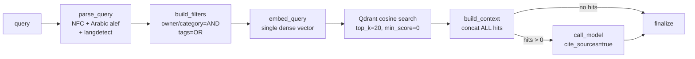
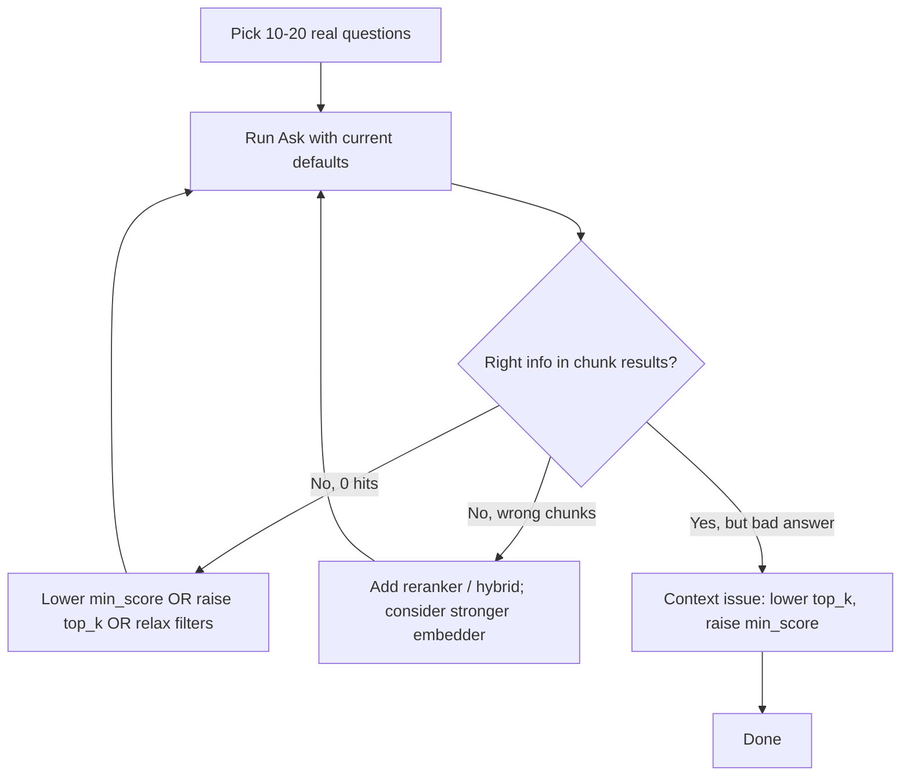

# Knowledge RAG — Retrieval Optimization

Analysis of the workspace knowledge retrieval pipeline (`agent/graph.py` + `helpers.py`,
the chunker, the Qdrant vector store, embedder resolution in
`services/knowledge/embedder.py`, and `default/preferences.json`): what it does today,
where it leaves recall/precision on the table, and what to change. Environment facts
below were verified against the installed stack, not assumed from model cards.

## Status

- ✅ **Hybrid retrieval (dense + BM25 sparse, RRF fusion) — implemented.** The Qdrant
  collection stores named `dense` + `bm25` sparse vectors per chunk; queries fuse both
  branches server-side with Reciprocal Rank Fusion. Controlled by
  `knowledge.retrieval.{hybrid, prefetch_limit}`. Sparse vectors are always
  stored at ingest, so `hybrid` is a query-time toggle (no re-ingest to flip). `min_score`
  now applies as the cosine threshold on the **dense** branch; the BM25 branch is rank-fused
  and the RRF output is not thresholded (precision left to a future reranker). The sparse model
  is a fixed constant (`services.knowledge.constants.DEFAULT_SPARSE_MODEL = Qdrant/bm25`), not a
  preference — the collection is hardwired to BM25's IDF scoring and switching would need a full
  re-ingest. `Qdrant/bm25` is language-agnostic, ships Arabic stopwords, and lives in the
  already-present `fastembed` (no new dependency).
- ✅ **Explain mode (opt-in) — implemented.** A per-query "Explain" toggle on the Ask screen
  (`explain=true`) returns per-result diagnostics for human evaluation: which branch matched
  (dense / sparse / both), per-branch **cosine** and **BM25** scores, the fused **RRF** score,
  and **matched query terms**. The default path is unchanged — a single fused query with no
  extra work; explain runs the two branches separately and fuses in-process only when asked.
- ✅ **Structural-context embedding — implemented.** Each chunk's *embedded* text (dense +
  BM25) is prefixed with `{title} / {heading path}` so every chunk — including heading-less
  continuation/overlap pieces and deep chunks whose body never repeats the parent headings —
  carries its document and section context. Controlled by
  `knowledge.chunking.embed_structural_context` (default on); ingest-time only, so flipping it
  needs a re-ingest. The stored payload `text` is unchanged — the UI and LLM context still add
  `title`/`heading_path` separately.
- ✅ **Query rewrite (Ask, opt-in) — implemented.** An optional per-query "Rewrite" toggle on the
  Ask screen runs one structured-output LLM call before retrieval that normalizes wording and
  extracts literal keywords (`standalone_query` → dense branch; `keywords` are appended to the
  BM25 branch text to keep exact-match signal). Reuses the resolved answering model; any failure
  silently falls back to the normalized query (retrieval never blocks). The system prompt is
  editable and the default toggle state is set in Admin → Preferences → Knowledge → "Query rewrite
  (Ask)" (`knowledge.rewrite.{prompt, default_on}`). The new `rewrite_query` graph node reports
  token cost + in/out previews in graph runs. Scope: Ask only — conversational reference-resolution
  remains deferred to chat-agent integration; multi-query / decomposition can later extend the same
  structured-output call.
- ✅ **Reranker — implemented.** A cross-encoder reorders retrieved candidates before answering
  (precision step), prefs-only and **default off**. Both lanes ship: **cloud** (`voyage:rerank-2.5`,
  `cohere:rerank-v3.5` via the catalog) and **local** (FlashRank `ms-marco-MultiBERT-L-12` starter,
  FastEmbed `bge-reranker-base`, sentence-transformers `bge-reranker-v2-m3`, in a non-catalog
  registry). All resolve to a LangChain `BaseDocumentCompressor` via `resolve_reranker`; a new
  `rerank` graph node runs between search and `build_context` and **fails safe** to the fused order.
  No silent downloads — local models gate on an explicit download (admin Reranker section under
  Preferences → Knowledge). Rerankers are dimensionless → hot swap, **no re-ingest**. Controlled by
  `knowledge.retrieval.reranker.{enabled, model_id, top_n, device, batch_size}`. Score contract
  (`relevance`/`raw_score`/`score_source`) is emitted whether rerank is on or off.
- ⏳ **Pending:** embedder upgrade (Arabic recall), multi-query / decomposition.

> **Migration (no-backward-compatibility):** the collection schema changed from a single
> unnamed vector to named `dense` + `bm25`. Existing workspaces must **clear knowledge and
> re-ingest once** — old points don't match the new schema (the store raises a clear
> "must be rebuilt" error until cleared). No migration is provided.

## How retrieval works today



| Stage | Current setting | Source |
|---|---|---|
| Embedder | `null` → FastEmbed `sentence-transformers/paraphrase-multilingual-MiniLM-L12-v2` (384-dim) | `constants.py`, `embedder.py` |
| Chunking | 1200 chars, overlap 150, heading-aware markdown then recursive split | `constants.py`, `chunker.py` |
| Retrieval | `top_k=20`, `min_score=0.0`, dense only | `vector_store.search_by_vector` |
| Rerank | None (agent memory has one; knowledge does not) | `preferences.json` |
| Context | All hits concatenated and sent to the LLM | `helpers.build_context` |
| Answering | `gemini-3-flash-preview`, temp 0.2, max 1600 tokens | tuning profile |

There is **no query-side transformation** — no conversational rewriting, multi-query, HyDE,
or decomposition — and no reranking, MMR, or per-document dedup. `parse_query` only normalizes
text and detects language for the answer prompt, not for retrieval. See
[Query transformation](#query-transformation-query-side-recall) for the technique breakdown.

## Environment & stack notes

- Embedding uses **FastEmbed** (ONNX). The stack ships **CPU-only** `onnxruntime` (and a CPU
  `torch` build), so embedding and any cross-encoder reranking run on **CPU** by default.
  Deployments that have a CUDA GPU can install the GPU builds (`onnxruntime-gpu` /
  `fastembed-gpu`, and a CUDA-matched `torch`) to accelerate bulk ingest; query-time latency
  is acceptable on CPU. GPU is an optional, environment-specific optimization — not assumed.
- The default embedder is **not bundled** — FastEmbed lazily downloads weights (~0.22 GB)
  from HuggingFace on the **first ingestion**, caching to
  `<workspace>/knowledge/fastembed_cache`. There is currently **no user consent prompt**
  before this download.
- **The default embedder is not truncating chunks.** FastEmbed's build of MiniLM
  (`qdrant/paraphrase-multilingual-MiniLM-L12-v2-onnx-Q`) allows **512 input tokens**
  (per FastEmbed's own model metadata). The default 1200-char chunks are ~250–350 tokens,
  well under 512. (The "128 token" figure sometimes quoted comes from the
  *sentence-transformers* packaging of this model, not the FastEmbed ONNX build used here.)
  The embedder is a **quality** lever — and a correctness issue for Arabic — not a length fix.

## Gaps, ranked by leverage

Retrieval is gated by **recall first**: if the right chunk never makes the candidate set,
nothing downstream (`min_score`, reranking, prompt formatting) can recover it. The list is
ordered accordingly — recall fixes first, precision/ordering second.

### 1. Embedder is weak, and effectively unusable for Arabic (highest leverage)
The default `paraphrase-multilingual-MiniLM-L12-v2` is a small 384-dim, 2019 general
multilingual model. Its Arabic representations are poor, so Arabic queries frequently fail to
surface the correct chunk at all — a **recall** failure at the source, before any ranking
step runs. A strong multilingual embedder is the single biggest lever for this corpus.
(Dimension change → re-index; see options below.)

### 2. Dense-only retrieval — no hybrid (recall) — ✅ RESOLVED
Pure dense embedding misses proper nouns ("Selim"), identifiers, dates, exact phrases, and
Arabic surface forms / morphology. **Now addressed:** retrieval fuses a dense vector with a
BM25 sparse vector via Qdrant RRF (see Status above). Lexical/sparse signal recovers exactly
the matches a weak dense model drops, so this compounds with the (still pending) embedder fix.

### 3. Chunks embedded without structural context (recall) — ✅ RESOLVED
Previously only `chunk["text"]` was embedded. Because the chunker keeps heading lines in the
body (`strip_headers=False`), the *first* chunk of each section did embed its own deepest
heading — but the ancestor headings, the document title, and every heading-less continuation /
overlap chunk had no structural context in the vector at all (`title` / `heading_path` lived
only in the Qdrant payload, added back after retrieval in `build_context`). So "what does
section X say about Y?" could miss the right chunk whenever the section name wasn't repeated in
that chunk's body. **Now addressed:** the embedded text (dense + BM25) is prefixed with the full
`{title} / {heading path}` breadcrumb for *every* chunk, so section/document context is
searchable regardless of where a chunk falls. Compounds with the (still pending) embedder
upgrade. (Ingest-time; re-ingest to apply.)

### 4. `min_score = 0.0` and no diversity control (precision)
With no score floor, unrelated hits still enter the prompt; and all `top_k` slots can come
from one document (overlapping chunks) with no MMR / per-document cap / near-duplicate
collapse. These are precision knobs — useful, but only once recall produces good candidates.

### 5. No reranker (precision / ordering)
A reranker reorders the candidate set so the LLM sees the best ~8 instead of all 20. It can
**only reorder what retrieval already surfaced**, so it is a precision step — but for this
corpus manual results are poor enough that it is being built **now**, not deferred behind a
formal eval. The full design (catalog-integrated, local + cloud, LangChain
`BaseDocumentCompressor`) is locked in [Reranking](#reranking-precision--ordering) — note the
agent-memory reranker is English-only and mem0-native, and is **not** reused here.

### 6. Single-shot query → single embedding (recall, vague & conversational queries)
No conversational rewriting, multi-query rewrite, or sub-question decomposition. Short/vague
queries — and, once knowledge runs inside a chat, queries that reference earlier turns ("the
second one", "his brother") — get one shot at the index. This is the *query-side* recall
lever; see [Query transformation](#query-transformation-query-side-recall) for the technique
breakdown and the HyDE rejection. Worth adding once the core recall path is solid.

## Query transformation (query-side recall)

Everything above fixes the **index** side. This section covers the **query** side: turning
raw human input into the query (or queries) actually sent to retrieval. It is ordered after
the index fixes on purpose — quality in, quality out, but a clean query only helps once the
index can answer it.

**Scope — where each technique applies:**

| Surface | Query shape | Techniques that apply |
|---|---|---|
| Admin **Ask** tab (v1, today) | One standalone question per submit | normalization, **optional LLM rewrite** (cleanup only — no history to resolve), multi-query, decomposition *(HyDE rejected)* |
| Chat sub-agent (v2, future) | A turn inside a multi-turn conversation | **LLM rewrite first** (cleanup + reference resolution), then the above |

### Techniques

| Technique | Shape | Fixes | Fit for Hiro |
|---|---|---|---|
| **Normalization** *(done)* | 1→1 | unicode / Arabic alef / casing noise | already in `parse_query` |
| **Query rewriting** (normalize + contextualize) | 1→1 | dialect/typos (any query) + references to earlier turns (chat) | **optional per-query toggle** (Ask-tab param, default off); resolves references only when chat history is present |
| **Multi-query expansion** | 1→N | vocabulary / phrasing mismatch (user words ≠ doc words) | **best first lever**; reuses the existing RRF fan-in |
| **Decomposition** | 1→N | compound / multi-hop questions needing separate facts | moderate; for "compare X and Y" queries |
| **HyDE** | 1→hypothetical | question-vs-answer shape mismatch | **rejected — see below** |

### Query rewriting — LLM normalize + contextualize (optional)

A single structured-output LLM call run **before** retrieval that does three things at once:

1. **Normalize** — fix typos, fold Arabic dialect → MSA, clean phrasing. Useful even for a
   single-shot query, and more capable here than regex (regex can't do dialect→MSA).
2. **Contextualize** — when conversation history is present, resolve references
   (*"what about the second one?"* + a prior turn listing Hiro's agents → *"what does the
   Research agent do?"*). No-op when there's no history.
3. **Preserve literals** — emit proper nouns / identifiers verbatim as `keywords` so the BM25
   branch keeps its exact-match signal (the rewrite must **not** "correct" names like `Selim`).

Structured output (illustrative):

```json
{ "standalone_query": "…", "keywords": ["…"], "language": "ar|en", "is_followup": true }
```

`standalone_query` → dense branch; `keywords` → BM25 branch. A thin deterministic NFC pass
still runs on the output before embedding; ingest-side BM25 tokenization stays deterministic
(no LLM over chunks at ingest).

**Optional, per-query.** It costs one LLM call + latency before retrieval, so it is an **opt-in
toggle exposed in the Ask tab params** (alongside `top_k` / `min_score` / Explain), **default
off**. In chat it would default on (reference resolution is required there). Architecturally it
is a new node (or an extension of `parse_query`) gated on the toggle + presence of history.

**Forward note:** multi-query and decomposition can later extend *this same* structured-output
call (extra `variants[]` / `sub_questions[]` fields) rather than adding new model calls.

**To verify at implementation:** ingest must apply the same Arabic normalization (alef folding,
etc.) to chunk text before computing BM25 vectors as `parse_query` applies to the query — else
the sparse branch is silently mismatched for Arabic (query `احمد` vs stored `أحمد`). Confirm
ingest/query normalization symmetry.

### HyDE — evaluated and rejected (for Hiro's corpus)

HyDE embeds an LLM-generated **hypothetical answer** instead of the question, on the theory
that a fake answer sits closer to real passages than the question does. **Rejected for Hiro:**
the corpus is the user's private, specific data (files, chats, family, schedules) — the model
cannot *guess* those facts, so it fabricates a plausible-but-wrong passage and steers retrieval
toward the wrong neighborhood. HyDE was validated on general web-QA (MS MARCO / TREC), the
opposite of a personal-knowledge base. Its one strength — exact-term / proper-noun matching —
is already covered, more safely, by the BM25 branch.

**Narrow exception:** a future *reference / general-knowledge* sub-corpus (saved articles,
manuals collected by the Research Agent) could use HyDE, gated to that owner/category and
never the personal data. Not now.

## Embedding model options

All swaps that change the **vector dimension** require clearing the knowledge collection and
re-ingesting (`_ensure_collection` refuses to resize a populated collection).

| Model | Backend | Local? | Dim | Context | Arabic | License | Size | Notes |
|---|---|---|---|---|---|---|---|---|
| `paraphrase-multilingual-MiniLM-L12-v2` *(current default)* | FastEmbed | ✅ | 384 | 512 | ok (~50 langs) | Apache-2 | 0.22 GB | weak/old; baseline |
| `intfloat/multilingual-e5-large` | FastEmbed | ✅ | 1024 | 512 | strong (~100 langs) | **MIT** | 2.24 GB | best in-stack upgrade; needs `query:`/`passage:` prefixes |
| `bge-m3` | **Ollama** | ✅ | 1024 | **8192** | excellent (100+ langs) | **MIT** | ~2.2 GB | strongest local multilingual; **not in FastEmbed 0.8.0** — requires Ollama installed |
| `nomic-embed-text` | Ollama | ✅ | 768 | 8192 | weak (English-centric) | Apache-2 | ~0.27 GB | already registered in catalog (`ollama:nomic-embed-text`); weak for Arabic |
| `text-embedding-3-small` | OpenAI | ☁️ cloud | 1536 | 8191 | good | proprietary | — | cheap, simplest drop-in; data leaves machine |
| `gemini-embedding-001` | Google | ☁️ cloud | 768 | — | good | proprietary | — | already in catalog |

**Notes on the local multilingual choices:**
- **`intfloat/multilingual-e5-large`** is the best option that stays entirely in the current
  FastEmbed stack (no new system dependency, MIT-licensed). Tradeoff: 512-token context and
  it requires `query:` / `passage:` input prefixes to perform well.
- **`bge-m3` via Ollama** is the strongest local multilingual model (8192-token context,
  excellent Arabic, MIT) — but `bge-m3` is **absent from FastEmbed 0.8.0** (verified across
  dense/sparse/late-interaction model lists), so it can only be run locally through **Ollama**,
  which adds a system dependency. (Ollama uses a GPU where one is available, CPU otherwise.)

## Constraints when changing the embedder (code-level)

1. **Resolver only routes `sentence-transformers/*` names to FastEmbed.** In
   `resolve_knowledge_embedder`, any FastEmbed name not starting with `sentence-transformers/`
   (e.g. `intfloat/multilingual-e5-large`) silently falls back to MiniLM. Selecting e5-large
   therefore requires widening the resolver to a **curated allow-list** of FastEmbed models.
2. **Catalog (`provider:model`) path** already handles cloud + Ollama embedders. Adding
   `ollama:bge-m3` is a low-risk **catalog entry + dimension constant (1024)** — it reuses the
   existing `ollama:nomic-embed-text` plumbing.
3. **e5 prefixes:** e5 models need `passage:` at ingest and `query:` at search time — a
   per-model input-prefix setting is needed for correct results.
4. **Re-index required** on any dimension change (384 → 1024/1536). Under the workspace's
   no-backward-compatibility rule, a clean wipe + re-ingest is the expected path: clear all
   docs via the admin Knowledge UI, or stop the server and delete
   `<workspace>/knowledge/qdrant/` + `knowledge.db`, then re-ingest.

## Reranking (precision / ordering)

A reranker scores each `(query, chunk)` pair jointly and reorders the candidate set, so the
LLM sees the best 5–8 chunks instead of all 20 in fused-rank order. It is a **precision**
step, sequenced **after** recall: it can only reorder what retrieval already surfaced. (For
this corpus, manual results are already poor enough that reranking is being built *before* a
formal eval harness, not gated on one.)

**Design decisions (locked):**
- **Both lanes ship — local *and* cloud — as user-selectable options**, not an either/or.
- **Integrate through the existing model catalog**, exactly like embedders — a reranker is
  just another catalog `provider:model` of a new `rerank` kind, resolved through the model
  factory, with credentials via the existing `CredentialStore`. **No special-case path.**
- **Program against LangChain's `BaseDocumentCompressor` interface** (the one step in the
  pipeline where the LangChain abstraction earns its keep — rerank is a pluggable-provider
  op). Adopt the **compressor only**, called from a graph node — **not** the
  `ContextualCompressionRetriever`/`BaseRetriever` refactor, which would fight the custom
  hybrid-RRF retrieval for zero gain.
- **Prefs-only surface, default off** — not a per-query Ask toggle.
- **Rerankers are dimensionless** → switching one is a **hot config swap with no re-ingest**
  (unlike an embedder swap). This is what makes "offer several, let users pick" cheap and safe.

> **Do not reuse the agent-memory reranker as-is.** It defaults to
> `cross-encoder/ms-marco-MiniLM-L-6-v2` (`DEFAULT_RERANKER_MODEL`, `preferences.py`) — an
> **English-only** model wired through mem0's own `sentence_transformer` provider, not the
> catalog. Knowledge rerank goes through the catalog + LangChain (below); memory stays
> mem0-native. The two **diverge on purpose** — no shared `hiro-commons` helper (mem0
> encapsulates its reranker; there was never a clean seam to share).

### LangChain integration — verified import surface (LC 1.2 / community 0.4)

The compressor surface moved in LangChain 1.x; these paths were checked against the installed
stack, not docs:

| Concrete reranker | Import (verified) | Dependency status | Lane |
|---|---|---|---|
| **Interface** `BaseDocumentCompressor` | `langchain_core.documents.compressor` | ✅ present (stable) | — |
| `CohereRerank` | `langchain_cohere` | ⚠️ **new dep** `langchain-cohere` (not installed) | cloud |
| `VoyageAIRerank` | `langchain_voyageai` | ⚠️ **new dep** `langchain-voyageai` (not installed) | cloud |
| sentence-transformers `CrossEncoder` | `sentence_transformers` | ✅ present (wrapped directly in `SentenceTransformersReranker`) | local (torch) |
| `FlashrankRerank` | `langchain_community.document_compressors` | ✅ present (needs `flashrank`) | local (ONNX) |
| FastEmbed `TextCrossEncoder` | `fastembed.rerank.cross_encoder` | ✅ present (no LC wrapper — wrap in ~15-line `BaseDocumentCompressor`) | local (ONNX) |

> The torch lane uses sentence-transformers' `CrossEncoder` **directly** (not LangChain's
> `HuggingFaceCrossEncoder`/`langchain_classic` `CrossEncoderReranker`) — needed so
> `trust_remote_code` reaches the tokenizer + config, and to avoid a `langchain_classic` dep.

> Note: `langchain.retrievers.document_compressors.CrossEncoderReranker` (a path commonly
> cited) **does not exist** in LC 1.2 — `langchain.retrievers` is gone; it lives in
> `langchain_classic`. Build against `BaseDocumentCompressor` from `langchain_core` and let
> each provider supply the concrete impl, so the classic dependency is contained to the local
> torch lane only.

### Model menu — cloud and local (both shipping)

**Cloud** (catalog providers + a key; best multilingual quality, zero local compute):

| Model | Provider (new) | LC class | Arabic | Notes |
|---|---|---|---|---|
| **`rerank-2.5` / `rerank-2.5-lite`** | `voyage` | `VoyageAIRerank` | strong (multilingual) | **most generous free tier**; `lite` is cheaper/faster; adds `langchain-voyageai` + `VOYAGE_API_KEY` |
| **`rerank-v3.5`** | `cohere` | `CohereRerank` | excellent | top quality; adds `langchain-cohere` + `COHERE_API_KEY` |

Cloud rerankers need **only a key, no download**, and return a **normalized `relevance_score` in
[0, 1]** (see [Score handling](#score-handling--propagation)). (`JinaRerank` is available in
`langchain_community` with no new dep, but Jina is **deferred** — not in the launch set.)

**Local** — and the backend still constrains the model menu (verified against
`fastembed==0.8.0`; both `sentence-transformers` and `langchain_classic` are already
installed, torch ships CPU):

| Model | Backend | LC wrapping | Size | Arabic | Notes |
|---|---|---|---|---|---|
| **`ms-marco-MultiBERT-L-12`** | FlashRank ONNX | `FlashrankRerank` | **~150 MB** | ✅ 100+ langs | **recommended starter** — small, multilingual, no torch; adds `flashrank` dep |
| `BAAI/bge-reranker-base` | FastEmbed ONNX | tiny custom `BaseDocumentCompressor` | ~1.04 GB | ok | no torch; only multilingual model in FastEmbed 0.8.0; large to auto-fetch |
| **`BAAI/bge-reranker-v2-m3`** | sentence-transformers | `SentenceTransformersReranker` (direct `CrossEncoder`) | ~568 M params | excellent | best local Arabic; torch (already present for memory); **absent from FastEmbed** |
| ~~`Alibaba-NLP/gte-multilingual-reranker-base`~~ | sentence-transformers | — | ~306 M params | strong | **dropped** — custom RoPE remote-code arch crashes the `CrossEncoder` input path (corrupt `position_ids` → IndexError), even with `trust_remote_code` |
| `cross-encoder/ms-marco-MiniLM-L-6-v2` *(memory default)* | sentence-transformers | — | ~22 M | ❌ English-only | do **not** pick for Arabic |

> The sentence-transformers lane uses a small custom `SentenceTransformersReranker`
> (`BaseDocumentCompressor` over `CrossEncoder.predict`) rather than LangChain's
> `HuggingFaceCrossEncoder`/`CrossEncoderReranker`, so `trust_remote_code` reaches the
> tokenizer + config (not just the model) — and to drop the `langchain_classic` dependency.

Three local lanes, all behind one `BaseDocumentCompressor`: **FlashRank ONNX** (small,
multilingual, no torch — the starter), **FastEmbed ONNX** (no torch, but caps at the 1 GB
`bge-reranker-base`), and **sentence-transformers** (torch, reaches the best `bge-reranker-v2-m3`).
Ship them all; the picker decides. Local cross-encoders return **unbounded logits** — *not*
[0, 1] and *not* comparable across models (see [Score handling](#score-handling--propagation)).

> **Starter sizes/multilinguality are from FlashRank's published model list — verify at
> implementation** (couldn't introspect without installing `flashrank`).

### Catalog, registry & credential integration

Reranking follows the embedder's **split** exactly: **cloud** models live in the catalog;
**local in-process** models do **not** (just as the default FastEmbed embedder is resolved
outside the catalog by `resolve_knowledge_embedder`'s fallback, not as a `catalog.yaml` row).

**Cloud → catalog:**
1. **`model_catalog.py`** — add `"rerank"` to the `ModelKind` literal (line ~24), to the
   `allowed` set in `extra_kinds_consistent` (line ~123), and to the `recommended_models`
   kind whitelist (line ~188). Then `list_models(model_kind="rerank")` surfaces cloud rerankers
   like any other kind. **Do not bump `catalog_version`** — pre-release, it stays pinned.
2. **`catalog.yaml`** — add providers `voyage` (`credential_env_keys: [VOYAGE_API_KEY]`,
   `hosting: cloud`) and `cohere` (`[COHERE_API_KEY]`) with their `model_kind: rerank` rows.
   (Jina deferred — not added now.)
3. **`model_factory.py`** — add `create_reranker(model_id, …) -> BaseDocumentCompressor` for the
   **cloud** path, mirroring `create_embedding_model`: look up the spec, assert
   `supports_kind("rerank")`, pull credentials via `CredentialStore`, return the LangChain
   compressor. **No dimension map** (rerankers are dimensionless).
4. **Credentials** — `VOYAGE_API_KEY` / `COHERE_API_KEY` flow through the existing keyring/env
   `CredentialStore`; `hiro provider add voyage` works with zero new credential code.

**Local → a non-catalog registry + resolver** (the analog of the FastEmbed embedder fallback):
5. A small **local-reranker registry** (code-level) lists the in-process options — MultiBERT
   (FlashRank), bge-reranker-base (FastEmbed), bge-reranker-v2-m3 (sentence-transformers)
   — each with backend, size, languages, and download status. A `resolve_reranker(model_id)`
   dispatches: catalog id → `create_reranker` (cloud); local registry id → the matching local
   compressor. This mirrors `resolve_knowledge_embedder` dispatching catalog vs. FastEmbed.
6. **Dependencies** — add `langchain-voyageai` (Voyage), `langchain-cohere` (Cohere), and
   `flashrank` (local starter loader). The classic cross-encoder and FastEmbed are already
   installed. *Verify latest stable versions before pinning* (per the deps rule).

**The admin picker merges both sources** (catalog `rerank` models + local registry) into one
list — the same two-source merge the embedder UI already needs for catalog + FastEmbed default.

> **Tools Architecture:** selecting/configuring a reranker is a catalog+provider operation,
> which is already exposed as CLI / HTTP / Admin. We extend that existing surface rather than
> building a new one.

### Preferences (supersedes the earlier MemoryRerankerPreferences mirror)

Because resolution now goes through the catalog, the pref is a **catalog model id**, not a
local-only `{model, device, batch_size}` block:

```
knowledge.retrieval.reranker.{ enabled: bool=false, model_id: null, top_n: int=8 }
```

**Default: no reranker** (`enabled=false`, `model_id=null`) — opt-in to either a cloud model
(needs a key) or a local model (needs a download). `model_id` is resolved by `create_reranker`,
exactly as `knowledge.embedding_model` is resolved by `create_embedding_model`. Local-only
knobs (`device`, `batch_size`) apply only to the torch lane and can be omitted initially.
Prefs-only, default off; no per-query toggle (keeps the Ask params lean). When enabled,
**Explain mode** adds the per-result rerank score next to the existing cosine / BM25 / RRF
diagnostics.

### Where it slots in the graph

A new node between the Qdrant search and `build_context`: retrieve `top_k≈20` → marshal hits
to `Document`s → `compressor.compress_documents(docs, query)` → take `top_n` → `build_context`.
It reports latency (and, for cloud, token/credit cost) in graph runs like `rewrite_query`, and
**fails safe** — any reranker error (network, missing key, model not downloaded) logs and falls
back to the fused RRF order so retrieval never blocks.

### Score handling & propagation

Rerank scores are **not comparable across backends**, so the system must normalize at the
knowledge boundary rather than thresholding on raw values:

| Backend | Raw score | Range |
|---|---|---|
| Cohere / Voyage (API) | `relevance_score` | normalized **[0, 1]** |
| FastEmbed / sentence-transformers / FlashRank | cross-encoder **logit** | **unbounded**, model-specific |

Rules:
- **Order + trim only by default — do not threshold on the raw score.** A cutoff tuned for
  one model is meaningless for another (a Cohere 0.4 ≠ a bge logit 0.4).
- **Emit a normalized `relevance ∈ [0, 1]`** at the knowledge result boundary (sigmoid for
  cross-encoder logits; pass-through for API scores), **plus** `raw_score` and `reranker_model`
  for diagnostics. Ordering uses the raw score; cross-surface decisions use the normalized one.

Two consumers:
- **Internal Ask graph:** rerank reorders → `top_n` → `build_context`. Surface the score in
  Explain mode and graph-run metadata, **but do not inject raw scores into the LLM prompt**
  (logits aren't interpretable; ordering + citations carry the signal).
- **Chat graph (knowledge-as-tool):** when chat calls knowledge, it may **fuse** these chunks
  with other tools/sources — exactly where a raw logit silently corrupts comparisons. The
  **normalized `relevance`** is what crosses back to the chat graph (raw stays for diagnostics),
  so chat can rank/merge without having to interpret a model-specific scale.

**Unified contract — emitted whether rerank is on or off.** Every knowledge chunk carries the
same shape, only the source changes:

```
{ relevance: 0.0–1.0, raw_score: <native>, score_source: "reranker" | "rrf" | "cosine" }
```

- **Rerank on** → `relevance` from the reranker (pass-through for API [0,1]; sigmoid for
  cross-encoder logits), `score_source = "reranker"`.
- **Rerank off** → `relevance` from the **fused RRF** score (or dense cosine in non-hybrid),
  `score_source = "rrf" | "cosine"`.

So chat (and `build_context`) always read one field, `relevance`, and may weight by
`score_source` — e.g. discount non-reranked results. **Caveat:** for `rrf`/`cosine` sources the
[0, 1] is **within-set normalized** (ordinal — top result ≈ 1.0), not an absolute calibrated
relevance the way an API reranker's score is; chat should treat it as ordering signal, not a
confidence gate.

### Admin UI integration

Reuses the existing catalog picker plumbing — mostly mechanical:

- **`catalog-filter-ui.ts`** — add `'rerank'` to `MODEL_KIND_FILTER_IDS` + an icon/title entry
  (the catalog browse page then filters rerankers like any other kind).
- **`preferences-controller.svelte.ts`** — load `listCatalogModels({ model_kind: 'rerank' })`
  (cloud) **merged with the local-reranker registry** into one `rerankerOptions` state, plus a
  `setKnowledgeReranker` setter. (Two sources, one list — same merge the embedder UI needs.)
- **`KnowledgeSection.svelte`** — a new **Reranker** subsection: an enable toggle, the existing
  **`SingleModelPicker`** (same component the embedding model uses), and a `top_n` field.
- **`catalog-pricing.ts`** — add a `rerank` pricing branch (per-search / per-1k-docs for cloud;
  free for local).

### Local model download & availability

**Hard rule: no model — reranker *or* embedder — may download silently.** A model is usable
only after the user **explicitly downloads** it; no lazy / first-use network fetch anywhere.
**Nothing is bundled** (the model-wheel idea is dropped — FlashRank publishes no upstream wheel,
and since rerank is **off by default** there is no need for a ready-at-startup model). This
requirement also retires the embedder's current silent ~0.22 GB first-ingest fetch.

**Gate matrix — every local model needs an explicit download first:**

| Model | Lane | Gate before it can be selected |
|---|---|---|
| `ms-marco-MultiBERT-L-12` *(recommended first local — small, ~150 MB)* | FlashRank | **Explicit Download** |
| `bge-reranker-base` | FastEmbed (~1 GB) | **Explicit Download** |
| `bge-reranker-v2-m3` | sentence-transformers | **Explicit Download** |
| `voyage:rerank-2.5` / `cohere:rerank-v3.5` | cloud API | **Configure key** (no download) |

**How it looks** (folds into the model manager below):

```
Admin → Preferences → Knowledge → Reranker
Active:  (none) ▼     ← default OFF; retrieval (RRF) order used as-is

╭ Local ──────────────────────────────────────────────────────────────╮
│ ○ ms-marco-MultiBERT-L-12   FlashRank · ~150MB · multilingual         │
│     ⬇ Not downloaded   (recommended)     [ Download ]   Select ▢(off) │
│ ○ bge-reranker-v2-m3        sentence-transformers · best Arabic       │
│     ⬇ Not downloaded                     [ Download ]   Select ▢(off) │
│ ○ bge-reranker-base         FastEmbed · ~1GB                          │
│     ⬇ Downloading  612 / ~1024 MB (60%)               [ Cancel ]      │
╰───────────────────────────────────────────────────────────────────────╯
╭ Cloud ──────────────────────────────────────────────────────────────╮
│ ○ voyage:rerank-2.5         Voyage · API · generous free tier         │
│     ⚠ Key not configured            [ Configure key ]  Select ▢(off)  │
│ ○ cohere:rerank-v3.5        Cohere · API                              │
│     ✓ Key configured                                      [ Select ]  │
╰───────────────────────────────────────────────────────────────────────╯
```

- **Select** is disabled until the row is `Ready` (downloaded) or its key is configured.
- **Explicit Download** writes to the right cache (FlashRank → its cache, FastEmbed →
  `fastembed_cache`, sentence-transformers → HF cache) with size disclosure + progress + cancel.
- **No re-ingest on swap.** Because rerankers are **dimensionless**, switching is a hot config
  change — the only gate is availability, never a collection rebuild. This is the contrast with
  embedder swaps and what makes "offer several, let users pick" cheap and safe.

## Recommended direction

Fix **recall** before precision — a reranker on weak candidates is wasted effort.

1. **Upgrade the embedder (biggest lever; needs re-index).** This is the fix for Arabic.
   - In-stack, no new dependency → **`intfloat/multilingual-e5-large`** (FastEmbed, MIT;
     needs `query:`/`passage:` prefixes).
   - Best local multilingual quality → **`bge-m3` via Ollama** (MIT, 8192 ctx) where an
     Ollama server is available.
2. ✅ **Hybrid retrieval (dense + sparse RRF) in Qdrant — done.** Recovers exact-term /
   proper-noun / Arabic-surface matches the dense model drops. Compounds with the embedder
   upgrade.
3. ✅ **Embed structural context — done.** Prefix `{title} / {heading_path}` into the embedded
   text (dense + BM25) at ingest so every chunk carries its breadcrumb.
4. **Then precision:** raise `min_score` off 0.0; add a **reranker** trimming to top ~8; add
   a per-document cap / dedup. The reranker is **catalog-integrated** (a new `rerank` kind,
   resolved via `create_reranker` to a LangChain `BaseDocumentCompressor`), ships **both local
   and cloud** lanes as user-pickable options (prefs-only, default off), and — being
   dimensionless — swaps with **no re-ingest**. A *multilingual* model only (never the
   English-only memory default). See [Reranking](#reranking-precision--ordering).
5. **Build a small eval harness first** (20 hand-curated question → expected-doc pairs) so the
   embedder/hybrid changes are measured, not guessed — especially important for Arabic, where
   relevance is harder to eyeball.

The prefs-only `min_score`/`top_k` tuning is worth doing immediately, but treat it as
mitigation, not a fix — it cannot surface a chunk that recall never retrieved.

## Proposed: admin-UI model manager (embedding + reranker)

To make model selection safe and explicit (and to fix the silent first-fetch download), add a
**model manager** under Admin → Preferences → Knowledge covering **both** the embedding model
and the reranker. The two share one registry/download/status surface; they differ on the
set-active guard — **embedder swaps require re-index, reranker swaps do not**:

- **Model registry** (single source of truth, shared by the resolver and the UI): for each
  model — backend (FastEmbed / Ollama / cloud), dimension, context, size, languages, license,
  whether it needs query/passage prefixes, and download/availability status.
- **Explicit download / prefetch (hard rule — no silent fetch):** a "Download" action
  pre-fetches FlashRank/FastEmbed/HF weights (into their caches) or triggers `ollama pull`, with
  size disclosure + progress + cancel. **No model downloads on first use** — every model is
  explicitly downloaded here first (nothing is bundled; see
  [Local download](#local-model-download--availability)). This also retires the embedder's
  current silent first-ingest fetch.
- **Set active** with guardrails: an **embedder** change warns that the dimension change
  requires clearing knowledge + re-ingesting, and offers that flow inline. A **reranker**
  change is a hot swap — dimensionless, **no re-ingest** — gated only on availability
  (downloaded for local, key configured for cloud).
- **Status surface**: downloaded vs not, active model, dimension (embedder only), and (for
  Ollama) whether the server is reachable and the model is pulled; for cloud rerankers,
  whether the provider key is configured.

This directly addresses two current pain points: silent downloads with no consent, and the
re-index footgun — which applies to embedder swaps but **not** reranker swaps.

## Operational tuning workflow



## TL;DR

- **Recall is the bottleneck — fix it before reranking.** The top lever is the **embedder**:
  the default MiniLM is weak and effectively unusable for **Arabic**, so correct chunks often
  never make the candidate set. (It is *not* truncating chunks — 512-token cap, chunks are
  ~250–350 tokens — the problem is representation quality, not length.)
- **Embedder choice (needs re-index):** in-stack → `intfloat/multilingual-e5-large`
  (FastEmbed, MIT, needs query/passage prefixes); best local multilingual → `bge-m3` via
  **Ollama** (MIT, 8192 ctx). `ollama:nomic-embed-text` is wired already but weak for Arabic.
- **Hybrid (dense+sparse RRF)** and **structural-context prefixes** — the other two recall
  levers — are now in place; the embedder upgrade and a reranker are what remain.
- **Reranker — implemented (backend + admin UI).** It integrates through the **model catalog**
  like embedders (new `rerank` kind + `create_reranker` → LangChain `BaseDocumentCompressor`,
  credentials via the existing `CredentialStore` — no special path; **do not bump
  `catalog_version`** pre-release), ships **both local and cloud** as user-pickable options, is
  **prefs-only / default off (no reranker initially)**, and must be **multilingual** (never the
  English-only memory default, which stays mem0-native). Rerankers are **dimensionless →
  hot-swap, no re-ingest.**
- **Reranker models (catalog lists all; user loads what they want):** cloud → **Voyage
  `rerank-2.5`** (most generous free tier, `langchain-voyageai`), Cohere `rerank-v3.5`
  (`langchain-cohere`). Local → starter **FlashRank `ms-marco-MultiBERT-L-12`** (~150 MB,
  multilingual, no torch); or `bge-reranker-v2-m3` (sentence-transformers, best Arabic) /
  `bge-reranker-base` (FastEmbed ONNX). **Jina deferred.** Verified: `CrossEncoderReranker` now
  lives in `langchain_classic`, Cohere/Voyage need new packages — not the old `langchain.retrievers` path.
- **Rerank scores are not comparable across backends** (cloud → [0,1]; local cross-encoders →
  unbounded logits). **Order/trim by default, don't threshold;** emit a normalized
  `relevance ∈ [0,1]` (+ raw) at the knowledge boundary — required for the **chat-graph fusion**
  case. Don't inject raw scores into the LLM prompt.
- **Admin UI:** reuse `SingleModelPicker`; add `'rerank'` to `MODEL_KIND_FILTER_IDS`, a reranker
  subsection in `KnowledgeSection`, and a unified embedding+reranker **model manager** (per-row
  needs-key / needs-download status; local weights gated before set-active; **no re-ingest on
  reranker swap**).
- **No silent downloads (hard rule):** **nothing is bundled** — every local model is
  **explicitly downloaded** before selection (cloud needs a key); `Select` is disabled until
  ready/keyed. MultiBERT (~150 MB) is just the recommended *first* local download. This also
  retires the embedder's current silent first-ingest fetch.
- **Local rerankers are NOT in the catalog** — they live in a separate code-level registry +
  `resolve_reranker` path, mirroring how the FastEmbed embedder is resolved outside the catalog.
  Only **cloud** rerankers (Voyage, Cohere) are `catalog.yaml` rows; the picker merges both.
- **Score contract is emitted rerank on *or* off:** `{ relevance∈[0,1], raw_score, score_source }`
  — reranker when on, RRF/cosine when off — so chat fusion always has one comparable field.
- **Any embedder swap changes the vector dimension → wipe + re-ingest.**
- **Recommended UX:** an admin model-manager with explicit, progress-tracked downloads and a
  guarded "set active + re-ingest" flow.
