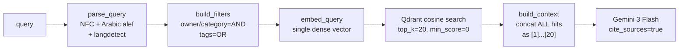
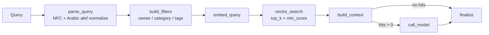
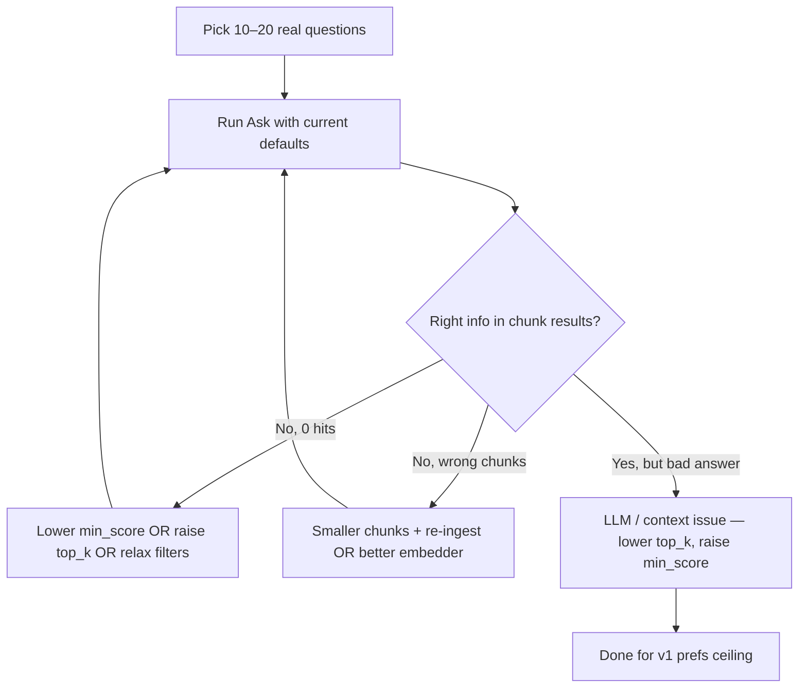

# OPUS

I dug through the search graph (`agent/graph.py` + `helpers.py`), the chunker, the Qdrant vector store, the embedder resolution, and your `default/preferences.json`. Below is what the pipeline actually does today, where it’s leaving recall/precision on the table, and what to change.

## How retrieval works today



Key facts pulled from prefs + code:

| Stage | Current setting | Source |
|---|---|---|
| Embedder | `null` → fallback `sentence-transformers/paraphrase-multilingual-MiniLM-L12-v2` (384‑dim, **128‑token** max) | `embedder.py` + `constants.py` |
| Chunking | 1200 chars, overlap 150, heading‑aware markdown then `RecursiveCharacterTextSplitter` | `chunker.py` |
| Retrieval | `top_k=20`, `min_score=0.0`, dense only | `vector_store.search_by_vector` |
| Rerank | None (memory has one, knowledge does not) | `preferences.json` |
| Context | All 20 hits concatenated and sent to LLM | `helpers.build_context` |
| Answering | `gemini-3-flash-preview`, temp 0.2, max 1600 tokens | tuning profile |

## The problems, ranked by leverage

### 1. Embedder is silently truncating your chunks (biggest issue)

`paraphrase-multilingual-MiniLM-L12-v2` has a **128‑token** max sequence. Your chunks are **1200 chars (~250–350 tokens)**. FastEmbed truncates the tail of every chunk before embedding, so:

- Roughly **half of every chunk is invisible to retrieval**.
- Late content under a heading (often the “meat” of a section) is never indexed.
- Headings near the top of a chunk dominate the vector.

This is the single biggest reason real questions miss obvious content.

### 2. No reranker → context dilution

You retrieve 20 hits and shove **all 20** straight into the LLM prompt. With 1200‑char chunks that’s ~5k tokens of context, much of it weakly relevant. Two compounding effects:

- “Lost in the middle”: Gemini’s answer quality drops as irrelevant chunks crowd the relevant ones.
- Citations get diluted — irrelevant `[n]` markers leak into answers.

Your memory pipeline already exposes a `reranker` preference block; knowledge has none.

### 3. `min_score = 0.0`

Cosine scores from MiniLM tend to be inflated; with no floor, even unrelated hits (score 0.1–0.2) make it into the prompt. There is literally no filter beyond `top_k`.

### 4. Dense‑only retrieval (no hybrid)

Pure dense embedding loses on:

- Proper nouns: “Hagrid”, “Voldemort”, “Selim”.
- Identifiers, dates, codes.
- Exact phrases.

Qdrant supports sparse vectors + dense fusion via RRF; you’re not using it. For an English/Arabic mixed corpus this hurts noticeably.

### 5. Single‑shot query → single embedding

No multi‑query rewrite, no HyDE, no sub‑question decomposition. Short or vague queries (“tell me about Harry’s school years”) only ever get one chance at the index.

### 6. Chunker isn’t aware of the embedder

`chunk_size` is in **characters**, embedder limits are in **tokens**. They’re tracked independently. If you later switch to OpenAI `text-embedding-3-small` (8192 tokens) you’d want **much bigger** chunks; if you keep MiniLM you’d want **smaller** ones. Today both extremes are wrong.

### 7. No deduplication / near‑dup collapse

If you re‑ingest, or two docs cover the same passage, the same content can fill 3–5 of your top‑20 slots. `build_context` just concatenates them.

### 8. Answering prompt doesn’t exploit metadata

`build_context` emits `[n] {title} §{heading}\n{text}` — but not `source_uri`, ingest date, tags, or owner. The model can’t disambiguate sources or prefer recent material.

### 9. Heading propagation can be lossy

`MarkdownHeaderTextSplitter` followed by `RecursiveCharacterTextSplitter.split_documents` keeps the heading metadata of the parent doc, but only the splitter’s metadata on the *original* split — the recursive pass can shed the path on deeply nested sections in some LangChain versions. Worth a unit test of `chunk_markdown` on a doc with 4–5 heading levels and overlap.

## What I’d change in `preferences.json` and code

### Preference edits (no code changes required)

```json
"knowledge": {
  "default_embedding_model": "openai:text-embedding-3-small",
  "default_tuning_profile": "knowledge_answering",
  "chunking": {
    "chunk_size": 1800,
    "chunk_overlap": 200,
    "markdown": { "respect_headings": true }
  },
  "retrieval": {
    "top_k": 30,
    "min_score": 0.25
  },
  "answering": {
    "model": null,
    "cite_sources": true,
    "language_policy": "match_query"
  }
}
```

Rationale:

- **`text-embedding-3-small`**: 1536‑dim, 8k token window, cheap, multilingual (handles Arabic fine), and it removes the silent truncation problem immediately. You’ll need to wipe `~/.../default/knowledge/qdrant/` (or re‑ingest) since dimension changes from 384 → 1536 — `_ensure_collection` enforces this.
- **`chunk_size=1800` / overlap 200**: With an 8k‑token embedder, larger semantic chunks are better; you stop fragmenting paragraphs. (If you stay on MiniLM, do the opposite: `chunk_size=400, overlap=60`.)
- **`top_k=30` + `min_score=0.25`**: pull more candidates but reject obvious noise.

### Code‑level upgrades (in order of impact)

1. **Add a knowledge reranker block** mirroring `memory.reranker`, and a `rerank_top_n` (e.g. 6). Insert a `rerank` node between `vector_search` and `build_context`. Trim the context to the reranked top‑N rather than passing all 30 hits to Gemini.
2. **Hybrid retrieval.** Add sparse vectors to the collection (BM25 or a SPLADE‑style model) and switch `query_points` to `Query.Fusion(RRF)` over dense + sparse. This is the single biggest precision boost for proper‑noun queries.
3. **Token‑aware chunking.** Replace `RecursiveCharacterTextSplitter` with a token‑based splitter sized to the active embedder (the chunker should read `self.embedder.max_tokens`), so the same `chunk_size` pref is meaningful across model swaps.
4. **Multi‑query / HyDE node** before `embed_query`. Cheap with `gemini-3-flash` — generate 3 reformulations or one hypothetical answer, embed all, union candidates, then rerank.
5. **Dedup pass** in `build_context`: collapse hits whose normalized text Jaccard > 0.85 or share `document_id + heading_path`.
6. **Enrich `build_context`** with `source_uri` and `ingested_at` so the LLM can prefer authoritative/recent sources.
7. **Optional**: lift the `min_score` floor onto the **reranker** score instead of the raw cosine, once you add reranking — cross‑encoder scores are much more meaningful than cosine.

## TL;DR

- **Root cause #1**: your default embedder (`paraphrase-multilingual-MiniLM-L12-v2`) has a **128‑token cap** while you chunk at **1200 chars (~250–350 tokens)** → roughly half of every chunk is **never indexed**. Switch to `openai:text-embedding-3-small` (or `BAAI/bge-m3`) and re‑ingest.
- **Root cause #2**: **no reranker** and **`min_score=0.0`**, so all 20 hits — relevant or not — are concatenated into the LLM prompt. Add a cross‑encoder rerank node, keep the top **5–8**, and raise `min_score` to **~0.25**.
- **Biggest single quality win after that**: **hybrid retrieval** (dense + sparse with RRF fusion in Qdrant) — fixes proper‑noun/exact‑term misses.
- **Next tier**: token‑aware chunking tied to the active embedder, multi‑query/HyDE expansion, dedup before context assembly, and richer per‑hit metadata in the prompt.

### Reflecting build updates

Changing `knowledge.default_embedding_model` changes the vector dimension. `_ensure_collection` will refuse to swap a populated collection, so you’ll need to either:

1. Delete every document via the admin Knowledge UI (clears Qdrant), **or**
2. Stop the server and remove `C:\Users\augr\AppData\Local\hiro\workspaces\default\knowledge\qdrant\` and `knowledge.db`, then re‑ingest.

We are operating under the workspace’s **no‑backward‑compatibility** rule, so a hard wipe + re‑ingest is the expected path here rather than a migration.


# Composer 2.5

You’re on a **pure dense-vector RAG pipeline** today: normalize query → embed once → Qdrant cosine search → pack chunks into context → LLM answer. That’s a solid v1 baseline, but retrieval quality is mostly capped by **embedding + chunking at ingest time** and **how many noisy chunks reach the LLM**.

---

## What the search graph actually does



There is **no query rewriting, HyDE, reranking, hybrid BM25, MMR, or per-document dedup** — all explicitly deferred to v2 in the design doc. `parse_query` only normalizes text and detects language (for the answer prompt, not retrieval).

---

## Default workspace preferences (structural defaults)

If your default workspace has a fresh `preferences.json`, these are the knowledge defaults from `WorkspacePreferences()`:

| Knob | Default | Effect on retrieval |
|------|---------|---------------------|
| **Embedding model** | `null` → FastEmbed `paraphrase-multilingual-MiniLM-L12-v2` (384-dim, local) | General-purpose multilingual; not strong on domain jargon or long-context nuance |
| **Chunk size / overlap** | 1200 / 150 | Moderate chunks; `respect_headings: true` splits on markdown headers first |
| **top_k** | 20 | Up to 20 chunks go to the LLM |
| **min_score** | 0.0 | **No score gate** — weak matches are included |
| **Answering model** | `null` → inherits `llm.default_chat` | Affects synthesis, not retrieval |
| **Tuning profile** | `knowledge_answering` (temp 0.2, max 1600 tokens) | Affects answer quality, not retrieval |

The Ask tab hardcodes the same defaults (`top_k=20`, `min_score=0`) unless you override per query.

**Compare to agent memory:** memory has `search.threshold` (default 0.1) and an optional cross-encoder reranker. Knowledge has neither.

---

## Highest-impact gaps (code-level, not just prefs)

### 1. Chunks are embedded without structural context

At ingest, only `chunk["text"]` is embedded. `title` and `heading_path` live in Qdrant payload but **are not part of the vector**. That hurts questions like “what does section X say about Y?” — the vector never saw the section title.

Context formatting adds headings only **after** retrieval, in `build_context`.

### 2. No reranking or hybrid search

Design doc non-goals for v1: reranker, BM25+dense hybrid. You get raw cosine top‑k only.

### 3. No diversity control

All 20 slots can come from the **same document** (overlapping chunks). No MMR, no max-per-document cap.

### 4. No adjacent-chunk expansion

A hit might be a fragment mid-section; surrounding chunks (`ord ± 1`) are not fetched to widen context.

### 5. Embedding model lock

Changing `knowledge.default_embedding_model` requires **deleting all indexed docs first**, then full re-ingest. So model upgrades are a deliberate migration, not a toggle.

---

## What you can do now (no code changes)

### Preferences tuning (Admin → Preferences → Knowledge)

1. **Raise `min_score`** — start around **0.25–0.45** and tune on real queries. With `min_score=0`, borderline chunks pollute the LLM context. The Ask tab already suggests “lower minimum score” when nothing matches — the opposite problem is usually **too much** weak context.

2. **Tune `top_k` by use case**
   - **Precise factual Q&A:** try **8–12**
   - **Broad synthesis across docs:** keep **15–25**
   - If you raise `top_k`, pair it with a non-zero `min_score`

3. **Adjust chunking, then re-ingest**
   - **Smaller chunks (600–900)** → better pinpoint retrieval, more vectors
   - **Larger overlap (200–300)** → less boundary loss
   - Chunk prefs affect **new ingests only** — re-ingest existing docs after changes

4. **Use metadata filters aggressively**
   - Categories, tags, owner, document scope in Ask tab
   - Reduces corpus noise before vector search

5. **Try a stronger embedding model (if you have API creds)**
   - e.g. `openai:text-embedding-3-small` or similar catalog embedding
   - Requires: delete all knowledge docs → change model → re-ingest everything
   - Often the single biggest recall/precision jump for technical corpora

6. **Set a dedicated answering model**
   - Doesn’t improve retrieval, but a model tuned for grounded citation (`knowledge_answering` profile, temp 0.2) reduces hallucination when context is partial

### Operational debugging

- Use **Graph runs** from the Ask tab to inspect `vector_search` hit counts and scores
- Compare **raw search** (`knowledge_search` tool / API) vs **full answer** — separates retrieval failure from LLM failure
- Check whether misses are **recall** (right chunk not in top_k) vs **precision** (wrong chunks ranked higher)

---

## What would materially improve retrieval (needs implementation)

Prioritized by effort vs impact:

| Priority | Change | Why |
|----------|--------|-----|
| **High / low effort** | Prefix chunks at embed time: `{title} / {heading_path}\n{text}` | Cheap; often large recall gain |
| **High / medium** | Cross-encoder reranker node (reuse memory’s `MemoryRerankerPreferences` pattern) | Re-order top 20 → best 5–8 for the LLM |
| **High / medium** | Per-document cap or MMR | Stops one doc from dominating context |
| **Medium** | Hybrid BM25 + dense (design doc notes FastEmbed sparse support) | Helps keyword/exact-term queries |
| **Medium** | Adjacent-chunk expansion on hit | Fixes “right section, wrong fragment” |
| **Lower priority** | Query rewriting / multi-query / HyDE | Helps vague questions; adds latency + cost |
| **Foundation** | Eval harness (even 20 hand-curated Q→expected-doc pairs) | Without this, tuning `top_k`/`min_score` is guesswork |

---

## Practical tuning workflow



---

## TL;DR

- **Current pipeline:** single dense vector search, no rerank/hybrid/dedup; defaults are permissive (`min_score=0`, `top_k=20`).
- **Quick wins:** raise `min_score`, tune `top_k`, use filters, shrink chunks and re-ingest, consider a stronger embedding model (full re-index required).
- **Biggest code gaps:** chunks embedded without title/heading context; no reranker (memory has one); no per-document diversity.
- **Default workspace prefs** are the structural defaults above unless you’ve customized `preferences.json` on disk — check Admin → Preferences → Knowledge for your live values.

We're in initial-development mode (no backward compatibility), so embedding model and chunking changes expect a clean re-ingest rather than migration — plan for that if you upgrade the stack.