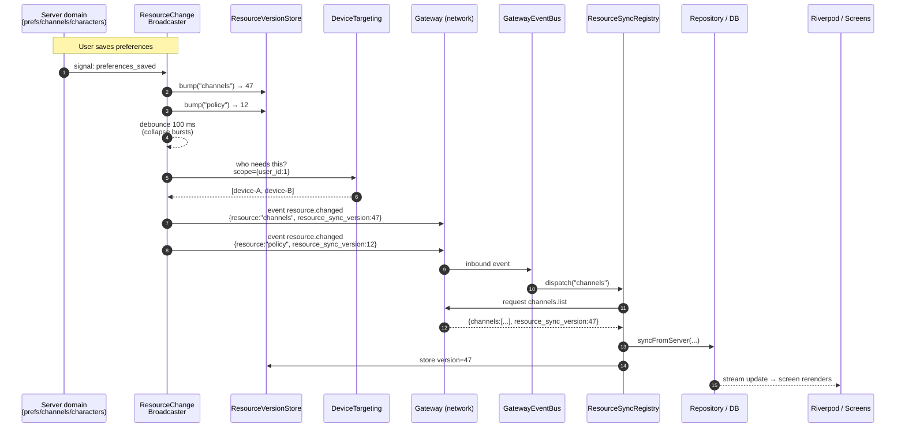
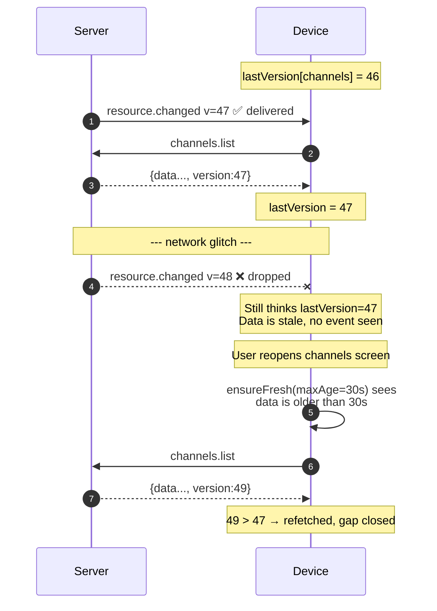
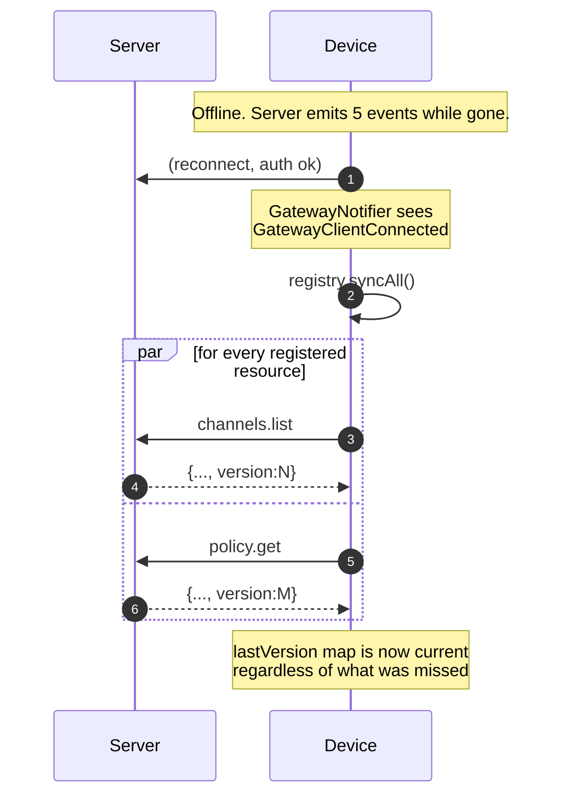

# Resource Sync — concept reference

> Status: Draft · Audience: anyone touching server↔device communication
> · Companion to `.cursor/plans/resource_sync_protocol_2bf4d8a1.plan.md`.

This document explains **what** Resource Sync is and **why** it exists. It is
the place to read once and refer back to whenever the model gets fuzzy.
Implementation steps live in the plan file, not here.

---

## 1. The mental model in two sentences

> **Events are hints. Requests are truth.**
> When state changes on the server, devices receive a tiny "this resource is
> dirty" event and reply with a `<resource>.list` request to pull the
> authoritative data.

Everything else in this document — versions, debounce, registries, retry —
exists only to make that one rule reliable and modular.

## 2. Why we need it

Before Resource Sync, every server-driven feature on Hiro grew its own ad-hoc
solution:

- A bespoke event type carrying full state (`server.info` with channels +
  policy bundled inside).
- A bespoke broadcaster on the server, subscribing to one or more domain
  signals.
- A bespoke `if (frame is X) refreshY()` branch inside Flutter's
  `GatewayNotifier`.

That works for one feature. It collapses by feature three or four. Adding
"characters", "voices", "providers", "audio assets", … on top of that pattern
is unreviewable, and `GatewayNotifier` becomes the place where all
domain-specific code accidentally ends up.

Resource Sync replaces the pattern with a single substrate:

- **One** event type on the wire.
- **One** broadcaster on the server.
- **One** event bus + **one** sync registry on the device.
- A new feature is added by registering its name in two places. The transport
  layer never learns the feature exists.

## 3. Vocabulary

| Term | Meaning |
|---|---|
| **Resource** | A named bucket of state owned by the server and cached by devices. Examples: `channels`, `policy`, later `characters`, `voices`. |
| **`resource.changed` event** | A "this resource is dirty" hint: `resource`, `resource_sync_version`, optional `ids`, `scope`, `reason`. Carries no domain rows. |
| **`<resource>.list` / `.get` request** | Authoritative read path. Success `data` includes `resource_sync_version` for Tier 2 resources (`channels`, `policy`). |
| **`resource_sync_version`** | Monotonic integer per resource on the server process; echoed on hints and read responses. Distinct from `PolicySnapshot.version` (schema version). Device drops duplicate hints when `hint == lastSeen`. |
| **Coalescing / debounce** | Wait ~100 ms after a domain change before emitting the event; collapse bursts into one event per resource. |
| **Selective invalidation (`ids`)** | Optional list of affected entity ids in the event, so the device can refetch one row instead of the whole list. |
| **Scope** | Optional `{ user_id, … }` filter saying who the change is for. |
| **Targeting** | Server-side function turning a `scope` into the list of devices that should receive the event. Today: all connected devices. |
| **`ResourceRegistry`** (server) | Declarative `name → on_signals` mapping. Single extension point on the server. |
| **`ResourceChangeBroadcaster`** (server) | The one component that listens to every domain signal in the registry, bumps the version, debounces, and emits via `Targeting`. |
| **`ResourceSyncRegistry`** (device) | Mirror image: maps `resource name → "how to fetch and store it"`. Single extension point on the device. |
| **`GatewayEventBus`** (device) | Tiny dispatcher that routes inbound events by `event.type`, mirroring the server's `EventHandler`. |
| **Connect-time `syncAll`** | On every (re)connect, the device walks the `ResourceSyncRegistry` and refetches everything. Hard reconcile point. |
| **Stale-while-revalidate** | When a screen opens, refetch its resource if the local copy is older than N seconds. |
| **Idempotent request retry** | If the connection drops while a `*.list`/`*.get` is in flight, re-issue it on reconnect. |
| **`PolicyNotifier`** | Renamed `ServerInfoNotifier`, narrower contract — only the policy snapshot, no embedded channels. |

## 4. Wire protocol

### `resource.changed` event payload

```json
{
  "type": "resource.changed",
  "data": {
    "resource": "channels",
    "ids": ["server-3"],
    "resource_sync_version": 47,
    "scope": { "user_id": 1 },
    "reason": "preferences_saved"
  }
}
```

`ids`, `scope`, `reason` are optional. `resource` and `resource_sync_version` are required on Tier 2 servers.

### `<resource>.list` / `.get` response

```json
{
  "status": "ok",
  "data": {
    "channels": [...],
    "resource_sync_version": 47
  }
}
```

For `policy.get`, `resource_sync_version` sits beside `version` (schema) and `policy`.
## 5. Reliability model

Reliability comes from **convergence**, not from making events themselves
reliable. We never queue durably, never ack events, never replay.

| Failure | Mitigation |
|---|---|
| Event dropped in flight | Next hint or `syncAll` brings `resource_sync_version` forward; duplicate hints skipped only when `hint == lastSeen`. |
| Server emits while device offline | Connect-time `syncAll`. |
| Request response lost | 15 s timeout + retry-on-reconnect for idempotent requests. |
| Long sleep / suspend | Stale-while-revalidate when screen reopens. |
| Burst of domain signals | 100 ms server-side debounce per resource. |

Worst case cost: **one extra round trip**.

## 6. Diagrams

### 6.1 End-to-end happy path



### 6.2 Why versions matter (missed event recovery)



### 6.3 Reconnect (offline-then-online)



### 6.4 Components & layers

```mermaid
flowchart LR
    subgraph SERVER["Server (hirocli)"]
        direction TB
        subgraph DOM["Domain signals"]
            S1[preferences_saved]
            S2[channel_changes]
            S3[character_changes]
        end
        RR[["ResourceRegistry<br/>(declarative specs)"]]
        RCB[["ResourceChangeBroadcaster<br/>· subscribes once<br/>· debounces 100 ms<br/>· bumps version"]]
        RVS[(ResourceVersionStore)]
        DT[["DeviceTargeting<br/>scope → device ids"]]
        EF[["EnvelopeFactory<br/>resource_changed_event(...)"]]
        RH[["RequestHandler<br/>· channels.list<br/>· policy.get<br/>· …"]]
        TOOLS[("Tools<br/>ConversationChannelListTool<br/>PolicyGetTool")]
        S1 --> RCB
        S2 --> RCB
        S3 --> RCB
        RR -. specs .-> RCB
        RCB --> RVS
        RCB --> DT
        RCB --> EF
        RH --> TOOLS
        RH --> RVS
    end

    subgraph WIRE["Gateway / WebSocket"]
        EVT([resource.changed event])
        REQ([&lt;resource&gt;.list / .get request])
    end

    EF --> EVT
    REQ --> RH

    subgraph DEVICE["Device (Flutter)"]
        direction TB
        GN[["GatewayNotifier<br/>(transport only)"]]
        GEB[["GatewayEventBus<br/>route by event.type"]]
        GRC[["GatewayRequestClient<br/>· request/response<br/>· idempotent retry"]]
        RSR[["ResourceSyncRegistry<br/>name → fetcher"]]
        DVS[(ResourceVersionStore<br/>persistent)]
        REPOS[(Repositories / Drift DB)]
        SCREENS{{Screens<br/>ensureFresh(...)}}
        GN --> GEB
        GN --> GRC
        GEB -- "resource.changed" --> RSR
        GN -- "on connect" --> RSR
        SCREENS -- "on entry" --> RSR
        RSR --> GRC
        RSR --> DVS
        RSR --> REPOS
        REPOS --> SCREENS
    end

    EVT --> GN
    GRC --> REQ
```

### 6.5 Adding a new feature (mechanical recipe)

```mermaid
flowchart TB
    A([New feature: characters]) --> B[/Server: write CharactersListTool<br/>register handler 'characters.list'/]
    B --> C[/Server: ResourceRegistry.register<br/>ResourceSpec name='characters'<br/>on=['character_changes']/]
    C --> D[/Device: CharacterRepository.syncFromServer/]
    D --> E[/Device: registry.register 'characters', fetcher/]
    E --> F([Done. No transport changes,<br/>no protocol changes.])
    style F fill:#1f6f3f,color:#fff
```

Four files. None of them are `GatewayNotifier`, `EnvelopeFactory`, the wire
schema, or the broadcaster. That is the test for "is the architecture
working".

## 7. Worked example — "user saves preferences"

1. Admin UI persists new preferences. The domain layer fires the existing
   `preferences_saved` signal (no change to the domain code).
2. `ResourceChangeBroadcaster` is subscribed. It looks at the
   `ResourceRegistry` and finds two specs that listen to that signal:
   `channels` (because capabilities are derived from policy) and `policy`
   (because the policy itself changed).
3. For each, `ResourceVersionStore.bump(name)` increments the version.
4. The broadcaster schedules a coalesced flush per resource. If the admin
   saves three times in 200 ms, only one event per resource is emitted.
5. On flush, `DeviceTargeting.get_device_ids_for_scope(scope)` returns the
   list of devices that should hear this. Today: all connected approved
   devices.
6. Two `resource.changed` envelopes go out: one for `channels`, one for
   `policy`, each with its new `version`.
7. Each device's `GatewayEventBus` receives the events and routes them to the
   `resource.changed` handler.
8. The handler consults the `ResourceSyncVersionStore` (device side) — if the
   incoming `resource_sync_version` **equals** `lastSeen` (duplicate hint), it
   drops. It does **not** treat `hint < lastSeen` as skippable: after a HiroServer
   restart counters reset lower while `lastSeen` may still reflect the old process
   until connect-time `syncAll` applies an authoritative response. Otherwise it
   calls `ResourceSyncRegistry.sync(resource)`.
9. The registered fetcher fires `channels.list` (or `policy.get`),
   `syncFromServer` writes to the Drift DB, the version is stored.
10. The Drift watch streams update, Riverpod rebuilds the screens.

No part of this involves `GatewayNotifier`, `EnvelopeFactory`, or the wire
schema. That is by design.

## 8. Tier breakdown (what's mandatory vs. cosmetic)

The plan is structured in three tiers that can ship independently. Use this
to negotiate scope.

| Tier | What it delivers | Why you'd ship it |
|---|---|---|
| **Tier 1 — minimal** | Generic `resource.changed` event + `ResourceRegistry` + `ResourceSyncRegistry` + `GatewayEventBus`. Optional 100 ms debounce per resource on the server. | Modular substrate: hints only, authoritative reads via `*.list` / `*.get`. |
| **Tier 2 — reliability** | `resource_sync_version` field on events and list/get responses, persistent last-seen map on device, duplicate-hint skip (`hint == lastSeen`), idempotent read replay after reconnect. | Pays off when networks flap or the server fans out duplicate hints. **Implemented.** |
| **Tier 3 — cleanup** | `PolicyNotifier` (narrow policy snapshot), delete `ServerInfoBroadcaster`, delete the `server.info` event, rename `server.info.get` → `policy.get`. | Cosmetic clarity on top of Tier 1+2. **Implemented.** |

**Implementation status:** Tier 1 + Tier 2 + **Tier 3** are implemented (`policy.get` / `PolicyNotifier`, no `server.info` push path).

## 9. Conventions and rules (replaces an `.cursor/rules` rule)

When adding any **server-driven feature** that the device needs to display or
react to, follow this checklist instead of inventing a new event type or
broadcaster:

1. Decide the **resource name** (lowercase, plural noun: `characters`,
   `voices`, `providers`).
2. **Server**:
   - Author a `Tool` for the read path (per
     `consider-creating-tools-first.mdc`).
   - Register `<name>.list` (or `<name>.get`) in `request_methods.py`.
   - Add a `ResourceSpec` entry — extend `DEFAULT_RESOURCE_REGISTRY` in
     `hiroserver/hirocli/src/hirocli/runtime/resource_registry.py`, or inject a
     custom `ResourceRegistry` when constructing `ResourceChangeBroadcaster`.
   - Make sure each domain mutation fires the listed signal — that's how
     versions get bumped.
3. **Device**:
   - Add a repository with `syncFromServer(serverList)`.
   - Register a fetcher in
     `device_apps/lib/application/sync/resource_sync_bootstrap.dart`
     (`wireResourceSync` / `refresh…` helpers — do not add resource names to
     `GatewayNotifier`).
4. **Do not**:
   - Add a new event type for "<feature> changed".
   - Add a branch to `GatewayNotifier`.
   - Embed full state inside an event payload.
   - Build a feature-specific broadcaster.

If you find yourself wanting to do any of those four, re-read sections 1–3 of
this document. The pattern almost always still applies; if it really doesn't,
that's a design conversation, not an ad-hoc bypass.

## 10. Open questions / future extensions

- **Multi-user scoping.** `scope.user_id` is in the schema but unused today.
  When a second user appears, `DeviceTargeting` filters and nothing else
  changes.
- **Per-id selective fetch.** `ids` is in the schema. We don't act on it yet
  — device always refetches the whole list. We can wire it up per resource
  later when list sizes justify it.
- **Resource version persistence on the server.** Currently in-memory; resets
  on restart. Devices treat unknown/lower as "definitely refetch", so this is
  safe but means an extra round of full refetches after every server restart.
  Persist if/when that becomes a measured problem.
- **Cross-resource consistency.** If `policy` and `channels` both change in
  one transaction, the device sees them as two separate events with separate
  versions. Today this is fine; if it ever isn't, introduce a transaction id
  in the event and apply atomically on the device.

## 11. Reading order

If you're new to this:

1. Sections 1, 2, 3 (mental model + vocabulary).
2. Section 6.4 (the components diagram) and 6.1 (the happy-path sequence).
3. Section 7 (the worked example). At this point you understand the system.
4. Section 9 (the rules). Bookmark this one.
5. Open the plan file when you actually want to do the work.

