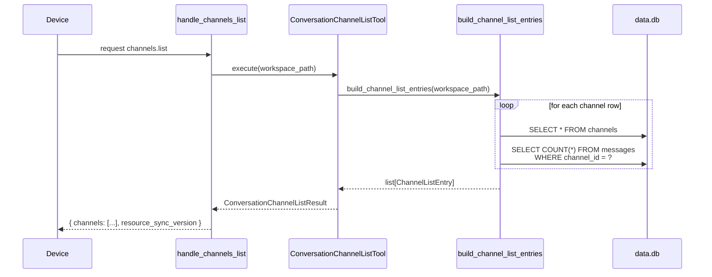
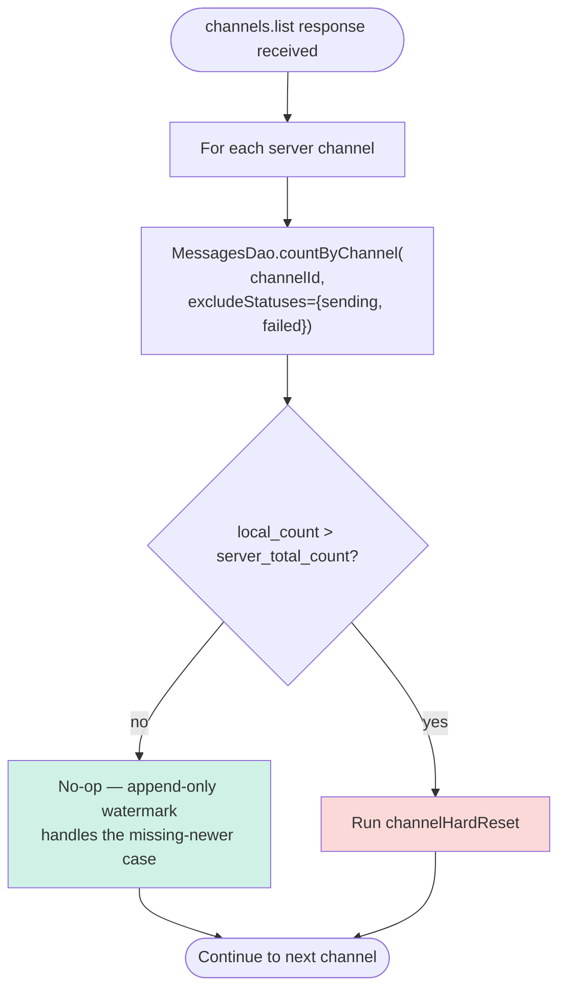
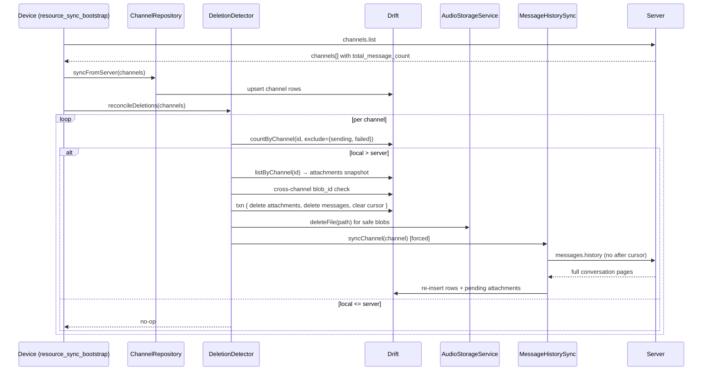

# Server-Side Deletion Detection — requirements/design

> Status: Proposal. Audience: AI coding agent and human reviewers implementing
> client-side reset of a channel's local message mirror when messages are
> deleted on the server outside the device's view.
>
> Related docs: `docs/message-audio-history-storage.md` (the local mirror this
> reconciles against, esp. §1.1 channel identity and §8 device behavior),
> `docs/resource-sync.md` (the events-are-hints / requests-are-truth substrate
> driving when devices reload), and
> `mintdocs/architecture/concepts/message-persistence/device-history-sync.mdx`
> (the empty-device load and watermark loops this design extends).

We follow workspace rules: **no backward compatibility, no migrations, no
wrappers**. The shapes below describe the desired end state; the no-orphan
guarantee is enforced at the device by full per-channel reset, not by
incremental tombstones.

## 1. Goal

When a server operator deletes one or more messages from a channel (out-of-band
admin action, manual SQL, retention policy, etc.), the device's local Drift
mirror must converge to the server's set without requiring a manual app
reinstall or browser site-data clear.

The device must:

- detect the divergence cheaply, on the existing `channels.list` round-trip;
- fully reset only the affected channel's local rows + audio attachments;
- re-pull the channel from scratch on the next `messages.history` cycle;
- never delete cross-channel data (audio blobs shared with other channels).

### 1.1 Non-goals

- Per-message tombstones or `messages.deleted` events — explicitly out of
  scope. The cheapest correct primitive is a per-channel count check, not a
  delta stream.
- Server-side deletion UX — no admin UI, no CLI tool, no API surface to
  *cause* deletions. This design only handles **detecting** deletions that
  happened by some other means.
- Detecting *insertions* the device missed — already handled by the existing
  watermark-keyed `messages.history(after=...)` loop.
- Detecting per-message *edits* — out of scope; messages are immutable today.
- Multi-device coordination — every paired device runs this independently
  against its own local mirror.

## 2. Current state

| Area | Current behavior | File |
|---|---|---|
| Server-side deletion | No tooling exposed; possible only via direct SQL on `messages` and `message_attachments`. | n/a |
| Device sync model | Append-only by `(created_at, external_id)` cursor. `messages.history(after=watermark)` returns only newer rows; deletions are silent absences. | `device_apps/lib/application/sync/message_history_sync.dart` |
| Device set reconciliation | None for messages. `ChannelRepository.syncFromServer` does have `deleteMissing` for *channels*; no equivalent for messages. | `device_apps/lib/data/repositories/channel_repository_impl.dart` |
| `channels.list` payload | Returns metadata per channel: `id`, `name`, `type`, `character_id`, `user_id`, `description`, `thumbnail_mtime_ns`, `created_at`, `last_message_at`, `character`, `capabilities`. **No message count.** | `hiroserver/hirocli/src/hirocli/domain/server_info.py` (`ChannelListEntry`, `build_channel_list_entries`) |
| Hard-reload primitive | Not implemented yet; sketched in prior design discussions. Requires `MessagesDao.deleteByChannel`, `MessageAttachmentsDao.deleteByChannel`, and `ChannelsDao.clearLastHistorySyncedCursor`. | n/a |
| Outcome on the device | Deleted messages stay in the local mirror indefinitely, across F5 / restart / reconnect. Audio still plays from local cache. | n/a |

## 3. Requirements

| Requirement | Design decision |
|---|---|
| Detection signal | Per-channel `total_message_count` returned in `channels.list`. |
| Detection check | Local count > server count → reset that channel. |
| Trigger points | Wherever `channels.list` already runs: connect-time `syncAll`, `resource.changed:channels`, stale revalidation. No new trigger types. |
| Reset granularity | Per channel. Other channels are untouched even if the server deletion was global. |
| Audio safety | Before deleting any audio file from disk, confirm no `message_attachments` row in another channel still references the same `blob_id`. |
| In-flight outbound | Do not count `status ∈ {sending, failed}` rows in the local total. They have not yet been acked by the server and must not trigger a false reset. |
| Idempotence | Running the check twice in a row produces zero side effects after the first reset converges. |
| Failure tolerance | If reset partially fails (DB transaction OK but file delete fails), the next sync still converges and the orphaned file is harmless (filename is `<blob_hex>.<ext>`). |

## 4. Server data model

No new tables. Extend the existing `ChannelListEntry` shape with one integer
field.

```python
class ChannelListEntry(BaseModel):
    id: int
    name: str
    type: str
    character_id: str
    user_id: str
    description: str
    thumbnail_mtime_ns: int = 0
    created_at: str
    last_message_at: str | None = None
    total_message_count: int  # NEW — count of rows in messages where channel_id = self.id
    character: ServerInfoCharacter
    capabilities: MediaPreferences
```

Field notes:

- `total_message_count` is the unfiltered row count. It includes both `user`
  and `agent` rows. It does **not** include `message_attachments` — those are
  child rows whose presence is implied by the parent message.
- The count is computed at request time. No caching, no incremental counter.
  At expected channel sizes (≤ tens of thousands of rows) `SELECT COUNT(*)`
  on an indexed `channel_id` column is sub-millisecond.

## 5. Server write path

Extend `build_channel_list_entries()` in `domain/server_info.py` to add one
`SELECT COUNT(*)` per channel. The `messages` table already has
`channel_id` indexed (foreign key constraint).

```python
def _count_messages(workspace_path: Path, channel_id: int) -> int:
    with sqlite3.connect(str(data_db_path(workspace_path))) as conn:
        row = conn.execute(
            "SELECT COUNT(*) FROM messages WHERE channel_id = ?", (channel_id,)
        ).fetchone()
        return int(row[0]) if row else 0
```

Sequence:



A future `messages_count` column on `channels` (denormalized counter) can
subsume the per-request COUNT once the channel cardinality grows past
~100k rows. Out of scope for phase 1.

## 6. `channels.list` response

Returned to the device with the same envelope as today, plus the new field.

```json
{
  "channels": [
    {
      "id": 42,
      "name": "General",
      "type": "user",
      "character_id": "char_abc",
      "user_id": "user_xyz",
      "description": "",
      "thumbnail_mtime_ns": 0,
      "created_at": "2026-05-01T00:00:00Z",
      "last_message_at": "2026-05-09T10:00:00Z",
      "total_message_count": 27,
      "character": { "id": "char_abc", "name": "Jamie" },
      "capabilities": { "...": "..." }
    }
  ],
  "resource_sync_version": 12
}
```

## 7. Device behavior

### 7.1 Local data model (Drift)

No schema change. The detection is a runtime comparison between
`server_total_count` (from the response) and `local_count` (from the local
mirror).

`MessagesDao` gains:

```dart
Future<int> countByChannel(String channelId, {Set<String> excludeStatuses = const {}}) async {
  final query = selectOnly(messages)..addColumns([messages.id.count()]);
  query.where(messages.channelId.equals(channelId));
  if (excludeStatuses.isNotEmpty) {
    query.where(messages.status.isNotIn(excludeStatuses.toList()));
  }
  final row = await query.getSingle();
  return row.read(messages.id.count()) ?? 0;
}

Future<void> deleteByChannel(String channelId) async {
  await (delete(messages)..where((m) => m.channelId.equals(channelId))).go();
}
```

`MessageAttachmentsDao` gains:

```dart
Future<List<MessageAttachmentRecord>> listByChannel(String channelId) async {
  final query = select(messageAttachments).join([
    innerJoin(messages, messages.id.equalsExp(messageAttachments.messageId)),
  ])..where(messages.channelId.equals(channelId));
  final rows = await query.get();
  return rows.map((r) => r.readTable(messageAttachments)).toList();
}

Future<void> deleteByChannel(String channelId) async {
  final attIds = await (selectOnly(messageAttachments)..addColumns([
    messageAttachments.messageId,
    messageAttachments.slotIndex,
  ])
  ..join([
    innerJoin(messages, messages.id.equalsExp(messageAttachments.messageId)),
  ])
  ..where(messages.channelId.equals(channelId))).get();
  for (final a in attIds) {
    final mid = a.read(messageAttachments.messageId)!;
    final slot = a.read(messageAttachments.slotIndex)!;
    await (delete(messageAttachments)..where(
      (x) => x.messageId.equals(mid) & x.slotIndex.equals(slot),
    )).go();
  }
}
```

`ChannelsDao` gains:

```dart
Future<void> clearLastHistorySyncedCursor(String channelId) async {
  await (update(channels)..where((c) => c.id.equals(channelId))).write(
    const ChannelsCompanion(
      lastHistorySyncedAt: Value(null),
      lastHistorySyncedExternalId: Value(null),
    ),
  );
}
```

### 7.2 Detection + reset flow



The `>` (strictly greater) comparison is deliberate. `local_count <
server_total_count` means the device is just behind (new messages exist on
the server) — the existing `messages.history(after=watermark)` loop already
handles that. Only `local > server` indicates server-side deletion.

`local_count == server_total_count` is the steady state and short-circuits.

### 7.3 `channelHardReset(channelId)`

```mermaid
stateDiagram-v2
    [*] --> Snapshot
    Snapshot: Snapshot attachments<br/>(local_path, blob_id)<br/>for this channel
    Decide: Group by blob_id;<br/>for each blob,<br/>any other channel using it?
    SafeFiles: Files safe to delete<br/>(blob not used elsewhere)
    SharedFiles: Files to keep<br/>(shared with other channels)
    DBTxn: Drift transaction:<br/>delete attachments,<br/>delete messages,<br/>clear watermark
    DiskDelete: AudioStorageService.deleteFile<br/>(best-effort, async, logged on failure)
    Trigger: refreshMessageHistoryForChannel(<br/>channelId, force=true)

    [*] --> Snapshot
    Snapshot --> Decide
    Decide --> SafeFiles
    Decide --> SharedFiles
    SafeFiles --> DBTxn
    SharedFiles --> DBTxn
    DBTxn --> DiskDelete
    DBTxn --> Trigger
    Trigger --> [*]
```



Explicit ordering matters:

1. **Snapshot first, delete DB second, delete files third.** The snapshot
   step needs to query both this channel's attachments and (per blob_id)
   any other channel's attachments. Deleting DB rows first would lose the
   information needed for the cross-channel safety check.
2. **DB delete in one Drift transaction.** Attachments first (FK
   dependents), then messages, then `clearLastHistorySyncedCursor`. This
   makes the UI's empty-state flash atomic — at most one frame.
3. **File deletes happen after the transaction commits**, outside the
   transaction. Drift transactions and async I/O don't mix safely. File
   delete failures are logged but non-fatal — a stale file with the same
   `<blob_hex>.<ext>` name will simply be reused by the next sync via the
   `findReadyByBlobId` short-circuit.
4. **Re-pull is forced**, not deferred to TTL. The user just observed an
   empty channel; the immediate refill is the recovery UX.

### 7.4 Wire-call sequence on detection



### 7.5 UI behavior during reset

The reset is fast (single DB transaction) but produces an empty Drift
emission for the affected channel. The chat UI today renders that as the
"No messages yet. Send the first one!" placeholder for the brief window
between reset and re-pull.

For phase 1: accept the flash. It is brief enough on local DB ops that
users will rarely see it, and the recovery UX (messages refilling within
~RTT) is self-explanatory.

A future phase can override the empty-state placeholder with a
"Reconciling…" string when an `isReconcilingProvider(channelId)` flag is
true. Out of scope here.

## 8. Protocol changes

One contract change. **No new request methods, no new event types.**

### 8.1 `channels.list` response — extended channel entry

Today every entry in `channels[]` carries the fields listed in §6 minus
`total_message_count`. After this design, every entry carries
`total_message_count` as a required integer. Per workspace rules, the field
is mandatory and there is no compat shim.

### 8.2 Reference namespace

No change. No new ref kinds.

## 9. Tools and CLI

| Surface | Change |
|---|---|
| `ConversationChannelListTool` | The tool already returns `ConversationChannelListResult.channels` as `[ch.model_dump(mode="json") for ch in channels]`. Once `ChannelListEntry.total_message_count` is added, the tool transparently surfaces the new field. Update the tool's docstring to mention the field. |
| Admin UI | The admin frontend's channel list endpoint already serializes raw rows with its own typed shape — audit `admin_frontend/src/lib/api/chat-channels.ts` for whether to add the count to the admin TS type. Decision: add it; admins benefit from seeing per-channel size. |
| New CLI tool | None. A future `MessageDeleteTool` (server-side delete) is the natural pair for this feature but is explicitly out of scope. |

No new HTTP routes. No new request methods.

## 10. Logging

Per the **Human-first structured logging** rule. All entries are INFO
unless noted.

### Server

| Event | Logger | First arg | Key extras |
|---|---|---|---|
| `channels.list` served (extend existing log) | `REQUEST` | `Resource served — request:channels.list` (already exists) | already logs `count`, `version`; **add** `total_messages_sum` (sum across channels) |

### Device

| Event | Logger | First arg | Key extras |
|---|---|---|---|
| Deletion detected | `DeletionDetector` (new) | `⚠️ Server-side deletion detected — {channelId} · resync` | `local_count`, `server_count`, `gap` (= local − server) |
| Channel reset started | `DeletionDetector` | `🧹 Channel reset — {channelId} · purge` | `messages_to_delete`, `attachments_to_delete`, `safe_files`, `shared_files` |
| Channel reset complete | `DeletionDetector` | `✅ Channel reset — {channelId} · resync_triggered` | `elapsed_ms`, `files_deleted`, `files_failed` |
| File delete failed | `DeletionDetector` | `⚠️ Audio file delete — {channelId} · failed` | `path`, `error`; `exc_info=True` |

`peer` / `channelId` go first per the rule. Counts are readable extras.

## 11. Mintdocs updates

Workspace rule "Document-Executed-Plans" applies when this lands.

| Page | Change |
|---|---|
| `mintdocs/architecture/concepts/message-persistence/device-history-sync.mdx` | Add a new short subsection "Server-side deletion detection" under or near "Triggers", referencing the count-comparison check and the per-channel reset path. The "Possible improvements" bullet about per-message tombstones can be removed once this design lands. |
| `mintdocs/architecture/protocol/protocol-contract.mdx` | List `total_message_count` in the `channels.list` response shape. |
| `mintdocs/architecture/concepts/communication-manager.mdx` | One-line note in the channel-list section that the count powers device-side deletion reconciliation. |
| `mintdocs/build/first-time-setup.mdx` | No tooling change — skip. |

## 12. Implementation checklist

| Step | Server | Device |
|---|---|---|
| 1 | Add `total_message_count: int` to `ChannelListEntry` in `domain/server_info.py`. | Add `MessagesDao.countByChannel(channelId, {excludeStatuses})` and `deleteByChannel`. |
| 2 | Extend `build_channel_list_entries()` to compute the count via `_count_messages()`. | Add `MessageAttachmentsDao.listByChannel` and `deleteByChannel`. |
| 3 | Update `handle_channels_list` log line to include `total_messages_sum`. | Add `ChannelsDao.clearLastHistorySyncedCursor`. |
| 4 | Update mintdocs pages listed in §11. | Add `application/sync/deletion_detector.dart` exposing `reconcileDeletions(List<Map>)` and `channelHardReset(channelId)`. |
| 5 | (Optional follow-up, out of scope) Denormalized `channels.message_count` column maintained on every insert/delete. | Wire `reconcileDeletions` into `refreshChannels` in `application/sync/resource_sync_bootstrap.dart`, after `syncFromServer` and before signaling success. |
| 6 | n/a | Snapshot/cross-channel-safety logic for `blob_id`-keyed file deletion goes in `deletion_detector.dart`; reuse `AudioStorageService.deleteFile`. |
| 7 | n/a | Add the new logging entries from §10. |

## 13. Tests

Server:

- `channels.list` response includes `total_message_count` as an integer for
  every channel.
- count matches `SELECT COUNT(*) FROM messages WHERE channel_id = ?` for a
  freshly seeded workspace with mixed `user`/`agent` rows.
- count is 0 for a brand-new empty channel.
- count updates after `persist_inbound` adds a row (regression — guards
  against caching mistakes).
- count drops after manual `DELETE FROM messages WHERE channel_id = ?`
  (regression — guards against stale denormalization once the optional
  follow-up in §12 step 5 lands).

Device:

- `local == server` → no-op; no DAO writes, no `messages.history` call.
- `local < server` → no-op; the existing watermark sync handles the
  catch-up on its own.
- `local > server` → `channelHardReset` runs once; messages and attachments
  for that channel are zero post-reset, watermark is null, then re-pull
  refills.
- Outbound `sending`/`failed` rows do not contribute to the local count
  (regression — guards against false-positive resets while the user has
  unsent messages).
- Cross-channel blob_id is preserved: if the deleted channel had an audio
  attachment whose `blob_id` is also referenced by another channel, the
  on-disk file is **not** deleted; the other channel's playback still
  works.
- Cross-channel blob_id with no other reference: the file is deleted, and
  the next sync re-fetches the blob via `files.get`.
- File-delete failure during reset is logged but does not abort the reset;
  the next sync still converges.
- Idempotence: running detection twice in a row after a reset produces a
  single reset (the second pass sees `local == server` and short-circuits).
- Multi-channel mixed scenario: server deletes channel A's tail and adds
  to channel B in the same admin action; one `channels.list` response
  triggers reset of A and watermark catch-up of B.

## 14. Open decisions

| Decision | Proposed answer |
|---|---|
| Count granularity | Total per channel. Per-`sender_type` counts are not needed for detection. |
| Inclusion of soft-deleted server rows | None today. The `messages` table has no `deleted_at`; rows are hard-deleted. The check stays a raw `COUNT(*)`. |
| Live `messages.deleted` event | Not added. The cheapest correct primitive is the per-`channels.list` count check, which already runs on connect, on `resource.changed:channels`, and on stale revalidation. A live deletion event can be added later if real-time deletion UX becomes a requirement. |
| Threshold tuning | None. Any positive `local − server` triggers reset. No "tolerance window" — staleness implies divergence. |
| What about deleted channels? | Already handled by `ChannelsDao.deleteMissing` in `ChannelRepository.syncFromServer`. This design only adds the *messages-within-a-still-existing-channel* case. |
| Server-side count caching | Skip for phase 1. Re-evaluate if `channels.list` p99 latency exceeds the existing budget under realistic data volumes. |
| UI affordance during reset | None for phase 1. The brief empty-state flash is acceptable. Future phase can override with a "Reconciling…" placeholder gated on a Riverpod flag. |
