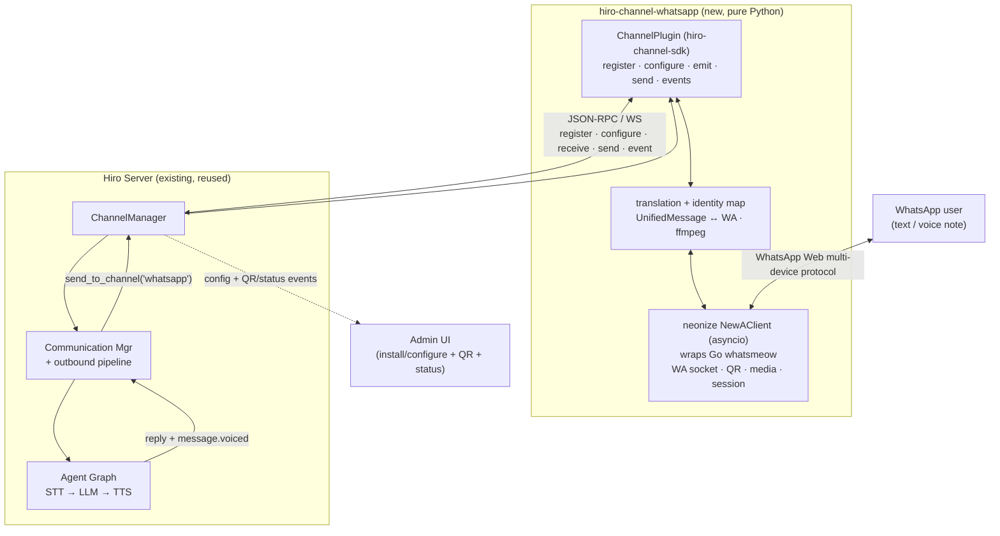
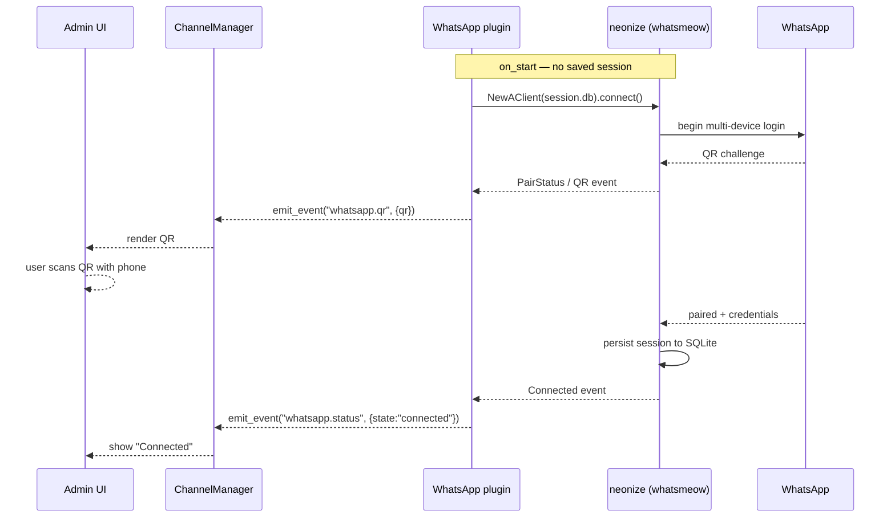
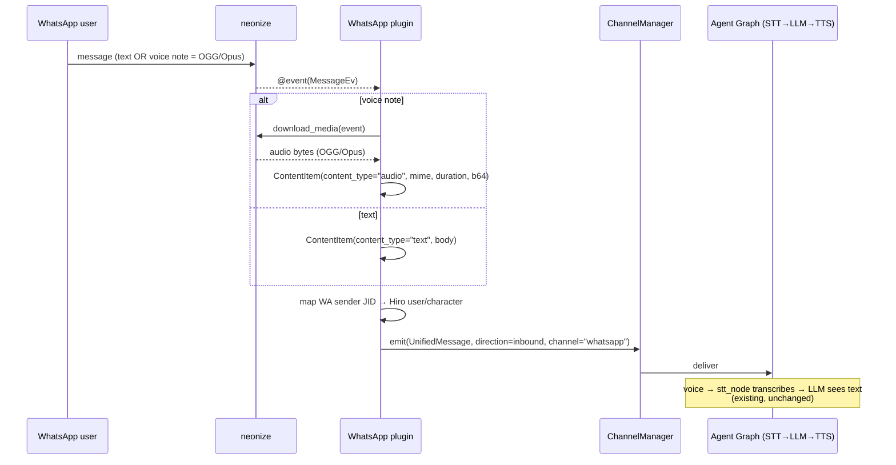
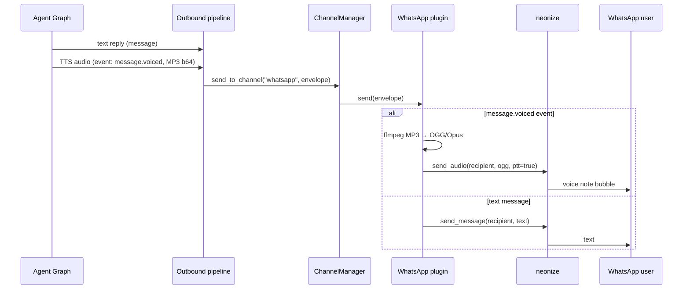
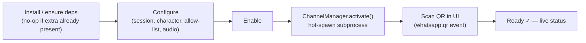
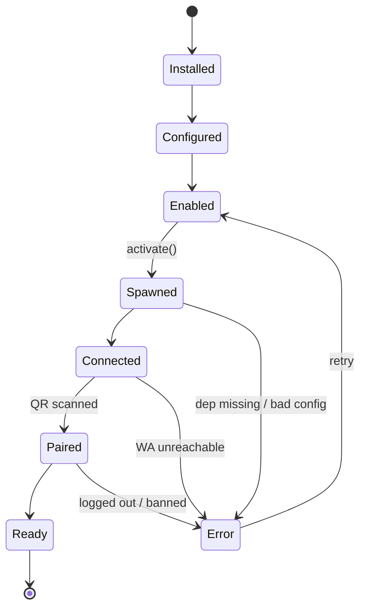

# WhatsApp Channel — High-Level Design

> **Scope.** Add a **WhatsApp channel** so a user can talk to their Hiro character over
> WhatsApp with **text and voice notes**, both directions. This is a **high-level design**:
> it fixes the architecture, the main workflows, and the component boundaries. Fine details
> (exact config keys, error/retry policy, identity-mapping edge cases) are deliberately left
> to the implementation phase.
>
> **Decision (locked by product):** use an **unofficial WhatsApp Web library**, *not* the
> Meta WhatsApp Business Cloud API (too expensive for regular users + business-verification
> paperwork). Trade-off accepted: this runs against WhatsApp's ToS and carries **account-ban
> risk**, and unofficial libraries are **brittle** across WhatsApp updates. The design confines
> that risk to one swappable component.
>
> **Decision (locked by product):** the client must be **Python**, not Node.js. Chosen library:
> **[neonize](https://github.com/krypton-byte/neonize)** — Python bindings over the Go
> `whatsmeow` multi-device library, shipped as prebuilt wheels (`pip install neonize`).
>
> **Implementation plan:** [`whatsapp-channel-implementation.md`](whatsapp-channel-implementation.md)
> (per-phase tasks, exact file paths/signatures, acceptance criteria).
>
> **Companions:** [Channel Plugins](../../hiro-docs/mintdocs/architecture/concepts/channel-plugins.mdx)
> (plugin subprocess model + JSON-RPC contract), [Agent Graph](../../hiro-docs/mintdocs/architecture/concepts/agent-graph.mdx)
> (STT → LLM → TTS pipeline this reuses), [network-topology](../../hiro-docs/mintdocs/architecture/concepts/network-topology.mdx).
>
> **Mode:** initial development — **no backward compatibility / no migration / no wrappers** (repo rule, abided).
>
> **Status:** Design draft. Not yet implemented.

---

## 1. The one-paragraph version

A WhatsApp channel is a **new channel plugin**, and the Hiro side already gives us everything
except the WhatsApp link itself: channels are subprocesses that speak JSON-RPC to the
`ChannelManager`, and the **STT (inbound audio) and TTS (outbound audio) pipeline already
exists and is channel-agnostic** — replies auto-route back to whatever channel the message
came in on. The only genuinely new thing is the WhatsApp connection, and **neonize** lets us
build it as a **single ordinary Python plugin**: it wraps the Go `whatsmeow` library (same
multi-device protocol as the well-known Node libraries) behind a prebuilt wheel with a native
**asyncio** client, so it drops straight into the plugin's existing async transport. No Node,
no sidecar, no extra process. All WhatsApp-specific brittleness/ban risk lives behind the
neonize client object, which we treat as a swappable adapter.

---

## 2. Key decisions

| Decision | Choice | Why |
|----------|--------|-----|
| Provider | **Unofficial WhatsApp Web library** | Business API too costly + paperwork (product decision). |
| Language | **Python** | Product decision; reuses `hiro-channel-sdk` and the whole channel pattern with zero language split. |
| Library | **neonize** | Actively maintained Python wrapper over Go `whatsmeow` — the same multi-device / E2EE / QR-pair protocol the Node libs use. Native **asyncio** client (`NewAClient`), sends/receives text + media + **voice notes**, prebuilt wheels for Windows/macOS/Linux (`pip install neonize`). No Go toolchain, no Node. |
| Plugin topology | **Single Python plugin** (`ChannelPlugin` subclass) | neonize removes the need for a Node sidecar — one process, standard `uv`-installed plugin like every other channel. |
| Distribution | **First-party but *optional*** | Authored/maintained by us, but **not mandatory** like `devices`; the user opts in. |
| Dependency isolation | **Heavy deps (`neonize`, `ffmpeg`) installed only on opt-in** | Channels are separate packages in separate envs; `hirocli` depends on no channel, so nothing pulls WhatsApp deps unless the user adds this channel. |
| Packaging | **Separate installable package** (like `devices`) | Opt-in `install` into its own isolated env; no bundling into core, no optional extra needed — per-plugin envs already isolate deps. |
| Activation | **Hot spawn/stop — no restart** | `ChannelManager` gains `activate(name)`/`deactivate(name)`; a newly-enabled channel comes alive live. |
| Onboarding | **CLI *and* Admin UI**, both over the same channel Tools | Reuse existing `ChannelSetupTool`/`ChannelEnableTool`/… per the Tools Architecture; both surfaces call the same `ChannelInstallTool`; UI owns configure/enable/pair/status. |
| Auth | **QR / pair-code** login, surfaced in **Admin UI** | Standard WhatsApp Web linking; neonize persists session so re-login is rare. |
| Session store | **SQLite** under the workspace | neonize's default; one file, no external DB needed. |
| v1 scope | **1:1 chats, single linked account** | Groups and multiple WhatsApp accounts are deferred (see §5). |
| Identity | **Allow-listed sender → default user + default character** | Single-user today (`get_default_user_id` = 1); becomes a real `number → user_id` table under future multi-user. |
| Audio inbound | **Pass through to existing STT** | WhatsApp voice notes are OGG/Opus — already accepted by OpenAI/Gemini STT. No transcoding. |
| Audio outbound | **Always transcode TTS → OGG/Opus** + `ptt=true` | A native voice note *requires* OGG/Opus (`audio/ogg; codecs=opus`); MP3-as-PTT is broken. `ffmpeg` invoked in-process; file-send is an emergency fallback only. |

**Why neonize over the Node libraries:** the underlying engine (`whatsmeow`) is the same class
of multi-device client as Baileys — same protocol, same personal-account support, same QR
pairing — but neonize exposes it to Python directly. That collapses what would have been a
two-language, two-process design into one plugin that looks like every other channel in the
repo.

---

## 3. Architecture

One process, one language. The `neonize` client is the only WhatsApp-aware part — if the
library breaks or we swap it, only the code touching `NewAClient` changes.

---

## 4. Main workflows

### 4.1 Pairing / login (QR)

First run has no saved session, so the user links the device by scanning a QR (like WhatsApp
Web). neonize surfaces the QR via its event stream; we forward it to the Admin UI.

On later restarts the saved SQLite session skips the QR and reconnects silently.

### 4.2 Inbound — text and voice

Inbound audio needs **no transcoding** — OGG/Opus is already a format STT accepts.

### 4.3 Outbound — text reply and voice reply

The reply inherits `routing.channel = "whatsapp"` from the inbound message, so the outbound
pipeline dispatches it to our `send()` automatically — the generic path every channel uses
(`send_to_channel(msg.routing.channel, …)`).

The one non-trivial step is the **MP3 → OGG/Opus transcode** before `send_audio(ptt=True)` so
the reply renders as a native voice bubble rather than a file attachment.

---

## 5. Distribution & activation model

- **First-party but optional.** The plugin is authored and maintained by us, but it is **not a
  mandatory channel** — unlike `devices`, which is special-cased via `MANDATORY_CHANNEL_NAME`
  and always active. WhatsApp is present only when the user chooses it.
- **Per-plugin dependency isolation.** Channels are separate packages that run as their own
  subprocesses in their own environments; `hirocli` does not depend on any channel package.
  Therefore `neonize` and `ffmpeg` are **only** pulled in when a user opts into WhatsApp — a
  user who never adds it pays nothing.
- **Packaging — separate installable package.** WhatsApp ships as its own distribution
  (`hiro-channel-whatsapp`), installed opt-in via `uv tool install` into its **own isolated
  environment**, exactly like `hiro-channel-devices`/`hiro-channel-echo`. Because per-plugin
  envs already isolate dependencies, there is **no bundling into core and no optional extra** —
  a user who never installs WhatsApp never pulls `neonize`/`ffmpeg`.
- **v1 scope — 1:1, single account.** One linked WhatsApp account per plugin instance, 1:1
  chats only. **Group chats** and **multiple accounts** are deferred (multi-account would mean
  multiple neonize clients / plugin instances, since whatsmeow is one-session-per-client).
- **Hot activation — no restart.** `ChannelManager` exposes `activate(name)` / `deactivate(name)`
  so enabling a channel spawns its subprocess live, and disabling it sends `channel.stop` and
  reaps the process. The scaffolding already exists (`_spawn_one`, the plugin WebSocket server,
  `_push_config`, event emission); on-demand activation exposes it outside startup.
- **Live reconfigure.** Config changes to a running plugin are pushed via `channel.configure`
  (`_push_config`) without a restart.

---

## 6. Installation, onboarding & lifecycle

### 6.1 Three independent actions

Onboarding is composed of three distinct steps; each is separately triggerable and separately
failable, and **none requires a server restart**:

| Step | Action | Trigger |
|------|--------|---------|
| **A. Install** | Ensure the package + deps are present (optional extra, or a curated first-party package install) | CLI or Admin UI |
| **B. Activate** | Spawn the plugin subprocess so it connects (`ChannelManager.activate`) | CLI or Admin UI |
| **C. Pair** | Scan the QR to link the WhatsApp account | Admin UI (QR event) |

### 6.2 Target onboarding flow (fully live)

Because neonize persists its session to SQLite, hot-spawn is primarily a **first-run** nicety;
after pairing, a normal restart reconnects silently.

### 6.3 Channel lifecycle state machine

Channel status is modeled as a **state machine**, not a single `enabled` boolean, so each
failure is visible and the UI can reflect exactly where a channel is:

### 6.4 Onboarding surfaces

- **CLI and Admin UI both drive the same channel Tools** (`ChannelSetupTool`,
  `ChannelEnableTool`, `ChannelDisableTool`, `ChannelListTool`, `ChannelRemoveTool`) — per the
  Tools Architecture, one Tool backs CLI + HTTP + UI.
- **Admin UI owns** configure, enable/disable, pair (QR), and live status. **Install** is
  offered from **both** the CLI (`hiro channel install whatsapp`) and an Admin UI button —
  both call the same `ChannelInstallTool`.
- **HTTP endpoints** expose the channel Tools to the Admin UI (config writes go through the
  server that owns `workspace.db`, like Preferences).
- **Feature-flag** the Admin page via the codegen'd feature ledger
  (`features.py` → `feature-registry.json`) so it ships hidden until ready.

---

## 7. Component responsibilities

| Component | Owns | Does **not** own |
|-----------|------|------------------|
| **WhatsApp plugin** (single Python `ChannelPlugin`) | Register/configure/start/stop; drive `neonize.NewAClient`; `emit()` inbound; `send()` outbound; UnifiedMessage ↔ WhatsApp translation; sender-JID → Hiro-identity mapping; ffmpeg transcode; forward QR/status via `emit_event`. | The core server contract; STT/TTS (reused). |
| **neonize client** (dependency) | WhatsApp socket, QR login, session persistence, send/receive, media download/upload, reconnect. | Anything Hiro-specific. |
| **ChannelManager** | Spawns/stops plugins, JSON-RPC transport, pushes config, routes outbound. **New:** `activate(name)`/`deactivate(name)` hot spawn/stop. | — |
| **Channel config API** | Server-owned write of the `channel_plugins.config` JSON + HTTP endpoints exposing the channel Tools. **New:** a config editor (today `channel setup` sets only the launch command + enabled — there is no path to set `config` keys yet). | — |
| **Agent Graph** (existing) | STT, LLM, TTS. | — |
| **Admin UI** | Install (optional) / configure / enable / pair (QR) / live status. | — |

---

## 8. Config, identity, and session state

- **Config** (stored in `workspace.db::channel_plugins.config`, edited via the new config
  editor / Admin UI): session-DB path, default character to route to, allow-list of permitted
  WhatsApp numbers (so strangers can't talk to your agent), audio on/off toggles. Exact keys TBD.
- **Identity mapping:** WhatsApp has two identities — the **linked account** (the agent's own
  number, chosen at QR pairing; the transport) and the **sender** (whoever messages it, a JID
  `<number>@s.whatsapp.net`). Only the **sender** maps to a Hiro identity. **v1 rule:** an
  **allow-listed sender number → the default `user_id` (`get_default_user_id`, = 1) → the
  default character** (`default_character_id`); unknown senders are ignored. All WhatsApp chat
  therefore lands in the single `mem_{user}_{character}` memory partition — consistent with the
  current single-user model. Under future multi-user this degenerate one-row rule becomes a real
  `number → user_id` table.
- **Session persistence:** neonize stores the linked-device session in a **SQLite DB** under
  the workspace (e.g. `<workspace>/channels/whatsapp/session.db`). Present + linked ⇒ no QR on
  restart. Deleting it forces fresh QR pairing (the "log out / re-link" operation).

---

## 9. Audio format handling (summary)

| Direction | WhatsApp format | Hiro pipeline | Action |
|-----------|-----------------|---------------|--------|
| Inbound voice | OGG/Opus | STT accepts OGG/Opus | **Pass through**, no transcode |
| Outbound voice | needs OGG/Opus (PTT) | TTS emits MP3 (OpenAI) / OGG (Gemini) | **Always transcode → OGG/Opus**, then `send_audio(ptt=True)` |

`ffmpeg` becomes a runtime dependency of the plugin (invoked directly from Python — no separate
process to manage beyond the ffmpeg call).

**Implementation note (record for later):** a native WhatsApp voice note *requires* the Ogg
container with the **Opus** codec and mimetype `audio/ogg; codecs=opus`, sent as a whatsmeow
`AudioMessage` with `PTT=true`. Sending **MP3 with `ptt=true` is a known-broken combination**
(it breaks playback on Android), so the transcode is mandatory, not optional. Sending the MP3
as a plain audio **document** (a tap-to-open file, not a voice bubble) remains only as an
emergency fallback if transcoding is unavailable.

---

## 10. Open questions (defer to implementation)

Scope, identity, audio format, packaging, and install surfaces are **decided** (§2, §5, §8, §9).
What remains genuinely open:

1. **Ban-resilience:** reconnect/backoff policy, and how a logged-out/banned session is detected
   and surfaced to the user (maps to the `Error` transitions in the §6.3 state machine).
2. **ffmpeg provisioning:** bundled with the plugin vs a documented system dependency (first-time
   setup); and confirm `neonize` prebuilt wheels cover the target OSes (esp. Windows).
3. **Allow-list UX:** how the permitted sender number(s) are entered/managed in the config editor
   (single number for v1 vs a small list).

**Deferred (not planned for v1):** WhatsApp **group chats** and **multiple accounts** (§5).

---

## 11. Suggested phasing

Phases are **vertical slices** — each ends at something testable, the riskiest/most-visible
parts come first, and audio is deliberately late. Text send/receive works by P2; audio only
appears at P6–P7 and blocks nothing before it.

| Phase | Goal | What's built | Test milestone |
|-------|------|--------------|----------------|
| **P1 — Link & receive (raw)** | Prove the hard part early | Plugin skeleton wrapping `neonize.NewAClient`; QR login; SQLite session persistence; inbound messages **logged**, not yet routed. Install via CLI + restart. | Pair by scanning the QR; send the number a WhatsApp text and watch it arrive in the logs. No reply yet. |
| **P2 — Text round-trip** | The core money shot | Wire inbound text → `emit(UnifiedMessage)` → agent → `send()` text back. Identity = default user + default character; allow-list defaulted. | Text the number → your character replies over WhatsApp. Full text conversation. |
| **P3 — Settings / config editor** | Make it configurable | Server-owned `config` write + the config editor (closes the current gap); allow-listed sender, default character, on/off. CLI/API first. | Set the allowed sender + character in settings and see them enforced (unknown numbers ignored). |
| **P4 — Admin UI onboarding** | See it in the app | Channels admin page: install button, enable/disable, configure form, **QR rendered in-UI**, connection status. Reuses the channel Tools over HTTP; feature-flagged via the ledger. | Install, pair (scan QR in the browser), and manage WhatsApp entirely from the Admin UI. |
| **P5 — Hot spawn/stop + lifecycle** | No-restart UX | `ChannelManager.activate/deactivate`; surface the §6.3 state machine as live status. | Toggle enable in the UI → it connects live, no restart; watch the state advance. |
| **P6 — Inbound voice** | Understand voice notes | Download voice note → `audio` ContentItem → existing STT → text reply. No new pipeline code expected. | Send a voice note → character understands it and replies (text). |
| **P7 — Outbound voice** | Reply in voice | Handle `message.voiced` in `send()`; ffmpeg MP3→OGG/Opus; `send_audio(ptt=true)`. | Character replies with a real WhatsApp voice-note bubble. |
| **P8 — Hardening** | Make it robust | Ban/logout detection + reconnect/backoff, error surfacing on the state machine, ffmpeg provisioning, packaging + first-time-setup docs. | Kill the network / log out the session → clean recovery and a clear status in the UI. |

**Ordering rationale:** P1 front-loads all neonize/QR/session/Windows-wheel risk before any UI
or audio investment; a real text conversation lands at P2 on a CLI install; install and settings
appear early (P1 CLI → P3 settings → P4 UI install) without building UI before the core works;
audio is isolated at the end and its two directions (P6/P7) are separable. **Flexibility:** P3
and P4 can swap — the UI form and the config-write are the same underlying capability; config is
ordered first only because the form needs something to write to.

---

## 12. TL;DR

- **New channel plugin, single pure-Python process** using **neonize** (Python wrapper over Go
  `whatsmeow` — same multi-device protocol as the Node libs, native asyncio, `pip install`).
  No Node, no sidecar.
- **First-party but optional**, shipped as a **separate installable package like `devices`**,
  with `neonize`/`ffmpeg` **isolated per-plugin** (installed only on opt-in). Not mandatory.
- **v1 scope:** 1:1 chats, single linked account. An **allow-listed sender → default user →
  default character** (single-user today).
- **Onboarding is three independent, restart-free steps** — install, activate (hot spawn/stop),
  pair (QR) — driven from CLI **and** an Admin UI page over the existing channel Tools (same
  `ChannelInstallTool`). Channel status is a **lifecycle state machine**, not a boolean.
- **Two new engine pieces:** `ChannelManager` **hot spawn/stop**, and a **config editor**
  (today only the launch command + enabled are settable; `config` keys are not).
- **STT/TTS and outbound routing already exist and are channel-agnostic** — we mostly wire, not
  build, the audio path.
- **Inbound voice is free** (OGG/Opus → STT). **Outbound voice** is **always** transcoded
  MP3→OGG/Opus before `send_audio(ptt=True)` — MP3-as-PTT is broken.
- **Auth = QR** in Admin UI; session persisted to SQLite so re-login is rare.
- **Accepted risk:** unofficial lib ⇒ ban/brittleness, confined behind the neonize client.
- **Genuinely open (§10):** ban-resilience policy, ffmpeg provisioning, allow-list UX.
  **Deferred:** group chats, multiple accounts.
